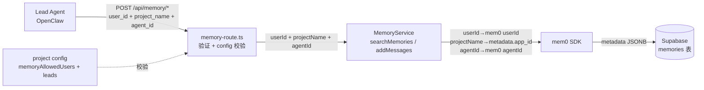
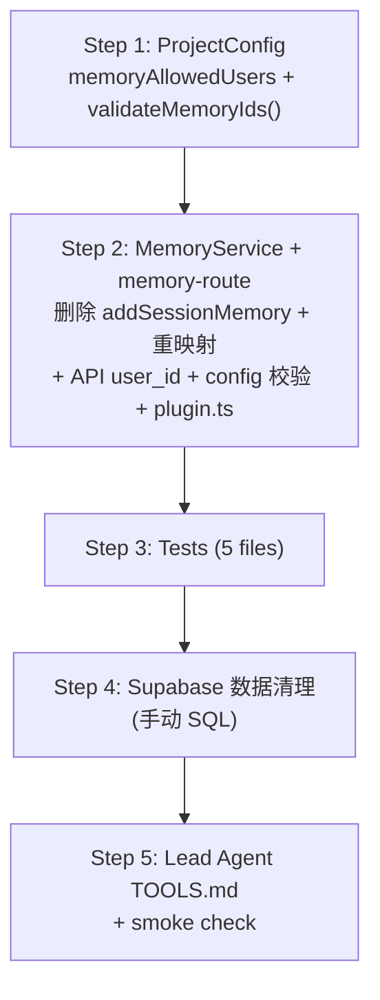

# Plan: Fix mem0 Entity Mapping

**Version**: v1.3.0
**Issue**: GEO-204
**Date**: 2026-03-22
**Source**: `doc/engineer/exploration/new/GEO-204-fix-mem0-entity-mapping.md`, `doc/engineer/research/new/GEO-204-fix-mem0-entity-mapping.md`
**Status**: codex-approved

## Overview

修正 mem0 MemoryService 的 entity 字段映射，使其对齐 mem0 官方语义。同时新增 config-based ID 校验，防止 typo 导致数据错乱。

### Entity 映射变更

| mem0 字段 | 旧值 | 新值 | 来源 |
|-----------|------|------|------|
| `userId` | `projectName` (e.g., `"geoforge3d"`) | API 传入的 `user_id` (e.g., `"annie"`) | 人类用户 |
| `app_id` (metadata/filter) | `"flywheel"` (硬编码) | `projectName` (e.g., `"geoforge3d"`) | 被管理的项目 |
| `agentId` | Lead agent ID ✅ | 不变 | Lead agent |

### user_id 标识规范

`user_id` 应使用**稳定标识符**，而非 display name。当前系统单用户（CEO Annie），使用 `"annie"` 作为过渡值。未来多用户场景应迁移到 Discord user ID（如 `"discord:123456789"`）或其他 platform-specific identifier。

### Scope 总结

1. MemoryService：删除死代码 `addSessionMemory()`，重映射 2 个活跃方法 + 1 个 wrapper
2. ProjectConfig：新增 `memoryAllowedUsers` 字段（避免与 `core/config-schemas.ts` 的 `allowedUsers: UserIdentifier[]` 冲突）
3. memory-route.ts：API 新增 required `user_id`，config-based ID 校验
4. 测试：5 个文件更新
5. Supabase：删除旧记录（手动 SQL）
6. Lead agent TOOLS.md 更新（同批 deploy）

## Architecture



## Step 1: ProjectConfig — 新增 `memoryAllowedUsers`

**文件**: `packages/teamlead/src/ProjectConfig.ts`

**命名说明**：使用 `memoryAllowedUsers` 而非 `allowedUsers`，因为 `packages/core/src/config-schemas.ts` 已有 `allowedUsers: UserIdentifier[]`（Cyrus issue delegation 的 access control），类型为 `string | { id: string } | { email: string }`。我们的字段语义不同（memory API 的 user_id 白名单），用独立名称避免混淆。

### 1.1 扩展 `ProjectEntry` interface

```ts
export interface ProjectEntry {
    projectName: string;
    projectRoot: string;
    projectRepo?: string;
    leads: LeadConfig[];
    generalChannel?: string;
    memoryAllowedUsers?: string[];    // 新增：memory API user_id 白名单
}
```

`memoryAllowedUsers` 为 **optional**（不是所有项目都开启 memory）。但 **fail-closed**：当 memory route 收到请求时，如果对应项目未配置 `memoryAllowedUsers`，`validateMemoryIds()` 返回 error（"memory not configured for this project"），拒绝请求。这确保所有使用 memory API 的项目都必须显式配置允许的用户列表，防止 typo 创建孤立的 memory silo。

### 1.2 `loadProjects()` 验证

在现有 leads 验证循环后面添加：

```ts
// Validate optional memoryAllowedUsers
const memoryAllowedUsers = entry?.memoryAllowedUsers;
if (memoryAllowedUsers !== undefined) {
    if (!Array.isArray(memoryAllowedUsers) || memoryAllowedUsers.length === 0) {
        throw new Error(
            `Project "${entry.projectName}" memoryAllowedUsers: must be a non-empty array of strings`,
        );
    }
    for (const u of memoryAllowedUsers) {
        if (typeof u !== "string" || u.length === 0) {
            throw new Error(
                `Project "${entry.projectName}" memoryAllowedUsers: each user must be a non-empty string`,
            );
        }
    }
}
```

### 1.3 新增 helper function

```ts
export function validateMemoryIds(
    projects: ProjectEntry[],
    projectName: string,
    agentId: string,
    userId: string,
): { valid: true } | { valid: false; error: string } {
    const project = projects.find((p) => p.projectName === projectName);
    if (!project) {
        return { valid: false, error: `unknown project_name: "${projectName}"` };
    }
    const knownAgents = project.leads.map((l) => l.agentId);
    if (!knownAgents.includes(agentId)) {
        return { valid: false, error: `unknown agent_id: "${agentId}" for project "${projectName}"` };
    }
    if (!project.memoryAllowedUsers) {
        return { valid: false, error: `memory not configured for project "${projectName}" (missing memoryAllowedUsers)` };
    }
    if (!project.memoryAllowedUsers.includes(userId)) {
        return { valid: false, error: `unknown user_id: "${userId}" for project "${projectName}"` };
    }
    return { valid: true };
}
```

### 1.4 更新项目配置

`loadProjects()` 读取配置的优先级：`FLYWHEEL_PROJECTS` env var > `~/.flywheel/projects.json`。需要更新**当前生效的配置源**。

**如果使用 `~/.flywheel/projects.json`**（当前开发环境）:
```diff
  {
      "projectName": "geoforge3d",
      "projectRoot": "/Users/xiaorongli/Dev/geoforge3d",
      "projectRepo": "xrliAnnie/geoforge3d",
+     "memoryAllowedUsers": ["annie"],
      "leads": [...]
  }
```

**如果使用 `FLYWHEEL_PROJECTS` env var**:
同样在 JSON 中添加 `"memoryAllowedUsers": ["annie"]`。

**验收检查**：Bridge 启动时确认 log 输出包含新字段（或在 `/health` 中添加检查）。

### 1.5 测试

在 `ProjectConfig.test.ts` 中新增：

- `memoryAllowedUsers` 为 undefined → 通过
- `memoryAllowedUsers` 为空数组 → throw
- `memoryAllowedUsers` 中有空字符串 → throw
- `validateMemoryIds()` 各种组合（valid project + lead, unknown project, unknown agent, unknown user）

## Step 2: MemoryService + memory-route — Entity 重映射 + API 扩展

> **注意**：MemoryService 方法签名变更和 memory-route 调用方更新必须同时进行（改签名后 route 编不过）。作为单个实现切片。

### 2A. MemoryService 修改

**文件**: `packages/edge-worker/src/memory/MemoryService.ts`

### 2A.1 删除 `addSessionMemory()` (L56-122)

整个方法删除（67 行）。无生产调用方。

### 2A.2 修改 `searchMemories()` (L129-165)

参数签名新增 `userId: string`，内部映射变更：

```ts
async searchMemories(params: {
    query: string;
    projectName: string;   // → filters.app_id
    userId: string;        // 新增 → mem0 userId
    agentId?: string;
    limit?: number;
}): Promise<string[]> {
    const results = await this.memory.search(params.query, {
        userId: params.userId,                         // 修改
        agentId: params.agentId,
        limit: params.limit ?? this.searchLimit,
        filters: { app_id: params.projectName },       // 修改
    });
    // ... 后续验证逻辑不变
```

### 2A.3 修改 `addMessages()` (L172-206)

同样新增 `userId: string`：

```ts
async addMessages(params: {
    messages: Array<{ role: "user" | "assistant"; content: string }>;
    projectName: string;   // → metadata.app_id
    userId: string;        // 新增 → mem0 userId
    agentId: string;
    metadata?: Record<string, unknown>;
}): Promise<{ added: number; updated: number }> {
    const result = await this.memory.add(params.messages, {
        userId: params.userId,                         // 修改
        agentId: params.agentId,
        metadata: {
            ...params.metadata,
            app_id: params.projectName,                // 修改
        },
    });
    // ... 后续验证逻辑不变
```

### 2A.4 修改 `searchAndFormat()` (L213-239)

新增 `userId: string` 参数，透传给 `searchMemories()`：

```ts
async searchAndFormat(params: {
    query: string;
    projectName: string;
    userId: string;        // 新增
    agentId?: string;
}): Promise<string | null> {
    try {
        const memories = await this.searchMemories({
            query: params.query,
            projectName: params.projectName,
            userId: params.userId,     // 新增
            agentId: params.agentId,
        });
        // ... 后续不变
```

### 2B. memory-route.ts — API 扩展 + Config 校验

**文件**: `packages/teamlead/src/bridge/memory-route.ts`

### 2B.1 函数签名变更

`createMemoryRouter()` 需要接收 projects config 以进行校验：

```ts
import type { ProjectEntry } from "../ProjectConfig.js";
import { validateMemoryIds } from "../ProjectConfig.js";

export function createMemoryRouter(
    memoryService: MemoryService,
    projects: ProjectEntry[],       // 新增
): Router {
```

### 2B.2 POST /search — 新增 `user_id` + 校验

在现有 `agent_id` 验证之后添加：

```ts
const { query, project_name, agent_id, user_id, limit } = req.body ?? {};

// ... 现有 query, project_name, agent_id 验证 ...

// 新增：验证 user_id
if (!isNonEmptyString(user_id)) {
    res.status(400).json({ error: "user_id must be a non-empty string" });
    return;
}

// 新增：config-based ID 校验
const idCheck = validateMemoryIds(projects, project_name, agent_id, user_id);
if (!idCheck.valid) {
    res.status(400).json({ error: idCheck.error });
    return;
}

// 调用 MemoryService（新增 userId 参数）
const memories = await withTimeout(
    memoryService.searchMemories({
        query,
        projectName: project_name,
        userId: user_id,          // 新增
        agentId: agent_id,
        limit: limit as number | undefined,
    }),
    TIMEOUT_MS,
);
```

### 2B.3 POST /add — 同样新增 `user_id` + 校验

```ts
const { messages, project_name, agent_id, user_id, metadata } = req.body ?? {};

// ... 现有 project_name, agent_id, messages 验证 ...

// 新增：验证 user_id
if (!isNonEmptyString(user_id)) {
    res.status(400).json({ error: "user_id must be a non-empty string" });
    return;
}

// 新增：config-based ID 校验
const idCheck = validateMemoryIds(projects, project_name, agent_id, user_id);
if (!idCheck.valid) {
    res.status(400).json({ error: idCheck.error });
    return;
}

memoryService.addMessages({
    messages: messages as Array<{ role: "user" | "assistant"; content: string }>,
    projectName: project_name,
    userId: user_id,          // 新增
    agentId: agent_id,
    metadata: metadata as Record<string, unknown> | undefined,
})
```

### 2B.4 plugin.ts — 传递 projects 到 router

在 `packages/teamlead/src/bridge/plugin.ts` 的 `createBridgeApp()` 中，`createMemoryRouter` 调用需要传入 `projects`：

```ts
// 当前：
app.use("/api/memory", tokenAuthMiddleware(token), createMemoryRouter(memoryService));

// 修改后：
app.use("/api/memory", tokenAuthMiddleware(token), createMemoryRouter(memoryService, projects));
```

需要确认 `createBridgeApp()` 已经接收 `projects` 参数（GEO-152 Multi-Lead 已引入）。

## Step 3: Tests

### 3.1 ProjectConfig.test.ts — 新增测试

**文件**: `packages/teamlead/src/__tests__/ProjectConfig.test.ts`

新增 `describe("memoryAllowedUsers validation")`:
- valid config with memoryAllowedUsers → 通过
- memoryAllowedUsers 为空数组 → throw
- memoryAllowedUsers 中有空字符串 → throw

新增 `describe("validateMemoryIds")`:
- valid project + agent + user → `{ valid: true }`
- unknown project → error
- unknown agent → error
- unknown user (when memoryAllowedUsers configured) → error
- missing memoryAllowedUsers config → error（fail-closed: "memory not configured"）

### 3.2 MemoryService.test.ts — 删除 + 更新

**文件**: `packages/edge-worker/src/__tests__/MemoryService.test.ts`

**删除**:
- `addSessionMemory` 整个 describe block（L73-208，6 个测试）

**更新所有 `searchMemories` 测试**:
- 调用参数新增 `userId: "test-user"`
- `app_id` 断言从 `"flywheel"` → `"proj"` 或 `"geoforge3d"`（取决于传入的 projectName）
- `userId` 断言从 projectName → `"test-user"`

**更新所有 `addMessages` 测试**:
- 调用参数新增 `userId: "test-user"`
- `app_id` 断言从 `"flywheel"` → projectName
- `opts.userId` 断言从 projectName → `"test-user"`

**更新所有 `searchAndFormat` 测试**:
- 调用参数新增 `userId: "test-user"`
- filter 断言从 `{ app_id: "flywheel" }` → `{ app_id: projectName }`

### 3.3 memory-route.test.ts — 更新 + 新增

**文件**: `packages/teamlead/src/__tests__/memory-route.test.ts`

**createMemoryRouter 调用**:
需要传入 mock projects config：
```ts
const mockProjects = [{
    projectName: "geoforge3d",
    projectRoot: "/tmp",
    leads: [{ agentId: "product-lead", forumChannel: "x", chatChannel: "y", match: { labels: ["Product"] } }],
    memoryAllowedUsers: ["annie"],
}];
const router = createMemoryRouter(mockMemoryService as any, mockProjects);
```

**所有请求 body 新增 `user_id: "annie"`**。

**新增测试**:
- `400 when user_id missing` (search)
- `400 when user_id missing` (add)
- `400 when user_id is empty string` (search)
- `400 when project_name unknown` (search) — config 校验
- `400 when agent_id unknown` (search) — config 校验
- `400 when user_id not in memoryAllowedUsers` (search) — config 校验
- `400 when project_name unknown` (add) — config 校验（确保 /add 也接了 validateMemoryIds）
- `400 when user_id not in memoryAllowedUsers` (add) — config 校验

**更新 mock 验证**:
- `searchMemories` 调用验证新增 `userId: "annie"`
- `addMessages` 调用验证新增 `userId: "annie"`

### 3.4 memory-e2e.test.ts — 删除 + 更新

**文件**: `packages/edge-worker/src/__tests__/memory-e2e.test.ts`

- **删除** "full loop" 测试中的 `addSessionMemory` 调用 → 改用 `addMessages`
- **删除** "failure session" 测试 (L130-159)
- **更新** 所有 `searchAndFormat` / `searchMemories` 调用 → 添加 `userId`
- **更新** 隔离测试中的 `userId` assertion

### 3.5 memory-supabase-live.test.ts — 更新

**文件**: `packages/edge-worker/src/__tests__/memory-supabase-live.test.ts`

- **替换** `addSessionMemory` → `addMessages`
- **更新** `searchAndFormat` 调用 → 添加 `userId`

## Step 4: Supabase 数据清理

**手动操作**（不在代码 PR 中）：

```sql
-- 在 Supabase SQL Editor 中执行
-- 先查看影响行数
SELECT count(*) FROM memories WHERE metadata @> '{"app_id": "flywheel"}'::jsonb;

-- 确认后删除
DELETE FROM memories WHERE metadata @> '{"app_id": "flywheel"}'::jsonb;
```

## Step 5: Lead Agent TOOLS.md 更新（同批 Deploy）

此 API 是内部 API，调用者是 OpenClaw Lead agents。`user_id` 作为 required field 是 breaking change。

**Contract artifact**: OpenClaw product-lead agent 的 tool definition。当前 `doc/reference/product-lead-TOOLS.md` 尚未包含 memory endpoints，需要在此次更新中添加完整的 memory API tool definition（包含 `user_id`）。

**具体操作**:
1. 在 `doc/reference/product-lead-TOOLS.md`（或 OpenClaw agent 的 TOOLS.md）中添加 memory search/add 的 tool definition，包含 `user_id` (required, string)
2. 部署顺序：先部署 Bridge（新 API），再部署 agent config
   - 如果 Bridge 先上线而 agent 未更新，agent 调用 memory API 会得到 400 → memory 非关键路径，不影响 agent 其他功能

**Smoke check**: 部署后执行一次 `curl POST /api/memory/search` 验证新 contract 生效：
```bash
curl -X POST http://localhost:9876/api/memory/search \
  -H "Authorization: Bearer $TOKEN" \
  -H "Content-Type: application/json" \
  -d '{"query":"test","project_name":"geoforge3d","user_id":"annie","agent_id":"product-lead"}'
```
期望：200（空 memories）或 502（mem0 未就绪）。400 表示 config 问题。

**假设**：当前仅 product-lead 有独立 TOOLS.md。如果 ops-lead 也直接调用 `/api/memory/*`，需要同步更新其 tool definition。

**不做兼容窗口**：内部 API，部署由同一团队控制。

## API Contract

### POST /api/memory/search

**Request**:
```json
{
    "query": "auth bug",
    "project_name": "geoforge3d",
    "user_id": "annie",
    "agent_id": "product-lead",
    "limit": 10
}
```

**Validation**:
| Field | Rule | Error |
|-------|------|-------|
| `query` | required, non-empty string | 400 |
| `project_name` | required, non-empty string, must exist in active project config | 400 |
| `user_id` | required, non-empty string, must be in project's `memoryAllowedUsers` (fail-closed if not configured) | 400 |
| `agent_id` | required, non-empty string, must be a known lead for the project | 400 |
| `limit` | optional, integer 1-50 | 400 |

**Responses**: 200 / 400 / 401 / 404 / 502 / 504（不变）

### POST /api/memory/add

**Request**:
```json
{
    "messages": [{"role": "user", "content": "hello"}],
    "project_name": "geoforge3d",
    "user_id": "annie",
    "agent_id": "product-lead",
    "metadata": {"source": "discord"}
}
```

**Validation**: 同 search 中的 project_name / user_id / agent_id 规则，加上 messages 和 metadata 的现有校验。

## Implementation Order



TDD 顺序：每个 Step 先写/更新测试（RED），再改实现（GREEN）。Step 2 中 MemoryService 和 memory-route 作为单个切片同步修改。

## Branch

```
feat/v1.3.0-GEO-204-fix-mem0-entity-mapping
```

## Files Changed

| File | Change Type |
|------|-------------|
| `packages/teamlead/src/ProjectConfig.ts` | modify (interface + validation + helper) |
| `packages/edge-worker/src/memory/MemoryService.ts` | modify (delete method + remap) |
| `packages/teamlead/src/bridge/memory-route.ts` | modify (new param + validation) |
| `packages/teamlead/src/bridge/plugin.ts` | modify (pass projects to router) |
| Active project config (env var or `~/.flywheel/projects.json`) | modify (add memoryAllowedUsers) |
| `doc/reference/product-lead-TOOLS.md` | modify (add memory API tool definitions with user_id) |
| `packages/teamlead/src/__tests__/ProjectConfig.test.ts` | modify (new tests) |
| `packages/edge-worker/src/__tests__/MemoryService.test.ts` | modify (delete + update) |
| `packages/teamlead/src/__tests__/memory-route.test.ts` | modify (update + new tests) |
| `packages/edge-worker/src/__tests__/memory-e2e.test.ts` | modify (delete + update) |
| `packages/edge-worker/src/__tests__/memory-supabase-live.test.ts` | modify (update) |

## Files NOT Changed

| File | Reason |
|------|--------|
| `createMemoryService.ts` | `projectName` 仅用于 history DB 路径，与 entity 无关 |
| `index.ts` / `run-bridge.ts` | 初始化不涉及 entity 映射 |
| `types.ts` | config 类型不涉及 entity 映射 |

## Risk

| Risk | Severity | Mitigation |
|------|----------|------------|
| API breaking change | **Medium** | Step 5 明确 TOOLS.md 同批更新。Bridge 先上线时 agent 得 400 但 memory 非关键路径 |
| Config 未生效 | **Low** | Step 1.4 注明检查 env var vs file 两种配置源，Bridge 启动验收 |
| `memoryAllowedUsers` 命名混淆 | **Low** | 已与 `core/config-schemas.ts` 的 `allowedUsers` 区分，plan 中说明理由 |
| Supabase 数据删除 | **Low** | 数据量少（<50 条），用户已确认 |
