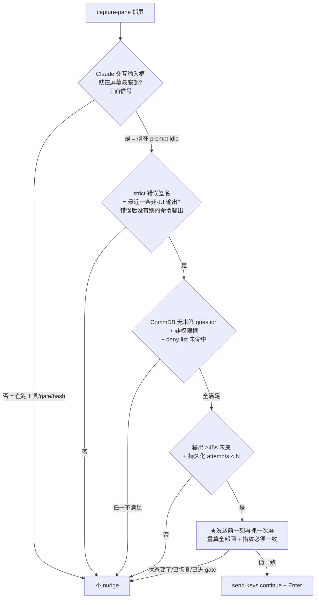

> ⚠️ **SUPERSEDED (2026-06-02) — 这版"Bridge 自动敲 continue"的方案被 Annie 否决。**
> Annie brainstorm 后把方向改成:**Bridge 只"发现候选卡住 + 可靠交给 owning Lead";判断 + 重新纳管由有脑子的 Lead 做(它有 terminal 工具);每次 ping Annie;范围放宽到任何原因卡住;不用快(~10 分钟)。** 不再让 Bridge 自动往 Runner 里敲东西。
> **下面内容保留只为复用其审计 + 安全分析**(问题验证 §1、判别栈/status-guard、await-codex-gate stale-tail 教训、FLY-191 对齐)。**新 plan 等 Annie 第 2 轮答复(Q6/Q7/Q8)+ 191 收敛后另写。** 大白话说明见 `/tmp/fly195-explainer.html`(v2)。

---

# Plan: Runner stream-idle-timeout 卡死自动恢复 (auto-recovery) — ⚠️ SUPERSEDED

**Version**: v1.31.0
**Issue**: FLY-195
**Date**: 2026-06-02
**Source**: 审计自 codebase（无前置 brainstorm/research doc，问题来自 GEO-397 生产事故）
**Status**: superseded（Annie 改方向为 Lead-judges-and-re-manages;本文档仅留审计/安全分析复用）
**Review**: Codex design review R1 → CHANGES REQUESTED；R2 → **APPROVED**（针对旧 Bridge-auto 方案，2 轮；见 §9）

---

## 1. 问题 (Problem)

Claude Code Runner 的 model-API stream 在出响应中途撞到 idle timeout 时（终端打印
`API Error: Stream idle timeout - partial response received`），交互式 agent loop **拿到半截响应后直接停下**，回到它的输入框 idle 不动。**没有任何自动恢复** —— 一直卡着，直到人/Lead 手动发一句 "continue"。

**生产事故**：GEO-397 实现 2026-06-02，Runner 在读文件途中撞 stream timeout 后**卡了约 1 小时**,直到 Peter 例行巡检发现、手动 continue 才续上。Annie 指出:卡死的 Runner 可无限 idle,等下一次有人 push 才动。

**根因缺口**:**检测有,恢复没有**。stall watchdog(`runner_idle_detected`,FLY-92)**会触发**,但**只通知 Lead**,不做任何恢复动作。

### 1.1 对照代码验证(问题属实)

| 事实 | 代码位置 |
|------|---------|
| 生产 Runner = tmux 里的交互式 `claude` CLI,agent loop 在 `claude` 进程内部 | `claude-runner/src/TmuxRunner.ts:41` → `TmuxAdapter`;`teamlead/src/bridge/run-infra.ts:288` |
| stream timeout 由 `claude` CLI 自己接住、打印错误、回到输入框 idle —— 我们的 JS 包不住那个 loop | 上游行为(见 §2.4) |
| 卡住的 Claude 输入框既不匹配"等待"也不匹配"shell idle" → 判 `executing` → 45s 不变 → 降级 `waiting` → 2 周期后发 `runner_idle_detected` | `teamlead/src/bridge/runner-status.ts:61-164`(`STALL_THRESHOLD_MS=45_000`) |
| `runner_idle_detected` 事件**只通知 Lead,无任何动作** | `teamlead/src/RunnerIdleWatchdog.ts:177-255` |
| TmuxAdapter 自己的等待逻辑只看 pane 死没死 / 完成 marker / gate 超时,活着但卡住的 pane 永不触发(要等 24h active 硬超时) | `TmuxAdapter.ts:632-860` |
| "正常停在 gate" 可查:CommDB 里有一条没答的 question | `flywheel-comm/src/db.ts:421`(`hasPendingQuestionsFrom`),`TmuxAdapter.ts:592` 已在用 |
| 续命机制现成:往交互框 `tmux send-keys -l <文字>` 再 `send-keys Enter` | `terminal-mcp/src/index.ts:371-378`(FLY-11) |

### 1.2 上游背景(为什么不能只靠 Claude Code 自己)

- 大量被报的 Claude Code bug(GitHub #46987 / #49500 / #47698 / #25979 / #53730 / #26729)。
- **权威结论**(官方 docs 确认):交互模式撞这个错,Claude Code **不自动重试/续接,直接停在输入框等用户输入**。内部 transient retry(≤10 次指数退避)发生在**报错之前**;看到这条错时 retry 已耗尽。
- 唯一真实可调旋钮:`API_TIMEOUT_MS`(默认 600000)、`CLAUDE_CODE_MAX_RETRIES`(默认 10);**没有 auto-resume 配置**(open feature #26729 未实现)。
- 上游近期修过 v2.1.152 / v2.1.126,但生产现跑 **2.1.161(更新)2026-06-02 仍复现** → 残留 bug 真实,**外部恢复网必须自建**。

> ⚠️ 网传 `CLAUDE_STREAM_IDLE_TIMEOUT_MS` / `CLAUDE_ENABLE_STREAM_WATCHDOG` / `CLAUDE_ENABLE_BYTE_WATCHDOG` / `API_FORCE_IDLE_TIMEOUT` **均为杜撰,官方不存在**,本 plan 不使用。

---

## 2. 设计核心 (Approach)

### 2.1 一句话

在 `RunnerIdleWatchdog`(Bridge 侧,已有检测)里加**自动恢复**:**只有当能正面证明"Claude 此刻就停在它的交互输入框、且这次停是这条 stream 错误造成的、且不在 gate 等人、且不是权限框"时**,才 `tmux send-keys "continue"` 续上;**发送前一刻再抓一次屏二次确认**;带**持久化的最多 N 次上限**,超了升级给 Lead。**默认关闭(env gate),先观察后开启**。

### 2.2 关键安全模型:用"正面证明在输入框"而非"错误串还在屏上"(Codex R1 HIGH-1/2/3 核心修正)

> Codex R1 抓到的致命点:`await-codex-gate` 轮询期间**不打印任何输出**,所以一条**早先**的 `Stream idle timeout` 错误会**一直留在 capture 的最后 15 行非空文本里**,即使 Runner 早已 continue 过、此刻正合法地停在 codex gate 等 review。只看"错误串在 tail"会把这种 parked Runner 误 nudge。**这是必须堵死的红线。**

修正:**不再以"错误串在 tail"为放行依据**,改为下列**正面证据合取**:



**为什么"输入框在底部"是最强判别**:Runner 跑 `await-codex-gate`(或任何 Bash 工具)时,Claude Code 显示的是"工具运行中"UI,**不显示输入框**;只有 agent loop 停下等用户输入时才显示输入框。所以"输入框在底部"直接把"卡在工具/gate"和"停在 prompt"分开 —— 早先错误串残留在 scrollback 也不放行,因为那时屏幕底部是 gate 工具 UI 而非输入框。

> ⚠️ 输入框的实际渲染(box-drawing 字符、版本相关)**必须用真 tmux 抓屏定 regex**(FLY-169 教训:mock 会编码错误的 tmux 行为)。见 §3.2(a) 的 real-tmux spike。

### 2.3 分层 (Layered)

| Layer | 内容 | 范围 |
|-------|------|------|
| **Layer 0**(降频不根治) | Runner 启动 env 调 `CLAUDE_CODE_MAX_RETRIES`(↑)+ 保持 `CLAUDE_CODE_DISABLE_NONSTREAMING_FALLBACK` 不设。 | 可选,需 Annie 批,默认不做(决策 7) |
| **Layer 1**(durable 恢复,本 plan 主体) | watchdog 正面证据合取 → 二次确认 → send-keys "continue" → 持久化上限 + 升级。**默认 off**。 | ✅ 本 plan 核心 |
| **Layer 2**(上游 auto-resume) | 不可行(CLI 内部 loop 包不住;上游 #26729 未实现)。 | ❌ 仅记录追上游 |

### 2.4 为什么恢复只能从外部做、且只能用 send-keys

agent loop 在 `claude` 进程内部,Bridge 包不住;mailbox/inbox-check 靠 agent loop 跑工具时触发,loop 停了就不触发 → **对卡死的交互式 Claude,`tmux send-keys` 往输入框打字是唯一可行的恢复手段**(人就是这么救的)。**Codex R1 LOW-8 确认**:恢复逻辑该放 watchdog 旁(外部观察 + Lead 升级一路),不放 TmuxAdapter;teamlead 已在 capture/gate-poller 里读 CommDB,本路自带 send-keys helper(注入 exec 便于测),不依赖 terminal-mcp。

---

## 3. 详细设计 (Detailed Design)

### 3.1 改动:`teamlead/src/bridge/runner-status.ts` —— 结构化检测

返回**结构化**结果(Codex R1 HIGH-2),不止 boolean:

```ts
export interface StreamStallSignal {
  inputBoxPresent: boolean;      // ★Claude 交互输入框在屏幕最底部(正面信号)
  streamErrorRecent: boolean;    // strict 签名 = 错误后无其它命令输出(最近一条非-UI)
  permissionPrompt: boolean;     // 尾部是 Y/n / Allow? 等权限框
  denyMarker: boolean;           // 命中已知长轮询 gate marker(见下)
  matchedLineOffsetFromEnd?: number;
}
export function detectStreamStall(output: string): StreamStallSignal
```

- **strict 签名**(收紧,Codex R1 HIGH-2):不再用宽松 OR。要求**同一行或相邻行**同时出现 `API Error:` + `Stream idle timeout`(+尽量 `partial response received`),锚定 Claude 的真实错误形状,排除散文/日志/文档里偶然出现 "partial response received"。
- **deny-list**:`await-codex-gate`、`[await-codex-gate]`、`flywheel-comm gate`、review-wait 等已知长轮询标记 —— 命中即判 parked,**不放行**(双保险;主判别仍是 inputBoxPresent)。
- **inputBoxPresent**:检测 Claude Code 输入框(底部 box-drawing 边框 + `│ >` 提示行)。**regex 由 real-tmux spike 定**。
- 与现有 `detectTerminalStatus` 同源取 tail,避免 scrollback 误判。

> spike(real-tmux,必须):真起一个 `claude` 交互窗口 → 触发/模拟 stream 错误后的 idle 态 → `capture-pane` 抓真实渲染 → 定 inputBoxPresent / strict 签名 regex。mock 测试在此之后补,**不可只靠 mock**(FLY-169)。

### 3.2 改动:`teamlead/src/RunnerIdleWatchdog.ts` —— 恢复逻辑

- `IdleWatchdogConfig` 增加(全可注入,便于单测):
  - `autoRecoveryEnabled: boolean`(**默认 false**,Codex R1 MEDIUM-7)。
  - `maxRecoveryAttempts: number`(默认见决策 4)。
  - `sendKeysFn?: (executionId, projectName, paneId, text) => Promise<boolean>` —— 默认:解析 tmux **pane id**(非 window,Codex R1 MEDIUM-6)→ **断言该 window 只有 1 个 pane,否则 fail-safe 不发**→ 验 pane alive → `send-keys -t <pane> -l text` + `send-keys -t <pane> Enter`。
  - `pendingGateFn?: (executionId, projectName) => boolean` —— 默认:CommDB readonly → `hasPendingQuestionsFrom`;**DB 打不开保守返回 true**(当作在等人,fail-safe)。
  - `recaptureFn?` —— 二次确认用(默认即再调一次 capture)。
- **持久化 attempts**(Codex R1 MEDIUM-4):不靠内存计数(Bridge 重启会清零→可能超 N 次)。改为**从已持久化的 `runner_stall_autorecovery` lead 事件推导**:按 `execution_id` + 限定 pane 指纹 计数;输出越过 qualifying 指纹 或 session 离开 `running` 时重置。零新表(复用 `appendLeadEvent` 持久化)。
- **恢复主流程**(`checkSession` 的 `waiting` 分支,只在 `autoRecoveryEnabled` 时启用):
  1. `detectStreamStall` 拿结构化信号。
  2. **正面合取闸**(§2.2):`inputBoxPresent && streamErrorRecent && !permissionPrompt && !denyMarker && !pendingGateFn() && 输出≥阈值未变 && persistedAttempts < N`。任一不满足 → 走现状(只通知/不动)。
  3. **★发送前二次确认**(Codex R1 HIGH-3):立即 `recaptureFn` 再抓一次,重算全部闸,且 pane 指纹必须与第 1 步一致;**变了(已恢复/进权限框/进工具/进 gate)→ 放弃 nudge**,只发 advisory 或等下一周期。
  4. **先持久化 `runner_stall_autorecovery` 审计事件(send 之前)**(Codex R1 MEDIUM-5)→ 再 `sendKeysFn`。保证动作即使投递失败也有持久记录。
  5. nudge 后等 ≥1 冷却周期再判:下次 poll 若 pane 变(executing)→ `runner_stall_recovered`(advisory)+ 计数随指纹变化自然重置;仍卡 → 下一次 attempt。
  6. persistedAttempts 达 N → 停 nudge → 升级 `runner_idle_detected`(payload 加 `autorecovery_exhausted:true` + `attempts`)。
- **不新增周期 timer**(沿用现有 30s poll,FLY-169 红线);现有 `polling` 重入保护保留。

### 3.3 改动:事件 / guardrail 集合

- `runner_stall_autorecovery`(每次 nudge 前持久化):**加入 `GUARDRAIL_EVENT_TYPES` / `RETRYABLE_LEAD_EVENT_TYPES`**(`lead-runtime.ts` / `HeartbeatService.ts`),保证"自动动作"对 Lead **可靠可见**(Codex R1 MEDIUM-5,对应"无静默动作"红线)。
- `runner_stall_recovered`(advisory,best-effort 即可)。
- 升级复用 `runner_idle_detected` + `autorecovery_exhausted` 标记。

### 3.4 时序(默认值,见决策 4)

```
t=0      stream timeout,Claude 停在输入框
t≈45s    输出 45s 未变 → stall 降级 waiting
t≈90s    满 2 周期 + 正面合取闸过 + 二次确认一致 → 第1次 nudge(持久化 attempt=1)
t≈90-150s 续上?是→recovered;否↓
t≈150s   第2次 nudge(attempt=2)
t≈210s   仍卡 → 停 nudge,升级 runner_idle_detected(exhausted)
```
约 3-4 分钟内自动救 2 次,救不活才惊动人(对比事故 ~1h 手动)。

---

## 4. 测试计划 (Test Plan)

### real-tmux spike(前置,必须 —— FLY-169)
- 真 `claude` 窗口抓 idle-at-input-box 渲染 → 定 inputBoxPresent / strict 签名 regex。
- 真 tmux **split window** 场景:验证 send 只进目标 pane,或多 pane 时 fail-safe 拒发(Codex R1 MEDIUM-6 / LOW-9)。

### 单测(safety boundary 为主,Codex R1 LOW-9)
- `detectStreamStall`:命中真实错误形状;**散文含 "partial response received" 不命中**(strict);只看 tail。
- **stale-error + await-codex-gate 静默轮询(输入框不在底部)→ 不 nudge**(HIGH-1 回归)。
- stale-error + 长静默 bash → 不 nudge(输入框不在底部)。
- 输入框在底部 + strict 签名最近 + 无 gate + 非权限框 → nudge("continue"+Enter)+ 审计事件先持久化。
- 有 pending gate question → 即使其它满足也不 nudge;`pendingGateFn` 抛错/DB 打不开 → fail-safe 不 nudge。
- 权限框 / deny-marker → 不 nudge。
- **二次确认:第一次合格、send 前 re-capture 输出变了 → 不 nudge**(HIGH-3)。
- **持久化 attempts:Bridge 重启后仍受 N 上限约束**(MEDIUM-4)。
- 耗尽 N → 停 nudge + 升级(exhausted)。
- nudge 后 pane 变 → recovered + 计数重置。
- **`autoRecoveryEnabled=false` → 字节级等于现状,一行 nudge 不发**(反向兼容 sentinel,MEDIUM-7)。

目标覆盖率 ≥ 80%,安全闸合取 100%。

---

## 5. 待定决策 (Open Decisions — 需 Annie/Lead 拍)

> 每条给**建议默认**;不另指定按建议走。

1. **恢复范围**:只救 stream-idle-timeout 具体形状(窄、安全)。**建议:就这个**,泛化保持只通知。
2. **判定信号**:用 §2.2 正面证据合取(输入框在底部 + strict 签名最近 + 无 gate question + 非权限框 + deny-list + ≥阈值未变 + 二次确认)。**建议:采纳**。
3. **恢复动作**:Layer 1 send-keys nudge,注入文字 **建议 `continue`**(备选 `Please continue where you left off.`)。
4. **N 阈值 + 时序**:`maxRecoveryAttempts` **建议 2**;第1次 ~90s;冷却 1 个 poll 周期;耗尽升级。(可配置常量。)
5. **放哪**:扩 `RunnerIdleWatchdog`(Codex 确认正确)。**建议:就这里**。
6. **跟 FLY-191 / FLY-193 的关系**:本 issue 只碰 `running` + stream-error 路径;FLY-191 是 `awaiting_review`;FLY-193 是 Lead。**建议:动 `RunnerIdleWatchdog.ts` / `runner-status.ts` 前跟 worker-fly-191 对一下,避免互踩。**
7. **rollout 默认开关**(Codex R1 MEDIUM-7 改动):**默认 OFF**,env/config gate(启动日志可见)+ 一键回退 env。**建议:Phase 0 默认 off 观察(看审计事件确认判定准)→ Phase 1 Annie 拍了再 default-on**。← **需 Annie 确认是否接受"先 off 后 on"**。
8. **Layer 0 env 缓解**:要不要顺手设 `CLAUDE_CODE_MAX_RETRIES`(↑)?**建议:本 plan 不做**,留作可选后续。

---

## 6. 风险与权衡 (Risks)

| 风险 | 缓解 |
|------|------|
| **误 nudge 一个正在等 gate 的 Runner(最严重,Codex R1 HIGH-1)** | 主判别=**输入框在底部**(等 gate 时屏幕是工具 UI,输入框不显示)→ stale 错误串残留也不放行;辅以 deny-list + CommDB pending-question(fail-safe true);**send 前二次确认**。 |
| 签名过宽误判(HIGH-2) | strict:`API Error:`+`Stream idle timeout` 同行/相邻,排除散文。 |
| capture 与 send 之间状态变了(HIGH-3) | send 前 re-capture + 重算闸 + 指纹一致才发。 |
| Bridge 重启绕过 N 上限(MEDIUM-4) | attempts 从持久化事件推导,非内存。 |
| 动作不可靠可见(MEDIUM-5) | 审计事件 send 前持久化 + 进 guardrail 重投递集。 |
| send 打错 pane(MEDIUM-6) | 用 pane id;多 pane 时 fail-safe 拒发;real-tmux split 测试。 |
| 默认开放大第一版风险(MEDIUM-7) | 默认 off + env gate + 一键回退 + 反向兼容 sentinel;先观察后开。 |
| 静默动作惹 Annie 不满 | 每次 nudge 前持久化 `runner_stall_autorecovery`,动作全程可见可审计。 |

---

## 7. 不做什么 (Out of Scope)

- 不改 `claude` CLI 内部 loop / 不 fork 上游。
- 不碰 `awaiting_review` 卡死(FLY-191)、不碰 Lead freeze 检测(FLY-193)。
- 不做泛化 idle 自动恢复(只做 stream-error 正面证据,除非决策 1 改)。
- 不默认改全局 Runner env(Layer 0 留可选)。

---

## 8. 交付 (Delivery)

- worktree + 分支 + held PR(Annie ship,绝不 push main)。
- 批准前**不 implement**。real-tmux spike 先行 → 实现 → code-reviewer + codex-code-review → PR 挂 QA(真 tmux send-keys + split-pane fail-safe)。

---

## 9. 变更记录 (Review Changelog)

**Codex design review R1 → CHANGES REQUESTED,已并入:**
- HIGH-1(stale 错误串误 nudge codex-gate)→ 核心重构:改用"**输入框在底部**"正面信号 + deny-list,§2.2/§3.1。
- HIGH-2(签名过宽)→ strict 同行/相邻锚定 + 结构化返回,§3.1。
- HIGH-3(send 前不复核)→ **发送前二次确认 + 指纹一致**,§3.2 步骤3。
- MEDIUM-4(重启绕过上限)→ **持久化 attempts**,§3.2。
- MEDIUM-5(动作不可靠可见)→ 审计事件 send 前持久化 + 进 guardrail 集,§3.3。
- MEDIUM-6(window vs pane 错 pane)→ 用 pane id + 多 pane fail-safe + real-tmux split 测试,§3.2/§4。
- MEDIUM-7(默认开风险)→ **默认 off + env gate + 先观察后开**,§2.1/§5.7。
- LOW-8(归属)→ 确认 watchdog + 自带 send-keys helper,§2.4。
- LOW-9(测试)→ 补 safety-boundary 场景,§4。

**Codex design review R2 → APPROVED**（无新阻断,仅 LOW 实现期注意）:
- regex 实现期保持锚定 Claude 错误行形状,勿因 "+尽量 partial response received" 措辞放宽成匹配泛 `API Error:` 散文。
- 指纹覆盖**决策所用的整段 capture 输出**(非仅匹配行),任何权限框/工具 UI 出现即作废 send。
- `runner_stall_autorecovery` payload 须带 `execution_id` + pane/输出指纹 + attempt ordinal,否则 `appendLeadEvent` 去重会让计数有歧义(需小 StateStore 查询 helper)。
- 所有验证失败路径(pane id 解析/CommDB/重试历史/二次 capture)**一律 fail-closed**。
- real-tmux spike 必须证明输入框底部 marker 对当前安装的 Claude Code 版本稳定。
