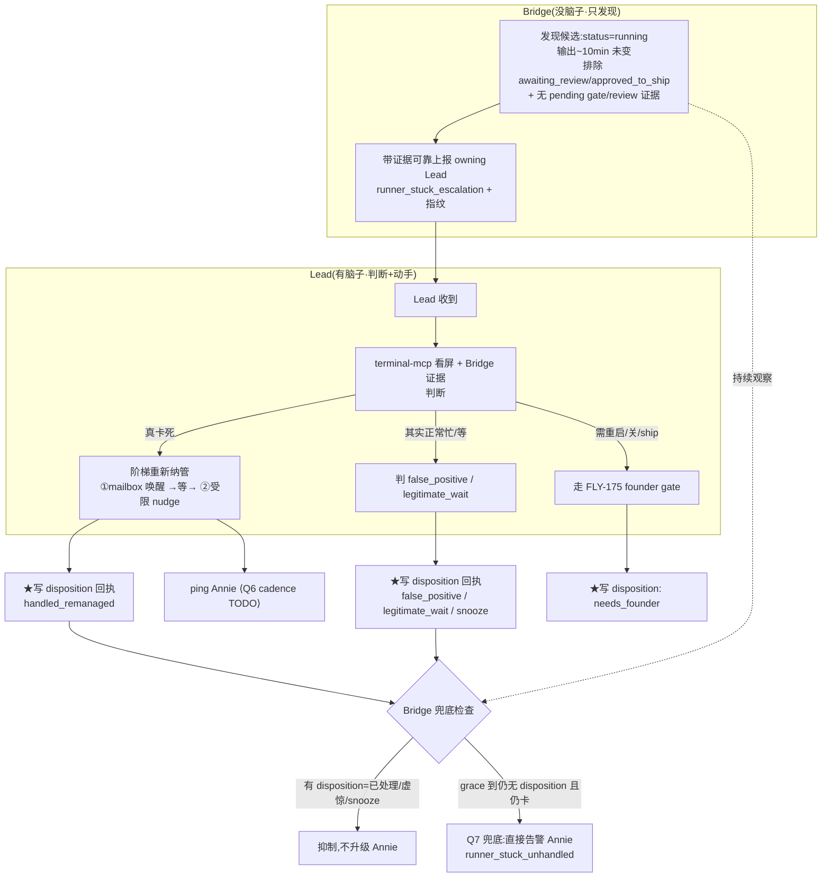

# Plan: 卡住 Runner —— Bridge 发现 + Lead 判断/重新纳管

**Version**: v1.31.0
**Issue**: FLY-195
**Date**: 2026-06-02
**Source**: 审计 codebase + Annie brainstorm(她把 FLY-195 从"Bridge 自动敲 continue"改成"Bridge 发现 + Lead 判断纳管")
**Status**: codex-approved
**Review**: Codex design review R1 → CHANGES REQUESTED；R2 → **APPROVED**（2 轮，仅余 2 条 LOW 实现注意，见 §10）
**关联**: FLY-191(同一家"Lead 重新纳管 Runner";共享 disposition 协议 + Lead 规则流程 + 上报管线,各自独立 PR)、FLY-193(共享 `LeadAlertNotifier`,协调事件类型)、FLY-175(founder-consent 边界)

---

## 0. 设计来源 / 与旧版的区别

旧版(`...-runner-stream-stall-autorecovery.md`,SUPERSEDED)= **Bridge 自己敲 continue**,Annie 否决。
Annie 新方向(本 plan):**Bridge 只"发现候选卡住 + 可靠交给 owning Lead(带证据)";"判断 + 重新纳管"由有脑子的 Lead 做(它有 terminal 工具);每次 ping Annie;范围放宽到任何原因卡住;不用快(~10 分钟)。** Bridge 不自己动 Runner。
Annie 原话:"Bridge 太机械,没有 LLM,只能靠时间硬判断;LLM 跑多久不确定,Bridge 来判断问题很大。"

---

## 1. 问题 (Problem) — 对照代码验证

Runner 干活中途**因任何原因卡住**(canonical:model-API stream idle timeout → 停交互输入框 idle),无恢复,晾到人路过。GEO-397(2026-06-02)晾约 1 小时。

| 事实 | 代码位置 |
|------|---------|
| 生产 Runner = tmux 交互式 `claude`,loop 在 `claude` 进程内部 | `claude-runner/src/TmuxRunner.ts:41`;`bridge/run-infra.ts:288` |
| 检测有:看门狗 30s poll `running`,45s 不变降级 waiting,2 周期发 `runner_idle_detected` | `RunnerIdleWatchdog.ts`;`bridge/runner-status.ts`(`STALL_THRESHOLD_MS=45_000`) |
| **但只通知、无处理流程,且 90s 太急** | `RunnerIdleWatchdog.ts:177` |
| Lead 已有全套 terminal 工具 | `terminal-mcp/src/index.ts`:`runner_terminal_capture/_status/_input` |
| 正常停 gate 可查 | `flywheel-comm/src/db.ts:421`(`hasPendingQuestionsFrom`) |
| 191 改完"正常 idle 待命" status = `awaiting_review`(ship 期间短暂 `approved_to_ship`) | `bridge/event-route.ts:595` |
| founder gate 现成(ship/重启/关 走 consent) | `lead-rules-base/founder-only-authority.md` |
| Annie 告警通道现成(但事件类型固定枚举) | `LeadAlertNotifier.ts:47`(`AlertEventType` union) |

**真正缺口**:(1) 检测太急 + 没排除 191 的 idle-reachable;(2) Lead 无定义的"看屏+判断+重新纳管+ping"流程;(3) 没有"Lead 也没处理"的兜底,**且兜底必须尊重 Lead 的判断**;(4) 缺少把 Lead 判断变成权威的 **disposition 回执协议**。

---

## 2. 设计 (Approach)

### 2.1 三段式 + disposition 闭环

### 2.2 为什么这样切
- **Bridge 撒网(高 recall)+ 证据,Lead 精筛(高 precision)+ 权威 disposition**:Bridge 靠时间+status 粗判 + 附证据;Lead 用 LLM 精判并**回执**;Bridge 兜底**尊重 Lead 回执**(Codex R1 HIGH-1:否则 Lead 判断只是 advisory,兜底会误 page Annie)。这正是 Annie"让有脑子的判断作数"的本意。
- **复用现成**:Lead terminal 工具、Bridge 上报/guardrail 重投/owning-Lead 解析、founder gate、Annie 告警 —— 主要是接线 + 一套 Lead 规则流程 + 一个受限 nudge 原语 + 一个 disposition 记录。

### 2.3 与 FLY-191 共享边界(team-lead 拍:各自独立 PR + 共用模块/规则两边 import)

> **更新(读 191 Phase 1 PR #213 后)**:#213 = advisory(`getStaleAwaitingReviewSessions` + ping owning Lead,在 **`HeartbeatService` 5min pass**)+ `reject_stale` 动作(走 **founder-consent / `reserved-endpoints.ts` + `founder_consent_audit`**)。**191 没有通用 disposition 表**,且**没碰 `RunnerIdleWatchdog.ts`/`runner-status.ts`**。两个结论:
> 1. **disposition 是 195 专属、自建、轻量**(不是共享表)。见 §3.4。
> 2. **文件不撞 191**:我在 RunnerIdleWatchdog/runner-status,它在 HeartbeatService —— 可放手做 195 wiring。

| ⟨SHARED⟩ 模式/posture(非一张表) | 各自独立 |
|---|---|
| **"Bridge 发现→advisory 给 owning Lead→Lead 动手"模式** + 一套 Lead 规则流程语义 | 检测 helper:191=stale awaiting_review(HeartbeatService);195=stuck running(RunnerIdleWatchdog) |
| **重/不可逆动作的 founder-consent posture**:复用 191 #213 的 `reserved-endpoints.ts` + `founder_consent_audit`(我的 restart/kill 走这套) | disposition:191 用 reject_stale(session 离 awaiting_review)+ advisory 重发;195 自建轻量 disposition(§3.4) |
| **上报管线** `appendLeadEvent`+guardrail 重投+`resolveLeadForIssue`(已存在) | 重新纳管手段 + 入口事件(195=`runner_stuck_escalation`)+ Annie 兜底类型(195=`runner_stuck_unhandled`) |

> 待 191 确认两点(已发):(a) 我受限 nudge 当**非 reserved 轻动作**(只 allowlist `continue`),restart/kill 才走 reserved;(b) 195 自建轻量 disposition 不踩它东西。无异议即按此。

---

## 3. 详细设计 (Detailed Design)

### 3.1 Bridge 检测:patient stuck-candidate（`bridge/runner-status.ts` + `RunnerIdleWatchdog.ts`)
- **候选条件(全满足)**:
  1. `status === "running"` —— **硬排除** 任何非 running(含 `awaiting_review`/`approved_to_ship`,191 idle-reachable 不算卡)。
  2. 输出指纹连续未变 ≥ **`STUCK_THRESHOLD_MS`(默认 600_000=10min,可配)** —— 比 90s 耐心,降噪。
  3. **决策时重读 StateStore status**(盖 label 已翻的情形)。
  4. **(Codex R1 MEDIUM-3)二次排除 durable pending review/gate 证据**:`hasPendingQuestionsFrom(execId)` 有未答 question / 有 pending `approve_to_ship` gate / 近期 `session_completed route=needs_review` → 视为合法 parked,**抑制**或降级成低优 "status 不一致" advisory(不发 stuck 事件)。盖"status 行还没翻但已有 review 信号"的延迟窗。
- **机制**:复用 45s stall 指纹缓存,加"持续未变计时";**不新增周期 timer**(挂现有 30s poll,FLY-169)。
- **(Codex R1 LOW-8)独立状态**:新建独立 stuck-episode map,**不复用** `notifiedForStatus`/idle transition counter;现有 90s `runner_idle_detected` 语义与 cadence 不变(QA 依赖)。
- **(Codex R1 LOW-6)范围措辞**:本检测是"**停滞输出型候选检测**"(会漏"输出一直在变但无实质进展"的卡法,如刷重试日志);承诺是"发现后通用重新纳管",非"任何卡法都能检出"。
- **证据**(随上报,帮 Lead 快判,只作证据不作触发):`stuck_minutes`、`tail`(屏尾)、`stream_error_signature`(strict `API Error: ...Stream idle timeout`)、`input_box_present`(regex 由 real-tmux spike 钉死,§5)。

### 3.2 上报 owning Lead（⟨SHARED⟩ 管线 + 195 事件 + 状态机)
- 事件 `runner_stuck_escalation`(Bridge→Lead),payload = 证据 + execution_id/issue/project/session_role/chat_thread_id + **episode 指纹**。
- 进 `GUARDRAIL_EVENT_TYPES`/`RETRYABLE_LEAD_EVENT_TYPES`,guardrail 重投保证送达。
- **(Codex R1 LOW-7)stuck-episode 状态机(精确)**:episode 键 = `execution_id` + **归一化输出指纹** + episode_start。
  - `detected → escalated`(发事件)→ 等 Lead disposition。
  - **重置/清除**:status 离开 `running` → 清;输出指纹变(有进展)→ 清并可起新 episode;Lead disposition 到 → 据此转移。
  - **去重**:同 episode 只上报一次;Bridge 重启后 episode map 重建(从持久 disposition + 当前 status 推导,避免重复 page)。
  - eventId 含 execution_id + 指纹 + episode_start(避免太粗导致 stale 行压新 episode)。

### 3.3 Lead 重新纳管流程（⟨SHARED⟩ Lead 规则,写进 lead-rules-base）
收到 `runner_stuck_escalation`(或 191 advisory):
1. **看屏**:`runner_terminal_capture`+`runner_terminal_status` + Bridge 证据。
2. **判断**:真卡死 / 正常忙 / 正常等。
3. **(Codex R1 MEDIUM-4)阶梯重新纳管**(不靠"健康 vs 病态"二元臆断 —— `runner_terminal_status` 是静态分类器,证明不了 inbox poller 活):
   - **①先 mailbox 唤醒**(runner 看着活且 scoped 时)→ 等一段有界时间 → **重新 capture**。
   - **②没变且仍是卡死输入框 → 升级到受限 tmux nudge**(见 §3.5 受限原语)。
4. **重/不可逆**(重启/关/授权 ship)→ **不自己做,走 FLY-175 founder-consent gate**。
5. **★写 disposition 回执**(§3.4)。
6. **ping Annie**(§3.6,Q6 cadence)。

### 3.4 ⟨SHARED⟩ disposition 回执协议(Codex R1 HIGH-1 + LOW-9:非可选)
让 Lead 判断**权威化**,Bridge 兜底据此动作。
- Lead 对每个 `runner_stuck_escalation`(按 episode 指纹)写一条**持久** disposition,取值:`handled_remanaged` | `false_positive` | `legitimate_wait` | `snooze_until=<ts>` | `needs_founder`。
- **载体**:195 自建 StateStore 一张轻表(键 execution_id+episode 指纹)。**195 专属**(读 #213:191 无通用 disposition 表,用 reject_stale + advisory 重发;不复用)。
- **更轻的写入(读 #213 后简化)**:
  - `handled_remanaged` = **隐式**:Lead 调受限 nudge 端点(§3.5)成功 → 端点自动给该 episode 记 `handled_remanaged`(Lead 不必额外写)。
  - `false_positive` / `legitimate_wait` / `snooze_until` / `needs_founder` = Lead **显式写一次**(一个轻 Bridge 端点 / `flywheel-comm` 子命令)。这是 Lead 唯一需要主动写的 disposition。
- **Bridge 兜底据此**:见 §3.6。无回执超 grace 才升级;`false_positive`/`legitimate_wait`/`snooze` → 抑制该 episode。

### 3.5 ⟨195 专属⟩ 受限恢复 nudge 原语(Codex R1 HIGH-2:堵 FLY-175 后门)
**不**把裸 `runner_terminal_input`(可发任意 2000 字)当 remanage 原语 —— 否则 Lead 能借 prompt 打字间接 approve ship / merge / terminate / 答 gate,绕过 founder-consent。
- 新增**窄** primitive `runner_recovery_nudge`(wrapper 或 rule-enforced helper):**只发 allowlist 恢复短语(如 exact `continue`)**,且**所有闸通过才发**:StateStore status 仍 `running`、非 awaiting_review/approved_to_ship、无 pending approve_to_ship/founder gate、terminal/prompt 证据匹配"卡死输入框"、episode 指纹匹配。
- **每次 nudge 审计**。其它语义指令一律走 mailbox;ship/重启/关/retry/close 一律 founder-gated。

### 3.6 通知 Annie + 兜底(Q7 默认:尊重 disposition 的直接升级)
- **Q4 已定**:每次都让 Annie 知道。
- **⟨TODO-Q6⟩ 通知节奏(唯一真正等 Annie 处,占位)**:默认 = Lead 真处理(重新纳管/升级)时 ping;判 false_positive 时静默记审计。待 Annie 定是否"一发现就 ping / 虚惊也 ping"。**整条 plan 只此一处占位。**
- **Q7 兜底(默认:Bridge 直接升级 Annie,但尊重 disposition)**:Bridge 持续观察,上报后过 **`LEAD_GRACE_MS`(默认~5min)**:
  - 有 disposition=`handled_remanaged`(且输出已变=续上)→ 清 episode,不升级。
  - 有 `false_positive`/`legitimate_wait`/`snooze`(未到期)→ **抑制**,不升级(Codex R1 HIGH-1 核心)。
  - 有 `needs_founder` → 走 founder 路径,不重复 page。
  - **无 disposition 且仍卡死** → **Bridge 直接告警 Annie**(覆盖 Lead 掉线/也卡)。
- **(Codex R1 MEDIUM-5)Annie 告警与 FLY-193 协调**:`LeadAlertNotifier` 加具体类型 `runner_stuck_unhandled` + severity + eventId 格式 `runner-stuck-unhandled:${execution_id}:${fingerprint}`;**每个 unhandled episode 只 1 条 Annie 告警**;指纹变重置、status 离 running 清除。动 `LeadAlertNotifier.ts` 前与 worker-193 对类型/去重(等其正式 PR 落地)。

### 3.7 配置 / rollout
- `STUCK_THRESHOLD_MS`(默认 10min)/`LEAD_GRACE_MS`(默认 5min)可配置。
- Bridge 只"发现+上报+尊重 disposition 的兜底",不动 Runner;动 Runner 的受限 nudge 由 Lead 经 §3.5 闸。风险远低于旧版,**保留总开关 env 便于回退**(不需旧版那种重型 default-off)。

---

## 4. 安全 / FLY-175 边界(头号约束)
- Bridge **永不**自己动 Runner。
- 检测硬排除 `awaiting_review`/`approved_to_ship` + 重读 status + 二次排除 pending gate/review 证据(MEDIUM-3)。
- **受限 nudge 原语**:只 allowlist 短语 + 全闸通过 + 审计(HIGH-2);其它指令走 mailbox;ship/重启/关 走 founder-consent。
- 兜底 Annie 升级**尊重 Lead disposition**(HIGH-1),复用现有告警路径(与 193 协调)。

---

## 5. 测试计划 (Test Plan)
### real-tmux spike(前置,FLY-169)
真 `claude` 窗口抓"停输入框 idle"渲染 → 钉 `input_box_present` + strict stream-error 签名(仅证据);**验 mailbox 唤醒能否从该 idle prompt 把 runner 叫活**(MEDIUM-4 阶梯第①步前提);split-pane 受限 nudge fail-safe。
### 单测
- 检测:running+≥10min 未变+非 awaiting_review+无 pending gate/review → 产 `runner_stuck_escalation` 带证据。
- 检测:`awaiting_review`/`approved_to_ship` 一律不产候选(191 回归)。
- 检测:**有 pending question / approve_to_ship gate / 近期 needs_review** → 抑制/降级(MEDIUM-3)。
- 检测:输出仍在变 → 不产;**指纹变重置 episode、status 离 running 清除、Bridge 重启不重复 page**(LOW-7)。
- 检测:不复用 90s idle 状态,`runner_idle_detected` 旧 cadence 不变(LOW-8)。
- **disposition**:Lead 写 `false_positive`/`legitimate_wait`/`snooze` → Q7 兜底**抑制**;无 disposition 超 grace → 升级(HIGH-1)。
- **受限 nudge**:只发 allowlist 短语;status 非 running / 有 pending gate / 指纹不匹配 → **拒发**;每次审计(HIGH-2)。
- 阶梯:mailbox 唤醒后续上 → 不升级 tmux;没续上+仍卡死输入框 → 升级受限 nudge(MEDIUM-4)。
- 兜底告警:每 unhandled episode 1 条;指纹变重置(MEDIUM-5)。
### 集成 / 真工具
- 真 CommDB/StateStore status + pending-gate 排除。
- 真 tmux 受限 nudge + split-pane fail-safe。

目标覆盖 ≥80%;安全闸(status/pending 排除 + 受限 nudge + disposition 抑制 + FLY-175)100%。

---

## 6. 待定决策 (Open Decisions)
1. **⟨TODO-Q6⟩ 通知节奏** —— 唯一卡 Annie 处,默认"处理时 ping、虚惊静默",占位。
2. **Q7 兜底** —— 默认"无 disposition 超 grace 仍卡 → Bridge 直接升级 Annie,尊重 disposition 抑制",已写。
3. **Q8 重新纳管边界** —— 轻处理(受限 nudge/mailbox)自主;重启/关/ship 走 FLY-175。已写。
4. **⟨SHARED⟩ disposition + 共享模块确切 API** —— 与 191 Codex R2 收敛,Codex review 定;不影响 195 自洽。
5. `STUCK_THRESHOLD_MS`/`LEAD_GRACE_MS`/allowlist 短语 —— 技术项,跟 Codex 定。

---

## 7. 风险 (Risks)
| 风险 | 缓解 |
|------|------|
| 误把 191 正常 idle 待命当卡死 | 硬排除 awaiting_review/approved_to_ship + 重读 status + pending gate/review 二次排除;Lead 精判 |
| 兜底无视 Lead 判断、误 page Annie | disposition 回执 + 兜底据此抑制(HIGH-1) |
| Lead nudge 变 founder gate 后门 | 受限 nudge 原语:allowlist 短语 + 全闸 + 审计(HIGH-2);重动作走 consent |
| "健康 vs 病态"误判 | 阶梯 mailbox→受限 tmux,不靠二元臆断(MEDIUM-4) |
| 检测漏"输出一直变"的卡法 | 明确范围=停滞输出型候选检测(LOW-6) |
| 与 193 告警文件/类型冲突 | 新增 `runner_stuck_unhandled` 类型 + eventId 约定,动手前与 193 对齐(MEDIUM-5) |
| tmux 打错 pane | pane-id + 多 pane fail-safe + real-tmux 测试 |
| episode 抖动/重复升级 | 精确状态机 + 指纹去重 + 重启重建(LOW-7) |

---

## 8. 不做什么 (Out of Scope)
- Bridge 不自动动 Runner(Annie 否决)。
- 不碰 191 的 awaiting_review reachability 本身(只消费其 status 模型)。
- 不碰 Lead freeze 检测(FLY-193)。
- 不改 `claude` CLI 内部 loop / 不 fork 上游(无 auto-resume,已确认)。
- 不做"输出一直变但无进展"的高级卡死检测(本期停滞输出型;可后续)。

---

## 9. 交付 (Delivery)
- worktree `worktrees/fly-195-stuck-runner-remanage`,分支 `feat/v1.31.0-FLY-195-stuck-runner-lead-remanage`。
- 本 plan → Codex design review(改到只差 Q6 一句话定稿)→ 交 team-lead。
- 批准 + Q6 回 → real-tmux spike → 实现 → code-reviewer + codex-code-review → **PR 停**(Annie ship,不 push main)。
- 191/195 各自 PR;⟨SHARED⟩ disposition 协议 + Lead 规则流程 + 上报管线两边 import,边界与 191 Codex review 收敛。

---

## 10. 变更记录 (Review Changelog)
**Codex design review R1 → CHANGES REQUESTED,已并入:**
- HIGH-1(兜底无视 Lead 判断)→ §3.4 **disposition 回执协议** + §3.6 兜底据此抑制。
- HIGH-2(裸 terminal_input = FLY-175 后门)→ §3.5 **受限 `runner_recovery_nudge` 原语**(allowlist 短语+全闸+审计)。
- MEDIUM-3(灰区表述过强)→ §3.1.4 **二次排除 pending gate/review 证据**。
- MEDIUM-4(健康/病态不可靠)→ §3.3 **阶梯 mailbox→受限 nudge** + spike 验 mailbox 唤醒。
- MEDIUM-5(告警与 193 耦合)→ §3.6 **`runner_stuck_unhandled` 类型 + eventId 约定 + 与 193 协调**。
- LOW-6(范围)→ §3.1 停滞输出型候选检测措辞。
- LOW-7(状态机)→ §3.2 精确 episode 状态机 + 指纹/重启语义。
- LOW-8(与 90s 共存)→ §3.1 独立 stuck 状态,不复用 idle counter。
- LOW-9(Q6 可 TODO 但 disposition 非可选)→ §3.4 disposition 设为必做,Q6 仍唯一 TODO。

**Codex design review R2 → APPROVED**(无 HIGH/MEDIUM,2 条 LOW 实现注意,实现期照办):
- LOW-R2-1:§3.3 mailbox 唤醒后的"有界 re-capture 延迟"实现期定具体常量 `MAILBOX_WAKE_WAIT_MS`(默认 ~30-60s,可配),并在阶梯流程测试里钉死,避免变成临时/无界值。
- LOW-R2-2:§3.6 Q7 发 `runner_stuck_unhandled` 前,**领取 Annie 告警 eventId 的同刻再 durable re-read 一次 disposition**,消除毫秒级竞态下的可避免重复 page(disposition 在最终检查前已落库则正确抑制;在检查开始后才写则按"超 grace 无 disposition"page,可接受)。
