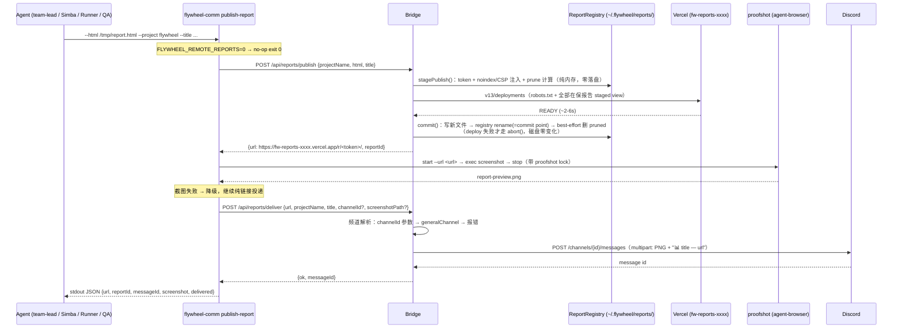

# Plan: Remote Report Pipeline — 报告自动发布托管 + Discord 截图+链接送达

**Version**: v1.32.0
**Issue**: FLY-203
**Date**: 2026-06-03
**Source**: Linear issue FLY-203（brainstorm 结论），`doc/engineer/research/new/FLY-203-remote-report-pipeline.md`
**Status**: codex-approved（4 rounds，2026-06-03；R4 三条 non-blocking 实现注意：① deliver 校验按 §3.3 的 `path.relative` 契约实现成纯函数 `validatePreviewPath` 直接单测攻击矩阵 ② commit-failure 测试只断言可观察本地不变量（registry 新旧/文件在否/warn），别过拟合内部临时文件名 ③ deploy 成功但 commit 在 rename 前失败 → log 报 token + deploymentId（噪音日志里别打完整私有 URL），下次成功 publish 自然对齐）

---

## 1. Overview

Agent 生成的 HTML 报告（ship-review / triage / 改动清单等）目前只有"本地生成 + 本地 `open`"。Annie 远程（手机，只有 Discord）时完全看不到。

本计划落地 Annie 拍板的方案：**托管 HTML 为骨干 + 截图为预览，一条 Discord 消息送达**。任何 agent 一条命令：

```bash
flywheel-comm publish-report --html /tmp/fly-ship-review.html --project flywheel --title "Ship Review 06-03"
```

→ 报告发布到不可猜 URL → 自动截图首屏 → 对应 Discord 频道收到一条「截图 + 链接」消息 → 手机一点即看完整版。

**本地流程零改动**（agent 照旧 `open`），远程管线增量叠加，可开关。

技术选型（research §2 已 spike 实证，遵守 GEO-294 RC-3 "Spike before commit" 规则）：

- **托管 = 单 Vercel 项目 + 128-bit 随机 token 路径 + 累积重部署**（spike 全过：token 路径 200 text/html inline 渲染、根路径/错 token 404、保留文件跨部署持久、省略即死 → 必须累积）
- **投递 = Bridge 直发 Discord multipart**（artifact_delivery 链要求 Runner session，报告生产者 team-lead/Simba 不是 Runner → 不可复用；Bridge 直发无 Lead 在线依赖）
- **截图 = 复用 proofshot `start --url`**（FLY-188/GEO-151 生产已验证的链路，3D 模式已在用 `--url`）

## 2. Architecture



编排放 CLI（瘦 Bridge）：proofshot lock 本来就是 agent 侧设计，Bridge 进程不 spawn headless Chrome；所有 agent 同机运行（系统既有假设），截图传本地绝对路径即可。Bridge 只做两件事：托管发布（带 registry）、Discord multipart 发送。

## 3. 设计决策与边界

### 3.1 不可猜 URL（隐私）

| 层 | 措施 |
|----|------|
| 路径 | `r/<token>/` — token = `crypto.randomBytes(16).toString("hex")`（128-bit，与 signed URL 等强；"anyone with link" 模型，Annie 已拍板） |
| 域名 | Vercel 项目名带随机后缀 `fw-reports-<6 hex>`，首次发布时在 stage 阶段生成、**随首次成功 commit 持久化到 registry**（R3#1 事务边界；防枚举/抢注，防御纵深） |
| 搜索引擎 | 每次部署附 `robots.txt`（`User-agent: *\nDisallow: /`）；HTML `<head>` 内无 robots meta 时注入 `<meta name="robots" content="noindex">` |
| 主动内容（Codex R1#4 + R2#1） | 报告含 issue/PR/用户可控文本，托管侧必须防意外 `<script>`/外链/表单跑起来：`<head>` 内无既有 CSP meta 时注入 `<meta http-equiv="Content-Security-Policy" content="default-src 'none'; style-src 'unsafe-inline'; img-src data:;">`（现有报告 = 纯 inline CSS + 偶发 data: 图，零破坏）；已有 CSP meta → 不动。**无 `<head>` 的 HTML → publish 400 拒绝**（报告必须是完整 HTML 文档 — 现有全部报告生成路径都带 head/viewport meta；拒收 fragment 而不是无防护托管）。测试三态：无 CSP 注入 / 已有 CSP 不动 / 无 `<head>` 400 |
| 枚举 | 根路径与错误 token 均 404（spike 实证），无目录列表 |
| 过期 | retention prune（§3.2）= 旧报告自动下线，缩小长期暴露面 |

### 3.2 累积重部署 + Retention（spike 实证：部署中省略的文件即死）

- 本地保留区：`~/.flywheel/reports/files/<token>.html` + `~/.flywheel/reports/registry.json`
- registry 结构：

```json
{
  "vercelProjectName": "fw-reports-3f9c2a",
  "reports": [
    {"token": "6feafd…", "projectName": "flywheel", "title": "Ship Review", "createdAt": "2026-06-03T…"}
  ]
}
```

- **双重 prune**（防 deploy payload 无限增长）：
  - 条数 cap：`FLYWHEEL_REPORTS_RETENTION_MAX`（默认 100）
  - 字节 cap：在保 HTML 总和 ≤ 10MB（inline JSON payload 安全余量；报告实测 13–20KB，正常永远摸不到）
  - prune 即删本地文件 + registry 条目；下次部署自然下线
- 单报告 cap 512KB（沿用 GEO-294）
- **并发**：Bridge 单进程内用 promise-chain mutex 串行化 publish（read-modify-write registry + 全量部署不能交错）
- **事务性（Codex R1#3 + R2#2）**：publish 是 stage→deploy→commit 三段，**deploy 成功前零 fs 落盘**：
  - `stagePublish()` 在内存构造 staged view（新 entry + prune 计算 + deployFiles），不动磁盘
  - deploy 失败 → `abort()`：丢弃 staged view，registry/本地文件原样 — 老报告链接寿命不受失败影响（修正 R1 前"先 add+prune 再回滚只删新 token"会让被 prune 的老报告提前死的 bug）
  - deploy 成功 → `commit()` **固定顺序**（Vercel 不可回滚，本地不变量必须独立成立）：① 写新报告文件 → ② registry.json 原子写（tmp + rename，= commit point）→ ③ 删 pruned 文件（**rename 之后才删，best-effort**，删失败只 warn）
    - ①/② 任一失败：registry 仍是旧的、pruned 文件全在 — 本地状态自洽（线上多一份 registry 不认识的报告，下次成功 publish 自然对齐）；孤儿新文件可忽略（部署集合永远由 registry 驱动）
    - 测试：commit 在 rename 前失败（registry 旧、pruned 在）；rename 后删 pruned 失败（warn 不抛、registry 新）
  - registry.json 任何写入都走 tmp+rename（Bridge crash 不留半写文件）

### 3.3 Discord 投递

- 一条消息 = `📊 **{title}** · {projectName}` + 链接 + PNG 附件
- 有截图时链接写成 `<url>`（抑制 Discord 自动 embed 预览，避免和截图重复）；无截图（降级）时裸 URL（让 Discord 尝试预览）
- `allowed_mentions: {parse: []}`（沿用 FLY-162 纪律）；`title` ≤200 字符、消息 content ≤1900（沿用 `MAX_DISCORD_MESSAGE_LENGTH`）
- **截图传递契约（Codex R1#2 — deliver 是"读本地文件发 bot 消息"的敏感面，不能收任意路径）**：
  - CLI 把截图写进**专用 preview 根目录** `{reportsDir}/previews/`（与 Bridge 同一 `FLYWHEEL_REPORTS_DIR` 约定）
  - Bridge 校验（R2#3 — **不用裸 prefix match**，`previews-evil` 兄弟目录会穿）：`rel = path.relative(realpath(previewsDir), realpath(filePath))`，要求 `rel` 非空、非绝对、不以 `..` 开头；外加 `lstat` 拒绝 symlink + **PNG magic bytes**（`89 50 4E 47`）校验（防扩展名伪装）+ ≤25MB
  - 发送成功后 Bridge best-effort 删除 preview 文件（防堆积）
  - 测试必须覆盖：traversal 路径、**`previews-evil` 兄弟目录**、symlink、伪装扩展名、超大文件
  - （评估过 base64-in-JSON 上传：全局 `express.json({limit:"512kb"})` 装不下截图，按需改 body parser 的侵入更大 → 选 Codex 给的 restricted-root 方案）
- Bot：Bridge 全局 `discordBotToken`；未配 → deliver 501
- 频道解析：`channelId` 显式参数 → `projects.json` 该项目 `generalChannel` → **400 报错（不猜）**

### 3.4 降级与开关

| 故障/配置 | 行为 |
|-----------|------|
| `FLYWHEEL_REMOTE_REPORTS=0` | **双侧生效（Codex R1#8 — CLI-only 不是真 kill switch）**：CLI 打印跳过说明 exit 0 零 Bridge 调用；Bridge 侧 `/api/reports/*` 全部 503 `{error: "remote reports disabled"}`（直接 curl Bridge 也被关死 — 配额/隐私止血是 Bridge 的事） |
| 无 `VERCEL_TOKEN` | publish 501（沿用 GEO-294 语义），CLI 透传报错 exit 1 |
| publish/deploy 失败 | `abort()` 丢弃 staged view（§3.2 事务性），502；旧报告完全不受影响（registry/文件零变化 + 旧 deployment 在线）；CLI exit 1 |
| Bridge 未配 `apiToken`（`TEAMLEAD_API_TOKEN`） | **`/api/reports/*` 不裸跑（Codex R1#1）**：与 `/api/publish-html` 的"无 token 就免 auth"不同，reports 路由是 bot 发送 + 本地文件读取面 — 无 apiToken 时挂载 503 `{error: "reports API requires TEAMLEAD_API_TOKEN"}`（先例：`TEAMLEAD_REPLY_BY_ISSUE_ENABLED` 无 token fail-start）。publish 同样收紧（公开发布任意 HTML 同属敏感面） |
| 截图失败 | stderr 警告，**继续投递纯链接消息**（核心价值是链接可达，截图是预览增强） |
| Discord 发送失败 | deliver 502 + 错误详情；CLI exit 1（stdout JSON 带 url — 报告已发布，agent 可手动转发链接） |

### 3.5 Byte-compat 边界

- 现有 `/api/publish-html`（Simba triage 在用）与 `deployToVercel()` 对外行为**不动**；`vercel-deploy.ts` 内部抽出共享函数，现有测试必须原样全绿
- artifact_delivery 链（GEO-151）不动
- 本地"生成 + open"流程不动（无任何代码改它）

### 3.6 截图区域（关键区 = 设计约定，非 DOM 定位）

- proofshot `exec screenshot` = viewport 截图；现有 HTML report style（max-width 居中 + verdict/结论卡在顶）保证首屏即关键区
- viewport 用 agent-browser 默认；若 Annie 反馈想要更"手机比例"的预览，作为 follow-up 调参（proofshot 当前无 viewport flag — 不在本计划承诺）

## 4. Implementation Steps（TDD，每步先测后码）

### Step 1: `packages/teamlead/src/bridge/report-registry.ts`

```typescript
export interface ReportEntry { token: string; projectName: string; title?: string; createdAt: string; }
export interface ReportRegistryData { vercelProjectName: string; reports: ReportEntry[]; }

/** stage→deploy→commit 事务句柄（Codex R1#3 + R3#1）：deploy 成功前零 fs 落盘 */
export interface StagedPublish {
  entry: ReportEntry;
  /** Vercel 项目名（R3#1：并入事务）— 已 commit 过的 registry 值，或首发时新生成的
   *  内存值 fw-reports-<6hex>；只随 commit() 一起持久化。deploy 失败 = 名字从未落盘 */
  vercelProjectName: string;
  /** robots.txt + 全部在保（含新报告、不含被 prune 的）r/<token>/index.html — 纯内存视图 */
  deployFiles: { file: string; data: string }[];
  /** deploy 成功后调用：①写新文件 → ②registry.json（含 vercelProjectName）原子 rename → ③best-effort 删 pruned */
  commit(): void;
  /** deploy 失败后调用：丢弃 staged view，磁盘零变化（首发时连 registry.json 都不存在） */
  abort(): void;
}

export class ReportRegistry {
  constructor(baseDir: string, opts?: { retentionMax?: number; retentionBytes?: number;
    randomHex?: (bytes: number) => string });  // 注入随机源（测试 seam）
  /** 内存内：注入 noindex+CSP → 新 entry + 项目名解析（已提交值或新生成）
   *  + prune 计算 + deployFiles 构造。不动磁盘 */
  stagePublish(projectName: string, html: string, title?: string): StagedPublish;
  /** 只读 getter：已 commit 的项目名（未曾发布成功 → undefined）。不在 publish 路径上 */
  vercelProjectName(): string | undefined;
  list(): ReportEntry[];
  /** preview 根目录（deliver 校验 + CLI 写入共用契约） */
  previewsDir(): string;
}
```

- prune 规则：按 createdAt 旧→新淘汰，直到 `条数 ≤ retentionMax` 且 `总字节 ≤ retentionBytes`（计算发生在 stage，生效发生在 commit）
- `injectHeadMeta(html)` helper：`<head>` 存在时注入缺失的 `noindex` meta + CSP meta（已有同类 meta 则不动）；**无 `<head>` → 抛 `ReportHtmlInvalidError`（R2#1，route 层转 400 拒绝 — 不无防护托管 fragment）**
- **commit() 固定顺序**（R2#2）：写新文件 → registry 原子 rename → 删 pruned（best-effort，失败 warn）
- **Tests**（tmp dir 真 fs）：项目名事务性（首发 stage 产出新名但磁盘无 registry.json；commit 后名字持久且第二次 stage 复用同名；**首发 deploy 失败 abort → registry.json 不存在、零文件**）；stage 不动磁盘（stage 后断言 fs 零变化）；commit 写新文件+registry 原子更新+删 pruned 文件（顺序断言）；commit 在 rename 前失败 → registry 旧 + pruned 全在；rename 后删 pruned 失败 → warn 不抛 + registry 新；abort 后 fs 零变化；条数 prune；字节 prune；deployFiles 含 robots.txt + 全部在保 token 路径且不含 pruned；injectHeadMeta 三态（无 CSP 注入/已有 CSP 不动/无 head 抛错）；registry.json 损坏 → 报错不静默重建（防止把在保报告判死）；tmp+rename 原子性（commit 中途无半写 registry.json）

### Step 2: `vercel-deploy.ts` 泛化（byte-compat）

```typescript
/** 新：多文件部署，name 原样使用（不加 triage- 前缀） */
export async function deployFilesToVercel(
  vercelToken: string, deploymentName: string,
  files: { file: string; data: string }[], timeoutMs?: number,
): Promise<{ deploymentId: string }>;
```

- 现有 `deployToVercel()` 改为内部调用它（`triage-` 前缀 + URL 拼接逻辑留在原函数）
- `deployFilesToVercel` 入参校验（Codex R1#7）：files 非空、`file` 必须是相对 POSIX 路径（拒绝 `/` 开头、`..`、反斜杠）、`projectSettings.framework: null` 保持
- **Tests**：现有 vercel-deploy/publish-html 测试零修改全绿；**新增 `deployToVercel` reverse-compat sentinel**（直接对函数断言：`triage-` 前缀、deterministic alias 返回、READY/ERROR/超时 poll 语义逐一锁定 — 不只靠路由层测试间接覆盖，照 FLY-175 sentinel 先例）；新函数 mock fetch 验 payload（name 原样不加前缀、多 files、target production、入参校验矩阵）

### Step 3: `packages/teamlead/src/bridge/discord-post-file.ts`

```typescript
export async function postDiscordMessageWithFile(
  channelId: string, content: string, filePath: string, botToken: string,
  fetchImpl?: typeof fetch,
): Promise<{ ok: true; messageId: string } | { ok: false; error: string }>;
```

- Node 全局 `FormData` + `Blob`：`payload_json` = `{content, allowed_mentions: {parse: []}}`，`files[0]` = PNG buffer
- **Tests**：mock fetch 验 multipart 字段/auth header/allowed_mentions；非 2xx、网络错、响应缺 id → 错误 envelope

### Step 4: `packages/teamlead/src/bridge/reports-route.ts`

```typescript
export function createReportsRouter(opts: {
  enabled: boolean;                            // FLYWHEEL_REMOTE_REPORTS 开关（plugin 读 env 注入）
  vercelToken: string | undefined;
  discordBotToken: string | undefined;
  projects: ProjectEntry[];
  registry: ReportRegistry;
  deployFiles?: typeof deployFilesToVercel;   // 测试 seam
  postWithFile?: typeof postDiscordMessageWithFile;
  postText?: typeof postDiscordMessageToChannel;
}): Router;
```

- **职责归属（R2#4，单一 owner）**：router 只管业务逻辑 + `enabled=false → 全部 503`（路由级单测可覆盖开关）；**auth 与"无 apiToken → 503"完全由 plugin 挂载层负责**（Step 5 — plugin 持有 `config.apiToken`），router 内不再碰 token
- `POST /publish`（R3#2 流程精确化）：校验（projectName 非空、html 非空 ≤512KB、title ≤200、无 `<head>` 400）→ 501 无 VERCEL_TOKEN → mutex 内：
  1. `staged = registry.stagePublish(...)`（含 `staged.vercelProjectName`，零落盘）
  2. `deployFilesToVercel(vercelToken, staged.vercelProjectName, staged.deployFiles)` **抛错 → `staged.abort()` + 502**（磁盘零变化，首发连 registry.json 都没有）
  3. deploy 成功 → `staged.commit()`：**commit 在 registry rename 前抛错 → 502**（本地 registry 仍旧、pruned 文件在；不假装回滚 Vercel — 线上多一份 registry 不认识的报告，下次成功 publish 对齐）；rename 后删 pruned 失败 → warn + 仍 `{url, reportId}` 成功返回
- `POST /deliver`：校验（url 非空；screenshotPath 若有：realpath ∈ previewsDir + lstat 非 symlink + PNG magic bytes + ≤25MB）→ 频道解析（参数 → generalChannel → 400）→ 501 无 bot token → 有截图走 multipart（成功后 best-effort 删 preview 文件）/ 无截图走现有 `postDiscordMessageToChannel` → `{ok, messageId}` / 502
- **Tests**（supertest + seams）：校验矩阵（含无 `<head>` 400）、`enabled=false` 503、501/400/502 路径、mutex（并发两 publish 串行且 registry 一致）、deliver 两形态消息内容（`<url>` vs 裸 URL）、generalChannel fallback、未解析频道 400、**screenshotPath 攻击面矩阵（traversal/`previews-evil` 兄弟目录/symlink/伪装扩展名/超大文件）**、commit/abort 与 deploy 成败的配对（无 apiToken 503 在 Step 5 plugin 层测）

### Step 5: `plugin.ts` 接线

- `createBridgeApp` opts 已有 `vercelToken` + `globalBotToken` —— 同位置构造 `ReportRegistry`（baseDir = `FLYWHEEL_REPORTS_DIR` ?? `~/.flywheel/reports`），读 `FLYWHEEL_REMOTE_REPORTS` env → `enabled` 注入 router，挂 `/api/reports`
- **auth 由 plugin 挂载层全权负责**（R1#1 + R2#4，刻意不同于 `/api/publish-html`）：有 `apiToken` → `tokenAuthMiddleware` + router；无 `apiToken` → 挂一个一律 503 `{error: "reports API requires TEAMLEAD_API_TOKEN"}` 的 handler（不裸跑 bot 发送/文件读取面；publish-html 的"无 token 免 auth"行为保留不动）
- **Tests**：挂载集成测试（authed 200 / 坏 token 401 / 无 apiToken 配置 → 503 / env 开关关 → 503）；既有全量测试回归绿

### Step 6: `packages/flywheel-comm/src/commands/publish-report.ts` + index.ts 注册

```
flywheel-comm publish-report --html <path> --project <name>
  [--title <text>] [--channel <id>] [--no-screenshot]
```

- env：`FLYWHEEL_BRIDGE_URL`（必需，沿用 stage/notify 模式）、`TEAMLEAD_API_TOKEN`（bearer，沿用 respond 模式）、`FLYWHEEL_REMOTE_REPORTS`（=0 → no-op exit 0）
- **stdout 契约（Codex R1#6）**：**永远输出一行紧凑 JSON envelope**（照 visual-capture 先例，agent-facing 命令）：`{url, reportId, messageId, screenshot, delivered, error?}`；人读诊断全走 stderr；**不设 `--json` flag**（无歧义）。publish 成功但 deliver 失败时 envelope 仍带 `url`（报告已发布，agent 可手动转发链接）+ exit 1
- **截图序列（Codex R1#5，精确契约照 visual-capture）**：`--no-screenshot` 跳过；否则：`acquireProofShotLockWithRetry` → `mkdtemp` 临时 output dir → `findFreePort` → `proofshot start --url <published-url> --port <port> --output <dir> --description <title>` → `proofshot exec screenshot report-preview.png` → 解析**绝对路径**并 move 到 `{reportsDir}/previews/<reportId>.png`（§3.3 契约目录）→ **start 成功后无论截图成败，`finally` 必跑 `proofshot stop`**（防浏览器进程/端口泄漏）→ 释放 lock。任何一步失败 → stderr 警告 + `screenshot: null` 继续投递
- 流程：开关检查 → 读 html（缺失/空/超 512KB → exit 1）→ publish → 截图 → deliver → stdout envelope
- 注入 seam：`fetchImpl`、`runProofShot`、`findPort`、`env`（与 visual-capture 同款风格）
- **Tests**：开关 no-op；publish 失败 exit 1（envelope 带 error）；截图失败降级仍 deliver；**截图失败但 start 已成功 → stop 必被调用**；stop 自身失败 → 警告不掩盖结果；deliver 失败 exit 1 但 envelope 带 url；happy path envelope 结构；`--no-screenshot`；缺 env 报错

### Step 7: 文档 + 收尾

- `doc/reference/` 或 qa-context 增加 publish-report 用法（含 rollout 说明：prompt 侧让 team-lead/Simba/pm-triage 在生成报告后追加一条命令 —— 配置步骤，不在本 PR 代码内）
- `doc/VERSION` → v1.32.0；CLAUDE.md 里程碑表追加
- merge 后：research/plan `git mv` 到 archive（随主 PR 末尾 commit，照 archive-docs-in-main-pr 规则）

## 5. Test Plan 汇总

| 层 | 覆盖 |
|----|------|
| 单测 | registry（stage/commit/abort 事务、prune、noindex+CSP 注入、损坏文件、原子写）、deploy payload + 入参校验、deployToVercel reverse-compat sentinel、multipart 构建、路由校验矩阵、screenshotPath 攻击面（traversal/symlink/伪装扩展名）、CLI 降级路径 + proofshot finally-stop |
| 集成 | supertest 路由（mock Vercel/Discord fetch）、plugin 挂载（authed 200 / 坏 token 401 / 无 token 503）、既有测试回归（publish-html / vercel-deploy 零修改全绿） |
| QA 真 E2E（验收） | 真发布一份报告 → 测试频道收到一条「截图+链接」消息 → Chrome mobile-ish viewport 第一次点击即打开完整报告（phone-fidelity 证据）→ 根路径/错 token 404 → 第二次发布后第一份链接仍活 |

## 6. Acceptance Criteria

1. **AC1 不可猜**：publish 返回 `https://fw-reports-<rand>.vercel.app/r/<32hex>/`，公网 200 text/html inline 渲染；根路径与错误 token 404
2. **AC2 持久**：发布第 N+1 份报告后，第 N 份链接仍可达（retention 内）
3. **AC3 Retention**：超过条数/字节 cap 的最旧报告从下次部署消失且本地文件删除
4. **AC4 一条消息**：deliver 在目标频道（显式参数或 generalChannel）发**一条**消息 = PNG 截图附件 + 标题 + 链接，零 mention ping
5. **AC5 降级**：截图失败时仍送达纯链接消息（`delivered: true, screenshot: null`）
6. **AC6 开关（双侧）**：`FLYWHEEL_REMOTE_REPORTS=0` → CLI no-op exit 0 零网络调用，且 Bridge `/api/reports/*` 一律 503（直接 curl 也被关）
7. **AC7 缺配置**：无 VERCEL_TOKEN → publish 501 + CLI 明确报错；无 bot token → deliver 501；频道不可解析 → 400；Bridge 无 apiToken → `/api/reports/*` 503（不裸跑）
8. **AC8 失败不伤旧报告**：deploy 失败后 registry 与本地文件零变化（含本应被 prune 的旧报告），下次成功发布的部署集合与失败前语义一致
9. **AC9 投递面安全**：traversal / `previews-evil` 兄弟目录 / symlink / 伪装扩展名 / 超大截图一律 400，附件只可能来自 previews 契约目录
10. **AC10 Byte-compat**：`/api/publish-html` 与 `deployToVercel` 行为不变，既有测试零修改全绿
11. **AC11 真机验收**（QA）：真 Discord 消息 + 手机视角链接一点即开（§5 E2E）

## 7. 风险与对策

| 风险 | 对策 |
|------|------|
| Vercel Hobby 部署额度（~100/天） | 当前报告频率（个位数/天）远低于额度；`FLYWHEEL_REMOTE_REPORTS=0` 为止血开关；502 即 CLI 报错不重试循环 |
| Deploy payload 增长 | 双重 prune（100 份 + 10MB），实测单报告 20KB → 正常 ~2MB |
| 并发 publish 竞态 | Bridge 单进程 promise-chain mutex 串行化 |
| 公开不可猜 URL 含内部信息 | Annie 已拍板接受（"anyone with link"模型）；noindex + robots.txt + 随机域名 + retention 自动过期缩小暴露面 |
| 截图链路（proofshot/agent-browser）环境性故障 | 设计为可降级路径，不阻断核心送达 |

## 8. Out of Scope

- 各 agent prompt/skill 的触发改造（rollout 配置步骤，merge 后做）
- Simba triage 从 `/api/publish-html` 迁移到新管线（后续 issue）
- 截图 viewport/区域精调、交互卡片方向（issue 里记录的未来方向）
- 访问控制型托管（登录/签名 TTL）— 当前模型为不可猜 URL
