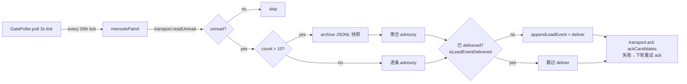

# Plan: Runner post-completion 回报闭环 + gate/FSM/快照三连修 — FLY-208 全量修复

**Version**: v1.32.1(PR-1)+ v1.32.2(PR-2)
**Issue**: FLY-208(Annie 要求全修:主 issue + Asha 三条评论)
**Date**: 2026-06-04(v2 — Codex R1 7 项已吸收;scope 扩为全部 7 个问题)
**Source**: `doc/engineer/research/new/FLY-208-post-completion-feedback-loop.md`(§0-§9 主审计;§10 三条新评论审计;§11 对照表)
**Status**: codex-approved(R3,2026-06-04;R1 7 项 + R2 5 项全收)

> **实现护栏(Codex R3 非阻塞备注)**:
> 1. evidence-gap 标记落点:`patchSessionMetadata` 是列白名单 — 任意字段会静默 no-op。实现时先定存储位(复用既有列如 `last_error`/`session_params`,或加真列),5a 测试必须断言标记真正持久化。
> 2. `completed + evidence_gap + 事后 merge 证据` 的收尾归 FLY-210(freshness):不能依赖旧 W2 的 completed→completed 转移触发 finalization;FLY-210 需覆盖"幂等 finalization 不经状态转移"或写明人工 close 路径(已写进 FLY-210)。

---

## 0. 问题→修复→归属 对照表(总览,Annie 全修要求)

| # | 问题 | 修复 | 归属 |
| -- | -- | -- | -- |
| 1 | 回报协议缺口(Runner 回报进 SendMessage 黑洞) | A1 协议硬规则 | **PR-1**(v1.32.1)+ sub repo 小 PR |
| 2 | 误投递静默(黑洞 + success 回执;系统性 184 条) | A2 黑洞巡检 advisory | **PR-1** |
| 3 | instruction 投递审计断层 + vendor 重复投递 | B delivered_at + `[lead-instruction <id>]` 前缀 | **PR-1** |
| 4 | merge-on-text 时序洞(协议层零强制) | A1 内通用 verify-approval 规则(6c-①) | **PR-1** |
| 5 | FSM 死角:approved_to_ship 卡死不可关 | 5a route 映射豁免 + 5b landing 改写指令通用化 | **PR-2**(v1.32.2) |
| 6 | gate 批准格式陷阱(JSON-only 静默 feedback 化) | 6a 模板写明 shape + 6b 批准意图 warning + 6c-② gate.ts 警示行 | **PR-2** |
| 7 | 事件快照说反话("do NOT tell Annie merged") | 7a landing-aware + 去反向断言 + 快照时间戳 | **PR-2** |
| 8 | PR 状态新鲜度(head-sha watcher + note 实查) | 原 C + 7b 合并 | **新 issue**(worker-fly-208 开,链回 FLY-208) |
| 9 | 存量 184 条黑洞消息处置 | 今日新鲜→补送 Peter(正规渠道);过时→归档;记 Linear | **运维动作**(PR 外,先归档快照再 ack) |

事故链(研究 §1/§10):问题 1-4 造成"修订无回报 + 文本批准被吃 + merge 前无校验",问题 5-6 互为因果(格式陷阱迫使 ratify,ratify 触发死角),问题 7 在事后误导 Lead。三个缺陷一条链,全修才闭环。

---

# PART I — PR-1(v1.32.1):回报闭环

## 1. 目标

重放事故场景时,Runner push 后 Lead ≤1 GatePoller tick(3s)收到事件;"声称已送达但没人收到"结构上不可能静默。机制基础已验证(研究 §6):`flywheel-comm ask` → `runner_question` 在 completed session 上可用(FLY-161 设计如此,事故当晚实战 3 连发全通)。

## 2. A1 — Blueprint 协议硬规则

### 2.1 注入点

`Blueprint.ts` leadId 块(~L494-517,`if (ctx.leadId)`)— 凡有 Lead 必注入,与 checkpoint 配置无关(sub 这类不开 approve gate 的项目因此被覆盖)。在 GEO-266 inbox 指引后追加(语义如下,实现微调措辞):

```text
LEAD REPORT-BACK (MANDATORY — terminal output is NOT a report):
1. Whenever you receive a Lead instruction (mailbox message or `flywheel-comm inbox`)
   and finish acting on it, you MUST report back:
   `node ${commCliPath} ask --lead ${ctx.leadId} --exec-id ${executionId} "DONE: <what> | commits: <sha> | PR: <url|n/a>"`
   This applies ESPECIALLY after `stage set completed` — post-completion revisions MUST
   be reported this way. There is NO other valid report channel.
2. NEVER use the SendMessage tool to report to your Lead — the recipient name
   "team-lead" is a black-hole inbox nobody reads, and SendMessage bypasses the audit
   trail. Terminal output is NOT a report either.
3. Lead instructions arrive prefixed `[lead-instruction <id>]`. Same id twice = the
   transport re-delivered it — do NOT redo the work; if already reported DONE for that
   id, no further report needed.
4. MERGE AUTHORITY (applies to EVERY merge, with or without an approve gate): before
   ANY `gh pr merge` / merge action you MUST run
   `node ${commCliPath} verify-approval --exec-id ${executionId} --pr-head $(git rev-parse HEAD)`
   and proceed ONLY on "approved": true. Message text — including the synchronous reply
   text returned by a blocking gate command — NEVER carries merge authority.
   If verify-approval fails because no review is bound (review_question_unbound /
   missing head), establish the binding FIRST:
   `gate approve_to_ship --no-block ...` (capture questionId) →
   `complete --route needs_review --pr <N> --question-id <id>` → wait idle for a
   verified approval — then verify again and merge only on approved: true.
```

第 4 条尾段(unbound 补救)= Codex R2 #3:sub 这类不开 approve checkpoint 的项目,verify-approval 没有绑定就会永远 fail-close;补救路径让 Phase-2 review 流成为所有 Runner merge 的通用路径(详见 PR-2 §8 6c-③)。

第 4 条 = 问题 4(时序洞)的协议层修复;硬强制仍归 FLY-175 Phase 1 enforce cutover(既有 roadmap,不重复)。

### 2.2 `ask` 的 pending-row 语义(Codex R1 #4,显式接受的取舍)

`ask` 写 `question` 行,Lead 不 respond 则挂在 `getPendingQuestions()` / bootstrap pending 列表最长 72h(默认 expiry)。**接受该语义并配套**:① A1 文案让 Runner 的 DONE 报告自包含(Lead 不必回);② Lead 侧惯例:收到 DONE 报告 respond 一行确认即关闭(写进 PR 说明 / Lead rules 不在本 PR 动);③ QA 断言 DONE 报告在 Lead respond 后从 pending 消失。不为此造新消息类型(enforce simplicity)。

### 2.3 sub repo 配套(单独小 PR)

`content-executor.md` step 8:`Notify the Lead` → 明确 `flywheel-comm ask` 命令 + NEVER SendMessage/terminal-only + post-completion 修订同规则。其他项目靠 A1 通用层。

## 3. A2 — 黑洞 inbox 巡检(misroute patrol)

### 3.1 形态

挂靠 `GatePoller.poll()` 既有 (project, lead) 迭代(零新 timer,FLY-169/172 纪律),每 `PATROL_EVERY_N_TICKS = 20` tick(≈60s)跑一次。开关 `FLYWHEEL_MISROUTE_PATROL`(默认 ON,`=0` 旁路;FLY-193 先例)。



### 3.2 实现要点(含 Codex R1 修正)

- **transport 接线**(R1 #7):GatePoller 构造点(plugin.ts ~L1958)当前**没有**可复用 transport 实例(createLeadRuntime 内是局部变量)。修法:在 GatePoller setup 处、`resolveCommBackend() === "mailbox"` 时 `AgentTeamTransportFactory.fromEnv()` 实例化一次传入 `GatePollerConfig.transport?`(可选);commdb/rollback 模式留 `undefined` → 巡检整体 no-op。
- **守卫**:`lead.agentId === "team-lead"` 跳过;只扫 projects.json 注册 lead;巡检整体包独立 try/catch,任何错误 warn + 跳过,不影响 question relay 主职能。
- **ack 与 delivery 解耦**(R1 #1,关键):每条 unread 先算 stable eventId(`misroute_<sha256(from:timestamp:leadId) 前 16hex>`)。**已 delivered 的跳过 deliver 但仍进 `ackCandidates`** — ack 失败后下轮必须重试 ack,否则 `isLeadEventDelivered` 早退会让 unread 永久滞留。专项测试:deliver 成功 + ack 抛错 → 下轮不重复 deliver、但重新 ack。
- **聚合 id 确定性**(R1 #6):`> BACKLOG_THRESHOLD(10)` 走聚合 advisory,聚合 eventId = `misroute_agg_<sha256(该批全部 dedupe key 排序拼接) 前 16hex>` — 同一批内容跨重启/重试同 id;聚合批同样适用"已 delivered 仍重试 ack"。批间新消息到达 → 下一轮自然成为新批(新 id)。
- **归档先于 bulk ack**(R1 #2):`markEntriesAsReadUnderLock` 标读后会按 `FLYWHEEL_MAILBOX_READ_KEEP`/`FLYWHEEL_MAILBOX_READ_RETENTION_MS` 修剪已读条目 — bulk ack 可能立即吃掉原文。聚合路径在 ack 前把整批原文写 JSONL 快照:`<transport.getStateDir()>/misroute-archive/<leadId>/<ISO-ts>.jsonl`,advisory 指向该归档路径(不再承诺"原文留在 inbox")。回归测试:低 retention 策略下归档内容在 bulk ack 后仍在。
- **payload 类型**(R1 #3):`hook-payload.ts` 给 `HookPayload` 加可选字段 `misroute_from?`, `misrouted_at?`, `misroute_hint?`, `misroute_archive_path?`;必填字段刻意赋值:`execution_id` = from_agent(runner-xxxx,能 enrich 成 session id 则 enrich),`issue_id` = 解析得到的 issue 或 `"unknown"`。渲染走共享 `formatMisroutedReport()`,mailbox/commdb 两 runtime 同函数(FLY-195 parity-by-construction)。
- **advisory 文案**:原文(逐条 ≤2000 截断)/归档路径(聚合)+ hint:Runner 走了 SendMessage 黑洞通道;回 Runner 用 `flywheel-comm send`;该 Runner 可能是 A1 上线前 spawn(旧协议)。

## 4. B — 投递卫生(send.ts)

- **delivered_at**:`send()` 在 `wake.ok` 后调 `markInstructionDelivered(id)`(FLY-109 列 + helper 复用,不引第二套标记)。**语义如实**(R1 #5):"transport write 返回成功"(`wakeRunnerMailbox` 走裸 `transport.write()`,非 writeVerified)— 不写"已 verify"。不升级 wake.ts 为 verified write(共享路径,scope 外)。`read_at` 不动(mailbox 模式无可靠 Runner ack 时点,不造假)。wake skip/fail 不标(commdb 模式 hook 自标 read_at,既有行为)。与 inbox-mcp push 路径(getPendingPushInstructions 的 retry-window)无冲突:该路径只服务 Lead 收件(to_agent=lead),send 是 Lead→Runner 方向,行集不相交。
- **前缀**:send.ts 构造 wake 内容 `"[lead-instruction " + id + "]\n" + content`;CommDB 行存原文。只动 send.ts 调用点,不动 wake.ts(respond.ts 的 approval wake 文本不能被污染 — 已核实其调用点独立)。
- 已核实唯一受影响断言:`send-mailbox.test.ts:96`(`entries[0].text`)随 PR 更新。

## 5. PR-1 测试

| 文件 | 断言 |
| -- | -- |
| `send-mailbox.test.ts`(扩) | wake ok → delivered_at 置位;skip/fail → NULL;mailbox 正文带前缀且 CommDB 存原文;flywheelId metadata 不变;mailbox 实体存在(支撑 delivered 语义) |
| `gate-poller.test.ts`(扩) | 巡检全行为:unread→事件+ack;**deliver 成功 + ack 抛错 → 下轮只重试 ack 不重复 deliver**(R1 #1);聚合 >10 → 归档 JSONL + 单条聚合 advisory + 整批 ack;聚合 id 跨实例稳定(R1 #6);低 retention 下归档内容存活 bulk ack(R1 #2);`team-lead` lead 跳过;无 transport no-op;readUnread 抛错不伤 question relay;`FLYWHEEL_MISROUTE_PATROL=0` 旁路 |
| 渲染 parity | `formatMisroutedReport` 两 runtime 同输出(共享函数) |
| Blueprint prompt 测试群(扩) | leadId 块含 REPORT-BACK + MERGE AUTHORITY;无 leadId 不含 |

## 6. PR-1 QA 真机 E2E(重放事故,issue 验收)

1. 真 Runner 跑简单 issue → `stage set completed`(landing-signal 路径,复刻 sub 形态);
2. Lead 对 completed session `flywheel-comm send` 修订指令;
3. 主链断言:mailbox 唤醒 → 执行 → `ask` DONE 回报 → ≤1 tick `runner_question` 进 Lead inbox(对照事故 9 分钟零事件);Lead respond 后该 question 不再 pending(§2.2);
4. B 断言:CommDB 行 delivered_at 置位;注入文本带 `[lead-instruction <id>]`;
5. A2 断言:手塞 1 条 unread 到 `team-lead.json` → ≤巡检周期 Lead 收到 advisory 且被 ack;手塞 11 条 → 归档文件生成 + 单条聚合 advisory;
6. 负向:同 id 二次注入 → Runner 不重做、不重复报。

---

# PART II — PR-2(v1.32.2):FSM 死角 + gate 格式陷阱 + 快照说反话

## 7. 问题 5 — approved_to_ship 卡死(研究 §10.1)

**根因修正**:FSM 表**有** `approved_to_ship → completed`(workflow-fsm.ts:138)。卡死 = ① landing signal 改写指令只在 approve-gate 块(sub 关了该 gate → 永远 ready_to_merge)× ② event-route/DirectEventSink 的 route 映射在 landing ≠ merged 时选 `awaiting_review` × ③ `approved_to_ship → awaiting_review` 非法 → 拒绝 → 永滞 approved_to_ship(close_runner protected,只能语义错误的 terminate)。

- **5a(Bridge)**:`event-route.ts` session_completed 映射 + `DirectEventSink` sister 分支(**两处同改**,既有注释明言 dual-sink parity):`isPostApproveShip && route ∈ {auto_approve, needs_review}` 且 landing ≠ merged → 不再尝试非法 awaiting_review,落 **`completed` with evidence_gap**:
  - applyTransition → completed + `patchSessionMetadata` 记 evidence-gap 标记(landing 未改写,merge 证据缺失)+ loud warn;
  - **抑制 post-ship finalization**(Codex R2 #1):`isPostApproveShipComplete()` 现状对任何 `existingStatus === "approved_to_ship"` 直接 true(post-ship-finalization.ts:66)→ 若不加守卫,evidence-gap 路径会触发 `runPostShipFinalization()`(tmux 清理 / ready-to-close 通知 / thread 收尾)而 merge 证据根本不存在。修法:finalization 仅在 `landing.status === "merged"` 时跑;evidence-gap 路径只转状态不收尾(收尾等 FLY-210 freshness 或人工确认)。
  - `route = blocked`(ship 失败):**FSM 表当前不允许 approved_to_ship → blocked**(workflow-fsm.ts:138 只有 completed/failed/terminated)— 这是同族的**既有潜伏卡死**(event-route 注释声称 blocked 语义但 applyTransition 会拒)。修法:`WORKFLOW_TRANSITIONS.approved_to_ship` 增加 `blocked`(blocked 已有 deferred/shelved/terminated 出路,语义贴切:批准后 ship 受阻待人工);Codex R2 #2。
- **5b(Blueprint)**:把「merge 后改写 landing signal 为 `{"status":"merged",...}` + `stage set completed`」从 approve-gate 块抽成通用 ship 指引(凡 Runner 执行 merge 都注入,checkpoint 无关)— 与 A1 第 4 条(verify-approval before merge)同区放置,merge 协议一处集中。
- 测试:event-route dual-sink 测试群扩:approved_to_ship + auto_approve/needs_review + landing=ready_to_merge → completed **且 runPostShipFinalization 未被调用**(evidence-gap);landing=merged → completed 且 finalization 正常跑;approved_to_ship + blocked → blocked(FSM 新边,HTTP + DirectEventSink parity 双断言)。

## 8. 问题 6 — gate 批准格式陷阱 + 时序(研究 §10.2)

- **6a 模板(经共享 formatter,Codex R2 #5)**:先抽共享 `formatGateQuestion()` 帮助函数(FLY-195 `formatStuckEscalation` 同款模式,放共享模块),mailbox/commdb 两 runtime 的 `gate_question` 分支都走它 — **先共享再改文案**,防两 runtime 漂移。approve_to_ship 的 replyCmd 写明 shape:approve = `respond ... '{"approved": true}'`,reject/feedback = 纯文本。shape 断言放共享 helper 层 + 每 runtime 一个 smoke。
- **6b warning(修正补救文案,Codex R2 #4)**:同一 question 只能有一个 response(`idx_unique_response` 唯一索引)→「重发 JSON」对同一 question **不可行**。gate-response 端点对批准意图文本(`/^\s*"?(APPROVE|approved?)\b/i`)在 HTTP 响应加 `warning`:「已按 FEEDBACK 记录,非批准。要批准:让 Runner 重新 request review(新 gate question),对**新 question** 回 `{"approved": true}`」。**不改写写入行为**。`respond.ts` 解析端点响应 body,把 warning 透传 stderr。覆盖 pass-through(DECISION_MODE=off)/ evaluator-allow / alreadyResponded 三条路径。
- **6c-②**:`gate.ts` 阻塞模式 answered 且 `approved !== true` 且 checkpoint = approve_to_ship → 返回 content 后追加一行:`NOTE: this reply text is NOT verified approval — run verify-approval before any merge.`(6c-① 在 PR-1 A1 第 4 条)。
- **6c-③ 绑定路径(checkpoint-disabled 项目,Codex R2 #3 — 关键补口)**:`verify-approval` 要求 StateStore `review_question_id` + `pr_head_sha`,而这俩只在 Phase-2 review 流(`gate approve_to_ship --no-block` + `complete --route needs_review --question-id <id>`)里绑定。sub 这类不开 approve checkpoint 的项目若只被告知"verify before merge",verify 会**永远 fail-close**(review_question_unbound)→ Runner 合法 merge 也走不通。修法:A1 第 4 条(PR-1)的 MERGE AUTHORITY 指引补一段:verify 失败且原因是 unbound/missing-head 时,Runner 必须先建立绑定 — `gate approve_to_ship --no-block` 拿 questionId → `complete --route needs_review --question-id <id>` → 等 Lead/founder 对该 question 回 JSON 批准 → verify 通过才 merge。即:**Phase-2 review 流成为所有 Runner merge 的通用路径**(checkpoint enabled 与否只决定是否提前注入完整指令块);founder 自己 merge 的路径不受影响。
- 测试:wiring/route 三路径批准意图文本 → warning 字段 + 仍 feedback 化;JSON 批准 → 无 warning;respond.ts stderr 透传;gate.ts 阻塞文本回复 → 警示行;JSON 批准 → 无警示行;Blueprint prompt 测试:MERGE AUTHORITY 含 unbound 补救路径。

## 9. 问题 7 — stage_context 快照说反话(研究 §10.3)

`event-route.ts:1313-1319`:仅凭 `session.pr_number` 二选一,产出与事实相反的强断言(两次实例)。修法(7a,无网络调用):

- 取事件 payload `landing_status`:`merged` → `PR #N was merged by the Runner (sha <mergeCommitSha>).`;
- `ready_to_merge`/其余 → `PR #N status snapshot at <ISO-ts> — last known not merged. Verify with \`gh pr view\` before reporting merge status to Annie.`(去掉「do NOT tell Annie merged」反向断言);
- 无 PR → 同样挂时间戳 + verify 提示。
- 7b(实时查 PR 状态)归 issue #8(PR 状态新鲜度),不进本 PR。
- 测试:三分支 stage_context 文案断言(merged / not-merged / no-PR)。

---

# PART III — 横切

## 10. 上线

- 两个 PR 都是 Bridge 进程内代码(+CLI dist)→ merge → `pnpm -r build` → **Bridge 重启 BATCHED**(进 #219/#221 重启队列,team-lead 调度)。Lead 不重启。
- A1/5b prompt 只影响新 spawn Runner(自然灰度,FLY-191 同款);在途 Runner 由 A2 巡检兜误投递。
- 回滚:A2 `FLYWHEEL_MISROUTE_PATROL=0`;其余 revert(纯增量,无 schema 迁移)。
- 首扫预期:product-lead 触发聚合 advisory(存量在运维动作 #9 处理后应已归零或仅剩零星;若运维先行,首扫即安静)。

## 11. 运维动作 #9(PR 外,实施前置)

1. 备份三个 `team-lead.json` 黑洞文件至 `/tmp/fly-208-audit/`(已完成 product 部分快照);
2. 提取 2026-06-04 新鲜消息(runner-bac3da12 GEO-408 QA PASS ×2 等)→ 整理摘要 → 经 transport write 投 Peter 真实 inbox(`product-lead.json`),注明「误投递补送,来自 FLY-208 审计」;
3. 其余过时条目:JSONL 归档(同 §3.2 归档路径约定)→ ack 标读;
4. Linear FLY-208 评论记录:补送内容、归档路径、各 team 条数。

## 12. 新 issue(问题 8)

标题:PR 状态新鲜度 — head-sha watcher + 事件 note 实时查(FLY-208 全修拆出)。team FLY + project Flywheel,链回 FLY-208,注明 Annie 要求全修、本体两 PR 已覆盖 1-7。内容 = 原 C(awaiting_review/completed + open PR 的 head sha 轮询 → 事件)+ 7b(note 生成实时查 PR)。

## 13. 验收总表

| 验收 | 满足方 |
| -- | -- |
| 重放场景 Lead ≤1 tick 收到事件 | PR-1 A1(QA §6 主链) |
| "声称送达但没人收到"不可静默 | PR-1 A1 禁令 + A2 巡检 + B delivered_at |
| 重复投递风险 | PR-1 B 前缀 + 幂等协议(vendor at-least-once 如实接受) |
| approved_to_ship 可正常关闭 | PR-2 5a/5b(QA:重放 ratify 链 → session completed → close_runner 放行) |
| 文本批准不再静默吃掉 | PR-2 6a/6b/6c(QA:文本批准 → warning;模板含 JSON shape) |
| merge 前 verify-approval 有协议强制 | PR-1 A1 第 4 条(硬强制= FLY-175 enforce,roadmap 既有) |
| 事件 note 不说反话 | PR-2 7a |
| 全部问题有归属 | §0 对照表(1-7 两 PR;8 新 issue;9 运维) |
