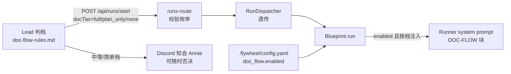

# Plan: Project doc-flow baseline — 部门优先文档管理（可选标配 + 补装）

**Version**: v1.33.0
**Issue**: FLY-205
**Date**: 2026-06-04
**Source**: `doc/engineer/exploration/new/FLY-205-doc-flow-baseline.md`（Part C = Annie 5 轮拍定合同）, `doc/engineer/research/new/FLY-205-doc-flow-baseline.md`
**Status**: codex-approved（4 轮，R1×7 + R2×5 + R3×2 全收，R4 APPROVED）

> **实现期注意（Codex R4 非阻塞提示）**：① `DocTier` 校验集中一处（route 旁共享 parser/guard），HTTP 入口/StateStore 持久化/retry 读取/Blueprint 拼装全部复用，不准各层手写枚举；② 改 `upsertSession()`/`persistTransition()` 手写 SQL 时 column/placeholder/values/conflict-update 四件套一次 patch 改齐，**先跑 StateStore round-trip 测试再继续**（positional 列表错一列能编译但毁数据）。

---

## Goal

**主交付物 = 可复用的 setup flow 本身**（Annie 明确排序）：定下"文件夹如何归档、一轮一轮怎么做"的模式后，**以后任何项目转成 Flywheel 时都被一模一样地 setup**，且 setup 时给一个选项 —— 要走这个 flow 就全套启用，不要就完全零侵入。具体形态：部门优先文档管理 baseline，启用后 Runner 按 Lead 判定的三档难度（full / plan_only / none）自动在 `<部门>/doc/<ISSUE>-<slug>/` 产出 exploration / research / plan 文档（统一 3 行抬头、无状态子目录、文档随 branch 进 main）；Lead 判档 + 中等及以下档 Discord 知会 Annie（可随时否决）。

**sub 和 joycon 不是两个独立手工活，是该机制的前两次真实运行（验收场景）** —— 补装尽量走同一条机制路径（同一条命令、同一份模板），手工特例最小化且显式标注。

## 新项目接入操作流（Annie 视角 — 本 issue 的核心验收镜头）

第 N 个新项目转成 Flywheel 时：

| 步 | Annie 做什么 | 系统自动做什么 |
|----|------------|--------------|
| 1 | onboarding 时回答一个问题："这个项目启用 doc-flow 文档管理吗？部门名叫什么？"（如 content / product） | — |
| 2a | 答"要" | 跑 `scripts/setup-doc-flow.sh <root> <dept>`（onboarding 流程的标准一步）：建 `<dept>/doc/{,retro/}` + 约定自述 README + config.yaml 写入 `doc_flow` 块。**该 config 键就是选项的持久化**，没有第二个开关存放点 |
| 2b | 答"不要" | 什么都不写，项目零侵入（spawn prompt 字节不变）。以后想要了，跑同一条命令即是补装 —— **新装和补装是同一条路径** |
| 3 | 之后正常派 issue | Lead 按规则判档（拿不准往高判）→ spawn 带 `docTier` → Runner 自动按档在 `<dept>/doc/<ISSUE>-<slug>/` 落文档 → 中等/简单档 Annie 收到 Discord 知会，可随时否决要求补 |
| 4 | review PR 时 | 文档随 feature branch 出现在 PR 里，merge 即归档进 main |

验收判据：① 同一条命令对任何项目跑出**一致**的结构（幂等可重跑）② 不启用 = 字节级零变化 ③ sub/joycon 两次真实运行走的就是这条路径。

## Architecture（一句话）

复用三条生产通道，零新服务：`doc_flow` 配置键（ConfigLoader 白名单校验天然向后兼容）→ Blueprint `systemPromptLines` 条件注入块（照 FLY-47 checkpoints 模式，agent.md 前置不覆盖 Baseline Rules）→ Lead 行为走 lead-rules-base 新文件（FLY-175 founder-only-authority 装载模式）。档位经 `/api/runs/start` 可选 body 字段 `docTier` 三层透传（照 `agentName` 字段先例），缺省 `full` fail-safe。



## Scope Boundaries

**In scope**：
- `doc_flow` 配置键（schema + 校验 + 测试）
- `docTier` 透传（runs-route → RunDispatcher → BlueprintContext）+ Blueprint DOC-FLOW 注入块（三档 × agent.md 有无）
- Lead 规则新 base 文件（判档标准 + 知会模板 + 否决处理）
- 脚手架/补装脚本 `scripts/setup-doc-flow.sh`
- `agents/generic-executor.md` 补 doc-flow 约定段；`doc/architecture/product-experience-spec.md` §4.1 修订（v2 措辞已过 Annie）
- sub 补装 PR（物理搬家 + 启用）；joycon 补装 PR（纯新增，挂着）

**NOT in scope**（exploration Part C / research §5 拍定出界）：
- GeoForge3D 大树迁移（Annie 拍定不动）
- joycon 物理搬家（另立 issue，等 main/vault 理顺）
- 状态子目录 / archive 机制（拍定砍掉）
- Lead 知会的代码化通路（纯 prompt 行为，走现有 Discord 能力）
- sub git 化（实测已是 git + GitHub）
- Flywheel 仓库自身 doc 树改造（保持现行规范）

---

## Phase 1 — 配置键（packages/config）

**1.1** `packages/config/src/types.ts`：

```ts
/** FLY-205: 部门优先 doc-flow baseline 配置 */
export interface DocFlowConfig {
	enabled: boolean;
	/** 部门目录名（如 "content"/"product"）。enabled=true 时必填（validation 强制）。
	 *  类型上 optional —— enabled=false 的合法 config 可以不带它（Codex R2 #4:
	 *  必填类型 + 宽松校验会让消费方在 TS 上误信 disabled config 也有值）。
	 *  消费方在 `enabled === true` 分支内做 runtime narrow 后使用。 */
	default_department?: string;
}
// FlywheelConfig 增加:
doc_flow?: DocFlowConfig;
```

**1.2** `ConfigLoader.validate()`（Codex R1 #7 收紧）：`doc_flow` 存在时 —— 必须是 mapping（非 mapping 抛错）；`enabled` 必须 boolean；`default_department` **无论 enabled 真假**只要存在就必须非空 string 且匹配 `^[a-z0-9-]+$`（拒绝 `/`、`..`、空格、大写）；`enabled === true` 时 `default_department` 必填。`doc_flow` 缺省 = 功能关闭（未知 key 原样通过已实测，旧 checkout 兼容）。

**1.3** `packages/config/src/index.ts` export `DocFlowConfig` 类型（Codex R1 #7：消费方从包根 import）。

**1.4** 测试（`packages/config/src/__tests__/`）：合法 / 缺 default_department 抛错 / 非法字符抛错 / 非 mapping 抛错 / enabled=false 带非法 department 也抛错 / 缺省通过，共 6 例。

## Phase 2 — docTier 透传 + Blueprint 注入（packages/teamlead + packages/edge-worker）

**2.1 类型与透传**（照 FLY-137 `agentName` 字段先例）：
- `retry-dispatcher.ts::StartRequest` + `runs-route.ts` body：可选 `docTier?: "full" | "plan_only" | "none"`；非法值 → 400 `INVALID_DOC_TIER`（同步校验，照 agentName 的 InvalidAgentNameError 教训在 route 层先验）
- `run-dispatcher.ts` → `BlueprintContext` 增加 `docTier`；缺省 `"full"`（fail-safe：Lead 没说就走全套）
- **retry 保档 — StateStore 显式 schema**（Codex R1 #3 + R2 #1：`patchSessionMetadata` 是白名单列更新，非通用 metadata，按原计划实现会被 fieldMap 静默吞掉）：
  - migration：sessions 表加 `doc_tier TEXT`（nullable）；共享 `DocTier = "full" | "plan_only" | "none"` 类型（写入校验只收这三值）
  - **写入面全覆盖（Codex R3 #2 — 不留"类型可写但 SQL 静默不持久化"的暗坑）**：`SessionUpsert` / `Session` / `patchSessionMetadata` fieldMap / row→session mapping 四处之外，`upsertSession()` 和 `persistTransition()` 的手写 INSERT column/VALUES/ON CONFLICT update 列表**同步加列**（与现有 StateStore 字段模式一致；`issue_url` 同样处理）
  - **start 和 retry successor 都写 `doc_tier`**（否则二次 retry 漂移回 full）；retry 读 `session.doc_tier ?? "full"`（老 session 无列值才回退）
  - 测试：StateStore round-trip（**upsertSession 与 patchSessionMetadata 两条写路径都验**）+ retry 保档 + **retry-of-retry 不漂移** 4 例
- **issueKey + Linear URL 数据通路**（Codex R1 #2 + R2 #2 retry 闭环）：文档抬头合同需要 `Issue: <KEY> (<linear-url>)`，现 PreHydrator/StartRequest 都没有 URL。边界算好再注入：runs-route 的 Linear preflight 读 `issue.url` + `issue.identifier`，扩展 `StartRequest`/`RetryRequest`/`BlueprintContext`（`issueIdentifier?`、`issueUrl?`）；**sessions 表同 migration 加 `issue_url TEXT`（nullable），start 时持久化，retry 从 session row 读**（现 retry 只从 session 取 identifier/title，不存 URL 会让 retry 文档头降级、同 issue 抬头不一致）。Blueprint 取 `issueKey = ctx.issueIdentifier ?? hydrated.issueId`、`issueUrl = ctx.issueUrl`；DOC-FLOW 块直接给具体值（`Folder: <dept>/doc/${issueKey}-<slug>/`、抬头 URL 行给实 URL，URL 真不可得时写"(URL 不可得,只写 issue 号)"降级）。测试断言 prompt 用 identifier 而非 UUID，**start 与 retry 的 prompt 都含 URL**。

**2.2 Blueprint 构造**：`run-infra.ts` L311 构造点增加 `docFlowConfig`（从已加载的项目 FlywheelConfig 取 `doc_flow`，与 `checkpointConfig` 同源同模式）；`scripts/lib/setup.ts` L513 同步。**参数位置（Codex R2 #5）：追加到 constructor 参数列表最末尾，禁止插在 `checkpointConfig` 与 `flywheelRepoRoot` 之间**（长 positional constructor，错位会让 shipped-generic 的 flywheelRepoRoot 退化）。回归测试：doc_flow enabled + shipped-generic fallback 仍能加载 `agents/generic-executor.md`。（options object 重构留作后续，不在本 issue 扩scope。）

**2.3 注入块**（`Blueprint.run()`，加进 `systemPromptLines`，位置在 onboard preamble 之后、6 步基础流程之前）。仅当 `docFlowConfig?.enabled === true` 注入。

**部门解析 helper**（Codex R1 #1 — 原三元式会把 `"multiple"` 写成目录名）：

```ts
export function resolveDocFlowDepartment(
	owningDept: string | "multiple" | undefined,
	defaultDepartment: string,
): string {
	return typeof owningDept === "string" && owningDept !== "multiple"
		? owningDept
		: defaultDepartment;
}
```

测试必须覆盖 `"multiple"` 与 `undefined` 都回退 default_department。

**docTier 语义边界**（Codex R1 #5 — 与 executor 硬 gate 的冲突消解）：`docTier` **只控制文档产出，不控制阶段/gate**。brainstorm gate（FLY-47 checkpoint，Lead 确认理解）、executor 自带的 hard gate（generic-executor "NEVER skip brainstorm"、sub content-executor 的 B/R/P gate）**照旧执行，任何档位都不跳**——Annie 合同里"简单档跳过"指的是文档（"可零文档直接实现"），不是 Lead 确认环节。DOC-FLOW 块显式声明这条边界；generic-executor / sub executor 文本不需要为 docTier 松动。

三档文本（要点，实现时细化措辞；`<dept>`/`<issueKey>`/`<linear-url>` 为服务端烤入的具体值）：

```
DOC-FLOW (project doc conventions — this project has doc_flow enabled):
Doc tier for this task: <tier> (set by your Lead; full = default).
This tier controls DOCUMENT OUTPUT ONLY — all checkpoint gates and your
agent-role gates (brainstorm confirmation etc.) still apply at every tier.
Folder: <dept>/doc/<issueKey>-<slug>/ — before creating it, `ls <dept>/doc/`
and REUSE any existing folder with the <issueKey>- prefix; derive a 2-4 word
lowercase kebab slug from the issue title. Docs travel with your branch and
merge to main in your PR. Do NOT create status subdirectories (no draft/new/
inprogress/archive) — progress lives in Linear only.
- full: BEFORE writing implementation code, produce exploration.md,
  research.md, plan.md in that folder. Stage reporting: run
  `flywheel-comm stage set brainstorm|research|plan` as you enter each
  phase; after writing plan.md run
  `flywheel-comm stage set design_review --plan <dept>/doc/<issueKey>-<slug>/plan.md`
  and follow the existing design-review gate flow before implementing.
- plan_only: produce only plan.md in that folder before implementation,
  then the same `stage set design_review --plan <path>` step.
- none: no process docs required for this task.
Every doc starts with title + 3 lines:
  # <issueKey> <短标题> — <文档类型>
  Issue: <issueKey> (<linear-url>)
  日期: <today>
  基于: <同文件夹上游文档名 / 无>
```

（`design_review --plan` 必带相对路径 —— Codex R1 #4：Bridge 的 Codex auto-trigger 监听 `stage_changed=design_review` 且 fail-closed 要求 `--plan`；只报 `plan` 不触发 review。测试断言 prompt 含 `design_review --plan`。）

**2.4 测试**（`packages/edge-worker/__tests__/` 既有 Blueprint 测试模式）：
- enabled × 3 档 × agent.md 有/无 = 6 例：DOC-FLOW 块在、`## Baseline Rules` 仍在
- `resolveDocFlowDepartment`：string 直通 / `"multiple"` 回退 / `undefined` 回退 3 例
- issueKey/URL：prompt 用 identifier 非 UUID、URL 缺失降级 2 例
- prompt 含 `design_review --plan <path>`（full + plan_only 两档）
- **off = 字节级不变 sentinel**（照 FLY-175 reverse-compat 先例：doc_flow 缺省时 systemPrompt 与现 prod 逐字相等）
- runs-route：docTier 合法透传 / 非法 400 / 缺省 full / metadata 持久化 4 例；retry 保档（plan_only 会话 retry 仍 plan_only、老 session 无 metadata 回退 full）2 例

## Phase 3 — Lead 规则 + 文档面修订

**3.1** 新文件 `packages/teamlead/lead-rules-base/doc-flow-rules.md`（中文，结构照 founder-only-authority.md）：
- **适用条件**开头声明：项目 `.flywheel/config.yaml` 含 `doc_flow.enabled: true` 才适用；未启用项目零行为变化。**数据来源（Codex R3 #1 — Lead pane env 现在没有 PROJECT_DIR，LEAD_WORKSPACE 隔离使 pwd 不可用）**：`claude-lead.sh` 的 env_args 增加 `FLYWHEEL_PROJECT_DIR=${PROJECT_DIR}`，规则文本只读 `$FLYWHEEL_PROJECT_DIR/.flywheel/config.yaml` 自查（env 缺失 → 当作未启用，fail-safe 到零行为）。参数构造测试断言该 env 在 env_args 中
- **三档判定标准**：复杂 = 新架构/跨系统/多文件/风险未知 → full；中等 = 边界清楚的已知形态改动 → plan_only；简单 = 琐碎修复/文案/配置一行 → none；**拿不准 → 往高档判**
- **spawn 传参**：`POST /api/runs/start` body 带 `docTier`
- **知会义务**（中等 + 简单档都要，Round 3/4 拍定）：在部门 chat 频道发，模板（Round 3 mock 格式 + 注明档位），**不等回复**，Runner 同时开干
- **否决处理**：Annie 任何时候回知会消息 → Lead 立即用 `flywheel-comm send` 指示 Runner 暂停实现、补齐对应档文档再继续；若 Runner 已 needs_review，补文档进同一 PR
- **装载范围**（Codex R1 #6 — 判档是 spawn 行为，不是 universal authority）：装载块放 **non-cos dept-lead 分支**（紧挨 executor-routing / stuck-runner-remanage 的现有条件块），cos-lead（`canSpawnRunners: false`）不装载；缺文件跳过向后兼容。`claude-lead.sh` 参数构造测试（照 test-fly26-rules-split.sh 模式）：dept lead 含该 append / cos lead 不含 / **env_args 含 `FLYWHEEL_PROJECT_DIR`**，3 例

**3.2** ~~`agents/generic-executor.md`：补一段 "Doc-flow conventions"~~ **实现期撤销（Codex code review R1 HIGH-1）**：generic-executor.md 是静态文件，是零配置项目的 prompt 表面 —— 加任何 doc-flow 文字（哪怕条件措辞）都会让 doc_flow 关闭的项目 prompt 字节变化，违反 default-off 字节兼容合同。DOC-FLOW 注入块本身已自含全部约定，无需 executor 侧重复。补充 sentinel 测试：shipped-generic + 配置缺失 → prompt 零 doc-flow 文字。

**3.3** `doc/architecture/product-experience-spec.md` §4.1：删 "不可跳过任何阶段"，替换为 Annie 过目的 v2 三档文本（exploration Round 4 纪要原文）

## Phase 4 — 脚手架 = 机制唯一入口（本 plan 的心脏，设计深度与测试优先级最高）

`scripts/setup-doc-flow.sh <project-root> <department>` —— **新项目启用、已有项目补装、sub/joycon 验收，全部走这一条命令**。没有第二条路径。

1. 校验 department 匹配 `^[a-z0-9-]+$`；project-root 必须是 git 仓库根（`git rev-parse --show-toplevel` 核对，防止跑错目录）
2. `mkdir -p <root>/<dept>/doc/retro` + `touch <dept>/doc/retro/.gitkeep`（不存在才创建 —— Codex R2 #3：空目录不进 git，没有 .gitkeep 的话 joycon 纯新增 PR 实际只会有 README、retro 目录丢失）
3. 写 `<dept>/doc/README.md`（heredoc 内置模板，中文自述：树形约定 + 命名规则 + 3 行抬头模板 + "无状态子目录，进度看 Linear" + 三档说明）—— 已存在则跳过（幂等）
4. `.flywheel/config.yaml` 存在且无 `doc_flow:` → 追加注释完备的 doc_flow 块；已有 → 不重复写并提示。幂等检测用 **anchored grep `^[[:space:]]*doc_flow:`**（裸 grep 会被注释/字符串误伤，Codex R1 #7），追加前保证文件末尾有换行（无则补）。不存在 `.flywheel/` → **skeleton-only 模式（显式支持的形态，非缺陷）**：仍建目录 + README，结尾打印"config 未接线"指引退出 —— joycon main 补装走的就是这个模式
5. 结尾打印"接下来"提示：① projects.json lead 补 `department` 字段（如与目录名不一致）② Bridge 需运行含本功能的版本
6. **一致性保证**：模板只有 heredoc 这一份真相源 —— 任何项目、任何时间跑，产出结构逐字一致
7. **onboarding 集成**：`/onboarding` 相关 runbook / `doc/engineer/onboarding/` 文档加一节"可选：doc-flow 文档管理"，明确这个问题在 onboarding 必问、答案即跑/不跑这条命令。`doc_flow` config 键本身就是选项的持久化，不另设 flag 存放点
8. 测试：bash 测试照 `packages/teamlead/scripts/test-fly26-rules-split.sh` 模式 —— 全新项目产出结构断言（README **+ retro/.gitkeep** 都在，`git status --porcelain` 证明 skeleton-only 的 PR 面完整）/ **重跑幂等（两次运行 diff 为空）** / 已有 doc_flow 不重复注入 / 无 .flywheel skeleton-only 路径 / 非 git 根拒绝，共 5 例

## Phase 5 — sub 补装 = 机制第一次真实运行（sub 仓库 PR）

> 实现期单独 PR 到 `xrliAnnie/sub`；本仓库 plan 只锁清单与收口标准。**机制路径与项目特有前置显式分开**：

**项目特有前置（sub 独有，一次性）**：
1. `git mv` 入 `content/`：`brief/ references/ research/ projects/ scripts/ docs/ nanobanana-output/`（root 留：AGENTS.md、README、`.flywheel/`、`.lead/`、`worktrees/`）—— 这是"代码搬进部门"的历史债，新项目从第一天部门优先就没有这步
2. 改路径引用（research §3.3 实测清单 ~25 处）：AGENTS.md、`.flywheel/agents/content-executor.md`（含 scripts/*.sh 引用 + **文档产出路径改指 `content/doc/<ISSUE>-<slug>/`**）、`.flywheel/config.yaml` skills 三行、sub-create skill 内部路径

**机制路径（与任何项目一字不差）**：
3. 跑 `setup-doc-flow.sh . content` → `content/doc/` + README + config.yaml `doc_flow` 块
4. 机器本地（非 PR）：`~/.flywheel/projects.json` sub-lead 补 `department: "content"`

**收口标准**（QA 真机）：全仓 grep 旧路径零命中（逐一列：`grep -rn "scripts/style-lint" --exclude-dir=content` 等）→ `bash content/scripts/style-lint.sh` 跑通 → sub-create 引用 dry 校验 → 合并后**经 Annie 同意**重启 Asha（FLY-175：Lead 生命周期动作过 founder）

## Phase 6 — joycon 补装 = 机制第二次真实运行（纯新增 PR，挂着）

- 自 `origin/main` 开分支，**机制路径同一条命令**：`setup-doc-flow.sh . product`（在无 `.flywheel/` 的 main 上自动走"骨架 + 指引"分支 = 只产出 `product/doc/README.md` + `product/doc/retro/.gitkeep`，纯新增文件，与 Annie 未提交改动零冲突面）—— 正好验证脚本的"无 .flywheel 项目"路径
- PR 描述注明：挂着等 Annie 理顺 main/vault 后合；物理搬家另立 issue
- **config 启用切到 `flywheel-main` 工作分支做**（Hiro 的 Runner projectDir 实指 `worktrees/flywheel-main`，Blueprint 从那里读 config.yaml —— doc_flow 加在 origin/main 的 PR 上不会生效）；该分支上跑同一条 `setup-doc-flow.sh`（此处有 .flywheel/，走完整路径），由 Annie 点头后执行
- `~/.flywheel/projects.json` joycon-lead 已有 `department: "product"`，无动作

## 实施顺序与 PR 切分

| PR | 内容 | 仓库 |
|----|------|------|
| PR-1（本仓库，held）| Phase 1-4 全部 + 测试 + spec/generic-executor 修订 + 文档归档 git mv | flywheel |
| PR-2 | Phase 5 sub 补装 | sub |
| PR-3（挂着）| Phase 6 joycon 骨架 | joycon-typeless |

PR-1 合并 + Bridge 重启（**攒重启纪律**：与在途 Bridge PR 合并一次重启）后 PR-2 才有意义（sub 的 doc_flow 块要新 Bridge 代码才被注入）。PR-2/PR-3 实现期开工前把 PR 计划给 Annie 过目（建仓/重启类动作全过 founder）。

## 测试汇总

- 单测：Phase 1 ×6、Phase 2 ×23（含 off 字节不变 sentinel、`"multiple"` 回退、StateStore 双写路径 round-trip、retry-of-retry 不漂移、start+retry 双 URL、design_review --plan 断言、shipped-generic 构造参数回归）、Phase 3 claude-lead.sh ×3（dept 装载 / cos 不装载 / FLYWHEEL_PROJECT_DIR env）、Phase 4 脚本 ×5（**幂等 = 两次运行 diff 为空**，机制一致性是主验收判据）
- 集成：runs-route docTier → Blueprint 注入端到端（既有 runs-route 测试模式扩展）
- 真机（QA worker）：sub PR 收口三件套 + 启用后真 spawn 一个 plan_only 档 Runner 验证文档落到 `content/doc/<ISSUE>-<slug>/`、抬头 3 行合规
- 回归红线：doc_flow 未配置的项目（GeoForge3D）spawn prompt 字节不变
- **机制一致性验收**：sub 与 joycon 两次补装走同一条 `setup-doc-flow.sh`，产出结构与脚本测试断言逐字一致（"以后任何项目"成立的证据）

## 风险与对策

| 风险 | 对策 |
|------|------|
| Runner slug 不稳定（同 issue 两次跑出不同 slug 文件夹）| 注入块要求先 `ls <dept>/doc/` 找既有 `<ISSUE>-` 前缀文件夹复用；issue 号是主键，slug 仅可读性 |
| docTier 与项目 executor 流程冲突（sub content-executor 自带 B/R/P gate）| 职责切分：executor 管流程/gate，DOC-FLOW 块只管文档落点与抬头；sub PR 同步改 executor 产出路径 |
| Lead 忘传 docTier | 缺省 full，宁多勿漏；Lead 规则要求显式传 |
| sub 搬家漏改引用 | 收口标准 = 全仓 grep 旧路径零命中（机器可验，非人眼）|
| joycon config 改在工作分支与未来 reconcile 冲突 | 改动最小化（一个 yaml 块 + 骨架目录），PR-3 注明;物理搬家等理顺 |
| Bridge 重启窗口 | 攒重启纪律 + 协调 QA hot-deploy（memory 既有红线）|

---

## 实现期经验（retro 素材，2026-06-04）

1. **纯文本批量路径改写的收口必须多形态 sweep**（sub#17 Codex 3 轮的教训）：
   - 单一 boundary 正则（`(?<![a-zA-Z0-9_/.-])dir/`）会漏 **`./dir/` 可执行形**（40 处漏网，含 canonical SKILL 步骤和 Bash allowlist —— Runner 真跑会断）；
   - 补 `\./dir/` 形时会**尾匹配 `../dir/` 相对链接**（6 个 href 被搅成 `.content/`）——同移目录间的 `../` 相对引用本就不该改；
   - 收口标准 = boundary 形 + `./` 形 + 双前缀自检 **+ 改写产物校验**（链接解析、style-lint 等可执行检查），缺一不可。
2. **静态 prompt 表面文件 = 无条件字节面**（#223 Codex R1 HIGH-1）：给 shipped 静态 .md 加"条件措辞"的段落不构成条件注入 —— 字节已变。byte-compat 合同下，条件行为只能放真正的条件注入点（代码分支）。
3. **dispatcher 返回 ≠ session 行已建**（#223 Codex R1 HIGH-2）：emitStarted 异步建行，dispatch 后立刻 getSession 是竞态；mock 同步建行会把它遮住。补 metadata 一律走 `waitForSession` 有界轮询；mock 要模拟延迟建行才有保护力。
