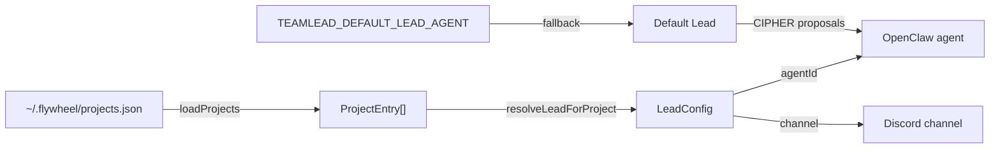
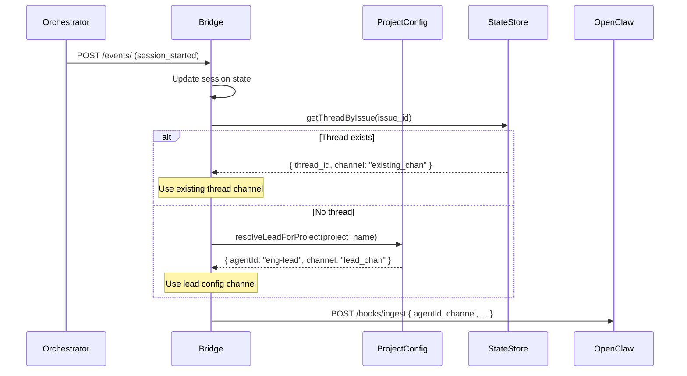

# Multi-Lead / Multi-Team Routing Implementation Plan

**Goal:** 将 Flywheel 的 agent 通知路由从单一硬编码 `"product-lead"` 改为配置驱动，每个 project 对应独立的 Lead agent + Discord channel。
**Architecture:** 扩展 `ProjectEntry` 添加 required `lead` 字段（agentId + channel），创建 `resolveLeadForProject()` 解析函数，替换 **5 处** 硬编码 + 1 处单一 channel config。
**Research doc:** `doc/engineer/research/new/GEO-152-multi-lead-routing.md`
**Issue:** GEO-152
**Version:** v1.4.0
**Date:** 2026-03-18
**Status:** codex-approved
**Codex Review:** Rounds 1-4 — all design feedback incorporated below

---

## Design Decisions (from Codex Round 1)

| Decision | Choice | Rationale |
|----------|--------|-----------|
| `lead` field required or optional? | **Required**, no fallback | Annie 明确要求每个 project 必须配 lead |
| CIPHER proposal（无 project_name）通知策略 | **保留全局默认 lead** 用于 project-less 通知 | CIPHER proposals 是系统级事件，不属于任何 project。在 `index.ts` 中硬编码为 config 中的 `defaultLeadAgentId` |
| Thread channel source of truth | **已有 thread 时用 `conversation_threads.channel`；无 thread 时用 `project.lead.channel`** | 避免 lead config 变化导致 thread 和 channel 分叉 |
| Repo-local vs external | **分成两部分：代码变更 (PR) + 外部操作 (checklist)** | 清晰分工，不阻塞 code path |

## All Hardcoded "product-lead" Locations (5 处)

| # | File | Line | Context |
|---|------|------|---------|
| 1 | `packages/teamlead/src/bridge/event-route.ts` | ~406 | Event ingest notification |
| 2 | `packages/teamlead/src/bridge/actions.ts` | ~82 | Post-action hook |
| 3 | `packages/teamlead/src/HeartbeatService.ts` | ~203 | Stuck/orphan notification |
| 4 | `packages/teamlead/src/DirectEventSink.ts` | ~188 | Bridge-local retry notification |
| 5 | `packages/teamlead/src/index.ts` | ~50 | CIPHER proposal notification |

---

## Phase Overview

```mermaid
gantt
    title GEO-152 Multi-Lead Routing
    dateFormat X
    axisFormat %s

    section Phase 1: Config
    LeadConfig type + validation         :t1, 0, 4
    resolveLeadForProject function       :t2, 4, 3
    defaultLeadAgentId for CIPHER        :t3, 7, 2
    projects.json migration              :t4, 9, 2

    section Phase 2: Routing
    event-route.ts dynamic routing       :t5, 11, 3
    actions.ts dynamic routing           :t6, 14, 3
    HeartbeatService dynamic routing     :t7, 17, 4
    DirectEventSink dynamic routing      :t8, 21, 3
    index.ts CIPHER default lead         :t9, 21, 2

    section Phase 3: Cleanup + Tests
    BridgeConfig cleanup                 :t10, 24, 2
    Full test matrix update              :t11, 24, 5
    GEO-148 close + doc update           :t12, 29, 3
```



## Phase 1: Config Foundation

### What We're Building

让每个 project 配置自己的 Lead agent。同时添加一个 `defaultLeadAgentId` 用于无法关联 project 的系统级通知（如 CIPHER proposals）。

### Data Flow



### Tasks

| # | Task | What It Does | Deliverable |
|---|------|-------------|-------------|
| 1 | LeadConfig type + loadProjects validation | ProjectEntry 添加 required lead 字段，加载时校验 | 缺 lead 时报明确错误 |
| 2 | resolveLeadForProject function | 根据 project_name 找到对应 lead config | 单元测试通过 |
| 3 | defaultLeadAgentId config | BridgeConfig 添加 defaultLeadAgentId 用于 project-less 通知 | CIPHER proposal 可路由到默认 lead |
| 4 | projects.json migration | 更新现有配置文件添加 lead 字段 | 服务正常启动 |

### Phase Deliverables

- **Demo**: `loadProjects()` 加载带 lead 的配置不报错；缺少 lead 时明确报错
- **Verification**: `pnpm test` 全部通过
- **Artifacts**: 修改 `ProjectConfig.ts`、`config.ts`、`types.ts`

---

## Phase 2: Dynamic Routing

### What We're Building

替换 5 处硬编码 `"product-lead"` 为动态解析。Thread channel 使用 canonical thread 的 channel（已有 thread 时），或 lead config channel（首次通知时）。

### Data Flow



### Tasks

| # | Task | What It Does | Deliverable |
|---|------|-------------|-------------|
| 5 | event-route.ts dynamic routing | 用 project lead 代替硬编码，thread channel 优先已有 | 不同 project event 发到不同 agent |
| 6 | actions.ts dynamic routing | action hook 用 project lead 路由 | approve/retry 通知到正确 agent |
| 7 | HeartbeatService dynamic routing | stuck/orphan 用 per-session lead 路由 | 重构 notifier per-notification 解析 |
| 8 | DirectEventSink dynamic routing | bridge-local retry 用 project lead 路由 | DirectEventSink 不再硬编码 |
| 9 | index.ts CIPHER default lead | CIPHER proposal 用 defaultLeadAgentId | 系统级通知有明确路由 |

### Phase Deliverables

- **Demo**: 两个不同 project 的 event 各自路由到不同 OpenClaw agent；CIPHER 通知发到默认 lead
- **Verification**: E2E 测试通过，mock gateway 收到正确 agentId
- **Artifacts**: 修改 5 个 source files + `plugin.ts` wiring

---

## Phase 3: Cleanup + Tests + Documentation

### What We're Building

清理 deprecated config，全面更新测试矩阵（覆盖所有 affected test files），关闭 GEO-148，更新文档。

### Tasks

| # | Task | What It Does | Deliverable |
|---|------|-------------|-------------|
| 10 | BridgeConfig cleanup | `notificationChannel` 标记 deprecated | 代码不再依赖全局 channel |
| 11 | Full test matrix update | 更新所有 test fixtures 和 assertions | CI green |
| 12 | GEO-148 close + doc update | 标记 Cancelled，更新 lead-experience.md Slack→Discord | Linear + docs 更新 |

### Test Matrix (Task 11)

| Layer | Files | What to verify |
|-------|-------|---------------|
| Config validation | `ProjectConfig.test.ts` (new) | Missing lead, invalid lead, duplicate name, valid config |
| Config: default lead | `config.test.ts` (new) | defaultLeadAgentId default, env override, empty throws |
| Unit: event routing | `event-route.test.ts` | Different projects → different agentId/channel; thread channel priority |
| Unit: action hooks | `actions.test.ts` | sendActionHook routes to project lead |
| Unit: heartbeat | `HeartbeatService.test.ts`, `StuckWatcher.test.ts` | Per-session lead; thread channel priority |
| Unit: direct sink | `DirectEventSink.test.ts` (new) | Project lead routing; thread channel priority |
| Unit: CIPHER | `cipher-default-lead.test.ts` (new) | defaultLeadAgentId usage |
| E2E: bridge | `bridge-e2e.test.ts` | Full flow with lead-aware project |
| E2E: retry | `retry-e2e.test.ts` | Retry notification routes correctly |
| E2E: FSM | `fsm-e2e.test.ts` | FSM transitions + notifications |
| E2E: CIPHER | `cipher-bridge-e2e.test.ts` | CIPHER flow with lead config |
| Fixtures | `ActionExecutor.test.ts`, `bridge.test.ts`, `tools.test.ts`, `dashboard.test.ts` | ProjectEntry + BridgeConfig fixtures updated |

### Phase Deliverables

- **Demo**: `pnpm build && pnpm typecheck && pnpm lint && pnpm test` 全部通过
- **Verification**: CI pipeline green
- **Artifacts**: PR ready for review

---

## External Operations Checklist (not in PR)

| # | Action | Owner | Verification |
|---|--------|-------|-------------|
| A | 在 OpenClaw 创建第二个 agent (e.g. `eng-lead`) | Annie | `curl /hooks/agent` with new agentId returns 200 |
| B | 更新 `openclaw.json` hook mappings | Annie | Gateway restart + verify |
| C | 在 Linear 上 cancel GEO-148 | Annie/Claude | Issue status = Cancelled |
| D | 更新 `~/.flywheel/projects.json` 添加 lead 字段 | During implementation | Bridge starts without error |

---

## Risk Assessment

| Risk | Probability | Impact | Mitigation |
|------|-------------|--------|-----------|
| OpenClaw 不认识新 agentId | Low | High | 先在 OpenClaw 创建第二个 agent |
| HeartbeatService/DirectEventSink 重构引入 regression | Medium | Medium | 逐个文件改+测试，保持原有覆盖 |
| 现有 projects.json 忘记更新 lead | Low | High | loadProjects 启动时 validate |
| CIPHER proposal 路由到错误 agent | Low | Low | defaultLeadAgentId 单独配置 |
| Thread channel 与 lead channel 分叉 | Low | Medium | 已有 thread 优先用 canonical channel |

---

# Part 2: Technical Appendix

> **For Claude:** Use /implement to execute tasks from this section.
> **For Codex:** Review interfaces, data schemas, and test coverage.

## Task 1: LeadConfig type + loadProjects validation

**Files:**
- Modify: `packages/teamlead/src/ProjectConfig.ts`
- Create: `packages/teamlead/src/__tests__/ProjectConfig.test.ts`

**Step 1: Write the failing test**

```typescript
// packages/teamlead/src/__tests__/ProjectConfig.test.ts
import { afterEach, describe, expect, it } from "vitest";
import {
  type LeadConfig,
  type ProjectEntry,
  loadProjects,
} from "../ProjectConfig.js";

describe("LeadConfig type", () => {
  it("LeadConfig has agentId and channel", () => {
    const lead: LeadConfig = { agentId: "product-lead", channel: "123456" };
    expect(lead.agentId).toBe("product-lead");
    expect(lead.channel).toBe("123456");
  });

  it("ProjectEntry includes lead field", () => {
    const entry: ProjectEntry = {
      projectName: "test",
      projectRoot: "/tmp/test",
      lead: { agentId: "eng-lead", channel: "789" },
    };
    expect(entry.lead.agentId).toBe("eng-lead");
  });
});

describe("loadProjects validation", () => {
  const originalEnv = process.env.FLYWHEEL_PROJECTS;

  afterEach(() => {
    if (originalEnv === undefined) {
      delete process.env.FLYWHEEL_PROJECTS;
    } else {
      process.env.FLYWHEEL_PROJECTS = originalEnv;
    }
  });

  it("throws when lead is missing", () => {
    process.env.FLYWHEEL_PROJECTS = JSON.stringify([
      { projectName: "test", projectRoot: "/tmp" },
    ]);
    expect(() => loadProjects()).toThrow(/lead/);
  });

  it("throws when lead.agentId is missing", () => {
    process.env.FLYWHEEL_PROJECTS = JSON.stringify([
      { projectName: "test", projectRoot: "/tmp", lead: { channel: "123" } },
    ]);
    expect(() => loadProjects()).toThrow(/agentId/);
  });

  it("throws when lead.channel is missing", () => {
    process.env.FLYWHEEL_PROJECTS = JSON.stringify([
      { projectName: "test", projectRoot: "/tmp", lead: { agentId: "bot" } },
    ]);
    expect(() => loadProjects()).toThrow(/channel/);
  });

  it("throws on duplicate projectName", () => {
    process.env.FLYWHEEL_PROJECTS = JSON.stringify([
      { projectName: "dup", projectRoot: "/a", lead: { agentId: "a", channel: "1" } },
      { projectName: "dup", projectRoot: "/b", lead: { agentId: "b", channel: "2" } },
    ]);
    expect(() => loadProjects()).toThrow(/duplicate/i);
  });

  it("succeeds with valid lead config", () => {
    process.env.FLYWHEEL_PROJECTS = JSON.stringify([
      {
        projectName: "test",
        projectRoot: "/tmp",
        lead: { agentId: "product-lead", channel: "123" },
      },
    ]);
    const projects = loadProjects();
    expect(projects).toHaveLength(1);
    expect(projects[0].lead.agentId).toBe("product-lead");
  });
});
```

**Step 2: Run test to verify it fails**
Run: `cd packages/teamlead && pnpm test -- --run ProjectConfig`
Expected: FAIL — `LeadConfig` does not exist

**Step 3: Write minimal implementation**

Modify `packages/teamlead/src/ProjectConfig.ts`:

```typescript
import { readFileSync } from "node:fs";
import { homedir } from "node:os";
import { join } from "node:path";

export interface LeadConfig {
  agentId: string;
  channel: string;
}

export interface ProjectEntry {
  projectName: string;
  projectRoot: string;
  projectRepo?: string;
  lead: LeadConfig;
}

export function loadProjects(): ProjectEntry[] {
  let raw: unknown;

  const envProjects = process.env.FLYWHEEL_PROJECTS;
  if (envProjects) {
    raw = JSON.parse(envProjects);
  } else {
    const filePath = join(homedir(), ".flywheel", "projects.json");
    try {
      const data = readFileSync(filePath, "utf-8");
      raw = JSON.parse(data);
    } catch (err: unknown) {
      // Only treat ENOENT (file not found) as "no projects configured".
      // All other errors (parse error, EACCES, etc.) should fail fast.
      if (err instanceof Error && "code" in err && (err as NodeJS.ErrnoException).code === "ENOENT") {
        return [];
      }
      throw new Error(
        `Failed to load ${filePath}: ${err instanceof Error ? err.message : String(err)}`,
      );
    }
  }

  if (!Array.isArray(raw)) {
    throw new Error("FLYWHEEL_PROJECTS must be a JSON array");
  }

  const seen = new Set<string>();
  for (const entry of raw) {
    if (
      typeof entry?.projectName !== "string" ||
      typeof entry?.projectRoot !== "string"
    ) {
      throw new Error(
        `Invalid project entry: each must have string "projectName" and "projectRoot". Got: ${JSON.stringify(entry)}`,
      );
    }
    if (seen.has(entry.projectName)) {
      throw new Error(`Duplicate projectName: "${entry.projectName}"`);
    }
    seen.add(entry.projectName);

    const lead = entry?.lead;
    if (!lead || typeof lead !== "object") {
      throw new Error(
        `Project "${entry.projectName}" is missing "lead" config. Each project must have lead: { agentId, channel }`,
      );
    }
    if (typeof lead.agentId !== "string" || lead.agentId.length === 0) {
      throw new Error(
        `Project "${entry.projectName}" has invalid lead.agentId: must be a non-empty string`,
      );
    }
    if (typeof lead.channel !== "string" || lead.channel.length === 0) {
      throw new Error(
        `Project "${entry.projectName}" has invalid lead.channel: must be a non-empty string`,
      );
    }
  }

  return raw as ProjectEntry[];
}

export function getProjectRoot(
  projects: ProjectEntry[],
  projectName: string,
): string | undefined {
  return projects.find((p) => p.projectName === projectName)?.projectRoot;
}

export function resolveLeadForProject(
  projects: ProjectEntry[],
  projectName: string,
): LeadConfig {
  const project = projects.find((p) => p.projectName === projectName);
  if (!project) {
    throw new Error(
      `No project found for "${projectName}". Cannot resolve lead config.`,
    );
  }
  return project.lead;
}
```

**Step 4: Run test to verify it passes**
Run: `cd packages/teamlead && pnpm test -- --run ProjectConfig`
Expected: PASS

**Step 5: Commit**
```
git add packages/teamlead/src/ProjectConfig.ts packages/teamlead/src/__tests__/ProjectConfig.test.ts
git commit -m "feat: add LeadConfig type with validation + resolveLeadForProject (GEO-152)"
```

---

## Task 2: defaultLeadAgentId config

**Files:**
- Modify: `packages/teamlead/src/bridge/types.ts`
- Modify: `packages/teamlead/src/config.ts`

**Step 1: Implementation**

Add `defaultLeadAgentId` to `BridgeConfig`:

```typescript
// bridge/types.ts — add to BridgeConfig interface:
/** Default OpenClaw agent ID for project-less notifications (e.g., CIPHER proposals). */
defaultLeadAgentId: string;
```

```typescript
// config.ts — add to loadConfig() return:
defaultLeadAgentId: (() => {
  const val = process.env.TEAMLEAD_DEFAULT_LEAD_AGENT ?? "product-lead";
  if (!val || val.trim().length === 0) {
    throw new Error("TEAMLEAD_DEFAULT_LEAD_AGENT must be a non-empty string");
  }
  return val;
})(),
```

Add test in `packages/teamlead/src/__tests__/config.test.ts` (or adjacent test file):
- Default → `"product-lead"`
- Env override → custom value
- Empty string → throws

**Step 2: Verify**
Run: `pnpm build && pnpm typecheck`
Expected: PASS

**Step 3: Commit**
```
git add packages/teamlead/src/bridge/types.ts packages/teamlead/src/config.ts
git commit -m "feat: add defaultLeadAgentId to BridgeConfig (GEO-152)"
```

---

## Task 3: event-route.ts dynamic routing

**Files:**
- Modify: `packages/teamlead/src/bridge/event-route.ts`

**Step 1: Implementation**

1. Import `resolveLeadForProject`:
```typescript
import { type ProjectEntry, resolveLeadForProject } from "../ProjectConfig.js";
```

2. Change `_projects` to `projects` in `createEventRouter` signature.

3. Replace the notification push block. Key change — **thread channel takes priority over lead channel**:

```typescript
const session = store.getSession(event.execution_id);
if (session && config.gatewayUrl && config.hooksToken) {
  let leadAgentId: string;
  let leadChannel: string;
  try {
    const lead = resolveLeadForProject(projects, event.project_name);
    leadAgentId = lead.agentId;
    // Thread channel takes priority (source of truth for existing threads)
    const existingThread = store.getThreadByIssue(event.issue_id);
    leadChannel = existingThread?.channel ?? lead.channel;
  } catch {
    console.warn(
      `[event-route] No lead config for project "${event.project_name}", skipping notification`,
    );
    res.json({ ok: true });
    return;
  }
  const sessionKey = buildSessionKey(session);
  const hookPayload: HookPayload = {
    event_type: event.event_type,
    execution_id: event.execution_id,
    issue_id: event.issue_id,
    issue_identifier: session.issue_identifier,
    issue_title: session.issue_title,
    project_name: event.project_name,
    status: session.status,
    decision_route: session.decision_route,
    commit_count: session.commit_count,
    lines_added: session.lines_added,
    lines_removed: session.lines_removed,
    summary: session.summary,
    last_error: session.last_error,
    thread_id: session.thread_id,
    channel: leadChannel,
  };
  const body = buildHookBody(leadAgentId, hookPayload, sessionKey);
  notifyAgent(config.gatewayUrl, config.hooksToken, body).catch(() => {});
}
```

**Step 2: Verify**
Run: `cd packages/teamlead && pnpm test -- --run event-route`
Expected: PASS (after test fixture updates in Task 11)

**Step 3: Commit**
```
git add packages/teamlead/src/bridge/event-route.ts
git commit -m "feat: dynamic lead routing in event-route (GEO-152)"
```

---

## Task 4: actions.ts dynamic routing

**Files:**
- Modify: `packages/teamlead/src/bridge/actions.ts`

**Step 1: Implementation**

Add `projects` parameter to `sendActionHook()`, `transitionSession()`, `handleRetry()`. Use `resolveLeadForProject()` instead of `"product-lead"`. Thread channel priority same as event-route.

Import:
```typescript
import { type ProjectEntry, resolveLeadForProject } from "../ProjectConfig.js";
```

`sendActionHook` becomes:
```typescript
function sendActionHook(
  store: StateStore,
  config: BridgeConfig | undefined,
  projects: ProjectEntry[],
  executionId: string,
  action: string,
  sourceStatus: string,
  targetStatus: string,
  reason?: string,
): void {
  if (!config?.gatewayUrl || !config?.hooksToken) return;
  const session = store.getSession(executionId);
  if (!session) return;

  let leadAgentId: string;
  let leadChannel: string;
  try {
    const lead = resolveLeadForProject(projects, session.project_name);
    leadAgentId = lead.agentId;
    const existingThread = store.getThreadByIssue(session.issue_id);
    leadChannel = existingThread?.channel ?? lead.channel;
  } catch {
    console.warn(`[actions] No lead for "${session.project_name}", skipping hook`);
    return;
  }

  const hookPayload: HookPayload = {
    event_type: "action_executed",
    execution_id: session.execution_id,
    issue_id: session.issue_id,
    issue_identifier: session.issue_identifier,
    issue_title: session.issue_title,
    project_name: session.project_name,
    status: targetStatus,
    thread_id: session.thread_id,
    channel: leadChannel,
    action,
    action_source_status: sourceStatus,
    action_target_status: targetStatus,
    action_reason: reason,
  };
  const body = buildHookBody(leadAgentId, hookPayload, buildSessionKey(session));
  notifyAgent(config.gatewayUrl, config.hooksToken, body).catch(() => {});
}
```

Update all callers to pass `projects`.

**Step 2: Verify**
Run: `cd packages/teamlead && pnpm test -- --run`

**Step 3: Commit**
```
git add packages/teamlead/src/bridge/actions.ts
git commit -m "feat: dynamic lead routing in action hooks (GEO-152)"
```

---

## Task 5: HeartbeatService dynamic routing

**Files:**
- Modify: `packages/teamlead/src/HeartbeatService.ts`
- Modify: `packages/teamlead/src/bridge/plugin.ts`

**Step 1: Implementation**

Replace `WebhookHeartbeatNotifier`'s `notificationChannel: string` param with `projects: ProjectEntry[]` **and** `store: StateStore`. The notifier needs StateStore access to implement "existing thread channel priority" — without it, stuck/orphan notifications can't look up `conversation_threads.channel`.

Constructor:
```typescript
constructor(
  private gatewayUrl: string,
  private hooksToken: string,
  private projects: ProjectEntry[],
  private store: StateStore,
) {}
```

In `onSessionStuck` / `onSessionOrphaned` — wrap in try/catch to handle unknown projects as terminal (skip, don't retry):
```typescript
let lead: LeadConfig;
try {
  lead = resolveLeadForProject(this.projects, session.project_name);
} catch {
  // Unknown project — treat as terminal, not transient failure.
  // Log once and return (HeartbeatService will still dedup via notifiedStuck/notifiedOrphans).
  console.warn(`[heartbeat-notify] No lead for project "${session.project_name}", skipping`);
  return;  // Do NOT throw — throwing would prevent dedup and cause infinite retry
}
const existingThread = this.store.getThreadByIssue(session.issue_id);
const channel = existingThread?.channel ?? lead.channel;

// Pass dynamic agentId to sendHook (replaces hardcoded "product-lead"):
await this.sendHook(lead.agentId, hookPayload, sessionKey);
```

`sendHook` signature must change to accept `agentId`:
```typescript
private async sendHook(agentId: string, hookPayload: HookPayload, sessionKey: string): Promise<void> {
  const body = buildHookBody(agentId, hookPayload, sessionKey);
  // ... rest unchanged
}
```

**Key design decision**: Unknown project in HeartbeatService is treated as **terminal skip** (return without throwing). This prevents infinite retry loops for historical sessions whose project was removed from config. The dedup set (`notifiedStuck`/`notifiedOrphans`) will still add the execution_id since we don't throw.

Update `plugin.ts` wiring:
```typescript
// Before:
new WebhookHeartbeatNotifier(config.gatewayUrl, config.hooksToken, config.notificationChannel)
// After:
new WebhookHeartbeatNotifier(config.gatewayUrl, config.hooksToken, projects, store)
```

Tests must cover both cases:
- Session with existing canonical thread → uses `conversation_threads.channel`
- Session without thread → falls back to `project.lead.channel`

**Step 2: Verify**
Run: `cd packages/teamlead && pnpm test -- --run HeartbeatService`

**Step 3: Commit**
```
git add packages/teamlead/src/HeartbeatService.ts packages/teamlead/src/bridge/plugin.ts
git commit -m "feat: dynamic lead routing in HeartbeatService (GEO-152)"
```

---

## Task 6: DirectEventSink dynamic routing

**Files:**
- Modify: `packages/teamlead/src/DirectEventSink.ts`

**Step 1: Implementation**

`DirectEventSink` has `project_name` available via `env.projectName`. Add `projects: ProjectEntry[]` to constructor, use `resolveLeadForProject()` in `pushNotification()`.

```typescript
// Constructor — keep BridgeConfig as-is, just add projects:
constructor(
  private store: StateStore,
  private config: BridgeConfig,
  private projects: ProjectEntry[],
) {}

// In pushNotification() — keep existing gatewayUrl/hooksToken guard, add lead resolution:
private pushNotification(env: EventEnvelope, eventType: string): void {
  if (!this.config.gatewayUrl || !this.config.hooksToken) return;  // existing guard
  const session = this.store.getSession(env.executionId);
  if (!session) return;

  let leadAgentId: string;
  let leadChannel: string;
  try {
    const lead = resolveLeadForProject(this.projects, env.projectName);
    leadAgentId = lead.agentId;
    const existingThread = this.store.getThreadByIssue(env.issueId);
    leadChannel = existingThread?.channel ?? lead.channel;
  } catch {
    console.warn(`[direct-sink] No lead for "${env.projectName}", skipping notification`);
    return;  // terminal — do not retry
  }
  // ... rest of hookPayload construction using leadAgentId + leadChannel
}
```

Update `retry-runtime.ts` constructor call to pass `projects`.

**Step 2: Verify**
Run: `pnpm build && pnpm typecheck`

**Step 3: Commit**
```
git add packages/teamlead/src/DirectEventSink.ts scripts/lib/retry-runtime.ts
git commit -m "feat: dynamic lead routing in DirectEventSink (GEO-152)"
```

---

## Task 7: index.ts CIPHER default lead

**Files:**
- Modify: `packages/teamlead/src/index.ts:50`

**Step 1: Implementation**

Replace `"product-lead"` with `config.defaultLeadAgentId`:

```typescript
cipherWriter.setNotifyFn(async (proposal) => {
  const hookPayload: HookPayload = {
    ...proposal,
    execution_id: "",
    issue_id: "",
    project_name: "",
    status: "pending_ceo",
  };
  const sessionKey = `cipher-proposal-${proposal.cipher_principle_id}`;
  const body = buildHookBody(config.defaultLeadAgentId, hookPayload, sessionKey);
  if (config.gatewayUrl && config.hooksToken) {
    await notifyAgent(config.gatewayUrl, config.hooksToken, body);
  }
});
```

**Step 2: Verify**
Run: `pnpm build && pnpm typecheck`

**Step 3: Commit**
```
git add packages/teamlead/src/index.ts
git commit -m "feat: CIPHER proposals use defaultLeadAgentId (GEO-152)"
```

---

## Task 8: BridgeConfig notificationChannel cleanup

**Files:**
- Modify: `packages/teamlead/src/bridge/types.ts`
- Modify: `packages/teamlead/src/config.ts`

**Step 1: Implementation**

Mark `notificationChannel` as deprecated + optional:

```typescript
// types.ts
/** @deprecated Use ProjectEntry.lead.channel instead (GEO-152). */
notificationChannel?: string;
```

Verify no remaining references in production code (should all be replaced by now). Keep in `config.ts` for backward compat but mark deprecated.

**Step 2: Verify**
Run: `pnpm build && pnpm typecheck && pnpm test`

**Step 3: Commit**
```
git add packages/teamlead/src/bridge/types.ts packages/teamlead/src/config.ts
git commit -m "refactor: deprecate BridgeConfig.notificationChannel (GEO-152)"
```

---

## Task 9: Full test matrix update

**Files:** All test files in `packages/teamlead/src/__tests__/`

**Step 1: Implementation**

Update ALL test files (see Test Matrix in Phase 3):
1. All `ProjectEntry` fixtures get `lead: { agentId: "test-lead", channel: "test-chan" }` (or project-specific values for multi-project tests)
2. All `expect(*.agentId).toBe("product-lead")` → project's lead agentId
3. `buildHookBody` tests keep `"product-lead"` as input (testing the function itself, not routing)
4. Add 2-project E2E test: project-a → lead-a, project-b → lead-b

Affected files: `event-route.test.ts`, `bridge-e2e.test.ts`, `HeartbeatService.test.ts`, `StuckWatcher.test.ts`, `actions.test.ts` (if exists), `retry-e2e.test.ts`, `fsm-e2e.test.ts`, `cipher-bridge-e2e.test.ts`, `ActionExecutor.test.ts`, `bridge.test.ts`, `tools.test.ts`, `dashboard.test.ts` (any file constructing `BridgeConfig` needs `defaultLeadAgentId`)

**NEW dedicated tests (Round 2 requirement):**

5a. `DirectEventSink.test.ts` (new file):
   - Test `pushNotification()` routes to project-specific lead agentId + channel
   - Test with existing canonical thread → uses thread channel
   - Test without thread → uses lead config channel
   - Test unknown project → logs warning, does not crash

5b. `cipher-default-lead.test.ts` (new file or section in existing):
   - Extract `setNotifyFn` callback from `index.ts` into testable helper
   - Test CIPHER proposal uses `config.defaultLeadAgentId`
   - Test with default value ("product-lead")
   - Test with custom env override

5c. `config.test.ts` (new or extend):
   - Test `defaultLeadAgentId` defaults to "product-lead"
   - Test env override works
   - Test empty string throws

5d. `ProjectConfig.test.ts` — loadProjects error handling:
   - Test file not found (ENOENT) → returns `[]`
   - Test malformed JSON → throws with file path in error message
   - Test I/O error (EACCES) → throws, does not return empty array

5e. `HeartbeatService.test.ts` — unknown project terminal skip:
   - Test unknown project_name in stuck session → logs warning, does NOT throw
   - Test HeartbeatService dedup: unknown-project session is treated as "handled" (added to notifiedStuck set), preventing infinite retry
   - Test orphan reap: session is force-failed BEFORE notification attempt, so force-fail still works even if notification is skipped
   - Test non-default agentId: stuck notification for project with `lead.agentId: "custom-lead"` → hook body contains `agentId: "custom-lead"` (not `"product-lead"`)

**Step 2: Verify**
Run: `pnpm test`
Expected: All tests pass

**Step 3: Commit**
```
git add packages/teamlead/src/__tests__/
git commit -m "test: update all fixtures and assertions for multi-lead (GEO-152)"
```

---

## Task 10: GEO-148 close + doc update

**Files:**
- Modify: `doc/engineer/exploration/new/v1.0-lead-experience.md`
- Linear: Cancel GEO-148

**Step 1: Update lead-experience.md**

Replace Slack references with Discord:
- "Slack Workspace" → "Discord Server"
- "Slack channel" → "Discord forum channel"
- "Slack API" → "Discord API"
- "thread_ts" → "thread_id"
- "Flavio" → updated context
- Keep structure and design intent unchanged

**Step 2: Cancel GEO-148**
Via Linear: mark as Cancelled. Reason: "Slack Threading superseded by Discord forum channels (GEO-163)."

**Step 3: Commit**
```
git add doc/engineer/exploration/new/v1.0-lead-experience.md
git commit -m "docs: update lead-experience Slack→Discord + cancel GEO-148 (GEO-152)"
```

---

## Full Verification Checklist

```bash
# All must pass:
pnpm build
pnpm typecheck
pnpm lint
pnpm test

# Manual smoke test:
# 1. Update ~/.flywheel/projects.json with lead config
# 2. Start Bridge
# 3. POST test event → verify OpenClaw receives correct agentId
# 4. POST action → verify action hook has correct agentId
```
