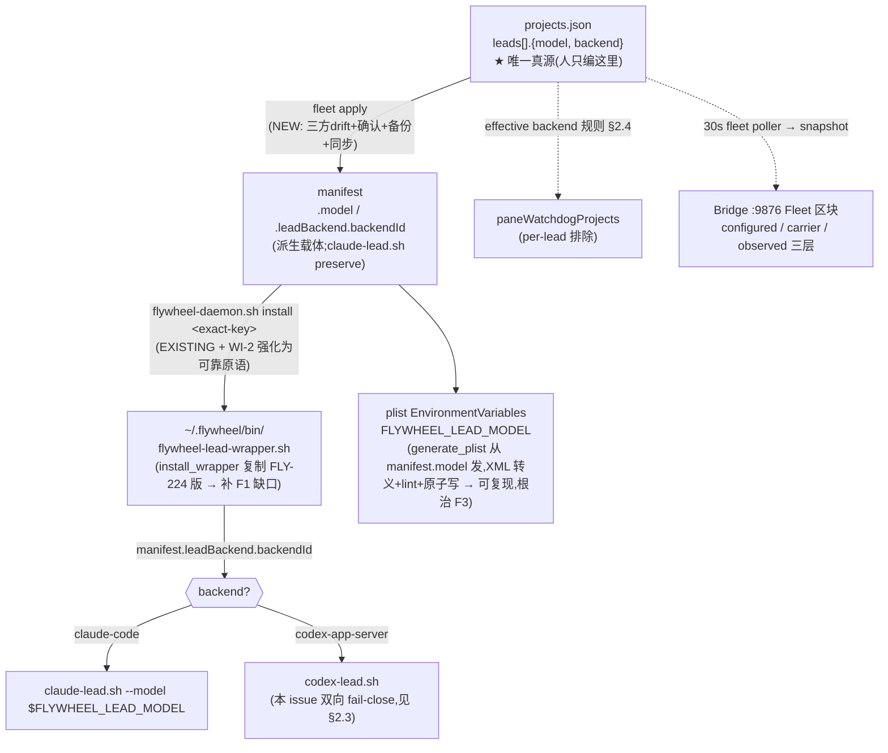

# Plan: Fleet Operations Config + Dashboard(含 FLY-243 后端切换)

**Version**: v1.40.0
**Issue**: FLY-247(收编 FLY-243 config 驱动的 Lead 后端切换;部分收编 FLY-241 散落模型配置)
**Date**: 2026-06-10
**Source**: `doc/engineer/exploration/new/FLY-247-fleet-config-dashboard.md`(含 §7 DECISIONS + 二次审计)
**Status**: codex-approved(2026-06-10,10 轮,R1-R9 共 50 条全吸收 + R10 三条 non-blocking 已落;feedback 存档 /tmp/codex-rescue-design-feedback-flywheel-v1.40.0-FLY-247-fleet-config-dashboard-round{1..10}.md)

---

## 0. TL;DR(一句话)

把"每个 Lead 用什么模型 + 什么后端"从 6 处散落事实(plist 手编 env / manifest / 临时 md / config.yaml / ps)收敛成 **`~/.flywheel/projects.json` 的 `leads[].{model, backend}` 唯一真源**;给一条 `flywheel-fleet.sh plan/apply` 干净 cutover(三方 drift 报告 → 确认 → 备份 → 改 config → 经**强化后**的 `flywheel-daemon.sh install` 重启验证 → 失败按备份 plist 直接还原);Bridge `:9876/` Dashboard 加 Fleet 区块,按 configured/carrier/observed 三层如实显示。**不写字段 = 现状字节不变**(含 SSE payload)。

---

## 1. 背景与目标

### 1.1 Annie 的五个要求(exploration §1)

① 统一 per-agent config(模型 + 后端,唯一真源)② launch flow 读它 ③ 干净 cutover(改 config + 一条命令 → 停旧起新 verify 可回滚)④ Dashboard 一眼看 fleet ⑤ 改 config + 重启即生效,Dashboard 反映实时。

### 1.2 已拍板组合(exploration §7)

A(config 落 projects.json `leads[]`)+ 3(Dashboard 先实时页后 HTML 快照)+ plan/apply 两步分离(apply 重启前确认)+ 便宜档在线状态 + ~~Runner 行"继承自 Lead"~~(**已被 2026-06-10 research 推翻并取代**:继承从未存在,真实跟随 = §11 Increment 2;Increment 1 只做诚实 not-yet-wired 标注)+ Mufasa 转正不并入(兼容 FLY-250 bespoke 路径)。

### 1.3 二次审计落定的关键事实(决定本 plan 的形状;F4 经 Codex R1 修正)

| # | 事实(已 grep 实证) | 对设计的影响 |
|---|------|------|
| F1 | `~/.flywheel/bin/flywheel-lead-wrapper.sh` 是 FLY-74 老版(grep `leadBackend`=0),repo 版(FLY-224)有派发但未部署 | cutover 要部署新 wrapper —— **`flywheel-daemon.sh install_wrapper` 已从 repo 复制**,跑一次即补 |
| F2 | manifest 由 `claude-lead.sh:427-470` 在 boot 时**自写**,每次重启重建,只保留 `mcpExclude`/`chromeEnabled` | fleet 写进 manifest 的 `model`/`leadBackend` 会被 claude Lead 自重写清掉 → **必须加进 preserve 集合** |
| F3 | `flywheel-daemon.sh generate_plist` **完全不发 `EnvironmentVariables`** | FLY-241 的 `FLYWHEEL_LEAD_MODEL` 纯手编 plist,任何 `daemon install` 会**静默抹掉** → 这正是要根治的脆弱;让 generate_plist 从 manifest.model 发 env,plist 变**可复现** |
| F4(R1 修正) | `flywheel-daemon.sh install` 流程存在,**但当前不是可靠原语**:`install_one_manifest()` 只 `bootout \|\| true` + `sleep 1`(不等旧进程退净);bootstrap 后只查 job loaded,**不运行时仅 WARNING 仍返 0**。"等净/60s fail-fast"是 `restart-services.sh` 的另一条路径,不在 daemon 中 | fleet 仍委托 daemon(不重造轮子),但 **WI-2 必须先把 daemon 的 exact-key install 强化成可靠原语**(等旧退净 + 硬 verify + 非零退出),否则 fleet 无法按 exit code 触发回滚 |
| F5 | Codex Lead 配置面 ≫ Claude(`run-codex-lead-mufasa.sh` 硬编 CODEX_HOME 隔离/persona/outbound/sandbox/codexBin) | **codex Lead 收进通用 manifest 自动重启 = 独立后续 issue**;本 issue 只"读出来"(Dashboard/watchdog/plan diff),apply 对 codex 涉及的任何切换 **双向 fail-close**(§2.3) |
| F6 | `paneWatchdogProjects`(plugin.ts:2130)读各项目 `.flywheel/config.yaml roles.lead.backend`(per-project) | backend 改落 projects.json `leads[].backend`(per-lead)→ watchdog 排除改用统一 **effective backend** 规则(§2.4),粒度降到 per-lead |
| F7 | `backend: codex-app-server` 仅对 read-only companion 合法(`codex-lead-runtime.ts:330` sandbox 非 read-only fail-close,FLY-245 未解) | schema 校验:**非 companion 或可开 Runner 的 Lead 配 codex → config load throw**(§3.1) |
| F8(R1 新增) | `loadProjects()` **先读 `FLYWHEEL_PROJECTS` env**,再读 `~/.flywheel/projects.json`(QA slot 框架靠这个隔离) | fleet bash 若固定读文件,可能 apply 文件 A 而 Bridge 实际吃 env B → split-brain;**fleet 检测到 `FLYWHEEL_PROJECTS` 设置即 fail-close**(§4 WI-3) |
| F9(R1 新增) | `SseBroadcaster` 每 **2 秒**构造一次 payload(不是 30 秒);`locateLeadWindow()` 是 **async**(跑 `tmux list-windows`) | Fleet 采集必须是独立 30s cache/poller + 批量 tmux 查询,SSE 2s 只复用最近 snapshot;`buildFleetPayload` 设计为 async + 依赖注入(§4 WI-4) |

---

## 2. 架构决策

### 2.1 单一真源 → 派生载体链



**为什么 manifest 当载体而非让 wrapper 直读 projects.json**:wrapper 是 launchd 安全敏感的派发入口,FLY-224 刻意把 backend 放 manifest;保持 wrapper 派发逻辑**字节不变**(低风险)。projects.json 是人面真源,manifest/plist 是 fleet apply 每次从它重生的派生物;`fleet plan` 显示真源 vs 载体的 drift。(考虑过让 wrapper 直读 projects.json 实现"运行时真源",**否决**:动安全派发路径的输入源不值当,drift 检测已覆盖"载体过期"。)

### 2.2 cutover 两步法(terraform 式;R1 修正回滚语义)

```mermaid
sequenceDiagram
    participant Op as 运维(Annie/team-lead)
    participant CFG as projects.json
    participant Fleet as flywheel-fleet.sh
    participant Daemon as flywheel-daemon.sh
    participant LD as launchd

    Op->>CFG: 编辑 leads[].{model,backend}
    Op->>Fleet: fleet plan
    Fleet->>CFG: 读期望(检测 FLYWHEEL_PROJECTS → fail-close)
    Fleet->>LD: 读实际三方:manifest 载体 + plist env(FLYWHEEL_LEAD_MODEL)+ pid/ps
    Fleet-->>Op: 打印 config/manifest/plist 三方 drift 表(谁要重启,不动任何东西)
    Op->>Fleet: fleet apply --lead geoforge3d-product-lead
    Fleet->>Fleet: 取 restart.lock.d 互斥锁(与 restart-services 共用)
    Fleet->>Op: 显示将改动 + "重启 Lead? [y/N]"(红线确认)
    Op-->>Fleet: y
    Fleet->>Daemon: Phase W 恰好一次(≥1 APPLICABLE 已确认后):daemon install-wrapper(备份→装→校验)
    Fleet->>Fleet: staging:desired manifest+plist 生成到 txn 目录(转义+lint 校验)+ 备份旧 canonical → fleet-backups/<ts>/
    Fleet->>Daemon: flywheel-daemon.sh install <exact-key> --staged-dir <txn-dir>(WI-2 强化版;不碰 wrapper、不 regenerate)
    Daemon->>LD: bootout→等旧退净(≤60s)→commit staged(commit_state 协议,§2.6)→bootstrap→硬verify(pid 绑定 manifest+进程活+claude限期 runtime=claude-confirmed,窗名单独不算),失败非零+结构化结果记录
    alt daemon 非零 / 后置 verify 失败
        Fleet->>LD: 回滚(按 §2.6 相位表):确认旧/新进程退净(活着先 bootout)→ **先**原子还原 manifest+plist(wrapper 不回退,Phase W 已全局提交)→ 校验还原产物 → **再** bootstrap → 验证 backend/model/argv
        Fleet-->>Op: 报失败 + 停后续 Lead
    else 成功
        Fleet-->>Op: 报成功,下一个 Lead
    end
```

**回滚为什么绝不 regenerate(R1 #2)**:生产 Peter/Hiro 的 model 当前**只在手编 plist**(manifest 没有)。若回滚走"还原旧 manifest → daemon install 重新生成 plist",旧 manifest 无 model → 刚恢复的 Fable env 又被抹掉。所以回滚还原**备份的 plist 原文件字节**,不经过 generate_plist。

**回滚为什么先还原后 bootstrap(R2 #1)**:launchd 一拉起,wrapper 立刻读 manifest 决定 backend、`claude-lead.sh` 立刻读+重写 manifest。若顺序是"bootstrap 旧 plist → 再还原 manifest",启动瞬间旧 plist 配的是**新 manifest**(错 backend/model),且还原写入会与启动时的 manifest 重写竞态。正确顺序:确认旧进程退净 → 原子还原 manifest+plist(wrapper 仅当该事务 Phase W 未提交才还原 —— 已提交的全局 wrapper 不随单 Lead 失败回退)→ 校验还原产物 → bootstrap → 验证启动后的实际 backend/model/argv。E2E 测试除最终字节外,**必须记录 stub wrapper/Lead 在启动瞬间实际读到的 manifest 内容**。

### 2.3 codex 后端的 scope 边界(本 issue 做什么 / 不做什么;R1 #3 改双向 fail-close)

| 能力 | claude-code 后端 | codex-app-server 后端(v1.40.0) |
|------|------|------|
| projects.json 配置 + schema 校验 | ✅ | ✅(companion=true 且 canSpawnRunners=false 才合法,否则 throw) |
| Dashboard 显示 | ✅ configured/carrier/observed 三层 | ✅ 显示为 `configured / externally managed / runtime unverified`(§2.5) |
| pane 看门狗排除 | n/a(被看门狗看) | ✅ 按 effective backend 规则(§2.4) |
| `fleet plan` 显示 diff | ✅ | ✅(显示,标注"codex 手动路径") |
| `fleet apply` | ✅ **仅 model-only 变更**(委托强化版 daemon install;见下) | ❌ fail-close:`UNAPPLIED` + exit 非零;打印"codex Lead 启动是 bespoke(FLY-250),v1.40.0 不自动切换;请走 codex wrapper 路径" |
| model 字段接线 | ✅(→ FLYWHEEL_LEAD_MODEL) | ❌ 仅展示且标 `configured`(codex 实际模型走 CODEX_HOME 配置,不冒充 active) |

**apply 自动路径收窄为 model-only(R1 #3 + R2 #3)**:backend enum 只有两个值 → **任何 backend 变更必然有一侧是 codex**。所以规则收敛为一条:`fleet apply` **只自动执行"desired 与 observed 均为 claude-code 的 model-only 变更"**;其余一切(任何 backend diff、desired=codex、observed=unknown/external、**载体缺失的"未安装" lead**)→ `UNAPPLIED` fail-close,不写 manifest、不重启、不改 watchdog 资格。特别地:**apply 绝不"安装"无现有 manifest+plist 的 lead**(否则未种子的 bespoke Mufasa 会被当成缺失 claude lead 误装 → 双实例;R2 #3 抓的洞)。observed backend 的判定来源见 §2.4。**follow-up issue**:`fleet` 通用化 codex Lead 启动(把 5 个 codex env 建模进 manifest;届时以 FLY-250 落定的 launchd label/状态合同为集成门)。

### 2.4 effective backend(desired)+ observed backend(R1 #6 + R2 #3,三消费者同一答案)

**desired(人想要什么)**:

```
effectiveBackend(lead) =
  1. 显式 projects.json leads[].backend(若 present)
  2. else legacy:.flywheel/config.yaml roles.lead.backend / FLYWHEEL_LEAD_BACKEND(FLY-224 现状)
  3. else "claude-code"
```

实现为一个共享纯函数(`lead-backends/` 内,TS;fleet bash 侧按同规则实现并以同一组 fixture 双跑对齐)。legacy 源命中时 Dashboard/`fleet plan` 标注 `source: legacy(待迁移)`。**证据分类同理(R7 #4)**:management×runtime 分类表是 TS(Bridge poller)与 bash(fleet CLI 现采)双实现,**同一组 conformance fixture 双跑对齐**;fleet apply 在 restart 锁内**新鲜采集**完整证据集过 §2.4 闸,绝不复用 Bridge 内存 map 或过期数据。

**observed(现在真的是什么;R2 #3 + R3 #1 — 不引新 registry,用既有持久证据的**绑定组合**)**:

**management 轴的绑定证据(纯结构归属,R6 #1 —— Claude 特征不在这条轴上)**,以下 1-4 **同时成立** → `standard-confirmed`,任一确定性失配 → `external-confirmed`,任一探针失败 → `indeterminate`:

1. canonical manifest **与** canonical plist 均存在,且身份字段(projectName/leadId/label)匹配 exact key;
2. plist `ProgramArguments` 明确指向标准 `~/.flywheel/bin/flywheel-lead-wrapper.sh` **和该 canonical manifest 路径**(排除 FLY-250 bespoke plist —— 它复用同名 label `com.flywheel.lead.<project>-<lead>` 但指向 bespoke 脚本);
3. exact launchd label 已 loaded 且 launchd 报告 PID > 0;
4. **launchd PID == manifest.pid** 且该进程存活(单独 `manifest.pid` 活不算数:可能是 bespoke 切换后的残留 Claude 进程或 PID 重用)。

**runtime 轴的证据**(独立判定,不参与 management):进程命令/进程树含 claude-lead 特征,或 pane command/marker 确认 Claude(精确 window 名不够)。**两轴独立分类**:结构标准但 runtime 探针超时 = `standard-confirmed × indeterminate`(不能因 runtime 探针抖动丢掉 management 归属;测试钉死这个组合)。

backendId 取 manifest.leadBackend.backendId(缺字段 = FLY-224 前格式 → "claude-code")。**fleet 守卫、Dashboard、watchdog 共用这同一个判定**。

**observed 是两个正交轴,各三态(R4 #1 + R5 #1 —— "管理归属"与"pane runtime"必须分开问)**:

- **management 轴**(谁在管它,纯结构归属):`standard-confirmed`(绑定证据 1-4 全成立,见下)/ `external-confirmed`(所有结构探针成功且确定性不属标准路径)/ `indeterminate`(任一结构探针失败:I/O、解析、权限、超时)。
- **runtime 轴**(有没有 Claude 在跑,独立判定):`claude-confirmed`(pane/process 证据确认是 Claude:pane command 或 process tree 含 claude-lead 特征;**精确 window 名不够** —— FLY-242 的 Codex observer 复用同款 `<project>-<leadId>` 窗名,必须按 pane command/marker 区分)/ `no-claude-confirmed`(所有 runtime 探针成功且确认无 Claude pane/process)/ `indeterminate`。
- 两轴**定义上不耦合**(R6 #1):Claude 特征证据只属 runtime 轴;结构标准 + runtime 探针超时 = `standard-confirmed × indeterminate`,management 归属不丢。

| 消费者 | 规则 |
|------|------|
| `fleet apply` | 只放行 `management=standard-confirmed ∧ runtime=claude-confirmed` 的 model-only 变更;其余全 UNAPPLIED |
| watchdog 排除 | `排除 ⟺ desired=codex ∧ 所有探针成功 ∧ runtime=no-claude-confirmed`。**manual/nohup Claude(management=external 但 pane 活着)→ 继续看 + CONFLICT**(漏报>误报);Codex observer 的同名 pane 按 command/marker 识别为非 Claude → 计入 no-claude → 排除;任一轴 indeterminate → 继续看 + DEGRADED |
| Dashboard | standard+claude=绿;desired=codex ∧ claude-confirmed=CONFLICT(含 manual Claude);external ∧ no-claude=EXTERNAL/UNVERIFIED;任一 indeterminate=DEGRADED/UNKNOWN |

依据:`claude-lead.sh` 每次 boot 重写 manifest(F2),plist 是 launchd 的启动事实 —— 这组绑定是**已存在的持久运行时证据**,不需要等 FLY-250 的 label 合同,也不需要新建 applied-state registry。bespoke 路径(不经标准 wrapper)在第 2/4 条上必然确定性失配 → management=`external-confirmed` → 被 §2.3 fail-close 兜住(Codex→Claude 误装、未种子误装、残留 Claude manifest 冒充全堵)。

**测试**:同 label bespoke plist + 残留活 Claude manifest PID → external + 按 runtime 轴判 pane;**manual/nohup Claude + stale plist + 活 pane → management=external ∧ runtime=claude → 继续看 + CONFLICT**(R5 #1);launchd PID ≠ manifest.pid → 非 standard;**desired=codex + Codex observer 同名 pane(command 非 Claude)→ no-claude → 排除**(R5 #1);**desired=codex 且 launchctl/plist/ps/tmux 各自 probe-error → indeterminate(继续看 + 不 apply)四组**(R4 #1);全 claude 部署(desired 全缺省/claude)→ 排除列表与现状字节一致(legacy 回退保 byte-compat)。

### 2.5 Dashboard 三层状态模型(R1 #4)

| 层 | 含义 | 来源 | 失真处理 |
|----|------|------|---------|
| `configured` | 人想要什么 | projects.json | — |
| `carrier` | 派生载体记录了什么 | manifest.model/.leadBackend + plist env(FLYWHEEL_LEAD_MODEL) | 与 configured 不一致 → drift 标红 |
| `observed` | 现在真的在跑什么 | §2.4 双轴(management×runtime),证据全部来自 fleet poller 的单一 evidence map(R6 #5);codex runtime:**v1.40 不验**,显示 `externally managed / runtime unverified`(FLY-250 的 label/PID 合同未锁定前不冒充) | PID stale/reuse 风险:standard×claude 全过才绿;部分过黄 `partial`;evidence 过期/探针失败 → DEGRADED |

**codex external lead 的 carrier 语义(R3 #5)**:bespoke Mufasa/Belle **按设计没有**标准 manifest/plist carrier → carrier 列显示 `N/A (external)`,状态归 `EXTERNAL/UNVERIFIED`,**不算 drift**(drift 只对"可对齐"的标准托管 lead 计算;追逐 codex 零 drift 是设计上不可达的状态)。

codex Lead 的 model 列显示 `configured`(或 `CODEX_HOME default`),**绝不**渲染成 active model(与 FLY-242 的 lead-status.json 合同一致,不抢它的活)。

### 2.6 apply 事务模型与失败恢复矩阵(R2 #1/#2/#5)

**事务结构:wrapper = 全局阶段,Lead = 逐个阶段**(R2 #5):

```
apply 事务 = [Phase W: wrapper 全局一次] → [Phase L1: lead A] → [Phase L2: lead B] → ...
```

- **Phase W**(**在 target 解析+守卫分类+人工确认全部完成、且 ≥1 个 APPLICABLE Lead 被批准之后**才执行,恰好一次;R3 #3 —— codex-only / 全 UNAPPLIED / 操作者全拒 的 no-op apply **不得碰 wrapper 一个字节**)。**transaction.json 在 Phase W 之前创建**(R6 #4:wrapper 是全局可执行文件,装到一半被强杀必须有事务记录可循):先原子写事务记录(config snapshot hash + wrapper backup 路径/hash/mode + wrapper journal 相位)→ 备份现 wrapper(内容+mode)→ **同目录 temp 写入 + mode 校验 + 原子 rename** 安装 → 校验(可执行 + 含 FLY-224 派发标记)→ wrapper journal 标 committed。失败 → 还原 wrapper + **整个 apply abort**(零 Lead 被动过,事务留痕可审计)。**成功即提交**:后续单个 Lead 失败**不回退 wrapper**(否则已成功重启的 Lead A 下次自然重启又掉回 F1 旧 wrapper)。
- **备份目录写 transaction manifest**(`~/.flywheel/fleet-backups/<ts>/transaction.json`):wrapper 阶段状态、每个 exact key、各原产物是否存在(absent 也记录)、各 Lead commit 状态(pending/applied/failed/rolled-back)。`apply --rollback` 按 transaction manifest 选**确定的事务**回滚,不靠"最近目录"猜。

**per-Lead 阶段顺序(所有可失败的准备在 destructive 动作之前,且 canonical 文件在旧进程退净前零触碰;R2 #2 + R3 #2)**:

```
1. [非破坏·staging] 在 transaction 目录生成 desired manifest + desired plist(staged 路径,
   不碰 canonical)→ jq/plutil 校验 staged 产物 → 备份旧 canonical 产物(或记录 absence)
2. [破坏点] bootout 旧 job,记录旧 PID
3. 轮询等待旧 supervisor 退净(≤60s)
4. [commit,两步 rename(R4 #3)] 确认退净后(phase journal 已推进到 stopped,见下):
   a. journal → committing(原子写,含 staged/backup 双方 hash + 固定 commit 顺序)
   b. 把 staged bytes **复制到各 canonical 同目录 temp → 复验 hash → rename**(R5 #4:不假设跨文件系统
      rename 可用,txn 目录里的 staged 原件保留作证据);两个逐文件原子 rename,
      文件系统层不存在跨两文件的原子操作,诚实建模
   c. 复验两 canonical hash == staged hash → journal → committed
5. bootstrap(journal → bootstrapping)→ 硬 verify(pid 绑定 manifest + 进程活 + claude 限期 runtime=claude-confirmed,窗名单独不算)
   → journal → applied
```

**per-key 持久 phase journal(R5 #2 —— 只标 committing 盖不住整个 destructive 生命周期)**:transaction.json 为每个 exact key 维护相位,**每个破坏性边界之前原子推进**:

```
prepared → stopping → stopped → committing → committed → bootstrapping → verifying → applied
                                  (终态另含 rolled-back / manual-intervention)
```

- 相位在每个破坏性边界**之前**推进,所以 crash 后每个非终态都是"动作可能做了也可能没做"的二义态。**phase→recovery 完整合同(R6 #3)**:

| 非终态 | reconcile 必做探测 | 允许的自动动作 | fail-close 出口 |
|--------|------------------|---------------|----------------|
| prepared | 无破坏发生:核 canonical 未动(hash)| 丢弃 staged,标 rolled-back | — |
| stopping(R7 #1 + R8 #1)| 记录在案的旧 PID 状态 | **一律视为"未完成的 stop"**(R8 #1:journal 在 bootout 调用前推进,单次"loaded+旧 PID"采样无法区分"还没调"与"launchd 正在异步 unload" —— 标回 prepared 会与稍后的 unload 竞态,把 Lead 永久留在 stopped):mutating recovery **幂等重发 exact bootout** → 等待记录的旧 PID 退净(≤60s)→ 进入 stopped 恢复线;`plan`/`--dry-run` 只报告 | 等待超时/探测失败 → manual-intervention |
| stopped | canonical hash == backup(未 commit)? | 还原确认 + bootstrap 备份 plist → rolled-back | hash 对不上 → manual-intervention |
| committing | 逐文件比对 canonical vs staged/backup hash 判定 rename 走到哪 | 按 hash 还原 backup → bootstrap 备份 plist → rolled-back | 任一 hash 三不像 → manual-intervention |
| committed | 两 canonical == staged 已确认;job 未起 | **默认还原 backup**(若不可变 config snapshot 已与当前文件不符);继续推进 staged(bootstrap 新产物)**必须显式确认**(延续原事务确认或 `recover --txn <ts> --yes`) | — |
| bootstrapping/verifying(R7 #1 拆三种)| label/PID/pane 探测判定新进程状态 | ① 起了且 verify 过 → applied;② 没起 → 同 committed 处理;③ **新 PID 活着/loaded 但 verify 未过** → **先 bootout 新进程 → 等待其 exact PID 退净 → 再还原 backup → bootstrap**(直接还原会与活着的新进程发生 manifest 重写/双 bootstrap 竞态 —— 正是前几轮要防的) | ③ 的 stop 超时 → manual-intervention;探测失败 → manual-intervention |

  - `recover --txn <ts> [--lead <key>] --yes` 是**一等子命令**(mutating recovery 的唯一入口之一);
  - `plan` 与 `--dry-run` 遇到非终态:**只报告 + 非零退出,绝不自动改生产**。

**wrapper journal 恢复合同(R7 #2 —— 在所有 per-Lead reconcile 之前先跑)**:wrapper 相位 `w-prepared → w-backed-up → w-installing → w-committed`,transaction.json 先于 Phase W 创建即记录 backup 路径/hash/mode(含原 wrapper absent 的语义:absent 也记录,恢复 = 恢复 absence)。crash 落在任一非终态 → 按 hash 判定走到哪:此时**零 Lead 被动过**,保守恢复 = 还原 prior wrapper(或 absence)+ 终止整个事务。**测试**:wrapper rename 前/后 kill 成对 + 原 wrapper absent 场景。
- 失败分支(R8 #2:**本相位表是唯一权威**,其他段落的恢复描述以此为准):commit 阶段 rename/复验失败(旧 PID 已退净前提下)→ 还原两份 backup → 校验 → bootstrap 备份 plist → journal → rolled-back;**bootstrap/verify 失败且新进程活着 → 必须先 bootout 新进程 + 等其 exact PID 退净,再还原再 bootstrap**(同表 bootstrapping/verifying ③)。
- **测试**:每个破坏性边界的 **kill-before 与 kill-after 成对**(bootout 前/后、committing 写前/后、rename 间、committed 后 bootstrap 前、bootstrap 后 applied 前)reconcile 全表;dry-run 遇非终态零变更只报告;committed 态 + config snapshot 失配 → 默认还原 backup;继续 staged 需显式确认。

**为什么 staging(R3 #2)**:若先改 canonical manifest 再 bootout,prep 失败时 canonical 已脏;更隐蔽的是旧 Lead 若在 bootout 前自行崩溃、KeepAlive 把它拉起,它会读到**切换到一半的新 manifest**。所以 desired 产物全部生成+校验在 staging 路径,canonical 的唯一写入点在第 4 步(旧 PID 确认退出之后)。实现上由**强化版 daemon 接收 staged 产物**(`install <exact-key> --staged-dir <txn-dir>`)负责 commit,fleet 不直接写 canonical。**测试**:prep 失败 → canonical manifest+plist 逐字节不变;模拟 prep 窗口中旧 job 自重启 → stub Lead 读到的仍是旧 manifest。

**失败恢复矩阵**:

| 失败阶段 | 旧进程状态 | 恢复动作 |
|---------|-----------|---------|
| 1(准备/lint 失败) | 还在跑 | 什么都没动 → 丢弃临时文件,跳过该 Lead,继续或停(报错) |
| 3(stop-timeout) | **还活着** | 还原磁盘产物(若已动)但 **禁止 bootstrap**(旧 supervisor 没死,再 bootstrap = 双实例);停后续 Lead,明确报"人工介入" |
| 5(bootstrap/verify 失败) | 已退净 | §2.2 顺序:原子还原 manifest+plist(+wrapper 仅当 Phase W 内失败)→ 校验还原产物 → bootstrap 备份 plist → 验证 backend/model/argv |
| 原产物 absent(首次安装场景) | n/a | **恢复 absence**:删除本次新建的 manifest/plist,保持 unloaded,不假定总有可 bootstrap 的备份(注:§2.3 已禁 apply 安装无载体 lead,此行兜 transaction manifest 完整性) |

---

## 3. 数据模型:projects.json `leads[]` 新增字段

```jsonc
{
  "projectName": "geoforge3d",
  "leads": [
    {
      "agentId": "product-lead",
      "chatChannel": "...",
      "match": { "labels": ["Product"] },
      "model": "claude-fable-5",        // ★ 新增,可选;仅 claude-code 生效;缺省=账号默认
      "backend": "claude-code"          // ★ 新增,可选;enum;缺省=claude-code
    },
    { "agentId": "ops-lead" /* 不写 model/backend = 现状字节不变 */ }
  ]
}
```

### 3.1 校验规则(`ProjectConfig.ts loadProjects()`,在现有 lead 校验循环内追加)

| 字段 | 规则 |
|------|------|
| `model` | 若present:必须是非空 string;trim 后非空(防 `"  "`);**不**小写(model id 大小写敏感);**拒绝**含 NUL/C0 控制字符/换行(plist 安全边界,R1 #8) |
| `backend` | 若present:必须 ∈ `{"claude-code", "codex-app-server"}`(对齐 `LeadBackendId`);否则 throw |
| **跨字段** | 若 `backend === "codex-app-server"`:要求 `lead.companion === true` **且** `canSpawnRunners` 解析为 false(companion 不开 Runner 的 read-only 前提要在 config 层先拒绝自相矛盾态,runtime sandbox fail-close 是第二道防线;R1 #10)→ 否则 **throw**(错误信息指向 FLY-245) |

**不normalize**(F2/字节兼容):缺省字段**不**写进内存对象(consumer 用 §2.4 effectiveBackend / `lead.model`)。沿用 FLY-231 companion `=== true` 的字节兼容范式。`LeadConfig` interface 加 `model?: string; backend?: LeadBackendId;`(import `LeadBackendId` from `lead-backends/lead-backend.js`,无循环依赖)。

---

## 4. 实现分解(TDD,RED→GREEN→REFACTOR)

> 顺序:WI-1/2 是底座(config + 载体 + **daemon 原语强化**),WI-3 是 cutover 工具,WI-4 是 Dashboard,WI-5 报告,WI-6 迁移。各 WI 测试先行。

### WI-1 — projects.json schema(TS)

- **改** `packages/teamlead/src/ProjectConfig.ts`:`LeadConfig` 加 `model?`/`backend?`;`loadProjects()` 加 §3.1 校验。
- **新** effectiveBackend 共享纯函数(§2.4,落 `lead-backends/`)。
- **测** `ProjectConfig.test.ts`:valid(claude-code+model)、invalid backend enum throw、codex+非companion throw、**codex+companion+可开Runner throw(负例,R1 #10)**、codex+companion+不开Runner ok、model 空串/控制字符 throw、**缺省字段 = 内存对象 shape 不变**(reverse-compat 断言);effectiveBackend 三级优先级 + 全缺省=claude。

### WI-2 — daemon install 强化为可靠原语 + manifest 载体 + plist 安全生成(bash)

- **CLI 拆分(R4 #2 —— 现 `cmd_install()` 无条件先 `install_wrapper`,会让 Phase W 的"恰好一次"被每个 per-Lead install 重复破坏)**:
  - `flywheel-daemon.sh install-wrapper`(新子命令):只装 wrapper(备份→复制→校验),**仅 Phase W 调用**;
  - `flywheel-daemon.sh install <exact-key> --staged-dir <txn-dir>`(新模式):**禁止碰 wrapper、禁止 regenerate canonical plist**,只做 stop/commit(staged 产物)/bootstrap/verify;
  - 旧的非 staged `daemon install`(无 --staged-dir)保留原有"自动装 wrapper + generate"兼容行为,字节不变。
- **改** staged 模式 `install_one_manifest()` 流程(R1 #1 + R2 #2 + R4 #3):
  0. **所有可失败的准备在 bootout 之前**:staged manifest/plist 已由 fleet 生成并校验(§2.6 阶段 1),daemon 复验 staged 产物存在+hash;失败 → 旧 job 一根毛没动,非零退出;
  1. bootout 前记录旧 launchd PID;bootout 后**轮询等待旧 supervisor 退净,≤60s**;**stop-timeout → 非零退出且绝不 bootstrap**(旧进程还活着,再 bootstrap = 双实例;§2.6 矩阵);
  2. 旧进程退净后按 §2.6 commit_state 协议提交 staged 产物 → bootstrap → **硬 verify(完整 runtime 谓词,R8 #3)**:launchd job PID > 0 且 **PID 绑定 canonical manifest**(== manifest.pid 重写后值)且进程存活;claude 后端在期限内(默认 60s)**runtime=claude-confirmed**(进程树/pane command 含 claude-lead 特征 —— **精确 window 名单独不算数**:FLY-242 Codex observer 复用同名窗,Claude 启动失败 + observer 窗在场会被骗成"成功");
  3. 任何失败(prep 失败 / stop 超时 / commit 半途 / bootstrap 失败 / loaded-but-no-PID / 启动即崩 / verify 未过)→ **非零退出 + 原子写版本化 JSON 结果记录到 txn 目录**(R8 #2 + R9 #2:`{version, transactionId, exactKey, attempt, phase, outcome, oldPid, newPid, labelLoaded, runtimeState}`(结果记录按 exact key 存放;fleet 合并前必须校验 transactionId/exactKey/attempt 匹配,拒绝过期、跨 key、跨事务的记录) —— 退出码携带不了 PID,regex stderr 太脆,不配做"还原是否安全"的判据;fleet **只**从校验过的结果记录 + 新鲜探针选恢复分支),不再 WARNING-and-return-0。**测试**:同名 Codex observer 窗活着 + 无 Claude 进程 → install 必须失败进恢复线(R8 #3)。
- **改** plist 生成(R1 #8 + R5 #4;staged 模式下生成发生在 fleet staging 阶段,产物落 txn 目录非 canonical):生成 helper 拆两个入参 —— `manifestSourcePath`(从哪读 model,= staged manifest)与 `runtimeManifestPath`(写进 `ProgramArguments` 的路径,**恒为 canonical manifest 路径**)。**绝不能把 staged manifest 路径写进 plist**:提交后 staged 文件被 rename 走,plist 指向已不存在的 txn 路径 → bootstrap 必败。daemon staged 模式 commit 前校验 staged plist 的 Label、标准 wrapper 路径、**canonical manifest argument**、exact key 四项匹配。所有动态 string(model、路径、label)统一 XML 五实体转义;`plutil -lint` 校验 staged 产物;lint 失败 → canonical 零触碰,非零退出。manifest 有 model → 注入 `EnvironmentVariables.FLYWHEEL_LEAD_MODEL`;无/空 → 不发 dict(plist 字节同旧)。legacy 非 staged 路径的 `generate_plist` 保持临时文件+lint+原子 rename 强化,行为字节兼容。**测试**:解析 staged plist,断言 runtime argument == canonical manifest 路径。
- **改** manifest 写入(fleet 与 daemon 共用 helper):jq 写临时文件 + 校验 + 原子 rename(防截断)。
- **改** `claude-lead.sh:427-470` manifest 写块:把 `model` + `leadBackend.backendId` 加进 preserve-from-existing 集合(镜像 `mcpExclude`/`chromeEnabled` 的 `_existing_*` 逻辑)。fleet apply 是权威写入者,preserve 只防 launchd 自重启在两次 apply 之间丢字段。**自写也改为 temp + jq 校验 + 原子 rename**(R7 #3:现状直接 `>` 重定向到 canonical manifest,boot 中断会留截断文件,破坏 CAS/journal 的 hash 前提)。
- **测** `flywheel-daemon-install-verify.test.sh`(新,stub launchctl/ps/tmux):stop-timeout、bootstrap-failure、loaded-but-no-PID、startup-crash、pane-timeout 五失败模式全非零 + 成功路径零;`flywheel-daemon-plist-env.test.sh`(新):manifest 有/无/空 model → plist 有/无 env dict + 字节基线;特殊字符(`& < > " '`)转义正确、控制字符拒绝、lint 失败不破坏旧 plist、中断不留截断文件;`claude-lead-manifest-preserve.test.sh`(新或扩 fly143 测):model+leadBackend 重写存活 + 不凭空注入。

### WI-3 — `scripts/flywheel-fleet.sh`(bash,新;cutover 核心)

子命令:

```
flywheel-fleet.sh plan [--lead <id>] [--project <p>]
    0. FLYWHEEL_PROJECTS 已设置 → fail-close(打印原因;防 split-brain,F8)
    1. 读 projects.json(期望)
    2. 读实际:manifest 载体 + 现有 plist(EnvironmentVariables.FLYWHEEL_LEAD_MODEL + ProgramArguments)
       + **完整 §2.4 证据集现采**(launchd label/PID 绑定、进程特征、tmux pane command —— fleet CLI 是
       独立进程,不能也不该读 Bridge 内存 evidence map;"poller 单一所有者"只限 Bridge 消费者,R7 #4)
    3. 打印 config/manifest/plist 三方 drift 表(含 legacy source 标注),exit 0,不动任何东西

flywheel-fleet.sh apply [--lead <id>] [--project <p>] [--yes] [--dry-run]
    0. FLYWHEEL_PROJECTS fail-close;取 ~/.flywheel/restart.lock.d 互斥锁(与 restart-services 共用,R1 #9)
    1. **捕获不可变 config snapshot**(R5 #3:文件 bytes/hash + 每个 exact key 的 desired model/backend;
       transaction.json 记录该 hash;后续 staging 只允许用这份内存快照,绝不重读文件)
       → 解析全部 target(精确 {projectName}-{agentId} 复合键;--lead 短名跨项目歧义 → 报错)
       → 守卫分类(§2.3:仅"desired 与 observed 均 claude 的 model-only 变更"= APPLICABLE;
         任何 backend diff / desired=codex / observed=unknown,external / 载体缺失"未安装" → UNAPPLIED)
       → 逐个确认(非 --yes 且 TTY:read -r "重启 Lead <key>? [y/N]";非 TTY 无 --yes → abort)
       → **TOCTOU 重验(config + carrier + observed 三面,R5 #3 + R8 #5)**:Phase W 之前 + 每个 Lead
         bootout 之前重验:① 当前 config 文件 hash(或该 Lead 字段值)== snapshot;② 该 Lead 的 canonical
         manifest/plist **pre-image hash** == 初始分类时所采(确认/Phase W/前序 Lead 重启期间 KeepAlive、
         crash、外部编辑都可能改变目标,restart 锁挡不住这些);③ **重跑完整 §2.4 证据闸**(management/runtime
         重新确认)。任一变化 → 在碰该 Lead 任何 destructive 动作前停剩余事务报 partial(确认过的展示内容 ≠
         实际提交内容是不可接受的)。**测试**:确认后篡改 carrier → 停;确认后 standard-Claude 变 external
         runtime → 停(R8 #5)
    2. **零个 APPLICABLE+已确认 Lead → 到此为止,exit(打印 UNAPPLIED 汇总);wrapper 一个字节不动**(R3 #3)
    3. **先**创建 transaction.json(R6 #4:config snapshot hash + wrapper backup/hash/mode + 各 exact key
       + 原产物存在性(absent 也记)+ 各 key phase journal 初始态)
    4. Phase W(全局,在首个 APPLICABLE Lead 执行之前恰好一次;§2.6):备份 wrapper(内容+mode)
       → daemon install-wrapper(同目录 temp + mode 校验 + 原子 rename)→ 校验 → wrapper journal committed;
       失败 → 还原 + 整个 apply abort;成功即提交(后续单 Lead 失败不回退)
    对每个 APPLICABLE+已确认 Lead:
      5. staging(§2.6 阶段 1):desired manifest+plist 生成到 txn 目录并校验;备份旧 canonical;更新 transaction.json
      6. 委托强化版 flywheel-daemon.sh install <exact-key> --staged-dir <txn-dir>
         (内部:bootout→等净→commit staged→bootstrap→verify;canonical 唯一写入点在退净之后,R3 #2)
      7. 后置 verify(双保险):pid 绑定 manifest + (claude)runtime=claude-confirmed(完整 §2.4 谓词,窗名单独不算)
      8. 失败 → 按 §2.6 相位表(唯一权威,R8 #2)分支:
         - prep 失败:canonical 零触碰,丢弃 staged,跳过/停
         - stop-timeout:禁止 bootstrap、停后续、报"人工介入"
         - bootstrap/verify 失败·新进程未起(**以 §2.6 相位表为准;还原前必须确认记录的旧 PID 与任何新 PID 均已退出**):原子还原 manifest+plist → 校验 → bootstrap 备份原始 plist
           (绝不 regenerate,§2.2)→ 验证 backend/model/argv → 停后续 + 非零退出
         - bootstrap/verify 失败·**新进程活着**:先 bootout 新进程 + 等其 exact PID 退净 → 再走上一行还原线
           (daemon 退出合同必须把"未起 vs 活着但 verify 未过 + 新 PID"作为事实返回给 fleet,见 WI-2)
    汇总:per-Lead 行(APPLIED/UNAPPLIED/FAILED/ROLLED-BACK);存在 UNAPPLIED/FAILED → exit 非零
    --dry-run:做到步骤 1-2 的"将做什么"打印,跳过 3-8(生产可安全跑)

flywheel-fleet.sh apply --rollback [--txn <ts>] [--lead <id>] [--yes]
    与 apply 对称的完整重启协议(R4 #4 —— 回滚对象是"正在运行的已 APPLIED Lead",不能只"等退净"):
    0. FLYWHEEL_PROJECTS fail-close;取同一 restart.lock.d 互斥锁;
       reconcile 一切非终态 journal key(§2.6 phase→recovery 合同,不是只扫 committing)→ 拒绝跳过
    1. [plan + CAS 前置(R5 #5 + R6 #2)] 按 transaction.json 选确定事务(--txn 或缺省=最近一个含 commit
       记录的事务),显示将回滚的事务/diff;**CAS 校验分两种 hash**:
       - plist:**整文件精确 hash** == 事务 post-image(plist 无人重写,精确可行);
       - manifest:**语义投影 hash,投影是精确枚举的 schema 不是"稳定字段"泛指**(R7 #3):
         `{leadId, projectName, projectDir, subdir, workspace, botTokenEnv, mcpExclude, chromeEnabled,
         model, leadBackend}` 全部 launch-affecting 字段,absent/default 统一规范化后取 canonical JSON hash;
         **显式排除的易变字段只有 `pid`**(claude-lead.sh 每次 boot 重写更新 pid,整文件 CAS 会把正常启动后的
         合法 rollback 全拒掉;但 projectDir/workspace 等被改也必须被 CAS 抓住,否则 rollback 会静默覆盖
         运维在 model/backend 之外的改动)+ §2.4 绑定判定共同把关;
       且该事务是目标 Lead 的**最新未回滚 commit** —— 不匹配(如 T1(A→B) 后又有 T2(B→C),--txn T1)
       → 拒绝,提示先回滚较新事务或人工处理;当前 runtime/management 为 external/indeterminate → 同样 fail-close。
       **测试**:apply 成功 → manifest pid 被 boot 重写 → rollback 允许;自然重启再重写 → 允许;
       model/backend 被篡改 → 拒绝
    2. [confirm] 确认(非 --yes 且 TTY:[y/N];非 TTY 无 --yes → abort;拒绝 → 零动作退出)
    3. [stop] bootout 当前 exact label,记录当前 PID
    4. [wait] 轮询等待当前进程退净(≤60s);stop-timeout → 禁止 bootstrap + 停 + 报"人工介入"
    5. [restore] 原子还原 manifest+plist(+wrapper 仅当该事务 Phase W 未提交)→ 校验还原产物
       原产物 absent 的 lead → 恢复 absence(删新建产物,保持 unloaded,跳过 bootstrap)
    6. [bootstrap] bootstrap 备份原始 plist → verify(pid 绑定 manifest + claude runtime=claude-confirmed)
```

- **守卫/红线**:apply 默认逐 Lead **串行**;重启前**必确认**(Annie 红线);备份在改动前;verify 失败自动回滚;互斥锁防与 restart-services 并跑。
- **复用**:重启/部署 wrapper/生成 plist 全委托强化版 `flywheel-daemon.sh install`(F4),fleet 不重造。
- **测试 seam**:`launchctl`/`flywheel-daemon.sh`/`ps`/`tmux` 经 env 注入 stub(沿用 `restart-services` 测试范式),CI 不碰真 launchd。
- **测** `flywheel-fleet.test.sh`(新):三方 drift 文本(含"plist 有 model、manifest 无"形态)、apply --dry-run 零变更、备份生成(含 wrapper + transaction.json)、**codex 三方向矩阵(Claude→Codex / Codex→Claude / Codex model-only)全 UNAPPLIED + 非零**、**bespoke 在跑但 manifest/legacy 皆空 → Codex→Claude 不误装**(R2 #3)、**未安装 lead 不被 apply 创建**、FLYWHEEL_PROJECTS fail-close、--lead 歧义报错、锁被占 → 等待/报错、rollback 还原(断言 plist 字节 == 备份 && 未经过 generate && **stub wrapper 启动瞬间读到的是还原后 manifest**,R2 #1)、verify 失败触发回滚 e2e(**旧 plist 有 model + manifest 无 model + apply 失败 → 回滚后 plist 字节与 argv 完整恢复**,R1 #2 钉死)、**stop-timeout → 禁 bootstrap + 报人工介入**(R2 #2)、**原产物 absent → 恢复 absence**、**两 Lead 第二个失败 → wrapper 不回退 + Lead A 不受扰 + transaction.json 状态正确**(R2 #5)、**连续两次事务后 --rollback 选对事务**、**两 Lead apply 全程 wrapper 恰好提交一次(调用计数)**(R4 #2)、**codex-only / unknown / 操作者全拒 → wrapper 字节+mode 不变**(R3 #3)、**commit 半途(第一 rename 成功第二失败)→ 按 backup 恢复**(R4 #3)、**commit 中被强杀 → 下次 apply/rollback 检测 unfinished transaction 拒新事务并确定性恢复**(R4 #3)、**rollback 协议:用户拒绝零动作 / 非 TTY 无 --yes abort / rollback stop-timeout 禁 bootstrap**(R4 #4)、**probe-error(launchctl/plist/ps/tmux 各自失败)→ indeterminate:不 apply 且 watchdog 继续看**(R4 #1)、**TOCTOU:确认后把 backend Claude→Codex 改掉 → 无 bootout 无 canonical 写入**(R5 #3)、**phase journal 三间隙强杀 reconcile + dry-run 遇非终态零变更**(R5 #2)、**staged plist runtime argument == canonical manifest 路径**(R5 #4)、**rollback CAS:T1(A→B)+T2(B→C) 后 --txn T1 拒;先回 T2 再 T1 可**(R5 #5)、**manual Claude 活 pane → CONFLICT 继续看;Codex observer 同名 pane → no-claude 排除**(R5 #1)。

### WI-4 — Bridge Dashboard Fleet 区块(TS;R1 #4/#5/#6 重构)

- **新** `packages/teamlead/src/bridge/fleet-data.ts`:
  - `collectFleetSnapshot(deps): Promise<FleetSnapshot>` —— **async + 依赖注入**(注入 fs 读、`kill(pid,0)`、批量 tmux 查询、clock);**一次刷新只跑一次 `tmux list-windows` 批量查询**,映射全部 Lead;单 probe 失败降级该 Lead 为 `unknown` 不拖垮整表;整体超时保护。
  - 每 (project, lead) 形态(R7 #5,双轴显式入合同):`{ project, leadId, companion, canSpawnRunners, configured:{model, backend, source}, carrier:{manifestModel, manifestBackend, plistModel}, observed:{management, runtime, collectedAt, degradationReasons[]}, presentation, drift:{model, backend} }`。`presentation` 是从轴组合**单独推导**的展示态,推导表全覆盖(测试钉死),Dashboard 与 watchdog 读同一 map 不各自解释:

    | desired | management × runtime | presentation(+watchdog)|
    |---------|---------------------|------------------------|
    | claude | standard × claude | 🟢 ONLINE(看) |
    | claude | standard × no-claude | 🔴 DOWN/pane-missing(看,会告警 —— 本来就是 watchdog 的活)|
    | claude | standard × indeterminate | 🟡 PARTIAL/DEGRADED(看)|
    | claude | external/indeterminate × * | 🟡 DEGRADED/UNKNOWN(看)|
    | codex | external × no-claude | EXTERNAL/UNVERIFIED(排除)|
    | codex | * × claude-confirmed | 🔴 CONFLICT(看;含 manual Claude 与 standard 残留)|
    | codex | * × indeterminate 或 management=indeterminate | DEGRADED/UNKNOWN(看)|
    | codex | standard × no-claude | 🔴 CONFLICT-carrier 红显(标准载体挂着 codex 期望,异常态)**但排除出 pane watchdog**(R8 #4:证据明确说没有 Claude pane,盯一个观测不到的后端只产噪音;与 §2.4 规范规则一致:desired=codex ∧ 探针成功 ∧ no-claude → 排除)|

    model 列对 codex 恒标 `configured`,绝不冒充 active。**watchdog 纳入/排除与 presentation 同源于一个 derived decision function**(R8 #4),两消费者不得各自解释轴组合。
  - Runner 行不单列。**Lead 行的 Runner 标注必须诚实**(2026-06-10 research `FLY-247-runner-model-resolution.md` 推翻决策 5 的假设:"Runner 跟随 Lead 模型"**从来没造过**,现状 = spawn 那刻 Annie settings.json 快照):increment 1 标注为 `Runner follow: not yet wired(Increment 2)`,**不写"继承"**;Increment 2(§11)落地后才改成真实跟随状态。
- **新** Config snapshot provider(R2 #4 + R3 #4 —— 满足要求⑤的关键,**只 overlay fleet 字段**):`run-bridge.ts`/`plugin.ts` 现状只在 **boot 时读一次** `loadProjects()`,改 config 后不重启 Bridge 什么都不会变。但路由/授权/registry/notifier 等大量组件持有 boot-time `projects` 对象 —— 整文件热刷会造进程内 split-brain。所以 v1.40 的热更新**收窄为**:30s 周期重读+校验 projects.json,以 **boot topology 为基线,只 overlay 现有 exact-key 的 `model`/`backend` 两个 fleet 字段**;检测到任何非 fleet 字段变化(项目/Lead 增删、channel、match、companion、canSpawnRunners 等)→ **不局部生效**,保留 last-known-good fleet snapshot + Dashboard 标 `restart-required(structural change)`。解析/校验失败 → last-known-good + `degraded(config parse error)`。`FLYWHEEL_PROJECTS` 设置时 env 模式不热刷,标 `env-pinned`。**Dashboard 与 watchdog 消费同一快照**;LeadWatchdog 改动态 provider 时内部状态 key 从 `leadId` 改为 `(projectName, leadId)`,并清理被移除/排除项的旧状态(防跨项目同名 Lead 共享 cooldown/hash)。
- **新** Fleet poller(R6 #5:**全部 observed 探针的唯一所有者**):**独立 30s 间隔**采集(launchctl/plist/process/tmux 批量探针只在这里跑,守住"一轮一次批量 tmux 查询")+ 发布**不可变 evidence map**(per exact-key 的 management×runtime 判定 + 采集时间戳),带 overlap guard(上轮未完成不叠跑)。**Dashboard 与 watchdog 都只消费这同一份 evidence map**,自己不跑探针 —— 两消费者对同一 Lead 永远同一答案;evidence 过期(超过 staleness 阈值)或采集超时 → 该 key 判 `indeterminate` → watchdog **纳入**(漏报>误报)。SSE 的 2s session payload **只复用最近 snapshot**,不逐次现查(F9)。fleet poller 的 projects 输入 = config snapshot provider 的当前快照。
- **改** `dashboard-data.ts`:`DashboardPayload` 加 `fleet?: FleetSnapshot`。**default-off 条件(R1 #6)**:仅当当前 config 快照中 ≥1 个 lead 显式配置了 `model` 或 `backend` 字段时,生产 broadcaster 才在 payload 注入 fleet 区块;零配置部署 → SSE payload 字节与现状一致(配置热添加后无需重启即出现,配合 R2 #4)。
- **改** `plugin.ts`:接 config snapshot provider + fleet poller,snapshot 注入 `/sse` 与 `/` 路由;`paneWatchdogProjects` 调用改为**每 tick 从当前 config 快照 + fleet poller 的 evidence map** 按 §2.4 规则解析(per-lead 粒度;排除 ⟺ desired=codex ∧ 所有探针成功 ∧ runtime=no-claude-confirmed;evidence 过期/缺失 → indeterminate → 纳入;watchdog 自己不跑探针,R6 #5);**保留** config.yaml/env legacy 回退(双源期;两源皆空 → 全 claude → 列表字节不变)。
- **改** `dashboard-html.ts`:`renderFleet(snapshot)` —— `<section><h2>Fleet</h2><table>` 列 Project | Lead | Backend | Model | Online | Drift;observed 绿/黄(partial)/灰(unverified)点;drift 标红;legacy source 标注;沿用现有 CSS 变量。
- **测** `fleet-data.test.ts`(新):三层拆分正确(configured≠carrier≠observed 各组合)、pid stale(kill ESRCH)/pane 缺失 → partial、codex 形态 unverified、批量 tmux 只调一次、probe 失败降级、overlap guard、超时;config snapshot provider:**不重启 Bridge 改 fixture projects.json → fleet 区块 absent→present、字段变化、watchdog membership 全刷新**(R2 #4)、解析失败 → last-known-good + degraded、FLYWHEEL_PROJECTS → env-pinned 不热刷;`dashboard.test.ts` 扩:零配置 → payload 无 fleet 键(**经真实 createBridgeApp + SSE snapshot 生产构造路径**断言,R1 #6)、有配置 → fleet 渲染 + 空态;watchdog partition:claude+codex 混合项目按 §2.4 规则排除、desired codex + observed claude 活 → 继续看 + CONFLICT、全 claude 字节一致。

### WI-5 — `flywheel-fleet.sh report`(bash,薄封装;Dashboard Option 2,次优先级)

- 渲染同一份 fleet 三层表为 HTML(Apple light theme,沿用 html-report-style)→ `flywheel-comm publish-report --html <tmp> --project <p> [--channel <id>]`(FLY-203 全链复用)。
- **测** `flywheel-fleet-report.test.sh`:HTML 生成 + publish-report 调用拼装(stub publish-report)。

### WI-6 — 迁移与部署(一次性,文档 + 验收步骤,非代码)

1. **种子**:把当前手编 plist 的 model(Peter/Hiro = `claude-fable-5`)+ Mufasa/Belle 的 `backend: codex-app-server`(companion)写进 projects.json `leads[]`。`fleet plan` 的**三方 drift 表**(现在读 plist env,R1 #2 修正后才成立)会把"plist 有 model 但 config 没有"显示为 drift,提示种子。
2. **部署 wrapper**:`fleet apply`(或 `flywheel-daemon.sh install`)的 `install_wrapper` 自动把 FLY-224 wrapper 复制到 `~/.flywheel/bin/`(补 F1)。
3. `~/.flywheel/fleet-model-setup.md` 退役(内容固化进 projects.json + Dashboard)。
- **验收(R3 #5 修正)**:种子后 `fleet plan` —— **所有标准 Claude Lead 零 drift;codex Lead 显示 `EXTERNAL/UNVERIFIED` 且无 `CONFLICT`**(codex 没有标准 carrier,零 drift 对它不适用);Dashboard Fleet 区块显示 7 Lead 正确三层状态。

---

## 5. 非目标(明确不做)

- ❌ codex Lead 通用 manifest 自动重启/自动切换(F5 → follow-up;本 issue 只读出 + 双向 fail-close)
- ❌ Mufasa/Belle 转正(= FLY-250,worker-fly-250 在做;本 issue 兼容不抢)
- ❌ codex runtime 健康验证(= FLY-242 lead-status.json 合同;本 issue 显示 unverified 不冒充)
- ❌ LeadWatchdog 级 idle/working/blocked 细分在线状态(决策 4 → follow-up;本 issue 便宜档三层)
- ❌ **Runner follow-lead 接线**(= FLY-247 Increment 2,§11 —— **不在本 PR 但在本 issue**;`roles.runner` 机制本 PR 保留不动)
- ❌ Dashboard 加 auth / 暴露公网(保持 loopback)
- ❌ wrapper 改成直读 projects.json(§2.1 否决,保派发路径字节不变)
- ❌ write-capable Codex Lead(FLY-245 未解;schema 直接拒)

---

## 6. 字节兼容 & reverse-compat sentinel

| 场景 | 保证 |
|------|------|
| projects.json 无 model/backend | `loadProjects()` 内存对象 shape 不变(WI-1 断言);manifest/plist 不变 |
| manifest 无 model | generate_plist 不发 env dict → plist 字节同旧(WI-2 断言) |
| 全 claude 部署 | watchdog 排除列表同序同元素(effective backend 全缺省 = legacy 行为,WI-4 断言) |
| **生产 SSE 零配置部署** | default-off 条件(WI-4):无 lead 配新字段 → payload **无 fleet 键**,经真实 `createBridgeApp` + production broadcaster 构造路径断言(R1 #6 修正:不只保护单测调用) |
| `claude-lead.sh` argv | 无 model 时无 `--model`(FLY-231 T8 golden sentinel 不破) |
| daemon install 旧调用(无 model manifest) | 强化 verify 改变的是失败路径的 exit code(原 WARNING-仍-0 是 bug 行为);成功路径输出/产物字节同旧 |

**新增 sentinel 测试**:`fleet-reverse-compat.test`:一份无任何 model/backend 的 projects.json + 无 model 的 manifest → 跑全链(load + generate_plist + 真实 Bridge SSE snapshot)→ 断言三处输出与基线字节一致。

---

## 7. 测试计划(汇总)

| 层 | 文件 | 覆盖 |
|----|------|------|
| TS unit | `ProjectConfig.test.ts` | schema 校验 7 例(含 codex+可开Runner 负例、控制字符)+ reverse-compat + effectiveBackend 优先级 |
| TS unit | `fleet-data.test.ts` | 三层拆分/绑定证据三 fail-close + probe-error 四组 indeterminate/批量查询/降级/overlap/超时/**config 热刷新(fleet-only overlay)+structural→restart-required+last-known-good+env-pinned** |
| TS unit | `dashboard.test.ts` + `plugin` watchdog | default-off fleet 键/渲染(三态 EXTERNAL/CONFLICT/DEGRADED)/per-lead partition(§2.4 三态规则)/**同名 Lead 跨项目状态隔离 + 排除后重纳入状态清理** |
| bash | `flywheel-daemon-install-verify.test.sh` | 七失败模式非零(prep/stop-timeout/commit 半途/bootstrap/loaded-no-PID/启动崩/pane 超时)+ **stop-timeout 不 bootstrap** + **staged 模式不碰 wrapper(调用计数)** + commit_state 协议 + 成功路径;legacy 非 staged 路径字节兼容 |
| bash | `flywheel-daemon-plist-env.test.sh` | plist env 可复现 + 转义/lint/原子写 |
| bash | `claude-lead-manifest-preserve.test.sh` | model/leadBackend 存活 + 不凭空注入 |
| bash | `flywheel-fleet.test.sh` | 三方 drift/dry-run/备份+transaction.json/codex 三方向矩阵/bespoke 不误装/未安装不创建/FLYWHEEL_PROJECTS/歧义/锁/rollback 先还原后 bootstrap e2e/stop-timeout 禁 bootstrap/absence 恢复/两 Lead 第二失败 wrapper 不回退/跨事务 rollback 选择/**wrapper 恰好一次 + no-op 不碰 wrapper/commit_state 半途与强杀恢复/rollback 对称协议(拒绝、非 TTY、stop-timeout)/probe-error indeterminate** |
| bash | `flywheel-fleet-report.test.sh` | HTML + publish-report 拼装 |
| sentinel | `fleet-reverse-compat.test` | 全链字节兼容(经生产构造路径) |

目标 ≥80% 覆盖。**真机验收(QA,隔离 sandbox 或 test-slot,绝不对生产 Lead apply)**:`fleet plan` 真读生产 config 显示三方 drift(只读安全);`fleet apply --dry-run` 对生产只读安全;真 apply 只在 test-slot Lead 上跑(Fable↔默认模型切换 + verify + 人为制造 verify 失败触发回滚,断言回滚后 plist 字节复原);Dashboard Fleet 区块浏览器实看 7 Lead 三层状态。

---

## 8. 风险与回滚

| 风险 | 缓解 |
|------|------|
| apply 重启把生产 Lead 弄下线(红线) | plan/apply 分离 + 强制确认 + 逐 Lead 串行 + 备份 + **强化 verify**(非零必触发)+ 失败自动回滚;测试只 --dry-run/test-slot |
| 回滚 regenerate 抹掉刚恢复的 plist model(R1 #2) | 回滚 = bootstrap 备份原始 plist,绝不 regenerate;e2e 测试钉死 |
| 回滚 bootstrap 时配上新 manifest/竞态(R2 #1) | 先还原(manifest+plist 原子;wrapper 仅 Phase W 未提交时)→ 校验 → 再 bootstrap;e2e 记录启动瞬间读到的 manifest |
| daemon install 假成功(R1 #1) | WI-2 强化:prep 前置 + 等旧退净 + 硬 verify + 六失败模式全非零;stub 测试覆盖 |
| stop-timeout 后再 bootstrap 双实例(R2 #2) | §2.6 恢复矩阵:旧进程未退净绝不 bootstrap,停后续报人工介入 |
| codex 切换方向越界双启/漏看(R1 #3 + R2 #3) | apply 收窄 model-only(任何 backend diff 必涉 codex → 全 UNAPPLIED);observed 用标准 manifest+活 pid 既有证据;绝不安装无载体 lead;watchdog 排除 ⟺ desired codex ∧ 无 claude 运行证据,冲突标 CONFLICT 继续看;矩阵+bespoke 测试 |
| 改 config 后 Bridge 不重启看不到(R2 #4,违要求⑤) | config snapshot provider 30s 热刷 + last-known-good + degraded 标注;无重启刷新测试钉死 |
| 单 Lead 失败回退全局 wrapper 害已成功 Lead(R2 #5) | wrapper = 独立全局事务阶段(提交后不回退);transaction.json 记录全量状态;两 Lead 第二失败测试 |
| 与 restart-services 并跑竞争 launchd(R1 #9) | 共用 restart.lock.d 互斥锁 |
| FLYWHEEL_PROJECTS split-brain(R1 #7) | fleet 检测即 fail-close + 打印 source |
| plist XML 注入/截断(R1 #8) | 统一转义 + plutil -lint + 原子 rename + config 层拒控制字符 |
| watchdog 真源切换误把 claude Lead 排除/把 codex 纳入 | effective backend 统一规则 + 证据要求 + per-lead 单测 + legacy 回退保留(双源期);全 claude → 列表字节不变 sentinel |
| 与 FLY-250 Mufasa bespoke 路径打架 | §2.3 codex 双向 fail-close;Dashboard 只读 unverified 显示;字段合同已对齐 worker-fly-242 |
| manifest preserve 让过期 backend 自我延续 | fleet apply 是权威写入;`fleet plan`/Dashboard 三方 drift 暴露过期 |

**全局回滚**:本 PR 纯加性 + 字节兼容默认关(daemon verify 的失败路径 exit code 修正除外,那是 bug 修复)。最坏 revert PR;运行时不配字段 = 现状。

---

## 9. 验收标准(映射 Annie 五要求)

| 要求 | 验收 |
|------|------|
| ① 统一 config | projects.json `leads[].{model,backend}` + schema 校验(WI-1)通过;`fleet-model-setup.md` 退役 |
| ② launch 读它 | generate_plist 发 model env(WI-2)+ wrapper 派发 backend(F1 部署);test-slot 真机 model 生效 |
| ③ 干净 cutover | `fleet plan` 显三方 drift;`fleet apply` 确认→备份→强化重启→verify→不-regenerate 回滚全链(WI-3)test-slot 真跑 PASS |
| ④ Dashboard | Bridge `:9876/` Fleet 区块显示 project/lead/三层状态/drift(WI-4)浏览器实看 |
| ⑤ 改 config 即生效 + 实时 | 改 projects.json + `fleet apply` 后 **不重启 Bridge** Dashboard 即反映新态(config snapshot provider 30s 热刷 + fleet poller + SSE 推送);watchdog membership 同步刷新 |

---

## 10. 给 worker-fly-242 的只读消费合同(记一笔)

worker-fly-242(cmux active 后端观察窗)**只读不写**消费本字段:从 `~/.flywheel/projects.json` 按 `(projectName, agentId)` 读 `leads[].{model, backend}`;`backend` enum = `claude-code|codex-app-server`(非 Runner 的 `claude-tmux`);源不存在回退 manifest/env。本 plan 不为它实现任何机制。**242 已确认(2026-06-10):文件直读,不要 TS helper** —— 两边 PR 完全解耦(谁先 merge 都行;字段未加 = undefined → 走它的 manifest/env 回退);合同已钉进它 plan §5。不加 `resolveLeadAgentConfig` export。codex runtime 健康(lead-status.json)是它的领地,本 plan Dashboard 对 codex 只显示 unverified 不重叠。

---

## 11. FLY-247 Increment 2:Runner follow-lead(本 plan 不含,issue 不以 Increment 1 关闭)

**依据**:research `doc/engineer/research/new/FLY-247-runner-model-resolution.md`(2026-06-10)实证 ——"Runner 跟随 Lead 模型"**从来没造过**(全机 argv 扫描 + FLY-241 commit `1371394d` diff 为空 + ppid 链):今天所有生产 Runner 的模型 = spawn 那刻 Annie 个人 settings.json 的快照,无人管理。只"显示 Lead model"而 Runner 不真跟随,不满足 Annie 核心诉求("一处设 Lead model → Runner 跟随")。

**Increment 2 范围**(team-lead 2026-06-10 拍,sequencing = 本 plan 先收、Increment 2 紧跟,自带 plan + codex-design-review):

1. `resolveRoleAdapter` 插一层 precedence:`label > roles.runner.model > **Lead model(follow-lead,新增默认)** > 不传`(dispatch 已有 leadId,Blueprint→TmuxAdapter 下游零改动);**vendor-aware 两步解析(Codex R9 #3)**:先解析 backend/vendor,model **只接受与已选 vendor 兼容的来源**(label/roles.runner 可选 `codex-tmux`,而 `leads[].model` 可能是 Claude model id —— 纯层级 precedence 会把 `claude-fable-5` 塞给 Codex Runner;backend-only label 不得继承不兼容的下层 model)。model 来源规则与 backend precedence 独立定义。**测试钉死 Claude→Codex / Codex→Claude 两个 mismatch**。
2. **每个解析出的兼容 model 都显式传 `--model`**(R9 #3 措辞:非"常态总传"),消灭 settings 快照这个混乱根源;
3. Dashboard 显示 **configured-vs-actual model**(GEO-424 实证 Fable 5 会 mid-session fallback 到 Opus —— 配了 ≠ 实际);**dispatch 时持久化 resolved spawn 元组(R9 #4)**:`{backend, vendor, model, source, leadId}` 在 launch 前写进 session record/params —— Lead config 不等于 Runner 的 configured(label/roles.runner 覆盖时),且 parked Runner 活着期间 config 可能再变;Dashboard 比对 **spawn 快照 vs runtime 实证**,当前 Lead config 另列"next spawn"(否则 fallback 漂移/config 漂移/显式覆盖三者不可区分);
4. per-Lead 粒度走 Increment 1 落的 `leads[].model`(GeoForge3D 一项目三 Lead,roles.runner per-project 表达不了);**读取源 = Increment 1 的 validated config snapshot provider(R9 #5)**,不裸读 projects.json:dispatch 按 `(projectName, leadId)` 从 provider 解析,key 缺失/歧义 → fail-close,model 解析与 spawn 元组持久化用**同一份**快照(防 Dashboard/watchdog 显示一个 model、新 dispatch 的 Runner 读到另一个)。

**与 Increment 1 的接口**:消费 `leads[].model` 真源(WI-1)+ config snapshot provider(WI-4)+ Dashboard Fleet 区块骨架(WI-4);Increment 1 的 Runner 标注 `not yet wired` 在 Increment 2 落地后改为真实跟随状态。不影响 parked 的 LEARN-57。
