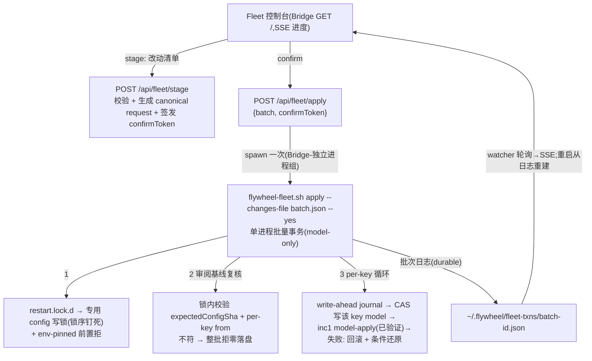

# Plan: Fleet 控制台 + 级别切换(FLY-247 Increment 2a)

**Version**: v1.41.0
**Issue**: FLY-247(Increment 2a;受管后端切换引擎已拆出 = **FLY-264**;Increment 1 = PR #250 已全门通过待 ship)
**Date**: 2026-06-12(inc2a 重定范围 + R2-R4 共享 finding 吸收)
**Source**: Annie mockup 三轮定稿(v3 lgtm,基准 = `/tmp/fleet-mockup-v3.html`)、Increment 1 plan(`doc/engineer/plan/inprogress/v1.40.0-FLY-247-fleet-config-dashboard.md`)
**Status**: codex-approved (14 rounds, 2026-06-13)

---

## 0. TL;DR

Annie 验收 Dashboard demo 后重定向 inc2 为 **Fleet 控制台**(Apple Card 白卡 × 7 Lead,chip dropdown 改配置,先编辑后批量应用真生效)。inc2 design review 跑了 4 轮(8→6→6→6 findings,平台期),**所有深 finding 的唯一来源都是跨 Claude-tmux + Codex 两套启动机制的崩溃安全后端实时切换**——一个真大的新基建,与 Annie 签字的控制台 + 级别切换毫无交集。故拆分:

- **本 plan = inc2a:Fleet 控制台 + 级别切换**(级别 = Claude 模型 Fable↔Opus,走 inc1 **已验证** model-apply 引擎真生效)。后端 chip **显示**但切换走 inc2b(对 write-lead 本就 FLY-245 置灰)。把 review 累积的**共享**硬契约(config 锁崩溃归属 / Bridge-spawn 存活 / 审计幂等 / 审阅基线绑定)收进来。
- **inc2b = FLY-264:受管后端切换引擎**(已开 issue,领自己 review 预算,把 R1-R4 所有深 finding 收那)。零生产需求,不阻塞任何人。

local-first;远程 = FLY-263。

## 1. 范围与已拍决策(Annie 三轮 brainstorm 定稿)

| # | 决策 |
|---|------|
| 布局 | 卡片式,一 Lead 一白卡(Apple Card 风,html-report-style 调色板) |
| 范围 | 只 7 个 Lead;Runner 继承不单列 |
| 卡内 | 名字 + 在线点 + 项目 + 后端 chip + 级别 chip |
| 交互 | chip 即 dropdown;级别选项随后端联动(Claude→Fable 5/Opus 4.8,Codex→GPT-5) |
| 草稿态 | 改动 chip 蓝框蓝底 + 旧值划线→新值 + 卡片蓝框 +「未应用」标;顶部 sticky `[应用 N 项更改]` + `[放弃全部]`;未应用前生产零变化 |
| 应用流 | 一个确认框列全部改动(~15s 重启 + 失败自动回滚警示)→ 逐项串行 → 同框逐项进度 → 失败项标红保原状 |
| 部署 | local-first(loopback);多机/远程/手机 = FLY-263 不碰 |

**UI 像素基准 = mockup v3**(Annie lgtm),实现以它为准。

### 1.1 inc2a 能做什么 / 不做什么(诚实边界)

- **级别切换(本期真生效)**:Claude Lead 的模型 Fable 5 ↔ Opus 4.8。走 inc1 已验证的 model-apply 引擎(inc1 刻意只对 model-only 自动应用),inc2a 加批量 + UI,不碰引擎切换语义。
- **后端切换(本期不生效,UI 显示)**:后端 chip 显示每 Lead 当前后端 + 选项,但**选不同后端 = 置灰**,标「受管切换 = FLY-264」;write-lead 的 Codex 选项另叠 FLY-245 置灰(见 §2.4)。inc2a **不写 backend 字段、不做任何后端 cutover**。**启用后端选择的 UI/API 与 cutover 引擎由 FLY-264 一体交付**(R6 #7:inc2a 不埋休眠后端 UI,不承诺 server-only 零改)。
- **Codex 级别**:Codex 后端只有 GPT-5 一个合法级别(单选项,构造上无装饰控件);且 inc2a 不切后端,故 Codex 级别 chip 对现有 Codex Lead(Mufasa)是只读显示(Mufasa 后端识别见 §2.4 Mufasa 权威)。

## 2. 架构

### 2.1 总览 — 级别批量事务归引擎(model-only,跑 inc1 已验证路径)

**引擎扩展 `apply --changes-file <json>`**(向后兼容:不带该 flag = inc1 行为字节不变):

- 输入 = **canonical request**(R2 #1):`{batchId, expectedConfigSha, changes:[{key, from:{model}, to:{model}}]}` —— 即 stage 时签发、founder 在确认框看到的不可变请求原文(含 from→to);`model` 值 = **精确 server 授权 model id 或 JSON `null`(= account-default/缺省)**,不是任意串(见 §2.6 模型授权 + 缺省语义);**inc2a 只接受 model 变更**(backend 字段出现即拒,留给 FLY-264);`batchId` 过 inc1 txn-ID 语法校验(杜绝路径穿越);**批次记录由 API 在 spawn 前 exclusive-create 于 `launching` 态(§2.2 启动握手),引擎 attach 并验 identity 后推进**(已终态/陌生 batchId → 拒);key/重复 key 前置校验,fail-close;
- **"零落盘"的精确定义(R8 #4)**:本 plan 所有"拒绝→零落盘"均指 **zero projects-config / carrier / runtime mutation**(不碰 config 文件、不动 plist/manifest、不停启 Lead);**审计行(`apply-requested`)与 durable `launching` 批次记录是在 spawn 前有意持久化的、拒绝时保留**(它们正是对账与防孤儿的依据,§2.2)。下文"零落盘"按此义。
- **前置拒绝 env-pinned**:`FLYWHEEL_PROJECTS` 设置时整批拒绝、零落盘(义同上;inc1 `flywheel-fleet.sh:55-63` fail-close 前移);
- **专用 config-write flock — 短持、内核自释,不碰共享锁(R3 #4 + R4 #3;锁 scope 收紧,team-lead 批)**:`restart.lock.d`(inc1 mkdir)只串行 fleet/restart 操作,不阻其他写者 → "读 SHA→mv"间被非锁写者改写仍会被原子 rename 静默覆盖;**原子 rename 只保读者不读半文件,不是 CAS**。故引入**专用 config-write flock**(内核 advisory lock,固定新路径,**全新、零 legacy 参与者、无迁移**):
  - **覆盖 = 每一段 projects-config 读-校验-写临界区都持同一把 config flock 跨完整临界区(R11 #1,不止首次前向写)**:① 首次前向写 ② 后续 per-key 前向写 ③ 失败后的条件还原(§2.1 per-key ③)④ crash recovery 的对账写 ⑤ deploy-time Mufasa 迁移(§2.4)。每段都 **由当前同步执行的进程持有 fd、该段写完即释放**;**不跨 cutover、不被任何长寿/detached 子进程继承**(config flock 与破坏性 daemon 子进程无关 → 天然无 R9 #1 的 fd 泄漏问题);
  - 获取 = **非阻塞 + 有界 deadline**;**拿不到锁的结局按上下文区分(R11 #1,绝不一律当 launch-time `rejected` —— 那会瞒报已发生的部分改动)**:

    | 获取上下文 | deadline 拿不到锁的结局 |
    |---|---|
    | 首次 pre-accept 写(任何 mutation 前) | 整批 `rejected`,引擎退出**后**才报、零 config/carrier/runtime mutation |
    | 后续 per-key 前向写(已 accept/已有 key applied) | 该 key `unapplied`(显式 write-conflict)、`stop_remaining`、批次归约 `partially-applied`/`failed`(**绝非 `rejected`**:`running→rejected` 非法且瞒报) |
    | 条件还原 | `config-restore-conflict`/manual-intervention(**绝非 `rejected`**:config 可能仍含本批目标值,要诚实冲突态) |
    | crash recovery 写 | 保持 recoverable / fail-closed,**不改写 config**(留待下次 recover) |
    | Mufasa 迁移 | 中止迁移、零 config mutation(可重跑) |

    引擎拿到锁后**先复核批次记录仍 authorized/非终态再写**,杜绝"报了 rejected/unapplied 又改";WI-2/WI-3 的 `denied` vs `rejected` 期望按此矩阵对齐;
  - recovery = **自动**(短持 + 内核在持有进程死亡时释放,无 reaper/quarantine/陈旧锁清理);owner metadata(batchId/start-time)写伴随文件**仅供展示/审计**,非接管依据;
  - macOS 经 python3 `fcntl.flock` 或内置 helper(绕开 macOS 无 `flock(1)`);因短持同步、不需被子进程继承 → **无 CLOEXEC 纠缠**(默认 CLOEXEC 正合适);
- **`restart.lock.d` 保持 inc1 原样(不升级,FLY-266)**:fleet batch 像 inc1 一样获取/释放 `restart.lock.d`(mkdir,行为字节不变),**inc2a 不碰 `restart-services.sh` / `daily-standup.sh`**,继承 inc1 现有 restart-lock 恢复行为(不变差)。**全机共享锁 mkdir→flock 统一 = 独立 follow-up FLY-266**(跨脚本 pre-existing,与控制台无关);锁序仍 `restart.lock.d`(mkdir)→ config-write flock;
- **协作写者间无丢写,非协作同用户编辑显式在 no-lost-write 保证外**(§2.2 一致);
- **测**:config flock 短临界区两并发写仅一胜;**按 §2.1 矩阵的五种 deadline 结局各一例**(pre-accept→rejected零写 / per-key→unapplied停后续 / restore→config-restore-conflict / recovery→不改写 / Mufasa 迁移→中止可重跑),**释放后绝不再写**;持有进程死 → 内核即释放下一获取者拿到;`restart.lock.d` mkdir 获取/释放 = inc1 字节不变哨兵;
- **锁先于任何写 + 审阅基线复核(authorization TOCTOU 闸,R2 #1)**:acquire config 写锁 → 读当前 config → **校验 `expectedConfigSha` 与 per-key from 值均与现状一致,任一不符 → 整批拒绝、零落盘**(founder 确认的是 from→to 跃迁,stage 后外部改写 → 回 UI 重确认)→ pre-image 记入批次日志 → 进入循环;
- **per-key 串行 + write-ahead journal(R3 #3,对齐 inc1 `flywheel-daemon.sh:352-361,612-627` 破坏边界前记账)**:对每个 key:① **journal `config-writing`**(记 expectedPreSha + intendedPostSha + key 值)→ 写仅该 key 的 model(同目录 tmp + 校验 + 原子 rename + 保权限,持 config 写锁)→ journal `config-written` ② 跑 **inc1 model-apply staged cutover**(相位机原样,已验证)③ 失败 → runtime 回滚(inc1 既有)+ **该 key config 条件还原(持 config flock 跨完整临界区,拿不到 → `config-restore-conflict`,§2.1 矩阵)**:**journal `config-restoring`** → 重读当前 config → 仅当该 key 仍等于本批写入的目标值才补丁回原值 → 校验 → 原子 rename → journal `failed-restored`;该 key 已被外部改走或 CAS 反复失败 → `config-restore-conflict` 终态、停止后续 key、**绝不声称"保原状"**,UI 走 manual-intervention ④ `stop_remaining` 单进程内天然成立;未尝试 key 因 config 从未被写天然保持原状;
- **批次日志**(`batch-<id>.json`,identity-bound,write-ahead)+ **两套独立枚举(R8 #3,CI 穷尽断言各跑各的)**:
  - **`BatchStatus`**(整批态;**不含 `denied` —— 见下,`denied` 是鉴权 audit event 非批次态,R12**):`launching | running | applied | partially-applied | failed | rejected | recover-required`(`applied`=全 key 成功;`partially-applied`=部分 key 成功;**`failed`=零 key 成功**(全失败/全回滚/全 manual,R10 #3);**`rejected`=引擎进入 `running` 前拒/猝死(零 mutation;含 env-pinned/非法请求/基线不符/首次锁 deadline/spawn 后未推过 launching 死,R12)**;`recover-required`=**已 `running`** 的死引擎非终态(R13:`launching` 死 → `rejected`,**不**进 `recover-required`);转移:**launching→{running|rejected}**(死 launching 过 deadline = `rejected` 零 mutation),running→{applied|partially-applied|failed|recover-required});
  - **`denied`= fleet_admin_audit 的鉴权层 event(R12,非 BatchStatus)**:confirmToken 伪造/过期/重放/请求不符/跨 origin → API 401 + audit `denied`,**根本不创建 launching 记录、不 spawn 引擎**(故无批次态);
  - **`KeyStatus`**(每 key 事务态):`pending | prepared | config-writing | config-written | applying | applied | config-restoring | failed-restored | config-restore-conflict | manual-intervention | skipped | unapplied`(转移见 §2.1 per-key 流;`config-restoring` 非终态);
  - 字段:batchId、canonical request、pre-image SHA、PGID/start-time owner、`BatchStatus`、每 key {from, to, `KeyStatus`, expectedPreSha, intendedPostSha} + 其单 key txn id;**§2.5 phase→copy fixture 消费这两套精确枚举,CI 断言无未映射成员**;
- `fleet recover` 扩展:发现未完成批次 → 对每个 pre/post-rename crash window 定义对账(crash-after-rename-before-`config-written` 由 intendedPostSha 判真实落点;crash-after-restore-before-`failed-restored` 不误判冲突)→ 按 inc1 恢复矩阵收尾。

**API 变薄但进程独立 + 启动握手(R4 #4 + R5 #4 + R6 #4)**:stage/apply 不拥有事务状态;**引擎 spawn 为 Bridge-独立进程组/session,stdout/stderr 重定向到 per-batch durable 日志**(Bridge 重启不杀引擎);**消除 pre-journal 窗口(R6 #4)**:**API 在 spawn 之前先 exclusive-create 一个 `launching` 批次记录**(batchId/将派 PID 占位/start-time/启动 deadline),故**任何时刻都有 durable journal**;spawn 后引擎 attach 该记录并推进(launching→prepared→…);**`denied` vs `rejected` 确定性区分(R12,绝不用 `denied/rejected` 含糊斜杠)**:**`denied` = API/confirmToken 鉴权层拒**(伪造/过期/重放/请求不符/跨 origin),**根本不 spawn 引擎**;**`rejected` = 引擎已 spawn 但在进入 `running` 前拒/猝死**(env-pinned、非法请求/batchId、基线 expectedConfigSha/from 不符、**首次 config-flock deadline 拿不到锁**、或 spawn 后未推过 `launching` 就死)—— 零 mutation。
**pre-accept gate 在 `launching` 内完成(R12)**:**初次 config-flock 获取 + 基线校验都在 `BatchStatus=launching` 期间做**;**仅当 pre-accept gate 全过才 `launching → running`**(此后才有首次 mutation)→ 故 `launching → rejected` 合法、且此时 API 尚未报 accepted。
**结构化启动握手(有界超时)**:引擎在 deadline 前未把记录推过 `launching` → 落终态 `rejected` + 审计(API 在世则 API 写,**API 不在世则 Bridge 启动对账写**——R6 #4:Bridge 在 spawn 后猝死也有 launching 记录可对账,不再孤儿);**API 绝不在未观察到记录推过 `launching`(即进入 `running`)前返回 accepted**(成功 spawn ≠ accepted);**Bridge 启动对账 = 对每个非终态记录都先做 identity-liveness 判定(R8 #2,引擎 Bridge-独立,绝不覆盖活事务)**:identity-matched **活引擎**(任何非终态:`launching`/`config-writing`/`applying`/`config-restoring`…)→ **observe/续推,不改其相位**(与 §2.5 一致);**死引擎** + `launching` 且过 deadline → `rejected`(零 mutation);**死引擎** + 已 `running` 的非终态 → `recover-required`。绝不仅凭"推进过 launching"就改 `recover-required`(那会让活引擎、watcher、recover 抢同一批次)。
- **测**:鉴权层(伪造/过期/重放/跨 origin token)→ `denied`、不 spawn;引擎 pre-accept(env-pinned/非法请求/基线不符/**首次锁 deadline**/spawn 后未推过 launching 死)→ `rejected` 零 mutation、API 不报 accepted;**`launching → running` 仅 pre-accept gate 全过后**;**Bridge 推进后(已 running)重启两遍:引擎仍活 → 不改相位续推;引擎被杀 → `recover-required`**。

### 2.2 控制台鉴权与 founder-admin 面(R2 #2 + R3 #5 + R4 #5)

现状核对:reserved middleware 只支持 `action_router|close_tmux|close_runner` 且无上下文显式放行(`reserved-endpoints.ts:106-152`、`middleware.ts:57-65`);`tokenAuthMiddleware` 无 token no-op(`plugin.ts:346-355`);FounderConsentEvaluator 是 issue-thread 限定(`evaluator.ts:73-103` 要 issueId+thread 否则 fail-close;`founder_consent_audit.issue_id NOT NULL`;off 档 wiring 不构造 evaluator/audit,`wiring.ts:232-248`)。**仅挂清单 = 旁路;硬塞现 evaluator = 全拒或空转**。独立 founder-admin 变更面:

- **具体 transport(R6 #3,二选一定为前者)**:
  - `GET /` → 控制台 HTML(loopback,沿 inc1 dashboard 既有 unauthenticated-loopback 姿态);
  - `GET /api/fleet/snapshot` → 控制台读模型(§2.4),**loopback + same-origin 只读**,返回 **secret-free DTO**(白名单:leadId/name/project/当前 model+backend 显示值/backendOptions/tierOptions/online 状态;**绝不返回 `LeadConfig`** —— 它 hydrate 了 `botToken`,`ProjectConfig.ts:12-15,412-419`,整对象外泄即漏密);
  - `GET /api/fleet/progress`(控制台专用 SSE channel)→ 进度,**与 legacy `/sse` 分离**(legacy `/sse` 字节不变,有 sentinel,`plugin.ts:549-577`);
  - `POST /api/fleet/stage` / `POST /api/fleet/apply` → 变更(下述鉴权);
- **founder 同意的技术形态 = same-origin + confirmToken 流**(R6 #3 厘清):浏览器**不持有 `TEAMLEAD_API_TOKEN`**(它继续 gate 其他**程序化** `/api/*` Bearer 面;fleet 控制台面**不走 Bearer**)。控制台读/进度 = loopback + same-origin 只读(同 inc1 dashboard/sse 姿态);变更(stage/apply)= **loopback + same-origin(Origin/Referer = Bridge 自身 origin,anti-CSRF)+ 单次 confirmToken + always-on 审计**;不借道 issue-thread evaluator(FounderConsentEvaluator/DECISION_MODE 整合显式不在本期);
- **confirmToken 合同**:`POST /api/fleet/stage` 校验通过 → 生成 canonical request → 签发 token = **绑定 canonical request 全文 SHA**(非仅目标值)—— 单次使用、TTL 60s、内存(Bridge 重启即失效)、apply 验后即作废;Origin/Referer 须 Bridge 自身 origin;重放/过期/请求不符/跨 origin → 401 + 审计;
- **专用 fleet-admin 审计表(R3 #5 + R4 #5)**:audit.db 新表 `fleet_admin_audit`(独立于 `founder_consent_audit`,不动其 schema):batch_id、event、canonical request 全文、结果、时间戳;schema **首次变更时 lazy-init**(不用控制台 = 启动期零落盘,byte-compat);
  - `staged` / `apply-requested` **唯一/幂等**,在签发 token / spawn 引擎之前持久化,**失败即 fail-closed 拒绝**(变更未发生可硬拒;**含 spawn 失败也从 API 路径写终态 `apply-result`**,补 R4 #5 的 pre-journal 缺口);
  - `denied` **append-only**(attempt/event id + reason + request hash + origin),**不挤进唯一约束**(多次攻击/误操作各留证,R4 #5);
  - `apply-result`(成功路径)**不能 mutation 时 fail-closed**(引擎可能已改 + Bridge 可能重启)→ 由 **live watcher 与 Bridge 启动双途径**从终态批次日志 idempotent upsert 补写(R4 #5);
- **诚实信任边界(R2 #2 + R3 #5)**:技术防线只覆盖 **Bridge 面**(token 挡浏览器 CSRF/重放;变更前置审计 fail-closed;`apply-result` 对账补写不假称 mutation 时 fail-closed;Lead/Runner 规则层 reserved 禁令扩展覆盖 fleet endpoints = 治理协作 agent **非技术边界**)。**同 Unix 用户进程可直接跑 `flywheel-fleet.sh` / 改 config,绕过 token/审计 —— 显式在技术 enforcement 之外**(机器即信任根;真隔离 = FLY-263);
- **与 Bearer 面的关系(R6 #3 厘清)**:`TEAMLEAD_API_TOKEN` 继续保护既有**程序化** `/api/*`,其行为字节不变;fleet 控制台面(snapshot/progress/stage/apply)**不依赖 Bearer**,凭 loopback + same-origin + confirmToken + 审计 —— 故**不引入"无 token 503"**那条(上一版与"浏览器不持 token"自相矛盾,撤回)。诚实代价:loopback 本机非浏览器进程能伪造 same-origin 头 → 落在下条信任边界(非技术 enforcement)。

### 2.3 级别切换接线(走 inc1 已验证引擎)

- inc1 `flywheel-fleet.sh apply` 已实现单 Lead **model-only** staged 切换(锁/快照/TOCTOU/staged/verify/回滚全在,且**刻意只对 model-only 自动应用、fail-close 所有 backend 切换**)。inc2a **不改这条语义**,只在外面套批量事务(§2.1)+ UI;
- verify 谓词 = inc1 既有 claude-runtime 证据(`claude_pane_evidence`,model 切换前后都是 claude 后端,无新增谓词需求);
- result record / `deriveDecision` / `FleetRuntime` **不动**(inc2a 无新 runtime 枚举;`codex-confirmed`、双后端证据、三谓词 verify 全归 FLY-264)。

### 2.4 控制台读模型 + 后端 chip 能力位降级(R5 #1 + R5 #3 + R5 #6 + R1 #7)

**Mufasa 后端权威(R6 #1 阻塞,必须 ship 前定)**:生产 Mufasa 的 projects 条目无 `backend`(`projects.json:125-143`)、manifest 无 `leadBackend`、只有 bespoke plist 经 `flywheel-codex-lead-wrapper-mufasa.sh` 间接标 Codex → **`effectiveLeadBackend()` 现把 Mufasa 解析成默认 Claude**(`lead-backend.ts:55-65`、`ProjectConfig.ts:97-98`)。若不修,读模型会把 Mufasa 显示成 Claude/Fable/Opus,且 API/引擎的"Codex Lead 拒改 model"闸**够不着**(它们也看到 effective Claude)。**修 = deploy-time 迁移:给 Mufasa projects 条目加 `backend: "codex-app-server"`**(它本就 `companion:true, canSpawnRunners:false` → 过 FLY-245 schema,**不触发任何 cutover**;因 carrier 仍 bespoke → inc1 classify 为 external/UNAPPLIED,显示+只读而非受管)。这是 inc2a rollout 的一步(文档化),非代码默认值。备选 = 显式 display/capability-only 的 unmanaged-backend 清单(更重,不取)。
- **迁移的预期可观察变化(R7 #5,byte-compat 声明收窄)**:给 Mufasa 加显式 backend 会**打开 inc1 `hasExplicitFleetConfig()` 闸** → 生产 legacy `/sse` 从此**对 Mufasa 含 `fleet`**,且 Mufasa 的动态 pane-watchdog 归属随之变(`fleet-data.ts:518-522`、`plugin.ts:1721-1727,2180-2197`)。故「legacy `/sse` 字节不变」「不用控制台 = 全链字节不变」**仅对未改输入/代码路径成立,不含本迁移这步**;迁移本身的预期可观察变化 = 仅 Mufasa 的 desired 显示 + watchdog 分类(**无受管 cutover**),显式列出;
- **迁移走受支持路径**:经新 config 写锁 + CLI 校验器 + 原子 rename 落盘(非手改);**测**:迁移只改 Mufasa display/watchdog 分类、零 cutover、其余六 Lead 不动。

**控制台读模型(R5 #1 关键缺口)**:inc1 fleet payload 是 **default-off gated** —— `hasExplicitFleetConfig()` 仅当某 Lead 有显式 `model`/`backend` 才供 payload,否则 Bridge 省略、Dashboard 隐藏 fleet 区(`fleet-data.ts:518-522`、`plugin.ts:1721-1727`、`dashboard-data.ts:48-54`、`dashboard-html.ts:253-256`)。**生产 `~/.flywheel/projects.json` 七个 Lead 均无 model 字段**(Mufasa 迁移后有 backend,其余仍无)→ 直接复用旧 payload 控制台会**漏卡**。故 inc2a **新增专用控制台读模型**(transport 见 §2.2):**始终返回全部已配置 Lead**(含默认值 + 能力位),**与 inc1 那条 default-off legacy SSE 合同并存**(后者字节不变,不动);控制台不依赖 legacy payload 是否存在。
- **测**:生产形态 fixture(七 Lead:Mufasa=Codex 迁移后只读 GPT-5 且拒 model 变更零写、其余六无显式 model/backend)→ 断言七张卡全渲染、默认值与能力位正确。

**能力位 server 下发(R1 #7)**:控制台读模型每 Lead 带 `backendOptions: [{backend, switchable, disabledReason?}]` + `tierOptions: [exact model id…]`,server 计算;UI 纯渲染,不硬编码规则:
- 任一非当前 backend 的 `switchable=false` + `disabledReason="受管后端切换 = FLY-264"`(inc2a 全程);
- write-capable Lead 的 codex 选项再叠 `disabledReason="write-capable Lead 切 Codex 需 FLY-245"`(inc1 schema `ProjectConfig.ts:379-390` fail-close 已核);
- 级别 chip 在当前 backend 内可切(Claude=Fable/Opus 双选;Codex Lead 的级别 chip **只读**,见 §2.6 模型授权);

**inc2a/FLY-264 边界收窄(R5 #6)**:inc2a **只拥有后端 chip 的显示 + 能力位 disabled 态**;**FLY-264 拥有"启用后端选择"的 UI/API + cutover 引擎(一体交付)**。能力位仍避免 UI 硬编码资格规则,但 **不承诺"server-only 零 UI 改即点亮"**(那需要本期就埋休眠的后端 draft/确认/请求/结果 UI,等于把 FLY-264 漏回来)。FLY-264 落地时一并补后端选择的 UI/API。

### 2.5 进度与断线恢复(R3 #8 + R4 #4)

- **两套穷尽映射(R5 #5 + R6 #6 + R8 #3 + R9 #2:按枚举分,各自 CI 穷尽断言)**。

  **① `BatchStatus` → 批次级 copy/行为**(整批顶部状态,非 per-key rank):

  | BatchStatus | 批次级显示 / 行为 |
  |---|---|
  | launching | 「排队」(等启动握手) |
  | running | 「执行中」—— **进度由下表 per-key rank 渲染**(本态无自己的 rank) |
  | applied | 「全部完成」✓ |
  | partially-applied | 「部分完成」(≥1 key 成功 + ≥1 失败,逐 key 看下表) |
  | failed | 「全部失败」(标红,零 key 成功 —— 全失败/回滚/manual,R10 #3) |
  | rejected | 「已拒绝」(标红+原因,引擎 pre-accept 拒/猝死,零 mutation,§2.2;`denied`=鉴权层无批次态,只进 audit) |
  | recover-required | 「需恢复」(标红,死引擎非终态) |

  **② `KeyStatus`(+ inc1 子事务态)→ per-key rank/copy**(**单调 merge 的 rank 取此处,不取粗粒度 `running`**):

  | rank | KeyStatus | inc1 子事务态 | UI 步 / copy |
  |---|---|---|---|
  | 0 | (未入队) | — | 「排队」 |
  | 1 | pending, prepared, config-writing | pending, prepared | 「备份」 |
  | 2 | (applying 停止子阶段) | stopping, stopped | 「停止」 |
  | 3 | config-written, applying(应用子阶段) | committing, committed, bootstrapping | 「应用」 |
  | 4 | applying(验证子阶段) | verifying | 「验证」 |
  | 4(非终) | **config-restoring** | **restoring** | **「正在回滚」**(R7 #3:非终态,可再失败成 manual) |
  | 5(终) | applied | applied | ✓ |
  | 5(终) | skipped / unapplied | — | 「未动」 |
  | 5(终) | **failed-restored** | **rolled-back** | 「已回滚,保原状」(**仅终态回滚成功才显示**) |
  | 5(终) | config-restore-conflict / manual-intervention | manual-intervention | 「需人工」(标红+runbook,**绝不写"保原状"**) |

  单调 rank 取 per-key `max(KeyStatus rank, inc1 子事务态 rank)`;`BatchStatus=running` 不参与 rank;CI 对 BatchStatus、KeyStatus 各自断言无未映射成员。

  inc1 既有相位名以 `flywheel-fleet.sh:925-942`、`flywheel-daemon.sh:628-650` 为准核对,新增相位补入;**两套枚举各自一一映射,CI 各跑各的穷尽断言**;
- **per-key 日志合并/单调(R5 #5 + R9 #2,防进度倒退)**:每 key 显示 rank = `max(KeyStatus rank, 该 key inc1 子事务态 rank)`(**rank 源自 per-key,非粗粒度 `BatchStatus=running`**),**单调不回退**(子事务新建于低 rank 不得把已进到「应用」的 key 拉回「备份」);**批次终态归约(R10 #3):全 key applied→`applied`;≥1 applied 且 ≥1 失败→`partially-applied`;**零 applied→`failed`**;
- **进度源 = durable 文件**(批次日志 + per-key txn journal),Bridge watcher 轮询转 SSE;**SSE 重连/Bridge 重启从文件重建**;detached 引擎活着 → 续推进度;**引擎已死(R13,按 launching/running 边界):死 `launching` 且过 deadline → `rejected`(零 mutation);死 `running` 非终态 → `recover-required`**;
  - **测**:重连/重启重建覆盖该 split —— 死 launching→rejected、死 running→recover-required 各一例;
- 结构化 batchId 由 API 生成传引擎(不靠 stdout 解析);
- **测**:每个批次状态(含 restore/skip/conflict/recover-required)reconnect/startup 重建 + **断言进度永不回退**。

### 2.6 config 校验与写入边界(R2 #5 + R3 #4)

- 抽 **`parseAndValidateProjects(raw: string)`** 纯函数 —— **纯结构校验与 runtime secret 水合分离**(现 `loadProjects` 非纯,改写 leads + 经全局 env 解析 `botTokenEnv`,`ProjectConfig.ts:134-161,412-420`):纯函数只 parse + 结构/跨字段规则(含 FLY-245),不读 env;`loadProjects` 重构为 读文件→纯校验→水合;
- **引擎侧可执行校验器**(bash 调不了 TS):纯校验器以 built、版本化 CLI helper 暴露(`packages/teamlead` dist),`flywheel-fleet.sh` 在**每次 config rename 前 + recovery 中**强制调用(不留 `jq empty` 绕过 FLY-245 的缝);**API 与引擎同 fixtures 双侧验证**;
- 写入(引擎侧,§2.1):同目录 tmp + 校验 + 原子 rename + 保权限 + 持 config 写锁;
- **模型授权闸(R5 #3 + R6 #5,防伪造客户端绕过 dropdown)**:现 `ProjectConfig` 接受任意非空 control-safe model 串(`ProjectConfig.ts:351-369`),inc1 会把任意串应用到 Claude Lead(`flywheel-fleet.sh:284-330`)→ 伪造/有 bug 的客户端能绕过 UI 下拉。故定义 **`allowedModelTargets` = 该 Lead 有效 Claude 后端的 `tierOptions`(精确 model id 集)∪ `{null}`**(R6 #5:`null`=account-default 是合法目标,否则"显式模型改回缺省"在合同里不可能——与 §2.1 的 `null` 写=删字段语义冲突);**API 与引擎都拒绝任何不在 `allowedModelTargets` 内的 `to.model`**;**Codex Lead 的 model 变更在任何写入前拒绝**(Mufasa:本期 model 只读);
- **缺省/account-default 语义(R5 #3)**:生产七 Lead 当前 model 全缺省 → `from.model` 多为 `null`。**`null` = account-default 显式建模**:相等语义(`null===null`)、写入 = **删除该 key 的 model 字段**(非写空串)、还原 = 删回缺省、UI 显示 **「Account 默认」** 态(不假充 Fable/Opus,否则 reviewed 跃迁与 rollback pre-image 失真);
- **hot-refresh**:`ConfigSnapshotProvider` 的 model/backend overlay(`fleet-data.ts:476-490,547-565`)inc2a 不引入新结构字段(无 codex 块)→ model 改是既有 overlay 路径,不误判 restart-required;能力位字段为 server 计算的派生量不入 config;
- **测**:任意串伪造拒;Codex Lead model 变更拒;`null`→显式 + 失败回滚回 `null`(删字段);缺省态 UI 显示。

### 2.7 原 runner-follow-lead plan 处置

`v1.40.1-FLY-247-runner-follow-lead.md`(已 APPROVED)退为 **Increment 3,不并入**:改动面(dispatcher/session 持久化)与本期无交集。其 §7 FLY-259 合同记录继续有效。控制台「Runner 自动继承」副标如实:「Runner 将继承(接线 = 下一期)」。

## 3. 实现分解(TDD,顺序即依赖序)

### WI-1 — config/schema + 能力位 + 控制台读模型(TS)
`parseAndValidateProjects` 纯函数抽取(结构校验与 secret 水合分离;loadProjects 字节不变哨兵)+ **引擎用 CLI 校验器**(dist 暴露,版本化);**模型授权**(`tierOptions` 精确 model id 集 + 缺省=`null` 语义,§2.6);能力位计算(`backendOptions`/`tierOptions`,§2.4 规则);**控制台只读读模型**(始终返回全部 Lead,与 inc1 default-off legacy SSE 并存,§2.4)。
**测**:抽取前后全量行为对照;**七 Lead 生产 fixture(Mufasa 迁移后 backend=codex 显示只读 GPT-5;其余六无显式 model)→ 全卡渲染 + 默认值/能力位正确**;能力位规则表(后端切换全 false + write-lead codex 双 reason);任意串 model 拒 / Codex Lead model 变更拒 / `allowedModelTargets=tierOptions∪{null}`(**显式 model → `null` 成功**);**API/引擎同 fixtures 双侧一致**;reverse-compat 哨兵。

### WI-2 — 引擎批量事务 + 锁升级(bash,model-only)
`--changes-file` 批量模式:canonical request 复核、env-pinned 前置拒、**专用 config-write flock(§2.1:短临界区同步持有、非阻塞+deadline、内核自释,不碰共享锁)**、**`restart.lock.d` 保持 inc1 mkdir(不升级,FLY-266;不碰 restart-services.sh/daily-standup.sh)**、锁序 restart.lock.d(mkdir)→ config flock、write-ahead journal、per-key 条件还原、pre/post-rename crash 对账、recover 扩展;**backend 字段出现即拒 + `allowedModelTargets` 外 model 拒 + Codex Lead model 拒**(留 FLY-264 / 防伪造);缺省 `null` 写=删字段、还原=删回;CLI 校验器接线(rename 前 + recovery)。复用 inc1 model-apply 相位机,不新增 verify 谓词。
**测**(扩 inc1 套件):批量两 key 一败一成(失败 key 条件还原、成功 key 保留、无关编辑不丢);**stage 后外部改 config → apply 整批拒零落盘**;还原冲突 → `config-restore-conflict` 停后续;**kill-point:目标 rename 与 restore rename 各前后**;**config flock:两并发写仅一胜;按 §2.1 五种上下文 deadline 结局各一例(pre-accept→rejected零写 / per-key→unapplied停后续归 partially-applied|failed / restore→config-restore-conflict / recovery→不改写 / Mufasa→中止可重跑)且释放后绝不再写;持有进程死 → 内核即释放下一获取者拿到**;**`restart.lock.d` mkdir 获取/释放 = inc1 字节不变哨兵**;`null`→显式 + 失败回滚回 `null`;未尝试 key 零落盘;env-pinned 拒;batchId 非法/已存在拒;**backend/越权 model 变更拒**;`--changes-file` 不带 = inc1 字节不变哨兵。

### WI-3 — Bridge API + 鉴权 + 进程独立(TS)
transport(§2.2):`GET /api/fleet/snapshot`(loopback+same-origin 只读 **secret-free DTO**)+ `GET /api/fleet/progress`(控制台专用 SSE,与 legacy `/sse` 分离)+ `POST /api/fleet/stage`(校验 + canonical request + confirmToken 签发)+ `POST /api/fleet/apply`(**same-origin + confirmToken** 验证 + **API 先 exclusive-create `launching` 批次记录 → Bridge-独立进程组 spawn 引擎 + per-batch durable 日志 + 启动握手** + batchId);**fleet 路由不走 Bearer、无 503**(§2.2 厘清)。`fleet_admin_audit`(lazy-init;`staged`/`apply-requested`/`apply-result` 唯一幂等 + `denied` append-only;前置 fail-closed;**`launching` 记录使 spawn 后任何点猝死都可对账 → API 在世 API 写终态、不在世 Bridge 启动对账写**);**API 不在观察到记录推过 `launching`(进入 `running`)前返回 accepted**;**启动对账 = 每个非终态先判引擎死活(R8 #2):活引擎→不改相位续推、死引擎→(`launching` 且过 deadline → `rejected` 零 mutation;已 `running` → `recover-required`)**;进度 watcher→SSE + 重连/重启重建。
**测**:confirmToken 全反例(伪造/过期/重放/请求不符/跨 origin → 401 + audit `denied`、**不 spawn**);**secret-canary/redaction(snapshot 不含 botToken)**;**legacy `/sse` 字节不变 sentinel**;前置审计落盘失败 → 拒;**引擎 pre-accept(env-pinned/锁首次 deadline/非法请求/基线不符)→ `rejected` 零 mutation + API 不报 accepted**;`launching → running` 仅 pre-accept gate 全过后;**Bridge 猝死对账(R8 #2 + R9 #3):spawn 前 → launching 对账;spawn 后未推过 launching 死 → `rejected`;已 running 后重启两遍 —— 引擎仍活→不改相位续推 / 引擎被杀→`recover-required`**;重复 `denied` audit 各留证;未用控制台启动期零落盘;进度全相位单调不回退。

### WI-4 — 控制台前端(像素基准 = mockup v3)
读模型驱动 chip dropdown(级别可切含「Account 默认」态 + 后端置灰带 disabledReason)、草稿态、stage→confirm→apply 流、SSE 四步进度(单调)、失败标红、manual-intervention/recover-required 态;替换 `GET /` 渲染为控制台(run-status 板块按 Annie 砍,SSE payload 字段保留仅不渲染)。
**测**:状态机纯函数单测 + 渲染断言(后端 chip 置灰态 + Account 默认态 + 进度不回退);真机走 QA(test-slot 真级别切换 + Annie 浏览器实操)。

### WI-5 — 文档 + Mufasa 迁移
迁移 runbook 增补(批量 model 模式 / config+restart 锁 / recover);**deploy-time Mufasa 迁移步骤**(projects 加 `backend:codex-app-server`,§2.4,ship 前执行 + 验证 Mufasa 显示 Codex/GPT-5 只读);inc1 plan §2.3 follow-up 标;runner-follow-lead plan 加「退为 inc3」批注;**FLY-264 plan 链接**(后端引擎归属)。

## 4. 既有合同不破(显式核对清单)

| 合同 | 本期影响 |
|------|---------|
| inc1 单 key apply CLI/相位机/恢复矩阵/model-apply 语义 | `--changes-file` 不带 = 字节不变(哨兵);批量是叠加路径;不碰 backend fail-close |
| FLY-245 schema fail-close | 不碰;server 能力位置灰尊重 |
| FLY-242/FLY-259 deriveDecision 合同 | **不动**(无新 runtime 枚举;codex-confirmed/双证据归 FLY-264) |
| byte-compat | 不用控制台 + 未改输入/代码路径 = 全链字节不变(含 audit lazy-init 启动期零落盘);**Mufasa backend 迁移这步是有意例外**(打开 hasExplicitFleetConfig → legacy /sse 含 Mufasa fleet + watchdog 分类变,无 cutover,§2.4 列明) |
| founder authority(FLY-175) | 独立 fleet-admin 面(§2.2):confirmToken=同意凭证 + `fleet_admin_audit` 独立表;evaluator 整合不在本期 |
| FLY-264(后端引擎) | inc2a 只拥有后端 chip **显示 + 能力位 disabled 态**;**启用后端选择的 UI/API 与 cutover 引擎由 FLY-264 一体交付**(不在本期埋休眠 UI) |

## 5. 测试计划

TS:WI-1 schema/能力位、WI-3 鉴权/进程独立/审计/进度;bash:WI-2 批量+config 锁全场景(§3 列举)+ CLI 校验器双侧 fixtures;sentinel:inc1 单 key 字节、未用控制台启动期零落盘、loadProjects 抽取对照。真机 QA(test-slot):级别批量切换全链(一败一成)、Bridge 重启中断恢复(活引擎不改相位 / 死引擎 recover-required)、config flock 并发写(一胜一 rejected 不再写)、Annie 浏览器实操对照 mockup(含后端 chip 置灰体验)。

## 6. 风险

| 风险 | 缓解 |
|------|------|
| 批量中途 Bridge/引擎死 | 引擎 Bridge-独立进程组 + durable write-ahead 批次日志 + 每 crash window 对账 + UI 重建;未尝试项天然无损 |
| founder 审阅与执行间隙被改 | confirmToken 绑 canonical request(from+expectedConfigSha),引擎锁内复核,不符整批拒 |
| config 并发写冲突 / 锁崩溃 | config 写锁 = 内核 flock(锁序 restart→config,内核串行化+全死自动释放,无 userspace 接管)+ 原子 rename;非协作同用户编辑显式在保证外;还原冲突→`config-restore-conflict` 不假报 |
| 审计漏证 | 前置 fail-closed + spawn 失败终态 + denied append-only + apply-result 双途径对账补写 |
| 后端 chip 误导(显示但不生效) | server 能力位置灰 + disabledReason 明示「FLY-264 / FLY-245」;inc2a 不写 backend 字段 |
| FLY-264/FLY-245 时序 | inc2a 能力位 disabled 态;启用后端选择 = FLY-264 一体补 UI/API+引擎(不承诺 server-only 零 UI 改) |
| 控制台读模型缺卡(default-off gate) | 专用只读 `/api/fleet/snapshot` 始终返回全部 Lead,与 inc1 legacy SSE 并存;七 Lead fixture 测全渲染 |
| Mufasa 被误显示为 Claude | deploy-time 迁移给 Mufasa projects 加 `backend:codex-app-server`(companion 过 FLY-245,bespoke carrier 仍 external 不 cutover);fixture 测只读 GPT-5 + 拒 model 变更 |
| 读模型漏密(botToken) | secret-free DTO 白名单,绝不返回 `LeadConfig`;secret-canary/redaction 测 |
| config 写并发损坏 | 专用 config-write flock(短临界区同步持有、非阻塞+deadline、内核自释);restart.lock.d 保持 inc1 mkdir 不动(共享锁统一 = FLY-266);并发写一胜一 rejected 测 |
| 伪造客户端绕 dropdown | API+引擎双侧拒 tierOptions 外 model;Codex Lead model 变更拒;缺省=null 显式建模 |
| 本机进程绕过 Bridge 面 | §2.2 诚实边界:Bridge 面 token + 前置 fail-closed 审计;同用户直跑 CLI 显式在技术 enforcement 外;真特权边界 = FLY-263 |
| run-status 砍除 | SSE payload 字段保留仅不渲染;现 Dashboard 唯一用户 = Annie 本人要求砍 |
