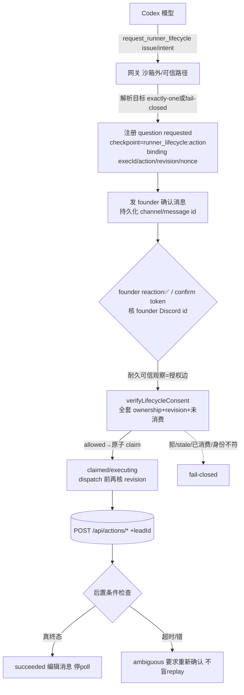

# Plan: Write-capable Codex Lead 的 founder 安全闸

**Version**: v1.42.0
**Issue**: FLY-245(解除 FLY-224 HIGH-1 interim fail-close;write-capable Codex dept Lead 安全启动 + 起/关 Runner 的 founder 授权骨架)
**Date**: 2026-06-10
**Source**: `doc/engineer/exploration/new/FLY-245-codex-lead-founder-gate.md`(round-2,Annie 拍雄心版)、`doc/engineer/research/new/FLY-245-codex-lead-founder-gate.md`
**Status**: codex-approved(Codex design review **5 轮 APPROVE** 2026-06-12 —— R1 9 HIGH+5 MED 全纳 → R2/R3/R4 逐轮收敛 → R5 APPROVE 无阻塞项;FLY-260 拆分读-外泄)

---

## 0. 一句话

把 FLY-224 留下的"write-capable Codex Lead 一律拒启动"的兜底 fail-close,换成**结构性安全的放行**。三道独立防线:**(1) confinement** —— `workspace-write + 网络关 + 窄 writableRoots + 精确 MCP allowlist(只剩网关)+ 干净 managed CODEX_HOME`,堵死模型 shell 的**所有**沙箱外动作通道(不只是 GitHub/Bridge/tmux,还有 Chrome 等其它 MCP);**(2) 唯一可信收口** —— 一个 Flywheel Lead 网关进程,其**代码/依赖部署在模型 writableRoots 之外且路径不 overlap**(写隔离;sandbox 保证不了读隔离,故不靠"不可读")、**动作 secrets 只在内存**(不落文件/env/argv)、**broker connect 被沙箱堵**;模型只能向它发结构化 REQUEST;**(3) 本地硬核验** —— 网关执行保留动作前必过 founder 凭据核验(merge/ship 复用 `CodexFounderPreflight`;runner-lifecycle 用新建的、带**单调 revision + 持久状态机**的 `verifyLifecycleConsent`)。**模型只能 REQUEST,永远无法 SELF-AUTHORIZE。** 不动 Bridge enforce(FLY-175 Phase 0 默认 off)。

**已拍方向(不回头)**:雄心版(merge/ship + 起/关 Runner)/ 不动 Bridge enforce / lifecycle 闸张力设计内消化 / L1 reaction 优先 / L2 v1 不加 Bridge 纵深 / L3 start 不加 founder 闸。

**安全门槛(Codex R1 定调,本版采纳)**:fail-close **保持**到 HIGH-1..9 在 plan + 放行条件 + 测试里全部落实。核心三条:网关必须是**唯一**沙箱外动作能力;其代码在模型 writableRoots 外且不 overlap(写隔离)、动作 secrets 只在内存且 broker connect 被堵(不靠"不可读");lifecycle consent 必须有单调 revision + 持久崩溃语义。

---

## 1. 范围:245 做什么、不做什么(R1#12 诚实化)

```mermaid
flowchart LR
    subgraph FLY-245 [FLY-245 本计划 — 安全启动 + 授权骨架 + lifecycle 全功能]
      A[confinement: ww+net off+窄 root+cwd pin<br/>+精确 MCP allowlist 只剩网关+干净 CODEX_HOME]
      B[运行时 thread 描述符硬断言<br/>cwd/roots/approvalPolicy/sandbox/MCP inventory/cliVersion]
      C[网关进程骨架<br/>代码在 writableRoots 外+不overlap;secrets 仅内存]
      D[secret broker over unix-socket<br/>模型 exec 连不上 unix socket]
      E[merge/ship preflight<br/>CodexFounderPreflight + 目标 worktree 取 head]
      F[lifecycle 凭据原语 全功能<br/>单调 revision + 持久状态机 + 原子消费 + 崩溃恢复<br/>execute 直接打现有 /api/actions/*]
      G[解除 fail-close 闸先行同 PR]
      H[威胁矩阵 QA 扩展]
    end
    subgraph FLY-251 [FLY-251 后续 — 起 Runner + 入站 + ship relay 投递]
      I[start_runner/send/ask/read_tmux 实现]
      J[Runner→Lead 入站唤醒]
      K[merge/ship relay 的耐久投递+幂等+wake]
      L[实际 spawn/追踪 Runner E2E]
    end
    C -. 骨架留位 .-> I
    E -. preflight 通过后的投递 .-> K
    A -. confinement .-> I
```



**245 交付**:write-capable Codex dept Lead **能安全启动**;**runner-lifecycle(terminate/reject/defer/shelve/retry/close)端到端全功能**(execute 直接打**现成**的 Bridge `/api/actions/*` 端点,网关在沙箱外有网络,无需 Runner 往返);**merge/ship 的 founder preflight 接通**(gated 工具 + 目标 worktree 取 head),但**真正把批准转达/唤醒 Runner 的耐久投递 transport 是 251**(`send_to_runner`)。

> **诚实边界(R1#12)**:245 不声称"merge/ship 端到端可用"。merge 由 Runner 自己在 `:cool:` flow 做、ship 前强制 `verify-approval`;Lead 的角色是把 founder 的批准决定**转达/唤醒** Runner,这条 relay 的耐久投递在 251。245 给的是"merge/ship 的 founder 闸 + relay 工具骨架",lifecycle 才是 245 端到端落地的那条。

**245 不做**:`start_runner` / `send` / `ask` / `read_tmux` 实现、Runner→Lead 入站唤醒、ship relay 耐久投递、起/带 Runner E2E(全 251)。Bridge `decisionMode` 不碰。`verifyApproval` 本体不改。

---

## 2. 安全模型基石(回答"为什么对")

> **Codex 模型(GPT,不被当作可信的自由文本解释者)只能通过网关工具"请求"一个保留动作;网关只在存在一份 founder 结构化写下的、可本地核验、防伪防重放、有单调新鲜度的凭据时才执行。模型永远无法自授权。**

对照 Claude Lead:它被信任去语义解释 founder 自由文本(Track 1)。Codex 模型**不被**这样信任 —— 它解释"停 FLY-X"只是个 **request**,真授权必须来自 founder 的**结构化动作**(reaction / 精确 token),由可信运行时(非模型、非沙箱内进程)落成凭据。这正是 HIGH-1 担忧的正解。

**信任边界(精确)**:
- **模型 exec shell**:沙箱内(workspace-write)。网络关、unix socket 连不上(威胁实验铁证:tmux/AF_UNIX 在 ww 下 `Operation not permitted`)、写仅限窄 writableRoots;**但读较宽**(同 Unix 用户,可 `cat` 沙箱外文件)→ 所以 secrets 不能落在文件系统任何模型可读处。
- **网关进程**:沙箱外(全网络/全 fs,同 R1 铁证它是 app-server 直接子进程不受 exec 沙箱约束)。**它自己就是全权进程 → 代码/依赖必须在模型 writableRoots 之外且路径不 overlap(写隔离,防持久篡改;sandbox 保证不了读隔离,故不靠"模型读不到"),动作 secrets 只在内存,按可信运行时标准写(fail-closed、入参不信模型、边界校验)。**
- **父 runtime**(`codex-lead-runtime`,spawn app-server 的进程):持有 secrets,经 unix-socket broker 只发给网关。

---

## 3. Confinement(Phase A/B)—— 唯一沙箱外能力 + 不可被持久篡改

### 3.1 沙箱策略 pin(进程级 config)

write-capable 时(read-only companion 路径**字节零改**),`spawnCodexAppServer` argv 增:
```
-c sandbox_workspace_write.network_access=false
-c sandbox_workspace_write.writable_roots=[<canonical-lead-scratch-abs>]   # 窄、且经 realpath
-c shell_environment_policy.exclude=["FLYWHEEL_*","DISCORD_*","*TOKEN*","*SECRET*","*KEY*","CODEX_*"]
```
`buildThreadParams` 增 **`cwd`** = canonical Lead scratch(R7:cwd 自动成 writable root,不 pin = launchd 启动目录不确定)。

### 3.2 精确 MCP allowlist —— 网关是唯一沙箱外通道(R1#1,HIGH)

**根因**:R1 证实**每个** MCP child 都在沙箱外。`buildCodexLeadMcpArgv` 现注入 Chrome(env-gated);Chrome DevTools MCP 能导航已登录的 GitHub / loopback Bridge 页面发网络请求 → **绕过网关**。per-Lead `CODEX_HOME` 里任何额外 MCP 同理。

**修**:write-capable Lead **强制 MCP allowlist = 仅 Flywheel 网关**:
- 禁 Chrome 及一切其它 MCP/connector(`buildCodexLeadMcpArgv` 对 write-capable 分支只产网关一项)。
- 从**干净 managed `CODEX_HOME`** 启动(不继承各机 `~/.codex` 的 `[mcp_servers.*]`;`--strict-config` + 隔离 home,FLY-224 已有此形态,本处收紧为"只剩网关")。
- **启动断言**:观察到的 MCP startup inventory(app-server `mcpServer/startupStatus/updated` 通知)必须**精确等于** allowlist(仅网关 ready),否则 fail startup。
- QA:注入 Chrome / 未知 MCP → 启动**被拒**。

### 3.3 专用 scratch workspace,不可覆盖可信代码(R1#2/#4,HIGH)

**根因**:模型可写 workspace 内任意文件。若 workspace 覆盖 Flywheel 控制面 checkout(网关代码 / `codex-lead.sh` / `codex-lead-runtime.js` / 依赖闭包 / 安装的 wrapper),沙箱内模型可改这些文件 → launchd 下次在沙箱外用 secrets 跑被改的代码 = **持久沙箱逃逸**。

**修**:
- write-capable 必填新 env **`FLYWHEEL_CODEX_LEAD_WORKSPACE`** = 专用 Lead scratch 目录。
- **校验(realpath canonical 后,R1#4)**:
  - 目录必须**已存在**;`realpath` 规范化(解 symlink/`..`/alias/大小写)。
  - 拒"等于 `$HOME`"或"是 `$HOME` 的祖先"(**不是**"任何 descendant" —— 正常 workspace 都在 `$HOME` 下,旧规则把合法部署全拒了)。
  - 对敏感/可信路径(`~/.flywheel`、stateDir、`CODEX_HOME`、Flywheel 控制面 checkout 根、网关部署目录、依赖路径)拒**对称 overlap**(canonical 后互不为祖先/后代/相等)。
  - canonical workspace 同时传给 `cwd` 与 config `writable_roots`。
- **网关从绝对、已部署、可信位置跑**(workspace **之外**):用 `process.execPath` + 绝对路径;网关可执行文件/依赖**不在** writableRoots 内。
- QA:在 workspace 放同名文件改写 `codex-lead.sh`/runtime/网关 → 重启后可信可执行文件**字节/哈希不变**;symlink workspace、`..`、控制面 overlap、嵌套敏感路径全测。

### 3.4 运行时 thread 描述符硬断言(R1#9,HIGH)

`CodexLeadProcess.startThread`/`resumeThread` 现只返字符串(`extractThreadId` 丢弃 policy echo,:579-590 已核)→ 新增返回**typed thread descriptor**。runtime 在 start **与 resume**(R1#9:resume echo 需真机测,research 只验了 start)后硬断言:
```
cwd === canonicalWorkspace
runtimeWorkspaceRoots 精确等于 允许集（不止 ⊆）
approvalPolicy === "never"
sandbox.type === "workspaceWrite" && networkAccess === false && writableRoots 精确等于允许集
MCP inventory 精确等于 {gateway}（gateway ready）
cliVersion ∈ 支持 allowlist（write-capable 锁 Codex 版本；policy echo 只证解析不证执行 → 版本漂移必须先过威胁矩阵才放新版）
founder identity config 存在（FLYWHEEL_FOUNDER_DISCORD_USER_ID）
gateway readiness 已确认
```
任一不符 → 进程退出(fail-closed)。**新增真机 `thread/resume` policy 断言测试。**

### 3.5 非-MCP 动作能力面全禁 + 断言(R2#1,HIGH —— "网关唯一动作通道"的补全)

§3.2 的 MCP allowlist 只管 MCP server。Codex app-server 还有**内建/非-MCP 能力面**:Apps/connectors、hooks、multi-agent spawn、skill auto-install、login、(web_search)。**动作旁路风险**:若 connectors/Apps 带 GitHub/Bridge 网络写能力,模型可经它执行保留动作**绕过网关** —— 直接违反"gateway 是唯一沙箱外动作通道"核心命题。(纯读 exfil 出口 = FLY-260;**本节只管动作旁路**。)

**修(write-capable,放行前必过)**:
- **枚举并显式禁用**所有非-gateway 动作能力:connectors/Apps、hooks、multi-agent、skill auto-install、login(及任何能发起网络写/外部副作用的内建工具)。经 managed `CODEX_HOME` config(`-c features.*`/`-c tools.*`/connectors 配置)关闭,**不靠默认**。
- **运行时断言**:模型**可见/可调用的动作工具集合**精确等于批准集(= 仅 gateway 的工具面);多出任何能打 GitHub/Bridge/外部副作用的工具 → fail-closed 退出。
- **承重待验(实现期真机)**:app-server 实际暴露给模型哪些内建动作工具(本机 schema 缺工具面定义)→ 实现期用真机 turn 枚举,并对 Apps/connectors/hooks/multi-agent/skill-install/login **逐项注入/启用尝试**,证明 reserved action 不能绕 gateway。

---

## 4. 网关:Flywheel Lead 网关进程(Phase C)

stdio MCP server,app-server 子进程(沙箱外,R1),**部署在 workspace 之外的可信绝对路径**。工具分三层:

| 层 | 工具(245) | 授权 | 路径 |
|---|---|---|---|
| **保留-merge/ship** | `relay_ship_decision`(转达批准;真 merge=Runner `:cool:` 自做) | `CodexFounderPreflight.check()`(读现有 `approve_to_ship` 凭据;head 取自**目标 worktree** §4.1) | preflight 通过 → relay 的耐久投递在 251 |
| **保留-lifecycle** | `request_runner_lifecycle`(发起请求) | `verifyLifecycleConsent`(新原语,§5) | request→founder 结构化确认→confirm 即 verify+消费+execute(打现有 `/api/actions/*`) |
| **非保留(251 实现)** | `start_runner`/`send`/`ask`/`read_tmux` | 无 founder 闸(dept-scope 服务端管,`runs-route.ts:44-59`) | 直通 Bridge / flywheel-comm |

**承重纪律**:保留动作必过 preflight,失败一律 fail-closed。`execId`/`prHead`/`action`/`revision`/`nonce` 全由运行时定,**绝不**接受模型自报真值(模型入参仅"哪个 issue / 什么意图")。模型够不到 Bridge 执行端点(网络 confinement)+ 够不到网关 secret(unix-socket confinement)。

### 4.1 merge/ship 的 prHead 来源(R1#8,HIGH)

**根因**:网关/Lead cwd = Lead scratch workspace,**不是**目标 Runner worktree。在 Lead workspace 跑 `git rev-parse HEAD` 会验错仓库/旧 checkout。

**修**:先据 issue/intent 解析**目标 session**(§5.4 同款 exactly-one 解析)→ 从 StateStore 取其**可信 `worktree_path`** → 校验该 path 属本 project/session ownership → 在**那里**用**绝对 git 可执行 + 有界子进程**跑 `git rev-parse HEAD`。worktree 缺失/脏不可读/不匹配 → 拒。`FounderPreflightContext.prHead` 用这个,**绝不**用 Lead workspace head。多 worktree 测试证 Lead workspace head 永不被用。

### 4.2 merge/ship relay 诚实化(R1#12)

`relay_ship_decision` preflight 通过后只是"批准已核验";**把批准送达/唤醒 Runner 的耐久 transport(幂等 + wake)是 251**。245 不声称 merge/ship 端到端;diagram 不把 preflight 指向 Bridge 执行端点(Runner 自 merge)。Runner 自己的 `verify-approval` 仍是最终权威。

---

## 5. lifecycle 凭据原语(Phase D — 245 端到端核心)

### 5.1 单调 freshness:`lifecycle_revision`(R1#5,HIGH —— 取消 zero-schema 声明)

`status + optional epoch` **不够**(status 可离开再回到同值)。StateStore 现有 `status`/`last_activity_at`/`stage_updated_at`,**无每次 transition 都变的单调计数**(:270-295/:714-819 已核;`stage_updated_at` 非通用 transition 计数)。

**修**:新增**强制单调 `lifecycle_revision`**(StateStore **迁移** —— 故 CommDB checkpoint 仍零迁移,但 **StateStore 加一列,plan 不再声称整体 zero-schema**)。每次 status transition(**含所有仍可调的 legacy transition 路径**)原子 +1。question 与 response 绑定 `(execution_id, action, lifecycle_revision)`。claim 后、dispatch 前**再核一次 revision**;Bridge 端点的 action/status guard 作最终竞态兜底。

### 5.2 持久状态机 + 崩溃恢复(R1#6,HIGH)

`verify → UPDATE resolved_at → HTTP action` 是**消费先于副作用**:claim 后崩溃/超时/Bridge 错 = 凭据被永久消费但结果未知;超时也可能掩盖已成功的动作。

**修**:持久化 lifecycle 请求状态机:
```
requested → confirmed → claimed/executing → succeeded | failed_retryable | ambiguous
```
持久化:channel id + message id + nonce + target binding(execId/action/revision)+ **gateway request id** + outcome。**重启恢复**:
- 续未过期的 `requested/confirmed`(继续观察确认 / 执行)。
- **绝不**盲目 replay `claimed`/`ambiguous`。
- 用**动作专属后置条件检查**(§5.2.1 判定表)判定真实结果。
- outcome=ambiguous → **要求 founder 重新确认**,不自动重试不可逆动作。
- 重启的网关从持久的 message id/channel **续 reaction poll**。

#### 5.2.1 逐动作后置条件 + 幂等判定表(R2#2,HIGH —— 解决 retry 崩溃窗口)

R2 真码核验:`handleRetry()` 在 `retryDispatcher.dispatch()` **成功后**才 `store.setRetrySuccessor()`(`actions.ts:709`/`:742`)→ dispatch 已起新 Runner 但 lineage 写入前崩溃/丢响应时,**只凭 predecessor row 判不出是否已执行**;标 ambiguous + founder 重新确认**仍可能再 dispatch 一个 successor**。通用后置条件**推不出** `retry`(创建新 execution 的复合动作)。→ 每个 lifecycle action 写**判定表**:

| action | 幂等类 | 后置条件验证(crash 后判真实结果) |
|---|---|---|
| terminate / close_runner / close_tmux | 幂等(资源终态/不存在) | 目标 session/资源已终态或不存在 → succeeded;否则重试安全 |
| reject / defer / shelve | 幂等(状态存在性) | 目标 status === 期望终态 → succeeded;否则重试安全 |
| **retry** | **非幂等(创建新 execution)** | **必须靠 idempotency key,不能靠通用 postcondition** |

**retry 专项 —— 持久 pre-dispatch 状态机 + 恢复协议(R3-HIGH 补全)**。真码核验:`RunDispatcher.dispatch()`(`run-dispatcher.ts:163`)**自生 `newExecutionId = randomUUID()`(:185)、dedup 仅在内存 `inflight` Map(:142/:171/:190)、再 `blueprint.run()`**。所以光"原子 claim request id + 持久 successor id 绑定"只防**分配第二个 successor id**,**防不住**"绑定后/启动 Runner 前崩溃" —— 内存 inflight 一清,重放无从判断 Runner 是否已起 → 仍可能起第二个 Runner。**正解 = 持久 dispatch 状态机**:

```
claimed → dispatch_started → dispatched
```
1. **gateway 侧**:dispatch 前持久化 `gateway request id` + 原子 claim;**Bridge retry 路径接受 gateway 预绑定的 successor execution id**(不再自生 randomUUID),并持久绑定 `(request id → successor execution id)`(在 `setRetrySuccessor` 之前/同事务)。
2. **`dispatch_started` 是 intent(WAL),不是"已起"的证据(R4-HIGH 修正)**:真码 —— 外部 start 是 `blueprint.run()`(`run-dispatcher.ts:248`),**Runner 自注册** session row(pre-registration 非致命、会被 FLY-80/95 清,**不是** start 证据)。所以在 `blueprint.run()` 前写的 marker **只表示"打算起",崩在 marker 后/`blueprint.run()` 前则恢复会误判已起 → 收敛到零**。
3. **start 必须按预绑定 execId 幂等/唯一认领**:Runner spawn 路径按 `successor execution id` **find-or-create**(worktree/tmux/session 都以 execId 为键;复用 FLY-99 的 pre-create 清理 + 自注册)→ 同一 execId 重驱动要么撞上已存在的 Runner、要么把缺的那个起起来,**绝不起第二个**。
4. **恢复 = 对账"权威 started 证据",不是看 intent marker**(Bridge 重启 / 丢响应 / gateway 重放,内存 inflight 已清):按 request id 拿预绑定 execId,查该 execId 的**权威 started 证据**(Runner 自注册的 live session / Runner 身份):
   - **有权威 started 证据 → 返回该 successor,完成**(不重起)。
   - **只有 intent marker、无 started 证据 → 按预绑定 execId 幂等重驱动 start**(find-or-create)→ 收敛到那一个。
   - **两者皆无 → 按预绑定 execId 驱动 start**。
   - partial startup(起一半崩)→ 同 execId 重驱动靠 find-or-create 对账收敛。
5. **不变量**:对每个 request id **收敛到恰好一个真正 started 的 execution**(非仅"一个 successor id"),无论崩在:绑定前 / 绑定后-intent 前 / **intent 后-`blueprint.run()` 前** / `blueprint.run()` 后-自注册前 / 自注册后-HTTP 响应前。

> **实现注(Codex R5 APPROVE 附带,非阻塞但测试须钉死)**:"权威 started 证据"必须定义为 **non-`:pending`、与预绑定 execId 匹配的 live tmux/Runner 身份** —— 仅 CommDB row 存在**不够**(adapter 在 `tmux new-window` 成功**后**才注册 CommDB,且注册失败非致命;`:pending` 行不算 started)。另:StateStore 早期 `session_started` 事件在 adapter spawn **之前**发,**不得**当 started 证据。测试须区分这几类(row 存在≠live、`:pending`≠started、early `session_started`≠started)。

列为 245 内 Bridge 侧改(dispatcher 接受预绑定 id + intent WAL + **start 幂等-by-execId + 对账权威 started 证据**;非 251)。测试(§8 D2 / §8.1 QA8):① 绑定后/intent 前崩 ② **intent marker commit 后/进入 `blueprint.run()` 前崩 → 恢复到恰好一个 started(非零非二)** ③ `blueprint.run()` 后/自注册前崩(partial)→ 同 execId 对账收敛 ④ Bridge 重启清空内存 inflight ⑤ 同 request id 重放 ⑥ **每 request 恰好一个 started execution、重新确认不创建第二个 Runner**。

### 5.3 原子 claim(强化 SQL)

`claimLifecycleConsent`:`UPDATE messages SET resolved_at=now WHERE id=? AND type='question' AND checkpoint=? AND resolved_at IS NULL AND expires_at > now`,`changes===1` 才算抢到(`resolveGate` 无条件 UPDATE 不能复用)。`resolved_at` 只证"一次 consent claim 尝试",**不等于** exactly-once 外部副作用 → exactly-once 由状态机 + §5.2.1 判定表(幂等动作靠后置条件、retry 靠 request-id 幂等键)共同保证。并发用**独立 DB 连接/进程**测(两调一胜)。

### 5.4 目标解析:exactly-one 或 fail-closed(R1#7,HIGH)

一个 issue 可有多 role/retry/parked session。StateStore 警告 latest-by-activity 不稳,提供 all-candidates API(:1113-1137)。**修**:在**本 Lead scope** + **动作可执行状态集**内解析,**要求恰一个候选**;0 或多个 → fail-closed,返回候选列表让 founder 显式重发请求。确认消息**展示** issue / 完整 execId / role / 当前 status / action / revision。打 Bridge action 端点**总带 `leadId`**(多个现有 action route 把它当可选)。

### 5.5 `verifyLifecycleConsent`(R1#10/#13 —— 独立实现,verifyApproval 字节不动)

**诚实选项(R1#10)**:不声称"共享 helper 又 verifyApproval 字节不变"。选 **独立 lifecycle 验证器**,只用 `CommDB`/`StateStore` 的**现有 public API**,`verifyApproval` 本体**字节不改**(保 Runner ship 路径字节兼容)。本地只读双 DB,全等才 allowed,**绑定并核验全套 ownership(R1#13)**:
```
question 存在 + type='question' + checkpoint=runner_lifecycle:<action>
+ question.from_agent==本网关 Lead id + question.to_agent==founder 通道身份
+ project 匹配 + target_execution_id==请求 execId + action==执行 action
+ lifecycle_revision==注册时快照（且 claim 后 dispatch 前再核一次）
+ nonce 匹配
+ 结构化 founder 确认 response {approved:true, action, execId, revision}
+ response 写者身份==founder Discord id（reaction 路径由网关在核验 founder id 后代写结构化 response）
+ 未过 TTL + 未被消费（resolved_at IS NULL 直到原子 claim）
```
任一不满足 / DB 不可读 / 抛错 → fail-closed。

**lifecycle action 从 SSOT 派生的分类规则(R2#4)**:`reserved-endpoints.ts` 现同时含 lifecycle actions + `approve` + `approve_to_ship_gate`,且同一 action 有 `/api/actions/*` 与 `/actions/*` 双 mount。仅"从 SSOT 派生"不够 → **给 SSOT 加显式 action-class/capability metadata**:
- `kind: lifecycle | ship_gate`(排除 merge/ship 类:`approve`/`approve_to_ship_gate` = `ship_gate`,**不**进 lifecycle enum)。
- `canonicalEndpoint`(双 mount 合并成一个规范执行端点;`close_tmux`/`close_runner` 指 `/api/sessions/:id/close-*` 而非 action-router)。
- `eligibleStatuses`(§5.4 解析用)、`postconditionVerifier`(§5.2.1)、`idempotencyClass`(幂等/非幂等)。
- **覆盖测试**:每个 reserved action **恰归类一次**;每个 `kind:lifecycle` action **都有** verifier + dispatch mapping;新增 reserved 端点未分类 → 测试失败(防 drift)。

### 5.6 founder 结构化确认观察:耐久契约(R1#11,reaction 优先 L1)

`RestPollDiscordInboundSource`(:236)只 poll 新 message + 单 handler,**看不到 reaction**,且 MCP child 不能直接复用父 source(需 IPC)。**修 —— 明确契约**:
- **观察者归属 + 耐久 cursor/state**:由网关(沙箱外,有网络)拥有,持久化已发确认消息的 channel/message id。
- **founder 身份核验两路都做**:reaction → `GET /channels/{cid}/messages/{mid}/reactions/{emoji}`(emoji URL 编码 + 分页 reactors + 核 `FLYWHEEL_FOUNDER_DISCORD_USER_ID`);token → founder 回 `confirm <nonce>` **绑 channel + 该 request**。
- 403/404/malformed/rate-limit 耗尽 → **当作非批准**(fail-closed)。
- **第一次耐久可信观察 = 不可逆授权边**;**此后 un-react 不是撤销**(动作已不可逆)。
- 授权后**编辑确认消息**为 `executed/failed/ambiguous` + **停 poll**。



---

## 6. secrets 通路:parent-runtime broker over unix-socket(R1#3,HIGH)

**根因**:app-server / 网关 / 模型 shell 同 Unix 用户;`0600` 只挡别的用户,**挡不住沙箱进程**(ww 限写不限读,状态目录无 read-deny)→ 模型可 `cat` secret 文件;QA 只验 `env|grep TOKEN` 会漏 `cat` 旁路。

> **245 的 secret 目标(R2#3 收窄,与 FLY-260 一致)**:workspace-write 下模型**可读** workspace 外文件(§12.B 已验,read-exfil 整体归 FLY-260)。所以 245 **不**声称"目录模型读不到"/"`CODEX_HOME` auth 读不到"(sandbox 保证不了,且那是 FLY-260 的事)。245 的目标精确是:**gateway/Bridge/Discord/API 这些"动作所需" secrets 绝不落文件、不进 app-server env/argv;模型无法连接 broker、无法取得这些动作 secret。** 注:`CODEX_HOME` 的 Codex 登录凭据本身可被模型读 = FLY-260 read-exfil 范畴,不在 245。

**修(利用威胁实验铁证:ww 下 unix socket connect 不通)**:
1. **动作 secrets 不进 app-server env**(`spawnCodexAppServer` 用洗过的 baseEnv,剥 `*TOKEN*`/`*SECRET*`/`*KEY*`)—— read-only Lead 也洗(避免动作 secret 进 companion 上下文)。
2. **动作 secrets 不落文件、不进 argv**:**父 runtime 持有,开一个 unix-domain socket broker**;**网关启动时经该 socket 取 secret**;**模型 exec shell 连不上任何 unix socket**(威胁实验:tmux/AF_UNIX 在 ww 下 `Operation not permitted`)→ 结构性够不到 broker。网关 MCP child = **无密 stdio shim**,密只在内存。**注意**:socket *文件* 模型能不能读不重要(读 socket 文件 ≠ 拿到密;必须 `connect()`,而 connect 被堵)→ broker 安全靠"connect 被堵 + 密不在 socket 文件里",**不靠**"socket 目录不可读"。
3. **可信代码/部署路径的要求 = "不可写、不 overlap",不是"不可读"**(§3.3 措辞已对齐:sandbox 保证写隔离,保证不了读隔离)。
4. **QA**:模型 `connect()` broker socket → **被拒**;`env|grep TOKEN`/`ps`/argv → 无动作 secret;动作 secret 不落任何文件。(`cat CODEX_HOME/auth` 能读 = FLY-260,不作 245 验收项。)
5. `shell_environment_policy.exclude` 照 pin(防御性)。

> **承重假设(QA 必验)**:broker socket 的 `connect()` 在 ww 沙箱下与 tmux 一样被拒(tmux AF_UNIX 已验,需对具体 socket 复验)。若证伪 → 退回"父 runtime 直接 spawn 网关 + 继承 fd 传密,绕开 app-server",作为 fallback。

---

## 7. 解除 fail-close(Phase F — 闸先行,同 PR)

`codex-lead-runtime.ts:336` 的 `throw` 改条件放行,全部前置成立才解锁(扩到 R1 要求):
```
write-capable 放行 ⟺ 全部满足:
  ① sandboxMode === "workspace-write"（danger-full-access 永拒）
  ② FLYWHEEL_CODEX_LEAD_WORKSPACE 配 + realpath 校验通过（§3.3，不 overlap 控制面/敏感路径）
  ③ confinement 进程级 config 注入（net off + 窄 root + env exclude，§3.1）
  ④ MCP allowlist=仅网关 + 干净 managed CODEX_HOME（§3.2）
  ⑤ 运行时 thread 描述符断言通过（cwd/roots/approvalPolicy/sandbox/MCP inventory/cliVersion allowlist/founder id，§3.4，start+resume）
     —— cliVersion allowlist 已含于此断言，不再单列（R2#1 去重）
  ⑥ 网关挂载 + merge/ship preflight + lifecycle 原语（含 §5.2.1 retry 幂等键）全 wired
  ⑦ secret broker 就绪 + app-server env 已洗（§6）
  ⑧ 非-gateway 动作能力面全禁 + 运行时断言模型可见/可调动作工具集 精确等于批准集（仅 gateway 动作面；
     无 connectors/Apps/hooks/multi-agent/skill-install/login 能打 GitHub/Bridge/外部副作用，§3.5）—— 独立、不可省
任一不满足 → fail-closed（保持现 throw 语义）。
```
**闸先行**:同 PR 内网关 + 两道 preflight + confinement + 断言 + broker **先实现测过**,放行条件最后才放开。绝不"先放行后接闸"。fail-close 保持到 HIGH-1..9 全落实。

### 7.1 字节兼容(byte-compat)
- read-only companion(Mufasa/Belle)路径:不注 confinement config、不 pin cwd、不挂保留工具、**但 env 仍洗密**(R1#3 修正:companion 也洗)。**注意**:这使 read-only 路径不再与 FLY-224 完全字节相同(env washing 是新行为)→ reverse-compat sentinel 改为"companion 行为等价 + 多一层 env 洗密",而非字节恒等;明确写进 PR。
- `verifyApproval` / `respond.ts` / Bridge `decisionMode` 全不碰。
- 新 env 全 default-off / 仅 write-capable 读;不配 = 现状。

---

## 8. 阶段拆分与测试

| Phase | 内容 | 测试 |
|---|---|---|
| A | confinement config + cwd pin + workspace realpath 校验 + 干净 CODEX_HOME | 单测:config 组装;realpath 校验(symlink/`..`/大小写/缺目录/控制面 overlap/嵌套敏感路径/`$HOME` 等于或祖先 拒、合法 descendant 过);read-only 路径行为等价 sentinel |
| A2 | MCP allowlist=仅网关 | 单测:write-capable 分支只产网关;启动 inventory≠allowlist→拒;Chrome/未知 MCP 注入→拒 |
| **A3** | **非-gateway 动作能力面全禁 + 断言(§3.5)** | **单测:managed CODEX_HOME 关 connectors/Apps/hooks/multi-agent/skill-install/login;动作工具集断言≠批准集→拒。真机 turn:逐项注入/启用 Apps/connectors/hooks/multi-agent/skill-install/login → reserved action 不能绕 gateway** |
| B | 运行时 thread 描述符断言(start+resume) | 单测:mock 描述符(对/net 漂移/多 root/缺字段/cliVersion 不在 allowlist/MCP 多项/动作工具多项)→ 通过或退出;**真机 thread/resume policy echo 断言** |
| C | 网关进程骨架 + 工具注册 + 非保留直通骨架 | 单测:工具 schema;preflight 调用点;execId/prHead/action/revision/nonce 运行时解析(拒模型自报) |
| C2 | merge/ship preflight + 目标 worktree 取 head | 单测:多 worktree 证 Lead workspace head 永不用;worktree 缺/脏/不匹配→拒 |
| D | lifecycle:`lifecycle_revision` 迁移 + 单调 +1(含 legacy 路径)+ checkpoint + insertQuestion ttl + 状态机持久化 + 原子 claim + verifyLifecycleConsent(全 ownership)+ SSOT action-class metadata + 确认观察 + 崩溃恢复 | 单测:verifyLifecycleConsent 全拒因(缺/伪/跨目标/跨动作/stale-revision/status 回环/过期/已消费/身份不符);原子 claim 并发(独立连接两调一胜);状态机崩溃恢复(claim 后崩→不盲 replay+后置条件);SSOT 分类覆盖测(每 action 恰一类、ship_gate 不进 lifecycle、每 lifecycle action 有 verifier+dispatch) |
| **D2** | **retry 持久 dispatch(§5.2.1):request-id 原子 claim + 预绑定 successor id(dispatcher 接受,不自生 UUID)+ `dispatch_started` = intent WAL(非 start 证据)+ **start 幂等-by-execId(find-or-create)** + 恢复对账**权威 started 证据**(Runner 自注册 session,非 intent marker)** | **单测:① 绑定后/intent 前崩 ② **intent commit 后/进入 `blueprint.run()` 前崩 → 恢复到恰好一个 started(非零非二)** ③ `blueprint.run()` 后/自注册前崩(partial)→ 同 execId 对账收敛 ④ Bridge 重启清内存 inflight ⑤ 同 request id 重放 ⑥ 恢复决策按权威 started 证据(有→返回不重起、无→幂等重驱动) ⑦ 每 request 恰好一个 started execution、重新确认不创建第二个 Runner** |
| E | secret broker over unix-socket + 洗 env(含 companion) | 单测:baseEnv 剥动作密;broker 仅父/网关可达;网关取密;**QA 在 ww 沙箱真机验模型 connect broker socket 被拒**;动作 secret 不落文件/argv |
| F | 解除 fail-close 8 条件矩阵(闸先行) | 单测:任一缺→仍 fail-closed |
| QA | 真机威胁矩阵(隔离沙箱,joycon/sub 练兵场) | §8.1 |

### 8.1 真机威胁矩阵 QA(R1#14 扩展)

放行后真起 write-capable Codex Lead,验:
1. 模型 shell 旁路:`gh pr merge` / `curl 127.0.0.1:9876/api/actions/*` / `tmux kill` 全失败。
2. **其它 MCP 旁路**:Chrome/未知 MCP 注入 → 启动被拒;无 Chrome 通道可达 GitHub/Bridge。
3. **非-MCP 动作旁路(§3.5)**:逐项启用/注入 Apps/connectors/hooks/multi-agent/skill-install/login → 启动断言拒 或 证明它们无法执行 GitHub/Bridge reserved action(绕不开 gateway)。
4. **动作 secret 取得**:模型 `connect()` broker socket → **被拒**;`env|grep TOKEN`/`ps`/argv → 无动作 secret;动作 secret 不落文件。(`cat CODEX_HOME/auth` 可读 = FLY-260,**不**作 245 验收项。)
5. **可信代码篡改 + 重启**:workspace 改写同名 `codex-lead.sh`/runtime/网关 → 重启后可信可执行哈希不变(写隔离,非读隔离)。
6. merge/ship:无 approve→preflight 拒;伪造/stale-head→拒;**Lead workspace head 永不被用**(多 worktree);真 approve→正路通。
7. lifecycle:无确认→不执行;reaction 确认→verify+consume+terminate 通;**重放确认→第二次原子消费拒**;跨目标/跨动作/**status 回环 stale-revision**/过期→全拒;**两进程 claim 竞态**→只一胜;**claim 前后崩溃 + HTTP dispatch 崩溃**→状态机恢复正确、不盲 replay;**react 后 un-react**→授权已成立不撤销;**网关重启 + pending 确认**→续 poll 正确。
8. **retry 持久 dispatch(§5.2.1)**:崩在 绑定后/intent 前、**intent commit 后/进入 `blueprint.run()` 前**、`blueprint.run()` 后/自注册前(partial),+ Bridge 重启清内存 inflight,重新确认/重放 → **每 request 收敛到恰好一个真正 started 的 execution(非零非二)**;恢复决策**对账权威 started 证据(Runner 自注册 session)而非 intent marker**(有证据→返回不重起、无→按预绑定 execId 幂等重驱动),**不起第二个 Runner**。
9. 沙箱断言:人为改坏 confinement(net on / 多 root / 加 MCP / 加动作工具)→ 启动断言 fail-closed 退出;**真机 thread/resume policy 断言**。
10. **Codex 版本漂移**:cliVersion 不在 allowlist → write-capable 拒启动。

证据留到 Annie 验收完。

---

## 9. 接口契约(交给 FLY-251)

- 网关骨架 + confinement + secret broker = 251 起点。251 填 `start_runner`(`POST /api/runs/start`,dept-scope 服务端判)/`send`/`ask`/`read_tmux` + Runner→Lead 入站唤醒 + **merge/ship relay 的耐久投递(幂等+wake)** + 实际 spawn/追踪。
- `FounderPreflightContext`(execId/prHead/dbPath/stateDbPath)运行时注入;prHead 取自**目标 session 的 worktree**(§4.1),非 Lead workspace。
- L3 已拍:`start_runner` 非保留、不加 founder 闸(dept-scope 兜底)。

---

## 10. 风险与诚实边界

- **承重假设 1**(R1):MCP server 在沙箱外(已验)。若未来 codex 改此行为 → 收口失效;cliVersion allowlist + 启动断言 + 威胁矩阵是防漂移的闸。
- **承重假设 2**:broker unix-socket 的 connect 在 ww 沙箱被拒(tmux 已旁证,QA 必对具体 socket 复验;证伪走 §6 fd-继承 fallback)。
- confinement 不堵纯本地文件型保留动作(当前 merge/ship/lifecycle 全需网络/socket → 覆盖)。可信代码/secrets 在 writableRoots 外是硬红线(§3.3/§6 校验强制)。
- **L2 caveat(已拍接受)**:off 模式下 `/api/actions/*` 不做二次 consent → 网关 preflight + 状态机是 lifecycle 唯一闸。安全因:模型够不到端点(confinement)+ 网关必过 preflight + 端点要 token(只网关持有,经 broker)。
- StateStore 加 `lifecycle_revision` 列 = 迁移(非 zero-schema);CommDB checkpoint 仍零迁移。
- per-Lead auth(FLY-246):245 用现有 `FLYWHEEL_API_TOKEN`(经 broker 给网关);246 ship 时换 per-Lead 受限 token。标记依赖、不阻塞。
- 后端可见性搭 FLY-247,不在 245。

---

## 12. Round-2 追加 + scope 分流(Codex R2 surfaced;team-lead 已拍)

R2 resume turn 在写完整反馈前耗尽 context window,但抛出两个 R1 没覆盖的面。真机零-token 复验后分流:

### 12.A 非-MCP 能力面 —— **动作旁路部分留 245,exfil 部分归 FLY-260**

Codex app-server 除 MCP server 外还有**内建能力面**:web search、Apps/connectors、hooks、multi-agent、skill 依赖安装、login。§3.2 的 MCP allowlist 只管 MCP server,管不到这些。
- **动作旁路角度(留 245,§7 放行条件)**:connectors/Apps 若带网络写能力,**可能**绕网关执行保留动作 → write-capable 必须**查清启用集 + 显式关 + 启动断言**(核 app-server 暴露给模型的工具/动作面 = 仅 {gateway},无 connectors/Apps 能打 GitHub/Bridge)。**承重待验**:app-server 实际暴露哪些内建动作工具(本机 schema 缺工具面定义,需真机 turn 或官方 config 核 `tools.*`/`features.*`/connectors 开关)。
- **纯 exfil 角度(web_search 读出口等)→ 归 FLY-260**。

### 12.B 读-外泄经 Lead 自身回复 → **拆到 FLY-260(team-lead 拍,Annie 知会)**

**真机铁证**(`codex sandbox --permissions-profile :workspace`):ww + net off 下模型 shell **可读 workspace 外任意文件** —— `cat ~/.codex-245/auth.json` = `AUTH_READABLE`,`cat /tmp/outside-secret` = `READ_OUTSIDE_OK`。模型能读 Codex 登录 token / SSH key / 本机任意 secret,放进**正常 Lead 回复文本**,runtime 照常发 Discord → **shell 网络关拦不住**(exfil 走 Lead 出站,不是 shell)。

**scope 裁定**:这条读-外泄是**所有 Codex Lead 的属性,不是 write-capable 引入的** —— read-only companion(Mufasa/Belle,FLY-224 已在生产)同样能读并经回复外泄。**不是 245 新增风险,故不阻塞 245**(245 是给保留**动作**加 founder 闸,不改变 Codex Lead 的读面)。→ **已拆为独立加固 issue [FLY-260]**,覆盖全体 Codex Lead(read-only + write-capable)的读-外泄面 + 12.A 的纯 exfil 出口面。缓解方向(归 FLY-260 研究):① Codex read-scope confinement(`sandbox_permissions` 提示读权可配,需正确语法真机验)② secret 隔离 ③ Lead 出站回复 secret 扫描 ④ 残余风险文档化。

> **245 与 FLY-260 分界**:245 = 保留**动作**的 founder 闸(merge/ship + lifecycle)+ 12.A **动作旁路**面(connectors 不得执行保留动作)。FLY-260 = Codex Lead **读-外泄**加固(全体 Lead,含已上线 companion)。两者正交,245 不被 FLY-260 阻塞。

## 11. Sources

- Brainstorm:`doc/engineer/exploration/new/FLY-245-codex-lead-founder-gate.md`(§9)。
- Research:`doc/engineer/research/new/FLY-245-codex-lead-founder-gate.md`(R1–R7)。
- Codex design review R1:`/tmp/codex-rescue-design-feedback-flywheel-fly245-round1.md`(9 HIGH + 5 MED,本版全纳)。
- 实验证据:`/tmp/fly245-mcp-exp/`、`/tmp/fly245-threat-exp/evidence/{VERDICT.md,full.log}`(ww 下 unix socket 被拒 = secret broker 承重证据)。
- 代码:`packages/teamlead/src/lead-backends/codex/{codex-lead-runtime,CodexFounderPreflight,CodexLeadProcess,CodexTurnExecutor,buildCodexLeadMcpArgv,RestPollDiscordInboundSource}.ts`;`packages/flywheel-comm/src/{db,founder-consent-audit}.ts` + `commands/verify-approval.ts`;`packages/teamlead/src/bridge/{actions,runs-route}.ts` + `founder-consent/reserved-endpoints.ts`;`packages/teamlead/src/StateStore.ts`(:270-295/:714-819 无单调 revision;:1113-1137 all-candidates API);`/tmp/codex-as-schema/v2/{ThreadStartParams,TurnStartParams}.json`。
