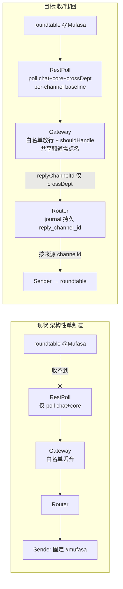

# Plan: Codex Lead 跨部门频道参与(#leads-roundtable)— 收 / 判 / 回

**Version**: v1.45.0
**Issue**: FLY-267
**Date**: 2026-06-14
**Source**: `/tmp/fly-265-companion-inbound-scope.md`(FLY-265 只读根因审计),Linear FLY-267
**Status**: codex-approved
**Review**: Codex design review R1 CHANGES REQUESTED(7 项,4 HIGH/2 MED/1 LOW)→ 本稿逐条吸收(见 §11);**R2 APPROVED**(7 项修法全验证 sound,无残留/新问题)

---

## 1. 背景 / 问题

Annie 要求所有 Lead 都在 `#leads-roundtable`(`1512578695468941333`)。审计 FLY-265 发现:Mufasa(growth,**Codex Lead**)早已是该频道成员且在线,但 **被 @ 点名从不回话**(6/5 Asha @Mufasa、6/12 Annie @Mufasa 两次实证零回复,而 dept Lead 都秒回)。

**根因不是 Discord 成员 / 权限,也不是配置,而是 Codex Lead backend(FLY-224 新建)架构性单频道 —— 跨部门 roundtable 参与能力从来没造。** Belle 走 Claude 插件路径,配置层已对,不受此 bug 影响(其 live 验证留在 FLY-265)。

> 注:本 issue 与"Mufasa 进程当前 down"是两码事(那是运行时事故,单独处理)。这里修的是即便进程健康、Mufasa 也结构性进不了 roundtable 的代码缺口。
>
> **关键事实(决定范围)**:Mufasa 跑 **direct 出站模式**(`FLYWHEEL_CODEX_LEAD_OUTBOUND` 未设,默认 direct)—— 用自己的 bot token 直发 Discord,**不经 Bridge `/api/lead-outbound/send` 授权**。所以本 issue 的验收路径(Mufasa)走 direct,bridge 模式相关项见 §3.5/§9。

## 2. 现状审计(缺口,src 与生产 dist 逐条对得上)

### 缺口 1:入站频道清单漏跨部门频道(主因)
`codex-lead-runtime.ts:286`:`channelIds = [chatChannelId, ...(coreChannelId ? [coreChannelId] : [])]`。roundtable 永不在列表 → ① `RestPollDiscordInboundSource`(`:96,155`)只拉列表里的频道 → @ 收都收不到;② `CodexDiscordGateway.passesFilters`(`CodexDiscordGateway.ts:144`)白名单再丢一次。

### 缺口 2:无"被点名才回"的 mention-gating
网关构造(headless `codex-lead-runtime.ts:880`,**TUI `codex-lead-tui-runtime.ts:457`**)均未传 `shouldHandle` → 共享频道每条都回 = 刷屏。`CodexDiscordGateway` 已留 `shouldHandle?(msg)` 钩子(`:61,150`,已单测)未用。

### 缺口 3:出站频道写死 chat
headless `codex-lead-runtime.ts:768-780` + **TUI `codex-lead-tui-runtime.ts:390-402`** 两处 sender 都用 `channelId: config.chatChannelId`。**且当前**:core 频道来的消息,回复也是发到 chat 频道(sender 固定)—— 这是**现状行为**,byte-compat 必须保留(见 §3.3 finding-1 修正)。

### 数据流(现状 vs 目标)


## 3. 设计(收 / 判 / 回)

### 3.1 收 — 跨部门频道并入入站 channelIds
`parseCodexLeadRuntimeConfig`(`codex-lead-runtime.ts`):新增 env `FLYWHEEL_LEAD_CROSS_DEPT_CHANNEL_IDS`(逗号分隔)。

```ts
const baseChannels = [chatChannelId, ...(coreChannelId ? [coreChannelId] : [])];
const crossDeptRaw = (env.FLYWHEEL_LEAD_CROSS_DEPT_CHANNEL_IDS ?? "")
  .split(",").map((s) => s.trim()).filter(Boolean);
// 去重 + 排除已在 base 里的(chat/core 频道绝不进 crossDept,不被 mention-gate)
const crossSeen = new Set<string>();
const crossDeptChannelIds: string[] = [];
for (const id of crossDeptRaw) {
  if (baseChannels.includes(id) || crossSeen.has(id)) continue;
  crossSeen.add(id); crossDeptChannelIds.push(id);
}
// finding-1:crossDept 为空时,channelIds 与现状逐字一致(不用 new Set() 包裹 base,避免重排/去重 base)
const channelIds = baseChannels.slice();
for (const id of crossDeptChannelIds) channelIds.push(id);
```
新增 config 字段:`crossDeptChannelIds: string[]`、`mentionPatterns: string[]`(§3.2)。

### 3.2 判 — 共享频道 mention-gating
新文件 `mention-gate.ts`(纯函数):

```ts
import type { DiscordInboundMessage } from "./CodexDiscordGateway.js";

export interface MentionGateOptions {
  botUserId: string;
  sharedChannelIds: Iterable<string>;
  mentionPatterns?: string[];
}

function compilePatterns(patterns?: string[]): RegExp[] {
  const out: RegExp[] = [];
  for (const p of patterns ?? []) { try { out.push(new RegExp(p, "i")); } catch {} }
  return out;
}

/** 是否点名本 Lead。finding-6:名字正则只对【非 bot 作者】生效;
 * 精确 mention id(<@id>/mentions 数组)对所有作者(含 sibling bot)都认。
 * 自己的 bot 消息早被网关 echo-immunity 丢掉,不会到这。 */
export function isMentioned(
  msg: DiscordInboundMessage, botUserId: string, compiled: RegExp[],
): boolean {
  if (msg.mentions?.includes(botUserId)) return true;                       // ① Discord mentions 数组
  const c = msg.content;
  if (c.includes(`<@${botUserId}>`) || c.includes(`<@!${botUserId}>`)) return true; // ② content mention token
  if (!msg.authorBot) {                                                     // ③ 名字正则:仅非 bot 作者
    for (const re of compiled) if (re.test(c)) return true;
  }
  return false;
}

export function buildMentionGate(opts: MentionGateOptions): (m: DiscordInboundMessage) => boolean {
  const shared = new Set(opts.sharedChannelIds);
  const compiled = compilePatterns(opts.mentionPatterns);
  return (msg) => (!shared.has(msg.channelId) ? true : isMentioned(msg, opts.botUserId, compiled));
}
```

- `CodexDiscordGateway.ts`:`DiscordInboundMessage` 加 `mentions?: string[]`。
- `RestPollDiscordInboundSource.ts`:`RawDiscordMessage` 加 `mentions?: Array<{ id?: string }>`;`deliver()` 映射 `mentions: (m.mentions ?? []).map(u => u.id).filter((id): id is string => Boolean(id))`。
- **两个 runtime** 的 `wire()`(headless + TUI,finding-2)都接 `shouldHandle`:
```ts
const shouldHandle = config.crossDeptChannelIds.length > 0
  ? buildMentionGate({ botUserId: config.botUserId,
      sharedChannelIds: config.crossDeptChannelIds, mentionPatterns: config.mentionPatterns })
  : undefined; // 无 crossDept → 不传 → 字节兼容
const gateway = new CodexDiscordGateway({ source, router, botUserId: config.botUserId,
  channelIds: config.channelIds, ...(shouldHandle ? { shouldHandle } : {}) });
```

mention pattern env `FLYWHEEL_LEAD_MENTION_PATTERNS`(逗号分隔正则,可选)。**默认不设 → 只认精确 mention id**。Mufasa 首发**不设**(finding-6:名字正则即便设了也只对非 bot 作者,sibling bot 用精确 @ 仍可触发,杜绝"一个 Lead 文本里出现 Mufasa 触发另一个"的回环)。

> **parity 范围(finding-7)**:本 issue 只支持**显式点名**(精确 mention id + 可选名字正则)。Claude 插件还把"回复 bot 自己的消息"当隐式点名(靠 `recentSentIds`/`fetchReference`)—— REST poll 路径要追踪自己发出的 message id 才能做,**本 issue 明确不做**(留 follow-up,见 §9)。

### 3.3 回 — 出站按来源频道路由(finding-1 修正:仅 crossDept 路由)
**finding-1(byte-compat 关键)**:今天 core 频道来的消息,回复发到 chat(sender 固定)。若无条件给每条 discord 输入挂 `channelId` 并覆盖 sender,core 回复会从 chat 挪到 core = 行为变了。**修正**:用 `replyChannelId`(语义=回哪个频道),**只在入站频道 ∈ crossDept 集时**才设;chat/core 输入保持 route-less → sender 回落构造时 chat 频道 = 与现状逐字一致。

链路:
- 网关加可选 `resolveReplyChannelId?(msg): string | undefined`,`handle()` 里 `replyChannelId: this.resolveReplyChannelId?.(msg)`。runtime wire() 仅在 crossDept 非空时传:`resolveReplyChannelId = (m) => crossSet.has(m.channelId) ? m.channelId : undefined`。无 crossDept → 不传 → `replyChannelId` 恒 undefined → 字节兼容。
- `LeadInput` 加 `replyChannelId?: string`;`OutboundSender.enqueue` 加可选 `channelId?: string`。
- `submit()` 透传;`processEntry()` 从 entry 读 `replyChannelId` → `deliverOutput(id, output, entry.replyChannelId)` → `sender.enqueue({ ..., channelId })`。
- 恢复路径同样带 `entry.replyChannelId`(见 §3.6)。

**持久化(为什么进 journal)**:Mufasa 走 direct 模式,`DirectDiscordOutboundSender` 的 outbox 是进程内存态(重启即失);崩溃恢复唯一真相是持久 journal。`model_completed` 恢复(模型已答、未 enqueue 就崩)重发必须知道回哪个频道,否则误投回 #mufasa。故 `replyChannelId` 落 journal。

- `LeadJournal.ts`:`JournalEntry` 加 `replyChannelId?: string`;`accept(args)` 加该字段写入 candidate(InMemory store `copyEntry` 自动携带)。
- `SqliteJournalStore.ts`:`Row` 加 `reply_channel_id`;`rowToEntry` 读;`CREATE TABLE` 加 `reply_channel_id TEXT`;`migrate()` 幂等 `ADD COLUMN reply_channel_id`(PRAGMA table_info 不含才 ALTER);`insertAccepted` INSERT 加列 + `@replyChannelId`(`entry.replyChannelId ?? null`)。`reply_channel_id` 在 accept 后不可变 → 不进 `transition` 的 COL map。
- `DirectDiscordOutboundSender.ts`:`OutboxEntry` 加 `channelId`;`enqueue` 解析 `args.channelId ?? this.channelId`;`deliver` 发往 `entry.channelId`(undefined 回落 = 字节兼容)。
- `CodexOutboundSender.ts`:`enqueue` 接受 `channelId`,行存 `args.channelId ?? this.channelId`(`deliver` 本就读 `row.channel_id`)。

### 3.4 收(补)— RestPoll per-channel baseline 门(finding-5)
**问题**:`start()` 用全局 `resumedAny`。若 chat 有 saved cursor(resumed)但新加的 roundtable baseline fetch **失败**,`lastSeen` 无 roundtable 项,但 drain 循环照跑;下次 roundtable poll 无 `after` → 拉回最多 50 条历史 → 6/5、6/12 的旧 @Mufasa 被**重放**触发迟到回复。部署窗高发。

**修**:per-channel 初始化追踪。
- 新增 `private readonly ready = new Set<string>()`(已 resume 或已成功 baseline 的频道)。
- `start()`:resume 的频道直接进 `ready`;baseline 成功的进 `ready`;**baseline 失败的不进** `ready`。
- `pollOnce()`:跳过 `!ready` 的频道;对未 ready 频道**先尝试 baseline**(取 latest、设 lastSeen、进 ready、**不投递**),成功后下一轮才用 `after` 正常拉。
- drain 循环只对 ready 频道有效;一个 baseline 持续失败的频道永远停在 baseline-only(绝不无 `after` 拉历史)。

### 3.5 回(补)— bridge 模式授权守卫(finding-3)
`buildAuthorizeLeadChannel`(`codexLeadBridgeWiring.ts:125-143`)只授权每 Lead 的 `chatChannel` + 项目 `generalChannel`。roundtable 两者都不是 → bridge 模式回复会被 `CodexLeadOutboundHandler` 判 403 → router 标 ambiguous。

**决策(范围纪律)**:Mufasa 走 **direct**,direct 自己 bot token 直发、**不经此授权**,验收路径不受影响。bridge 模式的 server 端共享频道授权**需 server-owned config**(projects.json/config.yaml),不能靠 Bridge 看不到的 per-Lead runtime env(Codex 明确反对)—— 这是独立的 config 管线改动。本 issue **不扩到 server 授权**,改为**配置守卫 fail-loud**:`parseCodexLeadRuntimeConfig` 若 `crossDeptChannelIds` 非空且 `outboundMode === "bridge"` → 抛错(明确指向 follow-up issue:"cross-dept channels currently require direct outbound mode; bridge-side shared-channel authorization is FLY-XXX")。杜绝静默 403 footgun;direct(Mufasa)全功能可用。bridge+crossDept 真要用时,走 follow-up 实现 server 授权(§9)。

### 3.6 回(补)— 崩溃恢复诚实边界(finding-4)
- `model_completed` 恢复:journal 已存 `replyChannelId` → `deliverOutput` 重新 enqueue 时带上 → 路由正确。✓
- reconcile completed 恢复:同样带 `entry.replyChannelId`。✓
- `output_pending` 恢复:`recoverEntry` 调 `sender.deliver(entry.outboxId)`。**direct 模式 outbox 是内存态,重启后该 outboxId 不存在 → 抛 `no outbox` → ambiguous。这是 FLY-224 起就有的预存在限制,对【所有】direct 回复(含 chat)一视同仁,FLY-267 不引入、不加重**;routed 回复在此窗口的行为与 chat 回复**完全相同**。彻底修(direct 持久 outbox 或强制 cross-channel 走 durable bridge 路径)是正交 follow-up(§9),不在本 issue。
- 诚实声明:本 issue 的 hard-constraint = "不回归现有恢复语义" —— 满足(model_completed 现在路由更准;output_pending 与今日逐字相同)。

### 3.7 dryRunReport 可审计(finding-7)
`dryRunReport()` 增行:`cross-dept   : <ids 或 (none)>`、`mention policy: <patterns 或 "bot-id mention only">`、`shared gating: <on/off>`,让重启前能审配置。

## 4. 配置 / Env(新增,全部可选 → 不设零行为变化)

| Env | 含义 | 默认 |
|-----|------|------|
| `FLYWHEEL_LEAD_CROSS_DEPT_CHANNEL_IDS` | 逗号分隔跨部门/共享频道 id | 空 |
| `FLYWHEEL_LEAD_MENTION_PATTERNS` | 逗号分隔名字正则(仅对非 bot 作者) | 空(仅精确 mention id) |

Mufasa 部署值:`FLYWHEEL_LEAD_CROSS_DEPT_CHANNEL_IDS=1512578695468941333`(mention pattern 首发不设)。**direct 模式**(现状),不触发 §3.5 守卫。

## 5. 字节兼容论证

- 两个 env 不设:`crossDeptChannelIds=[]` → `channelIds=[chat,...core]`(base 数组原样,无 Set 重排)、`shouldHandle` 不传、`resolveReplyChannelId` 不传 → `replyChannelId` 恒 undefined → enqueue 回落 chat。
- **finding-1 关键**:core 频道消息今天答在 chat;新代码 core 不在 crossDept → route-less → 仍答 chat(逐字一致)。新增 sentinel 测:无 env、core 输入 → 回 chat + journal `reply_channel_id` 为 null。
- `mailbox` 源无 replyChannelId → 回落 chat(现状一致)。
- journal `reply_channel_id` nullable + 幂等迁移;旧 DB/旧行为 null → 回落 chat。
- 已有 fake sender/message 用可选字段 → 旧测试不传仍通过。

## 6. 测试计划(TDD)

**收**(`codex-lead-runtime.test.ts`):crossDept 并入 channelIds + 去重 + 排除 base;**无 env 时 channelIds 与现状逐字一致**(byte-compat sentinel);crossDept 与 chat/core 重叠被排除。bridge+crossDept → parse 抛错(finding-3 守卫)。
**判**(新 `mention-gate.test.ts`):shared+`<@id>`/`<@!id>`/mentions 数组/名字正则(非 bot)→ handle;shared 无点名 → drop;**bot 作者名字正则不触发,但 bot 精确 @ 触发**(finding-6);chat/core 任意 → handle;非法正则跳过。网关层(`CodexDiscordGateway.test.ts`):shouldHandle 在 echo/白名单/空内容之后。RestPoll(`RestPollDiscordInboundSource.test.ts`):`mentions[].id` 映射;**新频道首次 baseline 失败 → 不重放历史**(混合 1 resumed + 1 新频道 baseline 失败,finding-5)。
**回**:router(`LeadInputRouter.test.ts`)submit 带 replyChannelId → enqueue 收到;chat/无 → undefined。journal(`LeadJournal/SqliteJournalStore.test.ts`)accept 存 reply_channel_id;sqlite 往返;**同一旧 DB 开两次证迁移幂等**(finding-7)。DirectSender:带 channelId→发该频道;不带→回落。CodexSender:行 channel_id 跟随。**恢复**:model_completed 带 replyChannelId → 重发到该频道;reconcile-completed 同;**(finding-4)显式测 direct output_pending 重启 = ambiguous(记录预存在行为,不算回归)**。
**TUI**(`codex-lead-tui-runtime` 测,finding-2):TUI wire 接 shouldHandle;crossDept 配置下 TUI 行为与 headless 一致;无 env 不回归。

命令:`pnpm --filter flywheel-teamlead test`(finding-7:包名是 `flywheel-teamlead`,非 `@flywheel/teamlead`)。

## 7. 部署(team-lead / Annie 执行,worker 不碰生产)

1. `pnpm -r build`。
2. Mufasa launchd wrapper 加 `FLYWHEEL_LEAD_CROSS_DEPT_CHANNEL_IDS=1512578695468941333`(**direct 模式**,不设 mention pattern)。
3. 重启 Mufasa Codex Lead(boot 读配置)。
4. **绝不碰** `~/.codex-mufasa` / 生产 Bridge / 其他 prod Lead。
> 部署效果由独立 QA 验:roundtable 被 @ 能回 + 回复落 roundtable + 未点名静默 + #mufasa 零回归。

## 8. 风险 / 边界

- **bot-to-bot 回环**:sibling Lead(bot)可精确 @ Mufasa(合法);名字正则仅非 bot 作者(finding-6)+ echo-immunity → 不自放大。
- **mention 误触**:默认仅精确 mention id;名字正则 opt-in 且限非 bot。
- **journal 迁移**:nullable 列 + 幂等 ADD COLUMN,旧 DB 安全。
- **bridge 模式**:cross-dept 暂只支持 direct;bridge 组合 fail-loud(§3.5)。

## 9. Out of scope(留在别处)

- **GAP A**:dept Lead access.json `allowBots` 补 companion → **FLY-265**(脚本已备)。
- **Belle live 验证** → **FLY-265**。
- **Mufasa 进程 down** → 运行时事故。
- **bridge 模式 server 端共享频道授权**(`buildAuthorizeLeadChannel` 读 server-owned config)→ follow-up issue(本 issue fail-loud 守卫,Mufasa direct 不需要)。
- **direct 持久 outbox / cross-channel 强制走 durable bridge**(根治 output_pending direct 恢复)→ 正交 follow-up(预存在,非 FLY-267 回归)。
- **隐式点名(回复 bot 自己消息)** → follow-up(需 REST poll 追踪己方 message id)。

## 10. 改动文件清单

| 文件 | 改动 |
|------|------|
| `codex-lead-runtime.ts` | parse 新 env + base 数组保序 + crossDept/mentionPatterns config + bridge 守卫;wire 接 shouldHandle + resolveReplyChannelId;dryRunReport |
| `codex-lead-tui-runtime.ts` | wire 接 shouldHandle + resolveReplyChannelId(镜像 headless,finding-2) |
| `mention-gate.ts`(新) | `buildMentionGate` + `isMentioned`(非 bot 名字正则) |
| `CodexDiscordGateway.ts` | `DiscordInboundMessage` + `mentions?`;`resolveReplyChannelId?` 钩子 + handle 设 replyChannelId |
| `RestPollDiscordInboundSource.ts` | raw `mentions` 映射;per-channel baseline `ready` 门(finding-5) |
| `LeadInputRouter.ts` | `LeadInput` + replyChannelId;`OutboundSender.enqueue` + channelId;router 透传 + 恢复路径带 replyChannelId |
| `LeadJournal.ts` | `JournalEntry` + replyChannelId;accept 存 |
| `SqliteJournalStore.ts` | `reply_channel_id` 列 + 幂等迁移 + insert/read |
| `DirectDiscordOutboundSender.ts` | per-message channelId 路由 |
| `CodexOutboundSender.ts` | enqueue 接受 channelId override |
| 对应 `__tests__/*` | 收/判/回 + TUI + 恢复 + 迁移幂等 + baseline 重放 单测 |

## 11. Round 1 review 处置(Codex CHANGES REQUESTED → 全采纳/部分采纳)

1. **[HIGH] 无条件 source-channel 破坏 unset-env 行为** → 采纳:改 `replyChannelId` 仅 crossDept 设;base 数组保序;sentinel 测 core 无 env 仍回 chat + 存 null。
2. **[HIGH] TUI runtime 也得改** → 采纳:headless + TUI 两处 wire 同接 shouldHandle + resolveReplyChannelId(路由类共享,改动小);加 TUI 回归测。
3. **[HIGH] bridge 模式 403** → 部分采纳:Mufasa direct 不受影响;bridge+crossDept fail-loud 守卫(不靠 Bridge 看不到的 env);server 授权 = follow-up。
4. **[HIGH] direct output_pending 恢复** → 部分采纳:这是预存在限制(影响所有 direct 回复),FLY-267 不回归;诚实文档 + 显式测;根治 = 正交 follow-up。
5. **[MED] baseline 失败重放旧 @** → 采纳:per-channel `ready` 门,未 baseline 频道不无-`after` 拉历史;混合测。
6. **[MED] 名字正则重开 bot 回环** → 采纳:名字正则仅非 bot 作者,bot 精确 @ 仍认;Mufasa 首发不设;三向测。
7. **[LOW] 校验/parity 细节** → 采纳:包名 `flywheel-teamlead`;显式点名 only(隐式回复 follow-up);dryRunReport 增配置行;迁移幂等测。
