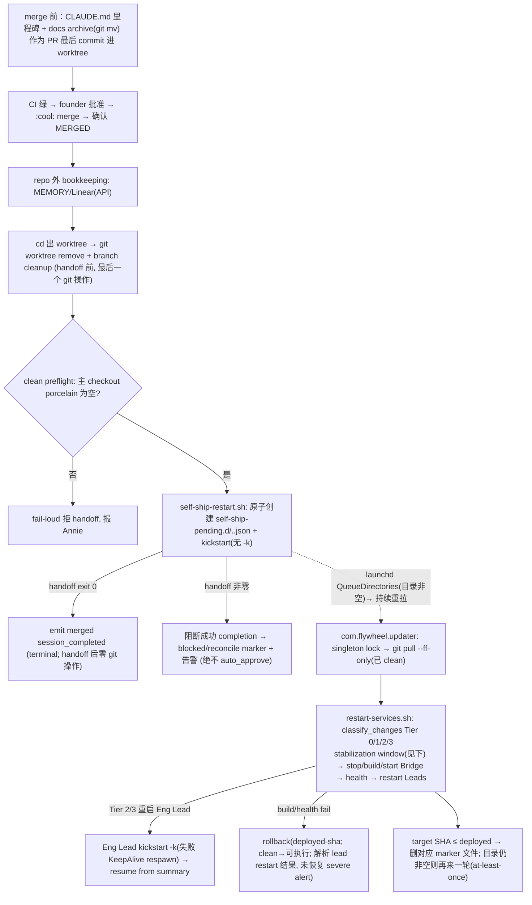

# Plan: 把 Flywheel 自己 onboard 进 Flywheel — 两层 Flywheel 团队（CoS Aunt Cass + Eng Lead Tadashi）+ Level 2 + self-hosting ship 边界

**Version**: v1.47.0（tentative — held PR 栈较多，ship 时按 FLY-217 教训 re-version）
**Issue**: FLY-270
**Date**: 2026-06-15
**Source**: `doc/engineer/exploration/new/FLY-270-self-onboard.md`、`doc/engineer/research/new/FLY-270-self-onboard.md`；复用模板 `doc/engineer/plan/draft/FLY-189-onboard-joycon-typeless.md` + `FLY-190-onboard-sub.md`（joycon/sub 已上线）
**Status**: **codex-design-approved（5 轮）+ 实现 + code-review APPROVED（2 轮 11 finding）+ qa FINAL PASS**；**2026-06-15 Annie 拍板升级两层架构（CoS Aunt Cass + Eng Lead Tadashi）—— 控制平面代码冻结不变（已 FINAL PASS），仅扩 onboard 物料（两份 identity + projects.json 两 lead + 双频道 + CoS wiring），物料改动过 Codex review**。设计史：design R1 7项→R5 APPROVED（self-surgery 重启边界 5 轮对抗收敛，Codex 真跑 FLY-231 8/8 + git squash 实验）；code-review R1 6 + R2 5 finding 全修；qa-fly-270 FINAL PASS（53 测 + 62 回归 + E2E 12 + Discord-spam hermetic 修复）。
**Author**: worker-fly-270

> ⚠️ **DESIGN + 物料 ONLY**。本计划**不执行**任何真生产 onboard：不编辑活的 `~/.flywheel/projects.json`、不建 Discord bot、不装 launchd、不重启 Bridge/任何 Lead。所有物料只在 worktree + PR 里交付。真上线 = Annie 的 deploy 闸（QA 过后她拍）。
> brainstorm 已由 Annie 锁定（FLY-270），**不重新 brainstorm**。

---

## 0. 背景、目标、已锁决策、假设

### 0.1 目标
用 Flywheel 自己继续开发 Flywheel（dogfooding / self-hosting）。给 flywheel repo（`~/Dev/flywheel`、`xrliAnnie/flywheel`）配一个**两层 Flywheel 团队** —— CoS **Aunt Cass**（triage/路由/汇报）+ Eng Lead **Tadashi**（开 Runner 执行）+ **Level 2 完整流水线**（FLY issue → CoS triage → Eng Lead 开 Runner → 自动 PR），让 Annie 在 Discord 驱动 Flywheel 改进自己。镜像 GeoForge3D 的 Simba(CoS)+Peter(dept)。

### 0.2 Annie 已锁的决策（直接采用，不再问）

| # | 决策 | 取值 |
|---|------|------|
| 1 | **两层架构** | **CoS = Aunt Cass**（新建专属，镜像 Simba）：`#flywheel-core`、`canSpawnRunners:false`、triage Flywheel issue + 路由给 Tadashi + 向 Annie 汇报。**Eng Lead = Tadashi**（镜像 Peter）：`#flywheel-product`、`canSpawnRunners:true`、接 Aunt Cass 派的活 + 开 Runner。主题 Big Hero 6（Tadashi + Aunt Cass 姨甥）。 |
| 2 | 接入深度 | **Level 2 全流水线**（FLY issue → Runner → auto PR），Tadashi `canSpawnRunners:true`。 |
| 3 | 频道 | **双频道部门化**：Flywheel Core（Aunt Cass，= generalChannel）+ Flywheel Product（Tadashi）。 |
| 4 | label | **两个**：Tadashi run-start scope = **`Flywheel`**（FLY-127 硬闸）；Aunt Cass CoS triage = 专属 **`Flywheel-Triage`**（不复用 PM，team-lead 拍）。Aunt Cass triage Flywheel-labeled → 派 Tadashi。 |
| 5 | 自治级别 | 起步 ≈ **提案制**（Aunt Cass 扫 FLY backlog → 提候选 → 跟 Annie 定 → 派 Tadashi），逐步自治。`autonomy_level: advisor`。 |
| 6 | 边界 | **Simba 保持只管 GeoForge3D，别碰 Flywheel**；反之亦然。 |
| 7 | ship 风险 | Annie **接受** self-hosting 风险，兜底 = 真出事开独立 terminal 救。**倾向越自动越好**。 |

### 0.3 team-lead 带来的定向确认（2026-06-15）
- **核心新设计 = "merge 后协调者自我重启的存活"，不是 merge 授权**（merge auth 已被 FLY-175/245 管死，不重造）。
- ship 边界：往全自动靠、必要时 hybrid，带去 Codex 当对手方专攻"自我手术"失败面。**最终取 Method B（一律 detached handoff，分档复用 `restart-services.sh::classify_changes()` 单一真相）**（codex R1/R2 论证 B 失败面更小，全文统一为 B）。
- **专属 scope label**，不复用 `Product`（避免 Peter 跨线误调）。
- **人格名留候选给 Annie**，不擅自定。

### 0.4 假设（实现前显式列出，请校正）
- **A1**：两个 lead（Aunt Cass + Tadashi）都是 **Claude Lead**（`model` 随 fleet，默认 opus），**不是** write-capable Codex Lead → merge/ship 授权走现成 Claude 路径（`founder-only-authority` Track 1 + `approve_to_ship` + `verify-approval`），FLY-245 闸不涉入。
- **A2**：两个 lead 的 `projectDir` = `~/Dev/flywheel` 主 checkout（**不**像 joycon 用单独 worktree）—— 因为主 checkout 本就是 CD 维护的干净 main。Runner worktree（Tadashi 起）由 **FLY-95 `WorktreeManager`（无 `baseDir`）**建在主 repo 的 **sibling**：`~/Dev/flywheel-<ISSUE>`（如 `~/Dev/flywheel-FLY-270`，实读 `WorktreeManager.ts:85-103` + `run-infra.ts:426` 确认 —— **不是** `~/Dev/flywheel/worktrees/<execId>`，research §3 此处已被 Codex R1#7 纠正）。sibling 形态对 self-hosting 反而更干净：worktree 不污染主 checkout，CD 的主 checkout cleanliness 天然保住。Lead 进程各跑在 `LEAD_WORKSPACE=~/.flywheel/lead-workspace/<leadId>`（claude-lead.sh 默认隔离 workspace，FLY-189 A2 已确认），不在 repo 目录树下。
- **A3**：projectName = `flywheel`（= 目录 basename = config.yaml `project:` = comm.db key = Runner worktree 根，三处一致）。
- **A4**：可自动化工作面 = TypeScript/脚本工程 + 文档 + 测试。**需真机/物理验证的**（Discord 真聊 E2E、cmux UI、launchd 真重启效果）仍是 Annie/独立 QA 的手动 gate —— executor 不能假绿（同 FLY-189 §2.1 诚实边界）。
- **A5**：本计划交付 onboard **物料**；真 cutover（写 live projects.json、建 bot、装 launchd、首次重启 Bridge）是 Annie 的 deploy 闸。

---

## 1. 复用 FLY-189/190 onboard 机制（不重复审计，列 flywheel 的确切 shape）

机制本身（三套配置 + launch 链、`ProjectConfig.loadProjects()` 硬校验、`ConfigLoader.validate()`、claude-lead.sh copy identity、manifest 自动写、FLY-127 label 硬闸、不建 `.lead/shared/` 单文件、首次手动 launch 生成 manifest）已由 FLY-189/190 审计透并上线，**直接复用**。下面只列 flywheel 与它们的差异 shape。

### 1.1 `~/.flywheel/projects.json` 新增条目（draft，**两层** —— 镜像 GeoForge3D 一项目多 lead；**真正写进 live 文件 = Annie cutover §3 Group B**，worker 不写）

> **两层架构（Annie 拍板）**：Flywheel = 一个 ProjectEntry（projectName `flywheel`），**两个 lead** —— CoS **Aunt Cass**（triage/路由/汇报，不开 Runner）+ Eng Lead **Tadashi**（接活/开 Runner）。镜像 GeoForge3D 的 Simba(cos)+Peter(dept)。`Flywheel` 是面向用户的品牌（频道/label），repo/projectName 仍 `flywheel`。**Simba 只管 GeoForge3D，与 Flywheel 互不越界。**

```jsonc
{
  "projectName": "flywheel",
  "projectRoot": "/Users/xiaorongli/Dev/flywheel",
  "projectRepo": "xrliAnnie/flywheel",
  "memoryAllowedUsers": ["annie", "flywheel-cos-lead", "flywheel-eng-lead", "flywheel"],
  "leads": [
    {
      "agentId": "flywheel-cos-lead",          // Aunt Cass (CoS)
      "chatChannel": "1516209289406971965",
      "match": { "labels": ["Flywheel-Triage"] },  // dedicated CoS triage label, NOT "PM" (avoid GeoForge3D cross-line). NOTE: PM/Triage validator matches EXACT "pm"/"triage" only, so "Flywheel-Triage" is NOT auto-enforced — canSpawnRunners:false here is set explicitly + intentionally.
      "botTokenEnv": "CASS_BOT_TOKEN",
      "canSpawnRunners": false,
      "alertFallbackToCore": true
    },
    {
      "agentId": "flywheel-eng-lead",          // Tadashi (Eng Lead)
      "chatChannel": "1516209714097291335",
      "match": { "labels": ["Flywheel"] },     // FLY-127 run-start scope label
      "botTokenEnv": "TADASHI_BOT_TOKEN",
      "department": "engineering",
      "canSpawnRunners": true,
      "alertChannel": "1516209714097291335"
    }
  ],
  "generalChannel": "1516209289406971965"   // Flywheel core = Aunt Cass's main channel (project-level)
}
```
- agentIds **全局唯一**（不复用 GeoForge3D `cos-lead`/`product-lead` —— 否则 `~/.claude/channels/discord-<leadId>` + `~/.claude/agents/<leadId>.md` 撞车，FLY-189 教训）→ `flywheel-cos-lead` / `flywheel-eng-lead`。
- **CoS 角色检测（关键 wiring，§3）**：`claude-lead.sh` 的 `IS_COS_ROLE` 只认 `FLYWHEEL_LEAD_ROLE=cos` 或 `LEAD_ID=="cos-lead"`（字面）。`flywheel-cos-lead` ≠ `cos-lead` → **Aunt Cass 的 launchd plist 必须设 `FLYWHEEL_LEAD_ROLE=cos`**，否则会加载 dept-lead 规则而非 `cos-lead-rules.md`。**纯 plist/cutover 物料，不改控制平面代码。**
- `match`：Tadashi `["Flywheel"]`（每个交 Runner 的 FLY issue 必带此 label，FLY-127 硬闸）；Aunt Cass `["Flywheel-Triage"]`（专属 CoS triage label，team-lead 拍：不复用 `PM` 避 GeoForge3D 跨线）。**注**：PM/Triage 硬闸（`ProjectConfig.ts:440-452`）只精确匹配 `pm`/`triage`（`PM_LABELS.includes(lower)`），`Flywheel-Triage` **不**触发它 → `canSpawnRunners:false` 是**显式设定**（不是硬闸强制），已实测 `parseAndValidateProjects` 接受。她不开 Runner，靠 `queryLinearIssues` 按 `project=Flywheel`+`Flywheel` label 过滤来 triage，不靠 match.labels。

### 1.2 `<repo>/.flywheel/config.yaml`（新建）
照 FLY-189 草案，`team_id: FLY`（schema 强制非空但运行期不读，FLY-189 §1.4 已 trace）。`decision_layer.autonomy_level: advisor` + `escalation_channel: discord`。checkpoints：`brainstorm`（fail-close）+ `question`（fail-open）+ `approve_to_ship`（fail-close）。executor 见 §5。

### 1.3 `.lead/{flywheel-cos-lead,flywheel-eng-lead}/identity.md`（两份，照 Simba+Peter，§4 详述）
两份 identity，frontmatter 同 GeoForge3D（`model:` fleet 决定、`memory: user`、`disallowedTools: Write, Edit, MultiEdit, Agent, NotebookEdit`、`permissionMode: bypassPermissions`）。**单 Lead 项目不建 `.lead/shared/`**（FLY-189 §3.5：shared/ 存在则强制 common+department 两文件，否则 launch fail）—— 两层共享层靠 claude-lead.sh 自动加载的 base 规则（Aunt Cass=cos-lead-rules，Tadashi=department-lead-rules）。memory 共享桶 `user_id=flywheel`，私有桶各自 agentId。差异点见 §4。

### 1.4 launchd plist + manifest（两份）
两个 plist（照 GeoForge3D Simba+Peter）：
- `com.flywheel.lead.flywheel-flywheel-cos-lead.plist`（Aunt Cass）—— **`EnvironmentVariables` 必含 `FLYWHEEL_LEAD_ROLE=cos`**（§1.1：agentId 非字面 `cos-lead`，靠此 env 让 claude-lead.sh 走 CoS 规则路径）。⚠️ **`flywheel-daemon.sh install` 只写 `FLYWHEEL_LEAD_MODEL`、不写此 env**（materials-review R1 HIGH）→ install 后必须手动 patch plist 加 `FLYWHEEL_LEAD_ROLE=cos` + reload + `launchctl print … | grep FLYWHEEL_LEAD_ROLE` 验，见 §3 Group B #6b。**绝不放全局 `.env`**（会泄漏给 Tadashi）。
- `com.flywheel.lead.flywheel-flywheel-eng-lead.plist`（Tadashi）—— `EnvironmentVariables.FLYWHEEL_LEAD_MODEL`（fleet）。
两者 `KeepAlive=true`/`RunAtLoad=true`、ProgramArguments=`/bin/bash <wrapper> <manifest>`。manifest 各自首次手动 claude-lead.sh 生成（projectDir=`~/Dev/flywheel`、workspace=`~/.flywheel/lead-workspace/<leadId>`）。**KeepAlive 是 §2 self-surgery 存活的关键。**

### 1.5 Discord bot + 频道（两 bot）
`/setup-discord-lead flywheel-cos-lead "Flywheel Chief of Staff"`（Aunt Cass）+ `/setup-discord-lead flywheel-eng-lead "Flywheel Engineering Lead"`（Tadashi）（school 账号）→ token 写 `~/.flywheel/.env` 的 `CASS_BOT_TOKEN` / `TADASHI_BOT_TOKEN` → 邀请权限 `277025459264`（非 Admin）到 guild `1485787271192907816` → state dir `~/.claude/channels/discord-flywheel-cos-lead/` + `discord-flywheel-eng-lead/`（各 `access.json` dmPolicy=pairing、allowFrom=Annie、groups=本 Lead 频道）。频道拓扑见 §4.2。

### 1.6 prefix（无需改）
flywheel issue 是 `FLY-*`，`claude-lead.sh:184` 默认 `TEAMLEAD_ISSUE_PREFIXES=FLY,GEO` 已含 FLY → **无需像 joycon 加 LEARN**。✓

---

## 2. ★ 核心设计：self-hosting ship / 重启安全边界

> 这是 FLY-270 唯一真正新的设计，也是 codex-design-review 的重心。research §4 已 trace 通触发链与风险，本节给**落地设计**。

### 2.1 风险的精确形状（research §4 收敛后的纠正版）

CD（`spin.md` Step 3.4 / `orchestrator.md` B2 → `scripts/restart-services.sh`，**只在 main repo 是 flywheel 时** inline 触发）按 merge diff `classify_changes()` 决定重启范围。**"杀掉协调者 Eng Lead" 的面比想象窄**（实读 `restart-services.sh:447-484`）：

| merge diff 命中 | restart_bridge | restart_all_leads | 对 Eng Lead（协调者）的影响 |
|---|---|---|---|
| `doc/* tests/* .claude/* *.md` | ✗ | ✗ | 无（仅推进 deployed-sha）= **Tier 0** |
| `packages/teamlead/src/bridge/*` 等纯 Bridge | ✓ | ✗ | Bridge 重启，**Lead 不重启**（仅 curl 短暂失败重试）= **Tier 1** |
| `lead-rules-base/* · claude-lead.sh · post-compact*` | ✗ | ✓ | **Eng Lead 被 kickstart 重启**（无 idle-wait，无 Bridge 停）= **Tier 2** |
| `flywheel-comm/* · package.json · pnpm-lock · pnpm-workspace` | ✓ | ✓ (+install) | **Bridge + Eng Lead 同时重启**（含 idle-wait）= **Tier 3（最危险）** |

两个 self-surgery 死穴只在 **restart_bridge=true（Tier 1/3）** 出现：
1. **self-restart 死锁**：inline 路径下触发重启的 Runner 自己仍是 active session（`session_completed` 在 spin Step 3.7、晚于 Step 3.4）。`wait_for_idle()`（`restart-services.sh:530`）等 `sessions_count==0` → 数到自己 → 等满 `RESTART_MAX_WAIT`（默认 300s）超时才强制重启。
2. **协调者 + 投递链被自己拆**：Bridge 停后，Runner 后续 `session_completed`/bookkeeping 投递失败（落 `complete-failed` marker，靠 stale patrol 对账）；Tier 3 还把 Eng Lead 一起重启。

### 2.2 设计原则：detached handoff + **durable marker + updater singleton lock**（分档逻辑仍留 restart-services.sh 单一真相）

**不让触发 ship 的 Runner inline 跑 `restart-services.sh`**（避开 §2.1 死穴）。改成 Runner 把重启**交棒给 detached 的 `com.flywheel.updater`**（完全独立于 Lead/Runner 的 launchd job），自己落终态退出。`update-flywheel.sh` `git pull --ff-only` 主 checkout 再 delegate `restart-services.sh`，后者 `classify_changes()` + idle-wait + rollback + health-check **已实现 Tier 0–3 全部分档与安全网** → **分档不在 ship 步骤重写**（防漂移）。

**但 R1#1（HIGH）证实 naïve 的 `kickstart -k` handoff 不耐久**（Codex 实查 `launchctl help kickstart`）：
- `com.flywheel.updater` 只有 `StartCalendarInterval`（00:00/12:00），**无 KeepAlive**；`-k` 会**终止正在运行的 updater** → 两次 ship 重叠 / 撞上定时 run 时第二次 kickstart 会拦腰打断第一次（可能停在 `git pull` 半途）。
- `restart.lock.d` 只在 `restart-services.sh` 内取得，**保护不到 `update-flywheel.sh` 的 fetch/pull 阶段**（最易被打断/并发的恰是这段）。
- kickstart 成功只证明 launchd 受理，**不证明 pull/build/restart 成功**（无 durable ack）。

**修正后的 handoff/updater 协议（保留 Method B；R2#1 修正 —— 单 marker 仍有 lost-wakeup，改 launchd `QueueDirectories` 才真 durable）**：

> **R2#1（HIGH）证实单 marker 协议有不可修复的 lost-wakeup**：updater singleton lock 只约束 updater、不约束写 marker 的 Runner。交错：updater 最后一次检查得 `origin/main==deployed-sha` 且 marker 将清 → 新 Runner 写新 marker → 普通 kickstart 见 updater 还在跑→不起第二实例 → 旧 updater 退出 → marker 还在但 **plist 只有 00:00/12:00 calendar trigger，没有任何条件因 marker 存在而重拉 job**（CAS 修不了"final-check 与 process-exit"窗口）。失败路径同理：无 KeepAlive，退出后 retry owner 只剩 12h cron。

**正确设计 = launchd `QueueDirectories`（目录非空就保持/重拉 job，跨越 process-exit 窗口）+ 明确的队列状态机（R3#1）**：

**目录模型（R3#1 写死，否则 blocked/temp/corrupt 会把 QueueDirectories 变永久热循环）**：
- **watched dir = `/Users/xiaorongli/.flywheel/self-ship-pending.d/`**（plist 用**真实绝对路径**，非字面 `~`）—— 只允许**完整、可执行的 `*.json`**。
- **原子入队**：marker 先在 watched dir **之外**写 temp（如 `~/.flywheel/self-ship-tmp/`），完成后 `mv` 进 pending.d（避免 updater 在 JSON 写完前被拉起）。
- **blocked/quarantine = 独立 `~/.flywheel/self-ship-blocked.d/`**（**不被 QueueDirectories 监视**）—— blocked / corrupt / unknown entry 一律 `mv` 到这里，**绝不留在 watched dir**（留下 = launchd 永久重拉 = 热循环）。
- **marker JSON 持久化**：`targetSha`（canonical merge commit，§2.3）、`prNumber`、`attempts`、`nextAttemptAt`、`lastErrorClass`、`createdAt`。`attempts`/`nextAttemptAt` **持久在文件里**（不在 shell 内存）→ 跨 launchd 重拉不重置（否则永远到不了阈值）。
- cutover reload plist 前 `mkdir -m 700` 两个目录。

**协议（保留 Method B）**：
1. **去 destructive `-k`**：handoff 用普通 `launchctl kickstart gui/$UID/com.flywheel.updater`（仅即时催促；durable 性靠 QueueDirectories 不靠 kickstart）。
2. **handoff 原子创建唯一** `<targetSha>.<nonce>.json`（先 temp 后 `mv`，禁覆盖）。
3. **plist 加 `QueueDirectories`**（绝对路径 → `self-ship-pending.d/`）：目录非空时 launchd 保持/重拉 updater（根治 lost-wakeup）；calendar trigger 留兜底。**plist 改动进 §2.6/§3/§8 + reload。**
4. **updater singleton lock（PID+time 戳 + stale recovery）**覆盖 `fetch` 前的 git 阶段；stale（PID 死 / age 超阈值）→ 回收（仿 restart.lock.d 2h 逻辑）。
5. **ack 语义**：只在 marker `targetSha` 已是 deployed SHA 的 ancestor/equal 后才删该文件（并发新增不被旧轮删）。
6. **退避 + 失败分类（持久化）**：**transient（network/fetch）vs deterministic（dirty checkout / 非法 SHA / build·health·lead-restart 反复失败）**分类，每次失败原子更新 `attempts`/`nextAttemptAt`/`lastErrorClass`；达阈值 → `mv` 到 `self-ship-blocked.d/` + severe alert（移出 watched dir 才能让 job 退出，不热循环）。
7. **sleep-until-due 合同（R4#2，QueueDirectories × backoff 的组合语义，不留给实现者二选一）**：当 pending dir **非空但无 due marker** 时，**唯一**持 singleton 的 updater 做 **`sleep(min(nextAttemptAt-now, RESCAN_INTERVAL))`**（`RESCAN_INTERVAL` 有限上限，防队头阻塞 —— R5 LOW#1：等远期 marker 时新入队的 due marker 不会被普通 kickstart 打断，靠周期重扫在一个 interval 内捡起），可被 TERM 中断；醒后重扫 —— **不退出、不 kickstart、不递增 attempt**（"跳过即退出" → dir 非空 → launchd 立刻重拉 → churn）。处理完 due marker 后重算，**直到目录为空才退出**。
   - **singleton stale recovery 校验进程身份（R5 LOW#1）**：回收 stale lock 必须验 owner PID **存活 + 进程身份**（cmdline 匹配 updater），**不能仅凭 age 超阈值**抢走仍存活 updater 的锁。
8. **fail-loud**：handoff 端错误 domain / job 未加载 / disabled → 立即非零退出。

> **plist/temp 路径写死**（R4#2 尾）：plist `QueueDirectories` 用字面 **`/Users/xiaorongli/.flywheel/self-ship-pending.d`**（非 `~`）；temp dir 由 wrapper 以 **`mkdir -m 700`** 创建（`~/.flywheel/self-ship-tmp/`）。

> `scripts/self-ship-restart.sh` 值得单独存在：承载 canonical-SHA 校验 + temp→mv 原子入队 + domain/job 校验 + 可测策略。durable scheduling 由 launchd QueueDirectories 提供，不是 Runner 进程的责任。

### 2.3 落地的 ship 次序（Eng Lead 的 Runner 专用，**单写者 + clean preflight**，R1#2 修正）

> **R1#2（HIGH）+ R1#5（MED）修正**：真实 `spin.md` Step 3 在主 checkout `pull` 后做 CLAUDE.md bookkeeping、Step 3.6 才 commit/push docs（晚于 Step 3.4 handoff）→ updater 启动时主 checkout 必然 dirty；而 `rollback_and_restart()` 对**任何** `git status --porcelain` 非空都拒绝 rollback（不只碰撞）→ 一旦 build/health 失败，rollback fail-closed。且 spin 与 updater 都 pull 主 checkout = 双写者竞争。**修正：主 checkout 单写者 + 所有 tracked bookkeeping 进 PR（worktree，merge 前），不在 merge 后写主 checkout。**

**精确 post-merge 次序（R2#2 写死 —— git 单写者 + handoff fail-close）**。Eng Lead Runner 的 flywheel ship 必须严格按此序，**handoff 之后零 git 操作**（避免与 updater 的 fetch/pull 抢同一 `.git/worktrees` common dir）：

1. CI 绿 → 转达 founder 批准（informed Tier 文案）→ `:cool:` squash merge → 确认 `MERGED`。
2. **取 canonical merge commit SHA（R3#2，关键）**：flywheel 走 **squash merge** → feature worktree HEAD **不是** merge commit 的 ancestor（实验证：`git merge-base --is-ancestor <feature-head> <squash-merge>` 返 1）。**绝不**用 `git rev-parse HEAD` 当 target（否则 marker 永不满足 `target ≤ deployed` → 误判 blocked）。从已验证 landing signal 的 `mergeCommitSha` 或 `gh pr view <PR> --json mergeCommit -q '.mergeCommit.oid'` 取 **40-hex** SHA（Blueprint 已有此 SSOT）；空 / 非-40hex / PR 非 MERGED → **fail-close 不创建 marker**。
3. **repo 外 bookkeeping**：MEMORY.md（repo 外本地）、Linear 状态（API）。（CLAUDE.md 里程碑 + docs archive `git mv` 已在 **merge 前**作为 PR 最后 commit 进 worktree。）
4. **`cd` 出 worktree → `git worktree remove` + branch cleanup**（**必须在 handoff 之前**：改主仓 `.git/worktrees`，handoff 后跑会与 updater fetch/pull 抢 git common dir）。
5. **clean preflight**：主 checkout `git status --porcelain` 为空（否则 fail-loud，拒 handoff，报 Annie）。
6. **self-ship handoff**：`self-ship-restart.sh --target-sha <canonical merge SHA>`（temp→mv 原子入队 marker + kickstart）。
7. **handoff 成功后才** emit merged `session_completed`。**handoff 非零阻断成功 completion** —— 不走 `auto_approve`，改 `blocked` / reconcile marker + 告警；**删 spin.md 的 `|| echo ... non-blocking`**。
8. updater fetch 后**校验 target object 存在且是 `origin/main` 的 ancestor**，否则 `mv` 到 blocked + severe alert（绝不接受 feature HEAD）。
9. **bootstrap**：见 §3 **Bootstrap Phase 0**（R3#3）—— FLY-270 自身首发不能用未部署的新脚本部署自己。



**为什么这样不死**（逐条对 §2.1）：
- **死锁解除（精确版）**：`session_completed` 时 Bridge 在 `/events` 返回前**同步**把 session 转 `completed` → `/health.sessions_count` 不再含该 Runner；handoff 是 **kick-then-complete**，updater 若抢先查 health 最多多等一个 30s poll，不永久自等。
- **stabilization window（不是 completion barrier，R2#4 写死合同）**：`runPostShipFinalization()` 是 fire-and-forget（terminal 后 tmux cleanup/archive 仍在跑）。合同：**health count 首次为 0 后才开始 stabilization，要求连续两次 0（任一非零重置）；此规则仅在 self-ship pending 存在时启用**（不全局改 `wait_for_idle`，避免拖慢其它项目 Bridge deploy）。time grace **不**覆盖非零 active count。这只降低中断 finalization 的概率、**不证明** finalization 完成（故称 stabilization window 不称 barrier）。
- **idle 语义诚实化**：active count = `getActiveSessions()` 含 `running`/`awaiting_review`/`approved_to_ship`。长期 parked 的 `awaiting_review` 会让 updater 等满 `RESTART_MAX_WAIT` 后**强制重启** —— blast radius **显式接受并测试**（§7），保持现状（§6#4 若要改 awaiting_review 阻塞策略再单列决策项）。
- **协调者存活**：bookkeeping 在 merge 前进 PR；Eng Lead 即便 Tier 2/3 重启，靠 **launchd KeepAlive + resume from summary** 拉回（FLY-182/193 frozen 告警已处理）。in-flight ship 终态由 **Bridge StateStore 持久化** → resume 后 `GET /api/sessions?mode=by_identifier` 确认完成。
- **恢复边界诚实**（R1#4）：见 §2.7 runbook —— KeepAlive 只重拉进程，修不了坏 token/manifest/config；rollback 在 dirty checkout 被拒（单写者前提已消除）。

### 2.4 Tadashi identity.md 的 ship 纪律（写进 Lead，informed approval）
- **approve_to_ship gate 必须告知 blast radius**：Eng Lead 发批准 gate 给 Annie 时，先按 `classify_changes` 同款判据估算本 PR 的 Tier（可在 PR diff 上跑一次 `restart-services.sh --dry-run` 取分类），在 gate 文案里写明：「批准将触发 {Tier} 重启（Tier 3 = Bridge + 本 Eng Lead 自身会 blink，自动经 launchd 恢复；真出事你开独立 terminal 救）」。让 Annie 的批准是 informed。
- **merge 仍走现成 founder 闸**（`verify-approval` 重核 CommDB gate + approved_to_ship + prHeadSha）—— 不因 self-hosting 放宽。
- **docs 必须经 PR 提交、不得留在主 checkout 当 untracked**（见 §2.5 gotcha）。

### 2.5 self-hosting gotcha（写进 go/no-go + 纪律）
1. **主 checkout 必须 clean，否则 `git pull --ff-only` 卡 + rollback 被拒**（R1#2 强化）：①untracked 与 incoming tracked 同路径 → pull 报 "untracked working tree files would be overwritten"（Codex git 实验确认）；②`rollback_and_restart()` 对**任何** porcelain 非空都拒 rollback。→ **单写者纪律**：所有 tracked bookkeeping（CLAUDE.md 里程碑 + docs archive `git mv`）**作为 PR 的最后 commit 进 worktree**（`feedback_archive_docs_in_main_pr`），merge 后**不在主 checkout 写任何 tracked 文件**；runtime 产物加 `.gitignore` 或移出 repo。**handoff + updater 都以 `git status --porcelain` 为空作硬 preflight**（不只查碰撞）。MEMORY.md（repo 外本地文件）+ Linear（API）不在此约束。（本计划/research/exploration 三 doc 实现期 `git add` 进 PR，不留主 checkout untracked。）
2. **flywheel 双重身份**（既是 CD 代码仓 deployed-sha 门，又是 projects.json 项目仓有 manifest）：Codex 实读确认 `check_project_lead_changes()` 只把 `project_lead_changed` 合并进**同一个** `restart_all_leads` 布尔 → 最终只调一次 `do_restart_all_leads()`，**不会双重重启**；主 classifier 不识别 repo 内 `.lead/*`，故 project-repo 检测仍必要。**设计无害**，单测固化此不变量（§7）。
3. **FLY-231 cutover 顺序（R1#3 修正，原顺序不可执行）**：Codex 实读 `claude-lead.sh` —— manifest write **之前**有 companion-role query，`projectName+leadId` 不在 live projects.json 精确匹配会 **fail-STOP** → "先 claude-lead.sh 生成 manifest 再加 projects.json" **跑不通**。真实危险态是 **manifest 存在但 projects.json 不匹配**（反向：projects entry 暂无 manifest 不会被 `do_restart_all_leads` 遍历，安全）。→ **正确 cutover 顺序**（§3）：先备份+校验+写 live projects.json 条目（**暂不重启 Bridge**）→ 跑官方 `claude-lead.sh` 生成+校验 manifest → 确认 `_classify_restart_manifest flywheel-cos-lead flywheel == restart` + `… flywheel-eng-lead … == restart` → 装/启 plist → 受控窗口重启 Bridge/起 Lead。FLY-231 测试实测 8/8 通过（Codex 跑过）。

### 2.6 代码改动 vs 纯纪律（最小但覆盖 self-surgery 控制平面）
- **新增 `scripts/self-ship-restart.sh`**：原子创建唯一 `~/.flywheel/self-ship-pending.d/<merge-sha>.<nonce>.json`（禁覆盖）→ 校验 updater domain/job 已加载 → `launchctl kickstart`（**无 `-k`**）→ fail-loud；`--dry-run`。承载 marker 创建 + 校验 + 可测策略（非薄包装，R1#1）。
- **改 `scripts/com.flywheel.updater.plist`**（R2#1，durable 核心）：加 **`QueueDirectories`**（字面绝对路径 `/Users/xiaorongli/.flywheel/self-ship-pending.d`，非 `~`）→ 目录非空时 launchd 保持/重拉 job（跨 process-exit 窗口，根治 lost-wakeup）；calendar trigger（00:00/12:00）保留兜底。**rollout 必须 update + reload 此 plist**（§3/§8）。
- **改 `scripts/update-flywheel.sh`**（R1#1+R2#1，self-surgery 耐久性必需）：fetch **之前**取 updater singleton lock（PID+time 戳 + stale recovery，覆盖 git 阶段）；deploy 后**只在 marker target SHA ≤ deployed SHA 时删对应文件**（并发新增不被旧轮删），目录仍非空 → launchd 重拉 = **真 at-least-once**；失败保留 marker + 有上限 exponential backoff，确定性失败达阈值转 **blocked marker + severe alert**（避免热循环）；启动以主 checkout porcelain 空作 preflight（R1#2）。**不碰 classify_changes 分档本体。**
- **改 `scripts/restart-services.sh` 两处小修**（R1#4/#5 + R2#4）：①`wait_for_idle` 加 **stabilization window**（health count 首次 0 后才开始、连续两次 0、任一非零重置、**仅 self-ship pending 存在时启用**，不全局改、不覆盖非零 count）；②`rollback_and_restart` 解析 `do_restart_all_leads` 的 failed count，Eng Lead 未恢复→返回失败 + retry marker + severe alert（不把"代码已回滚"误报"Lead 已恢复"）。**仅这两处，分档逻辑不动。**
- **改 `.claude/commands/spin.md` Step 3.4**（R2#2）：`basename==flywheel` 分支内 —— ①去掉 merge 后对主 checkout 的 tracked bookkeeping（移进 PR）；②按 §2.3 精确次序：**worktree remove 排到 handoff 前**；③inline `restart-services.sh` 换 `self-ship-restart.sh`；④**删除 `|| echo ... non-blocking` 吞错**，handoff 非零阻断成功 `session_completed`。guard 真实存在（Codex 确认）。
- **改 `.claude/commands/orchestrator.md` B2**（R1#6）：B2 **无** `basename` guard（hardcode `/Users/xiaorongli/Dev/flywheel`）→ 加显式 main-repo guard（或约束 Flywheel-only + 测非-flywheel 不触发），换 `self-ship-restart.sh` + 同样的 handoff fail-close。**不能用"已有 guard"作安全论证**。
- **新增（两层 Lead 物料）**：`.lead/flywheel-cos-lead/identity.md`（Aunt Cass）+ `.lead/flywheel-eng-lead/identity.md`（Tadashi）+ `.flywheel/config.yaml` + `.flywheel/agents/*executor.md`。
- **纯纪律（写进 identity/executor）**：informed approval gate 文案（Tier 估算）、docs-via-PR 单写者、scope label。
- **不改**：`restart-services.sh` 的 `classify_changes` 分档本体、Bridge runtime、`verify-approval`、FLY-245。

### 2.7 自我手术恢复 runbook（5 个终态，R1#4 —— 诚实描述自动恢复边界）

| 终态 | Bridge SHA | deployed-sha | Eng Lead 进程 | 下一次 updater 行为 | Annie 介入 |
|------|-----------|--------------|---------------|---------------------|------------|
| **Tier 3 成功** | 新 | 推进到新 | 新版重启 + resume | 收敛后清 marker，idle | 无 |
| **build 失败** | 旧(rollback) | 不推进 | 回滚旧版重启 | marker 仍在 → 重试 | 看 severe alert，必要时查 |
| **Bridge health 失败** | 旧(rollback) | 不推进 | 回滚旧版重启 | 重试 | severe alert |
| **Bridge 健康但 Lead restart 失败** | 新 | **不推进** | 可能旧进程/失败态（坏 token/manifest/config，KeepAlive 修不了） | 重试 Lead restart | **severe alert + retry marker**，可能需手动 |
| **dirty checkout rollback 拒绝** | 已停/异常 | 不推进 | 不确定 | 阻塞 | **必须手动开 terminal 救**（§2.5#1 单写者已尽量消除此态） |

> KeepAlive 只重拉**进程**，不修坏 token/manifest/config/启动前置失败 —— 这些只能告警 + 手动。Annie 接受终端恢复兜底，但告警必须区分"代码已回滚" vs "Eng Lead 已恢复"。

> **给 Codex R2 的对手命题**：① §2.2 marker+singleton+re-converge 是否真给到 at-least-once + 串行化（并发 ship / job 已跑 / kickstart no-op / pull 失败 / 执行中第二个 merge 全测）。② §2.3 单写者 + clean preflight 是否真消除 dirty-rollback 死态。③ §2.6 cutover 顺序是否真可执行（manifest-first 被禁）。④ idle grace + awaiting_review 阻塞决策。

---

## 3. Onboarding 落地清单（Deliverable，🔧机械 / 🟡待决策）

> **R2#5 修正：严格区分两组 —— worker PR 只交付 repo 内文件/脚本/测试；一切 live provisioning（真账号/token/频道/state/projects.json/manifest/plist/重启）归 Annie cutover，worker 可准备命令但绝不执行。**

**Group A — worker 在 worktree/PR 交付（repo 内物料，可 review）**：
1. 🔧 两份 identity：`.lead/flywheel-cos-lead/identity.md`（Aunt Cass）+ `.lead/flywheel-eng-lead/identity.md`（Tadashi）（§4）。
2. 🔧 `.flywheel/config.yaml` + `.flywheel/agents/*executor.md`（§5）。
3. 🔧 self-surgery 控制平面代码（§2.6）：新增 `scripts/self-ship-restart.sh`；改 `scripts/com.flywheel.updater.plist`（QueueDirectories，repo 内副本）、`scripts/update-flywheel.sh`（singleton lock + at-least-once + backoff/blocked + porcelain preflight）、`scripts/restart-services.sh`（stabilization window + rollback 解析 lead 结果）、`spin.md` Step 3.4 + `orchestrator.md` B2（flywheel guard + 精确次序 + handoff fail-close + 换 self-ship-restart.sh）。+ 全套测试（§7）。
4. 📝 准备但**不执行**的 cutover 物料（作为 PR 内文档/模板）：projects.json 条目片段（§1.1）、launchd plist 模板（§1.4）、`~/.claude/channels/discord-flywheel-cos-lead/` + `discord-flywheel-eng-lead/` 的 access.json 模板、cutover runbook（含 Group B 顺序）。

**Bootstrap Phase 0 — 旧→新协议切换（R3#3，FLY-270 自身首发的一次性例外）**：
> 执行本 PR 的 Runner 加载的是**旧版 `spin.md`**（merge 后会跑旧 Step 3：主 checkout pull + inline `restart-services.sh` + non-blocking handoff）—— PR 里改的 command 文件**不会追溯**改它已持有的指令；且 Group B 的新脚本/plist 必须**先存在于 main checkout** 才能装。故首发必须人工接管：
> 0a. FLY-270 Runner 确认 `MERGED` + 捕获 canonical merge SHA 后，**禁止进入旧 Step 3 的任何一步**（R4#1：旧 `spin.md` Step 3 **顶部**就 `cd main && git pull`，Step 3.1 改 CLAUDE.md…全在 3.4 **之前** → 停在 3.4 太晚，main 已被 pull/弄脏）。**不得**：pull main / 改 CLAUDE.md / 更新 Linear / 清 worktree / 调 restart。通知 Annie，**停在非 terminal 状态**。executor/ship checklist 写死该一次性例外。
> 0b. Annie 独立 terminal 完成**全部** post-merge：验证 main clean → `git pull` merge commit → 跑一次**受控**首发 deploy（**二选一明确**：`restart-services.sh --force`，接受当前 Runner 通信可能短暂中断；**或**先把该 session 转明确的人工接管/blocked 态再正常 idle-wait —— 否则 `wait_for_idle` 必把这个 active Runner 计入 → 等满 5min 才强启）→ 验证新代码落地 → `mkdir -m 700` `self-ship-pending.d` + `self-ship-blocked.d` → install + **reload** 含 `QueueDirectories` 的 updater plist → queue probe 验证。
> 0c. 再 reconcile/terminate 该 Runner，继续下面 Eng Lead provisioning。
> 0d. QA/人工证明**旧 Step 3 整段零执行**（不只是旧 inline restart 零调用）。

**Group B — Annie deploy 闸（live provisioning + 两层 cutover，QA 后她拍，worker 准备命令但不执行）—— 顺序按 R1#3 + R2#3 修正，两 lead 都做**：
1. 🟡 建 Linear label：**`Flywheel`**（Tadashi 的 run-start scope）+ **`Flywheel-Triage`**（Aunt Cass 专属 CoS triage label；不复用 `PM`，team-lead 拍）。
2. 🟡 建 **两个 Discord bot + 双频道**（§4.2，persona 已定）：`Flywheel Chief of Staff`（Aunt Cass）+ `Flywheel Engineering Lead`（Tadashi）；头像/邀请权限 `277025459264`；频道 **#flywheel-core**（Aunt Cass）+ **#flywheel-product**（Tadashi）。
3. 🔧 写 `~/.claude/channels/discord-flywheel-cos-lead/` + `discord-flywheel-eng-lead/`（各 access.json + .env 600）+ `~/.flywheel/.env` 追加 `CASS_BOT_TOKEN` + `TADASHI_BOT_TOKEN`。
4. 🔧 **先**备份 + 校验 + 写 live `~/.flywheel/projects.json` 条目（**一个 ProjectEntry、两个 lead**，§1.1），**暂不重启 Bridge**（projects.json-first，禁 manifest-first）。
5. 🔧 **再**对**两个 lead 各**跑官方 `claude-lead.sh` 标准 launch 生成 + 校验 manifest（**不**用 `FLYWHEEL_LEAD_DRY_RUN=1` 当 manifest-only API，R2#3）；确认 `_classify_restart_manifest flywheel-cos-lead flywheel == restart` **且** `… flywheel-eng-lead flywheel == restart`。**Aunt Cass 的 launch/plist 必须带 `FLYWHEEL_LEAD_ROLE=cos`**（§1.1/§1.4，否则加载 dept 规则）。
6. 🔧 **manual → daemon 显式 handoff（R2#3，防双 supervisor）对两 lead 各做**：标准 `claude-lead.sh` 进 recovery loop + 写 PID → **先 SIGTERM 该手动 supervisor、等进程 + tmux window 退出**，再 `flywheel-daemon.sh install flywheel-flywheel-cos-lead` / `… flywheel-flywheel-eng-lead`；各**验证只有一个 supervisor/PID/窗口**。
6b. 🔧 **★ Aunt Cass plist 注入 `FLYWHEEL_LEAD_ROLE=cos`（materials-review R1 HIGH —— 必做，否则 CoS 角色不生效）**：`flywheel-daemon.sh` 生成的 plist **只写 `FLYWHEEL_LEAD_MODEL`**（`scripts/flywheel-daemon.sh:241-259`），**不写 `FLYWHEEL_LEAD_ROLE`**；wrapper 也不从 manifest 推断（`flywheel-lead-wrapper.sh:123-178` 只透传继承的 env）。故 install **之后**必须手动 patch Aunt Cass 的 plist `EnvironmentVariables` 加 `<key>FLYWHEEL_LEAD_ROLE</key><string>cos</string>` → `launchctl bootout`+`bootstrap`（或重新 install 后再 patch）→ **验证 `launchctl print gui/$UID/com.flywheel.lead.flywheel-flywheel-cos-lead | grep FLYWHEEL_LEAD_ROLE` 显示 `cos`**。**绝不**把 `FLYWHEEL_LEAD_ROLE=cos` 放进全局 `~/.flywheel/.env`（wrapper 对**所有** Lead source 它 → Tadashi 也会变 CoS）。⚠️ 重跑 `flywheel-daemon.sh install` 会重生 plist 清掉该 patch → 每次 re-install 必须重 patch（写进 cutover runbook）。**daemon-native role-env 支持 = follow-up，不在本 PR（本 PR 只交付物料/runbook，不改 daemon 代码）。**
7. 🔧 install + **reload** `com.flywheel.updater` plist（QueueDirectories 生效，§2.6）。
8. 🔧 受控窗口重启 Bridge（`loadProjects()`）→ 验证 **两 lead 都上线**（Aunt Cass 只在 #flywheel-core 回、Tadashi 只在 #flywheel-product 回、core 频道按路由规则）。preflight：主 checkout porcelain 空（§2.5#1）、`BRIDGE_DEPT_SCOPE_REJECT` 未关、**Aunt Cass plist 含 `FLYWHEEL_LEAD_ROLE=cos`（§6b 已验）**、wrapper repo↔installed diff/sync（FLY-189 §3.7）、`com.flywheel.updater` 可 kickstart。
> 注：FLY-270 自身首发的旧→新协议切换见上方 **Bootstrap Phase 0**（新 self-ship contract 在首发受控 deploy 之后才对后续 ship 生效，R2#2）。

---

## 4. 两层 Lead + Bot（Deliverable）— Annie 已定

### 4.1 人格（Annie 拍板，主题 Big Hero 6 姨甥）
- **CoS = Aunt Cass**（Big Hero 6，开咖啡馆/front-of-house 的姨）—— 镜像 Simba。agentId `flywheel-cos-lead`；bot 显示名 "Flywheel Chief of Staff"；token `CASS_BOT_TOKEN`；`canSpawnRunners:false`。
- **Eng Lead = Tadashi**（Big Hero 6，严谨造 Baymax 的工程师兄）—— 镜像 Peter。agentId `flywheel-eng-lead`；bot 显示名 "Flywheel Engineering Lead"；token `TADASHI_BOT_TOKEN`；`canSpawnRunners:true`。

### 4.2 频道拓扑（双频道部门化，镜像 GeoForge3D）
- **#flywheel-core**（Aunt Cass 主频道 = `generalChannel`，project 级）—— Flywheel 统一入口；Tadashi 也在，按 Core Channel 路由规则（点名 "Tadashi"/`@Tadashi` 才回，否则 Aunt Cass 默认回）。
- **#flywheel-product**（Tadashi chatChannel）—— 主聊 + Bridge 事件 + 告警 + Aunt Cass 派活落点。
- 各自 control 频道（Bridge 事件）+ `#leads-roundtable`（两 lead 都在，`requireMention:true`，照 FLY-267 cross-dept 规则）。

### 4.3 identity.md（两份，照 Simba+Peter，差异）
- **Aunt Cass** `.lead/flywheel-cos-lead/identity.md`（照 `GeoForge3D/.lead/cos-lead`）：CoS 定位、triage（`project=Flywheel`+`Flywheel` label，**绝不碰 GeoForge3D**）、路由给 Tadashi、Core 频道 ordered 路由（roster=Tadashi）、`canSpawnRunners:false`、**plist `FLYWHEEL_LEAD_ROLE=cos` wiring 注记**。base `cos-lead-rules.md` 自动加载。
- **Tadashi** `.lead/flywheel-eng-lead/identity.md`（照 `GeoForge3D/.lead/product-lead`）：Orchestrator/Architect、接 Aunt Cass 派活、start-runner literal curl 带 `leadId=flywheel-eng-lead`+`projectName=flywheel`+`Flywheel` label、**写死 §2.4 ship 纪律**（Tier 估算 + informed gate + docs-via-PR）、Core 频道路由（点名才回）。base `department-lead-rules.md` 自动加载。
- 两者均**不建 `.lead/shared/`**（FLY-189 §3.5）；共享层靠 base 规则。

---

## 5. Level 2 流水线配置（Deliverable）

### 5.1 `.flywheel/config.yaml`（flywheel）
`project: flywheel` / `linear.team_id: FLY` / `runners.default: claude`（model 随 fleet）/ `teams[].orchestrators[]` dag / `decision_layer.autonomy_level: advisor` / checkpoints（brainstorm fail-close + question fail-open + approve_to_ship fail-close）。

### 5.2 executor（精简，不照搬 7 个）
flywheel 的活几乎全是 TS/脚本工程 + 文档/测试 → **2 个 executor**：
- `.flywheel/agents/engineering/code-executor.md` — TS/脚本实现：TDD、`pnpm lint`（全仓）+ `pnpm -r build` + 测试、Codex code-review 循环、PR；**写死 §2.4 ship 纪律 + §2.5 docs-via-PR**。
- `.flywheel/agents/engineering/docs-executor.md` — 设计/研究/计划文档（doc-flow 路径，中文）。
- top-level `general-executor.md` 兜底（抄 shipped generic 起点）。
match labels：code→`["code","feat","fix","refactor","test","infra","tooling"]`；docs→`["doc","docs","research","design","plan"]`（最终 label 集 plan/Codex 收敛）。

### 5.3 Level 2 全链（Mermaid）
```mermaid
flowchart TD
    FLY["FLY issue (FLY team, 专属 label)"] -->|Eng Lead /api/runs/start {issueId,projectName:flywheel,leadId:flywheel-eng-lead}| BP["Blueprint/run-infra (读 .flywheel/config.yaml)"]
    BP --> RUN["Runner: tmux Claude Code<br/>sibling worktree ~/Dev/flywheel-FLY-XXX (FLY-95 WorktreeManager, 隔离)"]
    RUN -->|checkpoint gate| EL["Tadashi #flywheel-product"]
    EL -->|approve_to_ship + informed Tier 文案 → founder gate| ANNIE([Annie])
    RUN -->|CI 绿 → :cool: merge → self-ship-restart.sh 交棒 detached updater → session_completed| CD["com.flywheel.updater → restart-services.sh (分档/idle/rollback)"]
    CD -->|Tier 3| SELF["Bridge+Leads(Tadashi+Cass) 重启 (KeepAlive+resume 自愈)"]
```

---

## 6. 决策状态

**Annie 已拍板（2026-06-15，两层架构）—— 原"给 Annie 选"的占位现已定**：

| # | 决策 | 取值（已定） |
|---|------|------|
| 1 | 架构 | **两层**：CoS **Aunt Cass**（`flywheel-cos-lead`）+ Eng Lead **Tadashi**（`flywheel-eng-lead`），镜像 Simba+Peter |
| 2 | 人格名 | Aunt Cass + Tadashi（Big Hero 6 姨甥） |
| 3 | 频道 | #flywheel-core（Aunt Cass，generalChannel）+ #flywheel-product（Tadashi） |
| 4 | label | run-start scope = **`Flywheel`**（Tadashi）；CoS triage = **`Flywheel-Triage`**（Aunt Cass 专属，team-lead 拍：不复用 PM） |

> **仍需 Annie/Codex 确认的小项（非阻塞）**：
> - ~~CoS triage label~~ ✅ 已定 = `Flywheel-Triage`（专属，team-lead 2026-06-15 拍：不复用 PM，避 GeoForge3D 跨线）。
> - `awaiting_review` 是否阻塞 self-ship deploy —— **倾向保持现状**（parked review 等满 `RESTART_MAX_WAIT` 后强启，显式接受 + 测试，§2.3）。

> ship 边界已收敛 = **Method B**（一律 detached handoff，分档复用 `restart-services.sh::classify_changes()`），经 codex R1/R2 论证不再是开放项。频道 ID / bot token 仍是 cutover 时填的 live 值（worker 不碰）。

---

## 7. 测试计划

- **durable queue / lost-wakeup 单测（R2#1 + R3#1，控制平面核心）**：
  - marker = 唯一 `<targetSha>.<nonce>.json`，**temp 在 watched dir 外写 → `mv` 入队**（禁覆盖）；`kickstart` 无 `-k`；domain/job 未加载 → fail-loud；dry-run。
  - **决定性 lost-wakeup 交错**："final convergence check 之后、process exit 之前写入新 marker" → QueueDirectories 仍重拉 job。
  - **队列状态机（R3#1）**：blocked/corrupt/unknown entry `mv` 到**不被监视的** `self-ship-blocked.d/` 后 **job 能真正退出**（不热循环）；watched dir 含 temp/`.DS_Store`/corrupt JSON 时 updater 不误执行；`attempts`/`nextAttemptAt` 持久在 marker 文件 → **跨 process restart 不重置**（能到阈值）；transient vs deterministic 分类正确。
  - **sleep-until-due（R4#2 + R5 LOW#1）**："唯一 marker 5min 后到期" → 窗口内**只有一个 updater PID、无重启 churn**，到期后**恰执行一次**；sleep 可被 TERM 中断；**"sleep 中新增立即 due 的 marker" → 在一个 `RESCAN_INTERVAL` 内被处理且仍只一个 updater PID**；stale recovery 验 owner PID 存活+身份（不只 age）。
  - **at-least-once 删除语义**：只在 marker `targetSha` ≤ deployed SHA 时删该文件；并发新增不被旧轮删除。
  - **canonical SHA（R3#2）**：squash-merge 正例（`gh pr view --json mergeCommit` 的 SHA 是 `origin/main` ancestor → 可 ack）；**feature-HEAD 负例**（feature worktree HEAD 非 merge ancestor → 永不 ack → 被判 blocked，证明绝不能用 `rev-parse HEAD`）；空/非-40hex/PR 非 MERGED → fail-close 不建 marker。
  - **singleton lock stale recovery**：SIGKILL 留 stale lock（PID 死 / age 超阈值）→ 回收。
- **post-merge 次序 / handoff fail-close 合同测（R2#2，解析/执行 command contract）**：handoff **之后零 git 操作**（无 pull/commit/push/`git worktree remove`）；`git worktree remove` 在 handoff 前；handoff 非零 → **不**走 `auto_approve` completion（删除 `|| echo non-blocking`）。
- **clean-preflight / rollback 单测**（R1#2/#4）：主 checkout dirty → handoff + updater 拒绝；rollback 在 clean checkout 可执行；rollback 解析 `do_restart_all_leads` failed count → Eng Lead 未恢复返回失败 + retry marker + severe alert。
- **stabilization window 单测（R2#4）**：仅 self-ship pending 存在时启用；health count 首次 0 后才开始、连续两次 0、任一非零重置、不覆盖非零 active count；非-self-ship Bridge deploy 不受影响；5min timeout 强启保持显式风险。覆盖 complete 前/后启动、finalization 未完成、parked awaiting_review、timeout 五种交错。
- **manual → daemon cutover 测（R2#3）**：手动 supervisor SIGTERM + tmux window 退出后再 daemon install → **只有一个 supervisor/PID/窗口**（无双实例）；不把 `FLYWHEEL_LEAD_DRY_RUN=1` 当生产 manifest-only。
- **Bootstrap Phase 0 测（R4#1）**：FLY-270 首发 Runner 确认 MERGED 后 **旧 Step 3 整段零执行**（无 pull main / 无改 CLAUDE.md / 无 Linear / 无 worktree clean / 无 inline restart），停非 terminal 态。
- **cutover 顺序测**（R1#3）：禁 manifest-first；projects.json-first 下 `_classify_restart_manifest flywheel-{cos,eng}-lead flywheel == restart`。扩 `test-restart-services.sh` 固化 §2.5#2 双重身份不双重重启。复跑 `fly231-restart-candidate.test.sh`（Codex 已验 8/8）。
- **共享 command guard 测**（R1#6）：`spin.md` basename guard + `orchestrator.md` B2 hardcoded-path guard **分别**断言；非-flywheel repo 下两者都不触发 updater。
- **label 跨项目负例**（R1#7）：Peter（`geoforge3d/product-lead`）启动仅带 flywheel 专属 label 的 FLY issue → **403**；Tadashi（`flywheel/flywheel-eng-lead`）启动仅带 `Product` 的 issue → **403**；依赖 `BRIDGE_DEPT_SCOPE_REJECT != off`。
- **config 校验**：真 `ConfigLoader`/`ProjectConfig` loader 解析 flywheel config.yaml + projects.json 条目。
- **全仓** `pnpm lint`（biome）+ `pnpm -r build` + `pnpm test:packages:run`（不只跑改动文件——FLY-224/248 教训）。
- **真机 QA（Annie deploy 闸后，独立 qa-fly-270，销毁性动作前先抓基线——memory 红线）**：① 两 lead 上线：Aunt Cass 只在 #flywheel-core 回、Tadashi 只在 #flywheel-product 回、core 频道按路由；② Tier 0 docs FLY issue 跑通 issue→Runner→PR；③ **self-surgery 真验**：Tier 3（碰 flywheel-comm/teamlead）小改 → detached updater 接棒 + Bridge/Eng Lead 重启 + KeepAlive resume + ship 完成（真机看不靠推断）；④ 并发 ship（两个 flywheel ship 重叠）updater 不互踩。

## 8. 上线 go/no-go gates（执行阶段，Annie deploy 闸）
(a) `BRIDGE_DEPT_SCOPE_REJECT` 未关；(b) wrapper repo↔installed diff/sync（FLY-189 §3.7）；(c) **主 checkout `git status --porcelain` 为空**（§2.5#1 单写者前提）；(d) **Bootstrap Phase 0 先行**（§3：FLY-270 首发人工接管，旧 inline restart 禁止被调用，QA 证明）；(e) **cutover 顺序 = projects.json-first → manifest → 确认 classify=restart → manual→daemon SIGTERM handoff（单 supervisor）→ plist → 重启**（manifest-first 禁止）；(f) **`mkdir -m 700 self-ship-pending.d + self-ship-blocked.d` + `com.flywheel.updater` plist 已更新含 `QueueDirectories`（真实绝对路径）并 reload**（§2.6）；(g) **canonical merge SHA 来源 = `gh pr view --json mergeCommit`/landing signal，绝不 `rev-parse HEAD`**（§2.3，R3#2）；(h) 多 Bridge 侧 PR 攒一次重启（memory 纪律）。

## 9. 不在范围 / 有意不碰
- 不执行真 cutover（不写 live projects.json / 不建 bot / 不装 launchd / 不重启）——Annie deploy 闸。
- **不改** `restart-services.sh` 的 `classify_changes` **分档本体**（Tier 0–3 复用，单一真相）、Bridge runtime、`verify-approval`、FLY-245。（注：§2.6 对 `update-flywheel.sh` + `restart-services.sh` 的 idle/rollback 有**最小且必需**的耐久性/恢复修正——非分档逻辑。）
- 不动 geoforge3d/sub/joycon 配置（spin Step 3.4 改动限 `basename==flywheel` guard；orchestrator B2 加显式 guard 后限 flywheel）。
- 不重新设计 Lead 体验（复用 Peter）。
- Codex backend 版 Eng Lead 的重启授权（届时纳 FLY-245 风格 consent）= future，本次 Claude Lead 不需要。
