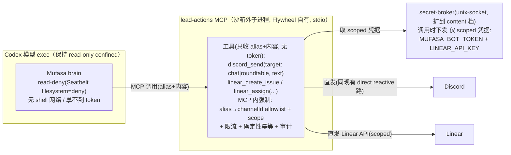
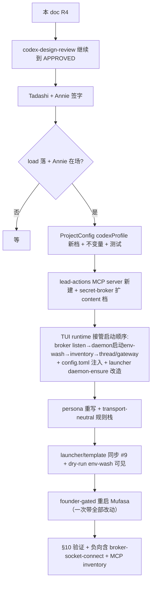

# Plan: Mufasa 卸 read-only 沙箱 → 内容/协调型完整 Lead（Option 1）

**Version**: v1.49.0（provisional — ship 时按实际版位最终确定）
**Issue**: FLY-350（困扰：Mufasa + Rafiki 在 #leads-roundtable 说不了话）
**Date**: 2026-06-19
**Revision**: R4 — **codex APPROVED**（codex-design-review 4 轮：R1 10 + R2 5 + R3 5 全纳入 + R4 2 LOW 收尾）
**Source**: 本 runner 的实证定位（Discord #leads-roundtable 实录 + Mufasa Codex journal + 进程/config 审计）；关联 FLY-285 / FLY-267 / FLY-274 / FLY-322 / FLY-245 / FLY-260 / FLY-251 / FLY-351
**Status**: codex-approved（2026-06-19，4 轮 APPROVED）；待 Tadashi/Annie 签字 → founder-gated 实现（load 落 + Annie 在场）

> **Plan-first / founder-gated。** 本文只是设计，不触碰 live。doc 定稿（codex approved）→ Tadashi + Annie 签字 → load 落 + Annie 在场才实现。

---

## 1. 背景与实证定位（先把真因钉死，别照搬 issue 候选）

FLY-350 的困扰：Annie 跟刚上线的 Mufasa + Rafiki 实聊，发现两个在 #leads-roundtable（`1512578695468941333`）「说不了话」。issue 给了两个候选根因，**实证后两个都被推翻**：

| issue 候选 | 实证结论 |
|---|---|
| Rafiki 没接入 roundtable（缺 FLY-322 那步） | ❌ **错**。Rafiki 是 Claude Lead，access.json 已含 roundtable + FLY-282 reconciler `member=true`。Discord 实录：01:14 被 @ 正常回、**01:27 未被 @ 主动发顶层连通性测试成功**。Rafiki 完全正常，**无需改动**。 |
| Mufasa = FLY-274 bridge-mode 出站 403 | ❌ **错**。Mufasa 跑 **direct** 模式（launcher 默认 direct），FLY-274 的 fail-loud 守卫从未触发；inbound cursor 在拉 roundtable、journal 4 条 roundtable 回复全 `completed`（FLY-267 在 TUI runtime 也接通了）。**被 @ 能回**。 |

**Mufasa 的真因（两条）：**

1. **persona 引用了不存在的工具。** `~/Dev/growth/.lead/mufasa-lead/identity.md`（给老 Claude-plugin Mufasa 写的）仍要求它调 `mcp__plugin_discord_discord__reply` + `chat_id` 才算「发出」。但 Mufasa 现在是 **Codex Lead**，Codex runtime 根本没有这个工具（已核 `CodexTurnExecutor`：它把本轮 assistant 正文自动累积 → 成功后经 outbound sender 自动发回 reply-route 频道）。brain 找不到该工具 → 自认「不能往 Discord 发」（Annie 看到的「说不了话」，而其实它已经发出去了）。
2. **没有「主动发起」能力。** Codex Lead 的出站是 runtime 把整轮输出 **reply-route 回触发该轮的入站频道**；brain 没有「指定频道发送」的工具。所以当 Annie 在 #mufasa 让它「去 roundtable 找 Aunt Cass」时，它的输出只会回到 #mufasa，无法主动投到 roundtable。

**对照：为什么别的 Lead 能主动说？** Simba / Cass / Hiro / Peter / Rafiki 都是 **Claude Lead**（完整 Claude session + discord 插件 MCP），可以用 reply 工具的 `chat_id` 主动发到任意它有权限的频道。Mufasa 是 **Codex Lead**（read-only 陪聊沙箱），既没有 MCP 工具、又被沙箱收着。

**Annie 的决策（经 Tadashi relay）：** 把 Mufasa 从 read-only 陪聊沙箱升成 **内容/协调型完整 Lead（Option 1）**，像别的 Lead 一样能主动发言。

---

## 2. 目标（Option 1 — 内容/协调型 Lead）

让 Mufasa 成为 growth/COE 的**内容/协调型 Lead**（对标 Asha / Ariel 内容 Lead）：

**给：**
- **Linear 能力** —— 能建 / 派 issue（growth/COE 内容工作 tracking）。
- **Discord 主动发言** —— 能在自己 chat + #leads-roundtable 主动发起消息（不只被动回）。
- **canSpawnRunners**（**本期保持 false**，依赖 FLY-251，见 §9）。

**不给（Option 2 才给，本设计明确排除）：**
- 完整 shell（读写执行 + 联网）／ gh、git ／ 自 merge、自 ship。

**核心原则（codex R1+R2 验证后细化）：能力靠「沙箱外、Flywheel 自有、broker 下发 scoped 凭据、直发 Discord/Linear 的窄 MCP」给，模型 exec shell 保持 read-only confined、token 永不进模型。** 见 §3。

---

## 3. 设计原则（R3 修正版）：一个 Flywheel 自有 lead-actions MCP，直发（broker 下发 scoped 凭据）

> R1 #2/#3/#4 推翻了「`buildCodexLeadMcpArgv` 注入 + secret-broker 发 token」；R2 改走「MCP 代理到 Bridge」，R2 review 又指出两条（已核源码）：(R2#1) Bridge `/api/lead-outbound/send` 的 `buildAuthorizeLeadChannel`（`codexLeadBridgeWiring.ts`）只授权 `chatChannel`+`generalChannel`，**roundtable 会 403**（正是 FLY-274 的缺口）；(R2#2) Bridge 只有一个**全局** `apiToken`（`tokenAuthMiddleware`，`plugin.ts:374`），把它给 MCP 子进程 = 授权面远超「内容协调」。→ **R3 不再经 Bridge 代理，改 MCP 直发**，绕开这两条。

**修正后的机制（MCP 直发 + broker 下发 scoped 凭据）：**

**为什么 MCP 直发比 Bridge 代理更对（R3）：**
- **绕开 R2#1（roundtable 403 / FLY-274）**：不调 Bridge `/api/lead-outbound/send`，而是直发（同 reactive 的 `DirectDiscordOutboundSender` 路；bot token 本就在 runtime 持有）。roundtable allowlist 在 **MCP 子进程内**强制（alias→channelId 服务端派生），不依赖 Bridge 跨部门授权、**不耦合 FLY-274**。
- **绕开 R2#2（全局 Bridge token 授权过宽）**：MCP 子进程**只**经 broker 拿 `MUFASA_BOT_TOKEN` + `LINEAR_API_KEY` 两个 scoped 凭据 → 授权面**恰好** = Discord 发送 + Linear，**碰不到** `/api/founder-consent/*`、`/api/runs/*`、reserved 路由（它根本不持全局 apiToken）。
- **token 经 broker 下发（解 #3，不是「env 灌了就叫 brokered」）**：把 `SecretBroker` 扩到 read-only **content 档**（当前仅 write-capable 实例化）。模型 exec shell read-deny+env-exclude 拿不到；MCP 子进程是独立进程、模型只调工具看不到其内存/env。
- **FLY-245 哲学不变**：模型只 REQUEST（传 alias+内容），authority（allowlist/scope）在 MCP 子进程服务端强制、模型无法绕过。**read-deny + shell 网络关全部保留** → FLY-260 exfil 与 FLY-224 自-merge 面天然不开。

> **备选（更强隔离但更重）**：MCP 代理到 Bridge + 给 Bridge 加 (a) 跨部门频道授权（= FLY-274）与 (b) 一个 scoped per-Lead 凭据路（claims: projectName/leadId/allowedTools/allowedTargets/expiresAt，只被 lead-actions 路由接受，拒 reserved/runs/founder-consent）。隔离更强（MCP 子进程连原始 bot token 都不持），但要新建 Bridge 授权设施 + 耦合 FLY-274。**R3 推荐直发**（更简单；bot token 本就在 runtime；授权在 MCP 强制）；若 review 坚持中心化授权/审计，再走备选。

---

## 4. 新增：Codex 能力档（profile）—— 解 R1 #1（不能 overload `companion`）

R1 #1（已核 `ProjectConfig.ts:91-95`）：**`backend:"codex-app-server"` 当前仅在 `companion===true && canSpawnRunners 解析为 false` 时合法**（FLY-245 fail-close 不变量，测试强制）。所以 R1 计划里「`companion:false`」会让 config 加载直接失败。

**修正：引入显式的 Codex 能力档，不再用 `companion` 一个布尔扛三种语义。** 建议在 `ProjectConfig` 加 `codexProfile`（或等价能力集）：

| profile | 模型 exec | MCP 工具 | canSpawnRunners | 例 |
|---|---|---|---|---|
| `companion`（现状） | read-only + read-deny | 无 | false | 旧 Mufasa |
| `content-coordination`（**本设计目标**） | read-only + read-deny | lead-actions（Discord-send + Linear，窄） | false（待 FLY-251） | 新 Mufasa |
| `write-capable`（FLY-245） | workspaceWrite + gateway | gateway only | 视情况 | 未来工程 Codex Lead |

- 改 `ProjectConfig` 的 FLY-245 cross-field 不变量：`codex-app-server` 对 `companion` **和** `content-coordination` 都合法（两者模型 exec 都 read-only）；`write-capable` 仍 fail-close（FLY-245 不变）。
- 同步更新 fleet 资格判定、Dashboard 文案、相关测试（R1 #1 suggested fix）。
- Mufasa 设 `codexProfile: "content-coordination"`，`canSpawnRunners: false`（本期）。
- **回滚**：profile 改回 `companion` 即恢复旧能力面。

---

## 5. 新增：TUI daemon 的 MCP 注入路径 —— 解 R1 #2

R1 #2（已核）：`buildCodexLeadMcpArgv` 只作用 headless（`codex app-server --strict-config -c …`）。Mufasa 跑 `codex-lead-tui-runtime.ts` → `connectDaemonWs` 连**已存在的 `codex remote-control` daemon**，**不调** `buildCodexLeadMcpArgv`。当前 `~/.codex-mufasa/config.toml` 只有 read-deny `[permissions]`、**无 MCP server**。

**修正：TUI 路的 MCP 经 CODEX_HOME `config.toml` 注入**（daemon 读 config.toml）：
- 在 `codex-lead-tui-home.sh` 组装 CODEX_HOME 时，于 read-deny `[permissions]` fragment **旁** 写入 `[mcp_servers.lead_actions]`（stdio command/args + env_vars by NAME，无裸 secret）。
- **强制 daemon 重启**让它重读 config.toml（read-deny cutover 已有「stopped any running daemon so it re-reads」先例）。
- **测试**：read-deny `[permissions]` + `[mcp_servers.*]` 能共存、**不重新引入** legacy `sandbox_mode`（FLY-260 的 FORBIDDEN_DENY_FORMS 交叉校验仍绿）。
- **回滚**：从 config.toml 摘掉 `[mcp_servers.lead_actions]` + daemon 重启。

### 5.1 broker 生命周期 + daemon env-wash（解 R3#1/#2 —— TUI 路硬接线）

R3 review（已核源码）指出 broker 在 TUI 路**不可直接落地**：`SecretBroker` 当前只在 headless write-capable 路启（`codex-lead-runtime.ts:748`，有 `release` 才建）；TUI runtime（`codex-lead-tui-runtime.ts:371`）连**已在跑**的 daemon，且 daemon 在 runtime 拥有 broker 之前就被 ensure（`:656` + launcher `run-codex-lead-mufasa-tui.sh:143-146`）。两条硬接线必须写明：

1. **启动顺序（R3#1）**：让 **TUI runtime 接管 content 档的启动编排**：① 从 `stateDir` 派生确定性 broker socket 路径 → ② 起 content-scoped `SecretBroker` listen → ③ 起/重启 daemon，**只**把**非密**的 broker 坐标（如 `FLYWHEEL_LEAD_ACTIONS_BROKER_SOCKET` + lead/project/channel 配置）传给 daemon/MCP → ④ inventory 断言（§10）→ ⑤ thread/gateway。runtime stop 时关 broker。若 launcher 仍预 ensure daemon，必须改成**不**在无 broker 坐标时起 stale daemon。**broker 坐标不进模型可见 env（R4 LOW#1）**：`FLYWHEEL_LEAD_ACTIONS_BROKER_SOCKET` 要送达 MCP 子进程但**不**出现在模型 exec shell env（把该 var 加进 read-deny 的 shell env-exclude，同时确保 MCP child 仍收得到）；§10 ⑥ 真机负测是最终权威。
2. **daemon env-wash（R3#2）**：wrapper `set -a` + source `~/.flywheel/.env` 会把 token-shaped env 带进 launcher env；当前 launcher 还 `DISCORD_BOT_TOKEN=$MUFASA_BOT_TOKEN`（`:131`）并以**继承 env** 起 daemon（`codex-lead-tui-home.sh:257`）。read-deny 的 env-exclude 只挡模型 exec shell，**不等于** broker 不变量「secret 绝不进 app-server/daemon env」。→ **daemon 必须以最小 allowlist env 启动**，排除 `*TOKEN*`/`*SECRET*`/`*KEY*`，只留非密坐标；runtime 进程**可**在内存持 action secret（供 broker + reactive 直发），但 **daemon env 必须洗白**。dry-run 显示「daemon env 已洗白」类别（不打值）+ `ensure-daemon` 回归测试。**回归测试具体断言（R4 LOW#2）**：daemon 启动 env **排除** `DISCORD_BOT_TOKEN` / `MUFASA_BOT_TOKEN` / `LINEAR_API_KEY` / `FLYWHEEL_API_TOKEN` 以及任何 `*TOKEN*`/`*SECRET*`/`*KEY*` 条目，**只保留** MCP 所需的非密 lead/project/channel/broker 坐标。

---

## 6. lead-actions MCP server（Discord-send + Linear）—— 安全是重点

**新建一个 Flywheel 第一方、窄 MCP server**（stdio，Mufasa CODEX_HOME 注入）。它经 broker 取 scoped 凭据后**直发** Discord/Linear（R3：不经 Bridge 代理，绕开 R2#1 roundtable-403 与 R2#2 全局-token；见 §3）。

### 6.1 Discord-send（解 #4 / R2#1）
- 工具签名：`discord_send(target: "chat" | "roundtable", text)` —— **只收 alias，不收任意 channelId**；alias→channelId 由 **MCP 子进程内**从 `FLYWHEEL_LEAD_CHAT_CHANNEL_ID` + `FLYWHEEL_LEAD_CROSS_DEPT_CHANNEL_IDS` 派生（服务端权威，模型无法绕过）。
- **alias fail-closed（R3#4）**：`CROSS_DEPT` 是列表 —— `roundtable` 仅当**恰好一个**跨部门频道时合法；为空或多于一个 → **拒绝**并要求显式 alias 映射（如 `FLYWHEEL_LEAD_ACTIONS_CHANNEL_ALIASES=roundtable:<id>,chat:<id>`）。测 0/1/多/畸形 alias 配置。
- 底层**直发**：复用 `postDiscordMessageToChannel`（`allowed_mentions:{parse:[]}` 防乱 ping + chunking），`MUFASA_BOT_TOKEN` 经 broker 下发到 MCP 子进程（同 reactive 的 direct 路）；**不**走 Bridge `/api/lead-outbound/send`（避开 roundtable 403 / FLY-274）。
- **回环/限流（解 #7，FLY-220 教训）**：在 MCP 子进程自带 —— per-channel 速率上限、**确定性 idempotency key**、durable 审计行（**自有** store，**不**复用 Bridge 的 `SqliteOutboundDedupStore`）、非白名单 target 直接拒、不对自己发的消息自激（与 `CodexDiscordGateway` 现有 echo-immunity 协同；注意 proactive 工具**绕过** `LeadInputRouter`，故 durability 必须自接）。
- **测试**：self-post echo、sibling mention 级联、同一轮重复调用、非白名单 target 拒绝、限流命中。

### 6.2 Linear（解 #6 / R2#3）
- 工具：`linear_create_issue(...)` / `linear_assign_issue(...)`（**只这些**，不给删除/危险写）。
- **直发 Linear API**（`LINEAR_API_KEY` 经 broker 下发到 MCP 子进程），在 MCP 内 **team/project/label/assignee 名字→ID 服务端解析** + scope 到 growth/COE。**不**走 Bridge `/api/linear/*`（R2#3：现有 Bridge `update-issue` 无 assignee 字段、`create-issue` 的 `labels` 收的是 ID 不是名字，契约不全；直发 + MCP 内解析更干净）。
- **范围取舍（R2#3）**：若 assign 一时做不全，本期可**先 create-only**，assign 作为紧随的小步；二者都在 MCP 内做名字解析 + 权限 scope。
- **依赖 FLY-351**：growth 的 Linear project/前缀（`TEAMLEAD_ISSUE_PREFIXES`）建好前，Linear 工具 route 不了玄学/growth issue —— 诚实标依赖；project/前缀未就绪时该工具 **fail-soft**（明确报「project/prefix 未就绪」，非静默）。

### 6.3 reactive vs proactive + 防重复合同（解 #8）
- **reactive 保持现状**（runtime 自动把本轮正文发回入站频道 —— 已验证 work、零回归）。
- **proactive 才调 `discord_send`**。
- **防重复合同（#8）**：persona/工具文档写明 —— 调了 `discord_send` 主动发到某频道后，**本轮在来源频道只回一句简短 ack**（除非 Annie 明确要两边都发），且 `discord_send` 返回简短状态而非把全文再回一遍 → 避免「proactive 发了 roundtable + reactive 又在 #mufasa 重发全文」的重复/错位。

### 6.4 token（解 #3 / R2#2）
MCP 子进程经 **secret-broker（扩到 read-only content 档；当前仅 write-capable 实例化）** 取 **仅** `MUFASA_BOT_TOKEN` + `LINEAR_API_KEY` 两个 scoped 凭据 —— 授权面恰好 = Discord 发 + Linear，**不**持任何全局 Bridge `apiToken`（绕开 R2#2 的过宽授权）。**绝不**把凭据当普通 `env_vars` 灌进去就号称 brokered（#3）。

### 6.5 回滚
从 config.toml 摘掉 `[mcp_servers.lead_actions]` + daemon 重启（reactive 自动回不受影响）。

---

## 7. persona + 规则栈重写（合并 B；解 #5）

> Tadashi 指示：**B 的 identity fix 跟卸沙箱的 persona 改写合并，一次重启带上。**

### 7.1 persona（identity.md，本地非版控；改前备份 `identity.md.pre-FLY-350.bak`；仅重启生效，runtime resume 重读重传 baseInstructions —— 已核 `codex-lead-tui-runtime.ts:369`）
1. **回复机制（B 的修）**：删掉「调 `mcp__plugin_discord_discord__reply` + chat_id」（Codex 没这工具）。改为：reactive「本轮回答正文会自动发回来源频道，不需要也没有 reply 工具」；proactive「主动在允许频道发起就调 `discord_send(target, text)`，target 只能 chat/roundtable」。
2. **角色**：去掉「不开 Runner / 不碰代码 / 不做不可逆事」硬限，换成 growth/COE 内容协调 Lead 的职责边界（建/派 issue + 协调；不自 merge/不动系统）。
3. **保留**：温暖、平视、去人机感 persona 全文（不动）。

### 7.2 规则栈（解 #5 —— R1 计划直接加 `cross-dept-channel-rules.md` 会**重新引入** Claude 专属错指令）
- `cross-dept-channel-rules.md` 现在写「reply with chat_id」（Claude 插件 transport）→ **改成 transport-neutral**（「在点名你的那个频道回」，不绑定具体发送 API）。
- `companion-safety-contract.md` 与「内容/协调 Lead」冲突 → 换成 **Codex content-Lead 规则变体**（或 founder-only-authority + 内容 Lead 职责），由 launcher **按 project config 语义组装**（像 Claude launcher 那样），不靠 ad hoc env override。
- 确认 `run-codex-lead-mufasa-tui.sh` 的 `FLYWHEEL_LEAD_SYSTEM_PROMPT_FILES` 装上 founder-only-authority + transport-neutral cross-dept rules。

### 7.3 回滚
还原 identity.md 备份 + 规则栈 env；一次重启。

---

## 8. 通用安全防线对 Codex Lead 真生效的验证

Option 1 因为**不开模型 shell**，FLY-260/FLY-224 面天然不开（§3）—— 这是第一层、也是最强的一层。第二层（通用防线）仍要核：
1. **founder-only-authority.md（prompt 级）** —— §7.2 确认注入。
2. **Bridge founder-consent 闸（FLY-175/245 Track2/3，默认 off）** —— Option 1 不给 merge/ship/runner-lifecycle 这些 reserved 动作（不给 shell/gh、canSpawnRunners 留 false），**故不需把 `decisionMode` 强 enforce**（保持默认、零生产变化）。将来开 canSpawnRunners（runner-lifecycle 是 reserved）时再核。
3. **分支保护 + `:cool:` 是唯一 merge 路** —— Mufasa 物理上无 gh/git，无法自 merge。

---

## 9. 依赖 / 阻塞（诚实标给 Annie）

| 依赖 | 影响 | 处置 |
|---|---|---|
| **FLY-251**（Codex Lead 起/管 Runner 端到端接线，未建） | `canSpawnRunners:true` 只是 flag；真接线没建 | **本期 canSpawnRunners 保持 false**；核心能力（建 issue+主动发言）不依赖它；Rafiki 本就管派 runner |
| **FLY-351**（growth Linear project/前缀 `TEAMLEAD_ISSUE_PREFIXES`） | 没 project/前缀，Linear 工具 route 不了 | Linear 工具 fail-soft 报「prefix 未就绪」；不在本 issue 解 |
| **lead-actions MCP server（新建）+ TUI config 注入 + broker 扩 read-only 档** | 是本设计的实现主体 | §3/§5/§6 |
| **ProjectConfig `codexProfile` 新档 + 不变量改 + 测试** | 没它 config 拒载（#1） | §4 |
| **transport-neutral 规则重写** | 直接加旧规则会引错指令（#5） | §7.2 |

---

## 10. 验证计划（解 #10：新档要自己的 allowlist 证明）

实现后（founder-gated 重启，Annie 在场）逐条验：
- [ ] Mufasa 重启**干净起**（无 fail-loud / 无 5-setup-issue）；**记忆延续**（thread `019eaf5d-a5b7-7a72-b73f-cd1063892aa1` 逐字一致）。
- [ ] **roundtable**：被 @ 能回（reactive 零回归）+ **未被 @ 能主动发起**（proactive，对标 Rafiki 01:27）；**无重复**（§6.3 合同）。
- [ ] **chat（#mufasa）** 行为零回归；persona 去人机感不回归、不再自相矛盾说「我不能发」。
- [ ] **Linear**：能建/派一条 issue（依赖 FLY-351；前缀未就绪则 fail-soft 报错、不算 fail）。
- [ ] **MCP inventory + fail-closed 启动顺序（#10 / R2#4）**：在 `codex-lead-tui-runtime.ts` 里 **先订阅 daemon 通知 → 再 ensureThread**，断言模型可调工具面**恰好** = 批准的 `lead_actions`（`discord_send` + Linear），**无额外工具**，**才**允许 `recover/startGateway`；inventory 缺失/多出/失败/超时 → **在 Discord 轮询开始前退出**（fail-closed，对标 FLY-245 headless write-capable 的 `McpInventoryWatcher` 顺序，但这是「有 MCP 无 shell」的新中间档）。
- [ ] **负向**：① 模型 shell 仍读不到密钥（read-deny 在）；② `discord_send` 非白名单 target 被拒；③ 限流生效；④ self-post 不自激、sibling mention 不级联（FLY-220）；⑤ Linear prefix 未就绪时 fail-soft；⑥ **broker socket connect 负测（R3#3，真机硬性）**：在**精确的 TUI read-deny 档**下，从模型 exec shell 用 Node `net` 或 `nc -U` 尝试 connect broker socket → **必须失败**；且 broker socket 路径不出现在模型可见 env。若该档下 AF_UNIX connect 竟成功 → 退回 inherited-fd 传 secret 或 §3 的「Bridge 代理备选」。

---

## 11. 回滚计划（每步可逆，一次重启）

| 层 | 回滚动作 |
|---|---|
| lead-actions MCP | config.toml 摘 `[mcp_servers.lead_actions]` |
| ProjectConfig profile | `codexProfile` 改回 `companion` |
| persona / 规则栈 | 还原 `identity.md.pre-FLY-350.bak` + 规则 env |
| read-deny | 本设计**不动**（保留），无需回滚 |
| broker read-only 档扩展 | 配置开关关掉 |

整体回滚 = 还原上述 + 一次重启 Mufasa（resume 同 thread，记忆不丢）。

---

## 12. 实施 phasing（plan-first；本期只到设计 approved）

实现拆成可独立 review 的小步；**重启是 founder-gated 不可逆动作**，Annie 在场 + load 落才做。

---

## 13. 模板/安装漂移（解 #9）

R1 #9（已核）：installed wrapper（`~/.flywheel/bin/flywheel-codex-lead-wrapper-mufasa-tui.sh`）现 `FLYWHEEL_CODEX_LEAD_READ_DENY=1`，但**committed 模板**没有 → 只改一处会在 reinstall 回归。
- 实现时**源模板 + installed wrapper + dry-run 测试一起改**。
- dry-run 增一行：报 read-deny / MCP servers / system-prompt files / cross-dept channel ids（**不打印 secret**）。

---

## 14. Out of scope（本 issue 明确不做）

- **Option 2（完整 write-capable：shell + gh/git + 自 merge）** —— Annie 选 Option 1，排除。
- **Mufasa 自派 runner 端到端接线** —— 归 **FLY-251**（canSpawnRunners 本期 false）。
- **growth Linear project / 前缀** —— 归 **FLY-351**。
- **Rafiki** —— 实证 verified-working，不动。
- **旧 pre-Codex Mufasa 陪聊进程（PID 64932，MUFASA.md via tmux atlas-growth）双监听** —— 归清理（本 issue 不动）。
- **FLY-274（bridge-OUTBOUND-MODE 迁移 + 服务端跨部门授权）** —— 澄清术语（R2#5）：本设计 reactive 出站**仍是 direct 模式**（不变）；proactive 走 **MCP 直发**（§3/§6，**不**经 Bridge）。FLY-274（把 reactive 出站迁到 bridge 模式求 exactly-once + 给 Bridge 加服务端跨部门频道授权）**不在本设计路径上**。⚠️ 仅当将来改走 §3 的「Bridge 代理备选」，才需要 FLY-274 的服务端跨部门授权 —— 实现者别因本条而跳过那块（若选备选）。

---

## 15. 关键文件（实现时）

- `packages/teamlead/src/ProjectConfig.ts` —— `codexProfile` 新档 + FLY-245 cross-field 不变量改 + 测试（#1）
- `packages/teamlead/scripts/codex-lead-tui-home.sh` —— CODEX_HOME config.toml 注入 `[mcp_servers.lead_actions]`（#2）+ 模板（#9）
- **新建** lead-actions MCP server（`packages/teamlead/src/lead-backends/codex/` 下，stdio，**直发** Discord/Linear；内置 alias allowlist + 限流 + 幂等 + 审计）（#4/#6/R2#1）
- `packages/teamlead/src/lead-backends/codex/secret-broker.ts` —— 扩 read-only content 档，仅下发 `MUFASA_BOT_TOKEN` + `LINEAR_API_KEY`（#3/R2#2）
- `packages/teamlead/src/lead-backends/codex/DirectDiscordOutboundSender.ts` / `bridge/discord-utils.ts::postDiscordMessageToChannel` —— Discord 直发底层复用（**不**走 Bridge `/api/lead-outbound/send`）
- `~/.flywheel/projects.json` —— Mufasa `codexProfile: content-coordination` + `canSpawnRunners: false`
- `~/Dev/growth/.lead/mufasa-lead/identity.md` —— persona 重写（备份后改）（B 合并）
- `packages/teamlead/lead-rules-base/cross-dept-channel-rules.md` —— transport-neutral 重写（#5）
- `packages/teamlead/scripts/run-codex-lead-mufasa-tui.sh` —— `FLYWHEEL_LEAD_SYSTEM_PROMPT_FILES` 规则栈 + installed wrapper 同步（#5/#9）
- `packages/teamlead/src/lead-backends/codex/codex-lead-tui-runtime.ts` —— TUI 路 MCP/inventory 接线（#2/#10）
