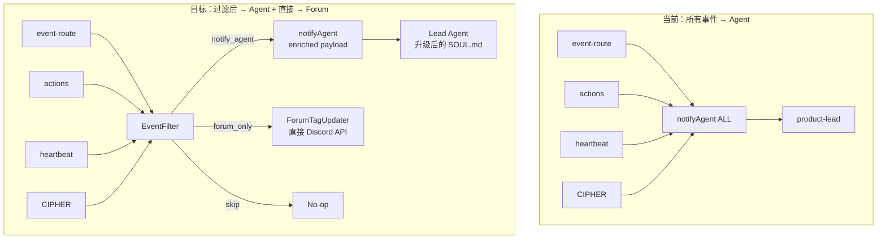
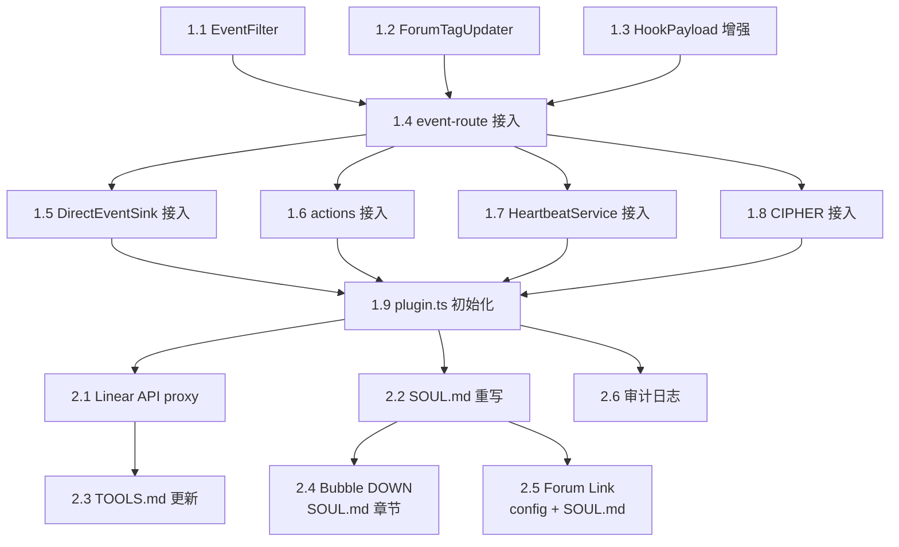

# Plan: Lead Agent Behavior Design — Smart Infrastructure

**Version**: v1.5.0
**Issue**: GEO-187
**Date**: 2026-03-20
**Source**: `doc/engineer/exploration/new/GEO-187-lead-agent-behavior-design.md`, `doc/engineer/research/new/GEO-187-lead-agent-behavior-design.md`, `doc/engineer/deep-research/010-ai-agent-frameworks-2026.md`
**Status**: codex-approved
**Depends On**: GEO-152 (v1.4.0, multi-lead routing — PR #34)

---

## 1. Overview

当前系统的 4 条通知路径（event-route, actions, heartbeat, CIPHER）全部无差别地将事件发给 OpenClaw agent，CEO 需要自己过滤和判断优先级。GEO-187 实现 **Option D: Smart Infrastructure** 架构——Bridge 做确定性基础设施（事件过滤、Forum tag 直接更新、审计日志），OpenClaw Agent 专注做大脑（信息消化、CEO 对话、判断、action 执行）。



## 2. Scope

### In Scope (GEO-187)

| # | 功能 | 优先级 |
|---|------|--------|
| 1 | EventFilter 规则引擎 — 确定性事件分类 | P0 |
| 2 | ForumTagUpdater — Bridge 直接更新 Discord Forum tag | P0 |
| 3 | HookPayload 增强 — 新增 filter_priority, forum_tag_update_result 字段 | P0 |
| 4 | 4 条通知路径接入 EventFilter | P0 |
| 5 | product-lead SOUL.md 重写 — 从通知机器人升级为部门负责人 | P0 |
| 6 | Bridge Linear API proxy — create/update issue endpoints | P1 |
| 7 | product-lead TOOLS.md 新增 Linear tools | P1 |
| 8 | EventFilter 审计日志 — 所有过滤决策可追溯 | P1 |
| 9 | Bubble DOWN: CEO Chat 指令 → Lead 解析 → Bridge action（含 terminate + retry with context） | P1 |
| 10 | Chat → Forum 链接: Lead 在 Chat 提及 issue 时附带 Forum Thread 链接 | P1 |
| 11 | terminate action — Bridge 端新增，kill tmux session | P1 |
| 12 | retry with context — retry endpoint 接受 CEO 自定义指令 | P1 |

### Out of Scope

- Event Aggregator（观察 Phase 1 效果后决定）
- Per-department personas（DEPARTMENT.md，等 GEO-152 multi-lead 完成后）
- 日报/早报功能（后续 issue）
- CIPHER → EventFilter **智能集成**（pattern-based 优先级调整，Phase 3+）
  - 注意：CIPHER 通知路径**经过** EventFilter 在本期 in-scope（Task 1.8），只是不做 CIPHER pattern → Filter 规则的自动调整
- 跨 Lead 协调

## 3. Architecture

### 3.1 EventFilter 注入点

```
Before:  event → update session → notifyAgent(ALL)
After:   event → update session → EventFilter.classify() →
           notify_agent: notifyAgent(enriched payload)
           forum_only:   ForumTagUpdater.update() directly
           skip:         audit log only
```

EventFilter 在 FSM transition 之后、`notifyAgent()` 之前。FSM 已经处理了 duplicate/out-of-order 事件；EventFilter 处理 **业务优先级过滤**。

### 3.2 过滤规则表

```
优先级排序（第一个匹配的规则生效）：

HIGH — 需要 CEO 决策，必须通知 Agent
  session_completed + needs_review     → notify_agent (high)
  session_completed + blocked          → notify_agent (high)
  session_failed                       → notify_agent (high)

NORMAL — 重要 update，通知但非紧急
  session_stuck                        → notify_agent (normal)
  session_orphaned                     → notify_agent (normal)
  action_executed                      → notify_agent (normal)
  cipher_principle_proposed            → notify_agent (normal)

LOW — 静默，只更新 Forum dashboard
  session_started + thread_id exists   → forum_only (low)
  session_started + NO thread_id       → notify_agent (normal)  ← agent 需要创建 Forum Post
  session_completed + approved         → forum_only (low)

DEFAULT — 未匹配的事件
  *                                    → notify_agent (normal)
```

默认 `notify_agent` 而非 `skip`——Phase 1 保守策略，不遗漏任何事件。

### 3.3 ForumTagUpdater

从 `plugin.ts` 的 `/api/forum-tag` endpoint 提取 Discord API 调用为独立模块。Status → tag ID 映射硬编码在 TypeScript 中（现在在 SOUL.md 里，不可测试）。

**接口设计**（接受完整上下文而非单一 status，以支持 skip 规则判断）:

```typescript
interface TagUpdateContext {
  threadId?: string;
  status: string;
  eventType: string;       // 区分 session_started vs action_executed retry
  action?: string;         // 区分 retry vs approve
  discordBotToken?: string;
}

type TagUpdateResult = 'skipped' | 'attempted' | 'succeeded' | 'failed' | 'no_thread';

class ForumTagUpdater {
  async updateTag(ctx: TagUpdateContext): Promise<TagUpdateResult>;
}
```

**Skip 规则**（从 SOUL.md 移过来，基于完整上下文判断）:
- `action === 'retry'` → skip（retry 只改状态不 requeue，in-progress 会误导）
- `action in ['reject', 'defer', 'shelve']` → skip（CEO 操作中间态）
- `!threadId` → return `'no_thread'`
- `!discordBotToken` → return `'skipped'`

### 3.4 HookPayload 增强

```typescript
// 新增字段
filter_priority?: 'high' | 'normal' | 'low';
notification_context?: string;          // 人类可读的通知原因
forum_tag_update_result?: 'skipped' | 'attempted' | 'succeeded' | 'failed' | 'no_thread';
  // 只有 'succeeded' 时 agent 才能确信 tag 已更新
```

### 3.5 Linear API Proxy

Bridge 新增 2 个 endpoint，agent 不直接持有 LINEAR_API_KEY：

```
POST /api/linear/create-issue   → 创建 issue
PATCH /api/linear/update-issue  → 修改 issue (title, priority, description, status)
```

需要 `linearApiKey` 加入 BridgeConfig。

## 4. Implementation Tasks

### Phase 1: EventFilter + ForumTagUpdater (P0)

#### Task 1.1: EventFilter 模块
**File**: `packages/teamlead/src/bridge/EventFilter.ts` (NEW)

```typescript
interface FilterRule {
  match: Partial<{ event_type: string; decision_route: string; status: string; action: string }>;
  result: FilterResult;
}

interface FilterResult {
  action: 'notify_agent' | 'forum_only' | 'skip';
  priority: 'high' | 'normal' | 'low';
  reason: string;
}

class EventFilter {
  classify(eventType: string, payload: Partial<HookPayload>): FilterResult;
}
```

- 规则表硬编码为 `const FILTER_RULES`
- 按优先级顺序匹配，第一个命中即返回
- 未匹配 → default `notify_agent` + `normal`
- 每次 classify 输出审计日志（structured log: event_type, issue_id, result, reason）

**Tests** (TDD — 先写):
- 每条规则的正向匹配
- 未匹配事件 → default 行为
- 优先级排序正确性（high 规则不被 low 覆盖）
- Edge case: 缺失字段的 payload

#### Task 1.2: ForumTagUpdater 模块
**File**: `packages/teamlead/src/bridge/ForumTagUpdater.ts` (NEW)

```typescript
class ForumTagUpdater {
  async updateTag(ctx: TagUpdateContext): Promise<TagUpdateResult>;
}
```

- 接受 `TagUpdateContext`（完整上下文），返回 `TagUpdateResult`（显式状态）
- Status → tag ID 映射从 SOUL.md 移到代码（`STATUS_TAG_MAP` const）
- Skip 规则基于 `ctx.action` 判断: `retry`/`reject`/`defer`/`shelve` 不更新 tag
- 无 `threadId` → return `'no_thread'`；无 `discordBotToken` → return `'skipped'`
- Discord API 调用逻辑提取为公共函数，与 `plugin.ts` 的 `/api/forum-tag` endpoint 共享
- `/api/forum-tag` endpoint 保留但内部改为调用 ForumTagUpdater

**Tests**:
- Status → tag ID 映射正确性
- Skip 规则覆盖（按 action 类型）
- `'no_thread'` / `'skipped'` / `'succeeded'` / `'failed'` 各路径
- Discord API 调用 mock（验证 PATCH URL/headers/body）

#### Task 1.3: HookPayload 类型增强
**File**: `packages/teamlead/src/bridge/hook-payload.ts` (MODIFY)

- 新增 `filter_priority`, `notification_context`, `forum_tag_update_result` 字段到 `HookPayload` interface
- 不改变 `buildHookBody()` 和 `notifyAgent()` 签名

**Tests**: 类型检查（TypeScript 编译即验证）

#### Task 1.4: event-route.ts 接入 EventFilter
**File**: `packages/teamlead/src/bridge/event-route.ts` (MODIFY)

修改 session_completed/session_failed 通知流程（约 lines 380-410）:

```
Before: buildHookBody() → notifyAgent()
After:  buildHookPayload() → eventFilter.classify() →
          if notify_agent: enrich payload → notifyAgent()
          if forum_only: forumTagUpdater.updateTag()
          always: audit log
```

- EventFilter 和 ForumTagUpdater 通过 plugin 注册（与 BridgeConfig 一起初始化）
- `notify_agent` 路径: 调 ForumTagUpdater → 设置 `filter_priority` + `forum_tag_update_result` → notifyAgent
- `forum_only` 路径: 只调 ForumTagUpdater，不调 notifyAgent
- `session_started` 特殊处理: 无 `thread_id` 时强制 `notify_agent`（agent 需要创建 Forum Post）

**Tests**:
- Integration test: session_completed + needs_review → notifyAgent called + forumTag updated
- Integration test: session_started + thread_id exists → only forumTag updated, notifyAgent NOT called
- Integration test: session_started + NO thread_id → notifyAgent called (agent creates Forum Post)
- Integration test: session_failed → notifyAgent called (high priority)
- Verify enriched payload 包含 filter_priority

#### Task 1.5: DirectEventSink.ts 接入 EventFilter
**File**: `packages/teamlead/src/DirectEventSink.ts` (NOT in bridge/ subdirectory)

- **重要**: DirectEventSink 被 retry runtime 实际使用（`scripts/lib/retry-runtime.ts:87` 创建实例），必须纳入 scope
- `pushNotification()` 方法（lines 164-195）与 event-route.ts 同步改造
- 构造函数新增 EventFilter 和 ForumTagUpdater 参数
- `scripts/lib/retry-runtime.ts` 同步更新：传入 EventFilter/ForumTagUpdater 实例

**Tests**: retry session_started/completed/failed 经 DirectEventSink → EventFilter 验证

#### Task 1.6: actions.ts 接入 EventFilter
**File**: `packages/teamlead/src/bridge/actions.ts` (MODIFY)

- `sendActionHook()` 经 EventFilter 分类
- action_executed 默认 `notify_agent` + `normal`（CEO 需要知道 action 结果）
- ForumTagUpdater skip 规则基于 `action` 字段自动跳过 retry/reject/defer/shelve 的 tag 更新

**Tests**: action hook → EventFilter → notify_agent 验证; retry action → ForumTagUpdater skipped

#### Task 1.7: HeartbeatService 接入 EventFilter
**File**: `packages/teamlead/src/HeartbeatService.ts` (MODIFY)

- `WebhookHeartbeatNotifier` 的 `onSessionStuck()` / `onSessionOrphaned()` 经 EventFilter
- HeartbeatService 已有自己的 dedup（notifiedStuck/notifiedOrphans），EventFilter 不需要重复处理
- stuck/orphaned 默认 `notify_agent` + `normal`

**Tests**: 验证 heartbeat → EventFilter → notify_agent

#### Task 1.8: CIPHER 通知接入 EventFilter
**File**: `packages/teamlead/src/index.ts` lines 41-53 (MODIFY)

- **注意**: CIPHER 通知回调在 `packages/teamlead/src/index.ts` 的 `cipherWriter.setNotifyFn()` 中，不是 `packages/edge-worker/src/cipher/index.ts`
- cipher_principle_proposed → EventFilter → `notify_agent` + `normal`
- 这是让 CIPHER 通知**经过** EventFilter 的机制，不涉及 CIPHER pattern → Filter 规则的智能集成

**Tests**: CIPHER proposal → EventFilter → notify_agent 验证

#### Task 1.9: plugin.ts 初始化 + /api/forum-tag 回归测试
**File**: `packages/teamlead/src/bridge/plugin.ts` (MODIFY)

- 创建 EventFilter 和 ForumTagUpdater 实例
- 注入到 event-route、actions（HeartbeatService 通过 WebhookHeartbeatNotifier 接入）
- ForumTagUpdater 使用已有的 `config.discordBotToken`
- `/api/forum-tag` endpoint 保留（向后兼容），内部改为调用 ForumTagUpdater
- **新增**: `/api/forum-tag` endpoint 回归测试（当前无测试覆盖）

### Phase 2: Agent 能力扩展 (P1)

#### Task 2.1: Linear API proxy endpoints
**File**: `packages/teamlead/src/bridge/plugin.ts` (MODIFY)

新增 2 个 endpoint:
- `POST /api/linear/create-issue` — 需要 title, description, priority, labels
- `PATCH /api/linear/update-issue` — 需要 issueId + 可选 title/priority/description/status

Input validation:
- issueId 格式验证
- priority 范围 (1-4)
- title 长度限制

**依赖说明**:
- `@linear/sdk` 当前在 root `package.json` 声明，`packages/teamlead/package.json` 未显式声明
- 现有用法: `actions.ts` 中 `postRetryComment()` 通过动态 `import("@linear/sdk")` + `process.env.LINEAR_API_KEY` 直接使用
- **本次改造**: 在 `packages/teamlead/package.json` 显式添加 `@linear/sdk` 依赖；统一 Linear 配置来源为 `BridgeConfig.linearApiKey`，由 `loadConfig()` 从环境变量读取；将 `postRetryComment()` 也改为使用统一的 config/client，消除两套 Linear 接入方式

**File**: `packages/teamlead/src/bridge/types.ts` (MODIFY)
- BridgeConfig 新增 `linearApiKey?: string`

**File**: `packages/teamlead/src/config.ts` (MODIFY)
- `loadConfig()` 新增 `linearApiKey: process.env.LINEAR_API_KEY`

**File**: `packages/teamlead/package.json` (MODIFY)
- 显式添加 `"@linear/sdk": "60.0.0"`（与 root `package.json` 保持一致，外部包不能用 `workspace:*`）

**Tests**:
- create-issue 成功 / 缺字段 / 无效 priority
- update-issue 成功 / issue 不存在 / 部分更新
- 无 linearApiKey 时返回 501

#### Task 2.2: product-lead SOUL.md 重写
**File**: OpenClaw workspace `product-lead/SOUL.md` (REWRITE)

核心变化:
- **角色**: 从 "Engineering Manager" → "Product 部门负责人"
- **移除**: Forum tag 更新逻辑（Bridge 直接做）
- **新增**: `forum_tag_update_result` 字段说明（只有 `'succeeded'` 时 agent 不需要再手动更新 tag）
- **新增**: filter_priority 字段使用指引（high = 需要 CEO 立刻看，normal = FYI）
- **新增**: 对话风格指引（消化信息、不原样转发、建议 action）
- **新增**: 做不到的事情诚实说不能
- **保持**: 中文沟通、Bridge API 工具使用

#### Task 2.3: product-lead TOOLS.md 更新
**File**: OpenClaw workspace `product-lead/TOOLS.md` (MODIFY)

新增:
```
### Linear API (via Bridge proxy)
- POST /api/linear/create-issue
- PATCH /api/linear/update-issue
```

移除: Forum tag 更新相关工具说明（或标注为 deprecated）

#### Task 2.4: Bubble DOWN — CEO Chat 指令支持
**Scope**: Lead agent 能解析 CEO 在 Chat Channel 的自然语言指令并执行 action 或查询

**支持的操作（分 action 和 query 两类）**:

| CEO 说的 | 类型 | Lead 执行流程 |
|---------|------|-------------|
| "approve" / "批准" | action | `GET /api/resolve-action?issue_id={id}&action=approve` → `POST /api/actions/approve` |
| "retry" / "重试" | action | `GET /api/resolve-action?issue_id={id}&action=retry` → `POST /api/actions/retry` |
| "shelve" / "搁置" | action | `GET /api/resolve-action?issue_id={id}&action=shelve` → `POST /api/actions/shelve` |
| "reject" / "拒绝" | action | `GET /api/resolve-action?issue_id={id}&action=reject` → `POST /api/actions/reject` |
| "终止" / "停止" | action | `GET /api/resolve-action?issue_id={id}&action=terminate` → `POST /api/actions/terminate` |
| "用不同方法重试" | action | `GET /api/resolve-action?...&action=retry` → `POST /api/actions/retry` (body: `{context: "CEO 指令"}`) |
| "查看详情" / "什么情况" | query | `GET /api/sessions/:id` 或 `GET /api/sessions?mode=by_identifier&identifier={id}` |

**关键流程: issue 标识 → execution 解析**:
- CEO 通常说 issue ID（如 "GEO-95"），不说 execution_id
- Bridge 已有 `/api/resolve-action?issue_id=...&action=...` endpoint（`packages/teamlead/src/bridge/tools.ts:179-230`），负责 issue → execution 解析
- Lead agent 必须先调 resolve-action 获取 `execution_id`，再调 `/api/actions/:action`
- resolve-action 返回 `{can_execute, execution_id, reason}` — 如果 `can_execute=false`，Lead 告知 CEO 原因

**terminate action（新增）**:
- StateStore 已存储 `tmux_session` 名（`Session.tmux_session` 字段）
- 实现: 从 StateStore 获取 session → `tmux kill-session -t {tmux_session}` → 更新 status 为 `terminated`
- 需要在 `workflow-fsm.ts` 添加 `terminate` action 和对应的合法源状态（`running`）
- 需要在 `actions.ts` 添加 `handleTerminate()` 函数
- resolve-action 需要支持 `terminate` action type

**retry with context（增强现有 retry）**:
- GEO-168 已有 `retryContext` 机制（`Blueprint.retryContext`），retry 时会注入到下一次 Claude Code session 的 system prompt 中
- 现有 retry endpoint 接受可选 `reason` 参数，已传入 `retryContext.reason`
- 增强: retry endpoint 新增可选 `context` body 参数（CEO 的具体指令，如 "用 library X 试试"）
- `handleRetry()` 将 `context` 作为 `retryContext.previousReasoning` 或新增 `ceoInstruction` 字段传给 Blueprint
- Blueprint 已有 prompt 注入逻辑（`Blueprint.ts:316-322`），会自动出现在 "## Retry Context" 章节

**实现方式**:
- Bridge 代码改动: 新增 terminate action + retry context 参数（2 个代码变更）
- SOUL.md 新增 Bubble DOWN 章节：意图解析规则 + action/query 映射表 + 回复格式
- TOOLS.md 补全: `/api/resolve-action`、`/api/sessions`、terminate、retry with context 用法
- 指引: "action 失败时告知 CEO 原因，不要静默吞错"

**File changes**:
- `packages/core/src/workflow-fsm.ts` — 添加 `terminate` action + 合法源状态
- `packages/teamlead/src/bridge/actions.ts` — 新增 `handleTerminate()` + retry endpoint 接受 `context`
- `packages/teamlead/src/bridge/tools.ts` — resolve-action 支持 `terminate`
- `scripts/lib/retry-runtime.ts` — retryDispatcher.dispatch 传入 CEO context
- OpenClaw `product-lead/SOUL.md` — Bubble DOWN 章节
- OpenClaw `product-lead/TOOLS.md` — 新 action 文档

**Tests**:
- terminate: running session → tmux killed + status=terminated
- terminate: non-running session → error
- retry with context: CEO 指令出现在新 execution 的 system prompt
- retry without context: 行为不变（向后兼容）

#### Task 2.5: Chat → Forum Thread 链接
**Scope**: Lead 在 Chat Channel 提及 issue 时附带 Forum Thread 的 Discord 链接

**链接格式**: `https://discord.com/channels/{guild_id}/{thread_id}`

**session 查询 API（已存在）**:
- `GET /api/sessions/:id` — 按 execution_id 或 identifier fallback 查询
- `GET /api/sessions?mode=by_identifier&identifier=GEO-95` — 按 identifier 查询
- 返回值中包含 `thread_id` 字段（Bridge 创建 Forum Post 后由 agent 回写）

**guild_id 配置**:
- BridgeConfig 新增 `discordGuildId: string`（环境变量 `DISCORD_GUILD_ID`）
- `loadConfig()` 读取并注入
- Bridge 新增 `GET /api/config/discord-guild-id` endpoint（agent 可查询）
- 或更简单: 直接写在 TOOLS.md 中作为常量（guild_id 几乎不变）

**降级策略**: 无 thread_id 时（session 刚启动、agent 还没创建 Forum Post），Lead 只发文字不附链接

**File changes**:
- `packages/teamlead/src/bridge/types.ts` — BridgeConfig 新增 `discordGuildId`
- `packages/teamlead/src/config.ts` — loadConfig 新增 `discordGuildId: process.env.DISCORD_GUILD_ID`
- OpenClaw `product-lead/SOUL.md` — 新增 Forum 链接规则（有 thread_id 时附带，无时降级）
- OpenClaw `product-lead/TOOLS.md` — 文档化 session 查询 API 返回 thread_id，以及链接拼接方式

#### Task 2.6: EventFilter 审计日志
**File**: `packages/teamlead/src/bridge/EventFilter.ts` (MODIFY)

- 每次 `classify()` 调用输出 structured log:
  ```json
  {"level":"info","component":"EventFilter","event_type":"session_completed",
   "issue_id":"GEO-95","result":"notify_agent","priority":"high",
   "reason":"needs_review completion","timestamp":"..."}
  ```
- 使用现有 logger（如果有），否则 `console.log` with JSON format

## 5. File Change Summary

| File (relative to `packages/teamlead/src/`) | Action | Phase | Lines (est.) |
|------|--------|-------|-------------|
| `bridge/EventFilter.ts` | NEW | P1 | ~130 |
| `bridge/ForumTagUpdater.ts` | NEW | P1 | ~80 |
| `bridge/hook-payload.ts` | MODIFY | P1 | +5 |
| `bridge/event-route.ts` | MODIFY | P1 | ~30 changed |
| `bridge/actions.ts` | MODIFY | P1+P2 | ~60 changed (filter + terminate + retry context) |
| `HeartbeatService.ts` | MODIFY | P1 | ~10 changed |
| `index.ts` (CIPHER notify callback) | MODIFY | P1 | ~5 changed |
| `bridge/plugin.ts` | MODIFY | P1+P2 | ~70 changed |
| `bridge/types.ts` | MODIFY | P2 | +5 (linearApiKey + discordGuildId) |
| `bridge/tools.ts` | MODIFY | P2 | ~10 (resolve-action support terminate) |
| `config.ts` | MODIFY | P2 | +4 (linearApiKey + discordGuildId) |
| `../package.json` | MODIFY | P2 | +1 |
| `packages/core/src/workflow-fsm.ts` | MODIFY | P2 | ~10 (terminate action) |
| `DirectEventSink.ts` | MODIFY | P1 | ~20 changed |
| `scripts/lib/retry-runtime.ts` | MODIFY | P1 | ~5 changed |
| `__tests__/EventFilter.test.ts` | NEW | P1 | ~220 |
| `__tests__/ForumTagUpdater.test.ts` | NEW | P1 | ~120 |
| `__tests__/event-route.test.ts` | MODIFY | P1 | ~80 added |
| `__tests__/forum-tag-api.test.ts` | NEW | P1 | ~60 |
| OpenClaw `SOUL.md` | REWRITE | P2 | ~150 |
| OpenClaw `TOOLS.md` | MODIFY | P2 | ~20 |

**Total estimate**: ~450 lines new code + ~200 lines modified + ~550 lines tests

## 6. Testing Strategy

### Unit Tests (TDD)

| Test Suite | Coverage Target | Key Scenarios |
|-----------|----------------|---------------|
| EventFilter | 100% rules | 每条规则正向/反向、default fallback、edge cases |
| ForumTagUpdater | 100% status map | 所有 status→tag 映射、skip 规则、API mock |
| HookPayload | Type safety | TypeScript 编译验证 |

### Integration Tests

| Test | Validates |
|------|----------|
| event-route + EventFilter | session_completed → 正确分类 + enriched payload |
| event-route + ForumTagUpdater | forum_only → Discord API called, notifyAgent NOT called |
| actions + EventFilter | action_executed → notify_agent |
| HeartbeatService + EventFilter | stuck → notify_agent |
| plugin.ts /api/linear/* | Linear API proxy 端到端 |

### E2E Validation (manual)

1. 触发 session_started (有 thread_id) → 验证 Forum tag 更新、Chat 无通知
2. 触发 session_started (无 thread_id) → 验证 Chat 收到通知（agent 创建 Forum Post）
3. 触发 session_completed (needs_review) → 验证 Chat 收到通知 + Forum tag 更新
4. 触发 session_failed → 验证 Chat 收到 high priority 通知
5. CEO 回复 approve → 验证 action hook 通知
6. CEO 回复 retry → 验证 ForumTagUpdater skip（不更新 tag）
7. 验证 agent 收到 `forum_tag_update_result: 'succeeded'` 后不再尝试更新 Forum tag

## 7. Risks & Mitigations

| Risk | Impact | Likelihood | Mitigation |
|------|--------|-----------|------------|
| EventFilter 漏掉重要事件 | CEO 错过决策 | Low | Default = notify_agent（保守），审计日志可追溯 |
| ForumTagUpdater Discord API 失败 | Dashboard 不准确 | Medium | Fire-and-forget + agent 仍可手动更新（/api/forum-tag 保留） |
| SOUL.md 重写后 agent 行为退化 | 对话质量下降 | Medium | 先 shadow mode（新旧 SOUL.md 并行观察），渐进切换 |
| Linear API proxy 安全 | API key 泄露 | Low | Bridge proxy + hooks token auth + input validation |
| GEO-152 未完成阻塞 | 无法测试多 Lead | High | Phase 1 只改 product-lead，不依赖 GEO-152 的 routing 逻辑 |

### GEO-152 依赖分析

**实际上 Phase 1 不严格依赖 GEO-152**:
- EventFilter 在 routing 之前——先决定 "要不要通知"，再决定 "通知谁"
- Phase 1 仍用硬编码的 `"product-lead"`
- 当 GEO-152 合并后，EventFilter 自然集成到 `resolveLeadForIssue()` 之前

**与 GEO-152 的 call site 重叠**: 两个 issue 都会修改 `buildHookBody("product-lead", ...)` 调用点。为避免连续重写：
- GEO-187 不改 agentId（继续硬编码 `"product-lead"`）
- GEO-152 负责把硬编码改为动态 `resolveLeadForIssue()`
- 两者修改的代码区域不同（GEO-187 改的是 Filter 注入，GEO-152 改的是 agentId 解析）

**建议**: Phase 1 可以在 GEO-152 之前或并行实施。只有 Phase 2 的 per-department persona 需要等 GEO-152。

### DirectEventSink 说明

`DirectEventSink`（`packages/teamlead/src/DirectEventSink.ts`，注意不在 `bridge/` 子目录）被 retry runtime 实际使用（`scripts/lib/retry-runtime.ts:87`）。必须纳入 Phase 1 scope，否则 retry 产生的事件会绕过 EventFilter。

## 8. Implementation Order



**并行可能**:
- Task 1.1 / 1.2 / 1.3 可并行开发（无依赖）
- Task 1.5 / 1.6 / 1.7 / 1.8 可并行（都依赖 1.4 完成）
- Task 2.1 / 2.2 / 2.6 可并行
- Task 2.4 / 2.5 依赖 2.2（SOUL.md 重写）

## 9. Deep Research Insights Applied

基于 `doc/engineer/deep-research/010-ai-agent-frameworks-2026.md` 的业界趋势：

| 业界趋势 | 在本 plan 中的体现 |
|---------|-------------------|
| Hierarchical orchestration | Lead 不直接干活，orchestrate N sub-agents |
| 确定性逻辑 + LLM 判断分离 | EventFilter (TypeScript) + Agent (LLM) |
| Memory as governed datastore | SOUL.md 中定义 CEO 偏好记忆结构 |
| Defense-in-depth | Linear API proxy + input validation + token auth |
| Observability/tracing | EventFilter 审计日志（Task 2.4） |
| Gradual autonomy | Phase B 助手 → CIPHER 推动演进 |
| MCP standardization | 架构上预留，不在本版本实现 |

## 10. Success Criteria

- [ ] EventFilter 正确分类所有 event_type（100% 规则覆盖）
- [ ] session_started + thread_id 存在时不再触发 Chat 通知（only Forum tag update）
- [ ] session_started + 无 thread_id 时仍通知 Agent（agent 创建 Forum Post）
- [ ] session_completed + status `approved`（已被 CEO 批准的）不再触发 Chat 通知
  - 注意: `auto_approve` decision_route 在 GEO-155 后已禁用，所有 completed session 都是 `awaiting_review` 或 `approved`
- [ ] session_failed / needs_review 触发 Chat 通知 with filter_priority
- [ ] Forum tag 由 Bridge 直接更新，不经 agent roundtrip
- [ ] Agent 收到的 payload 包含 `forum_tag_update_result`（仅 `'succeeded'` 表示已更新）
- [ ] 审计日志记录每次过滤决策
- [ ] Linear API proxy 支持 create/update issue
- [ ] Agent SOUL.md 不再包含 Forum tag 更新逻辑
- [ ] Bubble DOWN: CEO 在 Chat 说 "approve GEO-XX" → Lead 成功执行 approve
- [ ] Bubble DOWN: CEO 说 "终止" → Lead 调 terminate → tmux session 被 kill + status=terminated
- [ ] Bubble DOWN: CEO 说 "用 XX 方法重试" → Lead 调 retry with context → 新 execution 包含 CEO 指令
- [ ] Bubble DOWN: CEO 说 "查看详情" → Lead 查询 session 状态并回复
- [ ] Lead 在 Chat 提及 issue 时附带 Forum Thread 链接（有 thread_id 时）
- [ ] 所有现有测试仍通过（无回归）
- [ ] 新增测试覆盖率 ≥ 80%
