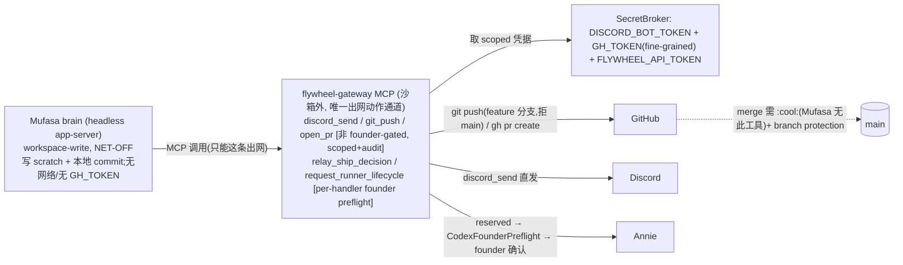

# Plan: Mufasa → write-capable Lead（(Z) net-off + gateway-proxied PR）+ roundtable 主动发言（④）

**Version**: v1.50.0（provisional）
**Issue**: FLY-350（困扰：Mufasa + Rafiki 在 #leads-roundtable 说不了话）
**Date**: 2026-06-20
**Revision**: R1（Annie informed override:Mufasa 自主写+开 PR）→ **(Z) net-off shell + gateway-proxied PR**（Tadashi 最终拍:shell 保持 net-off=exfil 最小,GH_TOKEN 在 gateway 不在 shell,gateway 代 push/开 PR;结构性化解 HIGH-1）。(Y) net-on 留作可选 flip 注释,非默认。
**Source**: 本 runner 真机实证（codex 0.141 源码 + FLY-245 net-off write-capable + gateway/CodexFounderPreflight + Codex Runner GH_TOKEN 模型 + Mufasa live config）;codex design review R1+R2;Tadashi mandate（A + B=(Z)）
**Status**: **codex-approved**（design review 4 轮:R1 7 + R2 6 + R3 5 全采纳;**R4 = APPROVED**,4 LOW 护栏 implement 时落地）→ 转 plan/new/,进 implement

> **范围（Tadashi mandate）**,两交付都以「真机验证 WORKING」收尾:
> - **A（④ roundtable）**:Mufasa 主动向 #leads-roundtable 发一条。
> - **B（写权限=(Z)）**:Mufasa = FLY-245 net-off write-capable（写文件 + 本地 git commit）+ **gateway 代 push / 开 PR**（自主开 PR,GH_TOKEN 在 gateway）。
> **红线（不放开）**:merge 到生产仍 founder-gated。(Z) 下 Mufasa **结构性**无法自 merge(shell net-off + 无 GH_TOKEN + gateway 无 :cool:/comment 工具)。

---

## 0. codex design review 处置（R1 + R2 全采纳；(Z) 化解 R2-1）

| # | sev | 处置（(Z) 下） |
|---|---|---|
| R1-1 | HIGH | net-off 不满足'开 PR' → **(Z) gateway 代 open_pr/git_push**(shell 仍 net-off)满足'开 PR' 且不开 shell 网络。 |
| R1-2 / R2-4 | HIGH/MED | ProjectConfig 加显式 write-capable 档 + **跨 config/runtime 共享 enum, runtime 见未知 fail-loud**（§3.5）。 |
| R1-3 | MED | gateway reserved 红线 = **per-handler CodexFounderPreflight**(gateway-main 直接 server.tool,非 dispatcher);新 open_pr/git_push/discord_send 非 founder-gated（§3.3）。 |
| R1-4 | MED | 抽 `discord-send-core.ts` 用 `postDiscordMessageToChannel`(chunk+`allowed_mentions:{parse:[]}`);幂等/限流 in-process（§3.2）。 |
| R1-5 | MED | gateway alias env 合同（§3.2）。 |
| R1-6 / R1-7 | LOW | resume 措辞 + dry-run/⑧ test fixture 到 5 件套（§2.5/§3.6）。 |
| **R2-1** | HIGH | `:cool:` workflow 非 founder-gated → net-on Mufasa 能自 merge。**(Z) 结构性消除**:shell net-off + 无 GH_TOKEN + gateway 无 comment/:cool: 工具 → Mufasa 无法发 :cool: → 不动 :cool: workflow。`:cool:` 预存洞 = **FLY-367**(单独,不阻塞)。 |
| R2-2 | HIGH | writableRoots **仅 scratch**(FLY-245 `resolveLeadWorkspace` 本就拒 `~/.flywheel`/state/CODEX_HOME/control-plane overlap;`assertConfinement` 恰一个 root)→ (Z) 直接满足,不引 Runner 的敏感 root（§3.1）。 |
| R2-3 | HIGH | GH_TOKEN fine-grained + **只在 gateway**(不在 shell):`contents:write`(分支)+`pull_requests:write`(建 PR);无 `issues:write`/workflows/actions/deployments/secrets/admin/no-bypass。gateway 只暴露 open_pr/git_push(无 generic comment)→ 模型无法借它 :cool:（§3.1/§3.3）。 |
| R2-5 | MED | (net-on ⑧ 措辞)**对 (Z) 不适用** —— net-off 下'gateway 是唯一出网动作通道'**重新成立**,保留原 invariant + empty/extra/missing fail-closed;工具面 EXACTLY 5 件套（§3.3）。 |
| R2-6 | LOW | discord_send 离红线:allowlist alias + metadata 审计;测不能 raw channelId/@everyone/不调 preflight/不写审批态（§6）。 |

### 0c. codex design review R3 处置（(Z) 方向确认正确；gateway-Git 硬化）
| # | sev | 处置 |
|---|---|---|
| R3-1 | HIGH | **git_push 绝不在 model worktree 跑**(model-writable = 恶意 repo-config/hooks/filter 在持 token 的 gateway 进程 RCE/exfil,FLY-245 ship-preflight 已踩)。改 **clean staging repo(writableRoots 外)+ 硬化 GitPushRunner**(绝对 git 路径/最小 env/无继承 config/trusted remote URL/显式 refspec/禁 hooks/credential-helper/url-rewrite/proxy/protocol-ext)。测恶意 pre-push/fsmonitor/credential.helper/insteadOf/proxy/protocol.ext/.gitattributes（§3.1/§6）。 |
| R3-2 | HIGH | **PR-CI 间接通道**:`open_pr` 触发 `ci.yml`(无 `permissions:` 块)→ CI GITHUB_TOKEN 可能成间接 comment/merge/dispatch 通道。修:pin pull_request workflow 到 `permissions: contents: read` + 负向 QA;shared-infra 触点,已 heads-up Tadashi(§3.3)。 |
| R3-3 | MED | GH_TOKEN scope **运行时探针校验**(actor + allowed/forbidden 矩阵,不打 token);缺失/不确定 fail-closed（§3.1/§6）。 |
| R3-4 | MED | `open_pr` 用 GitHub API 或显式 `--repo/--base/--head` + execFile + 最小 env,不让 gh 从 model-writable git config 推断（§3.1）。 |
| R3-5 | LOW | git_push/open_pr audit 绑精确 local head SHA + pushed SHA + PR# + actor;open_pr 幂等（§3.1/§6）。 |

### 0d. codex design review R4 = **APPROVED**（4 LOW 实现护栏,implement 时落地）
codex round-4 **APPROVED**(ready to implement)。4 条 LOW = 实现/code-review 护栏(非 blocker):
| # | 护栏 |
|---|---|
| R4-1 | **token 非持久化不变量**:GH_TOKEN 绝不进 staging repo config/remote URL/argv/audit/error text(workspace-write 无 read-deny,可读处有 token 即破)。优先 GitHub API 或可信内存凭据路;测断言 config/remote/audit/error/argv 永不含 token。 |
| R4-2 | **workflow 权限回归扫描**:加测/脚本扫 `.github/workflows/*`,任一 `pull_request` workflow 缺 `permissions: contents: read` 或给 write 即 fail;`pull_request_target` 标红 explicit review。 |
| R4-3 | **staging materialization SHA 契约**:`GitPushRunner` 文档写明 push 的是原 object SHA 还是 re-materialized commit SHA;audit 持久两个 SHA(差异则记 tree SHA)。 |
| R4-4 | **分支名全服务端派生**:从 lead/project/thread/head + 固定前缀派生,保守 refname regex 校验,拒模型任意 raw ref(git_push 非 founder-gated,分支名属 scope 边界)。 |

---

## 1. 背景与范围（R2→R1→(Y)→(Z)）
FLY-350:Mufasa 在 #leads-roundtable 说不了话。父设计 Option 1(content-coordination read-only-shell)。Annie informed override → Mufasa 自主写+开 PR。codex R1 指 FLY-245 write-capable 是 net-off(不能 PR)→ 一度走 (Y) net-on;codex R2 指 (Y) 撞 `:cool:` 非-founder-gated(自 merge 洞)+ 不能给 Lead 复制 Runner writableRoots。**Tadashi 最终拍 (Z)**:net-off shell(exfil 最小、复用 FLY-245)+ gateway 代 open_pr/git_push(GH_TOKEN 在 gateway)→ 满足'开 PR' 且结构性消除自 merge 风险。

---

## 2. 实证诊断

### 2.1 层2 outbound = direct（已解）
Mufasa 默认 `direct`(`codex-lead-runtime.ts:290`)→ 不撞 FLY-274 roundtable 403。

### 2.2 B = 复用 FLY-245 net-off write-capable（最小改 + 已审过的安全模型）
FLY-245 write-capable = `sandbox=workspace-write` + **net-off**(`buildConfinementArgv` `network_access=false`)+ writableRoots = 单一 scratch(`resolveLeadWorkspace` 拒 `~/.flywheel`/state/CODEX_HOME/control-plane overlap)+ gateway 唯一出网动作通道 + broker(secrets)+ inventory + ⑧ 断言。(Z) **直接复用**:Mufasa shell 能写文件 + 本地 `git commit`,**不能 push/PR/curl**(net-off)。HIGH-2 由 FLY-245 既有设计满足。

### 2.3 ④ roundtable + 开 PR = gateway 加 scoped 工具（GH_TOKEN 在 gateway）
- reactive(被 @ 回)+ FLY-267 cross-dept 入站:headless `wire()` 本就有 → 零回归。
- **proactive 发 roundtable** = gateway `discord_send`(net-off 下 shell 无法 curl,gateway 是唯一出网通道 → discord_send 是**真**唯一发 Discord 路,非'clean 路'软约束)。
- **开 PR** = gateway `git_push` + `open_pr`(GH_TOKEN 在 gateway 子进程,经 broker;模型经工具请求,自己 shell 拿不到 token、无网络)。

### 2.4 read-deny / exfil
`readDeny + workspace-write` parse 抛错(codex permission profile 不与 workspace-write 组合)→ read-deny 在 write-capable 下无法生效。但 **(Z) net-off** = shell 无网络 → **exfil 面本就最小**(不能外发);protection = net-off + writableRoots 仅 scratch + gateway 唯一出网通道。Annie '单一可信受众' 已覆盖残余面。

### 2.5 codex 源码佐证（resume 安全,措辞 per R1-6）
headless 经 CLI-argv 注入 gateway MCP = 进程级 `cli_overrides`,`thread_resume` 重新 derive config 时**再应用** + `effective_mcp_servers`(core/src/codex.rs:1082,Resumed+New 都走)→ resumed thread(019eaf5d)拿得到 gateway 工具(含新 open_pr/git_push/discord_send)+ 保记忆。**非**'config.toml 在 resume 被普遍忽略'(ConfigBuilder 仍加载 CODEX_HOME 层);要点 = 进程级 override 不依赖 daemon 重启。

---

## 3. 设计

### 3.1 B（(Z) net-off write-capable + gateway-proxied PR）
- **shell**:复用 FLY-245 `assertWriteCapableRelease` + net-off `buildConfinementArgv` + writableRoots 仅 scratch(R2-2 既满足)。shell 能写 scratch 文件 + 本地 git commit;**无网络、无 GH_TOKEN**。
- **gateway 加 `git_push` + `open_pr`**(`gateway-main.ts`,server.tool)—— **硬化设计(R3-1/R3-4/R3-5,关键:model-writable worktree = RCE 面)**:
  - **git_push 绝不在 model worktree 内跑**(R3-1):model scratch worktree 可被模型写恶意 repo-local git config / hooks / filter driver / `.gitattributes` → 在持 GH_TOKEN+secrets 的 gateway 进程里**执行任意代码 / 外泄 token**(FLY-245 `ship-preflight.ts` 已踩此课:只 `rev-parse HEAD`、避 `git status`)。**改用 gateway 自有 clean staging repo**(部署在 **writableRoots 外**):从 model HEAD 取已 commit 的 tree(`rev-parse` 拿 validated head SHA,**不执行 filter/hook**),materialize 到 clean repo,从 clean repo push 到**服务端派生的 GitHub URL + 派生分支**。
  - **硬化 `GitPushRunner`**:绝对 `git` 路径、最小 env(仅 GH_TOKEN)、**无继承 config**(`GIT_CONFIG_GLOBAL=/dev/null GIT_CONFIG_SYSTEM=/dev/null`)、显式 trusted remote URL(非 repo `origin`)、显式 `<validatedHeadSha>:refs/heads/<derivedBranch>`、no force、hooks 禁(`core.hooksPath=/dev/null`)、credential-helper 禁、proxy/url-rewrite(`insteadOf`)/protocol.ext/ssh-helper 全禁。**拒 main/protected、拒 force、ref 由 gateway 派生不信模型任意值**。
  - **实现基础(已定位,续做用)**:复用 `ship-preflight.ts` 的 `resolveTrustedGitPath` + `makeTrustedGitRunner` + `GIT_SAFE_CONFIG`(已 codex-approved:`-c core.fsmonitor=false / core.hooksPath=/dev/null / core.pager=cat / core.sshCommand=false / core.askpass=false / protocol.ext.allow=never`,`-c` 压过 repo-local config + 最小 env)。`GitPushRunner` = 在此 runner 基础上**扩 push 专属安全 `-c`**(`credential.helper=`、不可设 `url.*.insteadOf`、`http.proxy=`)+ **token 非持久(R4-1)**:GH_TOKEN **绝不**进 remote URL/argv/config/audit —— 经一次性 `GIT_ASKPASS` 小脚本(token 在子进程 env,不入 argv/磁盘)或临时 `http.extraheader` config 文件(用后删),择 codex-code-review 认可者。**object 转移新攻击面**:在 writableRoots 外的 clean staging repo,先以硬化 runner `rev-parse HEAD` 取 validated SHA,再 fetch/materialize 该 SHA —— model 侧 local-config 的 `uploadpack.packObjectsHook` 等 fetch-时 exec 面需一并 `-c` 中和(这是 push 维度比 read-only `rev-parse` **新增**的攻击面,实现+测试必须精确覆盖)。
  - **open_pr 优先 GitHub API(R3-4)**(非 `gh` 从本地 state 推断 repo/head/base);若用 `gh`:绝对 binary + `execFile` + 显式 `--repo owner/repo --base main --head owner:derived-branch --title --body` + 最小 env(仅 GH_TOKEN)+ 不依赖 cwd/repo config。**scoped 到本 Lead project repo**。
  - **GH_TOKEN 契约(R2-3)**:fine-grained token / GitHub App,**仅** `contents:write`(分支)+ `pull_requests:write`(建 PR);**无** `issues:write`(=不能评论/不能 :cool:)、workflows/actions/deployments/environments/secrets/admin、无 branch-protection bypass。**只在 gateway,绝不进 shell env**。
  - **运行时 scope 探针(R3-3)**:启动/dry-run **探针校验** token actor + allowed/forbidden 矩阵(不打 token);**缺失/不确定 → fail-closed**(不只文档化)。
  - **audit(R3-5)**:每次 git_push/open_pr 写审计行 = lead id / thread id / repo / 派生分支 / **local head SHA** / pushed remote SHA / PR number+URL / token actor / outcome。`open_pr` 对派生分支/既有 PR 幂等;`git_push` 更新既有 PR 分支时报告。
- **release gate 扩**:`assertWriteCapableRelease` 补 GH_TOKEN 来源(broker secret)+ scope 契约;danger-full-access 永拒;net-off 保持(不引 net-on)。

### 3.2 A（④ roundtable）— gateway discord_send（抽共享 core, R1-4/R1-5）
- **共享 core**:抽 `discord-send-core.ts` = `resolveChannelAlias`(复用 `lead-actions/alias-allowlist.ts`,服务端 alias→channelId,拒裸 id/未知/0或多 cross-dept)+ `postDiscordMessageToChannel`(chunk + `allowed_mentions:{parse:[]}`)+ **in-process** 限流/幂等(诚实标 in-process)+ metadata 审计(不记正文)。lead-actions-main 与 gateway 共用。
- **gateway 注册** `discord_send(target:"chat"|"roundtable", text)` → 调共享 core;bot token 经 gateway broker 取。
- **alias env 合同(R1-5)**:`GatewayConfig` + `codex-lead-runtime.ts` gateway env 加 `FLYWHEEL_LEAD_CHAT_CHANNEL_ID` + `FLYWHEEL_LEAD_CROSS_DEPT_CHANNEL_IDS`(非密)。`chat`=chat channel;`roundtable`=恰一个 cross-dept 或显式 pin。
- **防重复合同**:proactive 发某频道后,来源频道只回简短 ack。

### 3.3 红线 + ⑧（R1-3 + R2-1 + R2-5）
- **reserved 动作 founder-gated**(不变,R1-3):`relay_ship_decision`/`request_runner_lifecycle` handler 内调 `CodexFounderPreflight`/lifecycle consent(gateway-main 直接 server.tool,非 dispatcher)。
- **新工具非 founder-gated但 scoped+audit**:`discord_send`(alias allowlist)、`git_push`(feature 分支,拒 main)、`open_pr`(建 PR≠merge)。**这些不触 merge 红线**:开 PR/push 分支 ≠ merge to main。
- **merge 红线结构性成立(R2-1 化解)**:Mufasa shell net-off + 无 GH_TOKEN + gateway **无 comment/:cool: 工具** → **无法发 :cool:、无法 `gh pr merge`** → 不能自 merge to main。branch protection 仍在。`:cool:` workflow 本身 founder-gate 加固 = **FLY-367**(独立,不阻塞本 issue)。
- **PR-CI 间接通道闸(R3-2,关键 — Tadashi 裁定:本 issue 内做)**:`open_pr` 触发 `.github/workflows/ci.yml`,该 workflow **无显式 `permissions:` 块** → 用 repo 默认 GITHUB_TOKEN 权限;若默认含 write/comment,**模型写的 PR 代码/workflow 改动能借 CI 的 GITHUB_TOKEN 间接 comment/merge/dispatch** → 绕过'结构上不能 :cool:'。**这是 (Z) 红线的真前提,不 pin 则 (Z) 不 airtight,故归 FLY-350 自己做(非 FLY-367 —— 那是单独的 :cool: ship-workflow 洞)**:pin 所有 `pull_request` workflow 到最小权限(default-deny + 只给 CI 需要的最小 read/checks,如 `permissions: contents: read`,无 issues/pull-requests/actions/deployments/contents:write)。负向 QA 证 CI 不能 comment/dispatch/push/merge;**正向回归(shared-infra 必验):pin 后正常 PR 的 CI 仍绿**(所有 PR 走 ci.yml,不破其他 runner)。Tadashi 已知会 Annie 此触点。
- **⑧(R2-5,net-off 下原 invariant 成立)**:'gateway 是唯一出网动作通道' **(Z) 下为真**(shell net-off)→ 保留;`GATEWAY_ACTION_TOOL_NAMES` = EXACTLY 5 件套 `{request_runner_lifecycle, relay_ship_decision, discord_send, git_push, open_pr}`;empty/extra/missing fail-closed。非-MCP surfaces(apps/connectors/web_search/hooks/multi_agent/login)仍 disable(FLY-245 既有)。
- **不碰** `decisionMode`。

### 3.4 数据流

### 3.5 显式 write-capable 档 + 跨 config/runtime fail-loud（R1-2 + R2-4）
- 加显式能力档(`codexProfile:"write-capable"` 或等价)。**一份共享 profile 类型贯穿 ProjectConfig + fleet-capabilities + launcher env + `parseCodexLeadRuntimeConfig`**;runtime 见未知 profile **fail loud**(别静默当 companion)。
- cross-field 不变量:`backend:"codex-app-server"` + `write-capable` 要求 `sandbox=workspace-write` + `readDeny=false` + **net-off** + gateway release inputs(含 GH_TOKEN 来源)+ `companion!==true` + 不与 content-coordination 混 + `canSpawnRunners:false`(到 FLY-251);companion/content-coordination 仍 read-only;未知 fail-closed;danger 永拒。
- 同步 `fleet-capabilities.ts` + Dashboard 文案;projects.json + launcher env + runtime 作一可审计契约。

### 3.6 dry-run（R1-7）
write-capable (Z) 模式显示:gateway MCP + 5 件套工具面 + sandbox=workspace-write + **network=OFF** + writableRoots(仅 scratch)+ GH_TOKEN 来源(broker, gateway-only, 不打值) + GH actor/权限类。

---

## 4. 改动文件清单
| 文件 | 改动 |
|---|---|
| `gateway/gateway-main.ts` | 注册 `git_push` / `open_pr` / `discord_send`(scoped+audit,调共享 core + broker GH/bot token);`GatewayConfig` 加 channel 坐标 + repo/worktree 上下文 |
| `gateway/GitPushRunner.ts`(新) | 硬化 git push:clean staging repo(writableRoots 外)+ 绝对 git/最小 env/无继承 config/trusted URL/显式 refspec/禁 hooks/helper/rewrite/proxy/protocol-ext(R3-1);open_pr GitHub API/显式 args(R3-4);token scope 探针(R3-3);audit 绑 head SHA(R3-5) |
| `.github/workflows/ci.yml`(+ 其他 pull_request workflow) | pin `permissions: contents: read`(R3-2,最小权限,防 CI 间接动作通道) |
| `discord-send-core.ts`(新) | 抽共享:alias + postDiscordMessageToChannel + in-process 限流/幂等 + metadata 审计 |
| `lead-actions/lead-actions-main.ts` | 改用共享 core(行为不变) |
| `action-surface.ts` | `GATEWAY_ACTION_TOOL_NAMES` = 5 件套 |
| `codex-lead-runtime.ts` | gateway env 加 channel/repo 坐标 + GH_TOKEN 经 broker(gateway-only);release gate 补 GH_TOKEN 来源/scope;dryRunReport;**保持 net-off** |
| `ProjectConfig.ts` + `fleet-capabilities.ts` + 共享 profile 类型 | 显式 write-capable 档 + cross-field + runtime fail-loud |
| Mufasa launcher（`run-codex-lead-mufasa.sh` + wrapper/plist) | TUI→headless + net-off write-capable release env + GH_TOKEN 经 broker(不进 shell) |
| `__tests__/*` | git_push/open_pr scope(拒 main/force/raw ref)+ audit;discord_send(alias/拒/限流/echo/幂等/raw-id/@everyone/不调 preflight/不写审批态);⑧ 5 件套;red-line(reserved 调 preflight, 新工具不调);GH_TOKEN 负向(merge/push-main/workflow/dispatch/:cool: 全失败);ProjectConfig+runtime fail-loud;字节兼容 |

---

## 5. 验证（④ + B done 判据；founder-gated 部分 Tadashi/Annie 执行）
真机（founder-gated 重启,Annie 在场）:
- [ ] **A**:Mufasa 主动发 #leads-roundtable;被 @ reactive 回 roundtable 零回归;#mufasa 零回归;无重复。
- [ ] **B 写+PR**:Mufasa 写 scratch 文件 + 本地 commit;经 gateway `git_push` push feature 分支 + `open_pr` **真开一个 PR**(自主)。
- [ ] **红线**:Mufasa **无法** :cool:/`gh pr merge`(shell net-off+无 token+gateway 无 comment 工具);`git_push` 拒 main;reserved(ship/lifecycle)经 founder 确认。
- [ ] **GH_TOKEN 负向**:gateway token 不能 merge/改 workflow/dispatch/评论。
- [ ] **⑧**:工具面 EXACTLY 5 件套;多/少/empty fail-closed。
- [ ] **记忆延续**:thread `019eaf5d` 逐字一致。
- [ ] TUI 回退已知(headless)。
- [ ] codex design review APPROVED + code review APPROVED + 独立 QA PASS。

---

## 6. 测试计划（TDD）
- **net-off confinement**:write-capable (Z) 生成 `network_access=false` + writableRoots 仅 scratch;GH_TOKEN 不在 shell env;`assertConfinement` 恰一 root + 负向 overlap(`~/.flywheel`/CommDB/CODEX_HOME 等落入即 throw)。
- **git_push/open_pr scope**:拒 push main/protected、拒 force、拒模型任意 ref;open_pr 限本 repo base=main;audit 行写入(local+pushed SHA+PR#+actor)。
- **GitPushRunner 硬化(R3-1,关键)**:在 model worktree 植入恶意 `pre-push` hook / `core.fsmonitor` / `credential.helper=!cmd` / `url.*.insteadOf` / `http.proxy` / `protocol.ext` / `.gitattributes` filter driver → **gateway push 路径绝不执行它们**(clean staging repo + 无继承 config + 禁 hooks/helper/rewrite);证 token 不外泄、无代码执行。
- **open_pr 不信本地 state(R3-4)**:恶意本地 remote/config 不能改 repo/head/base(API 或显式 --repo/--base/--head)。
- **GH_TOKEN scope 探针(R3-3)**:探针校验 actor + allowed/forbidden 矩阵;缺失/不确定 → write-capable 启动 fail-closed。
- **PR-CI 权限(R3-2)**:pull_request workflow `permissions: contents: read`(default-deny + 只给 CI 需要的最小 read/checks);负向 QA PR 证 CI 不能 comment/dispatch/push/merge。**正向回归(Tadashi 强调,shared-infra)**:pin 后**正常 PR 的 CI 仍绿** —— 所有 PR 走 ci.yml,必须证不 break 其他 runner 的 CI(实跑一个普通 PR 看 checks 全过)。
- **R4 护栏**:(R4-1) staging repo config/remote/argv/audit/error **永不含 GH_TOKEN**(断言);(R4-2) `.github/workflows/*` 扫描器:`pull_request` workflow 缺 `contents: read`/给 write/`pull_request_target` → fail;(R4-3) `GitPushRunner` materialization SHA 契约 + audit 双 SHA;(R4-4) 分支名服务端派生 + refname regex,拒模型 raw ref。
- **GH_TOKEN 负向(真机/集成)**:gateway token 试 `gh pr merge`/push main/改 workflow/dispatch/`:cool:` 评论 → 全失败;dry-run 显示 actor+权限类不打 token。
- **discord_send / 共享 core**:alias 对/未知/0/多→fail-closed;限流;echo 不自激;同轮幂等;raw channelId 拒;`@everyone`/role 拒;不调 CodexFounderPreflight;不写 CommDB/StateStore 审批态;core 被 lead-actions 与 gateway 共用一致。
- **⑧**:5 件套过,多/少/empty throw;非-MCP surfaces disabled。
- **red-line**:`relay_ship_decision`/`request_runner_lifecycle` handler 调 preflight(无确认不 dispatch);新 3 工具不调 preflight。
- **ProjectConfig + runtime**:三档解析 + 混档/未知 **config 与 runtime 都 fail-loud** + danger 永拒;fleet-capabilities 同步;launcher/runtime profile 一致。
- **release gate**:缺任一(含 GH_TOKEN 来源/scope)fail-closed。
- **字节兼容**:read-only Codex Lead(Belle)+ FLY-245 既有 net-off write-capable 路不回归。

命令:`pnpm --filter flywheel-teamlead test`;push 前 `pnpm -r lint`。

---

## 7. 部署（founder-gated — Tadashi/Annie 执行）
1. Mufasa launcher TUI→headless + net-off write-capable release env + GH_TOKEN 经 broker(gateway-only)。
2. projects.json → write-capable 档;config.toml read-deny 移除(与 workspace-write 冲突)。
3. **重启 Mufasa**(headless,resume 019eaf5d)。
4. §5 真机验证。
> merge 仍 founder-gated。部署效果独立 QA 验。

---

## 8. 回滚（每步可逆,一次重启）
| 层 | 回滚 |
|---|---|
| gateway 新工具 | 代码可逆;`GATEWAY_ACTION_TOOL_NAMES` 移除 git_push/open_pr/discord_send |
| write-capable | launcher 去 workspace-write env → read-only companion |
| runtime | launcher 改回 TUI 恢复 FLY-278 |
| projects.json / config.toml | 还原 `.bak` |

---

## 9. 开放项 / 依赖
- **FLY-367**:`:cool:` workflow 本身 founder-gate(现存洞,独立,不阻塞本 issue —— (Z) 已结构性使 Mufasa 不能 :cool:)。
- **FLY-251**(未完):Codex Lead 真起 Runner → canSpawnRunners 本期 false。
- **FLY-245**(Done):net-off write-capable + gateway + CodexFounderPreflight + broker —— 复用骨架。
- **headless vs TUI**:(Z)=headless(丢 FLY-278 TUI);Tadashi 同步 Annie。
- **(Y) net-on**:留作可选 flip(注释),非默认。
- **GitHub branch protection on main** + GH_TOKEN fine-grained 供给 —— 部署前确认。
