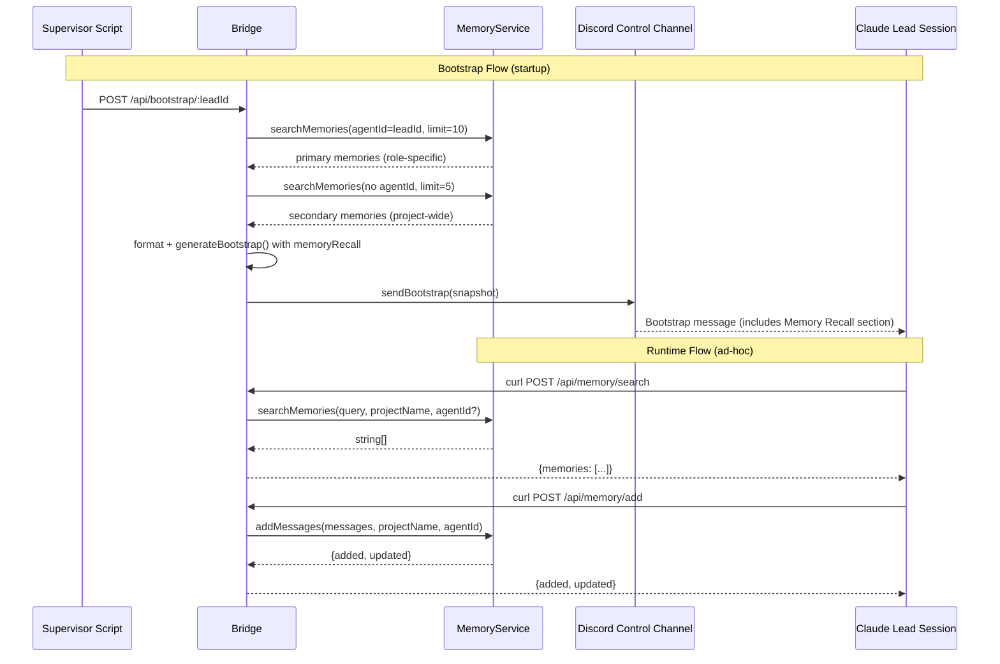

# Plan: Claude Lead mem0 Memory Integration

**Version**: v1.7.0
**Issue**: GEO-203
**Date**: 2026-03-22
**Source**: `doc/engineer/exploration/new/GEO-203-claude-lead-mem0-memory.md`, `doc/engineer/research/new/GEO-203-claude-lead-mem0-memory.md`
**Status**: codex-approved (8 rounds, override — design stable since Round 2)

## Overview

给 Claude Lead session 接入 mem0 记忆读写能力。两个维度：

1. **Bootstrap recall** — 启动时 Bridge server-side 预加载分层记忆（角色优先 + 全局补充）
2. **Runtime access** — Claude Lead 通过 Bash curl 直调 Bridge Memory API 进行 ad-hoc 读写

方案决策: **Bash curl 直调 Bridge API**（非 MCP server），理由见 exploration。

## Architecture



## Implementation Steps

### Step 1: Memory route — agent_id optional for search (TDD)

**文件**: `packages/teamlead/src/bridge/memory-route.ts`
**测试**: `packages/teamlead/src/__tests__/memory-route.test.ts`

**改动**:
- `/api/memory/search`: `agent_id` 从必填改为可选。传了则过滤；不传则搜索全 project。
- `/api/memory/add`: `agent_id` 保持必填（写入必须标记来源）。

**测试先行**:
1. 新增 test case: search without `agent_id` → 200 + memories
2. 新增 test case: search with empty string `agent_id` → 仍然 400（空字符串 ≠ 未传）
3. 验证现有 test cases 不受影响

**代码改动**:
```typescript
// memory-route.ts — search endpoint validation
// Before:
if (!isNonEmptyString(agent_id)) {
  res.status(400).json({ error: "agent_id must be a non-empty string" });
  return;
}

// After:
// agent_id is optional for search — omit to search all agents
if (agent_id !== undefined && !isNonEmptyString(agent_id)) {
  res.status(400).json({ error: "agent_id must be a non-empty string if provided" });
  return;
}
```

调用 MemoryService 时：`agentId: agent_id || undefined`（空字符串视为未传）。

### Step 2: Bootstrap generator — layered recall (TDD)

**文件**: `packages/teamlead/src/bridge/bootstrap-generator.ts`
**测试**: `packages/teamlead/src/__tests__/bootstrap-generator.test.ts`

**改动**:

2a. 添加 `memoryService` 可选参数：

```typescript
export async function generateBootstrap(
  leadId: string,
  store: StateStore,
  projects: ProjectEntry[],
  memoryService?: MemoryService,  // 新增
): Promise<LeadBootstrap>
```

2b. 新增 `recallMemories()` helper — 使用 `searchMemories()` 直接调用（非 `searchAndFormat()`），控制每层 limit 并统一格式化：

```typescript
async function recallMemories(
  memoryService: MemoryService,
  leadId: string,
  projects: ProjectEntry[],
): Promise<string | null> {
  const projectName = findProjectForLead(leadId, projects);
  if (!projectName) return null;

  const RECALL_TIMEOUT_MS = 10_000; // 10s per query, ~20s worst-case total (both timeout)

  // Primary: 角色记忆 (limit 10) — must-have
  let primary: string[] = [];
  try {
    primary = await withTimeout(
      memoryService.searchMemories({
        query: "recent decisions, project context, and learnings",
        projectName,
        agentId: leadId,
        limit: 10,
      }),
      RECALL_TIMEOUT_MS,
    );
  } catch (err) {
    console.warn(`[bootstrap] Primary memory recall failed for ${leadId}: ${
      err instanceof Error ? err.message : String(err)
    }`);
  }

  // Secondary: 全局记忆 (limit 5, no agentId) — best-effort supplement
  let secondary: string[] = [];
  try {
    secondary = await withTimeout(
      memoryService.searchMemories({
        query: "cross-team context and project-wide decisions",
        projectName,
        limit: 5,
      }),
      RECALL_TIMEOUT_MS,
    );
  } catch (err) {
    console.warn(`[bootstrap] Secondary memory recall failed for ${leadId}: ${
      err instanceof Error ? err.message : String(err)
    }`);
  }

  // Dedup: secondary 去除与 primary 重叠的记忆
  const primarySet = new Set(primary);
  const uniqueSecondary = secondary.filter(m => !primarySet.has(m));

  if (primary.length === 0 && uniqueSecondary.length === 0) return null;

  const sections: string[] = [];
  if (primary.length > 0) {
    sections.push("### Role-Specific Memory");
    sections.push(...primary.map(m => `- ${m}`));
  }
  if (uniqueSecondary.length > 0) {
    sections.push("### Project-Wide Context");
    sections.push(...uniqueSecondary.map(m => `- ${m}`));
  }
  return sections.join("\n");
}
```

**关键设计决策**:
- 使用 `searchMemories()` 而非 `searchAndFormat()` — 前者支持 `limit` 参数，后者不支持。
- 本地统一格式化，避免 `searchAndFormat()` 的 `<project_memory>` 包裹重复出现。
- 每次 `searchMemories()` 单独 `withTimeout(10s)` + try/catch — primary 和 secondary 独立降级，secondary 失败不影响 primary。最坏情况（两个都超时）约 20s，正常情况 2-5s。
- 复用 `memory-route.ts` 中已有的 `withTimeout()` 模式（或内联等价实现）。

2c. 在 `generateBootstrap()` 中调用：

```typescript
const memoryRecall = memoryService
  ? await recallMemories(memoryService, leadId, projects)
  : null;

return {
  leadId,
  // ... 其他字段不变
  memoryRecall,
};
```

**测试先行**:
1. 无 memoryService → `memoryRecall: null`（向后兼容）
2. 有 memoryService, primary + secondary 都返回内容 → 合并格式，包含两个 section header
3. 有 memoryService, primary 有内容, secondary 空 → 只有 role-specific section
4. 有 memoryService, 两个都空 → `memoryRecall: null`
5. memoryService 抛异常 → `memoryRecall: null`，其他 bootstrap 字段正常
6. memoryService primary 超时但 secondary 成功 → 返回 project-wide only（graceful degradation）
7. memoryService secondary 超时但 primary 成功 → 返回 role-specific only
8. secondary 含 primary 重复项 → 去重后只渲染唯一内容

### Step 3: Bootstrap formatting — remove truncation (TDD)

**文件**: `packages/teamlead/src/bridge/claude-discord-runtime.ts`
**测试**: `packages/teamlead/src/__tests__/claude-discord-runtime.test.ts`

**改动**: 移除 `formatBootstrap()` 中 `memoryRecall` 的 500 字符截断。

```typescript
// Before:
sections.push(snapshot.memoryRecall.slice(0, 500));

// After:
sections.push(snapshot.memoryRecall);
```

`splitMessage()` 已经在 `sendBootstrap()` 中处理 Discord 2000 字符分片，无需手动截断。

**测试先行**:
1. 新增 test case: `memoryRecall` 长度 > 1900 字符 → `sendBootstrap()` 产生多次 Discord POST
2. 验证分片后每个 chunk 包含完整的行（不会在行中间截断）
3. 验证第一个 chunk 包含 `### Memory Recall` header

### Step 4: Plugin.ts — pass memoryService to bootstrap

**文件**: `packages/teamlead/src/bridge/plugin.ts`

**改动**: 在 bootstrap endpoint handler 中传 `memoryService` 给 `generateBootstrap()`。

```typescript
// plugin.ts bootstrap endpoint (line ~590)
// Before:
const snapshot = await generateBootstrap(leadId, store, projects);

// After:
const snapshot = await generateBootstrap(leadId, store, projects, memoryService);
```

`memoryService` 已经通过 `createBridgeApp()` 参数可用。改动极小。

**测试**: 补一个 bootstrap endpoint wiring test — 用 stub `LeadRuntime` 捕获 `sendBootstrap(snapshot)` 入参，断言 `snapshot.memoryRecall` 在 memoryService 可用时被填充。这是 memoryService → bootstrap 的唯一接点，需要覆盖。

**测试文件**: `packages/teamlead/src/__tests__/bootstrap-endpoint.test.ts`（新建或合入现有 bridge test）

### Step 5: Claude Lead CLAUDE.md — Memory section

**文件**: `geoforge3d/product/.lead/claude-lead/CLAUDE.md`

**交付方式**: 此改动在 **geoforge3d repo** 中直接编辑。geoforge3d repo 是 Claude Lead 行为配置的 **source of truth**（Lead session 从该目录启动，直接读取此文件）。不在 flywheel repo 维护模板。

**改动**: 在 "工具 > Bridge API" 表之后添加 "记忆" section。

**Bridge API 表新增行**:

| Endpoint | Method | 用途 |
|----------|--------|------|
| `/api/memory/search` | POST | 搜索项目记忆 |
| `/api/memory/add` | POST | 写入记忆 |

**新增 "记忆" section**:

```markdown
## 记忆

你可以通过 Bridge Memory API 读写项目记忆。记忆帮助你保持跨 session 的连续性。
Bootstrap 启动时已预加载部分记忆，你可以按需追加搜索。

### 何时搜索记忆

- 做重要决策前（approve/reject/retry），回顾相关 issue 的历史
- CEO 问你上下文时，先查记忆
- 对某个 issue 不确定时，搜索相关记忆

### 何时写入记忆

**Must-write（每次都写）**:
- 做完重要决策后（approve/reject/retry + 理由）
- 发现新的项目约束或 pattern
- CEO 给出关键指示

**自主判断**: 任何你认为未来会有参考价值的信息

### 搜索记忆（本角色）

  curl -s -X POST http://localhost:9876/api/memory/search \
    -H "Authorization: Bearer $TEAMLEAD_API_TOKEN" \
    -H "Content-Type: application/json" \
    -d '{"query":"describe what you want to find", "project_name":"geoforge3d", "agent_id":"product-lead"}'

### 搜索记忆（全局，跨 agent）

  curl -s -X POST http://localhost:9876/api/memory/search \
    -H "Authorization: Bearer $TEAMLEAD_API_TOKEN" \
    -H "Content-Type: application/json" \
    -d '{"query":"describe what you want to find", "project_name":"geoforge3d"}'

### 写入记忆

  curl -s -X POST http://localhost:9876/api/memory/add \
    -H "Authorization: Bearer $TEAMLEAD_API_TOKEN" \
    -H "Content-Type: application/json" \
    -d '{"messages":[{"role":"user","content":"context"},{"role":"assistant","content":"decision and reasoning"}], "project_name":"geoforge3d", "agent_id":"product-lead"}'
```

### Step 6: Integration verification

**Build**: 先确保产物是最新的 — `pnpm -r build`。`scripts/run-bridge.ts` 导入的是 `packages/*/dist`，不是 src。

**Preflight — MemoryService**: 启动 Bridge（`npx tsx scripts/run-bridge.ts`），检查启动日志包含 `"[run-bridge] Memory service enabled"`。如果未出现，确认以下环境变量已设置：
- `GOOGLE_API_KEY`
- `SUPABASE_URL`
- `SUPABASE_KEY`（注意：Bridge 初始化只读取 `SUPABASE_KEY`，不接受 `SUPABASE_SERVICE_ROLE_KEY`）

**Preflight — Runtime Registration**: 确认启动日志包含 `"RuntimeRegistry: N lead runtime(s) registered"`。Bootstrap endpoint 需要目标 lead 已注册 runtime。如果 `product-lead` 配置为 `claude-discord` runtime，需确保：
- 项目配置中 `product-lead` 有 `runtime: "claude-discord"` 和非空 `controlChannel`
- 环境变量 `DISCORD_BOT_TOKEN` 已设置

**退化行为**: 如果 MemoryService 未启用，bootstrap `memoryRecall` 为 `null`，`/api/memory/*` 路由返回 404。这是预期行为，非实现错误。

手动验证步骤：

1. **Seed 已知记忆**（确保 mem0 中有内容供 bootstrap recall）:
   ```bash
   curl -s -X POST http://localhost:9876/api/memory/add \
     -H "Authorization: Bearer $TEAMLEAD_API_TOKEN" \
     -H "Content-Type: application/json" \
     -d '{"messages":[{"role":"user","content":"GEO-203 test: project uses TypeScript monorepo with Bridge API"},{"role":"assistant","content":"Noted. Bootstrap memory recall integration test."}],"project_name":"geoforge3d","agent_id":"product-lead"}'
   ```

2. **Bootstrap 验证**:
   - 调用:
     ```bash
     curl -s -X POST http://localhost:9876/api/bootstrap/product-lead \
       -H "Authorization: Bearer $TEAMLEAD_API_TOKEN" \
       -H "Content-Type: application/json"
     ```
   - 确认 response `delivered: true`（endpoint 不返回 memoryRecall 内容）
   - **检查 Discord 控制频道**收到的 bootstrap 消息，确认包含 "### Memory Recall" section 且包含 seed 的内容

3. **Runtime search 验证（带 agent_id）**:
   ```bash
   curl -s -X POST http://localhost:9876/api/memory/search \
     -H "Authorization: Bearer $TEAMLEAD_API_TOKEN" \
     -H "Content-Type: application/json" \
     -d '{"query":"recent decisions","project_name":"geoforge3d","agent_id":"product-lead"}'
   ```
   确认返回 200 + `{memories: [...]}`.

4. **Runtime search 验证（无 agent_id，跨 agent）**:
   ```bash
   curl -s -X POST http://localhost:9876/api/memory/search \
     -H "Authorization: Bearer $TEAMLEAD_API_TOKEN" \
     -H "Content-Type: application/json" \
     -d '{"query":"recent decisions","project_name":"geoforge3d"}'
   ```
   确认返回 200（无 agent_id 过滤，返回全 project 记忆）。

5. **Runtime write 验证**:
   ```bash
   curl -s -X POST http://localhost:9876/api/memory/add \
     -H "Authorization: Bearer $TEAMLEAD_API_TOKEN" \
     -H "Content-Type: application/json" \
     -d '{"messages":[{"role":"user","content":"test memory write"},{"role":"assistant","content":"acknowledged"}],"project_name":"geoforge3d","agent_id":"product-lead"}'
   ```
   确认返回 `{added: 1, updated: 0}`。

## File Change Summary

| File | Change Type | Lines (est.) |
|------|------------|-------------|
| `packages/teamlead/src/bridge/memory-route.ts` | modify | ~5 |
| `packages/teamlead/src/bridge/bootstrap-generator.ts` | modify | ~45 |
| `packages/teamlead/src/bridge/claude-discord-runtime.ts` | modify | ~2 |
| `packages/teamlead/src/bridge/plugin.ts` | modify | ~2 |
| `packages/teamlead/src/__tests__/bootstrap-endpoint.test.ts` | add | ~40 |
| `packages/teamlead/src/__tests__/memory-route.test.ts` | modify | ~30 |
| `packages/teamlead/src/__tests__/bootstrap-generator.test.ts` | modify | ~80 |
| `packages/teamlead/src/__tests__/claude-discord-runtime.test.ts` | modify | ~40 |
| `geoforge3d/product/.lead/claude-lead/CLAUDE.md` | modify (external repo) | ~50 |

**总计**: ~295 行改动（含测试），7 个 flywheel 文件 + 1 个 geoforge3d 文件。

## Out of Scope

- MCP server 构建（决策排除）
- OpenClaw Lead TOOLS.md 更新（已有 Memory API 文档）
- mem0 数据清理 / schema 变更
- 跨项目记忆共享
- Memory API rate limiting
- Supervisor script 改动（不需要）

## Risks & Mitigations

| Risk | Impact | Mitigation |
|------|--------|-----------|
| Bootstrap 启动延迟（两次 mem0 搜索） | 正常 2-5s，最坏 ~20s | 每次搜索独立 `withTimeout(10s)` + try/catch，单次超时不影响另一次。两个都超时仍返回部分结果或 null |
| Discord 消息过长 | 分片过多影响可读性 | `splitMessage()` 已有；实测后如有必要可加 soft limit |
| Claude 不主动用 memory | 记忆能力形同虚设 | CLAUDE.md 明确指导 must-write 节点 + 初期观察调整 |
| agent_id 可选打破现有测试 | 测试回归 | Step 1 TDD 覆盖 |
| MemoryService 未启用 | bootstrap recall 和 API 均不可用 | Preflight 检查 + 文档说明退化行为 |

## Dependencies

- GEO-198 (PR #36) ✅ 已合并 — Bridge Memory API 存在
- GEO-195 (PR #37) ✅ 已合并 — Claude Discord Runtime + Bootstrap 存在
- MemoryService 正确初始化（需 GOOGLE_API_KEY + SUPABASE_URL + SUPABASE_KEY）

## Effort Estimate

**总计**: ~1 天

| Step | Effort |
|------|--------|
| Step 1: memory-route agent_id 可选 + tests | 0.5h |
| Step 2: bootstrap layered recall + tests | 2.5h |
| Step 3: remove truncation + tests | 0.5h |
| Step 4: plugin.ts wiring | 0.25h |
| Step 5: CLAUDE.md Memory section | 1h |
| Step 6: integration verification | 1h |
