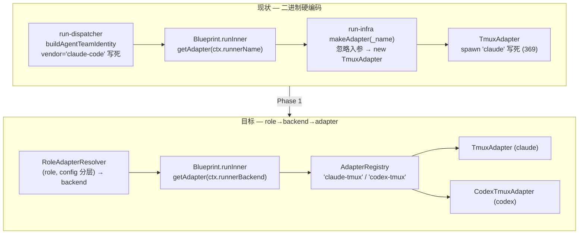
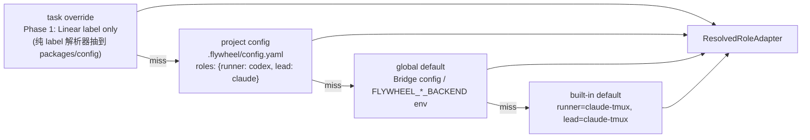
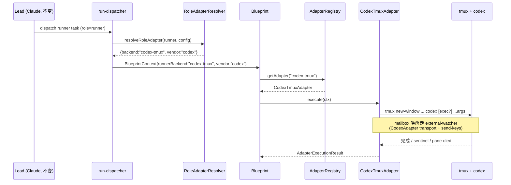
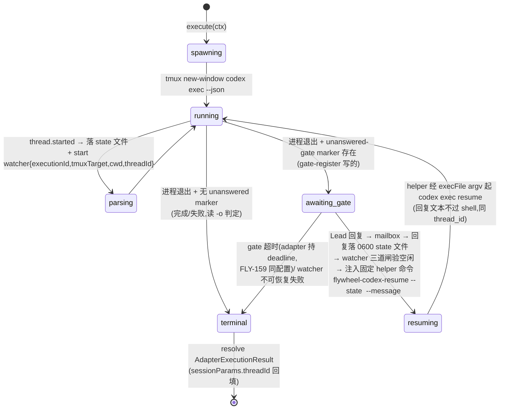

# Plan: Vendor-Neutral Agent Runtime — Decouple Flywheel from Claude Code

**Version**: v2.0 (rev 6 — Codex design review APPROVED)
**Issue**: FLY-123 ([Architecture] Decouple Flywheel from Claude Code — enable hybrid agent runtime)
**Date**: 2026-06-01(初稿)/ 2026-06-03(rev 2 Spike-δ 并入;rev 3-6 Codex 设计评审 5 轮)
**Source**: `doc/engineer/exploration/new/FLY-123-brainstorm-decisions.md`(方向 source of truth,Annie 3 轮拍板)、`doc/engineer/research/new/FLY-123-codex-capabilities.md`(Codex CLI 能力调研)、`doc/engineer/research/new/FLY-123-spike-delta-gate-semantics.md`(**Spike-δ 实证报告,D1 判决依据**)、`doc/engineer/exploration/new/FLY-104-vendor-neutral-agent-role-architecture.md` (Done)、`doc/architecture/flywheel-agent-architecture-diagram.mmd`
**Status**: codex-approved(2026-06-03,5 轮,R1=9 项/R2=3 项/R3=1 项/R4=1 项全采纳 → R5 APPROVED;feedback 存档 `/tmp/codex-rescue-design-feedback-flywheel-v2-0-FLY-123-*.md`)
**Related**: FLY-18 (Multi-Agent Type — recommend consolidate, §8), FLY-142 §11 (Codex transport stub + Spike-δ — **Spike-δ 已于 2026-06-03 执行,PASS**)

---

## 0. 摘要 (Executive Summary)

FLY-104 已经把方向定下来:Flywheel 应该是 **role-driven / adapter-backed / artifact-oriented** —— Lead 和 Runner 都是「角色」,绑定到「adapter」,adapter 再包装具体 agent(Claude Code / Codex / …)。本 Plan 把这个方向落成**可执行的、文件级**的迁移方案。

**审计结论(已逐行核对,行号截至 v1.30.0)**:抽象骨架基本就位且质量不错,但**生产运行路径上 agent 二进制是硬编码的**,而且 FLY-104 列出的「3 个 blocker」需要修正一处理解:

- `IAdapter` 协议(`packages/core/src/adapter-types.ts`)已经很完整,**`AdapterExecutionContext.vendor` 字段已经存在**(line 235,`"claude-code" | "codex"`)。
- `AdapterRegistry`(line 9-80)是现成的、可直接用的 adapter 查找层 —— 但生产路径**没用它**,而是用 `run-infra.ts` 里一个忽略入参的 `makeAdapter` 闭包(line 287)。
- **真正的硬编码 blocker 有 3 处**(全部核实):
  1. `run-infra.ts:287` `makeAdapter = (_name) => new TmuxAdapter(...)` —— 入参 `_name` 被丢弃,永远返回 TmuxAdapter。
  2. `TmuxAdapter.ts:369` `tmux new-window ... "claude" ...claudeArgs` —— spawn 的二进制写死 `claude`;`buildClaudeArgs`(line 498)构造的是 Claude CLI 专属 flag。
  3. `claude-lead.sh:826` `tmux new-window ... claude "$@"` —— Lead 启动器写死 `claude`。

**一个必须先讲清的概念区分**(本 Plan 的关键):代码库里有**两个不同的「adapter」概念**,名字还撞车(两个 `ClaudeCodeAdapter` 类):

| 概念 | 接口 | 职责 | 代表实现 | 是否硬编码二进制 |
|------|------|------|----------|------------------|
| **执行 adapter** | `IAdapter` (`flywheel-core`) | spawn 进程 + 管理 session 生命周期 | `TmuxAdapter`(tmux 交互式)、`ClaudeCodeAdapter`(`--print` 非交互) | **是**(`claude` 写死) |
| **传输 adapter** | `IAgentTeamTransport` (`flywheel-agent-team-transport`) | Lead↔Runner mailbox IPC + 贡献 spawn 的 CLI flag/env | `ClaudeCodeAdapter`(transport)、`CodexAdapter`(stub,全部 throw) | 否(只产出 flag/env) |

FLY-142 已经把 **传输层** 做成 vendor-neutral(`CodexAdapter` stub 就位,等 Spike-δ 实现)。FLY-123 要补的是 **执行层** —— 让 `IAdapter` 工厂能产出 `codex` 而不只是 `claude`,并把 role→adapter 的解析显式化。

**最高价值近期里程碑 = Phase 1:Lead=Claude,Runner=Codex**。这需要:(1) 把 `makeAdapter` 换成基于 `AdapterRegistry` 的工厂开关;(2) 新增 `CodexTmuxAdapter implements IAdapter`(spawn `codex`);(3) 实现 `CodexAdapter`(transport)的 mailbox 唤醒(external-watcher)。

**核心风险已消解(Spike-δ 2026-06-03 实证,D1 落定 = Option A)**:Codex 没有 Claude 那种长驻交互式 + 内建 mailbox poller + gate 等待的执行形态,曾是 Phase 1 的核心风险。Spike-δ 用真 codex-cli 0.135.0 在 tmux 里全链路验证了 **Option A(`codex exec` + `resume`,进程边界 = gate)**:进程退出=暂停点、`exec resume` 跨进程上下文不丢(零文件读取凭对话记忆答题)、外部 send-keys 注入唤醒可控、**跨账号轮换后 resume 仍接得上**(wrapper 真实轮换当场触发并自愈)。判决依据与原始证据见 `FLY-123-spike-delta-gate-semantics.md`。带回的实现条件:watcher 注入空闲三道闸(§5.4)、`buildCodexArgs` fresh/resume 双形态(§5.2)、profile 全局态竞态 gate(§7)、双层 `AGENTS.md`(§5.5)。

---

## 1. 现状审计 (Verified Code Audit)

> 所有行号在 v1.30.0 (commit `8dae3e9`) 上逐行核对。FLY-104 写于 2026-04-13,部分描述已漂移,本节为修正后的事实基线。

### 1.1 已经到位的「好」层(GOOD — 直接复用,不重写)

| 文件 | 关键符号 | 现状 |
|------|----------|------|
| `packages/core/src/adapter-types.ts` (418L) | `IAdapter` (57)、`AdapterSession` (90)、`AdapterExecutionContext` (133)、`AdapterExecutionResult` (290)、`AdapterConfig` (358)、`ClaudeAdapterConfig` (409) | 统一执行协议,质量好。**`ctx.vendor: "claude-code"\|"codex"` 已存在 (235)**,`previousSession` resume 钩子已存在 (169)。 |
| `packages/core/src/AdapterRegistry.ts` (80L) | `register` / `registerAs` / `setDefault` / `get` / `getDefault` | 现成的 name→adapter 查找层。**生产路径未使用**(见 1.2 blocker 1)。 |
| `packages/core/src/CyrusAgentSession.ts` (128L) | `claudeSessionId`/`geminiSessionId`/`codexSessionId`/`cursorSessionId` (64-67)、`adapterSession` (71)、`agentRunner`(69, `@deprecated`) | provider-shaped session 字段 —— Phase 2 要 canonical 化。 |
| `packages/edge-worker/src/RunnerSelectionService.ts` (536L) | `getDefaultRunner` (33)、`determineRunnerSelection` (137) | 已能从 label / description tag / env 推断 `claude\|gemini\|codex\|cursor` + model。**但只被 `EdgeWorker`(Linear agent-session 交互路径)消费,完全没接到 Blueprint/tmux Runner 路径**。是 ENUM + 选择逻辑,没接到 spawn。 |
| `packages/agent-team-transport/` | `IAgentTeamTransport` (types.ts)、`AgentTeamTransportFactory.fromEnv` (38)、`ClaudeCodeAdapter`(transport)、`CodexAdapter`(stub) | FLY-142 的 vendor-neutral **传输层**。`fromEnv` 读 `FLYWHEEL_AGENT_BACKEND`(默认 `claude-code`),`codex` → 构造 `CodexAdapter` 后立刻 `.capabilities()` 强制 throw (49)。 |

### 1.2 阻塞灵活性的 3 个硬编码点(BLOCKERS)

**Blocker 1 — `run-infra.ts:287` 工厂忽略入参**
```ts
// packages/teamlead/src/bridge/run-infra.ts:287
const makeAdapter = (_name: string) =>
  new TmuxAdapter(tmuxSessionName, undefined, 5000, sessionTimeoutMs, hookServer, transport);
// → 传给 Blueprint (line 314)
```
`Blueprint.runInner` 在 line 271 调用 `this.getAdapter(ctx.runnerName)` —— 即工厂**被传入 runnerName(每个 Runner 唯一的 agent 名,如 `runner-FLY-123-abc1`),而不是 vendor/type**。但 `makeAdapter` 把入参标成 `_name` 直接丢弃,永远 `new TmuxAdapter`。这是「ENUM 选好了但没接线」的根因汇合点。

**Blocker 2 — `TmuxAdapter.ts` 写死 `claude`**
- `type = "claude-tmux"` (63);`checkEnvironment` exec `claude --version` (132)。
- spawn:`tmux new-window ... "claude", ...claudeArgs` (357-371),**二进制字面量在 369**。
- `buildClaudeArgs` (498-542) 构造 Claude CLI 专属 flag:`--session-id` / `--permission-mode` / `--append-system-prompt-file` / `--model` / `--allowed-tools` / `--name`,prompt 作为最后位置参数。
- 已有 `transport?: RunnerSpawnTransport`(构造参数 82)+ `tryBuildTransportSpawnConfig` (466):当 `ctx.agentName+teamName+vendor` 都在时,把 transport 产出的 flag/env merge 进 spawn。**但二进制本身仍是 `claude`。**

**Blocker 3 — `claude-lead.sh:826` Lead 启动器写死 `claude`**
- `_launch_claude` (706) → `tmux new-window ... claude "$@"` (821-826)。
- 已经会传播 `FLYWHEEL_AGENT_BACKEND`(794)、`CLAUDE_CODE_EXPERIMENTAL_AGENT_TEAMS`(788)等 env,且 args 用 bash 数组 `CLAUDE_ARGS`(1119+)拼装(`--append-system-prompt-file` / `--channels` 等,全是 Claude 专属)。

### 1.3 额外的 Claude 耦合点(FLY-104 提到,补充核实)

- **`EdgeWorker.ts` 直接 `new ClaudeRunner(runnerConfig)`** 3 处:line 971 / 2935 / 5599。这是 **Linear agent-session 交互路径**(与 Blueprint/tmux Runner 是两条独立路径)。`ClaudeRunner` 是 SDK-based 流式 runner,不走 `IAdapter.execute`。Phase 2/3 才动它。
- **`run-dispatcher.ts:96`** `buildAgentTeamIdentity` 把 `vendor: "claude-code"` 写死注入 `BlueprintContext`(76-97)。这是 `ctx.vendor` 的生产来源 —— **role→backend 解析的天然落点**。

### 1.4 已有的配置分层(复用,不新造)

| 层 | 文件 | 字段 |
|----|------|------|
| Project YAML (DAG 路径) | `packages/config/src/ConfigLoader.ts` + `types.ts` | `runners.default` + `runners.available`(`RunnerConfig{type,model,max_budget_usd}`)、`teams[].orchestrators[].runner` |
| EdgeWorker(Linear 路径) | `packages/core/src/config-schemas.ts` | `defaultRunner: enum(claude\|gemini\|codex\|cursor)` (200)、`claudeDefaultModel` (184)、`codexDefaultModel` (193)、`geminiDefaultModel` (190) |

> 注意:目前**两套配置各管一条路径**,且都没有「按 role 分别指定 backend」的概念。本 Plan 的 resolver 要统一这个语义(§2)。

### 1.5 现状 vs 目标(解析流)



---

## 2. Canonical Contracts(与现有 `adapter-types.ts` 对账)

FLY-104 要求引入 4 个 Flywheel-owned 契约:`TaskSpec` / `AgentSessionRef` / `AgentEvent` / `AgentResult`。**关键判断:不要从零新建一套与 `adapter-types.ts` 平行的类型** —— 那会造成第 4 个 runner 接口(GEO-157 刚把 3 个合并成 1 个)。正确做法是**把现有类型重命名/收敛为 canonical 名字**,标注「现有 → canonical」映射。

### 2.1 对账表(existing vs new)

| FLY-104 canonical | 现有等价物 | 处置建议 |
|-------------------|-----------|----------|
| **`TaskSpec`** | `AdapterExecutionContext` (133-278) | **复用**。它已经统一了 DAG + EdgeWorker 两路径的执行参数。建议**不改名**(改名波及 ~30 个调用点),而是在 doc 里确立「`AdapterExecutionContext` *即* TaskSpec」。仅需 **清理 vendor-shaped 注释**(Phase 2)。 |
| **`AgentResult`** | `AdapterExecutionResult` (290-330) | **复用**。已含 `success/sessionId/resultText/costUsd/usage/messages/sessionParams`。Phase 2 补 `artifacts`/`risks`/`verification` 字段(FLY-104 §example intent),当前 evidence 走 `EvidenceCollector`,可后置。 |
| **`AgentSessionRef`** | `CyrusAgentSession` 的 4 个 `*SessionId` 字段 (64-67) + `AdapterSession.sessionId/adapterType` (92,99) | **新建薄类型**(Phase 2)。这是唯一真正需要「新引入」的契约 —— 把 `{claude,gemini,codex,cursor}SessionId` 折叠成 `{ vendor: string; sessionId: string }`。见 §2.2。 |
| **`AgentEvent`** | `AgentMessage`(= SDK `SDKMessage`,`agent-runner-types.ts:488`)+ `onMessage/onLog/onHeartbeat` 回调 | **新建 normalized 类型**(Phase 2)。当前 `AgentMessage` 是 **Claude SDK 类型别名** —— 这是最深的 vendor 泄漏。Codex 的 JSONL 事件需要映射到一个 vendor-neutral `AgentEvent`。见 §2.3。 |

### 2.2 `AgentSessionRef`(Phase 2 新增,canonical)
```ts
// packages/core/src/canonical/agent-session-ref.ts (NEW, Phase 2)
export interface AgentSessionRef {
  /** vendor id: "claude-code" | "codex" | "gemini" | "cursor" */
  vendor: string;
  /** vendor 分配的 session id(claude=uuid;codex=session id) */
  sessionId: string;
  /** 可选:resume 所需的 vendor-specific 句柄 */
  resumeHandle?: string;
}
```
迁移策略:`CyrusAgentSession` 加一个 `sessionRef?: AgentSessionRef`,与现有 4 个 `*SessionId` **并存**一个 release,读路径优先 `sessionRef`,写路径双写;下一个 release 删旧字段(dead-code hygiene,见 §3 Phase 2)。

### 2.3 `AgentEvent`(Phase 2 新增,canonical)
```ts
// packages/core/src/canonical/agent-event.ts (NEW, Phase 2)
export type AgentEventKind =
  | "assistant_text" | "tool_use" | "tool_result"
  | "status" | "result" | "error";
export interface AgentEvent {
  kind: AgentEventKind;
  ts: number;
  text?: string;
  tool?: { name: string; input?: unknown; isError?: boolean };
  raw?: unknown; // vendor 原始事件,保底
}
```
每个执行 adapter 负责把自己的输出映射成 `AgentEvent[]`:`ClaudeCodeAdapter` 从 SDK message 映射;`CodexTmuxAdapter` 从 `codex exec --json` 的 JSONL 映射。

> **范围纪律**:§2.2/§2.3 都是 **Phase 2** 工作。Phase 1(Runner=Codex)**不需要** canonical session/event —— 只要 `CodexTmuxAdapter.execute` 返回现有 `AdapterExecutionResult` 即可。先别动 `AgentMessage`,否则 blast radius 失控。

---

## 3. Role→Adapter→Agent 解析层 + 配置分层

### 3.1 解析层落点(关键架构决策)

FLY-104:「orchestrator 要 role,policy 层决定哪个 adapter/model 满足这个 role」。映射到现有代码,有两个候选落点:

- **(A) Blueprint 内**:`getAdapter(ctx.runnerName)` 改成 `getAdapter(resolvedBackend)`。
- **(B) Dispatcher 内**:`run-dispatcher.ts:buildAgentTeamIdentity`(已经在算 `vendor`)扩展成 `resolveRoleAdapter`,把 backend 算好放进 `BlueprintContext`,Blueprint 只透传。

**推荐 (B)** —— 解析在 dispatcher 层,Blueprint 保持「执行」单一职责,且 `vendor` 本来就在这里产出(line 96)。新增一个纯函数 `RoleAdapterResolver`:

```ts
// packages/teamlead/src/bridge/role-adapter-resolver.ts (NEW, Phase 1)
export type RoleName = "lead" | "runner" | "reviewer" | "triager";
export type Backend = "claude-tmux" | "codex-tmux"; // Phase 1 两个;后续扩展

export interface ResolvedRoleAdapter {
  backend: Backend;
  vendor: "claude-code" | "codex";
  model?: string;
}

/** 纯函数,易单测。precedence: task > project > global > built-in default */
export function resolveRoleAdapter(args: {
  role: RoleName;
  taskOverride?: Partial<ResolvedRoleAdapter>;   // Phase 1: 仅 Linear label(dispatcher 路径无 description);description tag → Phase 2
  projectConfig?: RoleBackendMap;                // .flywheel/config.yaml
  globalDefault?: RoleBackendMap;                // env / Bridge config
}): ResolvedRoleAdapter;
```

`Blueprint` 加一个 `ctx.runnerBackend: string` 字段;`runInner` 改为 `this.getAdapter(ctx.runnerBackend ?? "claude-tmux")`(默认值保证向后兼容)。`makeAdapter` 退役,改用 `AdapterRegistry`(见 §3.3)。

### 3.2 配置分层(precedence)

FLY-104 推荐:`task override > project config > global default`。落地到现有两套配置:



**新增 config 形状**(扩展 `FlywheelConfig`,不破坏现有):
```yaml
# .flywheel/config.yaml (project-level, NEW optional block)
roles:
  lead:   { backend: claude-tmux }   # Phase 1 固定
  runner: { backend: codex-tmux, model: gpt-5.3-codex }
```
- **task-override 层(Phase 1 = label only,Codex R2 #3 范围澄清)**:从 `RunnerSelectionService`(536L,已实现 label/tag→`claude|gemini|codex|cursor` + model)**抽出纯 label 解析函数到 `packages/config`**,dispatcher 路径用它(`StartRequest` 只有 labels,无 description —— R1 #5 核实);**description tag 解析 Phase 1 不做**,留 Phase 2(届时把 description 穿透 `StartRequest`/`RetryRequest` 或挪进 Blueprint hydration 后再解析)。EdgeWorker 自己的 `determineRunnerSelection`(Linear 路径,有 description)不动,Phase 2 再统一到共享解析器。
- **global**:新增 `FLYWHEEL_RUNNER_BACKEND` / `FLYWHEEL_LEAD_BACKEND` env(与既有 `FLYWHEEL_AGENT_BACKEND` 区分 —— 后者是 *transport* 选择,不是 *executor* 选择;§9 Open Decision D3 讨论是否合并)。**Phase 1 rollout guard(Codex R1 #8)**:Lead transport 锁死 `claude-code` —— `claude-lead.sh` 的 preflight 断言链(1341-1385,`CLAUDE_CODE_EXPERIMENTAL_AGENT_TEAMS=1`)**不读** `FLYWHEEL_RUNNER_BACKEND`;Phase 1 内 lead 上下文的 transport 解析强制 claude-code(操作员全局设 `FLYWHEEL_AGENT_BACKEND=codex` 时 lead 路径防御性回落 + stderr 告警,不让还是 Claude 的 Lead 断 Agent-Team flag 链)。

### 3.3 用 `AdapterRegistry` 取代 `makeAdapter` 闭包

`run-infra.ts` 启动时注册两个执行 adapter 的 **factory(不是单例实例)** —— 现状语义是每次 execution 拿一个 fresh `TmuxAdapter`(`makeAdapter` 闭包每调用 `new` 一次);单例注册会悄悄改变 `preflightDone`、Codex watcher/session 等**实例级可变状态的生命周期**,两个并发 Runner 会共享同一实例(Codex R1 #6)。保持 per-execution fresh:

```ts
// run-infra.ts (Phase 1 改造) — AdapterRegistry 扩展 factory 注册
const registry = new AdapterRegistry();
registry.registerFactory("claude-tmux", () =>
  new TmuxAdapter(tmuxSessionName, undefined, 5000, sessionTimeoutMs, hookServer, transport));
registry.registerFactory("codex-tmux", () =>
  new CodexTmuxAdapter(tmuxSessionName, undefined, 5000, sessionTimeoutMs, hookServer, codexTransport));
registry.setDefault("claude-tmux");
// Blueprint 接收 (name) => registry.get(name) 作为 getAdapter —— get 对 factory 注册项每次调用返回新实例
```
> `AdapterRegistry` 加 `registerFactory(name, fn)`(现有 `register`/`registerAs` 实例注册保留,向后兼容);`get` 命中 factory 时每次调用 invoke。这样 `getAdapter(name)` 真正按 name 取,FLY-104「W1: 用 adapter factory entrypoints 取代直接构造」落地,复用已有但闲置的 `AdapterRegistry`,且 **per-execution 状态语义与现状 byte-compat**。配套并发测试见 §6。

---

## 4. 分阶段迁移(文件级改动)

### Phase 1 — Runner = Codex(最高价值,最小改动)

**目标**:`Lead = Claude Code`(不动),`Runner = Codex` 可跑通一个真实 issue(brainstorm→implement→gate→PR)。

| # | 文件 | 改动 | 类型 |
|---|------|------|------|
| 1.1 | `packages/teamlead/src/bridge/role-adapter-resolver.ts` | **新建** `resolveRoleAdapter` 纯函数 + `RoleBackendMap` 类型 | NEW |
| 1.2 | `packages/teamlead/src/bridge/run-dispatcher.ts` (~65-98) | `buildAgentTeamIdentity` → 扩展为 `resolveRoleAdapter`,产出 `runnerBackend` + `vendor`,放进 `BlueprintContext`。**task-override 层 Phase 1 只支持 label**(dispatcher 路径现只有 labels,无 issue description —— Codex R1 #5 核实);description tag 覆盖留 Phase 2(需把 description 穿透 `StartRequest`/`RetryRequest` 或把解析挪进 Blueprint hydration 后)。label 解析器从 `RunnerSelectionService` **抽纯函数到 `packages/config`**(EdgeWorker 与 teamlead 共用,不让 teamlead 依赖 edge-worker) | EDIT |
| 1.3 | `packages/edge-worker/src/Blueprint.ts` (271; 541-550, 587-603) | `BlueprintContext` 加 `runnerBackend?: string`;`getAdapter(ctx.runnerBackend ?? "claude-tmux")`。**+ checkpoint 指令按 vendor 分支**(Codex R3 #1):Blueprint 现对 brainstorm/question gate 注入**阻塞式** `flywheel-comm gate` 指令(541-550, 587-603)—— Codex Runner 照做会卡在 gate 进程里没有 shell prompt 可注入。`vendor === "codex"` 时 checkpoint 模板改为「调 `gate-register` 后**结束 turn**,最终消息=问题原文」。这是 prompt 模板的小分支,不是状态机改动(adapter 端字符串重写方案被否 —— 对 Blueprint 生成的指令做字符串手术太脆) | EDIT |
| 1.4 | `packages/teamlead/src/bridge/run-infra.ts` (287-295,314) | 删 `makeAdapter` 闭包,改 `AdapterRegistry` **注册 factory 而非单例**(见 §3.3 —— 现状是每次 execution 一个 fresh `TmuxAdapter`,单例注册会改变 `preflightDone`/watcher 等可变状态的生命周期,Codex R1 #6);`getAdapter` = `registry.get`(内部调 factory) | EDIT |
| 1.5 | `packages/claude-runner/src/CodexTmuxAdapter.ts` | **新建** `implements IAdapter`,spawn `codex`。**`execute()` 是 gate 循环的 owner**:内部管理 exec→exit-at-gate→等 Lead 回复→注入 resume 的循环,只在真正 terminal 时 resolve(见 §5.6 状态机)—— Blueprint 零改动,沿用「等整个 tmux 生命周期」的现有契约。**watcher 生命周期 owner 也是它**(start 于 `thread.started` 解析后,stop 于 terminal/失败,Codex R1 #2);`thread_id` 一解析到就落 state 文件(`~/.flywheel/state/codex-sessions/<executionId>.json`,crash 恢复用,对齐 FLY-172 marker 模式) | NEW |
| 1.6 | `packages/agent-team-transport/src/codex/CodexAdapter.ts` | 实现 stub 的 mailbox 方法(`wakeMode:"external-watcher"` + `IMailboxWatcher` + tmux send-keys 注入)。**`createReceiver(ctx)` 由 1.5 的 executor 调用**(现产线无人调它 —— Codex R1 #2 核实);watcher ctx 扩展 `{ executionId, tmuxTarget, cwd, threadId }`(`thread_id` 只能在 spawn 后从 JSONL 拿到,所以是 post-spawn 二段 handoff,Codex R1 #3) | EDIT(去 stub) |
| 1.7 | `packages/config/src/types.ts` + `config-schemas.ts` + `ConfigLoader` | `FlywheelConfig` 加可选 `roles` block(向后兼容)。**ConfigLoader 显式校验**:role 名 ∈ {lead,runner,reviewer,triager}、backend ∈ {claude-tmux,codex-tmux}、model 为非空字符串;拒绝拼错的 role key,不静默吞(Codex R1 #7) | EDIT |
| 1.8 | `AgentTeamTransportFactory.fromEnv` (45-51) | `codex` 分支不再强制 throw —— 改为返回实现后的 `CodexAdapter`(**Spike-δ 已通过,前置条件解除**)。**Rollout guard(Codex R1 #8)**:Phase 1 强制 Lead transport = `claude-code` —— `FLYWHEEL_RUNNER_BACKEND`(executor 选择)与 `FLYWHEEL_AGENT_BACKEND`(transport 选择)严格分离,`claude-lead.sh` 路径**不读** `FLYWHEEL_RUNNER_BACKEND`;加测试证明设了 runner env 不影响 Lead 的 Claude Agent-Team flag 产出 | EDIT |
| 1.9 | `packages/flywheel-comm/src/commands/gate.ts` + 新 `gate-register` 子命令(或 `gate --async`) | **Codex gate 协议**(Codex R1 #1,Phase 1 最关键新增):现有 `flywheel-comm gate` 是**进程内阻塞等待**(gate.ts:39-52,114-176,最长 48h)—— 与 Option A「进程边界=gate」直接冲突:Codex 若照现有 prompt 调阻塞 gate,pane 永远不回 shell prompt,watcher 无法注入。新增**非阻塞注册模式**:向 Bridge 注册 gate 问题 + 写本地 unanswered-gate marker 后立即返回;Codex 的 gate 指令由 1.3 的 checkpoint vendor 分支注入(「调 gate-register 后结束 turn,最终消息=问题原文」)。Lead 回复 → **1.12 的 mailbox wake dual-write**(现有 respond 不写 wake,R3 核实)→ watcher → 1.11 helper 注入 resume。**Claude 路径的阻塞 gate 一字不动**(byte-compat) | NEW/EDIT |
| 1.10 | `Blueprint.ts` (31-49, 794-802, 907-921) + `DirectEventSink.emitCompleted` (254-275) + HTTP sink | **`sessionParams` 持久化接线**(Codex R1 #4):`BlueprintResult` 现无 `sessionParams` 字段、`runInner()` 丢弃它、event sink 不 upsert —— StateStore 能存(1021-1062)但事件链路不带。补:`BlueprintResult.sessionParams?` + 两个 sink 透传 + StateStore upsert。与 1.5 的 state 文件互补:state 文件管 crash 恢复(即时),sessionParams 管审计/下次 run 的 resume(terminal 时) | EDIT |
| 1.11 | `flywheel-codex-resume` helper(新 bin,落 `packages/flywheel-comm` 或随 1.5 的包) | **resume 注入的零插值 helper**(Codex R2 #2):watcher 注入的唯一形状是 `flywheel-codex-resume --state <stateFile> --message <dedupeKey>`;helper 校验 state 文件路径/权限(0600)+ `threadId` UUID 格式 → `execFile`(argv,无 shell)起 `codex-with-fallback exec resume <tid> --json -o <path>`,prompt 从 state 文件读。**Lead 回复原文永不过 shell**(见 §5.6) | NEW |
| 1.12 | `packages/flywheel-comm/src/commands/respond.ts` (104-105) + `wake.ts` (62-64) + `AgentTeamTransportFactory` + Bridge respond 路由 | **普通 gate 回复的 mailbox wake,按目标 Runner backend 路由**(Codex R3 #1 + R4 #1):现状 `respond` 只写 CommDB response 就返回,**不写 mailbox wake** —— 已退出的 Codex Runner 等不到唤醒,永远 idle。**泛化 FLY-168 的 mailbox dual-write**(已为 `approve_to_ship` 建好,含 `deriveRunnerMailboxIdentity` 共享 helper)到所有 no-block gate 回复。**关键实现约束(R4 #1)**:现有 wake helper 走 `AgentTeamTransportFactory.fromEnv()`(wake.ts:62-64,按进程级 `FLYWHEEL_AGENT_BACKEND` 选)—— Phase 1 该 env 锁 claude-code(1.8 guard),照搬会把 Codex Runner 的 wake 写进 **Claude** mailbox。改法:**(a) backend 数据源** = 1.9 的 unanswered-gate marker 携带 `{questionId, backend, vendor, executionId, threadId}`(gate-register 在 Runner 上下文内写,知道自己的 backend;**CommDB schema 零改动**,db.ts:21-29 现无 backend 列不动)。**marker 是 question-bound 不是 execution-bound**(R5 实现注记 #1):按 question 维度存键/含 `questionId`,respond 唤醒前校验 marker 与被答 question 匹配 —— 防同一 execution 未来多 gate 时的 stale-marker 误唤醒;**(b) wake API 显式收 backend** —— 新增 `AgentTeamTransportFactory.forBackend(backend)`(`fromEnv()` 原样保留给 Lead 启动路径),**executor backend(`claude-tmux\|codex-tmux`)→ transport backend(`claude-code\|codex`)的映射集中一处、类型化**(R5 实现注记 #2,调用点不做 ad-hoc 字符串裁剪),respond 流程:写 response → 查该 question 的 marker → marker 有 backend=codex-tmux → `forBackend("codex")` 的 transport 写 wake `{questionId, responseRef}`;无 marker → Claude 路径原样(不写 wake)。watcher 消费(dedupeKey 去重)→ 1.11 helper 注入。事件驱动,**不加轮询**(FLY-169/172 约束) | EDIT |

**Phase 1 不做**:不动 `EdgeWorker` 的 `new ClaudeRunner`(Linear 路径);不引入 canonical session/event;不动 `claude-lead.sh`(Lead 仍是 Claude)。



### Phase 2 — Canonical session / event 清理

| # | 文件 | 改动 |
|---|------|------|
| 2.1 | `packages/core/src/canonical/{agent-session-ref,agent-event}.ts` | 新建(§2.2/2.3) |
| 2.2 | `CyrusAgentSession.ts` (64-67) | 加 `sessionRef?: AgentSessionRef`,与 4 个 `*SessionId` 并存一个 release |
| 2.3 | `AgentSessionManager`(provider-specific session 逻辑) | 改用 `sessionRef`,读优先新字段 |
| 2.4 | `adapter-types.ts` | 把 `AgentMessage`(Claude SDK 别名)逐步替换为 `AgentEvent`;在 adapter 边界做映射 |
| 2.5 | **退役** `agent-runner-types.ts` `IAgentRunner` (200,`@deprecated`)、`FlywheelRunnerRegistry.ts`(60L,`@deprecated`)、`flywheel-runner-types.ts` | 确认无生产引用后删除(dead-code hygiene 列清单再删) |

### Phase 3 — Lead 也 adapter-backed(vendor-neutral Lead)

| # | 文件 | 改动 |
|---|------|------|
| 3.1 | `packages/teamlead/scripts/claude-lead.sh` (826) | 抽象成 `agent-lead.sh`,二进制由 `FLYWHEEL_LEAD_BACKEND` 决定;`CLAUDE_ARGS` 拆成 vendor 中立的「身份 flag(来自 transport `buildLeadSpawnConfig`)+ vendor flag」 |
| 3.2 | `packages/teamlead/scripts/codex-lead.sh`(或参数化的 `agent-lead.sh`) | Lead=Codex 的启动路径 |
| 3.3 | `EdgeWorker.ts` (971/2935/5599) | `new ClaudeRunner` → `registry.get(backend).startSession(ctx)`(用 `IAdapter.startSession`,Linear 交互路径 vendor 中立) |

> **顺序风险**:Phase 3 改 `claude-lead.sh` 风险最高(生产 Lead 启动路径,FLY-176/launchd 重启不可靠的雷区)。务必等 Phase 1 的 Runner=Codex 在生产稳定后再动 Lead。

---

## 5. CodexTmuxAdapter 设计(`implements IAdapter`)

### 5.1 与 Claude 的关键差异

| 维度 | Claude (`TmuxAdapter`) | Codex (`CodexTmuxAdapter`) |
|------|------------------------|----------------------------|
| 二进制 | `claude`(交互 TUI,无 `--print`) | `codex` / `codex exec`(见 §5.2 决策) |
| rate-limit | 订阅,无需包装 | **`codex-with-fallback`** 多账号轮换(global rule);5 个 profile 耗尽才报错 |
| 输出格式 | 单个 JSON blob(`--output-format json`,仅 `--print` 路径);TUI 路径靠 sentinel/pane-died | **JSONL 事件流**(`codex exec --json`,每个状态变化一行) |
| session id | spawn 前自生成 uuid(`--session-id`) | Codex 自分配;**实测:`--json` 首事件 `thread.started.thread_id` 即 resume 句柄**;resume 用 `codex exec resume <THREAD_ID>` 或 `--last` |
| resume | 交互 tmux 模式不 resume(`buildClaudeArgs` 注释 538) | `codex exec resume` 支持;可填 `AgentSessionRef.resumeHandle` |
| system prompt | `--append-system-prompt-file <path>`(长 prompt 走文件,避免 tmux argv 溢出) | Codex 用 `AGENTS.md` / config / `-c`;**无等价 `--append-system-prompt-file`** → 需写 `AGENTS.md` 或 `--config` 注入(§5.3) |
| 工具权限 | `--allowed-tools` / `--permission-mode bypassPermissions` | `-s workspace-write`(OS 级 sandbox)。**`--full-auto` 已在 0.135.0 移除(Spike-δ 核实 help 已无此 flag)**;`exec` 本身非交互、无 approval 提示。**sandbox/cwd 在 session 创建时定死 —— `exec resume` 不接受 `-C`/`-s`(实测报 unexpected argument),从原 session 继承** |
| mailbox 唤醒 | 内建 `useInboxPoller`(`wakeMode:"builtin-receiver"`,`createReceiver` 返回 null) | **无内建 poller** → `wakeMode:"external-watcher"`:外部 watcher 读 mailbox + `tmux send-keys` 注入 Codex pane(去重靠 `dedupeKey`) |
| MCP | `--mcp-config` / 插件 | Codex 有 MCP 支持但配置形态不同(`config.toml` `[mcp_servers]`) |

### 5.2 spawn 模式 —— 已定:选项 A(Spike-δ 验证通过,D1 落定)

Claude tmux Runner 跑**交互式**:长驻、能在 gate(`flywheel-comm` 等 Lead)处暂停、被 mailbox 唤醒续跑。Codex 有两种形态:

- **选项 A — `codex exec`(non-interactive)**:`codex-with-fallback exec --json "<prompt>"`,跑到完输出 JSONL 然后退出。**契合 `codex-with-fallback` 包装**和 `IAdapter.execute` fire-and-forget 语义,但 **不天然支持「gate 处暂停等 Lead」** —— 一个 `exec` 跑完就结束。需要把「等 Lead」建模成:Runner `exec` 跑到产出问题就退出 → Lead 回复 → `codex exec resume <id>` 续跑。即 **gate = 进程边界**,而非进程内阻塞。
- **选项 B — `codex`(interactive TUI)** 在 tmux 里像 claude 一样长驻:gate 处进程内等待,external-watcher `send-keys` 注入 Lead 回复。**最接近现有 Claude 语义**,但 TUI **不被 `codex-with-fallback` 包装**(包装器是 `exec` 导向),rate-limit 多账号轮换失效;且 TUI 自动化稳定性未验证。

**判决(Spike-δ 2026-06-03 实证,详见 `FLY-123-spike-delta-gate-semantics.md`)**:**选项 A 落定**。四项验证全过:

1. `codex exec --json` headless in tmux(经 `codex-with-fallback`)✅ — JSONL 事件 schema 实测拿到;`-o` 文件 = 最终消息原文,**gate 问题提取直接读文件,不解析 stdout**。
2. 进程边界 gate + `exec resume` 上下文保持 ✅ — 同一 `thread_id` 续跑;**零文件读取**凭对话记忆答出 codeword;gate 后继续改文件成功。
3. 外部 send-keys 注入 ⚠️ 带条件过 — shell-prompt 态注入 resume 命令 100% 可控;**但 codex 运行中注入的文本会在退出后被 shell 当命令执行(实测复现)** → watcher 注入前必须三道闸验证 pane 空闲(§5.4)。
4. 账号轮换后 resume 接得上 ✅ — wrapper 真实轮换当场触发(2 个 token 过期 profile 被自动跳过),session 在 personal 建、在 school 续上且记忆完整。结构原因:`~/.codex/profiles/<name>/` 只装 `auth.json`,session rollout 在共享 `~/.codex/sessions/` —— 账号与上下文彻底解耦。

选项 B(TUI 长驻)同时拿到**反向证据**:往活进程 pane 灌文本天然危险(上述第 3 条),而 B 的整个交互模型建立在这之上;且 B 失去 wrapper 的进程级 429/auth 容错(第 4 条恰好证明了这层容错的实战价值)。

`flywheel-comm` gate 协议需支持「Runner 退出后由 Lead 回复触发 resume」—— 已验证可行,落地为 §5.4 的 external-watcher 设计契约。

### 5.3 实现骨架

```ts
// packages/claude-runner/src/CodexTmuxAdapter.ts (NEW)
// 注:放在 claude-runner 包不理想(命名),但 Phase 1 复用其 tmux 工具最省事;
//     Phase 2 可抽 packages/agent-runner-tmux 共享基类(见 §9 D4)。
export class CodexTmuxAdapter implements IAdapter {
  readonly type = "codex-tmux";
  readonly supportsStreaming = false;

  async checkEnvironment(): Promise<AdapterHealthCheck> {
    // exec `codex --version`;校验 codex-with-fallback 在 PATH;校验至少一个 profile 可用
  }

  async execute(ctx: AdapterExecutionContext): Promise<AdapterExecutionResult> {
    // 1. system prompt:Codex 原生读 worktree 根的 `AGENTS.md` 作为 instructions
    //    (无 --append-system-prompt-file)。Flywheel executor agent.md + issue
    //    body 这类「每次执行动态」的 prompt 走 `codex exec "<prompt>"` 位置参数
    //    或 `-c`/`--config`;持久项目约定可落 AGENTS.md。详见 §5.5。
    // 2. 构造 codex args(buildCodexArgs)— **双形态(Spike-δ 实测,resume 的 flag 集更窄)**:
    //    fresh:  exec --json -o <lastMsgPath> -C <ctx.cwd> -s workspace-write [-m <model>] "<prompt>"
    //    resume: exec resume <threadId> --json -o <lastMsgPath> [-m <model>] "<prompt>"
    //            (resume 不接受 -C/-s —— cwd/sandbox 从原 session 继承;
    //             cwd 由 spawn 方保证:注入 resume 前 pane shell 必须已在 worktree 目录)
    //    注意 --full-auto 已在 0.135.0 移除,不要再用(Spike-δ 核实)
    //    二进制 = "codex-with-fallback",首参 "exec"
    // 3. tmux new-window ... "codex-with-fallback" "exec" ...args
    // 4. 解析 JSONL 流 → AgentEvent[](Phase 1 可先只提取最终 result + thread_id;
    //    schema 实测样本见 spike 报告 §2.1:thread.started / turn.started /
    //    item.started|completed(command_execution|file_change|agent_message) / turn.completed+usage)
    // 5. resume handle = thread.started.thread_id → 写入 sessionParams 供下次 resume;
    //    最终消息 / gate 问题 = 读 -o 文件(不解析 stdout)
    // 6. 复用 TmuxAdapter 的 waitForCompletion / sentinel / pane-died / dynamic-timeout
  }
}
```

> **Spike-δ 验证清单 — 已全部执行(2026-06-03,报告:`FLY-123-spike-delta-gate-semantics.md`)**:external-watcher `send-keys` 注入 ✅(条件:仅空闲 prompt 态注入);`resume` 跨进程保上下文 ✅(零文件读取记忆答题);`--json` JSONL schema ✅(实测样本已存档);profile 轮换 ✅(wrapper 真实轮换当场触发并自愈,跨账号 resume 成功);sandbox 映射 ✅(`-s workspace-write`,approval 不存在于 exec 非交互模式;`--full-auto` 已移除)。

### 5.4 `CodexAdapter`(transport,去 stub)

实现 `IAgentTeamTransport`(当前全 throw):
- `capabilities()`:`wakeMode:"external-watcher"`、`preflightIsHardGate:false`(Codex 健康探测不如 claude 可靠)、`preservesMetadata`(看实现)、`requiresStableAgentIdentity:true`。
- `createReceiver(ctx)`:返回真正的 `IMailboxWatcher`(claude 返回 null)—— 一个监听 mailbox 文件、用 `dedupeKey` 去重、`tmux send-keys` 注入 Codex pane 的 daemon。**这是 Codex 与 Claude 最大的传输差异。**
  - **注入安全契约(Spike-δ 实测 + Codex R2 #2,强制,两条都不可妥协)**:
    1. **时机门控**:watcher 注入的不是「文本给 codex 进程」,而是「命令给空闲 shell」。实测复现:codex 运行中 send-keys 的内容会滞留终端缓冲、**在 codex 退出后被 shell 原样当命令执行**;codex 进程本身不受影响。注入前必须验证 pane 处于空闲 shell prompt(codex 进程不存在),**直接复用 FLY-169 的三道闸模式**(managed title + 0-client + bare-shell read-screen prompt-sigil)→ 单次原子 send。注入失败/不满足门控 → 退避重试,不盲注。
    2. **内容门控**:即使 pane 空闲,**Lead 回复原文也永不进 shell 命令**(回复可含引号/换行/`$()`/反引号 = shell 注入面)。注入的唯一形状是固定 helper 命令 `flywheel-codex-resume --state <file> --message <dedupeKey>`(1.11),原文走 0600 state 文件 + `execFile` argv,零 shell 插值。
- `buildRunnerSpawnConfig`/`buildLeadSpawnConfig`:产出 Codex 专属 flag/env(无 `--agent-id`/`--team-name` 这套 claude-code agent-team flag;Codex 用自己的 session 标识)。
- `getInboxPath`/`getStateDir`:Codex 自己的 state 目录(`~/.codex/...` 或 Flywheel 托管路径)。

### 5.5 `AGENTS.md` = Codex 的 system-prompt 注入面 + 首个 Codex-runner 测试床

与 worker-fly-189(FLY-189 onboard `joycon-typeless`)对齐的发现,对 CodexTmuxAdapter 的 prompt 注入设计直接相关:

- **机制对齐**:Codex CLI **原生沿目录树读 `AGENTS.md`** 作为 project instructions —— 这正好补上 §5.1 标记的「Codex 无 `--append-system-prompt-file` 等价物」的缺口。**Spike-δ 补充(实地核实):`~/.codex/AGENTS.md`(用户全局)也存在且每个 codex 进程都会读** —— Codex Runner 的实际 instructions 是 **三层叠加:用户全局 `~/.codex/AGENTS.md` + repo `AGENTS.md` + exec 动态 prompt**。下文的冲突覆盖策略必须把全局层一并覆盖(executor 动态 prompt 显式声明:与 Flywheel 流程冲突的全局/repo AGENTS.md 条款以 prompt 为准)。区分两类 prompt:
  - **持久项目约定**(语言、构建方式、风格)→ 落 `AGENTS.md`(repo 内,人/agent 共享)。
  - **每次执行动态 prompt**(Flywheel `.flywheel/agents/*-executor.md` 内容 + issue body + 角色指令)→ 仍走 `codex exec "<prompt>"` 位置参数 / `-c`,**不**塞进 `AGENTS.md`(否则跨执行污染)。
- **现成测试床**:FLY-189 核实 `joycon-typeless` 仓库**自带 `AGENTS.md`**(贡献者指南:默认中文沟通、Swift 改动走 Xcode),即 **Codex-ready**。这类已带 `AGENTS.md` 的仓库是 Phase 1 Runner=Codex 的**天然首选测试床**(无需新写 instructions 文件即可让 Codex 有项目上下文)。
- **冲突风险(必须显式处理,类比 FLY-189 §2.1 的 Myco `CLAUDE.md` 张力)**:已有的 `AGENTS.md` 是**写给人类贡献者**的(如 joycon 的「默认中文、走 Xcode」),Codex Runner 会照单全收 —— 可能与 Flywheel executor 意图冲突(如要求纯 CLI 验证、英文 commit)。**建议**:Codex Runner 的 executor agent.md / 动态 prompt 里**显式声明覆盖**与 Flywheel 流程冲突的 `AGENTS.md` 条款,**不改仓库的 `AGENTS.md`**(scope discipline,与 FLY-189「不动 joycon CLAUDE.md」一致)。这是一个 **Open Decision 的输入**(归入 D1/D2 的 Codex 落地细则,Annie 拍板时一并考虑)。

> 已把以上 `AGENTS.md`-as-system-prompt 结论回传给 worker-fly-189/190 作为他们 onboarding 设计与本 Codex-runner 设计的衔接点(因无 SendMessage 工具,经 team-lead 转达)。

### 5.6 Codex 执行状态机(gate 循环,Codex R1 #1 的解)

**核心架构决策:gate 循环放在 `CodexTmuxAdapter.execute()` 内部**,对 Blueprint 完全透明。两个候选被比较过:

- **(a) adapter 内循环(选定)**:`execute()` 只在真正 terminal 时 resolve;exec→exit-at-gate→等回复→注入 resume 的循环全在 adapter 内。Blueprint 零改动(它本来就等整个 tmux 窗口生命周期);watcher 的 start/stop 天然 scope 在 `execute()` 内;与现有 `waitForCompletion`/sentinel/pane-died 模式一致。
- **(b) execute() 每次暂停即返回,Blueprint 重入**:需要 Blueprint 加状态机 + 重入逻辑,blast radius 大(Blueprint.ts:670-802 的 git check/decision 流程都要感知「非 terminal 返回」),拒绝。



**状态判定的物理依据**(全部可观测、无轮询新增):
- `running → awaiting_gate` vs `running → terminal`:进程退出由 tmux pane-died/sentinel 捕获(复用 TmuxAdapter 机制);区分靠 **unanswered-gate marker**(1.9 的 `gate-register` 在退出前写,Lead respond 后由 Bridge/watcher 清)。
- gate 问题原文 = `-o` last-message 文件(Spike-δ 验证:最终消息逐字落文件)。
- **`awaiting_gate` 超时 owner = adapter(Codex R2 #1 修正 —— 「注册成普通 gate 就自动有超时」不成立)**:FLY-159 的 generic timeout 循环活在**阻塞式** `flywheel-comm gate` 进程里(gate.ts:141-196),no-block 模式只把 approval-review 超时挪到 Bridge(gate.ts:130-138);Bridge 侧超时只 key 在 `awaiting_review` 状态(HeartbeatService.ts:142-160)且**明确不 kill/不转移 runner**。Phase 1 由 **`CodexTmuxAdapter.execute()` 自己持 deadline**:记 `{questionId, checkpoint, deadline}`(deadline 读 FLY-159 同一套 timeout 配置,含 ConfigLoader 4h floor);到期未答 → expire CommDB question + 清/隔离 unanswered marker + 发同构 `gate_timed_out` payload(复用 FLY-159 事件形状与 Discord escalation 链)→ resolve fail-close terminal。配套 **no-reply 测试**:`execute()` 按期 fail-close 且 marker/question 清理干净。
- **resume 注入零 shell 插值(Codex R2 #2)**:Lead 回复可含引号/换行/分号/反引号/`$()`/前导 `-` —— 即使 pane 空闲,把原文拼进 send-keys 命令也是 shell 注入。规则:**回复原文永不进 shell 命令**。mailbox 回复先落 `0600` state 文件;watcher 注入的是**固定形状 helper 命令** `flywheel-codex-resume --state <stateFile> --message <dedupeKey>`(path/id 都经校验,`threadId` 先验 UUID 格式);helper 内部经 `execFile` argv 起 `codex-with-fallback exec resume`,prompt 从文件读。对抗性测试:回复含 `"` `'` 换行 `;` 反引号 `$()` `--model` Unicode 时,这些字节不出现在 shell 命令里且 Codex 收到逐字原文。
- watcher 失败(注入连续失败/探测不到 pane):上报 Bridge guardrail 事件(对齐 FLY-172 `session_monitoring_lost` 模式),fail-close 到 terminal,不静默卡死。
- **`awaiting_gate → resuming` 的唤醒源(Codex R3 #1)**:普通 gate(brainstorm/question)的 `respond` 现状**只写 CommDB、不写 mailbox**(respond.ts:104-105)—— 不能假设「现有 respond 路径」会唤醒。唤醒由 1.12 的 **mailbox wake dual-write** 提供(泛化 FLY-168 已建好的 approve_to_ship dual-write 机制到所有 no-block gate 回复),事件驱动零轮询;**wake 的 transport 按目标 Runner backend 显式路由**(`forBackend()`,backend 来自 unanswered-gate marker —— 不走进程级 `fromEnv()`,否则 Phase 1 env 锁 claude-code 会把 wake 写进 Claude mailbox,Codex R4 #1);watcher 收 wake 后读 response → 落 0600 state 文件 → 1.11 helper 注入。Blueprint 端的 Codex gate 指令(「用 gate-register 并结束 turn」)由 1.3 的 checkpoint vendor 分支产出 —— 没有这条,Codex 会照旧 prompt 调阻塞 gate,整个状态机不成立。

---

## 6. 测试策略

| 层 | 测试 | 说明 |
|----|------|------|
| 单元 | `resolveRoleAdapter` precedence(task>project>global>default)全组合 | 纯函数,易覆盖,目标 100% |
| 单元 | `CodexTmuxAdapter.buildCodexArgs` **fresh/resume 双形态**(resume 产物不得含 `-C`/`-s` —— Spike-δ 实测踩坑回归)/ JSONL 解析(用 spike 实测样本当 fixture)/ resume handle。**两条路径都不得含 Claude-only flag**(`--permission-mode`/`--append-system-prompt-file`/`--allowed-tools`/`--agent-id`,Codex R1 #9 —— Blueprint 现在无条件传 `permissionMode:"bypassPermissions"`,Codex 路径必须丢弃不译) | mock execFile |
| 单元 | watcher 注入门控:pane 非空闲(codex 运行中)→ 拒绝注入 + 退避(Spike-δ 实测危险:mid-run 注入=退出后 shell 命令执行);**注入命令必须用 stored thread_id、从 worktree cwd 发起**(Codex R1 #3) | mock tmux probe |
| 单元 | **§5.6 状态机全转移**:exit+marker→awaiting_gate;exit+无 marker→terminal;reply→resume 注入;**gate 超时(adapter 持 deadline)→ expire question + 清 marker + `gate_timed_out` + fail-close terminal(no-reply 测试)**;watcher 失败→guardrail 事件 + terminal | mock 进程/marker |
| 单元 | **`flywheel-codex-resume` helper 对抗性测试**(Codex R2 #2):回复含 `"` `'` 换行 `;` 反引号 `$()` `--model` Unicode → 字节不出现在 shell 命令、Codex 经 argv/文件收到逐字原文;threadId 非 UUID 拒绝;state 文件非 0600 拒绝 | execFile spy |
| 单元 | `CodexAdapter` transport mailbox write/read/ack/dedupe | 复用 claude transport 测试结构 |
| 单元 | `AdapterRegistry` 注册/取/默认 fallback + **`registerFactory` 每次 get 返回新实例;两个并发 execution 不共享实例状态**(Codex R1 #6) | 已有,补 codex/factory 用例 |
| 单元 | `ConfigLoader` `roles` 校验:非法 role 名/backend/model 拒绝;**无 `roles` 的现有 config 原样加载**(Codex R1 #7) | reverse-compat |
| 单元 | **label override 走真实 `/api/runs/start` 路径**:`[agent=codex]` label → `runnerBackend:"codex-tmux"` 进 BlueprintContext(Codex R1 #5) | route 级测试 |
| 单元 | **Lead env guard**:设 `FLYWHEEL_RUNNER_BACKEND=codex-tmux` 后,`claude-lead.sh` 路径仍产出 Claude Agent-Team flag、transport 仍 claude-code(Codex R1 #8) | env 隔离回归 |
| 单元 | **wake backend 路由回归**(Codex R4 #1):`FLYWHEEL_AGENT_BACKEND=claude-code`(Phase 1 实际生产态)+ codex no-block gate 目标 → respond 的 wake 经 **`CodexAdapter`** 写(forBackend 路由,非 fromEnv),不落 Claude mailbox;无 marker 的 Claude gate → 不写 wake,行为原样 | env 固定 + transport spy |
| **集成(real-tool 必须)** | **Codex `exec` 在真 tmux 里跑 + external-watcher send-keys 注入** | **MEMORY 教训:mock 会编码错误的 tmux/CLI 假设(FLY-169)。Codex/tmux infra 改动强制真跑。** |
| **集成** | **普通 gate 全闭环**(Codex R3 #1):Codex 注册 no-block `brainstorm`/`question` gate → 进程退出 → Lead 走正常 respond 路径 → 1.12 mailbox wake → watcher → 1.11 helper resume **同一 `thread_id`** → unanswered marker 清除 | 真 CommDB + mailbox |
| 集成 | Phase 1 端到端:真 issue,Lead=Claude 派 Runner=Codex,过一个 gate,出 PR | QA Chrome Discord 全程观察(QA E2E 标准) |
| 回归 | `FLYWHEEL_RUNNER_BACKEND` 未设时默认 `claude-tmux`,生产路径 byte-compat | reverse-compat sentinel |

---

## 7. 风险

1. ~~**Codex gate 语义不匹配**~~ **(已消解)**:Spike-δ 2026-06-03 全链路 PASS(§5.2,报告 `FLY-123-spike-delta-gate-semantics.md`)。**残余尾巴**:wrapper 的 429 文本匹配分支未真实触发(无法按需制造 429;等价的 auth-expiry 分支已真实触发并自愈,同一套轮换+重试循环)→ 留生产灰度观察项。
2. **external-watcher 可靠性**:Codex 无内建 poller,`send-keys` 注入是 best-effort;注入丢失 = Runner 永久卡 gate。需要 watcher 健康探测接 Bridge LeadWatchdog。**Spike-δ 补充了注入的危险面**:mid-run 注入文本会在 codex 退出后被 shell 当命令执行(实测复现)→ 空闲三道闸是硬性前置(§5.4),违反即 shell 命令注入级事故。
3. **`codex-profile` 全局可变状态竞态(Spike-δ 新发现)**:`codex-profile next/use` 改的是**全局** `~/.codex/auth.json`;wrapper 轮换成功后**停在成功的 profile 不切回**。单机并发多个 codex 进程时,一个 Runner 的轮换会换走另一个进程下次调用(或在途 token refresh)的账号。**Phase 1(单 Codex Runner 灰度)风险可忍;显式 gate:多 Codex Runner 并行上线前必须解决**(per-Runner `CODEX_HOME` 隔离 / 轮换锁 / 验证「任意账号皆可」语义)。adapter 不得假设调用前后 profile 不变。
4. **`claude-lead.sh` 改动(Phase 3)**:撞 FLY-176 launchd 重启不可靠雷区。严格后置。
5. **两套配置语义统一**:`FLYWHEEL_AGENT_BACKEND`(transport)vs 新 `FLYWHEEL_RUNNER_BACKEND`(executor)语义易混(§9 D3)。
6. **`CodexTmuxAdapter` 放 claude-runner 包**:命名违和 + 包依赖耦合(§9 D4)。
7. **(QA 实测新增,Finding 4)Codex 沙箱内 git push / gh 凭证不可达**:`network_access=true` 后网络通,但 gh token / ssh-agent 在 codex 沙箱 env 内不可见(高置信假设:codex `shell_environment_policy` 默认剥离 secret 模式 env var;keychain/agent socket 为 Seatbelt 层)。Runner 行为正确(fail-close,本地 commit 保留)。**生产 codex rollout(joycon/sub 试验场)前必须解决的环境配置项**,届时由 Annie 拍凭证 posture(env 注入 vs `shell_environment_policy.inherit=all` vs 带外 push)。
8. **(QA 实测新增)全局 `~/.codex/AGENTS.md` + superpowers skills 每 cycle 注入 ~15k tokens**:§5.5 已知项,功能无害但烧 quota;executor prompt 的显式覆盖条款留试验场阶段调优。
9. **(QA 实测新增,cosmetic)`gate_timed_out.waited_ms` 为 await-loop 相对值**,与 marker createdAt 锚定的 deadline 有数秒偏差;payload 其余字段正确。

---

## 8. FLY-18 整合建议(不改 Linear)

**FLY-18「多 Agent 类型支持」与 FLY-123 高度重叠** —— 两者都是「让 Flywheel 支持 Claude 以外的 agent」。核实:
- FLY-18 在 `doc/engineer/plan/new/v2.0-FLY-31-flywheel-next-gen-architecture.md:500` 被**明确排除出 v2.0 scope**,理由「仅支持 Claude Code 的当前策略够用」。
- 该理由现在**已被 FLY-123 推翻**(Annie 确认要做 full vendor-neutral)。

**建议(由 Annie/team-lead 在 Linear 执行,本 worker 不动 Linear)**:
- 把 FLY-18 作为 **FLY-123 的 parent/epic** 或直接 **合并为 FLY-123 的 duplicate** —— FLY-123 的三阶段就是 FLY-18 的完整落地。
- 若保留 FLY-18:将其重定义为「**Gemini / Cursor 等第 3+ vendor 接入**」的伞 issue,FLY-123 落地 Claude+Codex 的 adapter 框架后,FLY-18 变成「按框架再加一个 vendor」的增量 —— 这样两者不重叠且 FLY-18 有清晰独立价值。
- `RunnerSelectionService` 已经把 `gemini`/`cursor` 纳入 enum,框架天然支持扩展,印证「FLY-123 出框架 → FLY-18 出增量 vendor」的切分。

---

## 9. Open Decisions(需 Annie / Spike 拍板)

| # | 决策 | 选项 / 默认 | 影响 |
|---|------|------------|------|
| **D1** | **Codex Runner 的 gate 语义**(§5.2) | **已定:A**(`codex exec`+resume,进程边界=gate)。Spike-δ 2026-06-03 四项验证全过(含 wrapper 真实轮换 + 跨账号 resume);B 同时拿到反向证据(mid-run 注入危险)。报告:`FLY-123-spike-delta-gate-semantics.md` | **已落定**(per Annie 规则「spike 判决即答案」)。带回条件:watcher 三道闸(§5.4)+ buildCodexArgs 双形态(§5.2/§5.3)。 |
| **D2** | **默认 Runner backend** | 默认 `claude-tmux`(byte-compat);还是 Phase 1 上线即切 `codex-tmux`? | 切默认 = 生产 Runner 全变 Codex,激进;建议默认 claude,按 project/label 灰度 codex。 |
| **D3** | **是否保留 / 合并 `FLYWHEEL_AGENT_BACKEND`** | 现有 `FLYWHEEL_AGENT_BACKEND` 选 *transport*;新 `FLYWHEEL_RUNNER_BACKEND` 选 *executor*。是否统一成单一 backend 概念? | 两个语义并存会混淆;但合并需同时改 FLY-142 transport 选择逻辑。倾向:**保留两个但文档严格区分**,Phase 2 评估合并。 |
| **D4** | **`CodexTmuxAdapter` 放哪个包** | A: 复用 `claude-runner`(省事,命名违和);B: 新建 `packages/agent-runner-tmux` 抽共享 tmux 基类(干净,工作量大) | 倾向 Phase 1 放 A 快速验证,Phase 2 重构到 B(列入 dead-code/refactor 清单)。 |
| **D5** | **是否保留 `ClaudeCodeAdapter`(SDK `--print`,`claude-runner`)** | 它与 `TmuxAdapter` 并存,`--print` 非交互路径。vendor-neutral 后是否还需要 SDK 路径? | 不阻塞 Phase 1;Phase 2 dead-code 评估时一起定。 |
| **D6** | **canonical `AgentEvent` 是否值得做** | `AgentMessage` = Claude SDK 别名是最深泄漏,但替换 blast radius 大 | Phase 2 范围。若 Codex 只走 `execute`(非 streaming),`AgentEvent` 优先级可降。 |
| **D7** | **Spike-δ 谁做、何时做** | **已完成**:2026-06-03 由 worker-fly-123 执行(Annie GO),报告 `doc/engineer/research/new/FLY-123-spike-delta-gate-semantics.md`,原始证据 `/tmp/spike-delta-fly123/` | Phase 1 前置闸已通过,D1 据此落定。 |

---

## 10. 落地顺序建议(给 team-lead)

1. ~~先跑 Spike-δ~~ ✅ **已完成**(2026-06-03,PASS,D1=A 落定;报告 `FLY-123-spike-delta-gate-semantics.md`)。
2. 本 plan 过 codex-design-review → **停,等 Annie 排实现优先级**(是否开始实现是 Annie 的决定,不自动进入)。
3. (获批后)Phase 1 按 §4 表逐项实现(1.1→1.8),`resolveRoleAdapter` + `AdapterRegistry` 先行(纯重构,低风险),`CodexTmuxAdapter` + `CodexAdapter` transport 跟上。
4. Phase 1 生产灰度稳定(默认 claude,label/project 灰度 codex)后,再排 Phase 2(canonical 清理)、Phase 3(Lead vendor-neutral)。

**Sources**(Codex CLI 第三方 API 核实):
- [Non-interactive mode – Codex | OpenAI Developers](https://developers.openai.com/codex/noninteractive)
- [Command line options – Codex CLI | OpenAI Developers](https://developers.openai.com/codex/cli/reference)
