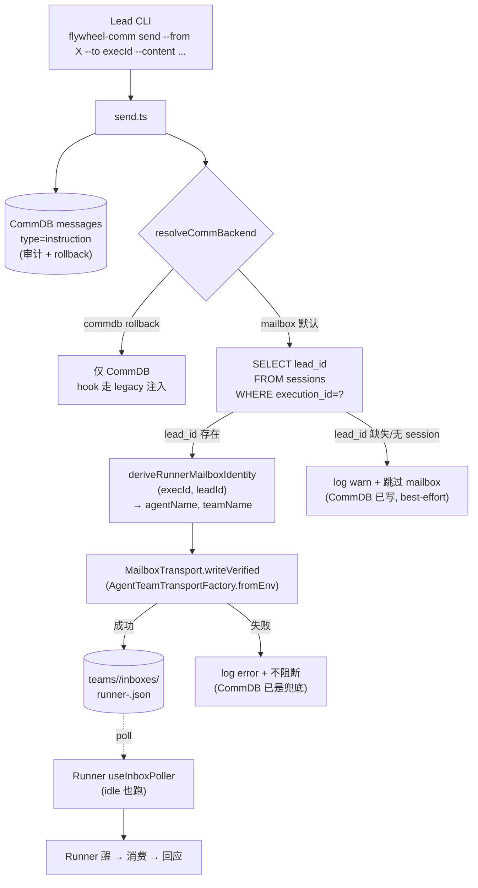

# Plan: `flywheel-comm send` Mailbox Dual-Write — FLY-168

**Version**: v1.28.2
**Issue**: FLY-168 (`flywheel-comm send` 不唤醒 `awaiting_review` Runner — transport-split design gap)
**Date**: 2026-05-25
**Source**: `doc/engineer/exploration/new/FLY-168-comm-send-transport-gap.md`, `doc/engineer/research/new/FLY-168-mailbox-wake-mechanism.md`
**Linear**: https://linear.app/geoforge3d/issue/FLY-168
**Status**: draft

---

## 1. 问题与目标

### 问题

FLY-142 (PR #186) 把 **Bridge → Lead** delivery 从 CommDB 切到 mailbox（claude-code 内建 `useInboxPoller`），并默认给每个 Runner 写 `mailbox-active` sentinel —— sentinel 让 `inbox-check.sh` PostToolUse hook 直接 `exit 0`。

但 **Lead → Runner** 的 `flywheel-comm send` 仍只写 CommDB（`send.ts:13` 单条 `insertInstruction`）。结果：一个 idle 在 `❯`、`awaiting_review` 的 Runner——

- mailbox 没人写（send 不写 mailbox）；
- CommDB 那条 instruction 被 sentinel 短路的 hook 永远不注入；
- 不在 `flywheel-comm gate` 的 15s poll 里（那只 poll gate question）。

→ 指令静默丢弃。2026-05-22 真实事故：Peter 发指令 33 分钟 Runner 没醒，最后靠 `runner_terminal_input` MCP 手动 `send-keys` 兜底。

### 目标

`flywheel-comm send` 在默认 mailbox 模式下**双写**：
1. 写 Runner 的 claude-code mailbox inbox（唤醒，复用 FLY-142 已在生产跑 10+ 天的 `MailboxTransport.writeVerified` 路径）；
2. 保留 CommDB 写入（审计 + rollback 兜底）。

对外不可见：Lead UX 不变（仍只记 `execId`），CLI flag 不变，CommDB schema 不变。

---

## 2. 设计决策（A3-corrected，Research §2 实证）

**Runner mailbox 身份是 `(executionId, leadId)` 的纯确定性函数**：

```
agentName = `runner-${executionId.slice(0, 8)}`
teamName  = leadId
inbox     = <CLAUDE_CONFIG_DIR>/teams/<sanitize(leadId)>/inboxes/<sanitize(agentName)>.json
```

两个输入都已在 CommDB `sessions` 表（`execution_id` PK + `lead_id`，生产路径两个 `registerSession` 写入点都填 leadId，self-register CLI 生产从不调用 → 无 null 覆盖 race）。

→ **零 schema migration**。Brainstorm 担心的「隐性约定脆弱性」用 **shared derive helper** 解决（不在 `send.ts` 硬编码派生字符串）。

> 拒绝 A1（migration + 存列）：多 migration + 3 个写入点改动，换来的解耦收益在「派生是纯函数 + 单一 helper」面前不值得。符合项目 enforce-simplicity / min-surface。

`backend` 判断全程复用 `resolveCommBackend()`（与 `buildAgentTeamIdentity`、`plugin.ts` 同一 parser，避免 FLY-142 r1 踩过的 strict-vs-lenient 不一致坑）。

### 2.1 包依赖方向（feasibility — 已审计）

| 包 | 现有依赖 | 关键 |
|---|---|---|
| `flywheel-comm` | `better-sqlite3`, `flywheel-config` | **不**依赖 teamlead / agent-team-transport |
| `flywheel-teamlead` | → `flywheel-comm`（已存在） | 所以 flywheel-comm **不能**反向依赖 teamlead（循环） |
| `flywheel-agent-team-transport` | 仅 `proper-lockfile` | 叶子包，flywheel-comm 可安全 forward-depend |

**后果**：`MailboxTransport`（在 teamlead）、`resolveCommBackend`（在 `teamlead/plugin.ts:82`）、`buildAgentTeamIdentity`（在 teamlead）都**不能**被 `send.ts` import。

**解法**：把 mailbox 写所需的最小件下沉到 `flywheel-agent-team-transport`（flywheel-comm 给它加 `workspace:*` 依赖；agent-team-transport 不依赖任何上层 → 无循环）：

1. `deriveRunnerMailboxIdentity(execId, leadId)` → 放 agent-team-transport 并 export；teamlead 的 `buildAgentTeamIdentity` 改 import 它。
2. `resolveCommBackend()`（解析 `FLYWHEEL_COMM_BACKEND` → `'mailbox'|'commdb'`）→ **下沉到 agent-team-transport 并 export**，`teamlead/plugin.ts` 改成 re-export / import（保持单一 parser，正面回应 FLY-142 r1 教训）。
   - 备选（若 Codex 嫌下沉动 teamlead 太多）：flywheel-comm 内联同款 lenient 解析（`(env ?? 'mailbox').toLowerCase()==='commdb' ? 'commdb':'mailbox'`，2 行）。下沉是首选，内联是 fallback。
   - 注意：这与 `AgentTeamTransportFactory.resolveBackendFromEnv()`（解析 `FLYWHEEL_AGENT_BACKEND`：claude-code/codex）是**不同 env var、不同关注点**，勿混。
3. mailbox 写直接用 `AgentTeamTransportFactory.fromEnv()` 返回的 `IAgentTeamTransport.write()`（+ 可选 `verifyLastWrite()`），**不经 teamlead 的 `MailboxTransport` wrapper**。
   - `writeVerified` vs 裸 `write`：本路径是 best-effort 唤醒、CommDB 已是 durable 审计兜底 → 倾向裸 `write`（省一次 read-after-write 延迟）。是否需要 verify 留给 Codex review 定。

---

## 3. 架构与数据流



关键不变量：**CommDB 写永远先发生且永远不被 mailbox 失败阻断**。mailbox 写是 best-effort 的唤醒增强。

---

## 4. 实施步骤

### Phase 0 — Spike Gate（implement 最早期，**必过才继续**）

验证 idle Runner 的 `useInboxPoller` 真能被 mailbox 写唤醒（Research §5 唯一实证未知）：

1. QA framework A1 slot 起真 Runner，跑到 idle 在 `❯`（`awaiting_review`）。
2. 手写一条合法 mailbox entry 到 `teams/<leadId>/inboxes/runner-<execId8>.json`（用 `ClaudeMailboxCodec` 或直接 `writeVerified`）。
3. Chrome / tmux 观察 Runner 是否在一个 poll 周期内自动醒、消费、回应。
4. **PASS** → 继续 Phase 1。**FAIL** → 暂停，向 Annie 升级（可能需要额外 tmux nudge = product 决策，见 Brainstorm §5.3）。

> mock 不能验证 claude-code 内建 poller 的 idle 行为 —— 必须真机 + 观察（QA E2E 标准）。

### Phase 1 — 下沉 shared helper + backend parser 到 agent-team-transport

`packages/agent-team-transport` 新增并 export：

```ts
export function deriveRunnerMailboxIdentity(
  executionId: string,
  leadId: string,
): { agentName: string; teamName: string } {
  return { agentName: `runner-${executionId.slice(0, 8)}`, teamName: leadId };
}

export function resolveCommBackend(): "mailbox" | "commdb" {
  const raw = (process.env.FLYWHEEL_COMM_BACKEND ?? "mailbox").toLowerCase();
  return raw === "commdb" ? "commdb" : "mailbox";
}
```

- 重构 `run-dispatcher.ts:buildAgentTeamIdentity` 调 `deriveRunnerMailboxIdentity`（不再内联拼字符串）。
- `teamlead/plugin.ts:82` 的 `resolveCommBackend` 改为 import/re-export agent-team-transport 的版本（删除重复定义；审计 plugin.ts 内所有 caller 不变）。
- 单测：两个 helper 的正确性 + `buildAgentTeamIdentity`/`plugin.ts` 重构后行为不变（snapshot 现有输出）。

> 若 Codex 判定下沉 `resolveCommBackend` 改 teamlead 面太大，fallback 为「flywheel-comm 内联同款解析」（见 §2.1）。`deriveRunnerMailboxIdentity` 下沉无争议（teamlead 已依赖 agent-team-transport）。

### Phase 2 — `send.ts` dual-write

`packages/flywheel-comm/package.json`：加依赖 `"flywheel-agent-team-transport": "workspace:*"`。

`packages/flywheel-comm/src/commands/send.ts`：CommDB `insertInstruction` 之后追加 best-effort mailbox 写：

```text
1. id = db.insertInstruction(...)            // 永远先写 CommDB（durable 审计）
2. if resolveCommBackend() !== 'mailbox': return id   // rollback: 不写 mailbox
3. session = db.getSession(toAgent)
   if !session?.lead_id: log.warn(...); return id     // 降级，不阻断
4. { agentName, teamName } = deriveRunnerMailboxIdentity(toAgent, session.lead_id)
5. try:
     transport = AgentTeamTransportFactory.fromEnv()
     await transport.write({               // 裸 write（best-effort 唤醒）
       leadName: teamName,        // 此架构 leadName==teamName==leadId (Research §2.1)
       recipient: agentName,
       payload: { from: fromAgent, text: content, metadata: { flywheelId: id } },
     })
   catch err: log.error(...)      // 不阻断，CommDB 已是兜底
6. return id
```

要点：
- `flywheelId: id` 复用 CommDB message id 做 mailbox 幂等键（重试不重复注入）。
- `send` 当前是同步函数（`send.ts:10`）——mailbox 写是 async，需把 `send` 改 async，更新 CLI 入口 `await`。审计 `index.ts` 全部 `send` 调用点确保 await 正确。
- `resolveCommBackend` / `deriveRunnerMailboxIdentity` / `AgentTeamTransportFactory` 都从 `flywheel-agent-team-transport` import（Phase 1 已下沉），**不新造判断、不 import teamlead**。
- 是否在 `write` 后加 `verifyLastWrite`：留 Codex review 定（倾向不加，见 §2.1）。

### Phase 3 — 测试矩阵

| 层 | 用例 | 验证 |
|---|---|---|
| unit | `deriveRunnerMailboxIdentity` | execId 截断 8 位 + leadId 透传 |
| unit | `buildAgentTeamIdentity` 重构 | 输出与重构前一致 |
| integration | send mailbox 模式 | mailbox inbox 文件出现该 entry **且** CommDB instruction 也写了 |
| integration | send rollback (`FLYWHEEL_COMM_BACKEND=commdb`) | **不**写 mailbox，只 CommDB |
| integration | session 无 lead_id / 无 session 行 | 不抛错，CommDB 写成功，log warn |
| integration | mailbox 写抛错 | `send` 不抛，CommDB 仍写成功（best-effort 不阻断） |
| E2E (spike 复用) | 真 Runner idle → send → 醒 | Phase 0 已覆盖；ship 前再跑一次完整 Lead→send→Runner wake |

### Phase 4 — Ship

- CI 绿 → `:cool:` gate（FLY-2 流程）。
- 部署后验证：真 Lead 对真 idle Runner `flywheel-comm send`，Chrome 观察 Runner 自动醒（不靠手动 nudge）。
- 更新 CLAUDE.md milestone 表 + MEMORY.md。

---

## 5. Rollback

`FLYWHEEL_COMM_BACKEND=commdb`：
- `TmuxAdapter` 不写 sentinel + 注 `FLYWHEEL_DISABLE_MAILBOX_SENTINEL=1`（既有行为）；
- `send.ts` 见 backend≠mailbox → 跳过 mailbox 写，只写 CommDB；
- `inbox-check.sh` 无 sentinel → 走 legacy CommDB 注入。

→ 完整回到 FLY-142 之前的 Lead→Runner 行为，无残留。

---

## 6. 风险

| 风险 | 缓解 |
|---|---|
| idle poller 不唤醒（核心未知） | Phase 0 spike gate，FAIL 即停问 Annie |
| mailbox 写失败静默吃掉指令 | CommDB 永远先写（审计可查）；写失败 log.error（loud）；sentinel 仍让 hook 在有 tool call 时兜底注入 CommDB |
| `send` 改 async 破坏调用点 | 审计 `index.ts` 全部 send 调用点 + 单测覆盖 |
| 派生规则未来漂移 | shared helper 单一 source；helper 改了两边一起改 |
| 并发写同一 Runner inbox | `writeVerified` 的 sidecar + flywheelId 幂等（FLY-142 已处理 concurrent writer，见 `verifyLastWrite` 注释） |

---

## 7. 不在 scope

- `respond.ts` 不改：gate 答复靠 Runner 在 `flywheel-comm gate` 的 15s CommDB poll，已工作。一致性迁移另开 issue。
- 不动 Lead identity rules（Lead 仍只记 execId）。
- 不动 CommDB schema（A3 = 零 migration）。
- 不给 claude-code 加 idle/tick hook（Brainstorm Option B 已拒，vendor 级改动）。

---

## 8. 验收

1. Phase 0 spike PASS（idle Runner 被 mailbox 唤醒）。
2. mailbox 模式：`send` 后 inbox 文件 + CommDB 都有该 message。
3. rollback 模式：`send` 只写 CommDB。
4. 降级/失败路径：CommDB 始终写成功，`send` 不抛。
5. 真机 E2E：Lead `send` → idle Runner 自动醒，无需手动 nudge。
6. 全测试矩阵 PASS + CI 绿。
