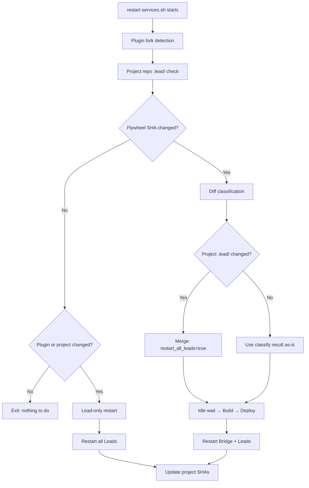

# Plan: restart-services.sh Idle Timeout + Multi-Repo Detection

**Version**: v1.22.0
**Issue**: FLY-43
**Date**: 2026-04-08
**Status**: inprogress

---

## 1. Problem Description

`scripts/restart-services.sh` has two design flaws that undermine the reliability of the CD auto-restart flow (FLY-20).

### Bug 1: Idle Wait Timeout Too Long

The script waits for all active Runner sessions to finish before restarting Bridge. The timeout was set to **30 minutes** (`MAX_WAIT_SECONDS=1800`), which is far too long for a CD flow.

**Real scenario**: 3 test Runners (FLY-40/41/23) were not cleaned up. `restart-services.sh` hung for 10+ minutes until manually killed. The timeout exists but is impractical.

### Bug 2: Only Detects Flywheel Repo Changes

The script's `classify_changes()` only runs `git diff` on the Flywheel repo (`~/Dev/flywheel`). However, Lead behavior rules — `identity.md`, `agent.md`, `common-rules.md` — live in **project repos** (e.g., GeoForge3D) under `.lead/`.

When someone merges a PR to a project repo that changes `.lead/` files, the restart script doesn't detect it. Leads continue running with stale behavior rules.

**Spec reference**: Product Experience Spec §6.3 ("Lead 设想 24/7 不间断运行, 必须有 auto-recovery"), Capability Matrix Section 6 #5 ("Auto-restart | Deployed & Wired").

---

## 2. Fix Design

### Fix 1: Reduce Idle Wait Timeout + Environment Override

```bash
# Before: hardcoded 30 minutes
MAX_WAIT_SECONDS=1800

# After: 5 minutes default, configurable via env
MAX_WAIT_SECONDS="${RESTART_MAX_WAIT:-300}"
```

One-line change. The `--force` flag (skip idle wait entirely) already exists.

### Fix 2: Project Repo `.lead/` Change Detection

Three new functions added to `restart-services.sh`:

#### `resolve_main_repo(dir)`

Resolves a git directory (which may be a worktree) to its main worktree path. Uses `git rev-parse --git-common-dir` — if it returns `.git`, the dir is already the main repo; otherwise, `dirname` of the common dir gives the main repo path.

#### `check_project_lead_changes()`

1. Reads manifests from `~/.flywheel/manifests/*.json`
2. Deduplicates by `projectName` (multiple Leads may share a project)
3. For each unique project, resolves `projectDir` to main repo via `resolve_main_repo()`
4. Fetches `origin/main` (best-effort, non-blocking on failure)
5. Compares `origin/main` HEAD with stored SHA in `~/.flywheel/project-deployed-sha/<projectName>`
6. If `.lead/` files changed → sets `project_lead_changed=true`
7. If `git diff` fails (bad SHA, force-push) → **fail-safe**: treats as changed

**Integration points**:
- Called after Discord plugin fork detection, before deployed-SHA comparison
- `project_lead_changed` triggers lead-only restart (same path as plugin-only restart)
- Also merged into `restart_all_leads` flag during normal Flywheel deploy

#### `update_project_shas()`

After successful restart, reads the temp file (`PROJECT_SHA_UPDATES_FILE`) and writes each project's current SHA to `~/.flywheel/project-deployed-sha/<projectName>`.

**Serialization**: Tab-separated format (`printf '%s\t%s\n'`), read with `IFS=$'\t' read -r`. Handles project names with spaces or `=` characters.

### Flow Diagram



---

## 3. Changed Files

| File | Changes |
|------|---------|
| `scripts/restart-services.sh` | (1) `MAX_WAIT_SECONDS` env-configurable, default 300s; (2) `resolve_main_repo()` — worktree→main resolution; (3) `check_project_lead_changes()` — manifest-based multi-repo detection with fail-safe; (4) `update_project_shas()` — post-restart SHA persistence via temp file; (5) Integration into deployed-SHA comparison, diff classification merge, both deploy and lead-only restart paths; (6) Temp file cleanup in EXIT trap |
| `scripts/test-restart-services.sh` | 17 new tests (Tests 36-52) covering all new functions, edge cases, and Codex review fixes |

---

## 4. Test Coverage

### Unit Tests (bash, in test-restart-services.sh)

| # | Test | Scenario |
|---|------|----------|
| 36 | resolve_main_repo — main repo | Returns itself |
| 37 | resolve_main_repo — nonexistent dir | Returns failure |
| 38 | resolve_main_repo — worktree | Resolves to main repo (handles macOS `/var` → `/private/var`) |
| 39 | check_project_lead_changes — no manifests | Skips, sets `project_lead_changed=false` |
| 40 | check_project_lead_changes — first run | Records SHA, doesn't force restart |
| 41 | check_project_lead_changes — same SHA | No changes detected |
| 42 | check_project_lead_changes — .lead/ changed | Detects `.lead/` file changes → `true` |
| 43 | check_project_lead_changes — non-.lead/ changes | Changes outside `.lead/` → `false` |
| 44 | update_project_shas — writes SHA files | Correct SHA persistence |
| 45 | Integration — project_lead_changed + SHA match | Triggers lead-only restart |
| 46 | Integration — project_lead_changed merge | Merges into `restart_all_leads` |
| 47 | MAX_WAIT_SECONDS — default 300 | Correct default |
| 48 | MAX_WAIT_SECONDS — env override | `RESTART_MAX_WAIT=120` works |
| 49 | resolve_main_repo — non-git dir | Returns failure |
| 50 | Dead worktree manifest | Skipped, valid manifest used |
| 51 | git diff fail-safe | Bad SHA → treats as changed |
| 52 | update_project_shas — file-based | Tab-separated multi-project SHA update |

### Manual Verification

| Scenario | How to test |
|----------|------------|
| Timeout behavior | Run `restart-services.sh` with active sessions, verify 5-min timeout |
| `--dry-run` | `restart-services.sh --dry-run` — should report project repo status |
| `.lead/` change triggers restart | Merge a PR to GeoForge3D that changes `.lead/`, run restart script |
| First run (no stored SHA) | Delete `~/.flywheel/project-deployed-sha/`, run script |
| `--force` skips idle wait | `restart-services.sh --force` — should skip wait |
| `RESTART_MAX_WAIT` override | `RESTART_MAX_WAIT=60 restart-services.sh` — should use 60s timeout |

---

## 5. Edge Cases

| Case | Handling |
|------|----------|
| Manifest `projectDir` points to deleted worktree | Skipped, tries next manifest for same `projectName` |
| All `projectDir` values for a project are invalid | Log warning, skip that project (non-blocking) |
| Project repo `git fetch` fails (network) | Log warning, skip (doesn't block Flywheel restart) |
| First run, no stored SHA | Record current SHA only, don't force restart (conservative) |
| Stored SHA is corrupted / history rewritten | `git diff` fails → **fail-safe**: treat as changed, restart Leads |
| Dry-run mode | Reports only — no fetch, no SHA updates, no restarts |
| Bash 3.2 (macOS default) | No `declare -A` used — compatible with bash 3.2.57 |
| Project name with spaces or `=` | Tab-separated serialization handles correctly |
| Temp file cleanup | `PROJECT_SHA_UPDATES_FILE` cleaned up in EXIT trap |
