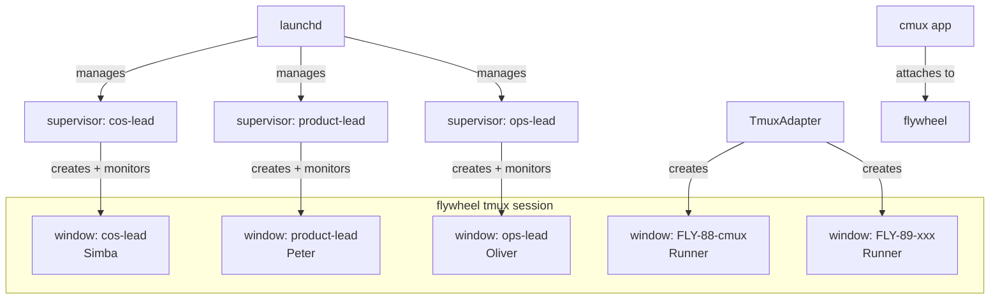

# Plan: cmux Integration — Lead/Runner Unified Window Management

**Version**: v1.22.0
**Issue**: FLY-88
**Date**: 2026-04-12
**Source**: Linear FLY-88, `doc/architecture/product-experience-spec.md` §1.3, §2.2
**Status**: codex-approved

---

## Problem Statement

当前 Lead 进程以 headless daemon 运行（launchd → wrapper → claude-lead.sh → expect → claude），Annie 无法在统一界面看到 Lead 状态。Runner 已经在 tmux session "flywheel" 里，但 Lead 不在。

Annie 需要一个窗口能看到所有 Lead 和 Runner 的终端输出，通过 tab 切换。

## Solution Overview

将 Lead 的 Claude 进程从「直接子进程」改为「tmux window」，与 Runner 共享同一个 "flywheel" tmux session。cmux（底层是 tmux 的 GUI 终端）自动将该 session 的所有 window 显示为 tab。



## Design Decisions

### D1: Lead 进 tmux window（不是 cmux workspace）

**选择**: Lead 在 tmux window 里运行，不直接调 cmux CLI。
**理由**: 
- cmux 底层是 tmux，tmux window 自动在 cmux 里显示
- 不强依赖 cmux（降级到 `tmux attach` 仍然可用）
- 与 Runner 的 TmuxAdapter 架构一致

### D2: 去掉 expect PTY hack

**选择**: 移除 `expect` 脚本和 `script -q /dev/null` TTY guard。
**理由**:
- tmux 自带完整 PTY — Claude 自动检测到 TTY
- Dev channels 自动确认改用 `tmux send-keys` 延迟发送 Enter（绑定 window_id）
- 减少依赖（不再需要 expect）

### D3: Supervisor 架构不变

**选择**: launchd → wrapper → supervisor(claude-lead.sh) → tmux window
**理由**:
- Supervisor 保持在 tmux 外面，负责 crash recovery + backoff
- launchd 管理 supervisor PID（KeepAlive 照常工作）
- tmux window 退出 → supervisor 检测 → 按 backoff 策略重启

### D4: 共享 "flywheel" session

**选择**: Lead 和 Runner 共用一个 tmux session "flywheel"。
**理由**:
- Annie 只需一个 cmux 窗口看到所有 agent
- TmuxAdapter 已经用 "flywheel" session
- Window naming 区分 Lead vs Runner

### D5: 对齐 TmuxAdapter 模式

**选择**: 完全对齐 Runner 的 TmuxAdapter 实现模式。
**理由**:
- 使用 `tmux new-window -P -F '#{window_id}'` 获取 window_id（不用 name grep）
- 使用 `-e` 显式注入环境变量（不依赖 shell 继承）
- 使用 `remain-on-exit` + `pane_dead` 检测退出码
- 经过实战验证的模式，减少新 bug

## Detailed Changes

### File 1: `packages/teamlead/scripts/claude-lead.sh`

#### 1a. 去掉 TTY guard + expect

删除：
- Line ~87-90: `if [ ! -t 1 ] && ...` PTY guard（不再需要，tmux 提供 TTY）
- Line ~555-578: expect script 生成
- Line ~583-591: `_launch_claude()` 中的 expect 路径

#### 1b. 新增 `ensure_tmux_session()`

每次 launch 前都调用（不仅是脚本启动时），确保 session 被 kill 后能自动重建：

```bash
ensure_tmux_session() {
  # -A: attach if exists, create if not (race-safe, idempotent)
  # -d: detached (don't steal current terminal)
  tmux new-session -Ad -s flywheel -x 200 -y 50 2>/dev/null || true
}
```

`-A` flag 使其 race-safe：多个进程同时调用不会冲突。

#### 1c. 改写 `_launch_claude()`

对齐 TmuxAdapter 模式 — 用 `-P -F` 获取 window_id，用 `-e` 注入环境：

```bash
_launch_claude() {
  ensure_tmux_session
  
  local window_name="${LEAD_ID}"
  
  # Kill stale window with same name (from previous crash)
  tmux kill-window -t "=flywheel:=${window_name}" 2>/dev/null || true
  
  # Enable remain-on-exit so we can read exit code from dead pane
  # (set at session level — TmuxAdapter also sets this)
  tmux set-option -t =flywheel: remain-on-exit on 2>/dev/null || true
  
  # Build env injection args (match TmuxAdapter pattern: -e KEY=VALUE)
  local env_args=(
    -e "DISCORD_BOT_TOKEN=${DISCORD_BOT_TOKEN:-}"
    -e "DISCORD_STATE_DIR=${DISCORD_STATE_DIR:-}"
    -e "FLYWHEEL_LEAD_ID=${LEAD_ID}"
    -e "FLYWHEEL_COMM_DB=${FLYWHEEL_COMM_DB:-}"
    -e "FLYWHEEL_PROJECT_NAME=${PROJECT_NAME}"
    -e "BRIDGE_URL=${BRIDGE_URL:-}"
    -e "TEAMLEAD_API_TOKEN=${TEAMLEAD_API_TOKEN:-}"
    -e "CLAUDE_AUTOCOMPACT_PCT_OVERRIDE=${CLAUDE_AUTOCOMPACT_PCT_OVERRIDE:-70}"
    -e "HOME=${HOME}"
    -e "PATH=${PATH}"
  )
  
  # Create new window running claude — capture window_id
  LEAD_WINDOW_ID=$(tmux new-window -d -P -F '#{window_id}' \
    -t =flywheel \
    "${env_args[@]}" \
    -n "$window_name" \
    -c "$LEAD_WORKSPACE" \
    claude "$@")
  
  log "Claude launched in tmux window: flywheel:${LEAD_WINDOW_ID} (name: ${window_name})"
}
```

#### 1d. 改写 wait 逻辑

使用 `window_id` 做 liveness detection，使用 `interruptible_sleep`：

```bash
# Wait for tmux window to exit (pane_dead detection)
_wait_tmux_window() {
  local target="${LEAD_WINDOW_ID}"
  CLAUDE_EXIT=0
  
  while true; do
    if [ "$SHOULD_EXIT" -ne 0 ]; then return 0; fi
    
    # Check if window still exists (session or window killed externally)
    if ! tmux list-panes -t "$target" &>/dev/null; then
      # Window gone — treat as crash (unknown exit code)
      CLAUDE_EXIT=1
      return 0
    fi
    
    # Check pane_dead flag (requires remain-on-exit)
    local dead
    dead=$(tmux list-panes -t "$target" -F '#{pane_dead}' 2>/dev/null | head -1)
    if [ "$dead" = "1" ]; then
      # Get exit code from dead pane
      CLAUDE_EXIT=$(tmux list-panes -t "$target" -F '#{pane_dead_status}' 2>/dev/null | head -1)
      CLAUDE_EXIT="${CLAUDE_EXIT:-1}"
      # Kill the dead window to prevent accumulation
      tmux kill-window -t "$target" 2>/dev/null || true
      return 0
    fi
    
    interruptible_sleep 3
  done
}
```

#### 1e. Dev channels 自动确认

绑定 `window_id`，跟踪 PID，可在 cleanup 中回收：

```bash
AUTO_CONFIRM_PID=0

_auto_confirm_dev_channels() {
  local target="${LEAD_WINDOW_ID}"
  # Background: wait for dialog, send Enter (bound to window_id, not name)
  (
    sleep 8
    tmux send-keys -t "$target" Enter 2>/dev/null || true
  ) &
  AUTO_CONFIRM_PID=$!
}
```

#### 1f. Signal handling 适配

使用 `window_id` 定位，回收 auto-confirm PID：

```bash
cleanup() {
  SHOULD_EXIT=1
  log "Shutdown signal received..."
  
  # Kill auto-confirm background task if still running
  if [ "$AUTO_CONFIRM_PID" -ne 0 ] && kill -0 "$AUTO_CONFIRM_PID" 2>/dev/null; then
    kill "$AUTO_CONFIRM_PID" 2>/dev/null || true
  fi
  AUTO_CONFIRM_PID=0
  
  # Graceful shutdown: send C-c to Claude in tmux
  if [ -n "${LEAD_WINDOW_ID:-}" ]; then
    tmux send-keys -t "$LEAD_WINDOW_ID" C-c 2>/dev/null || true
    # Wait briefly for graceful exit
    local i=0
    while [ $i -lt 5 ]; do
      if ! tmux list-panes -t "$LEAD_WINDOW_ID" &>/dev/null; then break; fi
      sleep 1
      i=$((i + 1))
    done
    # Force kill if still alive
    tmux kill-window -t "$LEAD_WINDOW_ID" 2>/dev/null || true
  fi
  
  # Clean up PID file
  rm -f "${PID_FILE:-}" 2>/dev/null || true
  exit 0
}
```

### File 2: `scripts/flywheel-lead-wrapper.sh`

**不改。** Session ensure 逻辑放在 `claude-lead.sh` 的 `_launch_claude()` 里（每次 launch 前调用），不需要在 wrapper 里做。这样避免了 rollout 问题（wrapper 是安装到 `~/.flywheel/bin/` 的副本，改 repo 里的不会自动同步）。

### File 3: TmuxAdapter（验证，不改）

`ensureSession()` 已经做了同样的事（检查 "flywheel" session，不存在则创建）。Lead 的 `ensure_tmux_session()` 使用 `-A` flag 是 race-safe 的，和 TmuxAdapter 的 has+new 模式兼容。

### File 4: terminal-mcp（不改）

直接用 `tmux capture-pane` 和 `tmux list-panes` — tmux 命令不受 cmux 影响。

## Window Naming Convention

| Agent | Window Name | Identity Key |
|-------|-------------|-------------|
| Simba (CoS) | `cos-lead` | window_id (from -P -F) |
| Peter (Product) | `product-lead` | window_id (from -P -F) |
| Oliver (Ops) | `ops-lead` | window_id (from -P -F) |
| Runner | `FLY-XX-slug` | window_id (TmuxAdapter) |

**重要**: 所有 liveness detection 和 signal delivery 使用 `window_id`，不使用 window name。Name 仅用于人类在 cmux/tmux 里识别。

## Recovery Loop Integration

```bash
while true; do
  if [ "$SHOULD_EXIT" -ne 0 ]; then break; fi
  
  PROCESS_START_TS=$(date +%s)
  RESTART_COUNT=$((RESTART_COUNT + 1))
  
  if [ -f "$SESSION_ID_FILE" ]; then
    # Resume
    SESSION_ID=$(cat "$SESSION_ID_FILE")
    _launch_claude "${CLAUDE_ARGS[@]}" --resume "$SESSION_ID"
  else
    # Fresh start
    SESSION_ID=$(uuidgen | tr '[:upper:]' '[:lower:]')
    send_bootstrap
    if [ "$SHOULD_EXIT" -ne 0 ]; then break; fi
    _launch_claude "${CLAUDE_ARGS[@]}" --session-id "$SESSION_ID"
    echo "$SESSION_ID" > "$SESSION_ID_FILE"
  fi
  
  # Auto-confirm dev channels dialog
  _auto_confirm_dev_channels
  
  # Wait for tmux window to complete
  _wait_tmux_window
  
  # Kill auto-confirm if still running
  if [ "$AUTO_CONFIRM_PID" -ne 0 ] && kill -0 "$AUTO_CONFIRM_PID" 2>/dev/null; then
    kill "$AUTO_CONFIRM_PID" 2>/dev/null || true
  fi
  AUTO_CONFIRM_PID=0
  
  # ... existing crash classification + backoff logic ...
done
```

## Migration Path

1. Merge PR
2. `flywheel-daemon.sh install --all`（重新安装 wrapper 不需要，因为 wrapper 未改）
3. `flywheel-daemon.sh restart --all`
4. Lead supervisor 重启 → `ensure_tmux_session()` 创建 flywheel session → claude 进入 tmux window
5. 验证：`tmux list-windows -t =flywheel` 应显示所有 Lead + 任何运行中的 Runner

## Test Plan

- [ ] Unit: `ensure_tmux_session()` idempotent（多次调用不报错）
- [ ] Unit: `_launch_claude()` 返回有效 window_id
- [ ] Unit: `_wait_tmux_window()` 正确检测 pane_dead + 读取 exit code
- [ ] Unit: `_wait_tmux_window()` 正确处理 window gone（session killed）
- [ ] Integration: Lead supervisor 完整 crash→recovery 流程
- [ ] Integration: Lead + Runner 共存于 flywheel session（环境隔离）
- [ ] Integration: Signal handling — SIGTERM → graceful cleanup
- [ ] Manual: cmux app 打开能看到所有 tab
- [ ] Manual: `tmux attach -t flywheel` 降级方案可用
- [ ] Regression: terminal-mcp capture/status 不受影响

## Risks & Mitigations

| Risk | Mitigation |
|------|-----------|
| tmux session 被意外 kill | `ensure_tmux_session()` 每次 launch 前调用，自动重建 |
| 多 Lead 同时启动竞争 session 创建 | `tmux new-session -Ad` 是 race-safe 的 |
| 环境变量串号（多 Lead 共享 session） | 使用 `tmux new-window -e` 显式 per-window 注入 |
| Claude CLI 行为变化（新版本不兼容 tmux TTY） | 降级：加回 expect 模式作为 fallback flag |
| remain-on-exit 使 dead pane 堆积 | Supervisor 检测 pane_dead 后立即 kill-window |
| auto-confirm Enter 打到错误窗口 | 绑定 window_id + 跟踪 PID + cleanup 回收 |

## Out of Scope

- cmux CLI 集成（notifications、workspace 重命名等）— 未来增强
- 多 tmux session 支持 — 所有 agent 共用 "flywheel"
- TmuxAdapter 重构 — 不需要改
- flywheel-lead-wrapper.sh 修改 — 不需要
