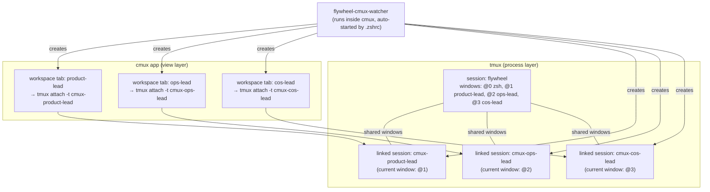

# Plan: cmux Workspace Sync — Auto-mirror tmux agents to cmux tabs

**Version**: v1.22.0
**Issue**: FLY-88
**Date**: 2026-04-12
**Source**: FLY-88 brainstorm, `doc/architecture/product-experience-spec.md`
**Status**: draft

---

## Problem Statement

Lead/Runner 进程跑在 tmux session "flywheel" 里（PR #131 已 merge），但 cmux 不会自动显示 tmux windows 为 tab。Annie 需要在 cmux 左边 sidebar 看到每个 agent 的独立 tab，点击切换查看。

## Key Facts (Verified)

1. cmux 是基于 Ghostty 的独立终端模拟器（不是 tmux wrapper）
2. cmux CLI 只能从 cmux 内部进程调用（socket 验证 process ancestry）
3. `cmux new-workspace --command "tmux attach -t flywheel"` 从内部可用（Annie 已验证）
4. `CMUX_WORKSPACE_ID` 在每个 cmux terminal 里自动设置
5. `cmux list-workspaces` 从内部可调用（格式：`* workspace:N  <title>  [selected]`）
6. cmux 有 `set-status`、`notify`、`rename-workspace --workspace <id>`、`respawn-pane` 等高级功能
7. tmux linked sessions（`new-session -t <group>`）共享 window 内容但有独立的 current window（已验证）
8. macOS 无 `flock` 命令；`~/.flywheel/bin` 不在 PATH 中

## Solution Overview

利用 shell profile 检测 `CMUX_WORKSPACE_ID` 环境变量，自动启动 watcher 进程。Watcher 从 cmux 内部运行，有 socket 权限，持续 sync tmux windows → cmux workspaces。

每个 cmux workspace 创建独立的 **tmux linked session**（不是直接 attach 到 flywheel），确保各 tab 的 current window 互不干扰。



## Design Decisions

### D1: tmux linked sessions 解决视图隔离

**Choice**: 每个 cmux workspace attach 到独立的 tmux linked session，不是直接 attach flywheel。
**Reason**:
- `tmux new-session -d -t flywheel -s "cmux-<name>"` 创建 linked session
- Linked session 共享所有 window（Lead/Runner 都可见）
- 但有独立的 current window — 切换一个 tab 不影响其他
- **已验证**: flywheel current=zsh, view current=cos-lead, 互不干扰

### D2: tmux 保留为进程管理层

**Choice**: 不去掉 tmux。Lead/Runner 仍然跑在 tmux window 里。
**Reason**:
- Crash recovery 依赖 tmux 的 `remain-on-exit` + `pane_dead`
- cmux 关了 Lead 不死（tmux 继续跑）
- TmuxAdapter（Runner）不需要改

### D3: Shell profile 自动启动 watcher

**Choice**: 在 `.zshrc` 里检测 `CMUX_WORKSPACE_ID`，自动启动 watcher。
**Reason**:
- 不需要改 cmux 设置
- watcher 作为 cmux 子进程运行，自动拥有 socket 权限
- 用 mkdir 锁（macOS 无 flock）防止多实例
- cmux 每次打开都自动触发

### D4: Bidirectional sync（创建 + 清理）

**Choice**: Watcher 同时创建缺失的 workspace 和清理过期的 workspace。
**Reason**:
- Runner 频繁创建/完成 → sidebar 会堆积死 tab
- 当 tmux window 消失时，自动 close 对应的 cmux workspace + kill linked session
- 只有 Lead（长生命周期）保持；Runner（短生命周期）自动清理

### D5: 独立安装脚本（不混入 daemon.sh）

**Choice**: 新建 `scripts/flywheel-cmux-install.sh`，不修改 `flywheel-daemon.sh`。
**Reason**:
- `flywheel-daemon.sh` 职责是 launchd lifecycle management
- cmux 集成是交互式 shell concern，职责不同
- 独立脚本更容易理解和维护

### D6: 绝对路径调用（不依赖 PATH）

**Choice**: Shell integration snippet 使用绝对路径调用脚本。
**Reason**:
- `~/.flywheel/bin` 不在 PATH 中
- 避免依赖 PATH 配置
- 稳定且可预测

## Detailed Changes

### File 1: `scripts/flywheel-cmux-sync.sh` (NEW)

核心 sync 逻辑：对比 tmux windows vs cmux workspaces，双向同步。

```bash
#!/bin/bash
# flywheel-cmux-sync.sh — Sync flywheel tmux windows to cmux workspaces
# Must be run from inside cmux (requires CMUX socket access).
set -euo pipefail

FLYWHEEL_SESSION="flywheel"
VIEW_PREFIX="cmux-"  # Linked session naming: cmux-<window_name>
SCRIPT_DIR="$(cd "$(dirname "$0")" && pwd)"

# ── Functions ──

log() { echo "[cmux-sync $(date '+%H:%M:%S')] $*"; }

get_tmux_agent_windows() {
  # Returns: window_id|window_name per line (excludes default shell)
  tmux list-windows -t "$FLYWHEEL_SESSION" -F '#{window_id}|#{window_name}' 2>/dev/null \
    | grep -v '|zsh$' | grep -v '|bash$' || true
}

get_cmux_workspaces() {
  # Returns structured workspace list
  cmux list-workspaces 2>/dev/null || true
}

workspace_exists_for() {
  local window_name="$1"
  # Exact match: workspace title must match exactly (not substring)
  # cmux list-workspaces format: "* workspace:N  <title>  [selected]" or "  workspace:N  <title>"
  # Strip leading "* " or spaces → normalize to "workspace:N <title> [selected]?"
  get_cmux_workspaces | sed 's/^[* ]*//' | awk -v name="$window_name" '{
    if ($2 == name) { found=1; exit }
  } END { exit !found }'
}

get_workspace_ref_for() {
  local window_name="$1"
  # Return workspace:N ref for a given title (for targeted operations)
  # After stripping "* "/spaces: $1=workspace:N, $2=title
  get_cmux_workspaces | sed 's/^[* ]*//' | awk -v name="$window_name" '{
    if ($2 == name) { print $1; exit }
  }'
}

linked_session_exists() {
  local session_name="$1"
  tmux has-session -t "=$session_name" 2>/dev/null
}

create_workspace_for_window() {
  local window_id="$1"
  local window_name="$2"
  local view_session="${VIEW_PREFIX}${window_name}"
  
  log "Creating workspace for: $window_name ($window_id)"
  
  # 1. Create linked session (shares windows, independent current-window)
  if ! linked_session_exists "$view_session"; then
    tmux new-session -d -t "$FLYWHEEL_SESSION" -s "$view_session" 2>/dev/null || true
  fi
  
  # 2. Select the target window in the linked session
  tmux select-window -t "${view_session}:${window_id}" 2>/dev/null || true
  
  # 3. Create cmux workspace attaching to the linked session
  cmux new-workspace --command "tmux attach -t '=${view_session}'"
  sleep 0.5
  
  # 4. Rename workspace (target: the newly created workspace, which is now selected)
  # cmux new-workspace auto-selects the new workspace, so rename-workspace targets it
  cmux rename-workspace "$window_name" 2>/dev/null || true
}

cleanup_stale_workspaces() {
  # Get current tmux window names (exact list)
  local active_names
  active_names=$(get_tmux_agent_windows | cut -d'|' -f2)
  
  # Check each linked session — if its window no longer exists, clean up fully
  tmux list-sessions -F '#{session_name}' 2>/dev/null | grep "^${VIEW_PREFIX}" | while read -r sess; do
    local agent_name="${sess#${VIEW_PREFIX}}"
    # Exact match check (not substring)
    if ! echo "$active_names" | grep -qx "$agent_name"; then
      log "Cleaning stale: $sess (tmux window '$agent_name' gone)"
      
      # 1. Close the corresponding cmux workspace (so it doesn't linger as dead tab)
      local ws_ref
      ws_ref=$(get_workspace_ref_for "$agent_name")
      if [[ -n "$ws_ref" ]]; then
        cmux close-workspace --workspace "$ws_ref" 2>/dev/null || true
      fi
      
      # 2. Kill the linked session
      tmux kill-session -t "=$sess" 2>/dev/null || true
    fi
  done
}

reconcile_existing_workspaces() {
  # For workspaces that exist but have no linked session (e.g., after Lead restart
  # or cmux reopen with stale workspace), rebuild linked session AND respawn the
  # cmux workspace's pane to reconnect to the new session.
  # This ensures the full chain: cmux workspace → tmux attach → linked session → window.
  local tmux_windows
  tmux_windows=$(get_tmux_agent_windows)
  [[ -z "$tmux_windows" ]] && return 0
  
  while IFS='|' read -r wid wname; do
    local view_session="${VIEW_PREFIX}${wname}"
    # Workspace exists but linked session doesn't → rebuild full chain
    if workspace_exists_for "$wname" && ! linked_session_exists "$view_session"; then
      log "Reconciling: rebuilding linked session + respawning pane for '$wname'"
      # 1. Rebuild linked session
      tmux new-session -d -t "$FLYWHEEL_SESSION" -s "$view_session" 2>/dev/null || true
      tmux select-window -t "${view_session}:${wid}" 2>/dev/null || true
      # 2. Respawn workspace pane to connect to new linked session
      local ws_ref
      ws_ref=$(get_workspace_ref_for "$wname")
      if [[ -n "$ws_ref" ]]; then
        cmux respawn-pane --workspace "$ws_ref" --command "tmux attach -t '=${view_session}'" 2>/dev/null || true
      fi
    fi
  done <<< "$tmux_windows"
}

sync_once() {
  local tmux_windows
  tmux_windows=$(get_tmux_agent_windows)
  
  if [[ -z "$tmux_windows" ]]; then
    # No agent windows — just cleanup any stale workspaces
    cleanup_stale_workspaces
    return 0
  fi
  
  # 1. Reconcile: fix workspaces with missing linked sessions
  reconcile_existing_workspaces
  
  # 2. Create missing workspaces
  while IFS='|' read -r wid wname; do
    if workspace_exists_for "$wname"; then
      continue
    fi
    create_workspace_for_window "$wid" "$wname"
  done <<< "$tmux_windows"
  
  # 3. Cleanup stale (dead windows → close workspace + kill linked session)
  cleanup_stale_workspaces
}

# ── Main ──

case "${1:-}" in
  --watch)
    log "Watch mode: syncing every 10s"
    sync_once
    while true; do
      sleep 10
      sync_once
    done
    ;;
  --once|"")
    sync_once
    ;;
  *)
    echo "Usage: flywheel-cmux-sync [--once|--watch]"
    exit 1
    ;;
esac
```

### File 2: `scripts/flywheel-cmux-autostart.sh` (NEW)

自动启动逻辑：mkdir 锁（macOS 兼容）+ 启动 watcher。

```bash
#!/bin/bash
# flywheel-cmux-autostart.sh — Auto-start cmux workspace watcher
# Called from .zshrc when CMUX_WORKSPACE_ID is detected.
# Uses mkdir lock (macOS has no flock).

LOCK_DIR="/tmp/flywheel-cmux-watcher.lock"
LOG="/tmp/flywheel-cmux-watcher.log"
SYNC_SCRIPT="$HOME/.flywheel/bin/flywheel-cmux-sync"

# ── Single instance via mkdir lock ──

cleanup_lock() {
  rm -rf "$LOCK_DIR" 2>/dev/null || true
}

# Check if lock is stale (process dead)
if [[ -d "$LOCK_DIR" ]]; then
  LOCK_PID=$(cat "$LOCK_DIR/pid" 2>/dev/null || echo "")
  if [[ -n "$LOCK_PID" ]] && kill -0 "$LOCK_PID" 2>/dev/null; then
    # Watcher already running
    exit 0
  fi
  # Stale lock — clean up
  cleanup_lock
fi

# Acquire lock
if ! mkdir "$LOCK_DIR" 2>/dev/null; then
  # Race: another instance grabbed it
  exit 0
fi
echo $$ > "$LOCK_DIR/pid"
trap cleanup_lock EXIT

# ── Run watcher ──

exec "$SYNC_SCRIPT" --watch >> "$LOG" 2>&1
```

### File 3: `scripts/flywheel-cmux-install.sh` (NEW)

独立安装脚本（不修改 flywheel-daemon.sh）。

```bash
#!/bin/bash
# flywheel-cmux-install.sh — Install cmux workspace sync integration
# Idempotent: safe to run multiple times.
set -euo pipefail

REPO_DIR="$(cd "$(dirname "$0")/.." && pwd)"
INSTALL_DIR="$HOME/.flywheel/bin"
INTEGRATION_FILE="$HOME/.flywheel/cmux-integration.zsh"
ZSHRC="$HOME/.zshrc"

MARKER_START="# >>> flywheel cmux integration >>>"
MARKER_END="# <<< flywheel cmux integration <<<"

echo "[install] Installing flywheel-cmux integration..."

# 1. Ensure install directory
mkdir -p "$INSTALL_DIR"

# 2. Copy scripts (not symlink — avoids stale-copy issue only if repo moves)
cp "$REPO_DIR/scripts/flywheel-cmux-sync.sh" "$INSTALL_DIR/flywheel-cmux-sync"
cp "$REPO_DIR/scripts/flywheel-cmux-autostart.sh" "$INSTALL_DIR/flywheel-cmux-autostart"
chmod +x "$INSTALL_DIR/flywheel-cmux-sync" "$INSTALL_DIR/flywheel-cmux-autostart"

# 3. Write shell integration file
cat > "$INTEGRATION_FILE" << 'INTEGRATION'
# Flywheel cmux integration — auto-sync tmux agents to cmux workspace tabs
# Source: flywheel-cmux-install.sh
if [[ -n "${CMUX_WORKSPACE_ID:-}" ]]; then
  "$HOME/.flywheel/bin/flywheel-cmux-autostart" &!
fi
INTEGRATION

# 4. Add source line to .zshrc (idempotent)
if ! grep -qF "$MARKER_START" "$ZSHRC" 2>/dev/null; then
  echo "" >> "$ZSHRC"
  echo "$MARKER_START" >> "$ZSHRC"
  echo "source \"$INTEGRATION_FILE\"" >> "$ZSHRC"
  echo "$MARKER_END" >> "$ZSHRC"
  echo "[install] Added source line to ~/.zshrc"
else
  echo "[install] ~/.zshrc already has flywheel cmux integration"
fi

echo "[install] Done. Restart cmux to activate."
```

### File 4: No changes to existing files

- `claude-lead.sh` — 不改（已经把 Lead 放进 tmux，这是够的）
- `flywheel-daemon.sh` — 不改（职责分离）
- `TmuxAdapter.ts` — 不改
- `terminal-mcp` — 不改

## Workspace Naming

| Agent Type | tmux window name | linked session | cmux workspace title |
|-----------|-----------------|----------------|---------------------|
| Lead (CoS) | `geoforge3d-cos-lead` | `cmux-geoforge3d-cos-lead` | `geoforge3d-cos-lead` |
| Lead (Product) | `geoforge3d-product-lead` | `cmux-geoforge3d-product-lead` | `geoforge3d-product-lead` |
| Lead (Ops) | `geoforge3d-ops-lead` | `cmux-geoforge3d-ops-lead` | `geoforge3d-ops-lead` |
| Runner | `FLY-XX-slug` | `cmux-FLY-XX-slug` | `FLY-XX-slug` |

## Edge Cases

| Scenario | Behavior |
|----------|----------|
| cmux 打开但 flywheel session 不存在 | Watcher 静默跳过，下次 sync 再检查 |
| Lead crash → tmux window 被 kill | cleanup_stale 自动 close workspace + kill linked session（完全清理）；Lead restart 后 sync_once 重建全部 |
| Lead restart → 新 tmux window（同名）+ linked session 还在 | Linked session 自动看到新 window（shared group），无需操作 |
| Lead restart → workspace 在 + linked session 死了 | reconcile: 重建 linked session → respawn-pane 让 workspace 重新 attach（全链路恢复） |
| 新 Runner 启动 | Watcher 下次 sync（10s 内）自动创建 workspace |
| Runner 完成 → tmux window 消失 | cleanup_stale 自动 close cmux workspace + kill linked session（完全清理） |
| Annie 手动关 cmux workspace | linked session 还在；下次 sync 检测 workspace 不在但 window 在 → 重建 workspace（linked session 复用） |
| cmux 关了 | Watcher 死（正常），linked sessions 留着；下次开 cmux 自动重建 |
| 多个 cmux window | 每个 window 的 shell 都尝试 autostart，mkdir lock 保证单实例 |
| linked session 数量增长 | 和 agent 数量 1:1，cleanup 自动回收 |

## Test Plan

- [ ] Spike: 两个 cmux workspace 分别 attach 不同 linked session，切换互不影响
- [ ] Unit: `flywheel-cmux-sync --once` 创建正确的 linked sessions + workspaces
- [ ] Unit: 重复运行不创建重复 workspace
- [ ] Unit: tmux window 消失后，cleanup 正确 kill linked session
- [ ] Unit: mkdir lock 防止多实例
- [ ] Integration: cmux 打开 → .zshrc 触发 → watcher 启动 → workspace 创建
- [ ] Integration: 新 Runner 启动 → 10s 内 cmux 出现新 tab
- [ ] Integration: Lead restart (linked session dead) → reconcile 重建 linked session + respawn-pane 恢复连接
- [ ] Manual: Annie 在 cmux sidebar 点击 tab 能看到对应 agent 输出
- [ ] Manual: cmux 关了重开 → 所有 tab 自动恢复
- [ ] Manual: 切换一个 tab 不影响其他 tab 的视图
- [ ] Regression: 关 cmux → Lead/Runner 不受影响

## Risks & Mitigations

| Risk | Mitigation |
|------|-----------|
| Linked session 的 current window 不如预期隔离 | 已验证：flywheel=zsh, view=cos-lead，互不影响 |
| cmux `new-workspace` 后 rename 作用于错误 workspace | cmux 自动 select 新建的 workspace；如有问题降级为不重命名 |
| mkdir lock 在 crash 后残留 | autostart 检查 PID file，stale lock 自动清理 |
| Linked session 堆积 | cleanup_stale 检测到 window gone 后自动 kill |
| .zshrc 被意外修改 | 用 marker 注释标记，安装脚本幂等 |
| cmux CLI 输出格式变化 | 解析逻辑：`sed` strip 前缀 + `awk` exact $2 field match，不依赖 substring grep |

## Out of Scope

- cmux `set-status` 高级状态展示（follow-up enhancement）
- cmux `notify` 通知集成（follow-up）
- 修改 TmuxAdapter / terminal-mcp（不需要）
- cmux 外部 socket 访问（不可行，不追求）

## Migration Path

1. Merge PR
2. 运行 `scripts/flywheel-cmux-install.sh`（安装脚本 + shell integration）
3. 重启 cmux
4. 自动生效：打开 cmux → watcher 启动 → linked sessions 创建 → 所有 agent tab 出现
