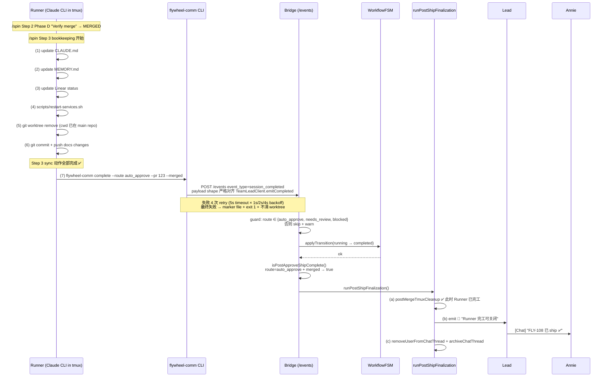

# Plan: Session Status Flip — Runner session_completed 事件缺口修复

**Version**: v1.23.0
**Issue**: FLY-108
**Date**: 2026-04-15
**Source**: Linear FLY-108 (issue 描述) + 现场调查 GEO-362 / GEO-363
**Status**: draft

---

## 1. Problem Statement

Runner ship 完成后，Bridge `sessions.status` 在 Lead-driven Runner 生命周期里**不 flip 到 `completed`**。后果：

- `close_runner` endpoint 返回 409 `status_not_eligible`，Lead 无法正常关闭 Runner tmux
- B3 🏁 "Runner 完工可关闭" 通知不发 — Lead 不知道 Runner 完工
- `post-ship` cleanup（tmux 关闭 + chat thread archive + sidebar 清理）不跑 — Runner 成僵尸
- PM 报表 / Runner lifecycle metrics 失真

**同一症状两类 root cause**（与 Linear issue 对齐）：

| Variant | Trigger | 事件发了吗 | Payload | 结果 session.status |
|---------|---------|-----------|---------|---------------------|
| **A — GEO-362** | 走完 approve + ship | ✅ 发了 | ❌ 空/字段不全 | 卡 `awaiting_review`（FSM 拒绝转 completed） |
| **B — GEO-363** | Docs-only compressed pipeline | ❌ 从没发 | n/a | 卡 `running` |

FLY-102 Round 3 已 ship `runPostShipFinalization` orchestrator (`packages/teamlead/src/bridge/post-ship-finalization.ts`)，但它依赖 session_completed 事件先到 + `isPostApproveShipComplete` 预检通过。Variant B 让第一道闸永远不触发 → **FLY-102 的 Lead-driven lifecycle 在当前架构下实际永远运行不了**。

---

## 2. Root Cause 精确化（读代码后）

### 2.1 FSM 合法转换（`packages/core/src/workflow-fsm.ts:120-141`）

```
pending           → [running]
running           → [awaiting_review, completed, blocked, failed, terminated]
awaiting_review   → [approved_to_ship, rejected, deferred, shelved, terminated]
approved_to_ship  → [completed, failed, terminated]
completed         → []  (terminal)
```

关键发现：
- `running → completed` **合法** — Variant B 不需要改 FSM
- `awaiting_review → completed` **不合法** — 必须经 approved_to_ship 过渡
- `approved_to_ship → completed` **合法** — Annie approve 后 Runner ship 的正常终态

### 2.2 `isPostApproveShipComplete` 预检（`post-ship-finalization.ts:39-49`）

触发 `runPostShipFinalization` 的两条路径：

1. `existingStatus === "approved_to_ship"`（Annie approve → Runner ship）
2. `route === "auto_approve" && landingStatus.status === "merged"`（auto-approve 路径）

### 2.3 Variant B 真相

Runner 在 docs-only 压缩 pipeline 末尾处于 `running`。FSM 允许 `running → completed`，缺的不是 FSM 宽度，而是**一个完整的 `session_completed` 事件**。源码核实：

- `packages/flywheel-comm/src/commands/stage.ts:71-78` 只发 `event_type: "stage_changed"`，没有 session_completed subcommand
- `packages/teamlead/src/bridge/event-route.ts:642-646` 的 `stage_changed=completed` handler 注释明确："informational only — does NOT trigger FSM transition"
- 旧 `edge-worker` Blueprint 的 `emitCompleted` 只跑在 Blueprint 路径；Lead-driven Runner 是 claude CLI + tmux，**不走 Blueprint**

### 2.4 Variant A 真相

Runner 发了 session_completed 但 payload 不全：
- `event-route.ts:313-344`：`decision.route` undefined/非法 → fallback `status = "completed"`
- `applyTransition` 调 FSM：如果 pre-state 是 `awaiting_review` → FSM 拒绝 `awaiting_review → completed` → `sessions.status` 不 upsert，保持 awaiting_review

GEO-362 的 pre-state 为什么是 awaiting_review 而不是 approved_to_ship（Annie 已 approve 应该转到 approved_to_ship）— 这是 **Annie approve 动作没同步 teamlead.db** 的独立 bug（FLY-58 territory），**不在 FLY-108 scope**。

FLY-108 对 Variant A 只做两件事：
- Runner 不再发空/字段不全 payload（primary fix 顺便修掉）
- Bridge 防御性校验：`decision.route` 不在合法枚举（`{auto_approve, needs_review, blocked}`）→ warn + 不做 silent fallback（避免掩盖上游 bug）

---

## 3. 方案架构

### 3.1 关键设计决策

**决策 1：`session_completed` 必须在 Runner 完成 ALL `/spin` Step 3 子步骤之后才发**

原因：`runPostShipFinalization` 的**第一步**就是 `postMergeTmuxCleanup`——直接 kill Runner 自己的 tmux。`spin.md:339-355` Step 3 实际有 **6 个子步骤**，顺序为：
1. Update CLAUDE.md
2. Update MEMORY.md
3. Update Linear issue status
4. `scripts/restart-services.sh`
5. `git worktree remove`（Runner 原所在 worktree 被删除，此前已 `cd "$MAIN_REPO"`）
6. `git commit + push docs changes` in main repo

Codex Round 2 指出：如果 `complete` 在第 4 步和第 5 步之间发，Bridge 会在 Runner 跑第 5/6 步前先 kill tmux → 残留 worktree + 未 push 的 docs commit。这违反 product-experience-spec §2.2 Hard Gate："Runner 不能在 flow 完成前关 tmux"。

→ **Phase E 放在 Step 3 第 6 步（commit + push docs changes）**之后作为新增第 7 步**。此时 Runner 所有同步工作已完成，tmux 可被安全 kill。

**决策 2：`complete` 是 terminal event，必须可靠投递（不同于 `stage`）**

原因：`stage_changed` 是 informational only，丢了不影响状态机；但 `session_completed` 驱动 FSM 终态转换 + `runPostShipFinalization` 触发，丢了就是 FLY-108 的 bug 原样复现。现有 `TeamLeadClient.emitCompleted()` (`packages/edge-worker/src/ExecutionEventEmitter.ts:61-85`) 带 retry 投递就是这个原因。

→ **`complete` 子命令带 retry + exponential backoff（4 次 attempt，每次 5s timeout，间隔 1s/2s/4s）+ 最终失败 exit 1**。不做静默 fail-open。Marker file 写到 `$HOME/.flywheel/state/complete-failed/<exec_id>.json`（稳定路径，不依赖 worktree 存在，方便后续 reconcile）。本 PR 不实现 marker 重发逻辑。

**决策 3：`session_completed` payload 必须与当前 `event-route.ts` 消费路径逐字段对齐**

Codex Round 2 指出：`event-route.ts:374-390, 520-543` 读取的真实字段分布如下（**不是** Runner 一厢情愿猜的）：

**Top-level payload fields**（`TeamLeadClient.emitCompleted` 和 event-route 都确认）：
- `issueIdentifier`, `issueTitle`, `decision`, `evidence`, `summary`, `labels`, `projectId`, `exitReason`, `consecutiveFailures`, `sessionRole`

**Inside `evidence`**:
- `landingStatus: { status, prNumber }`, `commitCount`, `filesChangedCount`（注意不是 `filesChanged`），`linesAdded`, `linesRemoved`, `diffSummary`, `commitMessages[]`, `changedFilePaths[]`

→ **`flywheel-comm complete` 按此 shape 构造**，未知字段显式 degraded / undefined 填充：
- `issueIdentifier`: 从 git branch parse（`feat/*-FLY-108-*` → `FLY-108`），parse 失败则 omit，让 Bridge `patchSessionMetadata` 的 `|| undefined` 保留 session_started 写入的值（`event-route.ts:358` 确认）
- `issueTitle`: 从 HEAD commit subject 或 `git log -1 --format=%s` 推，非关键字段
- `summary`: 同 issueTitle
- `consecutiveFailures`: **omit**——Runner 不知道 execution history；Bridge `saveSnapshot` 里读 `asNumber(payload.consecutiveFailures) ?? 0` 兜底（`event-route.ts:542`），degraded 0 可接受
- `exitReason`: 默认 `"completed"`，失败/退出场景可由 `--exit-reason` 显式覆盖
- `labels` / `projectId`: **omit from Runner payload**，改为 **Bridge 侧 CIPHER 分支 backfill**（见决策 6）

**决策 6：Bridge CIPHER snapshot 分支显式 backfill `labels` / `projectId`（Codex Round 3）**

Codex Round 3 指出：`event-route.ts:520-553` 的 CIPHER snapshot 分支**直接消费 `payload.labels` / `payload.projectId`**，不走 `patchSessionMetadata` 的 COALESCE 保留路径。当前行为固化在 `packages/teamlead/src/__tests__/cipher-bridge-e2e.test.ts:204-230`："without CIPHER fields → no snapshot"。如果 Runner 的 `complete` 命令 omit 这两个字段，新 Runner 路径会系统性跳过 snapshot。

Runner 无法方便地拿到这两个字段：
- `labels`: 需要 Linear SDK 查询 — 给 `flywheel-comm` 加 Linear 依赖 + auth + 延迟，不值得
- `projectId`: 是 `ExecutionContext.projectId`（Linear project UUID），Runner 环境没有

但 **Bridge 已经有这两个数据**：
- `labels`: sessions 表有 `issue_labels` 列（session_started 时存入），`StateStore.getSessionLabels(exec_id)` helper（`packages/teamlead/src/StateStore.ts:1113-1123`）返回 parsed labels
- `projectId`: sessions 表只有 `project_name`（repo name，不是 Linear project UUID），**不存在** `project_id` 列。但 CIPHER `saveSnapshot` 对空 projectId 有 fallback：`projectId: projectId ?? ""`（`event-route.ts:553`），degraded 可接受

→ **在 `event-route.ts` CIPHER snapshot 分支显式 backfill**：`payload.labels` 缺失 → 调 `store.getSessionLabels(event.execution_id)` 回填；`payload.projectId` 缺失 → degraded 空字符串。既不给 Runner 加 Linear 依赖，也不破坏 snapshot 契约。详细代码见 §4.3。

**Evidence 里 Runner 能拿的字段**（从 git 拉）：
- `commitCount`: `git rev-list --count <base>..HEAD`，其中 `<base>` = `origin/main` merge-base
- `filesChangedCount`: `git diff --name-only <base>..HEAD | wc -l`
- `linesAdded` / `linesRemoved`: `git diff --numstat <base>..HEAD | awk '{a+=$1; r+=$2} END {...}'`
- `diffSummary`: `git diff --stat <base>..HEAD | tail -1`
- `commitMessages`: `git log --format=%s <base>..HEAD`
- `changedFilePaths`: `git diff --name-only <base>..HEAD`
- `landingStatus`: `{ status: "merged", prNumber: {PR_NUMBER} }` when `--merged`

**决策 4：FLY-108 只覆盖 `session_role=main`**

原因：`terminal-mcp/src/index.ts:413-431` 的 `close_runner(issue_identifier)` 按 issue_identifier lookup closable session 时**没 role filter**，多候选直接 ambiguous error。如果 QA session 也发 `complete`，Lead 默认路径会坏。

→ **`--session-role` 参数保留默认 `main`；`/spin` 主路径只以 `main` 调用**。QA runtime 何时发 + `close_runner` 怎么按 role 消歧，留给 FLY-52 Phase 3 / FLY-104。

**决策 5：Bridge guard 严格等于 `DecisionRoute` 枚举，不保留 evidence-only 通道**

Codex Round 2 指出：当前 event-route 状态映射只认识 `auto_approve | needs_review | blocked`（`event-route.ts:331-344`），`else` fallback 到 `completed` 是掩盖 bug 的危险分支。`DecisionRoute` 类型（`packages/core/src/decision-types.ts:6-7`）也明确只有这三个 route。

→ **guard 只接受 `route ∈ {auto_approve, needs_review, blocked}`**，其他一律 skip。evidence-only 通道（无 route 但有 landingStatus）也被拒绝——此种 payload 说明上游 emitter 出 bug，应可见地失败而不是静默放行。同时**移除 event-route.ts:344 的 `else status = "completed"` fallback**（guard 通过后 route 必然命中 if/elif，fallback 变 unreachable dead code；明确删除避免未来有人误依赖）。

### 3.2 时序图



**单一事实源**：Runner 是自己完成状态的 authority。Bridge 只做 FSM 校验 + 防御性 warn，不做 Runner bug 的 silent fallback。

---

## 4. 改动清单

### 4.1 主修 — 新增 `flywheel-comm complete` subcommand

**新文件** `packages/flywheel-comm/src/commands/complete.ts`

- Signature:
  ```
  flywheel-comm complete \
    --route <auto_approve|needs_review|blocked> \
    [--pr <num>] [--merged] \
    [--session-role <main|qa>]            # default: main
    [--summary <text>]                     # default: derived from HEAD commit subject
    [--exit-reason <string>]               # default: "completed"
    [--base-ref <ref>]                     # default: git merge-base with origin/main
  ```

- **Env 使用**（全部已有，无需扩展 TmuxAdapter）：`FLYWHEEL_EXEC_ID` / `FLYWHEEL_ISSUE_ID` / `FLYWHEEL_PROJECT_NAME` / `FLYWHEEL_BRIDGE_URL` / `FLYWHEEL_INGEST_TOKEN`

- **Payload（与 `packages/edge-worker/src/ExecutionEventEmitter.ts:67-85` 和 `event-route.ts:313-390` 逐字段对齐）**：
  ```json
  {
    "event_id": "<uuid>",
    "execution_id": "<env FLYWHEEL_EXEC_ID>",
    "issue_id": "<env FLYWHEEL_ISSUE_ID>",
    "project_name": "<env FLYWHEEL_PROJECT_NAME>",
    "event_type": "session_completed",
    "source": "flywheel-comm",
    "payload": {
      "decision": { "route": "auto_approve" },
      "evidence": {
        "landingStatus": { "status": "merged", "prNumber": 123 },
        "commitCount": 3,
        "filesChangedCount": 7,
        "linesAdded": 120,
        "linesRemoved": 45,
        "diffSummary": "7 files changed, 120 insertions(+), 45 deletions(-)",
        "commitMessages": ["feat: complete cmd", "test: add coverage"],
        "changedFilePaths": ["packages/flywheel-comm/src/commands/complete.ts", "..."]
      },
      "issueIdentifier": "FLY-108",
      "summary": "feat: session_completed flip",
      "exitReason": "completed",
      "sessionRole": "main"
    }
  }
  ```
  > - 不发 `projectId`（由 Bridge CIPHER 分支 degraded `""` 填充，见决策 6 / §4.3.1）
  > - 不发 `labels`（由 Bridge CIPHER 分支 `store.getSessionLabels(exec_id)` backfill，见决策 6 / §4.3.1）
  > - 不发 `consecutiveFailures`（Runner 不知道；Bridge saveSnapshot 已用 `asNumber(payload.consecutiveFailures) ?? 0` 兜底，`event-route.ts:542`）
  > - 不发 `issueTitle` 除非 `--summary` 缺省时从 commit subject 推导；否则 omit，Bridge `patchSessionMetadata` 的 `|| undefined` 保留 session_started 写入的 title

- **`issueIdentifier` 取值策略**（不依赖新 env）：
  1. 解析 git branch：`git rev-parse --abbrev-ref HEAD` → `feat/v1.23.0-FLY-108-session-status-flip` → regex `[A-Z]+-\d+` 抓 `FLY-108`
  2. 解析失败 → omit 字段（Bridge 通过 `|| undefined` + COALESCE 保留 session_started 值，见 `event-route.ts:358`）

- **可靠投递（不 fail-open）**：
  ```
  attempt 1: 5s timeout
  on fail → wait 1s → attempt 2: 5s timeout
  on fail → wait 2s → attempt 3: 5s timeout
  on fail → wait 4s → attempt 4: 5s timeout (final)
  all fail → log error + write marker + exit 1
  ```
  - Marker 路径：`${HOME}/.flywheel/state/complete-failed/${FLYWHEEL_EXEC_ID}.json`（稳定路径，不依赖 worktree 存在；`$HOME` 永远有）
  - Marker 内容：完整 payload + 时间戳 + 尝试次数 + 错误
  - Marker 重发逻辑**本 PR 不实现**；留给 FLY-92 stale patrol 或独立 issue 跟踪

- 入参校验：
  - `--route` 必填且 ∈ `{auto_approve, needs_review, blocked}`，否则 exit 1
  - `--merged` 必须配合 `--pr`（否则 exit 1）
  - 缺必要 env → exit 1 并明示缺哪个

**修改** `packages/flywheel-comm/src/index.ts`

- `printUsage()` 增加 `complete` 行（列出 flags + 标明 terminal event）
- `main()` switch 增加 `case "complete": await runComplete(commandArgs); break;`
- 实现 `runComplete(args)` — 用 `parseArgs` 解析 flags，调 `complete({...})`

### 4.2 主修 — spin.md Step 3 **第 7 步** 强制调用

**修改** `.claude/commands/spin.md` `Step 3: Post-merge bookkeeping`。在现有第 6 步（commit + push docs changes）之后**追加第 7 步**：

```bash
# Step 3.7: Emit session_completed — terminal event for Bridge.
# MUST be the last sync step: runPostShipFinalization will kill tmux
# as soon as this event lands. All prior bookkeeping (docs/MEMORY/Linear/
# restart-services/worktree-remove/docs-commit-push) must be done.

if ! node "$FLYWHEEL_COMM_CLI" complete \
    --route auto_approve \
    --pr "{PR_NUMBER}" \
    --merged \
    --session-role main ; then
  echo "[complete] ERROR: session_completed emit failed after 4 retries."
  echo "[complete] Marker written to \$HOME/.flywheel/state/complete-failed/."
  echo "[complete] DO NOT manually mark session completed — let stale patrol reconcile."
  exit 1
fi
```

**去掉** 所有 `$PR_NUMBER` / `$ISSUE_ID` / `$ISSUE_TITLE` shell var 依赖（Codex Round 1/2 Issue 4）：
- `{PR_NUMBER}` — 继续用 spin.md 的 template placeholder（Phase B 已 render）
- `issueIdentifier` — 由 `complete.ts` 自行 parse git branch（4.1 已述），无需 shell 传
- `summary` / `issueTitle` — 由 `complete.ts` 自行从 `git log` 推，无需 shell 传

**"Important Rules"** 增加一条（第 357 行附近）：**Never exit `/spin` without a successful `flywheel-comm complete`**. This is the only signal Bridge recognizes as "Runner finished".

**`needs_review` 路径（Annie 要 review，没 auto-ship）**：

在 `/implement` 结束 + PR 创建之后、Annie approve 之前，Runner 调用：
```bash
node "$FLYWHEEL_COMM_CLI" complete \
  --route needs_review \
  --pr "{PR_NUMBER}" \
  --session-role main
```

- 这会驱动 `running → awaiting_review` 转换（FSM 合法）
- **`runPostShipFinalization` 不触发**（`isPostApproveShipComplete` 预检失败：existingStatus ≠ approved_to_ship，且 route ≠ auto_approve+merged） → 不会 kill tmux → Runner 自然 idle 等 Annie approve
- Annie approve + Runner ship 完成后，Step 3.7 以 `auto_approve + merged` route 再发一次 `complete`；pre-state 是 `approved_to_ship`（Annie approve 转过来）→ FSM `approved_to_ship → completed` 合法

**双 `session_completed` 去重**：同一 `execution_id` 发了两次（needs_review 早期 + auto_approve ship 后），Bridge handler 依次处理，FSM 依次推进。`runPostShipFinalization` 的 atomic claim（`post-ship-finalization.ts:78-92`，event_id = `"post-ship-finalization-${executionId}"`）保证整个 orchestrator 只跑一次。

### 4.3 辅修 — Bridge 防御性校验

**修改** `packages/teamlead/src/bridge/event-route.ts`

在 session_completed handler 入口（约第 313 行）加**严格 guard**：

```ts
// Guard: only accept routes that the downstream status mapping below
// actually handles. A payload with a foreign or missing route is almost
// always an emitter bug (Variant A GEO-362) — fail loudly, don't silently
// fall through to "completed".
const VALID_ROUTES = new Set(["auto_approve", "needs_review", "blocked"]);
const route = asString(payload?.decision?.route);
if (!route || !VALID_ROUTES.has(route)) {
  console.warn(
    `[event-route] session_completed ${event.execution_id} has invalid route ` +
    `(${route ?? "undefined"}) — skipping FSM update. ` +
    `Expected one of ${[...VALID_ROUTES].join(", ")}. ` +
    `Likely Runner emitter bug or deprecated code path.`,
  );
  res.json({ ok: true, warning: "invalid route skipped" });
  return;
}
```

**同时修改** status 映射（`event-route.ts:331-344`）：**移除 `else status = "completed"` fallback**。guard 通过后 `route` 必然命中 `needs_review` / `auto_approve` / `blocked` 三个分支之一，fallback 无法到达；显式删除避免未来误依赖。

`applyTransition` 失败时（约第 363-367 行）：日志级别从 `console.warn` 升为 `console.error`，带上 pre-state + target + route 方便 triage。

**不改 FSM 转换表** — 保持 approve/ship 语义，`awaiting_review → completed` 仍然非法。

#### 4.3.1 CIPHER snapshot 分支 backfill（决策 6）

**修改同一文件** `packages/teamlead/src/bridge/event-route.ts`，**CIPHER snapshot 分支**（约第 515-533 行）：Runner 的 `flywheel-comm complete` **omit** `payload.labels` / `payload.projectId`，这里从 `StateStore` 回填，避免 snapshot 被整体跳过。

现状（改前）：
```ts
if (cipherWriter && status === "awaiting_review" && !transitionRejected) {
  const labels = Array.isArray(payload.labels)
    ? (payload.labels as string[])
    : null;
  const changedFilePaths = Array.isArray(evidence?.changedFilePaths)
    ? (evidence.changedFilePaths as string[])
    : null;
  const projectId = asString(payload.projectId);

  if (!labels || !changedFilePaths) {
    console.warn(
      `[CIPHER] Skipping snapshot for ${event.execution_id}: missing required fields` +
      ` (labels=${!!labels}, paths=${!!changedFilePaths})`,
    );
  } else {
    // saveSnapshot with projectId: projectId ?? ""
  }
}
```

改后：
```ts
if (cipherWriter && status === "awaiting_review" && !transitionRejected) {
  // FLY-108: Runner-driven `session_completed` omits labels/projectId
  // (Runner has no Linear SDK access). Backfill from StateStore so the
  // CIPHER snapshot contract (labels required, projectId via `?? ""` fallback)
  // still holds. Existing emitter payload (explicit labels) is preferred when present.
  let labels = Array.isArray(payload.labels)
    ? (payload.labels as string[])
    : null;
  if (!labels) {
    // StateStore.getSessionLabels() returns [] when not stored — explicit [].
    labels = store.getSessionLabels(event.execution_id);
  }

  const changedFilePaths = Array.isArray(evidence?.changedFilePaths)
    ? (evidence.changedFilePaths as string[])
    : null;

  // projectId: Runner payload may omit; session_started path doesn't persist
  // Linear project UUID either. Accept degraded empty string — saveSnapshot
  // already uses `projectId ?? ""` at line 553.
  const projectId = asString(payload.projectId);

  // NOTE: `labels` is now always a valid array (possibly empty). Skip only on
  // missing `changedFilePaths` (no diff → nothing to snapshot).
  if (!changedFilePaths) {
    console.warn(
      `[CIPHER] Skipping snapshot for ${event.execution_id}: missing changedFilePaths`,
    );
  } else {
    // saveSnapshot unchanged — still passes projectId ?? "" + labels (array)
  }
}
```

**契约对齐要点**：
- `store.getSessionLabels(exec_id)` 已存在（`StateStore.ts:1113-1123`），返回 `string[]`，无标签时返回 `[]`
- Backfill **仅触发于 `payload.labels` 缺失**（Array.isArray 为 false）；显式传入 `labels: []` 仍会保留空数组（CIPHER 现有行为），不会被覆盖
- 不改动 `saveSnapshot` 调用本身，只改数据来源
- **注意**：FLY-108 emit path 走的是 auto_approve+merged（`status === "completed"`），CIPHER 分支 `status === "awaiting_review"` 不会命中；backfill 的受益方是 **needs_review 路径的 Runner-driven emit**（未来 FLY-58 Phase 2 / QA runtime 若也用 `flywheel-comm complete` 发 `route=needs_review`）
- 现有 `packages/teamlead/src/__tests__/cipher-bridge-e2e.test.ts:204-230`「without CIPHER fields → no snapshot」的断言继续成立的前提：payload 完全不带 labels **且** session 表也没存（即 session_started 事件没带 `labels`）。测试需要按下文 §4.4.1 补强

### 4.4 测试

#### 4.4.1 Unit

**新文件** `packages/flywheel-comm/src/__tests__/complete.test.ts`
- ✅ 合法 flag 组合 → 正确 POST body **shape**（每个字段严格按 §4.1 payload schema；特别验证 `evidence.filesChangedCount`（**不是** `filesChanged`）、`evidence.commitCount` 等嵌套层级）
- ✅ 缺失 `--route` → exit 1
- ✅ `--route` 非合法枚举（如 `rejected`）→ exit 1
- ✅ `--merged` 缺 `--pr` → exit 1
- ✅ Bridge 返 5xx × 4 次 → log error + marker 文件写出（路径 = `$HOME/.flywheel/state/complete-failed/${FLYWHEEL_EXEC_ID}.json`）+ exit 1（**fail-close**）
- ✅ Bridge 第 1 次 timeout，第 2 次 200 → exit 0，**无** marker
- ✅ git 字段派生：mock `git rev-list --count` / `git diff --numstat` / `git diff --name-only` / `git log --format=%s` → payload.evidence 内字段正确
- ✅ git branch parse: `feat/v1.23.0-FLY-108-session-status-flip` → `issueIdentifier = "FLY-108"`；非匹配 branch → `issueIdentifier` 字段不在 payload 内（让 Bridge COALESCE 保留）
- ✅ 缺 env（如 `FLYWHEEL_EXEC_ID`）→ exit 1 + 明示缺哪个

**新文件** `packages/teamlead/src/__tests__/event-route-session-completed-guard.test.ts`
- ✅ 空 payload → 200 with warning，不 upsertSession
- ✅ `decision: {}` + `evidence: {}` → skip
- ✅ `decision: { route: "garbage" }` → skip（guard 严格枚举）
- ✅ `decision: { route: "rejected" }` → skip（Codex Round 2 Issue 4 — `rejected` 不是 DecisionRoute）
- ✅ `decision: { route: "auto_approve" }` + 空 evidence → 通过 guard，走 FSM（route 合法即合法）
- ✅ `decision: { route: "auto_approve" }` + landingStatus.merged → `status = "completed"` + `runPostShipFinalization` 触发
- ✅ `decision: { route: "needs_review" }` → `status = "awaiting_review"`
- ✅ `decision: { route: "blocked" }` → `status = "blocked"`
- ✅ FSM reject 时日志是 error 级别 + 含 pre-state + target + route

**扩展** `packages/teamlead/src/__tests__/post-ship-finalization.test.ts`
- ✅ 新 case：session pre-state=running, `session_completed with route=auto_approve+merged` → FSM transition → `runPostShipFinalization` 被调用 exactly once（现有 atomic claim 机制覆盖 exactly-once，复用现有 test pattern）

**扩展** `packages/teamlead/src/__tests__/cipher-bridge-e2e.test.ts`（Codex Round 3 Issue 1 — 验证 backfill 契约）
- ✅ 新 case "Runner-driven emit: payload omits labels, session_started had labels → snapshot uses backfilled labels"：
  1. session_started payload **带 labels `["bug", "priority:high"]`** → StateStore.issue_labels 存入 JSON array
  2. session_completed payload **不带 labels**、不带 projectId、带 changedFilePaths
  3. 断言 decision_snapshots row 存在，且 `issue_labels` = `["bug", "priority:high"]`（backfill 生效）
  4. 断言 `project_id` 列 = `""`（degraded fallback）
- ✅ 新 case "Runner-driven emit: session_started also omitted labels → snapshot still created with empty labels"：
  1. session_started **不带 labels**（StateStore.issue_labels = null）
  2. session_completed 不带 labels、带 changedFilePaths
  3. 断言 snapshot row 存在，`issue_labels` = `[]`（空数组，但 snapshot 不被跳过）
- ✅ 现有 case "session_completed without CIPHER fields → no snapshot" **不修改、仍必须通过**：证明 `changedFilePaths` 缺失时仍 graceful skip（backfill 只补 labels，不补 changedFilePaths）
- ✅ 现有 case "session_completed with CIPHER fields → saveSnapshot" **不修改、仍必须通过**：证明 payload 显式 labels 优先于 backfill（Array.isArray check 先命中）
- ✅ 新 case "explicit empty labels array wins over backfill"（Codex Round 4 建议）：
  1. session_started payload 带 labels `["bug"]`（StateStore.issue_labels 存入）
  2. session_completed payload 显式 `labels: []` + 带 changedFilePaths
  3. 断言 snapshot row 存在，`issue_labels` = `[]`（尊重显式空数组，**不**用 session_started 的 `["bug"]` 覆盖）— 钉死 "Array.isArray check 先命中" 语义

#### 4.4.2 Integration

Codex Round 2 Issue 5 正确指出：`session-lifecycle.integration.test.ts` 现在 `createBridgeApp()` 没传 `transitionOpts`，post-ship side effects 不可观测。exactly-once 验证其实在 `post-ship-finalization.test.ts` 里做。

**不扩展现有 `session-lifecycle.integration.test.ts`**（避免过度承诺）。改为：

**新文件** `packages/teamlead/src/__tests__/event-route-dual-session-completed.integration.test.ts`
- 用 `vi.mock("../bridge/post-ship-finalization")` 把 `runPostShipFinalization` 替换成 spy
- 启动 Bridge + 真 StateStore，显式传 `transitionOpts`（完整 FSM 转换接入）
- Scenario "needs_review → approve → auto_approve+merged" （覆盖 Variant A 正常路径）：
  1. POST session_started → `running`
  2. POST session_completed (route=needs_review, no merged) → `running → awaiting_review`。断言 `runPostShipFinalization` spy **0 次调用**
  3. POST approve action → `awaiting_review → approved_to_ship`
  4. POST session_completed (route=auto_approve, merged, PR#X) → `approved_to_ship → completed`。断言 `runPostShipFinalization` spy **恰好 1 次**
  5. 再 POST 同一 execution_id 的重复 session_completed → atomic claim 保证 spy **仍然 1 次**
- Scenario "docs-only compressed pipeline"（覆盖 Variant B）：
  1. POST session_started → `running`
  2. POST session_completed (route=auto_approve, merged, PR#Y) → `running → completed`。断言 spy 1 次
- 断言：最终 `sessions.status = completed`；事件序列正确

#### 4.4.3 E2E（FLY-96 test infra）

- `scripts/test-deploy.sh` 部署到 slot 2（test-lead）
- `scripts/discord-e2e.sh` 发起真实 issue 流程，走 docs-only compressed pipeline
- **Chrome Discord 全程观察**验证点：
  1. `/spin` Step 3 第 1-6 步完成（Bridge 日志 + tmux scrollback grep `restart-services.sh` / `git worktree remove` / `git push docs`）
  2. **之后** Runner 才 POST `/events` 的 session_completed（时间戳 / grep 顺序）
  3. `sessions.status` 变 `completed`（teamlead.db 查 CLI）
  4. `🏁` 通知消息出现在 Annie 的 chat thread
  5. Runner tmux 在 `🏁` **之后**才被关闭（tmux list-windows 时序观察）
  6. chat thread 从 Annie sidebar 消失（archive 成功）
- 故意模拟 Bridge down：kill Bridge 进程 → Runner 看到 4 次 retry 全失败 → exit 1 + marker file `$HOME/.flywheel/state/complete-failed/${exec_id}.json` 存在 + docs changes 已 push（Step 6 在 Step 7 之前）但 `sessions.status` 仍是 `running`（需手动 reconcile）

---

## 5. 对其他 Issue 的影响

| Issue | 影响 | 方向 |
|-------|------|------|
| **FLY-102** Lead-driven lifecycle | 当前 `runPostShipFinalization` 触发不了；FLY-108 修完后才生效 | ✅ 正面 |
| **FLY-104** Vendor-neutral agent roles | `flywheel-comm complete` 是 Bridge-facing 协议，任何 agent adapter（Claude/Codex/Gemini）只需实现这个调用 | ✅ 对齐 |
| **FLY-105** Digest layer | 不同 layer，无直接影响 | — |
| **FLY-109** Lead resume inbox 静默消费 | 不碰 Lead supervisor / inbox | 0 冲突 |
| **FLY-83** Lead Daemon 卡 + 异常通知 | 不碰 claude-lead.sh / Lead supervisor | 0 冲突 |
| **FLY-58** Approve/Ship 分离 | Variant A 的 pre-state bug 属于 FLY-58 territory；FLY-108 不重叠 | 独立 |
| **FLY-61** Notification Protocol | EventFilter 分类规则；FLY-108 触发完成事件后 EventFilter 决定通知路由 | 解耦 |
| **FLY-52 Phase 3** QA Agent runtime | QA session 何时发 `complete` + `close_runner` role 消歧，属于 QA runtime 设计；FLY-108 不覆盖 | 独立 |
| **FLY-92** Runner idle watchdog | stale patrol 未来可读 marker file 重发 complete | 预留 |

---

## 6. Scope 边界

### 6.1 Do

- ✅ 新增 `flywheel-comm complete` subcommand，**可靠投递**（4 次 retry + fail-close + marker 到 `$HOME/.flywheel/state/`）
- ✅ Payload shape **逐字段对齐** `TeamLeadClient.emitCompleted` 和 `event-route.ts` 读取逻辑（evidence 嵌套 / 顶层字段 / 字段名 `filesChangedCount` 等）
- ✅ spin.md **Step 3 第 7 步**（commit+push docs 之后）强制调用
- ✅ needs_review 路径也调用 `complete`（driving `running → awaiting_review`；不触发 runPostShipFinalization）
- ✅ Bridge guard **严格限定** route ∈ {auto_approve, needs_review, blocked}；删除 status 映射的 `else → completed` fallback
- ✅ Bridge CIPHER snapshot 分支 **backfill** `labels` / `projectId`（`payload.labels` 缺失 → `store.getSessionLabels(exec_id)`；`projectId` 缺失 → degraded `""`）— 让 Runner 能合法 omit 这两个字段而不破坏 snapshot 契约
- ✅ 新 Unit 文件（`complete.test.ts` / `event-route-session-completed-guard.test.ts`） + 扩展 `post-ship-finalization.test.ts` + 扩展 `cipher-bridge-e2e.test.ts`（backfill 契约） + 新 Integration 文件（`event-route-dual-session-completed.integration.test.ts`）+ E2E（真 ship + Bridge-down simulation）

### 6.2 Don't

- ❌ 不加 `awaiting_review → completed` FSM 转换（会破坏 approve 语义）
- ❌ 不实现 Bridge 从 `stage_changed=completed` 合成 session_completed（强耦合 GitHub API / webhook，复杂度高）
- ❌ 不改 FSM 转换表或 action 定义
- ❌ 不解决 Variant A 的 pre-state 卡死根因（独立 bug，FLY-58/FLY-61 territory 或新开 issue 跟踪）
- ❌ 不改 claude-lead.sh / Lead supervisor（FLY-109/FLY-83 worktree 的范围）
- ❌ 不改 EventFilter 分类规则（FLY-61 领域）
- ❌ **不覆盖 `session_role=qa`**：`/spin` 主路径只以 `main` 调 `complete`。QA runtime + role-aware close_runner 留给 FLY-52 Phase 3 / FLY-104
- ❌ **不扩展 `TmuxAdapter` 注入新 env**（`issueIdentifier` 从 git branch parse；marker 写 `$HOME/.flywheel/state/`；零 env 接口变更）
- ❌ 不实现 marker file 的重发逻辑（留给 FLY-92 stale patrol 或后续独立 issue）
- ❌ 不扩展现有 `session-lifecycle.integration.test.ts`（它没传 `transitionOpts`，post-ship 不可观测；改为新建独立 integration file）

---

## 7. Rollout + Risk

### 7.1 Rollout
1. Merge PR → `pnpm build` → `packages/flywheel-comm/dist/` 更新
2. `scripts/restart-services.sh`（Bridge 重启，拉新 event-route 防御代码）
3. Runner 下次启动时 `FLYWHEEL_COMM_CLI` 指向新 dist，直接生效（无需 Lead 侧动作）
4. 监控 Bridge 日志 24h，确认 `session_completed with invalid route` warn = 0（说明 Runner 都在发合法 route）

### 7.2 Risk

| Risk | Mitigation |
|------|------------|
| Runner 旧 tmux session 跑完时用的是旧 dist（没 complete 命令）→ session_completed 不发 | 旧 session 用 FLY-92 heartbeat 24h stale patrol 兜底 |
| `flywheel-comm complete` 4 次 retry 全失败（Bridge 长时间不可达）| **Fail-close**：Runner 不再做任何事，marker 留在 `$HOME/.flywheel/state/`，Annie 可手动 reconcile 或 FLY-92 stale patrol 兜底 |
| Bridge 严格 guard 过滤掉合法但 route 异常的旧 session_completed | 旧 `TeamLeadClient.emitCompleted` 一直带 `decision.route ∈ {auto_approve, needs_review, blocked}`（见 Decision Layer），不受影响。若有例外，Codex code review + E2E 会暴露 |
| 删除 status 映射 `else → completed` fallback 导致某个 legit 路径失效 | guard 通过即 route ∈ 枚举，必命中 if/elif；unit test 覆盖三种 route + 一种 isPostApproveShip=true；无合法路径通过 else |
| spin.md 改动导致 Runner 在非 ship 场景（retry/terminated）也发 session_completed | Step 3 只在 Phase D 判定 MERGED 之后才进入；非 MERGED 分支不会走到 Step 3.7 |
| 双 `session_completed`（needs_review + auto_approve）导致 `runPostShipFinalization` 跑两次 | `post-ship-finalization.ts:78-92` atomic claim（event_id = `"post-ship-finalization-${executionId}"`）保证 exactly once；新 integration test 显式覆盖 |
| Runner 在 Step 3.7 emit 成功后崩溃 | Bridge 已收到 session_completed → `runPostShipFinalization` 已触发 → tmux cleanup + chat thread archive 都完成；此时 Runner 已经过 Step 3 的全部 6 个子步骤，docs 已 push，worktree 已 remove。可接受 |
| Marker 目录 `$HOME/.flywheel/state/` 不存在 | `complete.ts` 写 marker 前 `mkdir -p`；unit test 覆盖 |
| CIPHER backfill 让原本 "no snapshot" 的 needs_review 路径开始产 snapshot | 只在 `payload.labels` 缺失时 backfill，且要求 `changedFilePaths` 仍然必须存在；现有 "without CIPHER fields → no snapshot" test（payload 没带 changedFilePaths）仍 pass。新增测试覆盖「session_started 带 labels + complete 不带 labels → snapshot 用 backfilled labels」正 case |
| Backfill 用 `projectId ?? ""` 导致 CIPHER 分析里 projectId 维度变空 | session_started 路径本来就不存 Linear project UUID（只存 `project_name` = repo name），CIPHER `saveSnapshot` 原有代码就已经 `projectId ?? ""` 兜底（`event-route.ts:553`），行为无变化；后续若需要真 projectId，属 CIPHER 增强（独立 issue） |

### 7.3 Backward Compatibility

- Bridge 严格 guard 只挡住 route 不合法的 payload；旧 `DirectEventSink.emitCompleted` + `TeamLeadClient.emitCompleted` 都带合法 route（来自 Decision Layer enum），**不受影响**（`packages/edge-worker/src/ExecutionEventEmitter.ts:67-85`）
- 旧 Runner（pre-FLY-108）没有 complete 命令 → 继续只发 stage_changed → Bridge 不触发 finalization → 退化到 FLY-92 heartbeat 兜底（跟修复前一致，不恶化）
- Runner 新 payload 的 evidence 字段都 match Bridge 读取逻辑；omit 的顶层字段分三类：
  - `issueIdentifier` / `issueTitle`：由 `patchSessionMetadata` 的 `|| undefined` 保留 session_started 写入的值（`event-route.ts:357-360, 374-390`）
  - `labels` / `projectId`：**CIPHER snapshot 分支显式 backfill**（§4.3.1，见决策 6）— 不走 COALESCE，直接从 `StateStore.getSessionLabels()` / degraded `""` 读取
  - `consecutiveFailures`：**只在 CIPHER `saveSnapshot` 分支消费**（`event-route.ts:542` 用 `asNumber(payload.consecutiveFailures) ?? 0`），不写回 session row；omit 时直接 degraded 为 `0`。**不属于 COALESCE 路径**
- 现有 CIPHER e2e test 断言 "without CIPHER fields → no snapshot" 仍然成立：该 test payload 也不带 `changedFilePaths`，而 backfill 只补 labels，不补 changedFilePaths

---

## 8. 成功标准 (Definition of Done)

- [ ] Unit + Integration + E2E 全绿
- [ ] 一次 docs-only compressed pipeline 真 ship：
  - session_completed 事件 payload shape 与 `TeamLeadClient.emitCompleted` 逐字段一致（grep Bridge 日志 + `evidence.filesChangedCount` 等嵌套字段）
  - `sessions.status = completed`
  - 🏁 通知在 Annie 的 chat thread
  - Runner tmux 在 `🏁` 之后被关闭（**时序正确**）
  - Step 3 的 6 个子步骤全部完成（docs commit/push 可见）
  - chat thread 从 Annie sidebar 消失
- [ ] 一次 Annie approve + Runner ship 真 ship：needs_review + auto_approve 双事件，`runPostShipFinalization` 只跑一次
- [ ] 一次 Bridge-down simulation：Runner 看到 retry-exhausted + marker file + fail-close + docs 已 push（Step 6 先于 Step 7）
- [ ] Codex design review APPROVED
- [ ] Codex code review APPROVED
- [ ] PR 合并后 `scripts/restart-services.sh` 成功
- [ ] 24h 内监控 Bridge 日志：`session_completed with invalid route` warn = 0；`FSM rejected` error = 0（或均能追溯到已知原因）

---

## 9. 后续跟踪（out of scope but noted）

- Variant A 的 pre-state 问题（Annie approve 未同步 teamlead.db）：新开 issue 或归并 FLY-58
- `flywheel-comm complete` 在非 spin 的 Runner flow（将来 Codex Runner）的适配：FLY-104 架构重构时顺带推广
- QA session 发 `complete` + `close_runner(issue_identifier, role=qa)` 消歧：FLY-52 Phase 3
- Bridge 防御性校验规则是否应用到 session_started / session_failed：另做 audit
- `marker file` 的重发逻辑（stale patrol 读取 marker 重投 Bridge）：新 issue 或归并 FLY-92
- `spin.md` 的 Step 3 子步骤本身是否应降格为 out-of-band janitor（Codex Round 2 给出的另一条路径）：独立设计讨论
