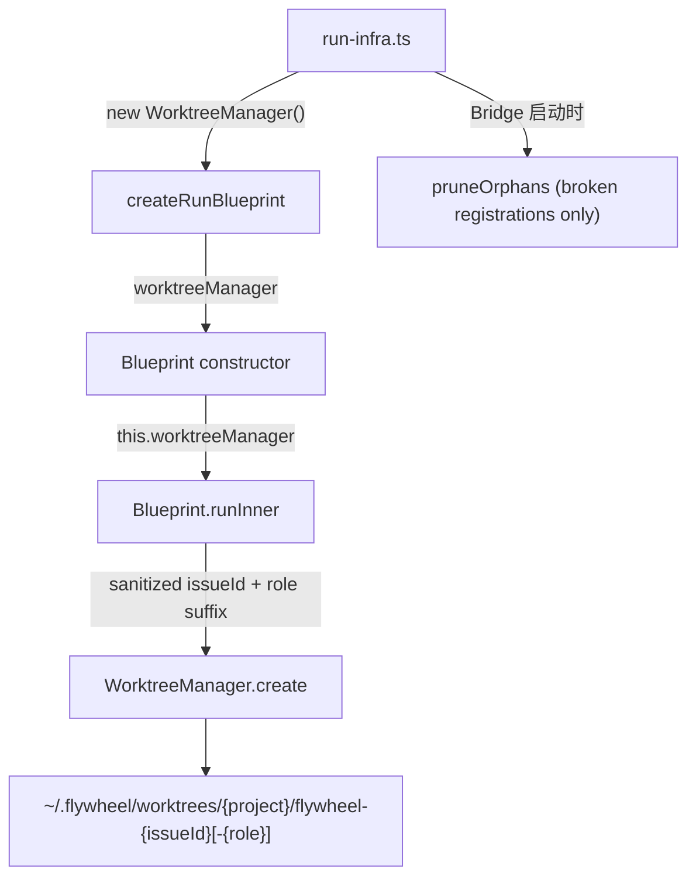
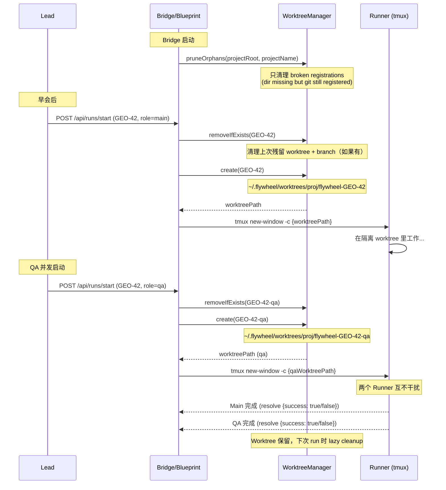

# Plan: Runner Worktree Isolation — auto-create worktree per Runner session

**Version**: v1.23.0
**Issue**: FLY-95
**Date**: 2026-04-12
**Source**: Linear FLY-95, Claude Code Agent Team `inProcessRunner.ts` / `worktree.ts` research
**Status**: codex-approved

---

## 1. 背景

### 1.1 问题

当 Lead 通过 Bridge API (`POST /api/runs/start`) 启动 Runner 时，Runner 在项目主目录运行（如 `~/Dev/GeoForge3D`）。多个并发 Runner 共享同一 working directory，导致：

- 文件冲突（两个 Runner 修改同一文件）
- uncommitted changes 互相干扰
- git status 混乱

### 1.2 现状

**WorktreeManager 和 Blueprint worktree 支持已全部存在**，但生产路径没有 wire 上。

| 组件 | 状态 | 位置 |
|------|------|------|
| `WorktreeManager` | ✅ 完整实现 | `edge-worker/src/WorktreeManager.ts` |
| Blueprint worktree 逻辑 | ✅ 完整实现 | `Blueprint.ts:176-198` |
| 生产路径 wire-up | ❌ 未连接 | `run-infra.ts:222` 传 `undefined` |
| Role-aware 命名 | ❌ 缺失 | Blueprint 用 issueId，无 role 区分 |
| 启动时清理 | ❌ 缺失 | 崩溃残留的 broken worktree registration 无人清理 |

### 1.3 Claude Code Agent Team 参考

Claude Code 的 `AgentTool.tsx` 在 agent 执行前创建 worktree（`createAgentWorktree()`），完成后检查是否有改动决定是否清理。我们的 WorktreeManager 已复制此模式，采用 "lazy cleanup"（下次 run 时 `removeIfExists` 清理上次残留），更适合 Flywheel 场景。

---

## 2. 方案

### 2.1 设计原则

- **最小改动**：基础设施已存在，只做 wiring + edge case 修复
- **向后兼容**：API 接口不变，Annie/Lead 触发方式不变
- **不改 WorktreeManager API**：role 区分在 Blueprint 层处理

### 2.2 改动总览



### 2.3 Step 1: Role-aware worktree 命名（防冲突）+ sessionRole 校验

**文件**: `packages/edge-worker/src/Blueprint.ts`

**问题**: FLY-59 引入 `sessionRole`（main/qa），同一 issue 可并发跑 main + QA runner。当前 worktree 用 `issueId` 命名，QA 启动时 `removeIfExists` 会删掉 main runner 的 worktree。

**安全顾虑**: `sessionRole` 目前是 API 层的自由字符串（`runs-route.ts:38-60` 只做 `typeof === "string"` 检查），直接拼进 branch 名可能包含 git ref 非法字符（`/`、空格、`..`）。

**改动**:

在 `Blueprint.runInner()` 的 worktree 创建块中（line 176-198），构造 role-aware 的 worktreeIssueId，并 sanitize role：

```typescript
// Blueprint.runInner() — worktree setup block
if (this.worktreeManager) {
    const projectName = ctx.projectName ?? ctx.teamName;
    // FLY-95: Role-aware worktree naming to prevent main/QA collision
    // Sanitize role to be git-branch-safe (only alphanumeric + hyphen)
    const rawRole = ctx.sessionRole ?? "main";
    const role = rawRole.replace(/[^a-zA-Z0-9-]/g, "").toLowerCase() || "main";
    const worktreeIssueId = role === "main" ? node.id : `${node.id}-${role}`;
    try {
        await this.worktreeManager.removeIfExists(projectRoot, projectName, worktreeIssueId);
        worktreeInfo = await this.worktreeManager.create({
            mainRepoPath: projectRoot,
            projectName,
            issueId: worktreeIssueId,
        });
        cwd = worktreeInfo.worktreePath;
    } catch (error) {
        // ... existing error handling
    }
}
```

**结果**:
- Main runner: `flywheel-GEO-42`（branch `flywheel-GEO-42`）
- QA runner: `flywheel-GEO-42-qa`（branch `flywheel-GEO-42-qa`）
- 非法 role（如 `../hack`）→ sanitized 为 `hack` → `flywheel-GEO-42-hack`

**注意**: 下游 `ApproveHandler`（`edge-worker/src/reactions/ApproveHandler.ts:20-47`）也硬编码了 `flywheel-${issueId}`。但 ApproveHandler 只操作 main session 的 branch（approve 操作只针对 main runner 的 PR），所以 role suffix 不影响它。在代码注释中标注这个假设。

### 2.4 Step 2: Wire WorktreeManager 到生产路径

**文件**: `packages/teamlead/src/bridge/run-infra.ts`

**改动 A**: `createRunBlueprint()` 接受 `worktreeManager` 参数

```typescript
export async function createRunBlueprint(
    tmuxSessionName: string,
    fetchIssue: FetchIssueFn,
    eventEmitter?: ExecutionEventEmitter,
    sessionTimeoutMs?: number,
    checkpointConfig?: CheckpointsConfig,
    worktreeManager?: WorktreeManager,  // NEW
): Promise<{ blueprint: Blueprint; cleanup: () => Promise<void> }> {
    // ...existing code...
    const blueprint = new Blueprint(
        hydrator,
        gitChecker,
        makeAdapter,
        shell,
        worktreeManager,  // was: undefined
        skillInjector,
        evidenceCollector,
        undefined, // skillsConfig
        decisionLayer,
        eventEmitter,
        undefined, // agentDispatcher
        checkpointConfig,
    );
    // ...
}
```

**改动 B**: `setupRunInfrastructure()` 创建共享 WorktreeManager 并传入

```typescript
export async function setupRunInfrastructure(
    store: StateStore,
    config: BridgeConfig,
    projects: ProjectEntry[],
    registry?: RuntimeRegistry,
): Promise<RunDispatcher> {
    // FLY-95: Shared WorktreeManager for all projects
    const worktreeManager = new WorktreeManager();
    
    // ... existing project loop ...
    
    for (const project of projects) {
        // ... existing code ...
        
        // FLY-95: Prune broken worktree registrations (dir missing but still
        // registered in git). This does NOT clean up stale worktrees that still
        // exist on disk — those are handled lazily by removeIfExists() on the
        // next run of the same issue.
        try {
            const pruned = await worktreeManager.pruneOrphans(
                project.projectRoot,
                project.projectName,
            );
            if (pruned.length > 0) {
                console.log(`[RunInfra] Pruned ${pruned.length} broken worktree registration(s) for ${project.projectName}`);
            }
        } catch (err) {
            console.warn(`[RunInfra] Worktree prune failed for ${project.projectName}: ${err instanceof Error ? err.message : err}`);
        }
        
        const { blueprint, cleanup } = await createRunBlueprint(
            tmuxSessionName,
            fetchIssue,
            directSink,
            undefined,
            checkpointConfig,
            worktreeManager,  // NEW — was not passed
        );
        // ...
    }
    // ...
}
```

**Import**: `run-infra.ts` 需要新增 `import { WorktreeManager } from "flywheel-edge-worker";`。`WorktreeManager` 已经通过 `edge-worker/src/index.ts` re-export。

### 2.5 Step 3: Dispatcher failure handling + logging

**文件**: `packages/teamlead/src/bridge/run-dispatcher.ts`（含 `RetryDispatcher` 和 `RunDispatcher` 两个类）

**问题**: `Blueprint.run()` 的大多数失败是 resolve `{ success: false }`，而不是 reject（例如 worktree 创建失败在 `Blueprint.ts:177` 直接 return `{success: false}`）。当前代码的 `.catch()` 调 `cleanupPreRegistration()`，但对于 resolved failure 不会执行，导致 CommDB 里留下 orphan `:pending` session。

**注意**: `retry-dispatcher.ts` 只有接口定义。`RetryDispatcher` 实现在 `run-dispatcher.ts:32`，`RunDispatcher extends RetryDispatcher` 在 `run-dispatcher.ts:213`。两个类的 blueprint chain 都需要修改。

**改动 A**: `RetryDispatcher.dispatch()`（`run-dispatcher.ts:106-123`）

```typescript
entry.promise = runtime.blueprint
    .run({ id: req.issueId, blockedBy: [] }, runtime.projectRoot, ctx)
    .then((result) => {
        console.log(
            `[RetryDispatcher] ${newExecutionId} completed for issue ${req.issueIdentifier ?? req.issueId} (success=${result.success})`,
        );
        // FLY-95: Log worktree path for debugging
        if (result.worktreePath) {
            console.log(`[RetryDispatcher] Worktree: ${result.worktreePath}`);
        }
        // FLY-95: Clean up orphan pre-registration if blueprint resolved as failure
        // (e.g., worktree setup failed) and runner never self-registered.
        if (!result.success && !result.sessionId) {
            this.cleanupPreRegistration(newExecutionId, req.projectName);
        }
    })
    .catch((err: unknown) => {
        console.error(
            `[RetryDispatcher] ${newExecutionId} failed:`,
            err instanceof Error ? err.message : err,
        );
        this.cleanupPreRegistration(newExecutionId, req.projectName);
    })
    .finally(() => {
        this.inflight.delete(key);
    });
```

**改动 B**: `RunDispatcher.start()`（`run-dispatcher.ts:282-299`）— 同样的 pattern：

```typescript
entry.promise = runtime.blueprint
    .run({ id: req.issueId, blockedBy: [] }, runtime.projectRoot, ctx)
    .then((result) => {
        console.log(
            `[RunDispatcher] ${executionId} completed for issue ${req.issueId} (success=${result.success})`,
        );
        if (result.worktreePath) {
            console.log(`[RunDispatcher] Worktree: ${result.worktreePath}`);
        }
        // FLY-95: Same cleanup logic as RetryDispatcher
        if (!result.success && !result.sessionId) {
            this.cleanupPreRegistration(executionId, req.projectName);
        }
    })
    .catch((err: unknown) => {
        console.error(
            `[RunDispatcher] ${executionId} failed:`,
            err instanceof Error ? err.message : err,
        );
        this.cleanupPreRegistration(executionId, req.projectName);
    })
    .finally(() => {
        this.inflight.delete(key);
    });
```

**清理判断逻辑**: `!result.success && !result.sessionId` — 如果 blueprint resolved failure 且没有 sessionId（说明 runner 从未自行注册过），则清理 CommDB 的 pre-registration。如果 runner 已自行注册（有 sessionId），则不清理，因为 session 可能有后续的 retry/decision flow。

---

## 3. Worktree 生命周期



### 3.1 Cleanup 策略说明

| 时机 | 机制 | 清理范围 |
|------|------|---------|
| Bridge 启动 | `pruneOrphans()` | broken git registrations（dir missing） |
| 下次 run 同一 issue+role | `removeIfExists()` | 上次的 worktree + branch |
| 手动清理 | `rm -rf ~/.flywheel/worktrees/{project}/` | 所有 worktree |

**不做的清理**：不实现 TTL/stale discovery。磁盘占用低优先级，lazy cleanup 足够覆盖正常流程。如果未来 worktree 积压成问题，可以加 cron 式 TTL cleanup。

---

## 4. 测试计划

### 4.1 现有测试覆盖

`WorktreeManager.test.ts` 已覆盖：
- create(): git worktree add 命令、push.autoSetupRemote、自定义 startPoint、路径构造、错误处理（含 git lock error）
- remove(): rename + prune + background delete、ENOENT 处理
- removeIfExists(): registered worktree cleanup、first-run no-op、orphan cleanup
- list() / pruneOrphans(): porcelain 解析、orphan 检测

### 4.2 需要补充的测试

**Blueprint role-aware 命名** (加到 `packages/edge-worker/src/__tests__/Blueprint.v0.2.integration.test.ts`)：
1. `worktree issueId includes sanitized role suffix for non-main sessions` — 验证 QA role 产生 `{issueId}-qa`
2. `worktree issueId unchanged for main role` — 验证 main role 不加后缀
3. `role with unsafe characters is sanitized` — 验证 `../hack` → `hack`
4. `concurrent main + qa get distinct worktree paths` — 验证不冲突

**run-infra wiring** (加到 `packages/teamlead/src/__tests__/run-infra.test.ts` 或 `runs-route-registration.test.ts`)：
5. `setupRunInfrastructure calls pruneOrphans on startup` — 通过 mock WorktreeManager 验证
6. `Blueprint receives WorktreeManager (not undefined)` — 通过 start-e2e 或 integration test 验证行为

**Dispatcher failure handling** (加到 `packages/teamlead/src/__tests__/run-dispatcher.test.ts`)：
7. `RetryDispatcher cleans up pre-registration on resolved failure (success=false, no sessionId)` — 验证 resolved failure ��发 cleanupPreRegistration
8. `RunDispatcher cleans up pre-registration on resolved failure` — 同上
9. `Dispatcher does NOT clean up when runner self-registered (has sessionId)` — 验证 runner 已注册时不清理
10. `Both dispatchers log worktreePath on completion` — 验证 logging

---

## 5. 风险评估

| 风险 | 严重性 | 缓解 |
|------|--------|------|
| 老 worktree 占磁盘空间 | Low | lazy cleanup 在下次 run 时清理；startup pruneOrphans 清 broken registrations；不做 stale TTL（scope 控制） |
| `origin/main` 不存在（新 clone 未 fetch） | Low | WorktreeManager.create() 使用 `origin/main^{commit}`，git 报错会被 Blueprint catch，返回 `{success: false}` |
| Git lock 竞争（并发 worktree 操作） | Medium | 两个并发 run 的 `git worktree add` 可能同时访问 `.git` common dir 导致 lock error。Blueprint 的 catch 会返回 `{success: false}`（即 retry 或报错），不会数据损坏。现有 `WorktreeManager.test.ts` 已覆盖 lock error 场景。如果并发量增大后频繁出现，后续可加 project-scoped mutex（不在本次 scope 内）。 |
| sessionRole 注入非法字符 | Low | Blueprint 层做 sanitization（只保留 `[a-zA-Z0-9-]`），非法输入无法传入 git branch 名 |
| ApproveHandler 硬编码 `flywheel-${issueId}` | None | ApproveHandler 只操作 main session 的 branch，main session 不加 role suffix，无影响。代码注释标注此假设。 |

---

## 6. 改动文件清单

| 文件 | 改动类型 | 行数估计 |
|------|---------|---------|
| `packages/edge-worker/src/Blueprint.ts` | 修改 | ~8 行（role sanitize + worktreeIssueId） |
| `packages/teamlead/src/bridge/run-infra.ts` | 修改 | ~15 行（WorktreeManager wiring + pruneOrphans + import） |
| `packages/teamlead/src/bridge/run-dispatcher.ts` | 修改 | ~20 行（RetryDispatcher.dispatch + RunDispatcher.start failure handling） |
| `packages/edge-worker/src/__tests__/Blueprint.v0.2.integration.test.ts` | 新增测试 | ~40 行 |
| `packages/teamlead/src/__tests__/run-infra.test.ts` | 新增测试 | ~25 行 |
| **总计** | | **~108 行** |

---

## 7. 不做的事

- ❌ 不改 WorktreeManager API（role 区分在 Blueprint 层处理）
- ❌ 不改 CommDB/StateStore schema
- ❌ 不改 `/api/runs/start` 接口
- ❌ 不加 feature flag（这是一次性 wire-up，无需回退开关）
- ❌ 不做 stale worktree TTL cleanup（磁盘占用低优先级，lazy cleanup 够用）
- ❌ 不加 project-scoped mutex for git operations（当前并发量不足以频繁触发 lock，且 lock error 是安全的 failure mode）
- ❌ 不改 ApproveHandler（只操作 main session branch，不受 role suffix 影响）
