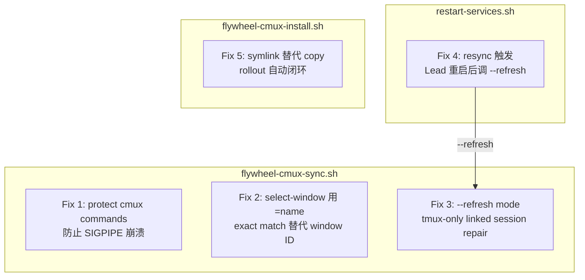

# Plan: cmux Auto-Sync on Lead Restart

**Version**: v1.23.0
**Issue**: FLY-98
**Date**: 2026-04-13
**Source**: FLY-88 cmux workspace sync, `scripts/flywheel-cmux-sync.sh`
**Status**: codex-approved

---

## Problem Statement

每次 Lead daemon 重启（restart-services.sh / hot-deploy / 手动），tmux window 被销毁重建，window ID 变化（如 `@179` → `@203`）。cmux 的 linked session 仍然 select 到旧的 window ID，导致 cmux tab 显示空白/exited。watcher 进程因 exit 141 (SIGPIPE) 崩溃后不再自动修复。

## Root Cause Analysis

### Bug 1: exit 141 (SIGPIPE) 导致 watcher 崩溃

**位置**: `scripts/flywheel-cmux-sync.sh:94`

```bash
cmux new-workspace --command "tmux attach -t '=${view_session}'"
```

脚本顶部 `set -euo pipefail`，`cmux new-workspace` 失败时（socket 断开、cmux 未运行等）直接退出整个脚本。watcher 进程（`--watch` 模式）在第一次遇到 cmux 错误时就会崩溃，之后不再自动恢复。

### Bug 2: select-window 使用 window ID 而非 window name

**位置**: `scripts/flywheel-cmux-sync.sh:87`

```bash
tmux select-window -t "${view_session}:${window_id}" 2>/dev/null || true
```

`window_id`（如 `@179`）在 Lead 重启后失效。新 window 有相同的 **name**（如 `geoforge3d-product-lead`）但不同的 ID。linked session 存在但 current window 指向已死的 window。

### Bug 3: reconcile 逻辑检测不到 "linked session 活着但 current window 错了"

**位置**: `scripts/flywheel-cmux-sync.sh:148`

```bash
if workspace_exists_for "$wname" && ! linked_session_exists "$view_session"; then
```

`reconcile_existing_workspaces()` 只检测 linked session 是否存在。当 linked session 仍然活着（只是 current window 指针错了），这个条件不满足，workspace 不会被修复。

### Gap: restart-services.sh 没有 cmux resync

Lead 重启后没有任何机制通知 cmux watcher 立即重新同步。即使 watcher 没崩，也要等 10s 轮询周期。

## Solution

### 修复范围

5 个改动点，全部在 shell 脚本层面，不涉及 TypeScript 代码：



### Fix 1: 保护 cmux 命令防止 SIGPIPE 崩溃

**文件**: `scripts/flywheel-cmux-sync.sh`

在 `create_workspace_for_window()` 中，`cmux new-workspace`（第 94 行）加保护：

```bash
# Before
cmux new-workspace --command "tmux attach -t '=${view_session}'"

# After
if ! cmux new-workspace --command "tmux attach -t '=${view_session}'" 2>/dev/null; then
    log "WARNING: cmux new-workspace failed for $window_name (cmux not running?)"
    return 0
fi
```

`get_cmux_workspaces()` 中的 `cmux list-workspaces` 已经有 `|| true`（第 41 行），无需改动。

### Fix 2: select-window 用 exact-match window name 替代 window ID

**文件**: `scripts/flywheel-cmux-sync.sh`

在 `create_workspace_for_window()` 中，改用 tmux exact-target 语法（`=name` 前缀强制精确匹配，避免 prefix collision）：

```bash
# Before (line 87)
tmux select-window -t "${view_session}:${window_id}" 2>/dev/null || true

# After — use exact match to prevent prefix collision (e.g., foo vs foo-debug)
tmux select-window -t "=${view_session}:=${window_name}" 2>/dev/null || true
```

**Invariant**: window name 是 cmux ↔ tmux 映射的 stable recovery key。Lead 的 window name 格式为 `${PROJECT_NAME}-${LEAD_ID}`（如 `geoforge3d-product-lead`），由 `claude-lead.sh:562` 生成，跨重启完全稳定。Runner 的 window name 基于 issue slug，同一 issue 内稳定。

tmux target 解析规则：bare name 允许 prefix match，`=name` 强制 exact match。在 linked session group 里 window 可能有类似前缀的名字（如 `product-lead` 和 `product-lead-debug`），exact match 是必要的。

### Fix 3: 新增 `--refresh` mode — tmux-only linked session repair

**文件**: `scripts/flywheel-cmux-sync.sh`

**设计原因**: `flywheel-cmux-sync.sh` 的完整 sync（`--once`/`--watch`）必须从 cmux 内部运行（cmux CLI 需要 socket ancestry 验证）。但 `restart-services.sh` 从 launchd/shell 运行，**不在 cmux 内部**。

解决方案：新增 `--refresh` mode，只做 tmux 操作（修复 linked session 的 current-window 指针），不调用任何 cmux CLI 命令。cmux workspace 层的创建/删除仍由 watcher 在 cmux 内部完成。

```bash
refresh_linked_sessions() {
    # tmux-only: re-select correct window by name in existing linked sessions.
    # Safe to call from outside cmux — no cmux CLI dependency.
    local tmux_windows
    tmux_windows=$(get_tmux_agent_windows)
    [[ -z "$tmux_windows" ]] && return 0

    while IFS='|' read -r src_sess wid wname; do
        local view_session="${VIEW_PREFIX}${wname}"
        if linked_session_exists "$view_session"; then
            # Re-select window by exact name — idempotent, harmless if already correct
            tmux select-window -t "=${view_session}:=${wname}" 2>/dev/null || true
        fi
    done <<< "$tmux_windows"
}
```

在 `case` 命令中新增 `--refresh`，并更新脚本头部注释：

脚本头部注释更新：
```bash
# flywheel-cmux-sync.sh — Sync flywheel tmux windows to cmux workspaces
# --once/--watch: full sync (tmux + cmux workspace management). Must be run from inside cmux.
# --refresh: tmux-only linked session repair. Safe to call from anywhere (no cmux socket needed).
```

Case 命令：
```bash
case "${1:-}" in
  --watch)
    log "Watch mode: syncing every 10s"
    sync_once
    while true; do
      sleep 10
      sync_once
    done
    ;;
  --refresh)
    # tmux-only repair — safe to call from outside cmux
    refresh_linked_sessions
    ;;
  --once|"")
    sync_once
    ;;
  *)
    echo "Usage: flywheel-cmux-sync [--once|--watch|--refresh]"
    echo "  --once    Full sync (cmux + tmux). Must run from inside cmux."
    echo "  --watch   Continuous full sync every 10s. Must run from inside cmux."
    echo "  --refresh tmux-only linked session repair. Safe from anywhere."
    exit 1
    ;;
esac
```

同时在 `sync_once()` 中也调用 `refresh_linked_sessions`（在 reconcile 之后、create 之前），让 watcher 的 10s 轮询也能修复 stale window 指针：

```bash
sync_once() {
    # ... get tmux_windows ...
    
    # 1. Reconcile: close workspaces with dead linked sessions
    reconcile_existing_workspaces
    
    # 2. Refresh linked sessions — fix stale current-window pointers (tmux-only)
    refresh_linked_sessions
    
    # 3. Create missing workspaces
    # ... existing create loop ...
    
    # 4. Cleanup stale
    cleanup_stale_workspaces
}
```

### Fix 4: restart-services.sh 在调用方触发 cmux refresh

**文件**: `scripts/restart-services.sh`

**注意**: `do_restart_all_leads()` 的 stdout 是 machine-readable 格式（`skipped:N failed:M`），被调用方用 sed/算术解析（第 826-830 行、868-870 行）。**绝不能在该函数内部添加 log 或 side effect 到 stdout**。

cmux refresh 放在**调用方**，在解析完 `lead_result` 之后触发：

```bash
# Helper function — defined near other utility functions
trigger_cmux_refresh() {
    local sync_script="$HOME/.flywheel/bin/flywheel-cmux-sync"
    if [[ -x "$sync_script" ]]; then
        # Wait 5s for new Lead tmux windows to initialize, then do tmux-only refresh
        (sleep 5 && "$sync_script" --refresh >> "/tmp/flywheel-cmux-sync.log" 2>&1) &
        log "cmux refresh scheduled (background, 5s delay)"
    fi
}
```

在三处调用方插入（Leads 重启完成、结果解析完成后）：

1. **主路径**（第 826-832 行附近，Step 4 之后）：

```bash
# Step 4: Restart Leads (after Bridge is confirmed healthy)
if [[ "$restart_all_leads" == "true" ]]; then
    lead_result=$(do_restart_all_leads)
    # ... parse lead_result, check leads_failed ...
    # FLY-98: trigger cmux refresh after all Leads restarted
    trigger_cmux_refresh
fi
```

2. **Lead-only 路径**（第 864-886 行附近）：

```bash
# Lead-only restart path
lead_result=$(do_restart_all_leads)
# ... parse lead_result, check leads_failed ...
# FLY-98: trigger cmux refresh after Lead-only restart
trigger_cmux_refresh
```

3. **Rollback 路径**（第 763-772 行附近，`rollback_and_restart()` 内）：

```bash
# rollback_and_restart: also a Lead restart caller site
do_restart_all_leads > /dev/null
# FLY-98: trigger cmux refresh after rollback restart
trigger_cmux_refresh
```

**为什么用 5s delay**: Lead 启动后需要 2-3s 创建 tmux window 和初始化 Claude Code 进程。5s 给够 buffer，且 `--refresh` 是 tmux-only 操作（毫秒级），对用户体验无感知影响。

### Fix 5: flywheel-cmux-install.sh 改用 symlink

**文件**: `scripts/flywheel-cmux-install.sh`

当前 install 用 `cp` 复制脚本到 `~/.flywheel/bin/`。这意味着 repo 里修了 bug，但实际运行的（watcher 和 restart-services.sh 调用的）仍是旧版本，直到手动重新 install。

改用 symlink，repo 更新后立即生效：

```bash
# Before (lines 20-22)
cp "$REPO_DIR/scripts/flywheel-cmux-sync.sh" "$INSTALL_DIR/flywheel-cmux-sync"
cp "$REPO_DIR/scripts/flywheel-cmux-autostart.sh" "$INSTALL_DIR/flywheel-cmux-autostart"
chmod +x "$INSTALL_DIR/flywheel-cmux-sync" "$INSTALL_DIR/flywheel-cmux-autostart"

# After — symlink: repo update → immediate effect
ln -sf "$REPO_DIR/scripts/flywheel-cmux-sync.sh" "$INSTALL_DIR/flywheel-cmux-sync"
ln -sf "$REPO_DIR/scripts/flywheel-cmux-autostart.sh" "$INSTALL_DIR/flywheel-cmux-autostart"
# No chmod needed — symlinks follow source permissions
```

**注意**: symlink 依赖 `$REPO_DIR` 路径不变（`~/Dev/flywheel`）。这在当前项目中是 stable 的。如果 repo 被移动，需要重新 install。这是可接受的 trade-off。

## Design Decisions

### D1: 为什么新增 `--refresh` mode 而非直接调 `--once`？

`--once` 包含 cmux CLI 操作（`cmux list-workspaces`、`cmux new-workspace`、`cmux close-workspace`），这些需要 cmux socket ancestry。`restart-services.sh` 从 launchd/shell 调用，不在 cmux 内部。`--refresh` 只做 tmux 操作（`tmux select-window`），从任何环境都安全。

cmux workspace 层的修复（创建/删除 workspace）交给 watcher 的 10s 轮询在 cmux 内部完成。这样分层更清晰：
- `--refresh`：tmux layer repair（anywhere）
- `--once`/`--watch`：full sync = tmux repair + cmux workspace management（cmux-only）

### D2: 为什么在调用方而非 `do_restart_all_leads()` 内触发 refresh？

`do_restart_all_leads()` 的 stdout contract 是 `skipped:N failed:M`（第 667-709 行），被 sed/算术解析。任何非格式化输出（log、echo）都会破坏解析链。cmux refresh 是 side effect，不属于 Lead restart 的核心职责。

### D3: 为什么用 exact-target `=name` 而非 bare name？

tmux target-window 对 bare name 做 prefix match。`product-lead` 和 `product-lead-debug` 会冲突。`=name` 强制 exact match，消除歧义。这是个 invariant：window name 作为 recovery key 必须精确。

### D4: symlink vs copy 的 trade-off

| | Copy (current) | Symlink (proposed) |
|---|---|---|
| Repo 更新后 | 需手动重 install | 自动生效 |
| Repo 移动后 | 不受影响 | 需重 install |
| 权限 | 需 chmod | 跟随源文件 |

`~/Dev/flywheel` 路径在当前工作流中是固定的，symlink 的 trade-off 可接受。

## Scope

### 改动文件

| 文件 | 改动 | 影响 |
|------|------|------|
| `scripts/flywheel-cmux-sync.sh` | Fix 1-3 | watcher 稳定性 + auto-recovery + `--refresh` mode |
| `scripts/restart-services.sh` | Fix 4 | Lead 重启后即时 tmux refresh |
| `scripts/flywheel-cmux-install.sh` | Fix 5 | rollout 自动闭环 |

### 不改动

- TypeScript 代码：无需改动
- `flywheel-cmux-autostart.sh`：autostart 逻辑不变
- `claude-lead.sh`：Lead window 命名逻辑不变
- `TmuxAdapter.ts`：Runner window 命名逻辑不变

### Lead vs Runner 场景

| 场景 | Window Name 示例 | 稳定性 | Fix 适用 |
|------|------------------|--------|---------|
| Lead | `geoforge3d-product-lead` | 跨重启完全稳定 | Fix 1-5 全部适用 |
| Runner | `fly-98-cmux-auto-sync` | 基于 issue slug，同一 issue 稳定 | Fix 1-3 适用，Fix 4 不直接触发（Runner 不通过 restart-services.sh 重启） |

Runner 场景：Runner 通过 Bridge API 启动/停止，tmux window 创建时已用 name。watcher 的 10s 轮询（Fix 1+3 修复后）能自动 pick up Runner window 变化。

## Testing

### 手动测试

1. **Watcher crash 修复**：关闭 cmux → 在 cmux 外运行 `flywheel-cmux-sync --once` → 应 log warning 而非崩溃退出
2. **Watcher 持续运行**：`flywheel-cmux-sync --watch` 运行期间，反复重启 Lead → watcher 不崩溃，tab 在 10s 内自动恢复
3. **Lead 重启后 cmux 恢复**：在 cmux 中观察 Lead tab → 运行 `restart-services.sh` → cmux tab 应在 ~15s 内恢复（5s delay + watcher 10s 轮询）
4. **Runner 场景**：启动 Runner → cmux 自动出现 tab → kill Runner tmux window → tab 自动清理
5. **`--refresh` outside cmux**：从普通 shell 运行 `flywheel-cmux-sync --refresh` → 只做 tmux select-window，不报 cmux 错误
6. **Symlink 验证**：重新运行 `flywheel-cmux-install.sh` → 确认 `~/.flywheel/bin/flywheel-cmux-sync` 是 symlink 指向 repo 脚本
7. **stdout contract**：运行 `do_restart_all_leads` 的 stdout 仍为 `skipped:N failed:M` 格式，无 cmux 相关 log 混入

## Implementation Order

1. Fix 5: install 改 symlink（先做，确保后续改动立即生效）
2. Fix 1: 保护 cmux 命令（防崩溃）
3. Fix 2: select-window 用 exact name（防 stale ID）
4. Fix 3: `--refresh` mode + 在 `sync_once()` 中调用（修复活着的 stale linked session）
5. Fix 4: restart-services.sh 在调用方触发 refresh
6. 运行 `flywheel-cmux-install.sh` 重装 symlink
7. 手动测试全部场景
8. PR
