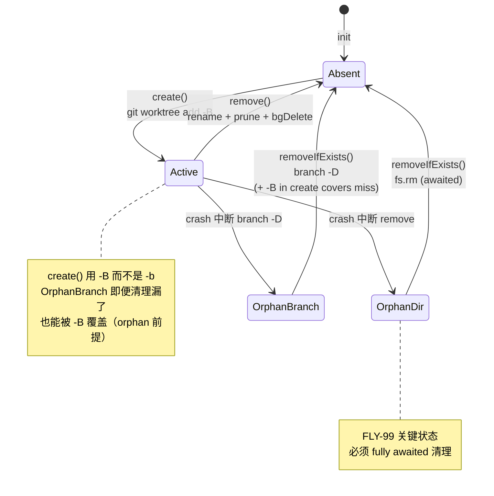

# Plan: Runner Crash on Residual Worktree — FLY-99

**Version**: v1.23.0
**Issue**: FLY-99
**Date**: 2026-04-15
**Source**:
- Direct code analysis — `packages/edge-worker/src/WorktreeManager.ts`, `packages/edge-worker/src/Blueprint.ts`, `packages/teamlead/src/bridge/run-infra.ts`
- Claude Code Agent Team reference — `/Users/xiaorongli/Dev/claude-code/src/utils/worktree.ts`
**Status**: draft

---

## 目标

Runner 在 **session 启动时**如果遇到"上一次 run 留下的残余 worktree"（目录 + branch 都还在），不应 crash。`packages/edge-worker/src/Blueprint.ts:185-194` 已经会先调 `removeIfExists` 再调 `create`，但 `removeIfExists` 对 orphan dir 分支采用**非-awaited 的 `bgDelete`**，导致 race：`rm -rf` 尚未完成 → `git worktree add` 在同一路径失败。

Fix A（最小 surgical change）：
1. `removeIfExists()` 只改 orphan-dir 分支，从 `bgDelete` 改为 awaited `fs.promises.rm`（**修复直接 bug**）
2. `create()` 把 `-b` 改 `-B`（**第二道防线**：orphan branch 残余时 reset 而不是 fail）
3. registered worktree 路径**继续复用现有 `remove()`**（rename 策略本就无 race，不动）
4. `branch -D` 作为本地 branch cleanup policy 保留

## 范围

### In

1. `WorktreeManager.create()` — `git worktree add -b <branch>` → `-B <branch>`（`-b` 要求 branch 不存在，`-B` 是 "reset or create"）
2. `WorktreeManager.removeIfExists()` — **仅** orphan-dir 分支改成 awaited：
   - registered → 继续复用 `this.remove()`（rename + prune + bgDelete 链不动；rename 已把原路径让出）
   - orphan dir → `await fs.promises.rm(worktreePath, { recursive: true, force: true })`（替代非-awaited 的 `bgDelete`）
   - local branch → `git branch -D <branch>`（cleanup policy，保持现行为）
3. 测试改动：
   - 更新 `create()` 现有用例的参数断言（`-b` → `-B`）
   - 更新 `removeIfExists()` 中 orphan-dir 分支的测试（现在需要断言目录在返回时已消失 + 无 `bgDelete` 调用）
   - 新增 3 个 unit tests：
     - **race regression**：mock `fs.promises.rm` 返回 deferred promise → 断言 `removeIfExists` 在 rm resolve 之前**不** resolve
     - `-B` semantics：预置 branch at different commit → `create` 不 throw + branch HEAD === startPoint（用 `startPoint: "main"` 避免 remote 夹具复杂度）
     - FLY-99 full scenario：真实 git repo + orphan dir + orphan branch → `removeIfExists` + `create` 端到端成功（需搭 bare origin 夹具让 `refs/remotes/origin/main` 存在）
4. **不** 加 Blueprint integration test（见 Out）

### Out（明确不做）

- 不改 `Blueprint.ts`（调用点已对）
- 不改 `DagDispatcher.ts` / `run-infra.ts`（`pruneOrphansQuiet` 保持原样，admin 层孤儿）
- 不动 `remove()`（rename+prune+bgDelete 链对 registered path 已是无-race：rename 到 `.removing-{ts}` 临时路径后，原 `worktreePath` 立即可被下次 `create()` 占用；后台 `rm -rf` 清的是临时路径，与 `create()` 目标不冲突）
- 不动 `pruneOrphans()`（admin-only cleanup，FLY-99 无关）
- 不动 `defaultBgDelete` 基础设施（`remove()` + `pruneOrphans()` 仍在用它；当前 PR 不做基础设施改动）
- 不加 `cleanupStaleAgentWorktrees` 式 mtime 扫盘（scope creep，另开 issue）
- 不加 Blueprint integration test —— 仓库里**没有 `Blueprint.initSession` API**；现有 `Blueprint.v0.2.integration.test.ts` 用 `Blueprint.run()` + mocked deps；为这个 race bug 引入 tmux/window 模拟代价过大。在 `WorktreeManager` 侧用真实 git 回归就足够。
- 不在 FLY-96 并行 Discord E2E 上加 Runner crash 场景（内部 race bug，无 Discord 侧可见行为）

## 前置事实（代码审计结果）

### `WorktreeManager.create()` 使用 `-b`（硬失败语义）

`packages/edge-worker/src/WorktreeManager.ts:128-142` 当前传给 `git worktree add` 的参数为：`["-C", mainRepoPath, "worktree", "add", worktreePath, "-b", branch, "${startPoint}^{commit}"]`。

Git 语义：`-b <branch>` 要求 branch **不存在**；否则 `fatal: a branch named '<x>' already exists`。`-B <branch>` 是 "reset or create"，branch 存在时 reset 到指定 commit。**已在本机 Apple Git 2.39.5 验证**。

**Nuance**：`-B` 仍会对 "branch 当前被别的 worktree checked-out" 场景 fail。FLY-99 的场景是 orphan branch（checkout 它的 worktree 已经消失），所以 `-B` 够用；但它不能取代对 still-checked-out branch 的前置清理。

### `removeIfExists()` orphan 分支未 await — FLY-99 root cause

`packages/edge-worker/src/WorktreeManager.ts:225-230`：当目录存在但未注册为 worktree 时，调用 `this.bgDelete("/bin/rm", ["-rf", worktreePath])` 并**立即返回**。`defaultBgDelete`（`WorktreeManager.ts:51-60`）用 `spawn` + `detached: true` + `unref()`，调用者拿不到 Promise 也无法等待。

紧接着回到 `Blueprint.ts:185-194`：Blueprint 立即调 `create()` → `git worktree add <worktreePath>`。若 `rm -rf` 尚未完成 → 同路径 add → fail。

### `remove()` 对 registered path **没有** race

`packages/edge-worker/src/WorktreeManager.ts:160-190`：

```
Phase 1: fs.promises.rename(worktreePath → worktreePath.removing-{ts})  [awaited]
Phase 2: git worktree prune                                              [awaited]
Phase 3: bgDelete("/bin/rm", ["-rf", tmpPath])                           [NOT awaited — but on tmpPath]
```

**关键**：Phase 1 一旦完成，**原 `worktreePath` 已空出**，下次 `create()` 可以立刻占用。Phase 3 的后台删除清的是 `.removing-{ts}` 临时路径，与 `create()` 目标路径不冲突。所以 registered path 不是 FLY-99 的 bug 源——本 PR 不动它。

### Blueprint 调用点

`packages/edge-worker/src/Blueprint.ts:185-194`（**澄清**：FLY-99 issue 描述里写的"Blueprint.ts:185 session 结束时调用 removeIfExists"是笔误。实际位置是 session 启动前）：

```
await this.worktreeManager.removeIfExists(projectRoot, projectName, worktreeIssueId);
worktreeInfo = await this.worktreeManager.create({...});
```

### Claude Code 参考（2 个 insight 被采纳）

源码：`/Users/xiaorongli/Dev/claude-code/src/utils/worktree.ts`

1. **`-B` over `-b`**（line 327-328）：`addArgs.push('-B', worktreeBranch, worktreePath, baseBranch)`，配套注释 "Using -B instead of -b to reset orphan branches that may exist"——正是 FLY-99 的场景。

2. **Fully awaited cleanup**：Claude Code 的 cleanup 路径全部用 `await`，没有 `bgDelete` 这类 fire-and-forget。

**不采纳**：Claude Code 的 `worktree remove --force` 方案。Flywheel 的 `remove()` 已用 rename 策略解决同类问题；把 `--force` 收敛进 `removeIfExists` 会与 `remove()` 分叉出两套 registered cleanup 策略，scope drift。

## 设计

### Fix A 行为对照

| 场景 | Before（FLY-99 前） | After（本 PR） |
|------|---------------------|----------------|
| 无残余 | `create -b` 成功 | `create -B` 成功（行为等价） |
| 只有 branch 残余（已存在但无对应 worktree） | `removeIfExists` `branch -D` → `create -b` 成功 | `removeIfExists` `branch -D` → `create -B` 成功。即便 `branch -D` 因故不跑，`-B` 仍能 reset orphan branch 成功 |
| 只有 dir 残余（**FLY-99 核心 race**） | `removeIfExists` `bgDelete` **未 await** → `create -b` 可能 fail | `removeIfExists` `fs.rm` **awaited** → `create -B` 成功 |
| Dir + branch 都残余（GEO-349） | 两层 race 叠加 fail | `fs.rm` awaited + `branch -D` + `-B` 三重覆盖，稳定成功 |
| Registered worktree 残余 | `remove()` rename+prune+bgDelete → `branch -D` → `create -b` 成功 | 同左，+ `-B`（行为基本等价） |

### Worktree 生命周期（Mermaid）



### 具体代码改动

#### 1. `create()` — `-b` → `-B`

`packages/edge-worker/src/WorktreeManager.ts:128-142`：把 `git worktree add` 的参数数组中的字符串 `"-b"` 改为 `"-B"`。其他参数（`worktreePath`、`branch`、`startPoint`）不变。

**安全性**：`-B` 只在 branch 已存在且未被别的 worktree checkout 时 reset；branch 不存在时等价于 `-b` 创建。reset 的目标是 `${startPoint}^{commit}`（默认 `origin/main`），也是 Runner 启动时期望的起点。`removeIfExists` 的 `branch -D` 仍在前面跑，所以 `-B` 是兜底。

#### 2. `removeIfExists()` — 仅 orphan-dir 分支改 awaited

`packages/edge-worker/src/WorktreeManager.ts:214-248` 改动点：

```
async removeIfExists(mainRepoPath, projectName, issueId) -> boolean:
    branch = worktreeName(mainRepoPath, issueId)
    worktreePath = worktreeDir(mainRepoPath, projectName, issueId)

    // Step 1: registered worktree — REUSE existing remove() (rename 已避免 race)
    if (await this.isRegistered(mainRepoPath, worktreePath)):
        await this.remove(mainRepoPath, worktreePath)
    // Step 2: orphan directory — FULLY AWAITED (was the FLY-99 bug)
    else if (fs.existsSync(worktreePath)):
        await fs.promises.rm(worktreePath, { recursive: true, force: true })

    // Step 3: delete local branch — cleanup policy + idempotency
    // (not a safety net for -B; -B handles the rest)
    try:
        await this.exec("git", ["-C", mainRepoPath, "branch", "-D", branch], mainRepoPath)
        return true
    catch err:
        if not err.message.includes("not found"): throw err
        // if Step 1 or Step 2 actually cleaned, we've still done useful work
        return <true if Step 1 或 Step 2 跑到了分支, else false>
```

**实现细节**（TypeScript）：
- 用局部变量 `cleaned` 追踪 Step 1 / Step 2 是否跑了（对外契约：返回 true 表示"有东西被清了"）
- `fs.promises.rm(path, { recursive: true, force: true })` — Node ≥ 14.14 原生 API
- Step 3 的 `not found` 错误仍然 swallow，保持现行为（`branch -D` 对不存在 branch idempotent）

**返回值契约**：保持 "清了东西 → true；完全没有残余 → false"。用 `cleaned` 标志在每个成功步骤后置 true。

**与 Round 1 的差异**（对照 Codex Round 1 Issue 3）：不再用 `git worktree remove --force`，不引入新的 registered cleanup 策略。Scope 收窄到 orphan-dir 分支 awaited 改造。

#### 3. 测试改动

**A. 更新现有 `create()` 用例**：断言参数数组里包含 `"-B"` 而非 `"-b"`（约 1-2 行断言修改）。

**B. 更新现有 `removeIfExists()` 用例**（Codex Round 2 Issue 2 澄清）：
- **orphan-dir 分支测试**（`WorktreeManager.test.ts:508-` 现有 "cleans up orphan directory" 用例）：原来依赖 `bgDelete` mock 的断言改成验证"`fs.promises.rm` 被调用 + 目录在函数返回时已不存在"
- **`WorktreeManager.test.ts:486-506` "succeeds even if branch doesn't exist (worktree only)" 用例的期望值改 `false` → `true`**：
  - 旧契约：仅当 `branch -D` 成功才返回 true，即便 registered worktree 已清也返回 false
  - 新契约：`cleaned` 追踪 Step 1 / Step 2 是否做过实事。registered worktree 被 `remove()` 清掉后 `cleaned=true`，即便后续 `branch -D` 报 "not found"，整体 cleanup 仍有实效，应返回 `true`
  - 这是 Round 2 暴露的契约一致性问题：契约变了，测试必须同步改
- registered path 的 "removes registered worktree + deletes branch" 用例（`WorktreeManager.test.ts:444-470`）**保持不动**：它本就断言 `true`，与新契约一致
- "is no-op when nothing exists (first run)" 用例（`WorktreeManager.test.ts:472-484`）**保持不动**：完全没残余时 `cleaned=false`，行为不变

**C. 3 个新增 unit tests**

**命名原则**（Codex Round 2 Issue 1）：不硬编码 branch/path 名。方案是把 repo 目录名显式建成 **固定值 `GeoForge3D`**，`repoSlug = "geoforge3d"`（`WorktreeManager.ts:77-78` 做 `.toLowerCase()`），推导出的 branch = `geoforge3d-GEO-42`、worktree path = `{parentDir}/geoforge3d-GEO-42`。这样测试里的常量都可追踪到生产逻辑。或者从 `WorktreeManager` 返回的 `WorktreeInfo` 读路径/branch，不做硬编码。

```
describe("removeIfExists() — FLY-99 regression"):

    it("orphan directory: awaits fs.rm before returning (race regression)"):
        // 核心：mock fs.promises.rm 返回 deferred promise
        // Assert: removeIfExists() 的 promise 在 rm deferred.resolve() 之前 still pending
        // 这把 "future fix backslide to fire-and-forget" 直接变成红灯

        const parent = mkdtempSync(...)
        const mainRepo = path.join(parent, "GeoForge3D")
        mkdirSync(mainRepo)
        // 不需要 git init — worktreeDir() 只看 path.basename
        // orphan path 按生产规则推导，不硬编码
        const orphanPath = path.join(parent, "geoforge3d-GEO-42")
        mkdirSync(orphanPath)

        // 两个 deferred：rmStarted 证明 removeIfExists 已进入 fs.rm 的 await 点；
        // rmPromise 控制 fs.rm 何时 resolve。Codex Round 3 Issue 2：
        // 仅靠 Promise.resolve() ×N flush microtasks 不能证明执行已推进到 rm，
        // 因为 removeIfExists() 前面还有 await this.isRegistered() → await this.list()。
        let rmStartedResolve: () => void
        const rmStarted = new Promise<void>(r => { rmStartedResolve = r })
        let rmResolve: () => void
        const rmPromise = new Promise<void>(r => { rmResolve = r })
        const rmSpy = vi.spyOn(fs.promises, "rm").mockImplementationOnce((...args) => {
            rmStartedResolve()
            return rmPromise as Promise<void>
        })

        // exec mock：isRegistered → false，branch -D → not found
        const { fn } = makeMockExec([
            { stdout: "" },  // worktree list (no entries)
            new Error("error: branch 'geoforge3d-GEO-42' not found"),  // branch -D
        ])
        const mgr = new WorktreeManager({}, fn)
        const removePromise = mgr.removeIfExists(mainRepo, "proj", "GEO-42")

        let settled = false
        removePromise.then(() => { settled = true }, () => { settled = true })

        // 先 await rmStarted：这保证执行已经进入 fs.rm 的 await 点（mock 被调用）。
        // 此时若 removeIfExists() 已 settle，说明 rm 没被 await（race 复现）。
        await rmStarted
        // 再让任何已 enqueue 的 continuation 执行一次，再断言 pending。
        await Promise.resolve()
        expect(settled).toBe(false)  // rm 未 resolve → removeIfExists 必须 pending

        rmResolve!()
        await expect(removePromise).resolves.toBe(true)  // cleaned=true（Step 2 跑过）
        expect(rmSpy).toHaveBeenCalledWith(orphanPath, { recursive: true, force: true })

    it("create() uses -B — pre-existing branch is reset, not failed"):
        // 用 startPoint: "main" 避免 origin/main 夹具
        const parent = mkdtempSync(...)
        const mainRepo = path.join(parent, "GeoForge3D")
        await git(parent, "init", "-q", mainRepo)
        await git(mainRepo, "commit", "--allow-empty", "-m", "seed")
        await git(mainRepo, "branch", "-M", "main")
        // 预置 pre-existing branch at different commit
        const branchName = "geoforge3d-GEO-42"  // 按生产规则推导
        await git(mainRepo, "checkout", "-b", branchName, "main")
        await git(mainRepo, "commit", "--allow-empty", "-m", "orphan commit")
        await git(mainRepo, "checkout", "main")
        // 现在 <branchName> 已存在且 ahead of main

        const mgr = new WorktreeManager({})  // 走默认 execFile — defaultExec 不是导出符号
        const info = await mgr.create({
            mainRepoPath: mainRepo,
            projectName: "proj",
            issueId: "GEO-42",
            startPoint: "main",  // 绕过 origin/main
        })

        // Assert：不 throw，且 info.branch === branchName（生产逻辑推导出来应该一致）
        expect(info.branch).toBe(branchName)
        const branchHead = await gitStdout(mainRepo, "rev-parse", branchName)
        const mainHead = await gitStdout(mainRepo, "rev-parse", "main")
        expect(branchHead).toBe(mainHead)  // reset 到 main

    it("FLY-99 full scenario: orphan dir + orphan branch → removeIfExists + create"):
        // 真实 git repo 端到端，需要搭 bare origin + clone 让 origin/main 可解析
        const parent = mkdtempSync(...)
        const origin = path.join(parent, "origin.git")
        await git(parent, "init", "--bare", origin)
        // 让 bare origin HEAD 指向 main（避免 clone 时默认分支错配）
        await git(origin, "symbolic-ref", "HEAD", "refs/heads/main")

        const seed = path.join(parent, "seed")
        await git(parent, "clone", origin, seed)
        await git(seed, "checkout", "-b", "main")
        await git(seed, "commit", "--allow-empty", "-m", "init")
        await git(seed, "push", "-u", "origin", "main")

        const mainRepo = path.join(parent, "GeoForge3D")  // 固定名 → slug=geoforge3d
        await git(parent, "clone", origin, mainRepo)
        await git(mainRepo, "fetch", "origin")

        // 预置 orphan dir + orphan branch（按生产推导，不硬编码）
        // worktreePath 规则：无 baseDir 时 = dirname(mainRepo) + "/geoforge3d-GEO-42"
        const expectedBranch = "geoforge3d-GEO-42"
        const expectedWorktree = path.join(parent, expectedBranch)
        mkdirSync(expectedWorktree)
        writeFileSync(path.join(expectedWorktree, "garbage"), "stale")
        await git(mainRepo, "branch", expectedBranch, "origin/main")

        const mgr = new WorktreeManager({})  // 走默认 execFile — defaultExec 不是导出符号
        await expect(mgr.removeIfExists(mainRepo, "proj", "GEO-42")).resolves.toBe(true)
        const info = await mgr.create({
            mainRepoPath: mainRepo,
            projectName: "proj",
            issueId: "GEO-42",
        })

        // Assert：path / branch 与生产推导一致，worktree 内容就位
        expect(info.branch).toBe(expectedBranch)
        expect(info.worktreePath).toBe(expectedWorktree)
        expect(fs.existsSync(info.worktreePath)).toBe(true)
        expect(fs.existsSync(path.join(info.worktreePath, "garbage"))).toBe(false)  // 旧内容已清
        const head = await gitStdout(info.worktreePath, "rev-parse", "HEAD")
        const originMain = await gitStdout(mainRepo, "rev-parse", "origin/main")
        expect(head).toBe(originMain)
```

**夹具说明**：
- Repo 目录名**固定为 `GeoForge3D`**，配合 `WorktreeManager.repoSlug()` 的 `.toLowerCase()`，slug 必为 `geoforge3d`——branch/path 命名都能用生产逻辑推导（而不是硬编码猜）
- 只测 `-B` reset 语义的用例（case B）**不搭 remote**，用 `startPoint: "main"` 显式绕过 `origin/main`
- 端到端 FLY-99 scenario（case C）**必须**搭 bare origin + `symbolic-ref HEAD → main`，因为 `create()` 默认 `origin/main`
- Race regression（case A）**不依赖 wall clock**——`fs.promises.rm` 的 mock 用 `mockImplementationOnce` 在被调用时 resolve 一个 `rmStarted` deferred；测试 `await rmStarted` 证明执行已推进到 `await fs.rm(...)` 那一行（Codex Round 3 Issue 2），再断言 `settled === false`，最后释放 `rmPromise` 让流程收尾

**D. 不加 Blueprint integration test**（见 Out 说明）

### Edge Cases

| Case | Behavior |
|------|----------|
| `remove()` 本身失败（Step 1 throw） | 原样抛出，不吞——上游 `Blueprint` 会记录并失败，这是真异常不是 race |
| `fs.rm` 权限不足（EACCES） | throw — 真异常 |
| `branch -D` 失败（非 "not found"） | throw — 保持现行为 |
| Registered worktree 目录已从磁盘消失（prune-able 状态） | `isRegistered` true → 走 `remove()`；`remove()` 里 rename 会 ENOENT 被捕获 → 跳到 prune；prune 清 admin；Step 3 清 branch；返回 true |
| `removeIfExists` 并发（两个 session 同 issueId） | **幂等性论证**（Codex Round 1 Issue 5）：`fs.rm force: true` 对不存在路径 no-op；`branch -D` "not found" 被 swallow；两个调用的最终状态都是"没 orphan 残余"。这不依赖 Git flock 假设。**但**：Blueprint 上游不应让两个 session 同 issueId 并发——FLY-99 不尝试解决这层。 |
| `-B` 遇到 branch 被**别的** worktree checked out | git 会 fail。但这是"别的 Runner 正在用"，不是 orphan——`removeIfExists` 对此不做修复也不兜底。留给上游调度层（Blueprint 不会对同 issueId 双 session）。 |

### 为什么不引入 `cleanupStaleAgentWorktrees` 式 mtime sweep

Claude Code 那个方法按 30 天 mtime 扫全盘 worktree 并强删，目标是清理长期不用的 agent session。Flywheel 场景不同：

1. Flywheel 已有 `pruneOrphans` 负责 admin 层孤儿（dir 消失但 admin 还在）
2. FLY-99 是"单次 race"bug，不是"长期堆积"问题
3. 加 mtime 扫盘引入 false-positive 风险（Annie 长时间 pause 的 issue 可能被误杀）

如需长期清扫机制，应单开 issue 设计保留策略（比如只清 merged PR 对应的 worktree）。

### 安全与 Correctness

- **No shell injection**：内部均用 array args 接口（`execFile` / `spawn`），路径在 internal compute（`worktreeDir`），外部无法注入
- **No data loss**：Orphan worktree 按定义就是"没 owner 的残余"（注册它的 worktree 已消失）；`-B` 只 reset orphan branch，不影响任何 active checkout（git 会拒绝 reset 被 checkout 的 branch）；`fs.rm force: true` 对不存在路径 no-op
- **Idempotent**：重复调用 `removeIfExists` 行为一致。幂等性由 `fs.rm force: true`、`branch -D` "not found" 容忍、`remove()` 自身的 ENOENT 容忍共同保证，**不依赖** Git flock 假设（Codex Round 1 Issue 5 澄清）
- **Branch -D 的角色**：cleanup policy + repo hygiene，**不是** `-B` 的安全网（Codex Round 1 Issue 6 澄清）。`-B` 覆盖 orphan branch reset 的场景，`branch -D` 消除本地 branch 残余本身。两者目标不同，都保留。

## Test Strategy

| 层级 | 覆盖 | 文件 |
|------|------|------|
| Unit | `create()` `-B` 断言、`removeIfExists` orphan-dir 分支改造 | `WorktreeManager.test.ts`（现有用例更新） |
| Unit (new) | Race regression（deferred rm）、`-B` reset semantics、FLY-99 full scenario | `WorktreeManager.test.ts`（新增 3 用例） |
| Integration (Blueprint) | **不加**——无 `Blueprint.initSession` API；引入 tmux 模拟代价过大；WorktreeManager 真实 git 回归已覆盖 | — |
| E2E | **不加**（内部 race bug，无 Discord 侧可见行为；FLY-96 Discord E2E slot 不浪费在此） | — |

**Flaky 风险缓解**：
- 所有真实 git 测试在 `tmpdir`，`afterEach(() => fs.rmSync(tmpdir, { recursive: true, force: true }))`
- 不依赖 wall clock；不依赖 mtime
- Race regression 用 **deterministic signaling**：mock 的 `fs.promises.rm` 在被调用时 resolve 一个 `rmStarted` deferred；测试 `await rmStarted` 后再 `await Promise.resolve()` 一次，然后断言 `settled === false`。这保证执行**已经进入** `await fs.rm(...)` 那一行，而不是靠固定次数的 microtask flush 猜（Codex Round 3 Issue 2）。绝不依赖 wall clock 或 `sleep`。
- Repo 目录名固定为 `GeoForge3D`，slug/branch/path 都能按生产逻辑推导，不硬编码字符串

测试通过标准：`pnpm --filter edge-worker test` 绿 + `pnpm lint` 绿。

## 实施步骤（阶段 3）

1. 切换到 worktree `/Users/xiaorongli/Dev/flywheel-fly-99`（已在 branch `feat/v1.23.0-FLY-99-runner-residual-worktree`）
2. 改 `packages/edge-worker/src/WorktreeManager.ts`：
   - `create()` 参数 `"-b"` → `"-B"`
   - `removeIfExists()` else-if 分支：`this.bgDelete("/bin/rm", ["-rf", worktreePath])` → `await fs.promises.rm(worktreePath, { recursive: true, force: true })`
   - 加 `cleaned` 局部变量追踪返回值语义
3. 更新 `packages/edge-worker/src/__tests__/WorktreeManager.test.ts`：
   - `create()` 用例的 `-b` → `-B` 断言
   - `removeIfExists()` orphan-dir 分支测试改断言（`fs.rm` 调用 + 返回时目录消失）
   - **`WorktreeManager.test.ts:486-506` "succeeds even if branch doesn't exist (worktree only)" 用例期望值 `false` → `true`**（新 `cleaned` 契约一致性）
   - 新增 3 个 unit tests（race regression / `-B` semantics / FLY-99 full scenario），repo 目录名统一用 `GeoForge3D` → slug=`geoforge3d`
4. `pnpm --filter edge-worker test` 全绿
5. `pnpm lint` 全绿
6. Commit + PR：标题 `fix(edge-worker): FLY-99 Runner crash on residual worktree`
7. PR body 链接 Linear FLY-99 + 提及 GEO-349 crash record
8. 走 `/codex-code-review` 流程

## 风险与概念对齐

| 风险 | 缓解 |
|------|------|
| `-B` 覆盖有人在用的 branch | 不会——branch 名字按 `{repoSlug}-{issueId}` 严格推导，只给本 Runner 使用。若 branch 正被别的 worktree checkout（并发场景），git 会 fail——这是调度层问题，不是 FLY-99 scope。 |
| `fs.rm` 破坏 Annie 未提交的 work | 不会——该路径是 orphan（上一个 Runner crash 留下的）；该 issue 的 Runner 运行时 work 应在 worktree 里（registered 分支），由 `remove()` 经 rename 处理，不走 orphan-dir 分支。 |
| `fs.promises.rm` macOS 行为差异（symlink、trailing slash） | `force: true` + `recursive: true` 是 Node 14.14+ 标准组合，跨平台有保证。Flywheel 仓库 `.node-version` 锁在 `22`，远高于 14.14 门槛。 |
| Test flake（git 操作在 CI 慢、tmpdir 清理） | 所有真实 git 测试走 `mkdtempSync` + `afterEach` cleanup；race regression 用 **deterministic** 策略——两个 deferred（`rmStarted` + `rmPromise`）+ `mockImplementationOnce` 在 `fs.rm` 进入时 signal，绝不依赖 wall clock / `sleep` |
| `-B` 仍对 still-checked-out branch fail | 已在 Edge Cases 显式标注；这是 FLY-99 scope 外的问题（并发调度层） |

## Scope 边界（再次强调）

只动 `packages/edge-worker/src/WorktreeManager.ts`（主）+ 其 `__tests__/WorktreeManager.test.ts`（测）。

不动：
- `Blueprint.ts`（调用点对）
- `DagDispatcher.ts` / `run-infra.ts`（admin 层 `pruneOrphans*` 不变）
- `remove()`（rename 策略对 registered path 无 race）
- `pruneOrphans()`（admin-only）
- `defaultBgDelete`（`remove()` + `pruneOrphans()` 仍在用）
- `Blueprint.v0.2.integration.test.ts`（无 `initSession` API，引入 tmux 模拟代价过大）

## Verification Checklist

- [ ] `pnpm --filter edge-worker test` 绿
- [ ] `pnpm lint` 绿
- [ ] 1 个新 race regression test（deferred `fs.rm` + `rmStarted` signal 证明 `await` 已进入，不用 `sleep` / wall clock）
- [ ] 1 个新 `-B` semantics test（repo dir = `GeoForge3D`，用 `startPoint: "main"` 简化夹具）
- [ ] 1 个新 FLY-99 full scenario test（repo dir = `GeoForge3D`，bare origin + `symbolic-ref HEAD → main`）
- [ ] 现有 `create()` 用例 `-b` → `-B` 断言更新
- [ ] 现有 `removeIfExists()` orphan-dir 测试改造（`fs.rm` 调用 + 目录消失）
- [ ] 现有 `removeIfExists()` :486-506 "worktree only" 用例期望值 `false` → `true`（新 `cleaned` 契约）
- [ ] 3 个新测试的 branch/path 全按 `WorktreeManager.worktreeName/worktreeDir` 规则推导或从返回值读取，不硬编码
- [ ] PR body 链接 Linear FLY-99 + GEO-349
- [ ] Codex design review APPROVED
- [ ] Codex code review APPROVED
