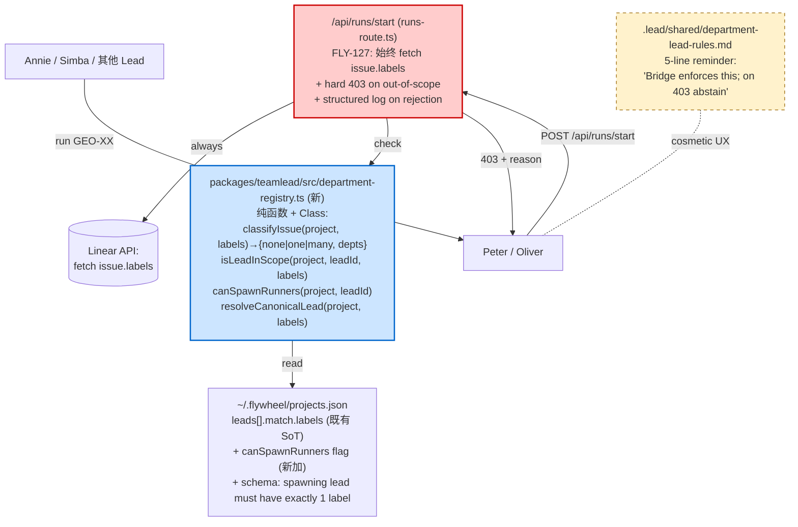

# Plan: FLY-127 — Department Registry + Server-side Spawn Scope Enforcement

**Version**: v1.26.0
**Issue**: FLY-127
**Date**: 2026-05-05
**Source**: Incident 2026-05-05 (Peter spawned Oliver's GEO-366/GEO-101); Annie redesign directive replacing rules-only PR #202; Codex Round 1 design review (CHANGES REQUESTED) addressed inline.
**Status**: codex-approved (Round 3, B direction; ready for implement)

## 1. Goal

让 Lead 不可能 (而不是"被 prompt 劝阻") spawn 不在自己 department scope 的 Runner。新增 department = 改 1 个 config + 重新加载 Bridge + 起新 Lead daemon。**不改 prompt，不重启所有现有 Lead**。

## 2. Invariants (Annie 2026-05-05) — refined after Codex R1

| Invariant | 现状 | 目标 |
|-----------|------|------|
| Linear issue → exactly **1** department (label-driven) | label 驱动，但**多 label 无校验** — issue 可同时挂 `Product`+`Operations` 而无人发现 | 服务端拒绝 multi-dept-label 的 issue spawn (`reason: issue_multiple_department_labels`)。Annie 必须先清理 label，是 fail-closed 行为，不是默认 routing。|
| Lead → exactly **1** department (config-driven) | `LeadConfig.match.labels[]` 允许多 label；当前 production 配置每个 spawning lead 都是单 label，但 schema 没强制 | `loadProjects()` 校验：**spawning lead** (即 `canSpawnRunners !== false`) 必须有且只有 1 个 `match.labels`。多 label 让 config 校验直接 fail。|
| Channel → 1 department | 半结构化 (`chatChannel` + `forumChannel` 在 Lead 上，Core channel 在 cos-lead 上) | v1.26 不动 channel 路由 — 留 v1.27 (channel router 是独立 scope，本 sprint 不混进来) |
| Spawn 跨部门 | LLM rules-only，被 #202 证明不可靠 | **Bridge 服务端 hard enforce 403** + 失败大声 log |
| 加新 department 的真实步骤 | （PR #202 之前没说清楚） | (1) 编辑 `~/.flywheel/projects.json` 增加 lead entry; (2) **Bridge 进程重新加载 config** (重启 or SIGHUP/admin-reload，本 plan 选 Bridge 重启)；(3) start 新 Lead daemon. **既有 Lead daemon 不重启**。|

> **Codex R1 #3 acknowledged**: Bridge 当前把 `projects` 数组在 `createRunsRouter()` 启动时 capture 一次 (plugin.ts ~line 1148+ 处)。"Config-only 不重启" 现状不真。本 plan 不引入 hot-reload (那是独立工程)，而是把 invariant 诚实降级为 "Bridge 重启可以接受，但既有 Lead daemon 不需要重启"。`restart-services.sh` 已经是 ops 例行操作，cost 可接受。

## 3. Why rules-only (PR #202) 不够

(unchanged from R1 — 见 §1 incident 链)

PR #202 把 "Lead 看到不属于自己的 GEO-XX 不要 spawn" 写成 prompt 规则。问题：

1. **依赖 LLM 遵循 prompt**。Peter 在 incident 当天就违反了 `@mention` routing rule。同样的 LLM compliance gap 也会 break 我们新加的 scope check 规则。
2. **没有 server-side truth**。Bridge `/api/runs/start` 当前只校验 `leadId` 是否属于 project，不校验 lead 的 labels 与 issue.labels 是否相交。Lead 一旦被 prompt 误读，Bridge 不会拦。
3. **每加一个 department 都要改所有 Lead 的 prompt**，违反 "config-only" invariant。

## 4. Architecture



**Defense layers**:

1. **(MUST) Server-side hard check in `/api/runs/start`** — 用 DepartmentRegistry 在 dispatch 之前校验 `leadId` 与 `issue.labels`。不通过 → 403 + structured `reason` code。LLM 绕不过去。
2. **(MUST) Department Registry abstraction** — 单一 API 描述 "X 是不是 Y 的 scope" + "issue 的 canonical department 是什么"。所有未来需要 department check 的地方都用同一个 helper。
3. **(MUST) Schema validation** — `loadProjects()` 强制 spawning lead 有且只有 1 label，failed config = Bridge 不启动。
4. **(soft, UX) `.lead/` rules** — 极简版："Bridge 会拦，看到 403 就 abstain"。**不再依赖 LLM 自己查 label**。

## 5. Why no separate `departments.json`

(unchanged) — 选 A: 在 `~/.flywheel/projects.json` 上扩展 `LeadConfig`。Channel router (v1.27) 真要 department-as-first-class 时再迁移。本 plan 只加 1 个 `canSpawnRunners` 字段 + 收紧 `match.labels` schema，不引入新 config 文件。

## 6. Decisions / Open Questions Closed (revised after Codex R1)

| 问题 | 决定 |
|------|------|
| 是否把 cos-lead 标记 `canSpawnRunners: false`？ | 是。**默认值**: 当 `forumChannel` 缺失 → `canSpawnRunners` 默认 `false` (auto-derive from capability)。当 `forumChannel` 存在 → 默认 `true`。**显式覆盖**: 可在 config 里写 `canSpawnRunners: true/false` 强制。这样 Annie 不需要专门为 cos-lead 加字段，迁移成本 0。(Codex R1 #6) |
| Issue 同时有 `Product` + `Operations` label | **拒绝 spawn**: registry `classifyIssue()` 返回 `many`，runs/start → 403 `reason: issue_multiple_department_labels`。让 Annie 先清理 label。这是 fail-closed，符合 invariant "1 issue → 1 department"。(Codex R1 #1) |
| Issue 没有任何 department label | 拒绝 spawn → 403 `reason: issue_no_department_label`。Annie 必须先加 label。(同 R1) |
| Issue 找不到 (Linear 404) | 维持现状 (404 from runs-route line 116-122)。|
| Linear `issue.labels()` 调用 | **强制为所有 spawn 路径调一次** (无论 `leadId` 是否提供)。失败 → 502 `reason: linear_labels_unavailable`。失败不放行。(Codex R1 #4, #7) |
| Lead 重启 vs 灰度 | 服务端 enforcement 一旦 ship 就生效，不需要 Lead 重启。`.lead/` 极简 reminder 是优化项。Bridge **本身**会重启一次 (deploy 时)。|
| 是否 server-side 也校验 chatChannel | **不在本 plan**。Channel routing 是 v1.27 的事。|
| `resolveLeadForIssue()` fallback (`leads[0]`) 与新 invariant 冲突 | (Codex R1 #5) **`/api/runs/start` 不再调 `resolveLeadForIssue`**。改用 `DepartmentRegistry.resolveCanonicalLead()`，多 label/无 label 都返回明确错误码而非 fallback。其他用 `resolveLeadForIssue` / `matchesLead` 的地方包括: `bridge/lead-scope.ts` (经 `matchesLead`)、`bridge/plugin.ts` 的 `/api/sessions/:executionId/close-tmux` 和 `/api/sessions/:executionId/close-runner` (Codex R2 #2 — 注意这两个不是 read-only，而是 lifecycle action with side effects)、stale-patrol notify、`bridge/triage-data-route.ts`。**本 plan 仍然 explicitly 限定 scope 为 spawn-only authorization，不动 lifecycle endpoints**；新建 follow-up FLY issue 跟进 lifecycle authorization 迁移到 registry。(Codex R1 #5, #9 + Codex R2 #2) |
| Multi-label spawning lead | `loadProjects()` 校验：`canSpawnRunners !== false` 的 lead 必须 `match.labels.length === 1`。多 label 让 Bridge boot 失败并 print 明确 error。(Codex R1 #2) |
| **Duplicate department label across spawning leads** (Codex R2 #1) | `loadProjects()` 校验：同一个 project 内, **all spawning leads 的唯一 dept label** 经 `toLowerCase()` 之后**必须互相不重复**。否则 `resolveCanonicalLead` 会有歧义。Bridge boot 失败 + clear error 包含冲突的 leadId 对 + 重复的 label。 |
| `lead-scope.ts` 旧 caller 是不是 "read-only" (Codex R2 #2) | **不是**。`matchesLead` 被 `/api/sessions/:executionId/close-tmux` 和 `/close-runner` 调用，这些是 lifecycle action 有 side effects。 plan §6 / 风险表的 "read-only" 措辞要改正。本 PR 仍然 explicitly scope 为 spawn-only authorization，**不**改动这两个 endpoint；新建 follow-up FLY issue 跟踪 lifecycle authorization 迁移到 registry。|

## 7. Implementation

**Worktree**: `~/Dev/flywheel/worktrees/fly-127-dept-registry`
**Branch**: `feat/v1.26.0-FLY-127-dept-registry`
**Target repo**: `xrliAnnie/flywheel` (TS 改动，不在 GeoForge3D)

### 7.1 LeadConfig 扩展 (`packages/teamlead/src/ProjectConfig.ts`)

```ts
export interface LeadConfig {
  // ... 既有字段保持 ...
  /**
   * FLY-127: When false, the Lead cannot call POST /api/runs/start.
   * Default: derived from forumChannel presence
   *   - forumChannel set     → defaults to true
   *   - forumChannel missing → defaults to false (matches cos-lead today)
   * Explicit value (true/false) always wins.
   */
  canSpawnRunners?: boolean;
}
```

`loadProjects()` 增加校验：
- 如果出现 `canSpawnRunners` 字段，必须是 boolean (loud throw on bad type).
- **Schema enforcement (single label)**: 当 `(lead.canSpawnRunners ?? Boolean(lead.forumChannel)) === true`, **必须 `match.labels.length === 1`**. 多 label 抛 clear error 包含 leadId + label 数量, Bridge 拒启动 (Codex R1 #2). 测试：单 label OK; 多 label spawning lead → throw; 多 label non-spawning lead → 通过 (cos-lead 历史上还可能有多 label sentinel — 不阻止)。
- **Schema enforcement (uniqueness, Codex R2 #1)**: 在 normalize `canSpawnRunners` 之后，对每个 project 收集所有 spawning lead 的唯一 `match.labels[0].toLowerCase()`。若同一 project 内出现两个 spawning lead 拥有等价的 canonical label (case-insensitive)，throw 明确错误：`"Project '<name>': spawning leads <leadA> and <leadB> share canonical label '<label>' (case-insensitive). Each spawning lead must own a unique department label."` Bridge 拒启动。
  - 这保证 `resolveCanonicalLead(project, ["Product"])` 在 issue 单 label 场景下永远只返回 1 个 lead，不出现"两个 lead 都 match"歧义。
  - 测试：(1) 完全相同 label → throw; (2) 大小写不同的相同 label (`"Product"` vs `"product"`) → throw; (3) 不同 label → 通过; (4) non-spawning lead 复用 label → 通过 (e.g. cos-lead 用 `PM` 不冲突)。
- **Default resolution**: 在 `loadProjects()` 里 normalize：`lead.canSpawnRunners = lead.canSpawnRunners ?? Boolean(lead.forumChannel)`。下游所有读这个字段都拿到 boolean，无需再算 fallback。

`canonicalLabel(lead): string | undefined` helper 加进 ProjectConfig.ts: 返回 spawning lead 的唯一 label (大写 normalize) 或 `undefined`。给 registry 用。

### 7.2 DepartmentRegistry (`packages/teamlead/src/department-registry.ts` — 新文件)

```ts
import type { LeadConfig, ProjectEntry } from "./ProjectConfig.js";

export type ScopeReason =
  | "ok"
  | "lead_unknown"
  | "project_unknown"
  | "lead_cannot_spawn"
  | "label_mismatch"
  | "issue_no_department_label"
  | "issue_multiple_department_labels";

export interface ScopeDecision {
  allowed: boolean;
  reason: ScopeReason;
  /** Human-readable, in English (Lead translates to Chinese). */
  message: string;
  /** Set when the issue's classification matches exactly one spawning lead. */
  canonicalLeadId?: string;
  /** Set on `issue_multiple_department_labels` to inform debug output. */
  matchedLeadIds?: string[];
}

export type IssueClassification =
  | { kind: "none"; deptLabels: [] }
  | { kind: "one"; deptLabels: [string]; leadId: string }
  | { kind: "many"; deptLabels: string[]; leadIds: string[] };

export class DepartmentRegistry {
  constructor(private readonly projects: ProjectEntry[]) {}

  /** Strict classification of an issue's department membership.
   *  Uses spawning leads only (canSpawnRunners=true). Case-insensitive label match. */
  classifyIssue(projectName: string, issueLabels: string[]): IssueClassification;

  /** **Spawn authorization**, not generic department membership.
   *  `lead_cannot_spawn` precedes label checks, so this is intentionally
   *  asymmetric: a non-spawning lead is "out of scope" for `/api/runs/start`
   *  even if its `match.labels` overlap the issue. Future generic
   *  membership checks (channel routing in v1.27) should add a separate
   *  `classifyLeadForLabels` method or use `classifyIssue`+`canSpawnRunners`
   *  composition. (Codex R2 #4) */
  isLeadInScope(
    projectName: string,
    leadId: string,
    issueLabels: string[],
  ): ScopeDecision;

  /** Convenience wrapper used when leadId is omitted: returns the unique
   *  spawning lead, or a ScopeDecision describing why no canonical lead exists. */
  resolveCanonicalLead(
    projectName: string,
    issueLabels: string[],
  ):
    | { ok: true; lead: LeadConfig }
    | { ok: false; decision: ScopeDecision };

  canSpawnRunners(projectName: string, leadId: string): boolean;
}
```

**Decision precedence in `isLeadInScope`** (test-locked order):
1. `project_unknown`
2. `lead_unknown`
3. `lead_cannot_spawn` (Simba never reaches label checks)
4. `issue_no_department_label` — issue has zero labels matching any spawning lead in project
5. `issue_multiple_department_labels` — issue has labels matching ≥2 spawning leads
6. `label_mismatch` — issue matches exactly one lead but it isn't `leadId`
7. `ok`

> Codex R1 #1 + #5 closed: multi-dept fails before label_mismatch, and "canonical resolution" is now a registry method, not a `resolveLeadForIssue` call.

### 7.3 Bridge enforcement (`packages/teamlead/src/bridge/runs-route.ts`)

**Insertion point**: after Linear `issue` is fetched (existing line ~115) and before any chat thread registration (existing line ~163) or dispatcher start. This ensures rejections produce **no Forum post, no chat thread, no StateStore session**. (Codex R1 noted this as the safe slot.)

**Existing project-membership check (lines ~91–104)**: keep it as-is — it catches `leadId` that doesn't belong to the project before a Linear API call is made. The registry's `lead_unknown` reason is therefore mostly **unit-test only** for this route; in production the early check returns the legacy 403 with the existing `message` field (no `reason` code). Documented behavior (Codex R2 #3): the new `reason` codes are an **additive** field on the responses produced by the new check — they are not present on the early project-membership 403. Callers in `.lead/` should treat `reason` as optional.

Pseudocode (final implementation may differ slightly to keep diff minimal):

```ts
// existing: const issue = await client.issue(issueId);
// existing: issueTitle / issueIdentifier captured

// FLY-127: ALWAYS fetch labels (no longer gated on !leadId).
// Was: only inside `if (!leadId)` auto-resolve block.
let issueLabels: string[];
try {
  const labelConn = await issue.labels();
  issueLabels = labelConn.nodes.map((l: { name: string }) => l.name);
} catch (err) {
  console.error(
    `[runs/start FLY-127] label hydration failed for ${issueIdentifier}:`,
    (err as Error).message,
  );
  res.status(502).json({
    success: false,
    message: `Cannot fetch labels for ${issueIdentifier} from Linear: ${(err as Error).message}`,
    reason: "linear_labels_unavailable",
  });
  return;
}

// FLY-127: When leadId omitted, registry-resolve canonically (NOT resolveLeadForIssue).
if (!leadId) {
  const resolution = registry.resolveCanonicalLead(projectName, issueLabels);
  if (!resolution.ok) {
    logRejection(resolution.decision, { projectName, issueIdentifier, issueLabels });
    res.status(403).json({
      success: false,
      message: resolution.decision.message,
      reason: resolution.decision.reason,
      issueIdentifier,
      issueLabels,
    });
    return;
  }
  leadId = resolution.lead.agentId;
}

// FLY-127: Authoritative scope check (always runs, even after canonical resolve).
const decision = registry.isLeadInScope(projectName, leadId!, issueLabels);
if (!decision.allowed) {
  logRejection(decision, { projectName, issueIdentifier, leadId, issueLabels });
  res.status(403).json({
    success: false,
    message: decision.message,
    reason: decision.reason,
    issueIdentifier,
    leadId,
    issueLabels,
    canonicalLeadId: decision.canonicalLeadId,
    matchedLeadIds: decision.matchedLeadIds,
  });
  return;
}

// existing: chat thread registration ... dispatcher.start(...)
```

**`logRejection` helper** (Codex R1 #11) — print 1 structured line at `console.warn` level: `[runs/start FLY-127 reject] reason=X projectName=Y leadId=Z issueIdentifier=W issueLabels=[...] canonicalLeadId=...`. Annie greps Bridge log to debug Discord-side symptoms.

**Wiring**: `createRunsRouter` already takes `projects: ProjectEntry[]`; instantiate `new DepartmentRegistry(projects)` once at router construction. No additional plugin.ts wiring beyond passing the existing `projects` reference.

### 7.4 `.lead/` rules cleanup (rules-thin)

**Companion GeoForge3D PR**, lands **after** flywheel PR is deployed (Codex R1 #12). Net change vs PR #202:

- **Drop** the 60-line "Department Scope Check" section in `department-lead-rules.md`. Replace with:
  ```markdown
  ### Department Scope Check (FLY-127)

  The Bridge enforces department scope server-side. If `POST /api/runs/start`
  returns `success:false` with one of these `reason` codes, do NOT retry:

  | reason | meaning | what to say |
  |--------|---------|-------------|
  | `label_mismatch` | this issue belongs to another Lead's department | "GEO-XX 是 {canonicalLeadId} 的范围，我不会启动 Runner" + tag the right Lead |
  | `lead_cannot_spawn` | you (e.g. Simba) are not configured to spawn Runners | "我不负责启动 Runner，请让 Peter 或 Oliver 处理" |
  | `issue_no_department_label` | issue has no Product/Operations label | "GEO-XX 没有 department label，麻烦 Annie 标一下我才能启动" |
  | `issue_multiple_department_labels` | issue has BOTH Product and Operations | "GEO-XX 同时挂了 Product+Operations，请 Annie 决定哪个部门来做" |
  | `linear_labels_unavailable` | Bridge couldn't reach Linear to verify | "暂时无法验证 GEO-XX 的 department，已中止启动，稍后再试" |

  Reply once in Chinese, do not retry, do not call /api/runs/start again.
  ```
- **Keep** the soft Core Channel routing reminders in `product-lead/identity.md` + `ops-lead/identity.md` from PR #202 — softened to "if you spawn cross-dept, Bridge returns 403; abstain".
- **Keep** `cos-lead/identity.md` "Runner Spawn Boundary" section (matches `canSpawnRunners=false` server-side).
- **Drop** `.lead/test-rules.sh` — replaced by real TS unit tests in this plan (much stronger coverage).

PR #202 → close once flywheel PR is deployed AND companion PR is up. Sequencing in §10.

### 7.5 projects.json migration

**Codex R1 #6 closed**: with `canSpawnRunners` defaulting to `Boolean(forumChannel)`, **no manual edit needed** — cos-lead lacks `forumChannel` so it auto-defaults to `false`. Annie can optionally add `canSpawnRunners: true` to override (e.g., a future PM lead that does spawn).

Document the field + auto-default rule in CLAUDE.md / sample config.

## 8. Tests (TDD — write first)

### 8.1 Unit: `packages/teamlead/src/__tests__/department-registry.test.ts` (new)

| Case | Setup | Expected |
|------|-------|----------|
| project_unknown | call with bad projectName | `allowed=false, reason=project_unknown` |
| lead_unknown | call with leadId not in project | `allowed=false, reason=lead_unknown` |
| lead_cannot_spawn | leadId=cos-lead (canSpawnRunners=false) | `allowed=false, reason=lead_cannot_spawn` (precedes label check) |
| issue_no_department_label | issue.labels=[] | `allowed=false, reason=issue_no_department_label` |
| issue_no_department_label (foreign) | issue.labels=["Marketing"] | `allowed=false, reason=issue_no_department_label` |
| issue_multiple_department_labels | issue.labels=["Product","Operations"] | `allowed=false, reason=issue_multiple_department_labels, matchedLeadIds=[product-lead,ops-lead]` |
| label_mismatch | leadId=product-lead, issue.labels=["Operations"] | `allowed=false, reason=label_mismatch, canonicalLeadId=ops-lead` |
| ok exact | leadId=product-lead, issue.labels=["Product"] | `allowed=true, reason=ok, canonicalLeadId=product-lead` |
| ok case-insensitive | issue.labels=["product"] | `allowed=true` |
| ok multi-label-non-dept | issue.labels=["Product","Bug"] | `allowed=true` (Bug is not a dept label) |
| classifyIssue: none | [] | `kind=none` |
| classifyIssue: one | ["Product"] | `kind=one, leadId=product-lead` |
| classifyIssue: many | ["Product","Operations"] | `kind=many, leadIds=[product-lead, ops-lead]` |
| resolveCanonicalLead: one | ["Product"] | `ok:true, lead=product-lead` |
| resolveCanonicalLead: none | [] | `ok:false, decision.reason=issue_no_department_label` |
| resolveCanonicalLead: many | ["Product","Operations"] | `ok:false, decision.reason=issue_multiple_department_labels` |
| canSpawnRunners default true (forumChannel) | lead with forumChannel, no flag | `true` |
| canSpawnRunners default false (no forumChannel) | lead without forumChannel, no flag | `false` |
| canSpawnRunners explicit override | lead with `false` overriding forum-derived true | `false` |
| precedence: cannot-spawn beats label match | cos-lead with `Operations` issue (hypothetical) | `lead_cannot_spawn` (not label match) |

### 8.2 `ProjectConfig.test.ts` extensions

- `canSpawnRunners: true/false` parses and persists correctly.
- `canSpawnRunners` bad type (string `"yes"`) throws clear error.
- Default rule: `forumChannel` set + no flag → normalized to `true`. `forumChannel` absent + no flag → normalized to `false`.
- **Schema validation (single label per spawning lead)**: spawning lead with `match.labels.length > 1` → throws clear error mentioning lead `agentId` + label count. Non-spawning lead with multi-label → passes (allowed for sentinel labels).
- **Schema validation (canonical label uniqueness across spawning leads, Codex R2 #1)**: two spawning leads in the same project with the same canonical label (case-insensitive) → throws clear error naming both leadIds and the conflicting label. Cases:
  - exact match: both `["Product"]` → throw
  - case-insensitive match: `["Product"]` and `["product"]` → throw
  - non-conflict: `["Product"]` and `["Operations"]` → pass
  - non-spawning lead reuses label: spawning `["Product"]` + non-spawning `["Product"]` (PM sentinel) → pass (only spawning leads checked)
- Existing multi-label tests in this file (if any reference spawning leads) need adjustment — verify and update; this is acceptable test churn given the new invariant.

### 8.3 Integration: `packages/teamlead/src/__tests__/start-e2e.test.ts` extensions (Codex R1 #10)

| Case | Bridge call | Expected response |
|------|-------------|-------------------|
| OK in-scope explicit leadId | `POST /api/runs/start` leadId=product-lead, issue.labels=["Product"] | 200, `success: true` |
| 403 label_mismatch (the FLY-127 incident) | leadId=product-lead, issue.labels=["Operations"] | 403, `reason: label_mismatch`, body has `canonicalLeadId: ops-lead` |
| 403 lead_cannot_spawn (Simba) | leadId=cos-lead, any labels | 403, `reason: lead_cannot_spawn` |
| 403 issue_no_department_label | leadId=product-lead, issue.labels=["Bug"] | 403, `reason: issue_no_department_label` |
| 403 issue_multiple_department_labels | leadId omitted, issue.labels=["Product","Operations"] | 403, `reason: issue_multiple_department_labels` |
| Auto-resolve happy path | leadId omitted, issue.labels=["Operations"] | 200, leadId=ops-lead in response |
| Auto-resolve fail (no dept label) | leadId omitted, issue.labels=["Marketing"] | 403, `reason: issue_no_department_label` (replaces old leads[0] fallback behavior) |
| Auto-resolve fail (multi-dept) | leadId omitted, issue.labels=["Product","Operations"] | 403 (covered above) |
| 502 linear_labels_unavailable | mock `issue.labels()` to throw | 502, `reason: linear_labels_unavailable`, no Forum post / chat thread created |
| Side-effect isolation on 403 | Any 403 case | Verify `store.getActiveSessions()` did not register a session, dispatcher was not called, no chat thread row created |

> Codex R1 #10 closed: file is `start-e2e.test.ts` (existing), not the imaginary `runs-route.test.ts`.

### 8.4 Pre-merge data hygiene check (Codex R1 #8)

Before deploying, run a one-off diagnostic script (`scripts/audit-issue-labels.mjs`, doesn't need to live in production code) that prints open issues with 0 / multi department labels in both GeoForge3D + Flywheel projects. Output goes in PR description so Annie sees the impact:

- Per Codex's MCP audit on 2026-05-05: ~18 open GEO + ~55 open FLY issues currently lack a department label.
- Annie either backfills before merge, or accepts those will 403 until labelled. Either is OK; explicit decision must be in PR description.
- Document this gate in §10 rollout.

### 8.5 Smoke (manual, post-deploy)

(unchanged) — Annie issues "Peter, run GEO-XXX" for an Operations-only issue:
- Expected: Bridge returns 403 to Peter; Peter posts the rejection message in Discord.
- Verify: no Forum post, no chat thread, no tmux Runner, no Linear status change.

## 9. PR strategy (Codex R1 #12)

**Order of operations**:

1. **Flywheel PR** (this branch) — TS code + tests. Merge + deploy first. From the moment Bridge restarts with this code, **Annie is protected** even though `.lead/` still has PR #202's verbose rules. The verbose rules become redundant but not harmful.
2. **GeoForge3D companion PR** — small (~30 lines): replace PR #202's verbose rules with the 5-line Bridge-403 reminder + close PR #202 with reference to flywheel PR. Lands after flywheel deploys; does not need urgent restart of Leads.
3. PR #202 closes when both above are merged.

**Why this order**: never have `.lead/` rules absent while server enforcement isn't in place. PR #202's rules are over-engineered but safe to leave — they don't break anything when server is also enforcing.

## 10. Rollout

1. Run §8.4 label audit; either backfill or document.
2. Flywheel PR merges, Bridge deploy (`restart-services.sh`). **All Leads keep working** — they just can't cross-spawn anymore.
3. GeoForge3D companion PR merges. New Lead startup picks up the lighter rules at next natural restart cycle. **No emergency Lead restart**.
4. Annie smoke test (§8.5).
5. Close PR #202 with link to merged flywheel PR.

**No emergency restart required**. Server-side enforcement is in place from the moment Bridge restarts; Lead prompts are cosmetic UX.

## 11. Risks (revised after Codex R1)

| Risk | Mitigation |
|------|------------|
| Existing GEO/FLY issues with no/multi dept labels suddenly fail | §8.4 pre-merge audit + backfill or explicit accept-the-block decision in PR description |
| Linear API rate limit on extra `issue.labels()` call (always vs sometimes) | `runs/start` is not a polling path; throughput is human-driven (~minutes between calls). Linear API limits are 1500/hr/team — orders of magnitude headroom. |
| `match.labels.length>1` config triggers Bridge boot fail post-deploy | Pre-deploy: run `loadProjects()` validation against current production config in CI / setup-flywheel-hooks. Loud failure is preferred to silent misroute, but boot failure must surface during deploy not Annie's prod use. |
| Future channel router (v1.27) needs different abstraction | DepartmentRegistry API is intentionally narrow; v1.27 layers atop. No coupling cost today. |
| `lead-scope.ts` (and lifecycle endpoints `close-tmux` / `close-runner`) still use `leads[0]` fallback via `matchesLead` | Documented limitation. **Correction**: these are **not pure read-only filters** — `close-tmux` and `close-runner` perform lifecycle actions with side effects, so a leads[0] fallback could let the wrong lead close another department's session. (Codex R2 #2) Out-of-scope for FLY-127 (this PR is explicitly spawn-only authorization). Follow-up FLY issue tracks lifecycle authorization migration. Worst case until follow-up: a misconfigured Lead could close a session owned by another department; recoverable by re-launching the Runner. Not a privilege escalation, but tracked. |
| Bridge config not hot-reloaded → adding new dept needs Bridge restart | Documented in §2 invariants — honestly downgraded. Out-of-scope to add hot-reload in this plan. |
| Annie forgets to set `canSpawnRunners` on a future PM-only lead | Auto-derive from `forumChannel` makes the common case correct (no PM forum → no spawn). Edge cases (PM lead WITH forum but shouldn't spawn) require explicit `canSpawnRunners: false` — documented. |

## 12. Acceptance Criteria

- `pnpm test` 全绿，含 §8.1 + §8.2 + §8.3 新增测试。
- `POST /api/runs/start` 在 cross-department / multi-dept / no-dept / cos-lead 场景返回 403 with structured `reason` code + `issueLabels` + `canonicalLeadId` (when single).
- `loadProjects()` 拒绝任何 spawning lead 配置成多 label。
- `cos-lead` 默认 `canSpawnRunners=false` 不需要手动改 config。
- 加新 department 流程 = (1) 配置 `LeadConfig` entry; (2) Bridge 重启; (3) 起新 Lead daemon. **既有 Lead 不重启，prompt 不改**.
- §8.4 label audit 跑过，PR description 含影响数字。
- Annie smoke test pass (§8.5).
- Codex code review APPROVED.
