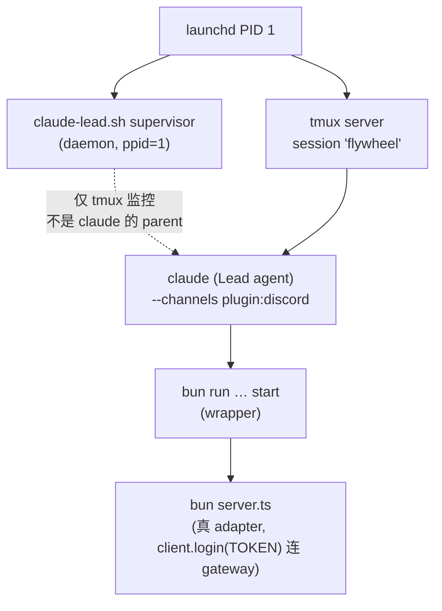
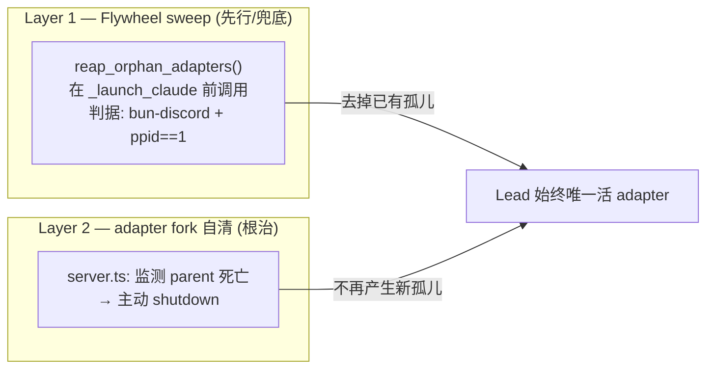

# Plan: Discord adapter 孤儿回收 + 自清根治

**Version**: v1.30.1（暂定，ship 时按当时 VERSION 校准；FLY-178 占 v1.30.0、FLY-177 占 v1.29.4）
**Issue**: FLY-183（Urgent）
**Date**: 2026-05-29
**Source**: 本 issue 为实锤事故 debug，无独立 exploration/research 文件；审计结论内联在 §1
**Status**: codex-approved（3 轮:R1/R2 各 2 HIGH 已解 → R3 APPROVED;残留仅 2 个实施期 LOW 验证项,见 §6.2/§7）

---

## 0. team-lead 已拍的决策（前置）

| 编号 | 决策 |
|------|------|
| Q1 | **A — 双层根治**，分两步、严格 review：先 Flywheel sweep（立即价值、低风险），再 adapter fork 自清（根治，碰 plugin fork 风险高 → Codex 严格把关 + 真机验证） |
| Q2 | **(a) 事件驱动 reap**（supervisor launch/resume 前），符合 FLY-129「零新增周期性 load」 |
| Q3 | **本期不做**自愈检测（connection=0 → 重建），拆独立 follow-up issue。先去病因 |
| Q4 | **清所有 discord 孤儿**（不限 Flywheel Lead，含 BELLE/MUFASA 等个人 agent 的孤儿）—— 它们也占 Discord 连接，一并清才彻底；`ppid==1` 保证零误杀活 agent（Annie 拍） |

---

## 1. 背景与根因（审计实锤）

### 1.1 Adapter 进程架构（三层链 + 与 supervisor 解耦）



关键事实（ps/lsof 实测）：

1. supervisor（`claude-lead.sh`）**不是 claude 的 parent** —— 它在 tmux window 里起 claude（`_launch_claude` 用 `tmux new-window … claude`），只通过 `tmux list-panes` 监控。claude 的 parent 是 **tmux server**。
2. adapter 是 claude 起的 **MCP stdio server**：plugin `.mcp.json` = `bun run --cwd <plugin> --shell=bun --silent start`，`start` 脚本 = `bun install --no-summary && bun server.ts`。所以是 **wrapper（`bun run … start`）→ inner（`bun server.ts`）** 两个 bun 进程，inner 才持有 Discord gateway 连接。
3. **每个带 `--channels plugin:discord` 的 claude 都起这样一条链** —— 不止 Lead，worker / qa / 个人 agent（BELLE / MUFASA）都各有一条。

### 1.2 孤儿产生机制

- claude 死时（crash / supervisor resume 的 `tmux kill-window` 发 SIGHUP / daemon 重启），adapter **本应**靠 `server.ts:935-936` 的 `process.stdin.on('end'/'close')` 自杀（stdin EOF = MCP pipe 断）。
- **但这个自清在 bun 下不可靠**。根因二段证据：
  - **MCP SDK `StdioServerTransport` 根本不监听 `end`/`close`** —— 实读 `node_modules/@modelcontextprotocol/sdk/dist/esm/server/stdio.js`：`start()` 只挂 `stdin.on('data')` + `stdin.on('error')`；`close()` 只在 app 显式调用时才 `onclose`。所以 EOF 检测**完全依赖** server.ts 自己挂的 `stdin.on('end'/'close')`。
  - server.ts 那两个 handler 在 bun 里对「unix socketpair 的 peer 被**突然** kill（SIGHUP/SIGKILL，RST 而非干净 FIN）」不可靠触发。
- **实锤**：审计当时系统里就躺着一个孤儿 `bun server.ts` **PID 68906** —— stdin peer 已死（`lsof` 显示 `0u … ->(none)`），却已存活 **5h38m** 没退出，被 reparent 到 launchd（**ppid=1**），仍占着某 bot token 的 gateway 连接。
- supervisor resume → 新 claude → 新 adapter，**旧孤儿不清 → 累积**（事故时 14 个）→ 同一 bot token 多孤儿抢 gateway → 撞 Discord 单 bot 连接 / identify 上限 → 活 Lead 的新 adapter 连不上（实测 **0 个 ESTABLISHED 443**）→ Annie 的 DM 没有活 adapter 接收 → Lead 静默收不到。

### 1.3 现有清理 = 零

- 全 repo grep：**没有任何 adapter / bun / discord 进程回收逻辑**。
- supervisor `cleanup()`（SIGTERM 路径）只 `tmux kill-window` claude + 杀自己后台 job，**从不碰 adapter bun 进程**。
- `_launch_claude` resume 前只 `tmux kill-window` 旧 window（claude），不碰旧 adapter。
- full daemon 重启也不自动清 ppid=1 孤儿 —— 事故止血是**手动** kill 14→3。

### 1.4 与 FLY-182 / LeadAlert 的关系（scope 收窄）

- **FLY-182（mailbox 无限增长）= 同类根因、不同资源**：长命 resume Lead 缺 Claude Code 原生「短命 team + TeamDelete `rm -rf`」teardown 层。182 是文件 / 队列层，183 是进程层。**兄弟问题，不是同一个 fix。**
- **LeadAlert sent=0 ≠ 同源**：LeadAlert 走 **Discord REST API**（`LeadAlertNotifier.ts:284` `POST /channels/{id}/messages`，无状态、不需 gateway session）；183 坏的是 **inbound gateway 连接**（adapter `client.login`）。REST 与 gateway 是不同 bucket，孤儿抢的是 gateway 连接，不影响 REST 发送。**LeadAlert sent=0 大概率独立 bug，183 不扩进去。**

---

## 2. 设计目标 / 非目标

**目标**
- 不再产生孤儿 adapter（根治，Layer 2）。
- 即使产生，也在下次 Lead launch/resume 前被回收（兜底，Layer 1）。
- 回收判据**零误杀活 agent 的 adapter**（直接解掉止血时的误杀教训）。
- FLY-129 合规(Codex R2 #5,措辞统一):**Layer 1 sweep 纯事件驱动、零周期后台 load**;**Layer 2 新增一个有界、进程内的 ppid 自检 timer(10s)** 作为经认可的例外(§5.3,已报备 Annie)—— 它不是 FLY-129 关注的系统级常驻轮询。

**非目标（本期不做）**
- connection=0 主动探测 + 重建（Q3 → 独立 follow-up issue）。
- 修 FLY-182 mailbox（兄弟 issue，别人管）。
- 修 LeadAlert sent=0（独立 issue）。

---

## 3. 修复总览（双层）



两层互为 belt-and-suspenders：Layer 2 让孤儿基本不再产生；Layer 1 兜底清理历史孤儿 + Layer 2 万一漏网的场景。

---

## 4. Layer 1 — Flywheel sweep（先行）

### 4.1 触发点（事件驱动，零周期 load）+ 代码组织

**代码组织**：把 reap 抽成独立可 source 的 lib `packages/teamlead/scripts/lib/reap-orphan-adapters.sh`（`scripts/lib/` 已存在）。好处:(1) bash 测试可直接 source 这个 lib 单测,不必拉起整个 supervisor;(2) 可**独立运行做 dry-run 验证**(见 §4.2 + §6)。`claude-lead.sh` 在 **`SCRIPT_DIR` 定义之后(line ~199)、`_launch_claude` 定义之前(line ~701)** `source "$SCRIPT_DIR/lib/reap-orphan-adapters.sh"`(Codex R2 #4 — helper 路径依赖 `SCRIPT_DIR`);在 `_launch_claude` 里调用 `reap_orphan_adapters`。lib 自带 fallback logger,standalone 也能跑。

`_launch_claude` 是 fresh-start 和 resume **两条路径唯一的公共入口**(recovery loop line 1433 / 1453 都走它),挂这里一处覆盖全部重启场景,纯事件驱动(每次重启跑一次)**无新增周期 timer**(满足 FLY-129)。

**关键:必须在 `tmux kill-window` 旧 window 之后再 sweep 一次(Codex R1 #3)。** 现状 `_launch_claude` 顺序:`ensure_tmux_session` → `tmux kill-window` 旧同名 window(line 706-707)→ 起新 claude。在 supervisor **重启**(非 crash)场景,那个旧 window 可能**还跑着活的旧 claude**(ppid≠1,pre-sweep 会跳过它);紧接的 `tmux kill-window` 杀掉它 → **正好制造**出 Layer 1 要清的孤儿,而新 claude 立刻起来 → 孤儿要等下次重启才被清。所以序列改为:

```
_launch_claude():
  ensure_tmux_session
  reap_orphan_adapters            # ① pre-sweep:清历史孤儿
  tmux kill-window <stale>        # ② 杀旧 window(可能含活旧 claude)
  sleep 0.5                       # ③ 有界 settle:等旧 claude 死 + adapter reparent 到 1
  reap_orphan_adapters            # ④ re-sweep:清②刚制造的孤儿
  tmux new-window … claude …      # ⑤ 起新 claude
```
- ①④ 之间不会误杀**新** adapter(⑤ 之前它还不存在)。
- `sleep 0.5` 是一次性有界 settle,非周期 timer。

**`cleanup()`(graceful shutdown,line 847)同样时序问题**:它 `tmux kill-window` claude 后若立刻 reap,adapter 可能尚未 reparent。处理:`cleanup()` 里 reap 设为 **best-effort + 短 settle**(或直接依赖 Layer 2 自清),**不**把它当「保证清干净」—— 失败/超时不阻塞退出。

### 4.2 判据与回收逻辑

**判据(核心)**:一个进程是「可回收孤儿」当且仅当 **(A) 它是 discord adapter 进程 且 (B) `ppid == 1`**。

**(B) `ppid==1` 为什么安全且充分**:
- 活 adapter 的 ppid 永远是活着的直接 parent(消 wrapper 后 = claude;过渡期遗留 inner = wrapper),绝不为 1。fork/exec 后 ppid 立即 = 真 parent,**不存在**活 adapter 短暂 ppid==1 的窗口 → 无 race 误杀。
- parent 一死,adapter 的 MCP stdin peer 已断,再也服务不了那个已死 claude → 杀掉绝对安全。**单这一条零误杀活 agent。**

**(A) adapter 进程识别 —— 必须覆盖三种 argv 形态(Codex R1 #1)**:
> macOS `ps command` 显示 **argv 不显示 cwd**。三种形态:
> 1. **新形态(消 wrapper 后)** inner:`bun /…/claude-plugins-official/discord/0.0.4/server.ts`(绝对路径,**含** plugin 路径)→ 直接路径匹配。
> 2. **遗留 wrapper**(过渡期未升级或升级前的旧进程):`bun run --cwd …/discord/… --silent start`(**含** plugin 路径)→ 直接路径匹配。
> 3. **遗留 inner**(事故里的 68906 形态):`bun server.ts`(**相对名,不含** plugin 路径)→ 路径 grep **漏掉**。

对形态 3,用 **cwd 探测**兜底:对每个 `bun … server.ts` 候选,用 `lsof -a -p "$pid" -d cwd -Fn`(macOS 安全)读其 cwd,cwd 落在 `claude-plugins-official/discord` 才算 adapter。`lsof` 不可用时降级:跳过形态 3(新形态部署后形态 3 会自然消失,只在过渡期需要)。

**回收动作 + 递归子树(Codex R1 #4)**:不假设 wrapper→inner 只有一层(`bun run --shell=bun` 可能夹中间进程)。对每个命中孤儿:递归收集后代 `collect_descendants(pid)` → **最深先 TERM** → TERM root → grace 后 re-list 仍存活的匹配孤儿 `KILL`。全程 `kill -0` 校验、`|| true` 容错,**fail-open**(reap 失败绝不阻塞 Lead 启动)。

**并发安全(Codex R1 #8)**:3 个 Lead supervisor 可能并发 reap;ppid==1 孤儿谁杀都幂等(`kill -0` 守 + 容忍 ESRCH)。mutex **可选**(只为去重日志,不影响正确性);若加,用 `flywheel-cmux-sync.sh` 的 mkdir 有界锁范式,**且卡住的 reap 锁绝不能阻塞 Lead 启动**。

**范围 = 全部 discord 孤儿**(Q4,见 §4.3),判据只看 (A)+(B),不分 Lead/个人 agent。

**dry-run 安全开关**:`FLY183_REAP_DRY_RUN=1` → 只列「会杀的 PID + ppid + argv」**绝不 kill**,用于真机先验判据正确性(team-lead 误杀教训)。生产默认 `=0`。

**lib 自包含(Codex R1 #7)**:`lib/reap-orphan-adapters.sh` 定义 fallback logger(若 caller 未定义 `log`),不依赖 `bun` 在 PATH,启动时校验 `ps`/`awk`/`pgrep`/`lsof` 可用(缺谁降级谁)。可独立运行(standalone dry-run)。

**伪代码(bash,实现以此为骨架)**:

```bash
# lib/reap-orphan-adapters.sh — FLY-183
# Orphan = discord adapter process (3 argv shapes) with ppid==1.
command -v log >/dev/null 2>&1 || log() { printf '%s\n' "$*" >&2; }   # fallback logger

# Match BOTH install layouts (Codex R2 #1): cache uses .../claude-plugins-official/discord/,
# marketplace (the actual runtime path per update-discord-plugin.sh) uses
# .../claude-plugins-official/external_plugins/discord/.
_is_discord_path() {   # $1=string (argv or cwd) → 0 if it points at the discord plugin
  case "$1" in
    *"/claude-plugins-official/discord/"*)            return 0 ;;   # cache
    *"/claude-plugins-official/external_plugins/discord"*) return 0 ;; # marketplace/fork
  esac
  return 1
}

_is_discord_adapter() {   # $1=pid $2=cmd → 0 if it's an adapter
  _is_discord_path "$2" && return 0                   # shapes 1 & 2: path in argv
  case "$2" in *bun*server.ts*)                        # shape 3: relative `bun server.ts`
    command -v lsof >/dev/null 2>&1 || return 1        # no lsof → can't confirm, skip
    local cwd; cwd="$(lsof -a -p "$1" -d cwd -Fn 2>/dev/null | sed -n 's/^n//p' | head -1)"
    _is_discord_path "$cwd" && return 0 ;;
  esac
  return 1
}

_list_orphan_adapters() {   # prints "<pid> <ppid>" for each ppid==1 adapter
  ps axww -o pid= -o ppid= -o command= | while read -r pid ppid cmd; do
    [ "$ppid" = "1" ] || continue
    _is_discord_adapter "$pid" "$cmd" && printf '%s %s\n' "$pid" "$ppid"
  done
}

_collect_descendants() {  # echo all descendants of $1, deepest-last order ok (we TERM all)
  local p; for p in $(pgrep -P "$1" 2>/dev/null); do _collect_descendants "$p"; echo "$p"; done
}

reap_orphan_adapters() {
  local dry="${FLY183_REAP_DRY_RUN:-0}" pid ppid n=0 d
  while read -r pid ppid; do
    [ -n "$pid" ] || continue; n=$((n+1))
    if [ "$dry" = "1" ]; then
      log "FLY-183[dry-run]: WOULD reap pid=$pid ppid=$ppid :: $(ps -o command= -p "$pid" 2>/dev/null | cut -c1-90)"
      continue
    fi
    for d in $(_collect_descendants "$pid"); do kill -TERM "$d" 2>/dev/null || true; done  # deepest first
    kill -TERM "$pid" 2>/dev/null || true
    log "FLY-183: TERM orphan adapter pid=$pid (ppid=1)"
  done < <(_list_orphan_adapters)
  [ "$dry" = "1" ] && { log "FLY-183[dry-run]: $n orphan(s) matched, none killed"; return 0; }
  [ "$n" -eq 0 ] && return 0
  sleep 1   # one-shot grace for server.ts SIGTERM handler (client.destroy), then SIGKILL survivors
  while read -r pid ppid; do
    [ -n "$pid" ] && kill -0 "$pid" 2>/dev/null && { kill -KILL "$pid" 2>/dev/null || true; log "FLY-183: KILL survivor pid=$pid"; }
  done < <(_list_orphan_adapters)
}

# standalone:  FLY183_REAP_DRY_RUN=1 bash lib/reap-orphan-adapters.sh
[ "${BASH_SOURCE[0]}" = "$0" ] && reap_orphan_adapters
```

> `sleep 1` 是一次性优雅期,**不是**周期 timer。每个被杀孤儿都 `log` 一行 → 清掉个人 agent 孤儿也留痕可审计。

### 4.3 reap 范围 = 清所有 discord 孤儿（Q4 已定）

**Annie 拍：清所有 ppid==1 的 discord adapter 孤儿,不限 Flywheel Lead** —— 含 BELLE / MUFASA 等个人 agent 的孤儿。理由:它们也在占该 bot 的 Discord 连接,一并清才彻底;`ppid==1` 判据保证零误杀活 agent。

实现含义:
- §4.2 **kill 判据只看** `bun-discord + ppid==1`,**无需** env / state-dir / registry → 实现最干净、最可靠。
- 这也规避了一个技术死角:**实测 macOS `ps -Eww` 读不到孤儿(68906)的 env**(活进程读得到、孤儿读不到),所以「按 `DISCORD_STATE_DIR` 区分 Lead vs 个人 agent 孤儿」本就不可靠 —— 清所有正好绕开它。
- 副作用评估:若某个人 agent 故意 detach adapter(ppid==1 但仍想保留),会被清。**目前无此用法**(parent 死后 adapter 的 MCP stdin peer 已断,服务不了任何人,留着只占连接)。

**透明度折中(team-lead 采纳)——「疑似个人 agent 孤儿」打 WARNING、不静默清**:
- kill 范围仍是全部,但 **reap 时的日志区分身份**,让 Annie 能从日志看到「清了谁」。
- 身份推断**不用 env**(孤儿读不到),改用 **`lsof` 看孤儿 open files** —— adapter 会打开自己的 `DISCORD_STATE_DIR`(`~/.claude/channels/discord-<slug>/` 下 `.env`/`access.json`/`inbox/`),比 env 可靠。把 §4.2 reap 循环里的 `log "FLY-183: TERM orphan adapter pid=$pid (ppid=1)"` 换成带身份标签:
  ```bash
  slug="$(lsof -p "$pid" 2>/dev/null | grep -oE 'discord-[A-Za-z0-9._-]+' | head -1)"
  case "$slug" in
    discord-product-lead|discord-ops-lead|discord-cos-lead|discord-*test-slot*|discord-flywheel-*)
      log "FLY-183: reaped Flywheel Lead orphan ($slug) pid=$pid" ;;
    "") log "WARNING FLY-183: reaped UNIDENTIFIED discord orphan pid=$pid (state dir not in open files)" ;;
    *)  log "WARNING FLY-183: reaped suspected NON-Flywheel/personal orphan ($slug) pid=$pid" ;;
  esac
  ```
- 这**只是日志标签,不是 kill gate**(全清不变)——推断不准也不影响正确性。recognized Flywheel slug 集合做成可配置常量(默认含 3 prod Lead + test-slot 前缀)。dry-run 同样打这个标签,验证时能预览「会清谁」。
- **实现注意(Codex R4 LOW)**:① `slug`/identity label **必须在发 TERM/KILL 之前**采集存到局部变量(进程一死 `lsof` 就读不到 open files,否则全标 `UNIDENTIFIED`);post-TERM 的 log 用这个存好的 label。② `lsof` 身份是 **best-effort** —— adapter 不保证一直持有 state 文件(可能是短读写),所以 `UNIDENTIFIED` fallback 是正常路径,文案别承诺「slug 一定能拿到」。

---

## 5. Layer 2 — adapter fork 自清（根治，碰 plugin fork）

### 5.1 改哪里

- Fork 仓库：`https://github.com/xrliAnnie/claude-plugins-official.git`，本地克隆 `~/.flywheel/repos/claude-plugins-official`。
- 改动文件(均在 `external_plugins/discord/`):
  - `server.ts` —— 加 parent-death ppid 轮询(§5.3)
  - **新增** `start-adapter.sh` —— launcher(§5.2)
  - `.mcp.json` —— 改成调 `bash start-adapter.sh`(§5.2)
- 运行时实际跑的是 rsync 到 `~/.claude/plugins/marketplaces/claude-plugins-official/external_plugins/discord/` 的副本 —— **marketplace 路径才是 Claude Code 真正运行 MCP server 的地方**(cache 次要);`update-discord-plugin.sh` 两路都 sync,且新增的 `start-adapter.sh` 需确认被 rsync 带过去(它不在 `--exclude` 列表即可)。
- **独立 PR**(提交到 fork 仓库,类似 FLY-173 的 plugin fork PR #3),与 Flywheel sweep PR 分开。

### 5.2 决定：消掉 wrapper（Codex R1 #1+#2 — 这是根治的关键）

> **Codex R1 实测推翻了「保留 wrapper」**。两个 HIGH:
> - **#1**:inner `bun server.ts` 的 argv 是**相对脚本名**(`bun server.ts`,从 plugin cwd 运行),命令行里**不含** `claude-plugins-official/discord` → Layer 1 按路径 grep **漏掉真正的 inner 孤儿**(事故里的 68906 正是这形态)。
> - **#2**:inner 的直接 parent 是 wrapper(`bun run … start`),不是 claude。claude 死、wrapper 还在等 inner 时,inner 的 `process.ppid` 仍 = wrapper → ppid-poll **永远不触发**,Layer 2 不是根治。

**结论:消掉 wrapper,让 claude 直接 parent `bun <abs>/server.ts`。** 一举解决 #1(inner argv 变绝对路径,可匹配) + #2(claude 死 → inner ppid==1,poll 可测) + #5(去掉一层进程,孤儿形态唯一)。

**改法**:plugin fork 里
1. 新增小 launcher `external_plugins/discord/start-adapter.sh`(保留 plugin cwd、不吞 install 失败 — Codex R2 #2):
   ```bash
   #!/usr/bin/env bash
   # FLY-183: bun install for first-run deps, then exec so the adapter
   # becomes a DIRECT child of Claude (no `bun run` wrapper to orphan).
   set -euo pipefail
   DIR="$(cd "$(dirname "${BASH_SOURCE[0]}")" && pwd)"
   cd "$DIR"                          # preserve old `bun run --cwd <plugin>` cwd semantics
   if ! bun install --no-summary; then
     # offline tolerance ONLY if deps already present; otherwise fail loudly
     [ -d "$DIR/node_modules/discord.js" ] || { echo "discord adapter: bun install failed, no node_modules" >&2; exit 1; }
     echo "discord adapter: bun install failed, using existing node_modules (FLY-183)" >&2
   fi
   exec bun "$DIR/server.ts"          # exec → replaces bash; argv = bun <abs>/server.ts
   ```
   (若 spawn PATH 解析不到 `bun`,launcher 顶部加绝对路径兜底:`command -v bun || PATH="$HOME/.bun/bin:$HOME/.npm-global/bin:$PATH"`。)
2. `.mcp.json` 改成直接调它(用绝对 `/bin/bash` — Codex R2 #3,规避 launchd/plugin PATH 历史坑):
   ```json
   { "mcpServers": { "discord": { "command": "/bin/bash",
     "args": ["${CLAUDE_PLUGIN_ROOT}/start-adapter.sh"] } } }
   ```
   exec 后该进程 argv = `bun /…/claude-plugins-official/(external_plugins/)?discord/…/server.ts`(**绝对路径,含 plugin 路径** —— cache 或 marketplace 两种布局都含,§4.2 matcher 都覆盖)→ Layer 1 稳匹配;且它是 claude 的**直接子进程** → claude 死即 ppid==1。

**实现校验点(真机,实施时确认,非 Annie)**:
- `bash`+`exec` 替换语义在 Claude Code MCP spawn 下成立(claude 直接 parent 该 bun)。
- spawn env 的 PATH 能解析 `bash`+`bun`(现状 `.mcp.json` 直接调 `bun`,说明 bun 在 spawn PATH;bash 是系统自带)。若某 agent 的 spawn PATH 解析不到 bun,launcher 用绝对 bun 路径兜底(探测 `~/.bun/bin/bun`/`~/.npm-global/bin/bun`)。
- 备选(若 bash launcher 在 Claude Code 下有问题):保留 `.mcp.json` 的 `bun run … start`,把 package.json `start` 改成 `bun install --no-summary && exec bun server.ts`(需确认 bun `--shell=bun` 支持 `exec` builtin)。**首选 bash launcher**(确定性最高)。

### 5.3 server.ts 自清(parent-death 探测)

现状 `server.ts:927-938` 仅靠 `stdin.on('end'/'close')`,bun 下对突然 kill 不可靠(§1.2;MCP `StdioServerTransport` 也只挂 `data`/`error`)。消 wrapper 后 claude 死 → inner ppid==1,新增 **ppid 轮询**(macOS 无 `PR_SET_PDEATHSIG`,轮询是最稳办法):

```ts
// FLY-183: parent-death detection. After wrapper removal the adapter is a
// direct child of Claude; on Claude death ppid → 1. stdin EOF is unreliable
// under bun (MCP StdioServerTransport doesn't watch 'end'/'close'), so poll.
const PARENT_WATCH_MS = 10_000
const t = setInterval(() => {
  if (process.ppid === 1) {                 // reparented to launchd → parent (Claude) died
    process.stderr.write('discord channel: parent died (ppid=1), self-terminating (FLY-183)\n')
    shutdown()
  }
}, PARENT_WATCH_MS)
t.unref?.()                                  // never let the timer itself keep us alive
```

- **只检 `ppid === 1`**(不检 `!== INITIAL_PPID`)—— 消 wrapper 后唯一合法 reparent 就是「parent 死 → launchd」。避免 Codex 提的「wrapper 合法更替也触发」误判。
- 保留现有 SIGTERM/SIGINT/stdin handler 作 fast-path(优雅关闭仍首选,更快)。
- `.unref()` 让 timer 不阻止进程自然退出。

**FLY-129 合规性(Codex R1 #5 — 显式认领,不含糊)**:这是一个**进程内** 10s 自检 timer,会出现在**每个** discord adapter(Lead/worker/qa/personal)。它**不是** FLY-129 关注的「Flywheel 系统级周期 watcher」(那指 cmux-sync 那类常驻轮询进程),开销可忽略(10s 一次读 `process.ppid`)。但按 Codex 意见**显式作为「有界、进程内、经认可的例外」记录**,并说明为何 event-only 不可行:macOS 无 PR_SET_PDEATHSIG、bun stdin-EOF 不可靠 → 轮询是 macOS/bun 下唯一可靠的 parent-death 信号。**已请 team-lead 向 Annie 报备这点**(见交付说明)。Layer 1 sweep 仍是事件驱动零周期。

---

## 6. 测试计划

### 6.1 Layer 1 sweep（bash 测试，`packages/teamlead/scripts/__tests__/adapter-reap.test.sh`）
沿用现有 `*.test.sh` 约定（如 `tmux-integration.test.sh` / `find-window.test.sh`）。
- **T1 杀孤儿(形态 1/2,argv 含路径)**:double-fork/`setsid` 制造一个 ppid==1、argv 含 `claude-plugins-official/discord` 的长命进程 → reap → 断言被杀。
- **T2 不杀活 adapter**:同样 argv 但**有活 parent**(ppid≠1)→ reap → 断言**未**被杀。
- **T3 非 discord 豁免**:ppid==1 但 argv 不含 discord、cwd 也不在 plugin 目录 → 不杀。
- **T4 幂等 / 并发**:连跑两次 / 两个并发 → 无报错、无误杀。
- **T5 真实启动形态(Codex R1 #6,关键)**:用**真实命令形态**起 adapter —— 既测**新形态**(`bash <plugin>/start-adapter.sh` → exec → `bun <abs>/server.ts`),也测**遗留形态 3**(`bun server.ts` 相对 argv,需 cwd-probe 命中)。fixture 用一个最小 discord plugin 目录(含 server.ts stub 长睡 + start-adapter.sh + package.json)。断言:
  - 制造「孤儿 inner 单独存活(相对 argv)」→ reap 经 `lsof` cwd-probe 命中并杀(覆盖事故 68906 形态)。
  - 制造「孤儿 wrapper + 子进程」(遗留场景)→ 递归子树全清。
  - **覆盖 marketplace 路径**(`update-discord-plugin.sh` 指明 marketplace 才是运行时路径),fixture cwd 用 marketplace-like 路径验证匹配。
- 备注:T5 起真 bun 进程,标记为「需 bun 在 PATH」的 gated 本地测试(CI 无 bun 时 skip,只跑 T1-T4 的纯 ps/lsof 模拟)。

### 6.2 真机验证（关键，遵 FLY-169 教训 + team-lead 误杀教训）

> **安全协议（team-lead 要求，硬性）**：reap 碰进程（杀孤儿），即便 `ppid==1` 判据零误杀，验证仍**必须先 dry-run**；**任何碰生产的实施/验证步骤，执行前先发回 team-lead 批**（现有 live Runner GEO-380/381 + Peter 刚修好，绝不动）。

**阶段 1 — dry-run 判据校验（可在当前真实进程快照上安全跑，不杀任何东西）**
1. `FLY183_REAP_DRY_RUN=1 bash lib/reap-orphan-adapters.sh` → 打印「会杀的 PID + ppid + 命令行」。
2. 人工核对：列表里每个都确实 `ppid==1` 且是 discord adapter；**当前所有活 agent（3 Lead + workers + qa + personal）的 adapter 一个都不在列表里**（交叉比对 `ps -axo pid,ppid,command | grep discord`）。判据正确 = 列表 ⊆ 真孤儿集合。
3. 此步**零风险**（纯只读 + dry-run），无需碰生产、无需 slot。

**阶段 2 — Layer 1 sweep 真杀（测试 slot，先报 team-lead 批）**
1. 测试 slot 起 Lead → 制造孤儿（kill 其 claude 模拟 crash）→ 确认出现 ppid==1 孤儿。
2. 跑真实 reap → 断言孤儿被杀、slot 里活 adapter 不受影响。

**阶段 3 — Layer 2 自清真机（测试 slot，先报 team-lead 批）**
1. 测试 slot 起 Lead,记录 adapter PID;**先验 `ps` 显示 `bun <abs>/server.ts` 且其 parent 就是 claude**(Codex R3 #1 —— 这是 launcher 是否真去掉 wrapper 的命门);`kill` 其 claude(模拟 crash/resume),**不**走 full restart。
2. 断言 `ppid` 变 1 → 旧 adapter ~5–10s 内自行退出(Layer 2 生效),adapter 总数不增长。
3. 反复 resume N 次,断言 adapter 数稳定不累积(**AC:反复 resume 后 adapter 数不增长**)。
- fork repo 内若有测试框架则加 ppid-poll 单测;否则以真机为主(plugin infra mock 不可信,FLY-169)。

### 6.3 端到端产品验证（QA，遵 QA E2E 标准）
- 测试 slot 反复 resume Lead → 用 **Claude-in-Chrome 全程观察** Discord：Annie（测试身份）发 DM → Lead 持续可达（**AC：DM 可靠送达**）。
- 观测点：`lsof -nP -p <adapter> | grep ESTABLISHED.*443`（恒有 1 条活 gateway）+ adapter 进程计数（不增长）+ Chrome 里 DM 实际被接收回复。
- **不碰生产**：全程测试 slot；如框架需重启，只在 slot 范围内。

---

## 7. 部署

类似 FLY-173（Flywheel PR + plugin fork PR 两条）：
1. **Flywheel PR**（Layer 1 sweep）：merge → `git pull` → `pnpm -r build`（FLY-176 教训：必须 rebuild）→ 重启 3 Lead daemon（sweep 在 `claude-lead.sh`，随 daemon 重启生效）。
2. **plugin fork PR**（Layer 2 server.ts + start-adapter.sh + .mcp.json）：merge fork main → `update-discord-plugin.sh`（同步 fork→cache+marketplace 两路径）→ 重启 adapter（即重启带 discord 的 agent）。
3. **部署后双路径验证（Codex R3 #2，防 cache↔marketplace drift）**：`grep` **cache 和 marketplace 两路径**都含 `start-adapter.sh` + `/bin/bash` + ppid-watch marker；确认两路径 `.fork-sha` 一致（FLY-173/176 都踩过 drift）。
4. 重启撞 **FLY-176 multi-PID kill bug** 时按 MEMORY workaround：`pgrep -f run-bridge|xargs kill -9` 不适用此处（这是 Lead 不是 Bridge）→ 用 `launchctl kickstart -k com.flywheel.lead.geoforge3d-{product,ops,cos}-lead`，注意 kickstart 偶发 throttle（exit 37）再来一次。
- **本期开发阶段绝不碰生产**（live Runner GEO-380/381 + Peter 刚修好）。部署是 ship 阶段的事，届时协调。

---

## 8. 风险与开放技术问题（走 Codex，非 Annie）

| # | 风险 / 问题 | 处理 |
|---|------------|------|
| R1 | ppid==1 判据平台边界(某 macOS 版本 reparent 到非 1) | 真机验证;消 wrapper 后只检 `ppid===1`(唯一合法 reparent = parent 死→launchd),不再用易误判的 `!==INITIAL_PPID` |
| R2 | ~~wrapper 存活 → inner ppid≠1 → Layer 1 漏 inner~~ **(Codex R1 #1+#2)** | **已决:消 wrapper(§5.2)** → inner 变 claude 直接子,ppid==1 可测、argv 含绝对路径可匹配。过渡期遗留 inner(相对 argv)用 §4.2 cwd-probe 兜底 |
| R3 | 消 wrapper 的实现机制(bash launcher vs bun-shell exec) | §5.2 首选 bash launcher + `exec`;真机实施时确认 Claude Code MCP spawn 下 parent 关系 + PATH 解析(bun 绝对路径兜底) |
| R4 | Layer 2 改 server.ts + .mcp.json + 新 launcher 影响**所有** agent 的 discord(Lead/worker/qa/personal) | 严格 Codex code review + 真机验证(FLY-169 教训:plugin infra mock 不可信);`.unref()` 防 timer 卡进程;分两步部署,sweep 先行降风险 |
| R5 | 多 Lead 并发 reap | 幂等(`kill -0` 守);mutex 可选(只去重日志),卡锁不阻塞启动 |
| R6 | reap 时序:stale window 含活旧 claude | §4.1 pre-sweep + kill-window + settle + re-sweep 解决 |
| R7 | reap 误杀递归子树里的非孤儿 | 只 reap ppid==1 root 的后代(其后代本就随 root 死),fail-open |
| R8 | in-adapter 10s poll timer 的 FLY-129 合规 | §5.3 显式认领为有界进程内例外,已报备 Annie |

---

## 9. Acceptance Criteria 映射

| AC（issue） | 由哪层满足 | 验证 |
|------|-----------|------|
| Lead resume/restart 后旧 adapter 被回收、不累积 | Layer 2 自清（主）+ Layer 1 兜底 | §6.2 真机反复 resume |
| Lead 始终有且仅一个连上 gateway 的 adapter；DM 可靠送达 | 两层 | §6.3 Chrome E2E + ESTABLISHED 443 |
| supervisor resume 路径也正确重建 adapter | resume 本就重建（新 claude=新 adapter）；本 fix 去掉旧孤儿争抢 → 新 adapter 能连上 | §6.2/6.3 |
| 孤儿判据正确、不误杀活 agent | Layer 1 ppid==1 判据 | §6.1 T1/T2/T3 |
| 真机：反复 resume 后 adapter 数不增长、DM 持续可达 | 两层 | §6.2 + §6.3 |
| 走完整 PR + CI + Codex + QA | 流程 | §7 + §6.3 |

---

## 10. 待办（按序）

1. ✅ Q1–Q4 全定（见 §0）。
2. ⏳ `/codex-design-review` 本 plan（重点过 §5.3 wrapper 取舍、§8 开放问题）→ 发回 team-lead。
3. codex-approved → `git mv` 到 `plan/new/` → `/implement`：先 Layer 1（Flywheel PR），再 Layer 2（fork PR）。
4. 实施完先跑 §6.2 阶段 1 dry-run（零风险自验判据）→ 碰生产/slot 前发回 team-lead 批 → QA（§6.2 阶段 2/3 + §6.3）→ ship（§7）。
