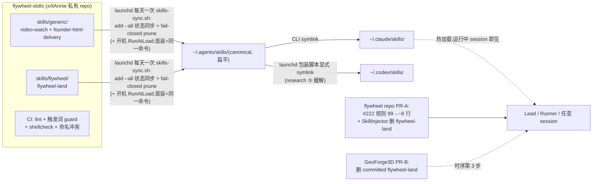

# Plan: flywheel-skills 能力库 + Flywheel 消费侧迁移

**Version**: v1.35.0
**Issue**: FLY-216(能力库地基)+ FLY-214(Flywheel 消费侧)
**Date**: 2026-06-04
**Source**: `doc/engineer/exploration/new/FLY-214-global-skill-framework.md`(brainstorm R1-R3 已收口)、`doc/engineer/research/new/FLY-214-skills-cli-and-distribution-mechanics.md`(4 检查点实测)
**Status**: codex-approved(3 轮,R1 9 项 + R2 6 项全采纳;R3 APPROVED 附 3 个非阻塞打磨项)
**Owner**: worker-fly-214(两 issue 同 owner,一根线)

> **实现期打磨项(Codex R3 非阻塞,实现时顺手做)**:① symlink 冲突比较优先 `realpath`(降相对链误报 CONFLICT),失败回退 readlink;② lockdir 写 PID/时间戳 + 保守 TTL 视为 stale(防 crash 后永久 skip)—— A1/A8 过后补亦可。

---

## 0. 背景与已拍决策(不再重议)

给 Lead/Runner 加能力 = 往 prompt 塞文字,不可扩展(Annie 判定);散装 global scripts 5 个安装面互不相认。Annie 三轮 brainstorm 已拍:

| 决策 | 内容 |
|------|------|
| 分层 | Flywheel = orchestration layer;**flywheel-skills = capability layer,独立私有 repo(xrliAnnie)**,半径 = 整机所有 Claude/Codex session |
| 三分法 | 规则层只留 身份/授权/禁令/skill 指针;所有"怎么做"进 skill |
| 组织 | 库内两层分类:`skills/generic/`(任何 session 有意义)+ `skills/flywheel/`(只编排流程有意义) |
| 分发 | `skills` CLI(vercel-labs)+ launchd 每天跑一次 `skills-sync.sh`(+ 开机 `RunAtLoad`;**add --all 状态同步 + fail-closed prune**,非裸 update —— R1 #1);新机一条命令 |
| 治理 | 改 skill 走 PR + CI 门;各机跟 main;**回滚 = revert 库 main(紧急时钉 `#sha` 安装)**,lockfile 只是 drift 检测(R1 #2) |
| v1 住户 | video-watch(FLY-213 原型 as-is 打包)、founder-html-delivery(#222 迁移示范)、flywheel-land(SkillInjector 去代码化第一刀,唯一零变量模板) |

Research 关键实测(全文见 research doc):私库可用(git clone + GitHub API token 链含 `gh auth token` 回退);**库必须以 GitHub 形态 add**(本地路径不进 lockfile,update 空转);嵌套两层原生发现但**安装后扁平化**(跨 tier 不得重名);**user 级遮蔽 project 级同名**(命名纪律);**运行中 session 热加载新 skill 零重启**(官方 live change detection);Codex 扇出需显式 symlink(CLI "universal" 假设存疑)。

## 1. 范围

**做**:flywheel-skills repo(结构+README 准则+CI)、3 个 v1 住户、本机分发链(install + launchd)、#222 规则瘦身、flywheel-land 迁移三步时序、验收(含热加载实证 + Codex 活体探针)。

**不做(明确非目标)**:FLY-213 的产品化演化(通知/降频/摄像头 —— v1 只把现原型 as-is 打包,后续归 FLY-213 自己的 brainstorm);v2 收编批(deep-research/summarize/codex-profile);其余 4 个含变量 SkillInjector 模板的去模板化;多机 onboard 实操(只写 README 命令,真多机等 FLY-123 线);lead-rules-base 其他文件的瘦身(只动 #222 这一个,做示范刀)。

## 2. 架构总览



## 3. 实施步骤

### Phase 0 — Gate:外部状态确认(不擅自动 GitHub)

- **G1(硬 gate)**:向 team-lead/Annie 确认后才执行 `gh repo create`:
  - repo:`xrliAnnie/flywheel-skills`,**private**
  - 初始 commit(脚手架)直推 main 一次(空仓 bootstrap,业界惯例);**此后一切改动走 PR**(写进 README)
- G2:load 检查(uptime,>40 收手);launchd 装载前知会 team-lead(虽然不动生产 Bridge/Lead,守惯例)

### Phase 1 — 库内容(本地 worktree 准备,G1 前即可做)

目录(research ③:tier 只活在源仓,安装后扁平 → 跨 tier 名字唯一):

```
flywheel-skills/
├── README.md                       # 分类准则 + 命名禁用名单 + description 纪律(≤2 句,触发场景放最前,单条注入上限 1536 字符)+ PR 流程 + 新机/新 agent onboard 命令
├── skills/
│   ├── generic/
│   │   ├── video-watch/
│   │   │   ├── SKILL.md            # description="盯屏幕/视频找异常(打印监控等)";body=用法 + **依赖与前置清单(Codex R1 #6:ffmpeg、gemini CLI 已登录、macOS 录屏权限)** + 限额降频注意 + 隐私提醒置顶(录屏=内容发 Google,长跑前必须告知 founder);引用 scripts/ 相对路径
│   │   │   └── scripts/gemini-watch.sh   # 现原型迁入(122 行)。**非语义修两处 shellcheck**(Codex R1 #6 实测红:L68 SC2012 ls→find、L101 SC2001 sed→参数替换)+ chmod +x;逻辑零改动
│   │   └── founder-html-delivery/
│   │       └── SKILL.md            # 三分法拆 #222:description=触发场景(b);body=命令格式/14 天过期/降级/失败 fallback/频道优先级(c)≈85 行;禁令(d)不进 skill
│   └── flywheel/
│       └── flywheel-land/
│           └── SKILL.md            # 从 skill-templates/flywheel-land.ts 原文迁出(零变量,research R2-4 修正);frontmatter 保留 metadata.skill-author/version,version 升 0.3.0
├── blocklist.txt                   # 命名禁用名单(见下),flywheel-land 带注释豁免
└── .github/workflows/skill-guard.yml
    # 5 道门:① frontmatter lint(name/description 必填,name=kebab,description ≤350 字符,**且 name == SKILL.md 所在目录名** —— sync 脚本的 expected 集靠目录名推导,R2 #1)
    # ② description 触发词 guard(禁过宽词如 "always use"/"any task";抄 GeoForge3D FLY-158 check-skill-invocation.sh 思路)
    # ③ scripts/ shellcheck(零豁免 —— 入库脚本先修干净,不留长期 ignore)
    # ④ 命名冲突:对照 blocklist.txt
    # ⑤ contract fixture(Codex R1 #9):founder-html-delivery 的 description 首句必含 founder/HTML/report 触发语义;
    #    body 必含 5 要素:`flywheel-comm publish-report`、14 天过期、screenshot degrade、failure fallback、channel precedence(grep 级检查,防瘦身后 Lead 只记禁令不调 body)
```

- **blocklist 治理半径 = 整台机器**(Codex R1 #7:user 级遮蔽对全机生效,不只 GeoForge3D)。初始值 = 本机项目 skill 全量盘点:GeoForge3D 28 + joycon 3 + 其他本机项目(nanochat、personal-assistant 等,建库时 `find ~/Dev -path "*/.claude/skills/*/SKILL.md"` 扫一遍);README 写明"新增库 skill 前先跑盘点脚本对名"
- 注意:**不写 `disable-model-invocation`**(要模型自主调用,FLY-158 教训的正向);video-watch 的 `allowed-tools: Bash` 限权
- blocklist 例外:`flywheel-land` 故意同名(全局版**有意遮蔽** project 版,行为一致,是迁移手段)— blocklist 文件里加注释豁免该条目

### Phase 2 — 分发链(G1 通过后)

> **Codex R1 #1 关键修正**:实测 `skills@1.5.10` 的 `update -g -y` **只遍历 lockfile 已有条目**(比 hash → 单 skill 重装)—— **repo 新增的 skill 永远不会被 update 安装**,upstream 删除的 skill 在非交互下也不会被移除。所以定时任务的语义必须是"**同步到 repo 期望状态**",不是"update"。

1. `gh repo create xrliAnnie/flywheel-skills --private` + push 脚手架(G1 后)
2. 首装 = 定时同步同一条命令(见下),无单独首装路径
3. launchd `com.flywheel.skills-update.plist`(`~/Library/LaunchAgents/`,StartInterval 86400 = 每天一次 + RunAtLoad 开机一次;Annie 拍板 v1.35.0:skill 不常更新,一天扫一次足够,最多滞后一天可接受)执行 `~/.flywheel/bin/skills-sync.sh`(**同步语义 + FLY-176 级防护**,Codex R1 #1/#3/#8):

   ```bash
   #!/bin/bash
   # flywheel-skills 状态同步(FLY-216)。语义:本机 managed skills == repo 期望状态。
   # 结构 = 三段 fail-closed(Codex R2 #1/#3):任一获取段失败 → 只告警,绝不进 prune。
   set -u
   REPO="xrliAnnie/flywheel-skills"
   LOG=~/.flywheel/logs/skills-sync.log
   LOCKDIR=~/.flywheel/state/skills-sync.lock

   # 基础目录先建(R2 #2:新机/launchd 干净环境下 parent 不存在会让 lock 和日志重定向双双失败)
   mkdir -p ~/.flywheel/state ~/.flywheel/logs ~/.agents/skills ~/.claude/skills ~/.codex/skills
   if ! mkdir "$LOCKDIR" 2>/dev/null; then
     if [ -d "$LOCKDIR" ]; then echo "$(date) skipped: lock held" >> "$LOG"; exit 0
     else echo "$(date) FATAL: cannot create lockdir (permission?)" >> "$LOG"; exit 1; fi
   fi
   trap 'rmdir "$LOCKDIR"' EXIT
   [ -f "$LOG" ] && [ "$(stat -f%z "$LOG")" -gt 1048576 ] && : > "$LOG"   # 1MB 截断

   export PATH="/usr/local/bin:/opt/homebrew/bin:$PATH"
   export GITHUB_TOKEN="$(gh auth token 2>/dev/null)"      # research ①

   # ── 段 1:安装/更新(幂等 add;npx -y;300s 看门狗)。失败 → fail-closed 退出,不 prune(R2 #3)
   npx -y skills@1.5.10 add "$REPO" --all -g -y >> "$LOG" 2>&1 &
   SYNC_PID=$!; ( sleep 300; kill "$SYNC_PID" 2>/dev/null ) & WD=$!
   wait "$SYNC_PID"; RC=$?; kill "$WD" 2>/dev/null
   if [ $RC -ne 0 ]; then echo "$(date) SYNC FAILED rc=$RC — skip prune (fail-closed)" >> "$LOG"; exit 1; fi

   # ── 段 2:期望集 = repo git tree(机器格式;R2 #1:绝不解析 `add --list` 的 clack UI 输出)
   # CI 强制 frontmatter.name == SKILL.md 所在目录名 → 目录名可直接当 skill 名用
   EXPECTED=$(gh api "repos/$REPO/git/trees/main?recursive=1" \
     --jq '.tree[].path | select(endswith("/SKILL.md")) | split("/")[-2]' 2>>"$LOG")
   if [ -z "$EXPECTED" ]; then echo "$(date) EXPECTED empty/fetch failed — skip prune (fail-closed)" >> "$LOG"; exit 1; fi

   # ── 段 3:prune + Codex 扇出(只有段 1+2 都成功才执行破坏性操作)
   MANAGED=$(jq -r --arg s "$REPO" '.skills | to_entries[] | select(.value.source == $s) | .key' ~/.agents/.skill-lock.json 2>/dev/null)
   for name in $MANAGED; do
     if ! grep -qx "$name" <<< "$EXPECTED"; then
       npx -y skills@1.5.10 remove "$name" -g -y >> "$LOG" 2>&1
       [ -L ~/.codex/skills/"$name" ] && rm ~/.codex/skills/"$name"
       echo "$(date) pruned upstream-removed skill: $name" >> "$LOG"
     fi
   done
   # Codex 扇出:只扇 managed∩expected(R1 #3);真目录/异链不覆盖,记 CONFLICT
   for name in $MANAGED; do
     grep -qx "$name" <<< "$EXPECTED" || continue
     src=~/.agents/skills/"$name"; dst=~/.codex/skills/"$name"
     [ -d "$src" ] || continue
     if [ -e "$dst" ] && [ ! -L "$dst" ]; then echo "$(date) CONFLICT(real dir, not touching): $dst" >> "$LOG"; continue; fi
     if [ -L "$dst" ] && [ "$(readlink "$dst")" != "$src" ]; then echo "$(date) CONFLICT(foreign symlink, not touching): $dst" >> "$LOG"; continue; fi
     ln -sfn "$src" "$dst"
   done
   ```

4. 本机验证:lockfile 3 条 `sourceType: github` 记录;`~/.claude/skills/` + `~/.codex/skills/` 各 3 个 symlink;launchd kickstart 一轮日志干净;**再加一轮"repo 加第 4 个测试 skill → 下一轮 sync 自动出现;repo 删它 → 再下一轮被 prune"**(R1 #1 的两个新验证点,进 A1/A8)

### Phase 3 — Flywheel 消费侧(FLY-214)

**PR-A(flywheel repo,worktree `worktrees/fly-214`)**:
- `lead-rules-base/founder-html-delivery.md`:99 行 → ~8 行。保留:(d) 禁令(NEVER 本地路径/裸 HTML)+ 指针("交付走 `founder-html-delivery` skill;若该 skill 不可见,先告知 founder 远程交付不可用再给降级说明")。`claude-lead.sh` **零改动**(文件继续加载,只是内容瘦了)
- `edge-worker/src/skill-templates/`:删 `flywheel-land.ts` + index 两行;`SkillInjector` 机制不动(其余 5 模板照旧)
- 测试:更新 skill-templates/SkillInjector 相关单测(注入清单 6→5);grep 确认无其他 flywheel-land 引用残留(Blueprint.ts:491 的提示语 "follow the flywheel-land skill" **保留** —— skill 名不变,来源从注入变为 user 级库版)
- **dist 新鲜度 = 硬步骤(Codex R1 #4,FLY-176 同族教训)**:运行路径大量 import `packages/edge-worker/dist/*`(`scripts/lib/setup.ts` 直接 import `dist/SkillInjector.js`)—— 只删 TS 源不重 build,Bridge 重启后**旧 dist 仍会注入 flywheel-land**。PR-A 落地序列:merge → `pnpm --filter flywheel-edge-worker build`(或全量 `pnpm -r build`)→ **精确断言**(Codex R2 #4:宽 grep 会被 flywheel-git-workflow 里合法的 flywheel-land 文本引用误红):`test ! -e packages/edge-worker/dist/skill-templates/flywheel-land.js && test ! -e packages/edge-worker/dist/skill-templates/flywheel-land.d.ts` + `rg 'from "\./flywheel-land|"flywheel-land"\s*:' packages/edge-worker/dist/skill-templates/index.js` 零命中(文件不存在 + index 无 import/注册;Blueprint 与 git-workflow 的文本引用合法保留)→ 才算生效;此验证是 A6 的前置
- **已知依赖声明(Codex R1 #5,v1 只记录不改码)**:Blueprint 的 landing prompt 注入仍以 `skillInjectionSucceeded`(其余 5 模板注入成功)为门。若 SkillInjector 整体失败(权限/IO),即使 user 级库版 flywheel-land 可见,landing 段也不注入 —— 与今天行为一致,无回归;但 **v2 继续迁余下模板前必须改造此门**(`canLand = global land 可见 || 注入成功`),写进 v2 前置清单
- 文档:CLAUDE.md 里程碑行 + 本 plan git mv(随 PR)

**PR-B(GeoForge3D repo)**:删 committed `.claude/skills/flywheel-land/`(一个目录),PR 描述写明被 user 级库版取代

**硬时序(research ④-2,防真空期)**:Phase 2 完成且 A6 验证通过(库版 land 可被发现)→ merge PR-A → merge PR-A 后的下一个 Runner spawn 起不再注入 → PR-B 最后。任何一步失败先回滚该步,不动上游。

**Lead 重启**:PR-A 的规则文件变更随**下一个批量重启窗**生效(攒一次重启纪律);瘦身前后语义等价(禁令仍在),不为它单独重启。

### Phase 4 — 验收(QA 清单)

| # | 验收 | 方法 |
|---|------|------|
| A1 | 真私库全链 + **新增自动到达** | add(GitHub 形态)→ lockfile 3 条 → 双侧 symlink;**repo 加第 4 个 skill → 下一轮 sync 不经人手自动安装**(R1 #1:update 不装新 skill,sync 语义必须实证) |
| A2 | sync 覆盖本地手改 | 手改 canonical 文件 → 库出新版 → sync → 确认收敛回库版(research ② 留的 QA 项;若实测为跳过则记录真实语义进 README) |
| A3 | **热加载实证** | 运行中 claude session(QA slot 或沙箱 session,不动生产 Lead)→ 库里加新 skill → sync → 同 session 内可发现+可调用(research 重大发现的真机背书) |
| A4 | Codex 活体探针 + conflict 保护 | `codex-with-fallback exec` 问可用 skills / 调用 founder-html-delivery 的 body 指引;**另验 conflict 路径:预置同名真目录于 ~/.codex/skills → sync 不覆盖且日志记 CONFLICT**(R1 #3) |
| A5 | #222 行为等价 | slot Lead 装上瘦身规则 + 库 skill → "做个 HTML 给我看" → 走 publish-report 链路,禁令(不发路径)仍生效 |
| A6 | flywheel-land 等价 | **前置:dist 零命中验证过(R1 #4)** → merge PR-A 后 spawn 的 Runner:worktree 无注入版、库版可见、land 流程照跑(slot 真机) |
| A7 | CI 红测 | 撞 blocklist 名 + 超长 description + **缺 5 要素的 founder-html-delivery 改动**(R1 #9)各提一个 PR → CI 全拦 |
| A8 | **upstream 删除收敛 + fail-closed** | repo 删测试 skill → 下一轮 sync:lockfile 条目、~/.agents、~/.claude、~/.codex 四处全清,无 stale symlink(R1 #1/#3);**反向:模拟 expected 获取失败(断网/改 REPO 名)→ 任何 managed skill 都不被删,日志记 fail-closed**(R2 #1/#3) |

## 4. 风险与对策

| 风险 | 对策 |
|------|------|
| **update 不装新 skill / 不删旧 skill**(R1 #1) | 定时任务改 sync 语义(每轮 `add --all` + GitHub tree 期望集对比 + fail-closed prune);A1/A8 实证 |
| user 级库 skill 遮蔽项目 skill | blocklist CI(**全机盘点**初始化,R1 #7)+ flywheel-land 有意遮蔽走三步时序 |
| **旧 dist 继续注入已删模板**(R1 #4) | PR-A 落地序列含 build + 精确 dist 断言(产物文件不存在 + index 无 import/注册);A6 前置 |
| **SkillInjector 整体失败时 landing 门**(R1 #5) | v1 行为与今天一致(无回归),依赖已显式记录;v2 迁余下模板前必须改门 |
| skills CLI 行为漂移 | `npx -y` 钉 `@1.5.10`;升级 = 库 repo 里改一处 + 过一轮 A1-A4/A8 |
| launchd 不可靠(FLY-176 同族) | wrapper:lockdir 防重入 + 300s 看门狗 + 显式 PATH/`GITHUB_TOKEN` + mkdir -p 三目标 + 日志 1MB 截断(R1 #8) |
| Codex "universal" 假设错 / 扇出误伤 | 只扇 managed 名单 + 真目录/异链不覆盖记 CONFLICT(R1 #3)+ A4 探针 |
| description 误触发(全机半径) | CI 触发词 guard + contract fixture(R1 #9)+ `skillOverrides` 旋钮(README 记操作) |
| GitHub API 限额 | token 前置(5000/h);每天 1 次,余量巨大 |
| video-watch 隐私(录屏发 Google) | SKILL.md 隐私提醒置顶 + 依赖/权限清单(R1 #6) |

## 5. 回滚

> **Codex R1 #2 修正:lockfile 是 drift 检测,不是版本 pin** —— 恢复旧 lockfile 不会让下一轮 sync 拉旧内容(source 跟 main)。可执行的回滚语义如下:

- **库内容回滚(标准路径)**:revert flywheel-skills 的 main(PR revert)→ 下一轮 sync(≤1 天,或手动跑 `skills-sync.sh`)全机收敛回旧版。这是与"跟 main"治理模型一致的唯一正道
- **紧急钉版本(机器级,绕过 main)**:`npx -y skills@1.5.10 add xrliAnnie/flywheel-skills#<known-good-sha> --all -g -y` + 暂停 launchd(`launchctl bootout gui/$(id -u)/com.flywheel.skills-update`)防下一轮又拉 main;修好后恢复
- **整链下线**:bootout launchd + 对 managed 名单逐个 `npx -y skills@1.5.10 remove <name> -g -y` + 清 ~/.codex managed symlink;非 managed skill 一概不碰
- PR-A/PR-B:标准 revert;PR-A revert 后**必须重 build + dist 验证**(对称于上线序列);规则文件瘦身回滚 = git revert 后随重启窗恢复原文
- flywheel-land 真空期兜底:若库版不可见而注入已删,GeoForge3D 的 committed 版(PR-B 之前仍在)继续兜底 —— 这正是三步时序把 PR-B 放最后的原因

## 6. PR 切分与顺序

1. flywheel-skills 初始 commit(直推一次,G1 后)→ 后续库改动走 PR
2. **PR-A**(flywheel):规则瘦身 + injector 删模板 + 测试 + 文档(一个 PR,自洽可独立 revert)
3. **PR-B**(GeoForge3D):删 committed flywheel-land(时序最后)
4. 验收 A1-A8 全 PASS → 报 team-lead → 等 Annie ship 令(不可逆动作三类红线照守)
