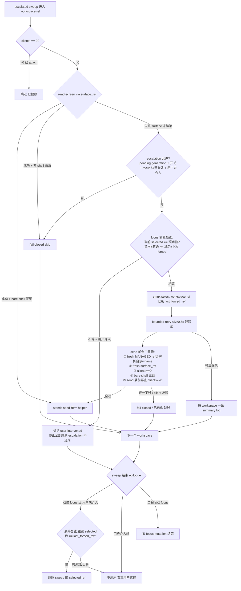

# Plan: cmux 重开自动 re-attach — one-shot render-forced self-heal sweep

**Version**: v1.43.0
**Issue**: FLY-254 (cmux reopen: auto-reattach all panes on app-open — kill the manual close-reopen dance)
**Date**: 2026-06-11
**Source**: Linear FLY-254(Annie 写明根因 + 修法)+ 本 plan §1 生产日志审计
**Status**: codex-approved(R4 APPROVED,2026-06-11;R1 9 项 + R2 6 项 + R3 2 项全量吸收,R4 唯一 LOW 已就地修正)

---

## 1. 背景与根因(audit 实证,2026-06-11 生产日志)

cmux app 关掉再打开后,左侧 tab(workspace)都在,但大多数 pane 不自动 re-attach 到对应
tmux session,Annie 必须逐个手动 close-reopen。

`/tmp/flywheel-cmux-watcher.log` 把根因钉死了(2026-06-11 当天,Codex R1 已独立复核):

| 时间 | 事件 | 含义 |
|------|------|------|
| 00:54:13 | `WARN: cmux socket missing` | cmux app 关闭 |
| 11:26:27 | `Watch mode` banner | cmux 重开,watcher 重启 → `sync_additive_bootstrap` → `self_heal_sweep_all()` **确实跑了** |
| 11:26:35–44 | **14 连发** `WARN: cmux read-screen failed: Terminal surface not found` | 非活动 tab 的 surface 没渲染 → FLY-169 安全门 fail-closed → 不 attach |
| 11:26:45 | `Self-heal: re-attaching 'LEARN-57…'` | 唯一渲染着的 active tab heal 成功 |
| 11:39:38–49 | 9 个 workspace 连续 `Self-heal: re-attaching …`(~1s/个)全部成功 | Annie 手动点过一轮 tab(人肉强渲染)之后,同一条 heal 链路全通 |

**结论:FLY-169 的 sweep 机制、触发点、安全门、atomic send 全部在位且工作正常。唯一缺口
= cmux 是 tabbed 终端,bulk reopen 后只有当前活动 tab 渲染了 surface;未渲染 surface 的
`read-screen` 返回 `Terminal surface not found` → 安全门 fail-closed。** Annie 的"手动
dance"本质就是人肉 focus 强渲染。修法 = 把 focus 这一步代码化(issue 原文修法)。

**已拍口径(2026-06-11,Annie 经 team-lead)**:串行 sweep、12 pane ~15-25s 完成可接受;
**不要并行**。

### 1.1 现有触发点盘点(audit)

| 触发点 | 位置 | reopen 时是否触发 |
|--------|------|------------------|
| bootstrap sweep | `sync_additive_bootstrap()` 末尾(watcher 启动) | ✅ in-pane watcher 随 cmux 死 → launchd(FLY-177)接管重启时触发;**但 watcher 重启 ≠ cmux 重开**(生产有与 reopen 无关的 watcher churn) |
| recovery sweep | `CMUX_HEAL_ON_RECOVERY`(FLY-169):`cmux_health_check_or_die` 在 unhealthy→healthy transition 置位,`watch_loop` 消费一次 | ✅ launchd watcher 存活跨越 reopen 时触发 |
| `--once` sweep | `sync_once()` 末尾 | ⚠️ `--watch` 运行时被 mutex 挡(FLY-129),manual rescue 不可用 |
| register/create 事件 heal | `_drain_file` 的 `create`/`register` arm | reopen 无 tmux 事件,不触发(本来也不该) |

即:reopen 后**有 sweep 在跑**,但 (a) sweep 对未渲染 surface 一律 fail-closed;(b) 这些
触发点没有一个是"cmux app 实例换了"这个事件本身的可靠检测器(见 §2.2)。

### 1.2 检测的时延缺口(audit + Codex R2 补充)

- **缺口 a — backoff 拖慢检测**:`watch_loop` unhealthy backoff 最高 300s(`next_sleep_seconds`,
  fail_count>10)。cmux 关闭 >~7 分钟后再开,watcher 最多 5 分钟后才发现,违反"几秒内"验收。
  日志实例:`recovered after 256s (7 ticks)`、`recovered after 34654s (124 ticks)`。
  **且不止 rc=1**:Codex R2 真机核验到 app 已退出但 `/tmp/cmux.sock` 文件残留(socket 类型
  仍在、`cmux ping` 连接失败)的 **rc=3 形态** —— 边沿检测必须同时覆盖 rc=1 与 rc=3。
- **缺口 b — 快速 quit+reopen 漏检**:quit→reopen 全程发生在一个 sleep 窗口内(15s)时,
  watcher 观察不到 unhealthy tick → 无 transition → recovery sweep 不触发。

### 1.3 明确不在范围内

- **内存压力(swap 满)导致 surface 渲染不出来**:issue 明确为独立加剧因素,靠重启机器缓解。
  本 sweep 只要求在健康机器上稳定工作;代码层面用 bounded retry 防止在过载机器上空转。
- watcher 自身的重启 churn / `Hooks (re-)registered … was 1/2` 每分钟刷日志(audit 中观察到,
  疑似 pane-exited hook 探测误判)— 与本 issue 无关,不碰,如需要另开 issue。
  **但 §2.2 的触发模型必须在该 churn 存在的现实下不重复抢焦点**(Codex R1 HIGH-2)。

---

## 2. 方案设计

### 2.0 设计原则

1. **每个 reopen generation 一次正常尝试**(Codex R1 HIGH-2 + R2 HIGH-1 收口):
   "cmux app 实例"= 一个 generation(socket 身份标识)。每个 generation 的 escalated sweep
   语义是 —— **一次正常尝试;watcher 在消费前/消费中 crash 则有界续跑(durable pending);
   正常完成(done)后任何 watcher 重启/churn 都不重放**。不承诺无事务的进程级 exactly-once。
   健康稳态零新增 cmux IPC、零新增 tmux 扫描(Annie 否决 polling)。
2. **FLY-169 安全门一个不拆,且 send 紧前必须最终复核**:MANAGED、STATE(0-client)、
   SHELL(bare-shell 正证)三道门 + atomic send 原样保留;render escalation 在 focus 之后
   必须**全量重跑**所有门,且 **send 的紧前一步重查一次 0-client**(focus 可能异步触发
   cmux 重跑原 `--command` attach —— Codex R1 HIGH-1)。任何不确定 fail-closed。
3. **串行执行,单 executor,用户优先**:escalation 只在 watcher 进程内的 sweep 中跑(单
   线程,单一 send helper);**每一次 focus 动作前都检测用户是否介入**(Codex R2 M5),
   一旦发现 Annie 在 sweep 中途自己切了 tab,立即停止全部剩余 focus 动作且不还原。

### 2.1 核心:render escalation(focus 强渲染)



**改动 1 — `surface_looks_like_bare_shell` 改三态**(向后兼容):

```
rc=0  bare shell(positive proof,可 send)
rc=1  read-screen 成功但画面非 shell(TUI/状态栏)→ 确定性 fail-closed
rc=2  read-screen 本身失败(surface 未渲染/cmux 错误)→ 现有调用方仍 fail-closed;
      escalation 上下文中视为"需要强渲染"信号
```

现有调用方都是 `|| return 1` 形态,rc=1/2 同样走 fail-closed,**字节级行为不变**。
escalation 的 retry 读屏用**静默 read helper**(不经 `cmux_call` 的 per-fail WARN),只在
预算耗尽时每 workspace 打一条 summary(Codex R1 LOW-9;符合 transition-only 日志纪律)。

**改动 2 — `self_heal_workspace_ref` 增加 escalation 分支**(仅当 escalation 上下文开启):

1. SHELL 门返回 rc=2 且 escalation 开启时:
   - 校验 ref 形态 `^workspace:[0-9]+$`(沿用 dedup 的 REF_RE 谨慎);
   - **focus 前置用户介入检查(Codex R2 M5)**:重读当前 selected ref,要求等于"预期当前
     值"(本次 sweep 第一次 focus 前 = 原始快照 ref;其后 = 上一次 `HEAL_LAST_FORCED_REF`)。
     不等 → 置 `HEAL_USER_INTERVENED=1`,**停止本次 sweep 全部剩余 focus escalation**
     (非 escalation heal 继续跑),结尾不还原;读取失败 → 同样停止(fail-closed);
   - `cmux_call select-workspace --workspace "$ref"`,失败 → fail-closed skip;
   - 记录 `HEAL_LAST_FORCED_REF="$ref"`、置 `HEAL_FOCUS_CHANGED=1`;
   - bounded retry(默认 6 次 × 0.5s,`FLYWHEEL_CMUX_RENDER_WAIT_TICKS`,启动校验见 §2.5):
     静默等待 surface 可读;
   - **send 前全门重跑(Codex R1 HIGH-1,顺序固定)**:
     ① fresh MANAGED —— 重新 `workspace_refs_for "$wname"`,确认 `$ref` 仍在解析结果中;
     ② fresh surface_ref —— 重新 `workspace_terminal_surface_ref`;
     ③ `view_session_client_count == 0`;
     ④ bare-shell 正证(rc=0);
     ⑤ **send 的紧前一步再查一次 clients==0**(focus 可能让 cmux 异步重跑原 attach
     `--command`;client 出现 = 已自愈,绝不 send);
     全部通过 → 走**唯一的** atomic send helper(与非 escalation 路径同一段代码)。
2. escalation 关闭(默认所有事件路径)时:行为与现状逐字节一致。

**改动 3 — focus 快照 / 还原,fail-closed + 用户介入优先**(Codex R1 M3 + R2 M5):

- sweep 开始:从 `get_cmux_workspaces_json` 取 `selected == true` 的 ref。
  **当且仅当恰好一个合法 selected ref** 时快照成立;JSON 不可用 / 0 个 / 多个 selected →
  快照失败 → **本次 sweep 完全禁用 focus mutation**(只跑现状非 escalation heal,
  transition log 一条)。
- sweep 过程:每次 focus 前的前置检查见改动 2(用户介入 → 全停 + 不还原)。
- sweep 结束(仅 `HEAL_FOCUS_CHANGED=1` 且 `HEAL_USER_INTERVENED=0`):**epilogue 还原前
  必须再做一次最终 selected 复查(Codex R3 M2 —— 末次 forced focus 之后、restore 之前
  用户切 tab 没有"下一次 focus 前检查"兜底)**:重读当前 selected,仅当读取成功、恰好
  一个合法 selected、且仍等于 `HEAL_LAST_FORCED_REF` 时才还原快照 ref;不等 / 读取失败 /
  多 selected → 视为用户介入,跳过还原。还原调用 `|| true`(失败不致命,log 一条)。
- **没有任何 workspace 需要 escalation 时,select-workspace 一次都不会被调用** —— 健康
  稳态 / 普通 watcher 重启的 bootstrap sweep 零闪烁、零 focus 抢占。

### 2.2 触发模型:durable generation 状态机,单 helper 消费(Codex R1 HIGH-2 + R2 HIGH-1/HIGH-2/M3/M4 收口)

**唯一 reopen 证据 = cmux socket 身份变化**。socket 身份 = `stat -f '%d:%i:%B'`
(device:inode:birthtime,封装 `cmux_socket_identity()` 便于测试覆盖)。

**generation 状态文件** `CMUX_SOCK_IDENT_FILE`(默认 `/tmp/flywheel-cmux-sock-ident`,
env 可覆写),单行格式 **`<identity>|<state>|<attempts>`**,state ∈ `pending|done`,
attempts = 该 generation 已发起的 escalated sweep 次数(durable attempt budget,
Codex R3 HIGH-1):

- **arm**:观测 identity ≠ 文件中 identity → 原子写入 `<新identity>|pending|0`(同目录
  temp + `mv`,与 STALE_STATE 等既有模式一致)。
- **consume**:`consume_pending_reopen_sweep()`(唯一消费 helper)读到 `pending` 且
  identity 与当前 socket 一致且 attempts < 上限(固定常量 **3**,覆盖首次尝试 + 有限次
  crash 续跑)→ **先原子改写 attempts+1,写成功才继续**(任何 focus side effect 之前;
  attempt 写失败 → 本轮不 escalate,fail-closed)→ readiness wait → escalated sweep →
  **正常收尾后**原子改写 `<identity>|done|<attempts>`。
  - sweep 没跑完就 crash → 文件仍 `pending`、attempts 已计数 → 下一个 watcher bootstrap
    续跑(已 attach 的 workspace 因 clients>0 自然 no-op,只处理残余);
  - **done 改写失败 → 文件仍 pending,但 attempts 已耗一次**;后续 tick 重试消费同样先过
    attempts 闸 → **达到上限后即使 done 永远写不进也不再消费**(log 一条放弃)。重复
    focus 总量被 durable 上限钉死 —— 顽固 workspace(持续 render timeout / JSON 故障)
    最多被 focus 3 轮,绝不退化成每 15s 的周期性抢焦点(no-polling 承诺成立)。
- **不重放**:文件为 `<identity>|done|*` 且 identity 未变 → 任何 watcher 重启/churn 都不
  re-arm(churn 免疫,Codex R1 HIGH-2)。
- **fail-closed**:文件格式非法 / 读写失败 → log 一次,本轮不 escalate(行为退化为现状,
  绝不重复抢焦点);文件缺失(首装/重启机器)→ 视为新 generation,arm 一次。

**证据采集点**(都是一次 stat,零 IPC):

1. watcher bootstrap(覆盖"in-pane watcher 随 cmux 死、launchd 接管" + 重启机器);
2. 每个健康 tick(覆盖"launchd watcher 存活跨越 reopen" + 缺口 b 快速 quit+reopen);
3. **unhealthy 切片间**(覆盖缺口 a 的 rc=1 与 rc=3 两种形态,见下)。

**消费点与时序(Codex R2 M3)**:

- `watch_main` 启动序:health gate 通过后,若检测/续跑出 pending → **进入首次 sleep 之前**
  立即调用 `consume_pending_reopen_sweep()`;且该 tick 的 legacy 非 escalation sweep
  (`sync_additive_bootstrap` 末尾的 `self_heal_sweep_all`)**被 pending 消费合并取代**
  (escalated sweep 是其超集 —— 同样的窗口遍历 + 多了渲染能力;避免先空跑一轮制造
  `Terminal surface not found` 噪音,也避免"先 non-escalated 再等 15s 才 escalated"的
  双 sweep + 延迟)。bootstrap 其余步骤(reconcile/refresh/create)照旧。
- `watch_loop` 健康 tick:发现 pending → 同一 helper 消费;该 tick 若同时携带
  `CMUX_HEAL_ON_RECOVERY` 旗标,**合并**进这一次 escalated sweep(同理超集,不双跑)。
  无 pending 时 recovery 旗标维持现状(非 escalation sweep)。
- **`--once` 不参与 generation 消费、不 escalate**(消除单点消费的歧义;它保持今天的
  非 escalation 行为;watcher 不在时的手动入口需求 → 后续另立 issue,§2.6)。
- feature off(`FLYWHEEL_CMUX_REOPEN_SWEEP=0`)→ 不读不写状态文件,全部现状。

**readiness wait(Codex R2 M4,代替 R1 版 double-tap)**:消费前最多
`FLYWHEEL_CMUX_READINESS_TICKS`(默认 5)× 1s:**早退条件 = 当前 managed tmux 窗口名集合
全部已有对应 cmux workspace**(以 tmux 侧为期望集,对照 `get_cmux_workspaces_json` 标题;
不是"两次采样相同"—— 部分恢复集可以连续两次相同,会提前漏修);预算耗尽 → 用当前集合
开跑并 log 缺失名单(escalation 对后到的 workspace 不再有机会,诚实记录)。

**缺口 a 修复 —— unhealthy 睡眠切片,rc=1 与 rc=3 双覆盖(Codex R2 HIGH-2)**:
`watch_loop` 在 rc=1 **或 rc=3** 状态下,把 backoff 总时长切成
`FLYWHEEL_CMUX_SOCKET_PROBE_SLICE`(默认 3s)的小片:

- rc=1(socket 缺失):每片间 `[[ -S $socket ]]`(bash 内建,单 stat)→ socket 出现即早醒;
- rc=3(socket 在但 ping 失败 —— app 退出残留 socket 的真机实测形态):每片间只比较
  `cmux_socket_identity()` 与 generation 文件中的 identity(纯 stat,**无 IPC**)→
  identity 变化(新 app bind 了新 socket)即早醒 → 走健康检查;若新 app 刚 bind 尚未能
  PONG,下一 tick 短间隔继续直到 healthy,healthy tick 的采集点 arm。

rc=0 健康路径睡眠**完全不变**。backoff 总时长不变(对外负载曲线不变)。定性:不是被
否决的 periodic polling(周期性 cmux IPC/tmux 扫描);是在"已知 cmux 不健康"的状态里
对 app-open 事件做纯 stat 边沿检测,即 issue 修法原文"watcher 检测 `/tmp/cmux.sock` 重现"。

### 2.3 环境开关与日志

| 开关 | 默认 | 语义 |
|------|------|------|
| `FLYWHEEL_CMUX_REOPEN_SWEEP` | `1`(开) | `0` = 完全回退到 FLY-169 现状:不读写 generation 文件、不 arm、不 escalate、不切片(一键止血)。watcher 启动 log 生效值(部署验证抓手,§5) |
| `FLYWHEEL_CMUX_RENDER_WAIT_TICKS` | `6`(×0.5s) | escalation 渲染等待预算;启动校验:正整数 ≤ 60,非法 log 一次回落默认 |
| `FLYWHEEL_CMUX_READINESS_TICKS` | `5`(×1s) | 消费前 workspace 恢复等待预算;同上校验 |
| `FLYWHEEL_CMUX_SOCKET_PROBE_SLICE` | `3`(秒) | unhealthy 睡眠切片;同上校验 |
| `CMUX_SOCK_IDENT_FILE` | `/tmp/flywheel-cmux-sock-ident` | generation 状态文件(`identity\|state\|attempts`;attempt 上限为固定常量 3;测试隔离用) |

日志(全部走现有 `log()`,量有界,transition-only 纪律):

- `INFO: cmux reopen detected (generation <id>) — arming one-shot re-attach sweep`;
- `INFO: resuming pending re-attach sweep (generation <id>)` — crash 续跑时;
- `Self-heal(render): focusing '<wname>' (ws <ref>)` — 每个被 escalate 的 workspace 一条;
- `Self-heal(render): '<wname>' render timeout — skipped` — 预算耗尽至多一条(retry 中间失败静默);
- `Self-heal(render): user switched tabs — stopping focus escalation, keeping user's selection`;
- `Self-heal(render): restoring focus to <ref>` — 每次 sweep 至多一条;
- `WARN: readiness budget exhausted; sweeping current set (missing: <names>)`;
- `WARN: generation <id> attempt budget exhausted — giving up escalation for this generation`。

### 2.4 与 PR #248(FLY-242 PR-1)共存

- **生产代码语义解耦**:#248 改 create 路径(`is_window_id_alive` + `create_workspace_for_window`
  双 probe);本 plan 改 heal / watch_loop / health 路径。函数零交集,功能零依赖。
- **测试 harness 有可预期的小范围同 hunk 接触**(已与 worker-fly-242 对齐到 hunk 级,
  2026-06-11):#248 动了 tmux `display-message` mock(per-call `panedead.*.n` 计数器 +
  identity echo)、`reset_mocks`、既有 fixture 种子、末尾测试区;本 plan 要动 cmux mock
  (`select-workspace` 捕获、`read-screen` per-call 序列)+ `reset_mocks`。**实现顺序以
  #248 先 merge、本分支 rebase 为准**(#248 已双 APPROVED 在等 ship 批),rebase 时保留其
  pane-dead per-call counters、identity echo 与 `test-cmux-sync-tmux-smoke.sh`;本 plan 的
  read-screen per-call 序列 mock 照抄其计数文件模式(风格统一)。
- 已知交互(非冲突):escalated sweep 可能 heal 一个 dead-pane 窗口的 view(显示
  "Pane is dead"),与现状 sweep 行为一致,conservative cleanup 按既有节奏收走;#248
  merge 后如想让 sweep 跳过 dead 窗口,开 follow-up 用它的 `is_window_id_alive`,本单
  不依赖、不抢做。

### 2.5 实现纪律(`set -euo pipefail` + 参数边界,Codex R1 M4)

- **所有**三态/多态返回值调用一律 `if fn; then` 或 `|| rc=$?` 捕获 —— 裸调用在 `set -e`
  下会杀 watcher(FLY-177 churn 根因,`self_heal_sweep_session` 注释有前科记录)。
- `self_heal_sweep_all` / `consume_pending_reopen_sweep` 采用**单一 cleanup epilogue**:
  循环内所有正常失败路径汇合到同一收尾段执行 focus 还原判定 + generation done 改写,
  函数最后显式 `return 0`(best-effort,状态绝不外溢杀 watcher)。
- 状态文件读写:同目录 temp + `mv` 原子写;malformed / 写失败 → fail-closed(§2.2)。
- 数值 env 启动时校验(正整数 + 上限 60),非法 log 一次回落默认。
- 测试必须在 `(set -euo pipefail; …)` 子 shell 中覆盖关键失败路径(§4.2)。

### 2.6 刻意不做

- **并行 escalation**:Annie 已拍串行;focus 是全局 UI 状态,并行互抢 + 破坏单 send 路径。
- **`--request-reattach` 手动通道:不进本 PR**(Codex R1 LOW-8 + team-lead 授权砍)。
  后续如需手动入口,另开 issue 复用 generation 状态机的单 helper 消费设计。
- **`--once` 不参与 escalation / generation 消费**(Codex R2 M3:单消费点不留歧义)。
- 不改 `sync_additive`(60s reconcile)— FLY-169 明确留白,继续留白。
- 不在代码里处理内存压力(§1.3)。

---

## 3. 实现拆解

单 PR,全部在 `scripts/flywheel-cmux-sync.sh` + 测试:

| Phase | 内容 | 预估 |
|-------|------|------|
| **P0(spike,先行)** | **真 cmux render 等价性 probe**(Codex R1 M5 + R2 M6 修正):核心未实证假设 = CLI `select-workspace` 与人工点击同样强制渲染 surface。**不可用一次性 new-workspace 伪造**(cmux 设计记录:`new-workspace` 会 auto-select → 创建即渲染,切走也不销毁 surface → 制造不出 reopen 的未渲染态)。**正确做法:用真实 reopen 后、尚未被点击的 restored workspace** —— 在 Annie 下一次自然 quit+reopen 的窗口(她本来每天都在做),她点 tab 之前由我们跑最小 probe:① 只读确认目标 workspace `read-screen` = `Terminal surface not found` → ② CLI `select-workspace` → ③ 确认同 ref 有界时间内变可读 → ④ `select-workspace` 还原她原 tab。全程 ~10s、一次 focus 闪动,事先经 founder 批准。**probe FAIL = 方案核心不成立,回 plan 重议**;PASS 证据(命令+输出)进 PR | probe 脚本 ~40 行,一次性 |
| P1 | 三态 SHELL 门 + escalation 分支(focus 前置用户介入检查 + send 前全门重跑 + 紧前 0-client 复核)+ focus 快照/还原 + 静默 retry read helper + 开关与 env 校验 | ~170 行 |
| P2 | `cmux_socket_identity` + generation 状态机(pending/done,原子写)+ `consume_pending_reopen_sweep`(bootstrap 即时消费 + legacy sweep 合并)+ readiness wait(期望集判定)+ rc=1/rc=3 切片睡眠 | ~110 行 |
| P3 | mock harness 扩展 + 测试 + 文档 | ~320 行 |

分支:`feat/v1.43.0-FLY-254-cmux-reopen-reattach-sweep`(worktree `worktrees/fly-254`);
若 #248 已 merge 则直接基于 main 上的它。

## 4. 测试计划

### 4.1 mock harness 扩展(`scripts/test-cmux-sync.sh`)

- cmux mock 增加 `select-workspace` 捕获(进 `MOCK_CMUX_OPS`,含 `--workspace` 参数);
- `read-screen` 支持**逐次调用序列**(`MOCK_CMUX_READSCREEN_SEQ`,计数文件实现,照抄
  #248 `panedead.*.n` 模式;`reset_mocks` 同步清理);
- `MOCK_CMUX_WORKSPACES_JSON` 支持逐次序列(readiness 部分恢复集测试);
- `cmux_socket_identity()` / socket 存在性探测封装为函数,测试直接覆盖;
- `sleep` mock(retry / readiness / 切片不真等)。

### 4.2 单测(追加在 harness 末尾 FLY-254 独立 section;关键安全测试在
`(set -euo pipefail; …)` 子 shell 中跑)

**escalation 核心**:
1. happy path:0 client + read-screen 先 FAIL → select-workspace → retry 后 bare shell →
   全门重跑通过 → 唯一 send helper → focus 还原到快照 ref。
2. **R1 HIGH-1 race**:focus 后 clients 序列 `0,…,0,1`(send 紧前一查变 1)→ 绝不 send。
3. **R1 HIGH-1 漂移**:focus 后 `workspace_refs_for` 不再含该 ref → 不 send。
4. 预算耗尽:read-screen 持续 FAIL → 无 send、一条 summary、sweep 继续、focus 按规则还原。
5. 正证非 shell:focus 后 read-screen 成功但画面 TUI → fail-closed,无 send。

**focus 快照/还原/用户介入**:
6. 快照失败(JSON 不可用 / 0 selected / 多 selected)→ 全程零 focus mutation。
7. **R2 M5 中途介入**:sweep 强制 B 后用户点 C,**后续还有 workspace 待 escalate** →
   focus 前置检查发现 selected≠预期 → 剩余 escalation 全停、结尾不还原(C 保留)。
8. **末次 focus 后、restore 前用户切 tab** → epilogue 最终复查发现 selected≠last_forced
   → **零 restore 调用**(断言 MOCK_CMUX_OPS 无第二次还原向 select-workspace)。
9. 还原失败 / epilogue 复查读取失败 → 不还原、不致命,sweep 正常 `return 0`。

**generation 状态机(R2 HIGH-1;fixture 一律三字段,R4 LOW)**:
10. 文件缺失(首装)→ arm `identity|pending|0`;同 identity + `identity|done|*` 重启
    watcher → 不 arm(churn 免疫)。
11. **crash-after-arm-before-consume**:文件 `identity|pending|0`,新 watcher bootstrap
    → 消费(attempts 先原子 0→1)→ 正常收尾改写 `identity|done|1`。
12. **crash-mid-sweep**:消费中断(文件停在 `identity|pending|1`)→ 下一 watcher 续跑
    (attempts 原子 1→2),已 attach workspace no-op,只处理残余,完成后 `identity|done|2`。
    malformed fixture 只出现在 test 14。
13. **durable attempt budget(R3 HIGH-1)**:`done` 持续写失败,跨多个健康 tick **及
    watcher 重启**,escalated sweep / focus 总次数 ≤ 3(attempts 闸),达上限后 log 放弃、
    永不再消费该 generation。
14. attempt 计数写失败 → 本轮零 escalation(fail-closed);malformed 状态文件 → log 一次
    + 本轮不 escalate。

**消费时序(R2 M3)**:
15. bootstrap 检出 pending → **首次 sleep 前**消费;该轮 legacy bootstrap sweep 被合并
    (无先 non-escalated 后 escalated 的双跑)。
16. 健康 tick pending + `CMUX_HEAL_ON_RECOVERY` 同时在 → 合并为一次 escalated sweep。
17. `--once` 永不 escalate、永不读写 generation 文件。

**readiness(R2 M4)**:
18. 前两次采样同一 partial set、第 3 次补齐 → **不得**在第 2 次提前 sweep(期望集判定);
    全部 expected managed titles 出现 → 提前开跑。
19. 预算耗尽 → 用当前集合开跑 + log 缺失名单。

**检测边沿(R2 HIGH-2)**:
20. rc=1:socket 重现 → 切片早醒。
21. **rc=3 stale socket**:socket 始终存在、ping 失败、identity 随 reopen 变化 → 切片早醒
    → 健康后 arm。

**回退/纪律**:
22. `FLYWHEEL_CMUX_REOPEN_SWEEP=0` → 零状态文件读写、零 select-workspace、零切片,逐 op
    与 FLY-169 现状一致(回归哨兵)。
23. 非法 env(0/负/非数字/超上限)→ log 一次回落默认,无算术错误。
24. 全部正常失败路径在 `set -euo pipefail` 子 shell 下不杀 watcher(`return 0`)。
25. 事件路径(create/register heal)read-screen FAIL → 永不 select-workspace。

### 4.3 真机验证(QA 阶段)

- **红线:不真关重开生产 cmux**(打断 Annie + 打断被改的 watcher 本身)。
- **P0 probe = 核心机制的真机证据**:在 Annie 下一次自然 reopen 窗口、她点 tab 之前执行
  (§3 P0;事先请批,~10s 一次 focus 闪动)。
- 真 tmux 侧:沿用 #248 模式的隔离 `-L` socket smoke(linked session / list-clients 行为)。
- **最终验收 = Annie 在 ship 窗口做一次真实 quit+reopen**(预期:十几秒内 tab 自动逐个
  闪过、全部挂回、focus 回到原 tab、`tmux list-clients | wc -l` 回 ~12)。

## 5. 部署与回滚

- `~/.flywheel/bin/flywheel-cmux-sync` 是指向 repo 的 **symlink**(FLY-98)→ merge 到 main
  + 生产 `git pull` 后,重启 watcher 生效:`launchctl kickstart -k gui/$(id -u)/com.flywheel.cmux-watcher`
  (代码更新走 kickstart 足够 —— 改的是脚本不是 plist)。
- **部署验证抓手**:watcher 启动 log 打印生效开关值(`reopen-sweep=1 render-wait=6 …`),
  部署后查 log 确认,不以 kickstart exit code 为准(Codex R1 M6)。
- **回滚(行为级)**:`FLYWHEEL_CMUX_REOPEN_SWEEP=0` 走 **plist 修改 + `plutil -lint` +
  `launchctl bootout gui/$UID/com.flywheel.cmux-watcher` + `bootstrap`**(`kickstart -k`
  **不会**重读 plist EnvironmentVariables,直接 kickstart 是假回滚 —— Codex R1 M6;
  bootout 后等干净再 bootstrap,FLY-241 教训)。回滚后查启动 log 确认 `reopen-sweep=0`。
- 代码级回滚:revert PR + git pull + kickstart。
- watcher 重启本身只跑 bootstrap(非 escalated)sweep + generation 对账 —— `done` 且
  identity 未变 → 零 focus 动作、零闪烁。
- Ship gate:照红线,merge/ship 等 Annie 明确批准;P0 probe 窗口单独请批。

## 6. 验收标准(对照 issue)

1. 关掉 + 重新打开 cmux → **无需任何手动 close-reopen**,所有 pane 自动 attach,
   `tmux list-clients` 回到 ~12(串行 sweep 15–25s 完成窗口,Annie 已拍)。
2. cmux 关闭任意时长后重开,sweep 在 app 重现后数秒内启动 —— **rc=1(socket 消失)与
   rc=3(socket 残留、ping 失败)两种关闭形态都覆盖**(缺口 a)。
3. 快速 quit+reopen(<15s)同样触发(缺口 b,generation 检测器)。
4. **每个 reopen generation 一次正常尝试**:watcher 重启/churn 在 `done` 后不重放;
   消费前/中 crash 有界续跑不丢(durable pending);**任何故障形态下(含 done 永远写
   不进)escalated sweep 总次数被 durable attempt 上限(3)钉死**,绝不退化为周期性
   focus(no-polling 承诺)。
5. 健康稳态零新增周期负载;sweep 无活可干时零 select-workspace(零闪烁);**Annie sweep
   中途切 tab → 剩余 focus 动作立刻全停且不还原**(用户优先)。
6. `FLYWHEEL_CMUX_REOPEN_SWEEP=0` 回退后行为与 FLY-169 现状一致(回归哨兵钉死),回滚
   流程经 bootout+bootstrap 真实生效并有 log 证据。
7. 机器非过载时稳定生效;过载时 bounded retry + readiness 预算保证 sweep 有界结束。
