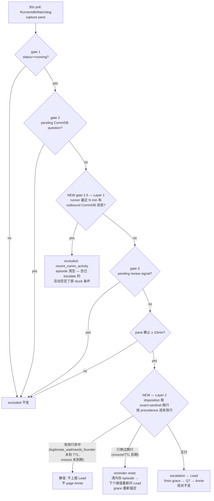

# Plan: Runner-stuck 误报刷屏修复 — 合法 parked Runner 报一次就停

**Version**: v1.44.0(team-lead 拍定;v1.42 = FLY-245,v1.43 = FLY-254)
**Issue**: FLY-253
**Date**: 2026-06-11
**Source**: `doc/engineer/research/new/FLY-253-runner-stuck-false-positive-audit.md`
**Status**: codex-approved(R3 APPROVED,2026-06-11;R1 8 项 + R2 5 项全采纳,R3 附 2 项 LOW 实现注意已并入 §3.2/§5)

---

## 1. 背景与根因(摘 audit,证据见 Source)

LEARN-57 runner(sub 项目,多轮交互式任务:Lead 指令 → 干活 → DONE 报告 → park 等下一轮/等 Annie 挑人)在 ~36h 内触发 **21 条 `runner_stuck_escalation`(→ Asha)+ 12 条 `runner_stuck_unhandled` Q7(→ Annie)**,取证时仍在进行。Runner 和 Lead 全程健康。

根因不是"Lead 失职"——**Asha 写了 7 条 disposition(首条 escalation 后 27 秒)**。是 FLY-195 的三个设计假设被这种 workload 同时击穿:

| # | 失效环节 | 代码位置 | 机制 |
|---|---------|---------|------|
| R1 | disposition 按 `(execution_id, episode_fingerprint)` 存,episode 以 **pane 帧哈希**为界 | `StateStore.ts:527`(PK)、`stuck-candidate.ts:249-263` | pane 输出一变(下轮指令/回执/Lead mailbox wake 本身)→ 新 fingerprint → 新 episode → 旧 receipt 全失效。Lead 在跑永远追不上的处置跑步机(5min grace/episode) |
| R2 | gate 2(pending-question 豁免)被 FLY-208 回报协议拆掉 | `Blueprint.ts:684-692`、`flywheel-comm/db.ts:427` | 协议要求 Lead "close DONE report with one-line response";一回复 `hasPendingQuestionsFrom`=false → 豁免消失。两条规则打架 |
| R3 | 检测器只看 pane 静止度,看不见 CommDB 这条真实生命体征通道 | `stuck-candidate.ts`(输入只有 status/output/两谓词) | runner 几小时内一直在 ask/DONE/回执,pane 静止 ≥10min 对 parked 交互式 runner 是**常态** |

status 停 `running` 是合理行为(mid-task park 不能 `complete`,FSM 无 parked 态)——这不是 FLY-108 的 bug。

对照 FLY-220(Lead-pane 侧):那边的修法是 **episode-latch(报一次,静音直到阻塞条件真消失)**。runner-stuck 侧缺等价物,且 episode 边界(pane 帧)被噪声驱动。

## 2. 目标 / 非目标

**目标**
1. 合法等待的 runner:Lead 处置一次后,该 runner 的后续 stagnation episode 不再上报 Lead、不再 page Annie("报一次就停",Annie 核心诉求,镜像 FLY-220),**直到 latch 到期或被显式解除**(见 §3.2 TTL——本方案不做永久静音,Codex R1 #4)。
2. 正在通过 CommDB 活跃通信的 runner 不被判 stuck candidate(豁免机械化,不依赖 LLM 合规)。
3. 不削弱真卡死检测的兜底:Lead 真 down 时 Q7 仍然兜底;**每条豁免/latch 都有机械失效条件**(L1 = 活动窗口滑出;L2 = TTL/snooze 到期 → 自动回到"再问 Lead 一次"),`re_arm` 只是提前解除的快捷口,不是唯一恢复路径。

**非目标(明确不做,写给 Codex)**
- 不新增 session status / 不动 FSM(方向 1 否决:mid-task park 无可靠翻转钩子,新增 parked 态要动 FSM 双向边 + idle watchdog + heartbeat reconcile(FLY-172)+ stale patrol + close_runner 状态集 + terminal-immunity(FLY-228)+ dashboard,且 runner 自报 park/unpark 是 LLM 合规依赖,漏翻回 = 新 stuck-state 家族。end-of-task 已有正确工具:`complete --route needs_review` → `awaiting_review` 天然豁免)。
- 不改 Runner prompt / Blueprint(FLY-208 回报协议不动;R2 的冲突由 L1/L2 吸收)。
- 不动 LeadWatchdog / FLY-92 idle 路径(`runner_idle_detected` 的 once-per-transition dedup 维持现状)。
- 不做"等 founder"的语义建模(完整方向 2);只取机械切片。

## 3. 设计

两层独立成立、叠加覆盖:



### 3.1 Layer 1 — recent-comm-activity 机械豁免

**语义**:stuck 的定义是"loop 停了"。一个最近 N 分钟内还在给 Lead 发 CommDB 消息(DONE 报告/指令回执/提问)的 runner 机械上活着——pane 是渲染,CommDB 是行为;pane 静止与 runner 存活不矛盾。

**实现**
- `stuck-candidate.ts`:`StuckCandidateInput` 加 `hasRecentCommActivity: boolean`;硬门顺序 status → pending_gate → **recent_comm_activity(新)** → pending_review_signal;命中时与其他硬门一致返回 `{ candidate: false, exclusion: "recent_comm_activity", episode: null }`。
- **清 episode 对已 escalate 的 episode 同样生效,这是有意语义(Codex R1 #5 选项 a)**:runner 发出 outbound 消息证明触发原 escalation 的 stuck 条件已不成立,挂起中的 Q7 grace 随 episode 一起取消——不 page Annie 去看一个刚给 Lead 发过消息的 runner。代价:若 runner 发完最后一条消息后立刻真冻,Annie 收到 Q7 的最坏延迟 ≈ **window + threshold + grace ≈ 30+10+5 = 45min**(对 Lead 的 escalation 最坏 ≈ 40min)。是延迟不是漏报,窗口可调;必须有"escalation 后 grace 内出现活动 → episode 取消、无 Q7"的测试钉住该语义。
- **`flywheel-comm/db.ts` 加公开查询方法(Codex R1 #6:`CommDB.db` 是 private,探针无法在同一实例上跑裸 SQL)**:

  ```ts
  /** True if this exec sent ANY CommDB message within the last windowSeconds. */
  hasRecentMessagesFrom(execId: string, windowSeconds: number): boolean
  // SELECT 1 FROM messages WHERE from_agent = ?
  //   AND created_at > datetime('now', '-' || ? || ' seconds') LIMIT 1
  ```

  窗口比较**全部在 SQLite 时钟域内**(`created_at` 与 `datetime('now',...)` 同为 UTC),边界 = 严格 `>`,`windowSeconds` 为绑定参数、由毫秒 `Math.ceil(ms/1000)` 取整。flywheel-comm 包内配真 better-sqlite3 测试。
- `stuck-escalation.ts`:现有 `hasPendingGateFromCommDb` 扩成合并探针——同一次 `CommDB.openReadonly` 调两个公开方法,不加第二次 open:

  ```ts
  export interface CommSignals {
    hasPendingGate: boolean;
    hasRecentOutbound: boolean;
  }
  probeCommSignalsFromCommDb(executionId, projectName, activityWindowMs): CommSignals
  ```

  missing comm.db ⇒ 两信号 false;真 DB 错误 THROW ⇒ 沿用现有 fail-closed(本 poll 跳过,episode 钟不动)。
- `stuck-runner-detector.ts`:deps `hasPendingGate` 替换为 `probeCommSignals`(内部 API;routes 用的独立导出 `hasPendingGateFromCommDb` 保留不动)。
- env knob:`FLYWHEEL_STUCK_COMM_ACTIVITY_MS`,默认 **1_800_000(30min)**;`0` = 关 L1。**新写 `parseNonNegativeIntEnv`(允许 0;现有 `parsePositiveIntEnv` 会把 0 回退成默认值,不能复用——Codex R1 #6)**。**`=0` 时在探针内短路:跳过 `hasRecentMessagesFrom` 查询,`hasRecentOutbound` 硬 false**(pending-gate 查询照常;Codex R2 #5:"关闭"必须严格恒 false,不依赖查询结果)。

### 3.2 Layer 2 — execution-scoped disposition latch(核心)

**语义**:Lead 在 escalation 里判断的对象是 **runner**,不是某一帧 pane。`legitimate_wait`("它在合法等人")和 `needs_founder`("在 founder 法庭里")天然描述 runner 整体;`snooze`("过 T 再问我")同理。只有 `false_positive`("它实际在干活")和 `handled_remanaged`(nudge 针对一个具体冻结帧)是帧级判断。

**scope + 时限映射(按 disposition 类型,Lead API 不变)**

| disposition | scope | 时限 | 到期行为 |
|---|---|---|---|
| `legitimate_wait` | **execution**(哨兵行) | **TTL = `FLYWHEEL_STUCK_LATCH_TTL_MS`,默认 72h;`0` = 永久** | reminder reset → 重新问 Lead 一次(Lead 还 park 着就再写一条,一条 curl/72h) |
| `needs_founder` | **execution**(哨兵行) | 同上 | 同上 |
| `snooze` | **execution**(哨兵行) | Lead 给的 `snooze_until_ms`,**服务端 clamp 到 latchTtlMs 上限**(=0 不 clamp;Codex code R1 M3——十年 snooze 不能变近永久 execution mute;响应返回生效值) | 同上(reminder reset → 重新问 **Lead**,不是直接 page Annie——见下"到期语义") |
| `false_positive` | episode(现状不变) | 永久(帧级,pane 变化自然换 episode) | — |
| `handled_remanaged`(nudge 隐式) | episode(现状不变) | 永久(同上) | — |

**TTL 的实现 = 复用现有 `snooze_until_ms` 列,零新列零解析(Codex R1 #4 的拍定)**:route 写 execution-scoped `legitimate_wait`/`needs_founder` 哨兵行时,服务端写入 `snooze_until_ms = now + TTL`(TTL=0 时写 NULL = 永久)。**`FLYWHEEL_STUCK_LATCH_TTL_MS` 在 plugin/config 装配层解析一次,以 `latchTtlMs` 注入 router options**(Codex R2 #5:parser 与使用点不在同一文件——`parseNonNegativeIntEnv` 提为共享导出;route 测试注入配置值而非改全局 env)。`dispositionSuppresses`(位于 `stuck-runner-detector.ts`)泛化为:

```ts
if (row.snooze_until_ms != null) return row.snooze_until_ms > now;
return true; // 无时限行(episode 级 false_positive/handled_remanaged、TTL=0 哨兵)永久生效
```

对现存数据严格向后兼容:旧 episode 行 `snooze_until_ms` 全为 NULL(除 snooze)→ 行为逐字节不变;snooze 行为与现实现一致。

**存储:`episode_fingerprint='*'` 哨兵行,零 schema migration**
- PK `(execution_id, episode_fingerprint)` 直接兼容;`setStuckDisposition` 的 upsert(`ON CONFLICT ... DO UPDATE`)已存在,Lead 重写即刷新 created_at/snooze_until_ms。
- 写入点在 **route 层**做 scope 映射(`stuck-remanage-routes.ts:161`):execution-scoped 类型写 `episode_fingerprint='*'` + 服务端算 `snooze_until_ms`;note 的 provenance **先保留 `(episode <fp>)` 后缀,再按剩余预算截断用户 note**(Codex R1 #8:500 字 note 不能把 fingerprint 挤掉)。episode-scoped 类型按现状写。`StateStore.setStuckDisposition` 不变。
- endpoint 入参校验不变:Lead 仍必须回传 escalation 里的 16-hex fingerprint(`FINGERPRINT_RE` 拒绝 `'*'`,Lead 永远不能直接写哨兵——scope 是服务端语义)。

**读取:取两行 + TS 侧 precedence(Codex R1 #3——不能无条件 exact-first `LIMIT 1`)**
- StateStore 新增 `getStuckDispositionRows(execId, fp): { exact?: Row; sentinel?: Row }`(单查询 `episode_fingerprint IN (?, '*')`,最多 2 行)。现有 `getStuckDisposition` 保留给已有调用方迁移后删除(或直接改造,实现时定,无外部消费者)。
- 纯函数 `selectStuckDisposition({exact, sentinel}, now)` 实现 precedence:

  1. **有效 exact**(dispositionSuppresses=true)→ 返回(suppress)
  2. **有效 sentinel** → 返回(suppress)
  3. **过期 exact / 过期 sentinel**(任一,exact 优先)→ 返回(不 suppress,但携带"曾被处置、已到期"信息,驱动 reminder reset)
  4. 都无 → undefined

  钉死 Codex 给的四个组合:exact 过期 snooze + sentinel 有效 legitimate_wait ⇒ **suppress**(修我原 SQL 的 bug);exact 有效 false_positive + sentinel 过期 ⇒ suppress 本帧;双有效 ⇒ suppress;双过期 ⇒ reminder。
- 两个消费位点(escalation 路径 `readDispositionSafe`、Q7 路径 durable re-read)改为走 rows+select。
- **suppress 分支的 terminal 判定改为按时限,不按 disposition 名(Codex R2 #1)**:现有两处(`stuck-runner-detector.ts:258-266` escalation-suppress 分支、`:324-333` Q7 分支)都用 `disposition !== "snooze"` 设 `annieAlerted=true`——TTL 化的 `legitimate_wait`/`needs_founder` 不是 snooze,会被首次 suppress 永久终止,`maybeAlertUnhandled` 在 `:296` 直接返回,TTL 到期永远观察不到。新规则:**`snooze_until_ms == null` 才是 terminal receipt(annieAlerted=true);任何 timed row 保持 `annieAlerted=false`,Q7 pass 每 poll 持续 durable re-read 直到到期**。注:`dispositionSuppresses` 实际位于 `stuck-runner-detector.ts`(非 StateStore,Codex R2 #5 勘误)。

**到期语义 = reminder reset,过期行是一次性 reminder token(Codex R1 #2 + R2 #2)**
- 统一规则:**snooze / TTL 到期 ⇒ 重新问 Lead 一次,grace 从新 emit 重新锚定;Lead 再沉默才 Q7。**
- **过期行必须在触发 reminder 时被消费(条件删除),否则无限 reminder 循环且永不 Q7(Codex R2 #2)**:只清内存 episode 而留着持久过期行的话,下一轮 escalation → grace → Q7 pass 又读到同一过期行 → 又 reset → Lead 每 ~15min 被 remind 一次、Annie 永远收不到兜底——造出一个更慢的新跑步机。实现:StateStore 新增

  ```ts
  /** Delete CURRENTLY-EXPIRED rows among {exact fp, '*'} for this execution.
   *  WHERE snooze_until_ms IS NOT NULL AND snooze_until_ms <= :now
   *  — the time guard prevents deleting a row the Lead concurrently refreshed. */
  consumeExpiredStuckDispositions(execId, fp, nowMs): void
  ```

  两个消费位点:**Q7 pass**(读到过期档 → consume,**无论成功或抛错都删内存 episode** — Codex code R1 H2:sql.js 先改内存后 save(),"行已删、落盘失败"时若保留旧 episode,下一 poll 读不到 receipt 会沿旧 grace 直接 page Annie、跳过 Lead reminder;一律 reset 把所有结局送回 candidate 路径,代价只是多等一个 threshold,绝不漏 reminder)和 **escalation 决策路径**(过期行不 suppress → **先 consume 再 emit**;覆盖 Bridge 重启后 map 重建直达此路径的场景)。消费后行不存在 → 后续就是标准"无 disposition"流:一次 Lead reminder → grace → 一次 Q7。双过期 exact+sentinel 一次 consume 全删,只产生一轮 reminder。
  **escalation 路径 consume 抛错时必须显式回滚内存 `escalated` 标志(Codex R3 LOW-1)**:`evaluateStuckCandidate` 返回 candidate 时 episode 已带 `escalated=true` 且 detector 会先写入 map——若 consume 抛错后裸 return,下一 poll 走 `already_escalated` 但无 `escalatedAt`,episode 永久卡在既不 emit 也不 Q7 的状态。异常分支恢复 `{ ...episode, escalated: false }`(与现有 emit 失败回滚同款,`stuck-runner-detector.ts:430-441`),测试断言**第二 poll 真的重新 consume+emit**,不只断言本 poll 无告警。
- 到期到提醒的延迟 ≈ threshold(10-15min),可接受。
- **现有测试 `stuck-runner-detector.test.ts:443-457`(snooze 到期 → page Annie)按新语义改写**——有意行为变更,plan 明示:到期的第一响应方从 Annie 改为 Lead(Annie 仍是 Lead 沉默时的兜底,只是晚一个 threshold+grace)。
- 测试覆盖:同进程到期(断言**恰好一次** Lead reminder,之后无新 receipt → **恰好一次** Q7);Bridge 在 snooze/TTL 中重启(重建 → 过期行 consume 后 re-escalate Lead);到期前后 pane 变化;并发刷新守卫(Lead 在 consume 前重写了行 → 新行不被删)。

**Q7 eventId 加 generation(Codex R2 #3)**
- 现 `stuckUnhandledEventId()` = `runner-stuck-unhandled:${executionId}:${fingerprint}`,而 claims.db + lead_events 都是**持久**唯一去重且 duplicate 被当 resolved——TTL reminder / `re_arm` 后同 fingerprint 的新一代 escalation 若 Lead 再沉默,新 Q7 会被静默吞掉(detector 还会标 annieAlerted=true)。改为 **`runner-stuck-unhandled:${executionId}:${fingerprint}:${escalatedAt}`**(`escalatedAt` 已在 payload 中,与 Lead escalation eventId 用 `episodeStartedAt` 同构)。
- 行为面说明:旧 ID 靠 fingerprint 级去重压掉"pane 变走又变回同一帧"的重复 Q7(取证里 `657ea6ac` 两次 escalation 只 Q7 一次);新 ID 下该场景每个 generation 各 Q7 一次。这只发生在 **Lead 全程零 disposition** 时(任何一次 legitimate_wait 就 latch 全部)——Lead 缺位 + runner 反复同帧静止,本来就该按代际兜底而非永久沉默。兼容性章节记录 ID 格式变化。

**`re_arm` = detector 状态转换,不只是 DB delete(Codex R1 #1)**
- 问题:哨兵 suppress 分支已把当前 episode 标成 `escalated=true / annieAlerted=true`(`stuck-runner-detector.ts:258-270`),只删 DB 行的话同一静止帧永远不会再通知任何人。
- 实现:`StuckRunnerDetector.rearmExecution(executionId)` —— 删除内存 episode 条目;route 通过注入回调 `onRearm?: (executionId: string) => void` 调它。效果:删行 + 清内存 → 下个 poll 重建 fresh episode → 阈值后重新 escalation(同 fingerprint、无需 pane 变化)。
- **装配顺序用 late-bound holder(Codex R2 #4)**:`createStuckRemanageRouter()` 在 `createBridgeApp()` 内挂载(`plugin.ts:887-901`),而 detector 要到 listen 后(`plugin.ts:2099`)才创建——不能按构造参数直接传引用。注入**稳定回调 + 可变 holder**:`const detectorHolder = { current: null as StuckRunnerDetector | null }`,app 构建时给 router 注入 `onRearm: (id) => detectorHolder.current?.rearmExecution(id)`,detector 创建后赋 `detectorHolder.current`;`FLYWHEEL_STUCK_DETECT=0` 时 holder 恒 null → 回调 no-op,re_arm 仍删 DB 行。**补 plugin wiring 测试**(防 route 单测全绿但生产回调永远 no-op)。
- route 形态:`POST .../stuck-disposition` body `{"disposition": "re_arm", "leadId": ...}`(无需 fingerprint)。**特判位置在 auth + session 存在性 + `matchesLead` scope 校验全部通过之后、`EXPLICIT_STUCK_DISPOSITIONS` 校验之前**(Codex R1 #8——不能因特判绕过任何安全检查)。动作:`clearExecutionStuckReceipts(executionId)`(**清该 execution 全部 receipt — 哨兵 + episode 行**;Codex code R1 H1:残留的有效 exact 行会让同一冻结帧在 re_arm 后被永久压制,重启也修不好;审计在 session_events 不丢)+ `onRearm` + `stuck_disposition_set` trace event(payload 标 re_arm)。
- `re_arm` 不进 `STUCK_DISPOSITIONS`(它是 latch 操作,不是 disposition)。
- 测试:同进程同 fingerprint 无 pane 变化 → re_arm 后阈值重新 escalate;Bridge 重启版(删行后重启 → 重建路径自然 re-escalate)。

**rollback(Codex R1 #7:撤掉 `FLYWHEEL_STUCK_EXEC_LATCH` 独立 knob)**
- 独立读路径 knob 会制造"休眠哨兵行在 re-enable 时突然复活遮蔽当前真卡死"的双模式状态,且 TTL 已把复活窗口有界化,knob 收益不抵风险。**删除该 knob**:回滚 = 代码 revert 或总开关 `FLYWHEEL_STUCK_DETECT=0`(现存)。
- `FLYWHEEL_STUCK_COMM_ACTIVITY_MS=0`(关 L1)保留——它没有持久状态,无双模式问题。

**已知盲区(收窄后,文档化)**:latch 生效期内(默认最长 72h/段)该 runner 真卡死不上报。缓解:(a) TTL 到期自动回到"再问 Lead 一次"——盲区有界且周期性自愈;(b) 有更短确定时限时规则引导用 `snooze`;(c) `re_arm` 提前解除;(d) L1 互补——真冻的 runner CommDB 也停,L1 不替它续命。

### 3.3 Q7 文案诚实化(小修)

`stuck-escalation.ts:267` 的 "the Lead may be down or stuck too" 在 Lead 只是忙了 5 分钟时是误导(事故中 Asha 在线且 27 秒处置过同 runner 上一 episode)。改为中性:"no disposition receipt arrived within the grace window — the Lead may be busy, down, or stuck. Check the Lead first, then the runner's tmux window."(纯文案,零额外 I/O。)

### 3.4 规则文档更新 — `lead-rules-base/stuck-runner-remanage.md`

1. Step 3 语义表更新:`legitimate_wait`/`needs_founder` 现在 latch 整个 runner(默认 72h,到期会再问你一次,还 park 着就再写一条);`snooze` 是自定时限版 latch;`false_positive` 仍只针对当前帧;新增 `re_arm` 用法(runner 恢复干活后想要回 stuck 检测)。
2. **拆 Step 2 ① 的陷阱**:"If output changed, the Runner is back — you are done (no disposition needed)" 在 runner 只是被 wake 唤了一下、仍在合法 park 时,保证了 ~15min 后下一个 episode(audit R1 的驱动源之一)。改为:mailbox wake 后若 runner 恢复**干活**则无需 disposition;若它回了话但**仍在合法等待**,必须补一条 `legitimate_wait`/`snooze`(现在 latch 整个 runner,写一次管到 TTL)。

## 4. 变更点清单

| 文件 | 变更 |
|------|------|
| `packages/flywheel-comm/src/db.ts` | **新增** `hasRecentMessagesFrom(execId, windowSeconds)` 公开方法(Codex R1 #6) |
| `packages/flywheel-comm/src/__tests__/` | 真 better-sqlite3 文件测试:窗口边界(刚好内/外)、无消息、绑定参数 |
| `packages/teamlead/src/bridge/stuck-candidate.ts` | `StuckCandidateInput.hasRecentCommActivity` + 新 exclusion `recent_comm_activity`(gate 2.5) |
| `packages/teamlead/src/bridge/stuck-escalation.ts` | `probeCommSignalsFromCommDb` 合并探针(`hasPendingGateFromCommDb` 导出保留给 routes);`parseNonNegativeIntEnv` + `FLYWHEEL_STUCK_COMM_ACTIVITY_MS`;Q7 文案 |
| `packages/teamlead/src/bridge/stuck-runner-detector.ts` | deps 换 `probeCommSignals`;disposition 读取改 rows+`selectStuckDisposition` precedence;`dispositionSuppresses` 泛化(`snooze_until_ms != null` 即时限行,在本文件);suppress 分支 terminal 判定改按时限(R2 #1);到期行 → consume + reminder reset(R2 #2);`rearmExecution()`;Q7 eventId 加 `escalatedAt` generation(R2 #3,`stuckUnhandledEventId` 在 stuck-escalation.ts) |
| `packages/teamlead/src/StateStore.ts` | `getStuckDispositionRows`(IN 查询);`clearExecutionStuckReceipts`(re_arm:清该 execution 全部 receipt,Codex code R1 H1);`consumeExpiredStuckDispositions`(条件删除,`snooze_until_ms <= now` 守卫) |
| `packages/teamlead/src/bridge/stuck-remanage-routes.ts` | route 层 scope 映射(哨兵 + 服务端 `latchTtlMs`→`snooze_until_ms`,TTL 由 options 注入;note 先留 provenance 再截断);`re_arm` 特判(auth/session/scope 之后);`onRearm` 回调 |
| `packages/teamlead/src/bridge/plugin.ts` | late-bound detector holder → router `onRearm`(R2 #4);`FLYWHEEL_STUCK_LATCH_TTL_MS` 解析注入;wiring 测试 |
| `packages/teamlead/lead-rules-base/stuck-runner-remanage.md` | §3.4 两处 |
| 测试(见 §5) | 上述各文件对应测试 + 现有 snooze 到期测试按新语义改写 |

不碰:FSM、StateStore schema、Blueprint/Runner prompt、LeadWatchdog、LeadAlertNotifier、QA framework。纯 Bridge 侧 ⇒ 单次 Bridge 重启部署。

## 5. 测试计划(TDD,RED→GREEN)

**纯逻辑(stuck-candidate)**
- `hasRecentCommActivity=true` ⇒ excluded `recent_comm_activity`、episode 清空(含已 escalate episode);false ⇒ 行为与现状逐字节一致(回归)。
- 门顺序:pending_gate 优先于 recent_comm_activity。

**precedence 纯函数(selectStuckDisposition)**
- Codex 四组合:exact 过期 snooze + sentinel 有效 ⇒ suppress;exact 有效 + sentinel 过期 ⇒ suppress;双有效 ⇒ suppress(exact 优先返回);双过期 ⇒ 过期档(reminder)。
- 无时限行(NULL)永久生效;TTL 行到期翻转。

**检测器(stuck-runner-detector)— 含事故重放**
- **LEARN-57 重放(核心验收)**:park → escalation#1 → Lead 写 `legitimate_wait`(哨兵,TTL 内)→ pane 变 3 次产生 3 个新 fingerprint 各自静止超阈 ⇒ **0 新 escalation、0 Q7**(对照:revert 该 commit 后同序列 = 3+3)。
- **snooze/TTL 到期(Codex R1 #2 + R2 #1/#2)**:同进程到期 → consume + reminder reset → 阈值后 re-escalate Lead(非 Annie)、grace 重新锚定 → 仍无 receipt → **恰好一次** Q7(断言全程恰好 1 次 Lead reminder + 1 次 Q7,无循环);**TTL'd `legitimate_wait` 和 `needs_founder` 各自的到期路径**(不能只测 snooze——R2 #1 的 terminal 判定按时限);Bridge 在 snooze/TTL 中重启(重建 → consume 后 re-escalate Lead);到期前/后 pane 变化;**并发刷新守卫**(consume 前 Lead 重写了行 → 新行不被删、继续 suppress);consume 抛错 → **episode 仍 reset、回 candidate 路径**(两种半失败顺序都钉:行已删/行还在;Codex code R1 H2)。
- **Q7 generation 去重(Codex R2 #3)**:同 execution + 同 fingerprint,re-arm/TTL 后第二代 escalation Lead 仍沉默 → **新 Q7 必须发出**(持久 claims 去重不吞)。
- **re_arm(Codex R1 #1)**:同进程、同 fingerprint、无 pane 变化 → re_arm → 阈值后重新 escalate;重启版;**plugin wiring 测试**(holder 赋值后回调真触达 detector,disabled 时 no-op 但 DB 行仍删——R2 #4)。
- **escalation 后 grace 内 runner 发消息(Codex R1 #5)**:episode 取消、挂起 Q7 不发;窗口滑出后重新累计、重新 escalate。
- `false_positive` 不跨 episode;有效 exact 优先;probe 抛错 fail-closed 回归。

**探针(flywheel-comm + stuck-escalation,真 sqlite 文件)**
- `hasRecentMessagesFrom` 窗口边界/无消息/秒取整;合并探针两信号;missing db ⇒ `{false,false}`;`FLYWHEEL_STUCK_COMM_ACTIVITY_MS=0` ⇒ L1 关([[feedback_mock_tests_need_integration_complement]]:`datetime('now','-N seconds')` SQL 形态必须真库验证)。
- `parseNonNegativeIntEnv("0")` ⇒ 0(不回退默认)。

**StateStore**
- `getStuckDispositionRows` 命中组合;`clearExecutionStuckReceipts` 清全部 receipt 且按 execution 隔离;`dispositionSuppresses` 泛化的向后兼容(NULL 行为不变)。
- **`consumeExpiredStuckDispositions` 直接存储测试(Codex R3 LOW-2)**:expired exact+sentinel 同删;future/NULL 行保留;`<= now` 边界值。实现时同步更新旧 fingerprint-only Q7 eventId 的注释(`LeadAlertNotifier.ts:56`、`StuckRunnerDetectorDeps`)。

**routes**
- execution-scoped 类型写 `'*'` + 服务端 `snooze_until_ms`(TTL/0=NULL);note provenance 优先于截断;`false_positive` 写精确行(现状);`re_arm` 无 fingerprint 可调用、**必须过 auth/404/403 三关**、删哨兵 + 触发 onRearm + trace;`'*'` 入参被 `FINGERPRINT_RE` 拒绝。

**QA 真机要点(独立 qa worker,slot 沙箱,不碰生产)**
1. 沙箱 runner park + Lead 写一次 `legitimate_wait` → 注入 pane 扰动制造 ≥2 个新 fingerprint → 满窗观察 **0 escalation、0 Q7**(before 基线:未打补丁的 bridge 同序列必须刷)。
2. L1:沙箱 runner 发一条 `flywheel-comm ask` 后 pane 静止 → 窗口内 0 escalation,窗口滑出后(无 latch)恢复 escalation。
3. 真卡死注入(冻结 pane + 无 CommDB 活动 + 无 disposition)→ escalation + Q7 仍按现状触发(兜底没被削)。
4. re_arm 真机:latch → re_arm → 同帧重新 escalation。

## 6. 兼容性 / 回滚 / 部署

- **字节兼容面**:不写哨兵行时读写路径与现状一致;现存 episode 行(`snooze_until_ms` NULL)在泛化后行为逐字节不变;`runner_stuck_escalation`/`runner_stuck_unhandled` 事件 schema 不变(Q7 body 仅文案措辞)。
- **有意行为变更(明示)**:
  1. snooze 到期的第一响应方从"直接 page Annie"改为"先 reminder Lead,Lead 沉默才 Q7"(Annie 晚 ~threshold+grace 收到,换来语义正确——snooze 是"过 T 再问**我**")。
  2. **Q7 eventId 格式变化**:`runner-stuck-unhandled:<exec>:<fp>` → `...:<fp>:<escalatedAt>`(R2 #3)。粒度从 fingerprint 级变 generation 级:Lead 全程零 disposition 且 pane 反复回到同一帧时,Q7 从每 fingerprint 一次变每代一次(Lead 缺位 + runner 反复静止本就该按代兜底);claims.db 旧行无需迁移(新旧 ID 不冲突)。
- **回滚**:`FLYWHEEL_STUCK_COMM_ACTIVITY_MS=0`(关 L1)+ 代码 revert 或 `FLYWHEEL_STUCK_DETECT=0`(总开关,现存)。不设 L2 独立读路径 knob(Codex R1 #7:休眠哨兵复活风险 > 收益)。
- **部署**:纯 Bridge 侧 → 单次 Bridge 重启;遵守攒重启纪律(ship 前问 team-lead 有无其他 Bridge PR 在排)+ 独立 QA 先抓 before 基线再动(FLY-220 教训)。Lead 规则文件改动随 `git pull` 对新 Lead session 生效,无需重启 Lead。
- **生产即时止血(部署后)**:Asha 对 LEARN-57 现 execution 写一条 `legitimate_wait` → 哨兵行即刻让仍在进行的刷屏停止(无需等 runner unpark);72h TTL 到期若还 park 着,一条 curl 续上。

## 7. 风险与已决事项

1. ~~L2 永久 latch 盲区~~ → **已决(Codex R1 #4)**:TTL 默认 72h(`FLYWHEEL_STUCK_LATCH_TTL_MS`,0=永久),复用 `snooze_until_ms` 列零新列;到期 reminder reset 自愈。
2. ~~snooze 到期直接 page Annie~~ → **已决(Codex R1 #2)**:统一 reminder reset 语义,第一响应方 = Lead。
3. ~~exact-first LIMIT 1~~ → **已决(Codex R1 #3)**:rows + TS precedence 纯函数。
4. ~~`FLYWHEEL_STUCK_EXEC_LATCH` knob~~ → **已决(Codex R1 #7)**:删除,回滚走 revert/总开关。
5. ~~timed latch 被 `!== "snooze"` 判 terminal~~ → **已决(Codex R2 #1)**:terminal 判定按 `snooze_until_ms == null`。
6. ~~过期行不消费 → 无限 reminder~~ → **已决(Codex R2 #2)**:过期行 = 一次性 reminder token,条件删除消费。
7. ~~Q7 eventId 吞新兜底~~ → **已决(Codex R2 #3)**:加 `escalatedAt` generation。
8. ~~onRearm 装配顺序~~ → **已决(Codex R2 #4)**:late-bound holder + wiring 测试。
9. L1 窗口默认 30min:维持;最坏 Q7 延迟 45min 已在 §3.1 写明并有测试钉住。
10. Q7 grace 默认 5min:不动(knob 已存在,L1/L2 消除大部分压力)。
11. 哨兵 `'*'` 行消费面:grep 确认 `stuck_dispositions` 仅 4 个使用位点,无 dashboard 消费;实现时复核。
