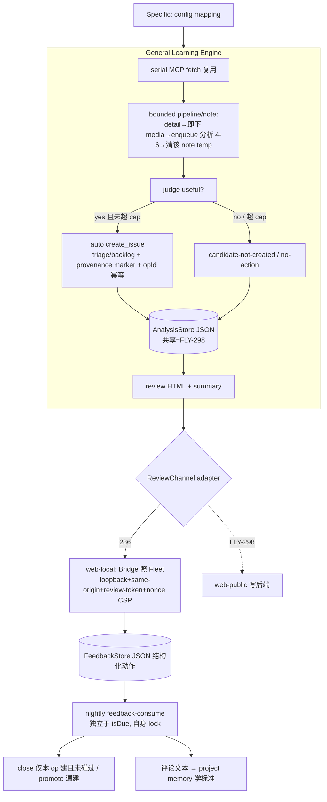

# Plan: 小红书学习系统首次生产应用 + 事后 HTML review 改造 — FLY-286

**Version**: v1.48.0（**tentative** — 多 PR 在飞，ship 时按 doc/VERSION 重定）
**Issue**: FLY-286
**Date**: 2026-06-16
**Source**: `doc/engineer/exploration/new/FLY-286-xiaohongshu-learning-applied.md`、`doc/engineer/research/new/FLY-286-xiaohongshu-learning-applied.md`
**Status**: **codex-approved**（codex-design-review 2 轮：R1 CHANGES REQUESTED 15 条全纳入 → R2 APPROVED + 5 条 watchpoints，见 §15，实现+code-review 时强制）
**Owner**: runner-bb41606f；Lead = flywheel-eng-lead (Tadashi)

---

## 0. Goal / Scope

第一次在生产把 FLY-222 已建好的小红书学习 loop 用起来，并按 Annie brainstorm 愿景把控制模型从**事前 prune gate** 改为 **事后 HTML review（本机交互页）**，同时抽出 **General/Specific 两层**（FLY-295 收口）。

**In scope（FLY-286）**：复用 FLY-222 基建（抓取/视频/图片/state/scheduler）；新控制流（抓+存 raw → bounded pipeline 逐条分析 → judge → 自动建 issue（幂等、低爆炸半径）→ analysis 持久化 → 本机交互 review 页 + 日终 summary → Annie 结构化 review → 异步 feedback 消费 close/promote + 学标准）；**review-channel = web-local**（Bridge-local，照 Fleet Console 安全模型）；General 引擎 + Specific config mapping；flywheel config 落两个 claude 收藏夹 + 装 plist。

**Out of scope**：手机/公网写后端 = **FLY-298**（并行；286 只做本机页，**共享数据层** via `AnalysisStore`/`FeedbackStore` 抽象）；YouTube（推迟）；GeoForge3D/Sub 收藏夹；**live pilot**（CoS 带 Annie，load 安全时）。

---

## 1. 锁定决策

| 维度 | 决策 |
|------|------|
| 收藏夹 | `claude`(`6884765b0000000023036a58`,~123) + `claude - 多机`(`6a30443f000000000d02a800`,~1) |
| 落点/团队/Lead/label | project `Flywheel` / team `FLY` / lead `flywheel-eng-lead` / dept label `Flywheel` |
| 频率 / 视频 | weekly / `video_opt_in=ON`（Gemini pro，并发 4-6） |
| 控制模型 | 事后 HTML review 取代事前 prune gate（**+ §2 post-hoc 授权契约**） |
| 回写(286) | **web-local**：Bridge-local，**照 Fleet Console**（loopback + same-origin + per-run review-token，非 apiToken）（§6） |
| 回写(手机/公网) | FLY-298（共享 `AnalysisStore`/`FeedbackStore`，写面不复用，§6/§9） |
| 存储 | raw 临时即删（不入持久层）；analysis/feedback 结构化 JSON 持久（§5 schema） |
| 增量 | weekly 只新增（复用 processed 差集）；首次 = `mode=analyze_baseline`（§7） |
| review UI | **结构化动作 + 可选评论**（非纯自由文本，§4-#8 / §6） |

---

## 2. 🔴 Post-hoc 授权契约（替代原 fail-close 安全不变量 — codex R1#1，approval 前必备）

去掉"未 FINAL 不建"后，靠**有界损害 + 可逆 + 幂等**重建安全：
- **provenance**：每个自动建 issue 写不可变 marker `xhs-auto-created` + `opId` + `runToken` + note URL + `collection_id` 进 description/label。
- **低爆炸半径**：自动建的 issue 落 **triage/backlog 状态/标签**（非 active execution）。
- **可逆 close 受限**：feedback close **只能**关「本 XHS op 建的 **且** 仍 untouched/unstarted（无 assignee 变更/无状态推进/无他人评论）」的 issue；若已被人动过 → **不自动关**，改 comment/升级 Lead。
- **结构化授权**：close/create/promote 来自 review 页**结构化动作**（枚举），**不**从自由文本推断（自由评论只喂学习/升级）。
- **feedback 幂等**：每个 feedback 动作有自己的 op id `feedback:<runToken>:<noteId>:<action>:<targetOpId>`（非一个 `feedbackConsumed` 布尔）。
- **rollback 审计**：提供按 marker/runToken 列出所有 XHS-created issue + feedback 状态的查询（§12），**不**自动批量关。

---

## 3. 架构

General 引擎依赖 `LearningRunSpec`(= Specific config) + 注入 `ReviewChannel`(`deliver`/`collectFeedback`) + `AnalysisStore`/`FeedbackStore`（纯接口）。286 = web-local；FLY-298 = web-public；**数据 schema/store 共享，写面各自**。

---

## 4. 组件：复用 / 替换 / 新建（含 codex R1 修正）

**复用**：`xiaohongshu-state.ts`（lease/CAS/owner-fence、processed 差集、operation 幂等、next-due、bootstrap）；scheduler + tick.sh + plist；MCP 抓取 / yt-dlp+Gemini / 图片 vision / 凭据卫生；FLY-203 reports 作**只读**交付（summary）。

**替换**：skill 步骤 6-9（prune gate + `xhs-validate-final` 授权链）→ auto-judge → auto-create(低爆炸半径) → review-adapter → 异步结构化 feedback。`xhs-validate-final` 在 286 路径不再是授权闸（代码保留）。

**新建（修正后）**：
- **state 保持瘦（R1#6）**：**不**给 `OperationKind` 加 `"analysis"`（analysis 是本地产物非外部副作用）。state 仅加 `lastAnalysisRunToken` / `pendingFeedbackRunTokens` / `lastReportToken` / 首次 `mode`。operation 记录仍只管外部副作用，**新增 kind**：`feedback_close` / `feedback_create`（连同既有 `issue`/`memory`）。
- **`AnalysisStore`（R1#6/#7/#12）**：`packages/flywheel-comm/src/xiaohongshu-analysis-store.ts`，纯接口 + 本地 fs 实现，atomic write(temp+rename)、`0600`、安全 path 段、schema 校验、retention、**无 raw bytes**。
- **`FeedbackStore`（R1#12）**：评论/结构化动作/已消费动作的存取接口（本地 fs 实现）；FLY-298 公网写适配器写同一 record。
- **`ReviewChannel` 接口（纯，R1#9）** + **web-local adapter**（落 teamlead/Bridge，非 flywheel-comm）。
- **Bridge 本机 review 路由**（§6，照 Fleet）。
- skill 新控制流（flyview-skills）。
- config + scheduler CollectionRunPlan + trigger body 扩展（§9，R1#10）。

**包边界（R1#9）**：`flywheel-comm` = 纯 state/store schema + DTO + skill 用的 CLI 子命令；`teamlead` = Bridge review 路由 + web-local adapter + scheduler；`flyview-skills` = Runner 控制流（MCP/媒体分析/Linear MCP 建单/memory handoff）。`ReviewChannel`/store 接口保持纯，adapter 实现在 flywheel-comm 之外。

---

## 5. 数据层 schema v1（共享给 FLY-298 — R1#7）

位置 `~/.flywheel/state/xiaohongshu/<project>__<collection_id>/`（env `FLYWHEEL_XHS_STATE_DIR` 可覆盖）；安全：安全 path 段、`0600`、temp+rename、不跟 symlink、长度上限、retention；**持久层无 raw 图/视频字节**。

- **run 文件** `analysis/<runToken>.json`：`{schemaVersion, runToken, execId, project, collectionId, collectionLabel, generatedAt, sourceWindow:{fetched,total,capped}, posts[], summary:{analyzed,created,candidates,skipped}, review:{reportToken,deliveredAt?}}`
- **post**：`{noteId, title, url, mediaKinds:[text|image|video], summary, judgment:{useful:bool, reason}, candidateIssue?:{title,body}, createdIssue?:{issueId,opId,state}, status:[analyzed|created|candidate|no_action]}`
- **feedback 文件** `feedback/<runToken>.json`：`{schemaVersion, runToken, comments:[{noteId, text, at}], actions:[{noteId, action:[keep|close_created|promote_candidate|edit|skip], targetOpId?, edit?, at}], consumedActions:[{opId:"feedback:<runToken>:<noteId>:<action>:<targetOpId>", at, result}]}`

---

## 6. web-local review 路由（照 Fleet Console，非 /api/reports — R1#2/#3/#8/#14）

**为何不复用 FLY-203 托管页**：FLY-203 报告按**产品契约**是公开/静态/只读（默认注入 `default-src 'none'; style-src 'unsafe-inline'; img-src data:`），**无可信 same-origin 写后端**，不应为 XHS 放松。（注：`form-action` 不 fallback 到 `default-src`——所以不拿"CSP 禁 form"当安全证明；安全证明 = 无写后端 + 只读契约。加测试：经 `/api/reports` 发的 286 只读 summary 不带放松 CSP / 写 form。）

> **跨部门情报（Asha/sub Lead，已实证 — fold 入设计，R2 后 additive 不改已批结构）**：`publish-report` 托管路径还会 **sanitize HTML**——strip `<script>`/`<audio>`/`<select>`/自定义按钮 → 交互页经它发出去变**空壳**（localhost/raw 测能过但最终托管 URL 坏）。**印证**本节结论：**交互 review 页绝不走 `publish-report`**（286 走 Bridge-local 路由，JS same-origin 真跑 + POST 到 localhost）。
> - **只读 summary**：走 `publish-report` 没问题（纯静态、无脚本/交互元素，sanitize 无碍）。
> - **若要"交互 HTML 且超出 localhost"**（= FLY-298 手机/公网页的现成路径）：HTML → **GitHub gist → `cdn.statically.io/gist/<user>/<id>/raw/<file>.html`**（以 `text/html` 服务、JS 真跑、手机可开）；写后端仍是 298 的事（statically.io 只服务静态文件，POST 目标 286=localhost Bridge / 298=公网 backend）。→ **286/298 切分不变**（286=本机服务+本机写；298=公网页+公网写）；statically.io 是 298 的交付路径备选。
> - **资源 hygiene + 版权**：媒体**按 URL 引用原站**（rednotecdn/xiaohongshu 原链），**绝不内嵌 base64（超 512KB）、绝不 re-host 第三方版权内容（只链原站）**。大体积资源若需托管走 catbox（永久）/litterbox（1h-72h 自删），**不放版权内容**。与"持久层无 raw bytes"决策一致。

**设计（照 `fleet-routes.ts` + `plugin.ts:671-798`，mount 在 `/api` Bearer 中间件之前）**：
- 路由：`GET /xhs-review/:runToken`（serve 交互页）+ `POST /xhs-review/:runToken/action`（收结构化动作+可选评论）。**挂在 Bearer 之前**（浏览器无 apiToken），或 `/api/xhs-review/*` 显式 mount-before-Bearer 并文档化（与 Fleet 一致）。
- **鉴权（非 apiToken 进浏览器！）**：`loopbackSelfOrigin()` + `isSameOrigin()`（Host 必 localhost + Origin/Referer 同源校验）+ **per-run review-token / 单次 confirm-token**（绑 `runToken`，页面内嵌 nonce，非 `TEAMLEAD_API_TOKEN`）。复用/抽出 Fleet 的 `loopback-origin` 工具。
- **scoped CSP（仅此路由，不污染 FLY-203）**：`default-src 'none'; script-src 'nonce-<n>'; style-src 'nonce-<n>'; connect-src 'self'; form-action 'self'; base-uri 'none'; frame-ancestors 'none'; img-src data:`。
- **结构化 review UI（R1#8）**：每 post 显示 summary + action + 控件：created issue → `keep`/`close as not useful`/`needs edit`；candidate-not-created → `promote to issue`/`skip`/`needs edit`；no-action → `promote`/`skip`；外加**可选评论框**。async 消费**只**对结构化动作行动；自由评论喂学习/升级 Lead。（仍满足 Annie"只动错的、对的不管"——结构化动作 = 那次最小触碰。）
- **输入校验**：Host/Origin/Referer、`runToken`、`noteId` 属于该 run、action 枚举、评论长度上限、转义防 XSS。动作只入 `FeedbackStore`（close/create 在异步消费阶段做，经 Linear MCP，founder-only 边界不变）。
- **kill switch**：env `FLYWHEEL_XHS_REVIEW=0` 默认可关（byte-compat）。

---

## 7. 首次 + 异步 feedback 消费（R1#4/#5）

**首次（R1#4）**：新转换 `bootstrapped=false → mode=analyze_baseline`（不沿用"baseline-only 跳过分析"）：分析全部历史 note（受 `first_run_analyze_limit` 或按 `max_fetch` 分批，区别于稳态 `max_fetch`）、持久化全部 analysis + candidate、自动建**受 `first_run_cap`（默认 15）**；**仅在 review 页交付成功后**才 mark-processed；交付后崩溃 → 重跑经 opId reconcile、不重复建。`total>200`：无 cursor 无法全析 → 取最新 200 + 一次告警，明示限制。

**异步 feedback 消费（R1#5）**：产 report 的 run 立即 `no_code` 完成（不 hang）。新增**独立于 `isDue` 的 nightly feedback-consume pass**（与正常 learning run **不抢同一 collection lease** —— 用单独 feedback lock 或顺序化）：`collectFeedback(lastReportToken)` → 按**结构化动作**：`close_created`(仅本 op 建且 untouched，否则升级) / `promote_candidate`→create / `edit` / `skip`；评论文本 → `[XHS-MEMORY-WRITE]`(path B) 学标准。每动作幂等 op id（§2）。

---

## 8. bounded pipeline（R1#11）

`xsec_token ~15min` 即用即下：**串行** MCP detail fetch 一条 → **立即**下该 note 的 media → enqueue 分析（concurrency 4-6：video Gemini / image vision / text）→ 分析完**清该 note temp dir**。MCP 调用保持串行；只并行 detail 拿到后的分析。封顶总 temp 字节 + 单视频大小；长批中 renew lease。

---

## 9. config + scheduler 扩展（R1#10）

config 加可选：`review_channel?: "web-local"`(default；FLY-298 加 `"web-public"`，ConfigLoader 校验枚举)、`first_run_cap?: number`(default 15，校验)、`first_run_analyze_limit?`、`auto_create?: boolean`(default true)、`feedback_mode?`。default-off + tuple 校验 + reverse-compat sentinel 不破 FLY-222 既有测试。
**scheduler（R1#10）**：`CollectionRunPlan` 加 `reviewChannel/firstRunCap/autoCreate/feedbackMode`；`scripts/xiaohongshu-scheduler.ts` trigger body 每 tick resync 这些新字段（否则到不了 skill）；加 scheduler 单测。

flywheel `.flywheel/config.yaml`（pilot 前落）：两个 claude 收藏夹（id 见 §1），`review_channel: web-local`，weekly，`video_opt_in: true`，`max_fetch: 20`。

---

## 10. PR 切分 + 跨仓兼容门（R1#13）

1. **flywheel 基建 PR**：state 瘦扩展 + `AnalysisStore`/`FeedbackStore` + `ReviewChannel` 接口 + web-local adapter + **Bridge review 路由(照 Fleet)** + config/scheduler/trigger-body 扩展。TDD 单测 + Bridge route 集成测。
2. **flyview-skills skill PR**：新控制流（调用 #1）。**skill preflight**：用前 `node "$FLYWHEEL_COMM_CLI" <新子命令> --version`(或等价探测)确认新能力在；缺 → fail-soft、不前移 state。
3. **flywheel scheduler PR**：plist 安装 helper + bootstrap 文档 + feedback-consume 接线。
4. config 落 + 隔离 sandbox B-series → 报 Tadashi → live pilot(CoS)。

**顺序硬约束**：先 ship flywheel 代码 → build → 需要则重启 Bridge → 验新 CLI/路由 → **再** sync flyview-skills + 装/启 plist；**config 保持 default-off 直到 sandbox B-series 过**。（复用 FLY-205/222 教训：改 types.ts 须 build；config 进内存须重启 Bridge 一次。）

---

## 11. Test plan（TDD）

**单测**：config 新字段 + 兼容 sentinel + 枚举/cap 校验；state 瘦扩展 + owner-fence + 新 feedback op kind；`AnalysisStore`/`FeedbackStore` 读写/atomic/幂等/schema 校验；`ReviewChannel`/web-local adapter；judge + first_run_cap + analyze_baseline 转换；feedback 消费幂等(重跑不重复 close/create)+ "已被人碰过不自动关"。
**集成**：Bridge review 路由(loopback-only + Origin/Referer + review-token 非 apiToken + scoped-CSP nonce + **不污染 FLY-203 严格 CSP** + 结构化动作入 FeedbackStore + XSS 转义)；feedback→close/create(Linear MCP mock，仅 untouched 本-op issue)。
**验收(隔离 sandbox，照 FLY-222 A-series)**：B1 analyze_baseline + cap；B2 图文/视频(回归 A2/A3)；B3 自动建幂等(opId marker + 建前查 + crash 注入不重复 + provenance + triage 落点)；B4 review 页(localhost 渲染、结构化动作入 store、CSP scoped、XSS)；B5 异步 feedback(close 仅 untouched 本-op、promote 漏建、幂等、已碰过升级、学标准入 memory)；B6 增量；B7 config default-off + tuple；B8 fail-soft(超时不刷屏、state 不前移、no_code、无 raw 残留)；B9 并发(lease/owner-fence/409 + feedback 与 learning 不抢 lease)。

---

## 12. Rollback（含已建 issue 审计 — R1#15）

config default-off 删段即停；skill revert flyview-skills；Bridge 路由 env `FLYWHEEL_XHS_REVIEW=0`；plist `bootout`。**已自动建的 issue**：提供 `flywheel-comm xhs-audit`(按 marker/runToken 列出全部 XHS-created issue + feedback 状态)；**不**自动批量关，给安全 review 列表，仅显式请求时关 untouched 的。

## 13. Pilot（CoS，deferred）
load 安全 + Annie 在场：两个 claude 收藏夹 → analyze_baseline → 本机 review 页(结构化动作) → Annie review → 异步 feedback。286 交付到"可 pilot + sandbox B-series 过"。

## 14. Open（codex round-2 关注）
1. feedback-consume 落"nightly 独立 pass" vs "有未消费评论时专门 spawn" —— 选了前者(§7)，复核 lease 不抢。
2. `first_run_cap` 默认 15 + analyze_baseline 分批策略是否够稳(124 条)。
3. web-local 路由抽 `loopback-origin` 共享工具 vs 复制 Fleet —— 倾向抽共享。
4. General 引擎落包(flywheel-comm 纯接口 / teamlead 实现) + FLY-298 复用接缝。

## 15. Round-2 watchpoints（codex APPROVED 附带 — 实现 + code-review 时强制，测试落实）

1. **feedback op id 编码**：现有 `operationId()`(xiaohongshu-state.ts:601-615) 冒号分隔且拒绝字段内含 `:`；逻辑 id `feedback:<runToken>:<noteId>:<action>:<targetOpId>`(targetOpId 本身含 `:`) **不可直接过现有 helper**。→ 新建专用 feedback-op-id helper，或 hash/URL-safe 编码后再存 `OperationRecord.candidateId`。
2. **triage/backlog 落点 fail-closed**：实现时定准 Linear 的 triage/backlog status/label，**测 XHS-created issue 不自动起 Runner**；若安全 status/label 解析不出 → `auto_create` **fail-closed**：留 post 为 `candidate`，**不**建可执行 issue。
3. **feedback-lock 选一种 + 测竞态**：PR 里定一个具体机制；测"feedback 消费旧动作 时 learning run 在更新同 collection state/report 指针" → 不丢动作、不重复建、不关刚被碰过的 issue。
4. **review-token 生命周期测试**：token 绑 runToken、POST 需 same-origin + token、重放/伪造 token 被拒、**served HTML/client JS 中不出现 `TEAMLEAD_API_TOKEN`**。
5. **首次分批默认**：pilot 前定 ~124 条首次的显式默认；`first_run_cap=15`(除非 Annie 改);若分批，review 页要让"部分 vs 完整覆盖"显眼。
6. **最终交付 URL 自核（Asha 情报）**：交互页（Bridge-local，及 FLY-298 的 statically.io 页）发给 Annie 前，**自己用浏览器打开最终 URL 核**渲染 + 交互（按钮/评论提交）真能用——不能只测 localhost/raw（`publish-report` 会 sanitize 成空壳）。进 B4 验收清单。
7. **版权/资源 hygiene（Asha 情报）**：review 页媒体只**链原站**（rednotecdn/xiaohongshu），不内嵌 base64、不 re-host 版权内容；大资源走 catbox/litterbox 且不放版权内容。
