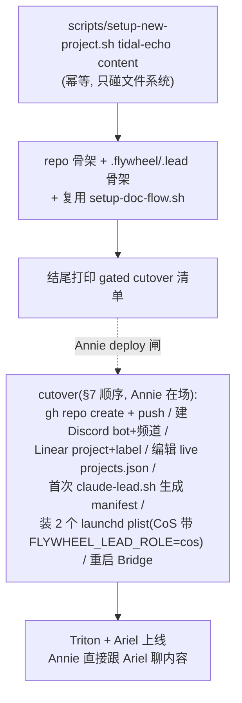

# Plan: 从零起一个全新项目 (tidal-echo) — start-from-zero scaffold flow

**Version**: v1.49.0（provisional —— ship 时按实际 re-version）
**Issue**: FLY-284
**Date**: 2026-06-16
**Source**: `doc/engineer/exploration/new/FLY-284-from-scratch-onboard.md`, `doc/engineer/research/new/FLY-284-from-scratch-onboard.md`
**Status**: codex-approved（design-review 3 轮：R1 direction sound + 4 BLOCKING/2 NON-BLOCKING 全收；R2 2 处 stale-text regression 全修；R3 最后 1 处 NON-BLOCKING（line 172 cutover 顺序）已修 + 全文 sweep 一致 → 零 BLOCKING，approvable）

---

## Goal

把一个**全新内容项目 `tidal-echo`** 从零搭成可被 Flywheel 接管的"框架"：repo 骨架 + 一个 content 部门 + 两个 Lead（CoS **Triton** + Content **Ariel**）+ Discord + Linear + Flywheel wiring。搭好后 Annie 直接跟 Ariel 聊具体内容（内容生产本身出界）。

**交付物形态（FLY-205 模式，Annie 已倾向）**：主交付 = 一条**最小、幂等、可复用的 zero-to-one scaffold 流程**（`scripts/setup-new-project.sh`）；**tidal-echo = 它的第一次真实运行**（验收场景）。以后任何全新项目都走同一条命令。

**两条红线（贯穿全 plan）**：
1. **brainstorm-first 已完成**（与 Annie 多轮对话定调），本 plan 之后才进 implement。
2. **PR-only 交付 + Annie deploy 闸**：物料只在 PR/worktree 交付；**不**真建 repo/bot、**不**编辑 live `projects.json`、**不**装 launchd、**不**重启 Bridge。真上线 = Annie 在场拍的 cutover（§7）。

---

## Scope Boundaries

**In scope**：
- `scripts/setup-new-project.sh`（flywheel 仓）：幂等生成新项目 repo 骨架 + `.flywheel`/`.lead` 骨架，复用 `setup-doc-flow.sh`；**只碰文件系统、零 live/网络副作用**，结尾打印 gated cutover 清单。bash 测试（幂等）。
- tidal-echo 的具体物料（脚本模板填值后的产物）：repo 骨架、`.flywheel/config.yaml`、`content-executor.md`、Triton + Ariel `identity.md`、`projects.json` 草案条目（**draft 文档，不写 live**）。
- Linear 结构方案（project "Tidal Echo" + `Tidal-Echo` / `Tidal-Echo-Triage` label，under Personal/LEARN team）—— **cutover 时创建**。
- Annie-manual cutover 清单（§6）+ live cutover 顺序（§7）。
- RPCI 文档（exploration/research/本 plan）。

**NOT in scope**：
- 任何**内容生产**（数字人/配音/视频/剪辑/YouTube/平台策略）—— Annie 明确出界，给未来的 Ariel。
- tidal-echo 的 `AGENTS.md` 内容硬规则、`content/brief`、`content/references` 实质内容 —— 只留**占位骨架**，Ariel 上线后跟 Annie 定（不预设她做什么内容）。
- 真 cutover 执行（建 repo/bot、live config、launchd、重启）—— Annie 闸后单独做。
- 把 scaffold 升级成完整 `flywheel-cli init` 子命令 —— 本次只做 thin shell 脚本；CLI 化作后续 issue（避免过度工程）。
- FLY-285（已存在项目 re-onboard + COE）的任何工作。

---

## Architecture（一句话 + 图）

复用现成 onboard 三层（projects.json / config.yaml / .lead identity）+ launch 链（claude-lead.sh / wrapper / launchd），**唯一新增 = 前半段"建仓 + 骨架"的一条幂等脚本**；live cutover 全部 gated。



---

## Phase 1 — 可复用 scaffold 机制 `scripts/setup-new-project.sh`（本 plan 的心脏）

**唯一入口，幂等，只碰文件系统，零 live/网络副作用**（照 `setup-doc-flow.sh` 的安全形态）。

**签名**：`setup-new-project.sh <project-name> <department> [--repo-owner xrliAnnie] [--two-layer]`
- `<project-name>`：校验 `^[a-z0-9][a-z0-9-]*$`（filesystem/repo/projectName 安全，对齐 ProjectConfig regex 的小写子集）。
- `<department>`：校验 `^[a-z0-9-]+$`（对齐 setup-doc-flow.sh）。
- `--two-layer`：生成 CoS + dept 两个 Lead 骨架（tidal-echo 用）；缺省 = 单 dept Lead（joycon/sub 形态）。

**做什么**（全部幂等：已存在则跳过，重跑 diff 空）：
1. 校验参数；`target=~/Dev/<project-name>`：**(a)** 不存在 → `mkdir` + `git init`；**(b)** 已存在但**不是 git 仓根**（`git -C <target> rev-parse --show-toplevel` 不等于 target）→ **在写任何文件前报错退出**（照 setup-doc-flow.sh 的 git-根守卫，防跑错目录 —— Codex R1 BLOCKING #3）；**(c)** 已是 git 根 → 继续（幂等）。
2. 写 repo 骨架（heredoc 模板，唯一真相源）：`README.md`、`AGENTS.md`（**占位**：onboarding 框架 + "内容硬规则 TODO"，不预设内容）、`.gitignore`（含 `worktrees/`、`node_modules/` 等）。
3. 写 `.flywheel/config.yaml` —— **产出 §2.2 的完整块**（`project`/`runners`/`teams`/`decision_layer`/`checkpoints`/`doc_flow` 全齐，过 `ConfigLoader.validate()`）；`agents.<name>`（key=执行器名）含 `agent_file` + `match.labels`，配 `default_agent`（**不是** `agents.<dept>.<role>` 三层 key —— 见 §2.2）。
4. 写 `.flywheel/agents/<dept>/<role>-executor.md`（content 项目 → 照 sub `content-executor.md` 的"内容工程师"框架；非 content → 通用占位）。
5. `--two-layer`：写 `.lead/<name>-cos-lead/identity.md`（CoS 模板）+ `.lead/<name>-<dept>-lead/identity.md`（dept 模板）；否则只写后者。**identity 模板带 persona 占位**（`{{PERSONA}}`）—— tidal-echo cutover 时填 Triton/Ariel（也可脚本 `--cos-persona/--dept-persona` 传）。
6. 复用 `setup-doc-flow.sh <target> <department>`（产 `<dept>/doc/` + README + retro/.gitkeep；若开 doc-flow）。
7. **结尾打印 gated cutover 清单**（§6/§7 的可执行步骤 + 占位 id/token 提示）—— 脚本**不执行**任何 live 步骤。

**测试**（bash，照 `test-fly26-rules-split.sh` / `setup-doc-flow.sh` 测试模式）：
- 全新项目 `--two-layer` 产出结构断言（README/AGENTS/.gitignore/config.yaml/两个 identity/content-executor/doc/ 全在）。
- **幂等**：两次运行 `git status --porcelain` diff 为空（主验收判据）。
- 单层模式只产一个 identity。
- 非法 project-name / department 拒绝。
- 校验产物 `.flywheel/config.yaml` 过 `ConfigLoader.validate()`（起一个最小 node 校验或既有 config 测试夹具）。

> **简化守则**：脚本只做"安全的文件系统骨架 + 打印 live 清单"。建 repo / Discord / Linear / projects.json / launchd 这些 live/不可逆动作**不进脚本主路径**（避免一条命令误触发生产副作用），由 §7 gated cutover 人工/逐条执行。

## Phase 2 — tidal-echo 具体物料（脚本模板填值后的产物，draft 交付）

> 这些是 Phase 1 脚本对 tidal-echo 跑出来的产物形状；plan 阶段锁内容，cutover 时落到真 repo。

### 2.1 `~/.flywheel/projects.json` 新条目（**draft 文档，PR 里以 `doc/` 或注释形式交付，不写 live**）
照 research §2.1（flywheel 2-layer 逐字对照）：`tidal-echo-cos-lead`（Triton，`Tidal-Echo-Triage`，`canSpawnRunners:false`，`TRITON_BOT_TOKEN`）+ `tidal-echo-content-lead`（Ariel，`Tidal-Echo`，`department:content`，`canSpawnRunners:true`，`ARIEL_BOT_TOKEN`）+ `generalChannel` = #tidal-echo-core。

### 2.2 `.flywheel/config.yaml`（照 sub 完整 schema —— Codex R1 BLOCKING #1/#2）

`ConfigLoader.validate()` 要求 `runners.{default,available}` + 非空 `teams` + `decision_layer.{autonomy_level,escalation_channel}` 都齐；`agents.<name>` 的 key 是**执行器名**（非 `dept.role` 三层），值含 `agent_file` + `match.labels`。完整内容：

```yaml
project: tidal-echo

linear:
  team_id: TIDE               # Annie 拍定专属 team；scoping 靠 projectName + FLY-127 label，team_id 运行期不读

runners:
  default: claude
  available:
    claude:
      type: claude
      model: sonnet

teams:
  - name: default
    orchestrators:
      - type: dag
        runner: claude
        budget_per_issue: 10

decision_layer:
  autonomy_level: advisor      # 内容 PR merge 仍走 founder (FLY-175)
  escalation_channel: discord

checkpoints:                   # 照 sub（content 项目）：只 brainstorm + question；approve_to_ship 不启用（内容 merge founder-gated，不注入 :cool 序列）
  brainstorm:
    enabled: true
    timeout_ms: 86400000
    timeout_behavior: fail-close
  question:
    enabled: true
    timeout_ms: 86400000
    timeout_behavior: fail-open

agents:                        # 单 content 执行器；key=content（执行器名），dept-grouped 路径（CoS-ready）
  content:
    agent_file: .flywheel/agents/content/content-executor.md
    department: content
    match:
      labels: ["content", "Tidal-Echo", "research", "copy", "publishing"]
default_agent: content         # 所有 content issue 缺省路由到 content 执行器

doc_flow:
  enabled: true
  default_department: content
```

> 注：`skills.*`（test/lint/build command）暂不写死 —— content pipeline（style-lint 等）由 Ariel 上线后定，不预设。

### 2.3 executor `.flywheel/agents/content/content-executor.md`
照 sub `content-executor.md`：内容工程师框架（onboard→brainstorm/GATE→research/GATE→plan/GATE→implement→self-verify→Codex→PR），报告走 `flywheel-comm ask`（FLY-208，禁 SendMessage），媒体/审阅 gate 占位（具体内容 pipeline 由 Ariel 后续定）。**不照搬 sub 的 affirmation/Suno 专属规则**（那是 sub domain）。

### 2.4 `.lead/tidal-echo-cos-lead/identity.md`（Triton，照 Aunt Cass）
frontmatter（opus/memory:user/disallowedTools/bypassPermissions）；CoS 定位：triage→present to Annie→等确认→打 dept label→route 给 Ariel（`/api/chat-threads/send`）；**绝不走 #leads-roundtable**；不开 Runner、不碰内容；给 Annie 里程碑汇总。persona = Triton（海王/把关者主题）。

### 2.5 `.lead/tidal-echo-content-lead/identity.md`（Ariel，照 Asha）
frontmatter 同上；dept 定位：管 content Runner 端到端产内容；Linear 查询 `?project=Tidal Echo`；每个交 Runner 的 issue 必带 `Tidal-Echo` label；媒体试听/审阅 gate（Ariel 贴、Annie 拍）；不替 Annie 做审美判断。persona = Ariel（声音/创作主题）。memory 共享桶 = `tidal-echo`。

### 2.6 repo 骨架
照 research §2.5（README/AGENTS 占位 + .gitignore + .flywheel + .lead + content/{doc,brief,references} 占位）。

## Phase 3 — Linear 结构（cutover 时创建）

- **Annie 拍定（2026-06-16）= 新建专属 team「TIDE」**（不走 sub 的 project-under-LEARN，要更干净的隔离 + `TIDE-NN` issue key）+ 两个 label：`Tidal-Echo`（content）、`Tidal-Echo-Triage`（CoS triage，照 flywheel `Flywheel-Triage`）。
- 创建动作（建 team `TIDE` + `create_issue_label` ×2）= cutover 时跑（live 写，放 Annie 闸后）。可选：建一个 Linear project "Tidal Echo" 归类 issue（非必需，team 已隔离）。
- **已做 read-only Linear 核对**（Codex R1 NON-BLOCKING #6）：`list_teams` = Personal(LEARN)/GeoForge3D(GEO)/Flywheel(FLY)；`list_projects` 证 sub project "Sub" 确实挂在 Personal/LEARN team 下 + routing label `Sub`。tidal-echo 同形成立。

## Phase 4 — Discord bot + 频道（Annie 手动，§6）

2 个 bot（Triton + Ariel）+ 2 个频道（#tidal-echo-core / #tidal-echo，option C 双频道）。走 `/setup-discord-lead` 流程；token 落 `~/.flywheel/.env`。**必须 Annie 手动**（开发者门户 / 2FA / 邀请 / 建频道）。

---

## 6. Annie-manual cutover 清单（只有她能做的）

1. **建 2 个 Discord bot**（Triton + Ariel）：开发者门户建 app、开 Server Members + Message Content intents、记 token、邀请进 server（2FA）。
2. **建频道**：#tidal-echo-core（CoS/core）+ #tidal-echo（content）。记 channel id。
3. **token 落 `~/.flywheel/.env`**：`TRITON_BOT_TOKEN` / `ARIEL_BOT_TOKEN`。
4. **批准 live cutover**（§7 的 live 写动作，**照 §7 顺序**：gh repo create、Linear 创建、编辑 live `projects.json`、首次 claude-lead.sh 生成 manifest、装 launchd、重启 Bridge）。
> 1-3 可由我把 `/setup-discord-lead` 的精确步骤写成 checklist 陪她一步步走（她操作浏览器/2FA，我备好命令）。

## 7. Live cutover 顺序（Annie 闸后执行，gated；可由 Runner 代跑 live 写 + Annie 在场拍）

> ⚠️ **顺序照 FLY-270：projects.json-first → manifest → 装 plist**（Codex R1 BLOCKING #4 —— 不能先装 plist）。

1. `setup-new-project.sh tidal-echo content --two-layer`（**安全**，先跑出 repo + 骨架）。
2. `gh repo create xrliAnnie/tidal-echo --private` + 初始 commit + push（live；Annie gh 已登录 —— Runner 代跑或 Annie 手动，Annie 定）。
3. Linear：建 project "Tidal Echo" + label `Tidal-Echo` / `Tidal-Echo-Triage`（live 写）。
4. **先备齐 id/token 再写 config**：建好 Discord bot/频道后，token 落 `~/.flywheel/.env`（`TRITON_BOT_TOKEN`/`ARIEL_BOT_TOKEN`），把 bot id/频道 id 填进 identity；**编辑 live `~/.flywheel/projects.json` 加 tidal-echo 条目**（含 `memoryAllowedUsers: ["annie","tidal-echo-cos-lead","tidal-echo-content-lead","tidal-echo"]` —— Codex R1 NON-BLOCKING #5，memory 校验 fail-closed，漏则拒）。
5. **每个 Lead 各跑一次 `claude-lead.sh`** 生成并校验 manifest（projects.json 已就位 → manifest，照 FLY-270）；生成后**停掉该手动进程**（避免与即将装的 launchd KeepAlive 实例重复）。
6. 装/reload 2 个 launchd plist（CoS plist **必带 `FLYWHEEL_LEAD_ROLE=cos`**，dept 不带）；用 `launchctl print … | grep FLYWHEEL_LEAD_ROLE` 验 CoS env 已生效。
7. 重启 Bridge（**攒重启纪律**：与在途 Bridge PR 合并一次重启；开跑前问 team-lead 有无其它 Bridge PR 排队）。
8. 验证上线：两 bot 绿点 + 各频道回话 + Annie 在 #tidal-echo 跟 Ariel 真聊一句、在 #tidal-echo-core 跟 Triton 真聊一句。

> cutover 全程 founder-gated（FLY-175 founder-only-authority + memory 红线"未经 Annie 许可不可 ship/关 runner/重启"）。

---

## 实施顺序与 PR 切分

| PR | 内容 | 仓库 |
|----|------|------|
| PR-1（flywheel 仓）| Phase 1 脚本 + 测试 + Phase 2 tidal-echo 物料（模板 + draft projects.json 条目）+ RPCI 文档 + 本 plan 归档 | flywheel |
| cutover（非 PR，Annie 闸）| §7：建 tidal-echo repo（其首 commit = 脚本产物）+ Discord + Linear + live config + launchd + 重启 | live |

> tidal-echo repo 是**全新仓**，它的"PR"= 仓库首次创建 + push（cutover 一部分），不是对已有 main 的 PR。flywheel 仓 PR-1 是本 issue 在本仓的可 review/可测单元。

---

## 测试汇总

- 单测/bash：Phase 1 脚本 ×5（全新 two-layer 产出 / **幂等 diff 空** / 单层 / 非法参数拒绝 / 产物 config 过 ConfigLoader）。
- 校验：tidal-echo `projects.json` 草案条目过 `parseAndValidateProjects()`（exact-key 唯一、match.labels 非空、CoS canSpawnRunners:false 合法）—— 起最小 node 校验夹具。
- 真机（cutover 后，Annie 在场）：两 bot 上线 + 各频道回话 + Annie 真聊验证（§7.7）。
- 回归红线：脚本零 live 副作用（跑完 `~/.flywheel/projects.json` / launchd / Linear 无变化）—— 测试断言。

## 风险与对策

| 风险 | 对策 |
|------|------|
| 脚本误触发 live 副作用（建 repo/改 projects.json） | 脚本主路径**只碰文件系统**，live 步骤只打印不执行；测试断言零 live 变化 |
| agentId 撞 geoforge3d 的 `cos-lead` | 强制 project-prefixed `tidal-echo-cos-lead/-content-lead`（research §1.1） |
| CoS 规则没加载（Triton 被当 dept lead） | launchd plist 必带 `FLYWHEEL_LEAD_ROLE=cos`（§7.5，实证） |
| 误建 `.lead/shared/` 导致 launch fail | 规则折进各 identity.md，不建 shared（research §1.2） |
| 过度工程（把 thin 脚本做成大 CLI/scaffolder） | 明确出界：本次只 thin shell；CLI 化另立 issue |
| Bridge 重启窗口 | 攒重启纪律 + 协调 QA hot-deploy（memory 红线） |
| 预设了 Annie 的内容方向 | AGENTS/brief/references 只留占位；内容方向 = Ariel 上线后定 |

---

## 给 Annie 的真取舍 —— **已拍定（2026-06-16）**

1. **Linear**：✅ **专属 team「TIDE」**（`TIDE-NN`，更干净的隔离）—— Annie 选 option b（不走 project-under-LEARN）。
2. **建 tidal-echo repo 执行者**：✅ **cutover 时 Runner 代跑 `gh repo create`**（Annie gh 已登录）—— Annie 选 option a。
3. doc-flow 开 + 部门 `content` + 频道双拓扑 + 单 content-executor —— 按推荐自定（Annie 未否决）。
