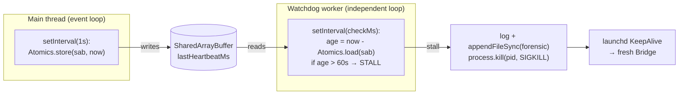

# Plan: Bridge GatePoller wedge fix — stale-gate eviction + per-lead circuit breaker + event-loop self-watchdog

**Version**: v1.49.0 (tentative — reconcile at ship)
**Issue**: FLY-307
**Date**: 2026-06-17
**Source**: brainstorm gate (Lead-approved scope A+B+C)
**Status**: codex-approved (2 rounds, xhigh)

## Problem

The Bridge `GatePoller` (`packages/teamlead/src/bridge/gate-poller.ts`, 3s interval in prod) pegged 100% CPU and became fully unresponsive for ~10 min on 2026-06-17, severing **all** Discord outbound (the reply-routing guard and `/api/chat-threads/send` both depend on the Bridge). launchd `KeepAlive` only restarts a *crashed* process, not a *hung* one, so recovery required a manual `kickstart`.

Two independent failure modes combined:

1. **Stale completed-session gate hot-loop (visible/reproducible).** `relayToLead` skips a `gate_question` whose source session is no longer active (`status ∉ {running, awaiting_review, approved_to_ship}`) with a `console.warn` + `return`, but **never removes the question from CommDB**. `getPendingQuestions` filters only by `expires_at > now` (gate TTL = 48h) + "no response", so the dead gate is re-fetched and re-skipped **every 3s for up to 48h** → log spam + constant `getSession` (sql.js) churn. Confirmed in `/tmp/flywheel-bridge.log`: qids `9d450c0b…` / `2c5835eb…` from completed session `d0ea9175…`.

2. **`memory access out of bounds` native trap (wedge trigger).** This is the canonical **sql.js / WebAssembly `RuntimeError`** message (teamlead's `StateStore` is `sql.js`, in-memory WASM). The per-lead `try/catch` (gate-poller.ts:183) catches the *JS* exception, but a WASM out-of-bounds trap **poisons the linear memory for the whole process**; the trap can also spin synchronously *inside* WASM, blocking the event loop entirely (matches "log silent at 13:53 while CPU kept climbing"). Catch-and-continue cannot repair a poisoned WASM heap, so the poller hot-loops and/or the loop stalls permanently.

## Goals & non-goals

**Goals**
- A dead gate must be **evicted**, not log-skipped forever.
- One lead's repeated poll failure must never wedge the whole poller (isolate + back off).
- A true event-loop hang must **auto-recover** (convert hang → crash → KeepAlive restart) — close the gap KeepAlive can't cover.

**Non-goals**
- Rewriting the sql.js StateStore or migrating to better-sqlite3 (out of scope; the watchdog makes the trap survivable regardless of trigger).
- The lead-scope-mismatch skip path (active session resolving to a different Lead) — separate, lower-severity, noted as follow-up.

## Fix — three layers

### A. Evict completed-session `gate_question` (root cause #2) — core

In `relayToLead`, the gate branch already detects `!ACTIVE_SESSION_STATUSES.has(session.status)`. Change that path from "warn + return" to **evict** via the existing `db.resolveGate(question.id, 0)` (0 cleanup-hours = expire **now**) — the exact mechanism `gate.ts` already uses for timeout cleanup (`safeResolveGate`). After this, `getPendingQuestions` (`expires_at > now`) stops returning it permanently, cleaning the **currently-present** stale gates on the next poll.

**Suppression state (two maps, both checked in `poll()` BEFORE `getSession()`):**
- `evictedGateIds: Set<string>` — eviction write succeeded → skip permanently and silently.
- `evictionRetryAt: Map<string, number>` — eviction write failed (DB lock/corrupt) → suppress `getSession()` + warnings until `tickCount >= retryAt`, then retry the cleanup write at a low cadence (`EVICTION_RETRY_TICKS`, default 20 ≈ 60s). This converges on **persistent** cleanup (the goal is evict, not merely ignore in memory) while avoiding a write storm.

🔴 **Critical ordering (Codex R1 #4):** `poll()` calls `StateStore.getSession(question.from_agent)` (sql.js — the exact WASM-touching op we're trying to stop churning) **before** `relayToLead`. So the suppression check MUST live in `poll()` right after `getPendingQuestions()` and **before** `getSession()`:
```ts
if (question.checkpoint != null) {            // gate_question only
  if (this.evictedGateIds.has(question.id)) continue;
  const retryAt = this.evictionRetryAt.get(question.id);
  if (retryAt !== undefined && this.tickCount < retryAt) continue;
}
```
The first encounter still calls `getSession` once (needed to learn the session is terminal); thereafter the gate is short-circuited before any sql.js touch.

**Eviction helper (Codex R1 #6 — defense in depth):** a private `evictTerminalGateQuestion(question, dbPath)` whose **first line hard-asserts `question.checkpoint != null`** and refuses otherwise (returns without writing). `resolveGate` itself updates any `type='question'` row by id with no checkpoint guard, so the boundary is enforced at the primitive, not only by surrounding control flow. The helper opens a best-effort write handle (busy_timeout already set by `CommDB`), calls `resolveGate(qid, 0)`, updates the two maps (success → `evictedGateIds`; failure → `evictionRetryAt`), and logs **once** per gate (`evicting stale gate_question … source session terminal`).

🔴 **Hard boundary (FLY-161, Lead-flagged):** only `gate_question` (`checkpoint != null`) is evicted. **`runner_question` (`checkpoint == null`) must survive Runner/session completion** — FLY-161 keeps asks answerable after a session finishes. Eviction lives strictly inside the `if (isGate)` terminal-session branch AND the helper re-asserts the boundary (Case 6 must still pass).

### B. Per-lead consecutive-failure circuit breaker (root cause #1) — core

The per-lead `try/catch` already isolates a throw to one lead, but retries it every 3s (log spam + wasted work, and amplifies a poisoned-WASM situation). Add a small circuit breaker on the `(project, lead)` poll:

- Track `consecutiveFailures` and `cooldownUntilTick` per lead (keyed `projectName::agentId`).
- On a caught per-lead error: increment; once `consecutiveFailures >= CIRCUIT_THRESHOLD` (default 3), open the circuit → set `cooldownUntilTick = tickCount + CIRCUIT_COOLDOWN_TICKS` (default 20 ≈ 60s at 3s). Log the open **once**.
- At the top of each lead iteration: if the circuit is open (`tickCount < cooldownUntilTick`), skip the lead **entirely** — both the question-relay block AND the FLY-208 misroute patrol (the patrol's `deliverMisrouteEvent` also touches StateStore lead-event methods, so skipping only the relay would not fully isolate sql.js). `tickCount` still increments once per poll as today. When cooldown elapses, allow one full probe poll (relay + patrol if patrol-due).
- 🔴 **Failure accounting (Codex R1 #7/#8):** a "successful poll" = the per-lead relay block completed **without throwing**. Reset `consecutiveFailures = 0` only then. Any caught exception increments the count **even if** earlier questions in the same lead iteration were delivered (no reset-on-partial-delivery). Cooldown-skip ticks are **not** counted as failures.
- Env kill-switch `FLYWHEEL_GATEPOLLER_CIRCUIT=0` → disable (always poll, legacy behavior).

This stops a tight retry loop. The truly-unrecoverable case (synchronous WASM hang) is covered by C.

### C. Bridge event-loop self-watchdog (root cause #3) — core, Lead-required

A separate execution context that detects a stalled main loop and converts the hang into a crash so KeepAlive restarts the Bridge.

**Mechanism (satisfies 🔴 "detect lag even when the loop is dead"):** `worker_threads` Worker + `SharedArrayBuffer` heartbeat.



- **Shared heartbeat representation (🔴 Codex R1 #1):** `Atomics` operate on a **typed-array view**, not a raw `SharedArrayBuffer`, and `Date.now()` (~1.8e12 ms in 2026) **overflows `Int32Array`** (max 2.1e9); `Float64Array` is not a valid Atomics target. Use **`const view = new BigInt64Array(new SharedArrayBuffer(8))`**; main writes `Atomics.store(view, 0, BigInt(Date.now()))`; worker reads `Number(Atomics.load(view, 0))`. Boundary tests assert against this actual typed-array representation, not only a pure helper.
- **Main thread** runs a tiny `setInterval(heartbeatIntervalMs, default 1000)` writing `BigInt(Date.now())` into the view. Healthy loop (even under high CPU — timers fire late by ms/s, not 60s) → heartbeat advances. Dead loop (blocked synchronously, e.g. spinning WASM trap) → heartbeat freezes.
- **Worker thread** has its own loop, unaffected by the main stall. Every `checkIntervalMs` (default 5000) it reads the shared timestamp; if `now - lastHeartbeat > stallThresholdMs` (default **60000**), it (1) best-effort `appendFileSync`es a forensic line (stall age + ISO timestamp) to `FLYWHEEL_BRIDGE_WATCHDOG_LOG` (default `~/.flywheel/bridge-watchdog.log`) — durable even after SIGKILL, (2) `console.error`s, then (3) `process.kill(process.pid, 'SIGKILL')` — a **process-level** signal that terminates the whole process. A catchable signal/handler is useless here: the loop that would run the JS handler is dead. (`process.exit()` inside a worker only stops the worker — confirmed insufficient.) KeepAlive then restarts.
- **Default ON.** Env kill-switch `FLYWHEEL_BRIDGE_WATCHDOG=0` disables (no worker spawned, no heartbeat). Threshold/intervals env-tunable (`FLYWHEEL_BRIDGE_WATCHDOG_STALL_MS`, `…_HEARTBEAT_MS`, `…_CHECK_MS`).
- **False-positive safety (🔴):** 60s is far beyond any legitimate loop pause; normal high load (parallel codex, GC) delays timers by ms-to-seconds. A 60s freeze *is* a hang by definition.
- **Worker source format (🔴 Codex R1 #2):** the repo is `"type": "module"` / `module: NodeNext`, but inline `new Worker(src, { eval: true })` evaluates the string as a **CommonJS** worker. The worker source is therefore written as a CommonJS string using only builtins: `require("node:worker_threads")` (for `workerData`/`parentPort`), `require("node:fs")`, `process`, `setInterval` — **no `import`**. Exported as a `WATCHDOG_WORKER_SOURCE` const so tests can reuse the exact production string. No repo-relative worker file path (avoids `.ts`/`.js` resolution fragility between prod `dist`/node and vitest).
- **Graceful shutdown:** `stop()` clears the heartbeat interval and `terminate()`s the worker; wired into the Bridge shutdown path (plugin.ts ~2585) so a normal SIGTERM shutdown never trips the watchdog.
- **Test-env policy (🔴 Codex R1 #9):** existing Bridge suites call `startBridge()`; a default-on production-mode worker could SIGKILL the vitest process. The `startBridge()` watchdog auto-disables when running under vitest (`process.env.VITEST`) in addition to the `=0` kill-switch, so general Bridge integration tests never spawn a killer worker. The dedicated watchdog tests construct the watchdog/worker directly (not via `startBridge`) and are the only place real worker behavior runs.

**Testable seam (avoids killing the test process):**
- Pure decision fn `isLoopStalled(lastBeatMs, nowMs, thresholdMs): boolean` — unit-tested at boundaries (fresh, busy-but-alive < threshold, dead > threshold, exactly-at).
- `BridgeEventLoopWatchdog` class — inject clock so the **main-side** mechanics (heartbeat advances the `BigInt64Array` view on tick; enable/disable via env + VITEST; stop() tears down the interval + terminates the worker) are unit-tested without a real killing worker.
- **Real-worker cross-thread test:** spawn an actual worker (`WATCHDOG_WORKER_SOURCE`) against a view pre-set to a stale timestamp, with `workerData.testMode = true` so the worker `postMessage('stall')` **instead of** `process.kill` **and then `clearInterval` + exit** (no repeated messages / leaked interval). Assert the message arrives across the thread boundary.
- **Real kill test via child process (🔴 Codex R1 #3):** POSIX-guarded. Write `WATCHDOG_WORKER_SOURCE` to a temp file + a tiny child harness `.mjs` that creates a SAB with a stale heartbeat and starts the worker in **production kill mode** (`testMode:false`), then idles. `spawn('node', [harness])`; assert the child exits with `signal === 'SIGKILL'` (`code === null`). This exercises the actual KeepAlive recovery boundary without endangering vitest. Skipped on `win32`.

## Files

- `packages/teamlead/src/bridge/gate-poller.ts` — A (evict in gate terminal branch) + B (circuit breaker).
- `packages/teamlead/src/bridge/BridgeEventLoopWatchdog.ts` — **new**, C.
- `packages/teamlead/src/bridge/plugin.ts` — instantiate + `start()` the watchdog near the other watchdogs (~2335); `stop()` in shutdown (~2585).
- `packages/teamlead/src/__tests__/gate-poller.test.ts` — extend (A: evicted + 2nd-poll-silent + runner_question survives; B: circuit opens after N + cooldown skip + reset on success).
- `packages/teamlead/src/__tests__/bridge-event-loop-watchdog.test.ts` — **new** (decision fn + main-side mechanics + real-worker integration).

## Test plan (TDD: RED → GREEN → REFACTOR)

A:
- [ ] gate_question from completed session → `resolveGate(qid,0)` called → `getPendingQuestions` empty afterward; 2nd poll emits no warn and no runtime delivery.
- [ ] **Write-failure path:** `resolveGate` throws once → `evictionRetryAt` set → 2nd poll (within retry window) neither warns nor calls `store.getSession` for that gate id; after `EVICTION_RETRY_TICKS` the cleanup write is retried.
- [ ] runner_question from completed session → **NOT** evicted, still delivered (Case 6 regression) — both via control flow AND `evictTerminalGateQuestion` refusing a `checkpoint==null` question.
- [ ] gate_question from active session → unaffected (Case 1 regression).

B:
- [ ] Inject `store.getSession` throwing `memory access out of bounds` with a pending question → after 3 polls circuit opens; 4th poll skips the lead (no `getPendingQuestions`/`getSession` call **and** misroute patrol not run for that lead); other leads still polled.
- [ ] Partial-success then throw in one iteration → still counted as a failed poll (no reset).
- [ ] After cooldown ticks elapse + failure cleared → lead polled again and succeeds (reset to closed).
- [ ] `FLYWHEEL_GATEPOLLER_CIRCUIT=0` → never opens.

C:
- [ ] `isLoopStalled` boundaries (fresh / busy-but-alive / dead / exactly-at).
- [ ] heartbeat advances the `BigInt64Array` view across fake-timer ticks; `stop()` halts it; `FLYWHEEL_BRIDGE_WATCHDOG=0` and `VITEST` → disabled (no worker spawned).
- [ ] real worker + stale view + `testMode` → `'stall'` message received, then worker self-terminates (no repeat).
- [ ] POSIX child-process test: production-mode worker SIGKILLs an idle child (`signal === 'SIGKILL'`).

Full-repo `pnpm lint` + `pnpm -r build` + teamlead/flywheel-comm suites green before PR.

## Risks

- **C false-positive killing a healthy Bridge** → mitigated by 60s threshold + default-on kill-switch. A legit 60s loop block is itself a bug.
- **SIGKILL skips graceful cleanup** → acceptable: a dead loop can't clean up anyway; state is persisted in DB; KeepAlive restarts within seconds (matches the manual recovery already proven safe in the incident).
- **Eviction wrongly expiring a still-useful gate** → impossible for the targeted path: a `completed`/terminal session has no live Runner to receive a gate response; the active-session check already withholds delivery, so the gate is already functionally dead.
