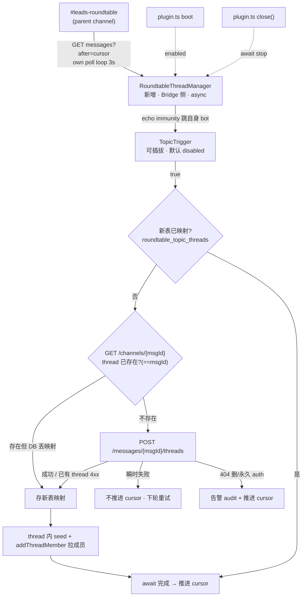

# Plan: Roundtable Per-Topic Auto-Thread (Phase 1) — FLY-314

**Version**: v1.54.0 (草稿 — Codex design review 中;版本号 ship 时最终确认)
**Issue**: FLY-314 (Roundtable per-topic auto-thread — auto-create a thread when a topic / cross-lead discussion starts in #leads-roundtable)
**Date**: 2026-06-22
**Source**: FLY-314 issue description (Annie vision 2026-06-17)、brainstorm gate(2026-06-22,flywheel-eng-lead 批准分期 + listener 放 Bridge)
**Status**: codex-approved (rev 3 — Codex R1 八项全采纳;R2 APPROVED + 3 条 impl note 已并入)
**Related**: FLY-91 / FLY-162 (per-issue chat-thread pattern)、FLY-267 (Codex Lead roundtable participation + mention-gate)、FLY-292 / FLY-369 (chat-thread auto-archive)、FLY-282 (roundtable allowBots registry)、FLY-224 (RestPoll inbound + 持久 cursor)

---

## 0. 摘要 (Executive Summary)

把 FLY-91 的「per-issue Bridge 自动开 chat thread」思路延伸到 `#leads-roundtable`:**一个 topic 进来 → Bridge 自动从那条消息开一个 thread → 把相关 Lead 拉进 thread 成员**。目标(Annie 原话):跨 Lead 事件按 thread 归档,当天回看清爽,像 per-issue chat thread 那样。

**brainstorm gate 已拍板**(flywheel-eng-lead,2026-06-22):分期同意(Phase 1 = 开 thread + 拉成员;Phase 2 = reply-in-thread 路由,后做);listener 放 Bridge;**trigger 语义 = Annie 的 product 决策**,本 Plan 把 trigger 做成可插拔(config 选策略 + 默认 `disabled`),Annie 拍后只改 config。

**Annie 拍了 trigger = T2 `any_top_level`**(2026-06-22,Lead relay):roundtable 没闲聊、**每条顶层发言(非 thread 内回复)= 一个 topic → 自动开 thread**;后续讨论在那 thread 里回。成员 = **该消息 @ 到的 Lead**(∪ 任何 config 基础成员如 founder 归档可见性;剔除 poller 自身 bot)。代码 `any_top_level` 已就位 + 成员改为「@-mentioned ∪ config base」;**code 默认仍 `disabled`(字节兼容红线)**,ops deploy 时设 `FLYWHEEL_ROUNDTABLE_TRIGGER_MODE=any_top_level`。轮询只看父频道,thread 内回复天然不触发(子频道不被 poll)→ 「顶层=topic」自然成立。

**字节兼容红线**:整个 feature 由 `FLYWHEEL_ROUNDTABLE_ENABLED` 门控,默认 **OFF**。不开 = 多一个不启动的 poller,Bridge 行为零变化。merge 安全,deploy 后 ops 按 Annie trigger 决策 flip config。

**rev 2 关键修订(Codex R1 八项)**:① **不复用 RestPollDiscordInboundSource**(其 `onMessage` 是同步 `=>boolean`,cursor 同步推进,塞不进异步 create/store)→ 写一个**专用 Bridge poller**,await create+store 后再推进 cursor;**零触碰 Mufasa 生产入站路径**。② **不复用 `chat_threads` 表**(它被 reverse-lookup `/api/chat-threads/by-thread` + reply-guard 当 issue-thread 语义)→ **新表 `roundtable_topic_threads`**。③ 用 Discord「从消息开 thread → threadId == 源消息 id」做**崩溃恢复不变式**。④ **失败分类**(瞬时重试不推进 cursor / 永久 auth 大声告警后推进 / 404 no-op / 重复 thread 走恢复)。⑤ `broadcast` 用 `mention_everyone` 布尔(专用 poller 自控字段映射)。⑥ boot/close 接线对齐 `plugin.ts`,env 解析可测,cursor path 展开 `~`。⑦ 文档化 enabled-but-disabled 的 cursor 行为(无回填)。⑧ 测试钉死风险契约。

---

## 1. 背景 + 代码现状审计(已逐文件核对)

| 机制 | 位置 | 关键事实 |
|------|------|----------|
| per-issue thread | `bridge/ChatThreadCreator.ts` (FLY-91/162) | 先发消息 → `POST /channels/{ch}/messages/{msgId}/threads` 从消息开 thread → `upsertChatThread` 存映射 → `addThreadMember` 拉 owner;`inflight` Map 去并发重;`validateThreadExists` 处 404;`allowed_mentions:{parse:[]}`;5s AbortController。 |
| thread 持久化 | `StateStore.ts` `chat_threads` (PK=thread_id, UNIQUE(issue_id,channel_id)) | **是 issue-thread 映射,不是通用 thread 注册表**:`getChatThreadByThreadId` 返 `issue_id`;`/api/chat-threads/by-thread/:threadId`(`bridge/tools.ts`)返 `issueId` 且 `getSessionByIssue(issue_id)`;reply-guard 把任何注册 thread id 归类 `"issue-thread"`(`tools.ts` + `reply-guard.ts`)。→ **合成 issue_id 会泄漏成假 issue-thread**,故本 Plan 用新表。 |
| auto-archive | `bridge/done-thread-archiver.ts` (FLY-369) + `chat-thread-utils.ts archiveChatThread` (FLY-292) | close-driven,按 issue + chatChannel 解 thread;roundtable topic 无 session → 不被这条碰。 |
| roundtable 入站(Codex Lead) | `lead-backends/codex/RestPollDiscordInboundSource.ts` (FLY-224/267) | 每个 Lead 自己 REST 轮询静态 `channelIds`;`onMessage` 是**同步** `(msg)=>boolean`,`deliver()` 用该 boolean **同步**决定 cursor 是否推进(at-least-once);`RawDiscordMessage` 只映射 `id/channel_id/content/author/mentions`(**无 `mention_everyone`/role**)。Mufasa 生产唯一消费者 → **本 Plan 不动它**。 |
| 持久 cursor | `lead-backends/codex/InboundCursorStore.ts` `FileInboundCursorStore` | 可独立复用;**不展开 `~`**(传入需绝对路径)。 |
| 长跑服务接线 | `bridge/plugin.ts` boot + `close()` | `FleetPoller/GatePoller/HeartbeatService/LeadWatchdog/idleWatchdog` boot 里 `new...;.start()`;**`close()` 里逐个显式 stop**(非 cleanupFns 数组)。 |

**两个决定形状的事实**:① Bridge 当前不监听 roundtable —— 新建中央 poller。② Discord thread 是独立子 channel(type 10/11/12,自有 id),`GET /channels/{id}/messages` 只取该 channel id 的消息 → 只轮询父频道**看不到** thread 内消息 → reply-in-thread 是跨 backend 重活 → **Phase 2**。

---

## 2. 范围

**In(Phase 1)**:Bridge 侧**专用** `RoundtableThreadManager`(自有 async poll loop,复用 `FileInboundCursorStore`)→ 按可插拔 trigger 判 topic → 从该消息开 thread(threadId==msgId 恢复不变式)→ 拉配置成员 → 存**新表** + 失败分类 + 重启安全 + boot/close 接线 + 默认 OFF;单元 + mock-fetch 集成测试。

**Out(Phase 2/非目标)**:reply-in-thread 路由;topic thread 主动 archive 自动化(Phase 1 靠 Discord 原生 `auto_archive_duration`);从 allowBots registry 自动推导成员。

---

## 3. 设计

### 3.1 组件总览



### 3.2 配置(env,默认 OFF)

roundtable 跨项目 → Bridge 级 env(`FLYWHEEL_*` 风格),不放 per-project `ProjectConfig`。解析放**可测的纯函数** `loadRoundtableConfig(env)`(返 `RoundtableConfig | undefined`)。

| env | 含义 | 默认 |
|-----|------|------|
| `FLYWHEEL_ROUNDTABLE_ENABLED` | 总开关(`1` 才构造 + start poller) | `0`(OFF) |
| `FLYWHEEL_ROUNDTABLE_CHANNEL_ID` | roundtable 频道 id | — |
| `FLYWHEEL_ROUNDTABLE_BOT_TOKEN_ENV` | 所用 bot token 的 **env 变量名**(token 不入 JSON;建议 CoS/Aunt Cass bot —— 本就在 roundtable) | — |
| `FLYWHEEL_ROUNDTABLE_BOT_USER_ID` | 该 bot 自己 user id(echo immunity) | — |
| `FLYWHEEL_ROUNDTABLE_TRIGGER_MODE` | trigger 策略(§3.3) | `disabled` |
| `FLYWHEEL_ROUNDTABLE_TRIGGER_PREFIXES` | `explicit_prefix` 逗号分隔 | `📋,TOPIC:` |
| `FLYWHEEL_ROUNDTABLE_MIN_MENTIONS` | `broadcast` | `2` |
| `FLYWHEEL_ROUNDTABLE_LEAD_USER_IDS` | `any_lead_mention`:哪些 user id 算 Lead | — |
| `FLYWHEEL_ROUNDTABLE_THREAD_OWN_BOT` | `1` = 放宽 echo:poller bot 自己的 top-level 也开 thread(poller=CoS 且要它广播也 thread 时设;安全,manager 不在父频道发 top-level、seed 在子 thread 不被 poll、无环) | `0`(echo immunity ON) |
| `FLYWHEEL_ROUNDTABLE_MEMBER_USER_IDS` | 开 thread 后拉进成员的 user id(Lead bot + 可含 founder) | — |
| `FLYWHEEL_ROUNDTABLE_POLL_INTERVAL_MS` | 轮询间隔 | `3000` |
| `FLYWHEEL_ROUNDTABLE_INBOUND_CURSOR_PATH` | 持久 cursor 文件(**解析时展开 `~`** → 绝对路径再交 `FileInboundCursorStore`) | `~/.flywheel/roundtable-inbound-cursor.json` |

**校验**:`enabled=1` 时 `channelId` / 解析出的 token / `botUserId` 必填,缺则 **fail-loud throw**(不静默跑残缺 poller)。token 经 env-name 解析,日志只 `redactSecret`。

### 3.3 Trigger 抽象(可插拔决策点 — 留给 Annie)

```ts
export type RoundtableTriggerMode =
  | "disabled"          // 默认:poller 在跑但永不开 thread(等 Annie;见 §3.9 行为说明)
  | "explicit_prefix"   // T1:content 以约定前缀开头
  | "any_lead_mention"  // Lead 给 Annie 的微调:@ 到任一 leadUserIds 就开(命中 CoS广播 + Lead↔Lead)
  | "broadcast"         // T3:mentionEveryone 或 mentions.length >= minMentions
  | "any_top_level";    // T2:任何顶层非自身消息

export interface RoundtableTriggerConfig { mode: RoundtableTriggerMode; prefixes?: string[]; minMentions?: number; leadUserIds?: string[]; }
/** 纯函数,无副作用。返回 (msg: RoundtableMessage) => boolean。 */
export function buildTopicTrigger(cfg: RoundtableTriggerConfig): (msg: RoundtableMessage) => boolean;
```

- 默认 `disabled` = 即便 enabled 也不开 thread → merge/deploy 安全;Annie 拍后改 env `_TRIGGER_MODE`,**零代码改动**。
- `broadcast` 用 **`mentionEveryone` 布尔 + `mentions` 数组**(专用 poller 映射,§3.4),**不**靠 content 扫 `@everyone`(Codex R1#5)。
- 所有策略调用前 manager 已做 echo immunity(跳 `botUserId` 自身);sibling Lead(也是 bot)仍是合法 topic 作者。seed 消息发在子 thread channel,父频道 poll 不会重复消费(FLY-220 bot-loop:poller bot 不在 roundtable 顶层发言)。

### 3.4 RoundtableThreadManager(新增 · `bridge/roundtable-thread-manager.ts`)

**专用 async poll loop**(不经 `RestPollDiscordInboundSource` 的同步 `=>boolean` 契约;复用 `FileInboundCursorStore` + 同样的 Discord REST 形状):

```ts
interface RoundtableMessage { id: string; channelId: string; authorId: string; authorBot: boolean; content: string; mentions: string[]; mentionEveryone: boolean; }

export class RoundtableThreadManager {
  constructor(opts: { store: StateStore; channelId: string; botToken: string; botUserId: string;
    trigger: (m: RoundtableMessage) => boolean; memberUserIds: string[]; triggerMode: RoundtableTriggerMode;
    cursorStore: InboundCursorStore; fetchImpl?: typeof fetch; pollIntervalMs?: number;
    setTimer?: (fn: () => void, ms: number) => { cancel: () => void };
    now?: () => number; sleepImpl?: (ms: number) => Promise<void>; });
  start(): Promise<void>;  // baseline channel to latest (不回放历史) → schedule poll loop
  stop(): Promise<void>;   // cancel timer, await in-flight
}
```

**poll 周期**(单频道,oldest-first):`GET /channels/{channelId}/messages?after=<cursor>` → 逐条 `processMessage(m)` → **只在 await 完成且判定「可推进」后**才把 cursor 推到该条;遇到「瞬时失败 → 不推进 → break」让其与之后所有消息下轮重试(at-least-once,对齐 FLY-224 HIGH-4 语义)。

**`processMessage(m)` 判定**(返回 `advance: boolean`):

1. echo:`m.authorId === botUserId` → advance(no-op)。
2. trigger:`!trigger(m)` → advance(no-op)。`triggerMode === "disabled"` 时 trigger 恒 false → 全 advance(见 §3.9)。
3. 去重:`store.getRoundtableTopicThread(channelId, m.id)` 命中 → advance。
4. **崩溃恢复不变式(Codex R1#3)**:Discord「从消息开 thread」→ **threadId == 源 message id**,且一条消息只能有一个 thread。开 thread 前先 `GET /channels/{m.id}`:若已是该消息的 thread(parent==channelId,type∈{10,11,12})→ 说明此前 create 成功但 DB 映射丢失 → 直接 `upsert` 映射 + advance(**绝不开第二个**)。
5. 否则 `POST /channels/{channelId}/messages/{m.id}/threads`,body `{ name, auto_archive_duration: 4320 }`,5s AbortController,`allowed_mentions` N/A(开 thread 无 content)。**失败分类(Codex R1#4)**:
   - `2xx` → `store.upsertRoundtableTopicThread({threadId: m.id, channelId, sourceMessageId: m.id, authorId: m.authorId, triggerMode})` → seed + 成员 → advance。
   - 「已有 thread」类 `4xx`(如 400/409 thread exists)→ 走步骤4恢复(persist threadId==m.id)→ advance。
   - `404`(消息被删)→ advance no-op。
   - `401/403`(权限/token)→ **大声**:`console.warn("[RoundtableThreadManager] auth error ...")`(Bridge log = 运维面)→ advance(不 wedge 整条入站)。**不**走 `store.insertEvent`(`session_events` schema 强制 `execution_id/issue_id/project_name` 非空,roundtable 刻意非 issue/session-bound;Codex R2#1)。专用 ops alert 通道留 Phase 2(若需要)。
   - `429`(honor Retry-After,capped)/ `5xx` / 网络 / timeout → **瞬时**:不 advance,bounded backoff,下轮重试。
6. seed + 成员:thread 内贴 `🧵 Topic — relevant leads 在此讨论`(`allowed_mentions:{parse:[]}`),再对成员集逐个 `PUT /channels/{threadId}/thread-members/{userId}`(复用 §3.5 抽出的共享 `addThreadMember`)。**成员集(Annie T2 模型)= 该消息 `mentions`(@ 到的 Lead)∪ config `memberUserIds` 基础成员,剔除 poller 自身 bot id 去重**。seed/成员失败只 warn,不回退 advance(thread 已建+映射已存,属 best-effort 装饰)。

`inflight` 单频道顺序处理,天然无并发(单 loop);仍加 `running` 守卫防 stop 后回调。

### 3.5 持久化 — 新表(Codex R1#2,采纳)

**新建** `roundtable_topic_threads`(StateStore,`CREATE TABLE IF NOT EXISTS` + 幂等迁移),与 issue-thread 语义**完全隔离**,不被 reverse-lookup / reply-guard 误判:

```sql
CREATE TABLE IF NOT EXISTS roundtable_topic_threads (
  thread_id TEXT PRIMARY KEY,            -- == source_message_id (Discord 不变式)
  channel_id TEXT NOT NULL,
  source_message_id TEXT NOT NULL,
  author_id TEXT,
  trigger_mode TEXT,
  created_at TEXT DEFAULT (datetime('now')),
  discord_missing_at TEXT,
  archived_at TEXT
);
CREATE UNIQUE INDEX IF NOT EXISTS idx_roundtable_topic_msg ON roundtable_topic_threads(channel_id, source_message_id);
```

新 helpers:`upsertRoundtableTopicThread / getRoundtableTopicThread(channelId, sourceMessageId) / markRoundtableTopicThreadMissing(threadId)`(archive/missing 列为 Phase 2 预留,Phase 1 只写不消费)。

**共享重构**:把 ChatThreadCreator 的 private `addThreadMember` 抽到 `chat-thread-utils.ts` 成导出 `addThreadMember(threadId, userId, botToken, deps?)`,ChatThreadCreator 改调共享版(纯重构、行为不变、现有测试须仍绿)。

### 3.6 Discord API 细节

- 开 thread:`POST /channels/{channelId}/messages/{messageId}/threads` —— 从既有 topic 消息开(不先发新消息);**threadId == messageId**(恢复不变式)。
- 恢复探测:`GET /channels/{messageId}` 返 channel 对象;**主校验 `parent_id == roundtableChannelId`**(ownership),thread type 防御性按 repo 现状 `chat-thread-register.ts`:`10` announcement / `11` public / `12` private —— 普通文字频道里 start-from-message 预期 **public `11`**(Codex R2#2)。
- 拉成员:`PUT /channels/{threadId}/thread-members/{userId}`;单个 404/403 warn 不阻塞其余。
- 全部 5s AbortController;seed 消息 `allowed_mentions:{parse:[]}`。

### 3.7 Bridge 接线(`plugin.ts`,对齐现状 — Codex R1#6)

boot 里(config 校验后):
```ts
const rtCfg = loadRoundtableConfig(process.env);   // 纯函数,可测;enabled=0 → undefined
let roundtableThreadManager: RoundtableThreadManager | undefined;
if (rtCfg) {
  roundtableThreadManager = new RoundtableThreadManager({ store, ...rtCfg,
    cursorStore: new FileInboundCursorStore(rtCfg.cursorPath) }); // cursorPath 已展开 ~
  await roundtableThreadManager.start();
  console.log(`[Bridge] RoundtableThreadManager started — channel=${rtCfg.channelId}, trigger=${rtCfg.triggerMode}`);
}
```
`close()` 里(对齐现有逐服务显式 stop):`await roundtableThreadManager?.stop();`。未 enabled → 不构造,零开销零行为变化。

### 3.9 enabled-but-disabled 的运维语义(Codex R1#7,文档化)

`ENABLED=1` + `TRIGGER_MODE=disabled`:poller 启动 → baseline 到最新 → 每轮 trigger 恒 false → **推进 cursor 跳过所有消息**(不开 thread)。这是合法 canary 态(poller 活、零副作用)。**但**:之后 flip 到真 trigger **只对未来消息生效**,不回填此前跳过的消息(cursor 已越过)。文档明确:这是「未来生效」非「回溯回填」。ops flip trigger 即可,无需 reset cursor;若确需回填(极少)= 手动删 cursor 文件再重启(会从最新重新 baseline,仍不回放历史 —— 即真正无回填,符合预期)。

---

## 4. 测试计划(TDD — 钉死风险契约 Codex R1#8)

| 测试 | 覆盖 |
|------|------|
| `buildTopicTrigger` | 5 mode × 命中/不命中;`broadcast` 用 `mentionEveryone`/`mentions.length`;`disabled` 恒 false;echo 永不触发;malformed 不抛 |
| `loadRoundtableConfig` | enabled=0→undefined;enabled=1 缺必填→throw;`~` 展开;prefixes/minMentions/leadUserIds/memberUserIds 解析 |
| `RoundtableThreadManager` async durable-accept | trigger-true→**await create+store 完成后**才推进 cursor;瞬时失败→**不推进**→下轮重试同条;permanent auth→告警+推进;404→no-op 推进 |
| 崩溃恢复(严格顺序 Codex R2#3) | create 成功但 DB 写丢失 → 重启 **先 `GET /channels/{msgId}` 探测**命中既有 thread → 只 persist 映射、**断言不再发第二次 create**(证明 post-create/pre-store crash 不会永久丢映射) |
| 去重 | 同 source message 已映射 → no-op 推进 |
| 新表隔离 | `roundtable_topic_threads` 行**不**经 `/api/chat-threads/by-thread` / reply-guard 被当 issue-thread(断言两路径对 roundtable thread id 不返 issueId / 不归类 issue-thread) |
| seed + 成员 | seed 发送 `allowed_mentions:{parse:[]}`;逐成员 PUT;单个失败不阻塞;失败不回退 advance |
| boot/close | enabled=0→不构造、零 Discord 调用(字节兼容 sentinel);`close()` await stop |
| `addThreadMember` 重构回归 | ChatThreadCreator 现有测试仍绿 |

目标 80%+;mock 外部 Discord(无真网),真跑 deploy 后 QA 验。

## 5. 部署

merge = 字节兼容(默认 OFF)。deploy = Bridge 改动 → **founder-gated Bridge restart**(本 Plan 不自 merge / 不自 restart;PR-ready 报 Lead,Lead 核 blast-radius + Annie go)。deploy 后 ops 按 Annie 决策设 `ENABLED=1` + `_TRIGGER_MODE=any_top_level`(T2)+ channel/token/(可选)base member env,**再单次 Bridge restart 生效**(config boot 时读 —— FLY-205 ship 窗教训:补 config 后必再重启一次)。QA:真机在 #leads-roundtable 发命中 trigger 的 topic → 验证自动开 thread + 成员拉入 + 去重(同消息不重开)+ 重启不重开。

## 6. 风险 + 决策点

1. **失败语义**(Codex R1#4 已采纳):瞬时失败不推进 cursor(at-least-once,topic 不丢);永久 auth 告警后推进(不 wedge)。
2. **新表 vs 复用 chat_threads**:已采纳新表(隔离 reverse-lookup/reply-guard 语义)。
3. **trigger 语义** = Annie 拍(Lead relay);代码可插拔,任何选择零代码改动。
4. **崩溃恢复**:靠 threadId==msgId 不变式,绝不开重复 thread。
5. **成员权限**:拉成员需 bot 权限;失败逐个 warn 不阻塞(Phase 1 成员 = founder 归档可见性 + 为 Phase 2 铺路)。
6. **不动 Mufasa 入站路径**:专用 poller 隔离,零 blast radius 到 FLY-224/267 生产 RestPoll。
7. **Phase 2 依赖**:reply-in-thread 不在本期;Phase 1 交付「thread 存在 + 成员就位 + 归档价值」,Lead 已确认可接受的分期。

## 7. 非目标(重申)

reply-in-thread 路由、topic thread 主动 archive 自动化、从 registry 自动推导成员 —— 全部 Phase 2 / 后续 issue。
