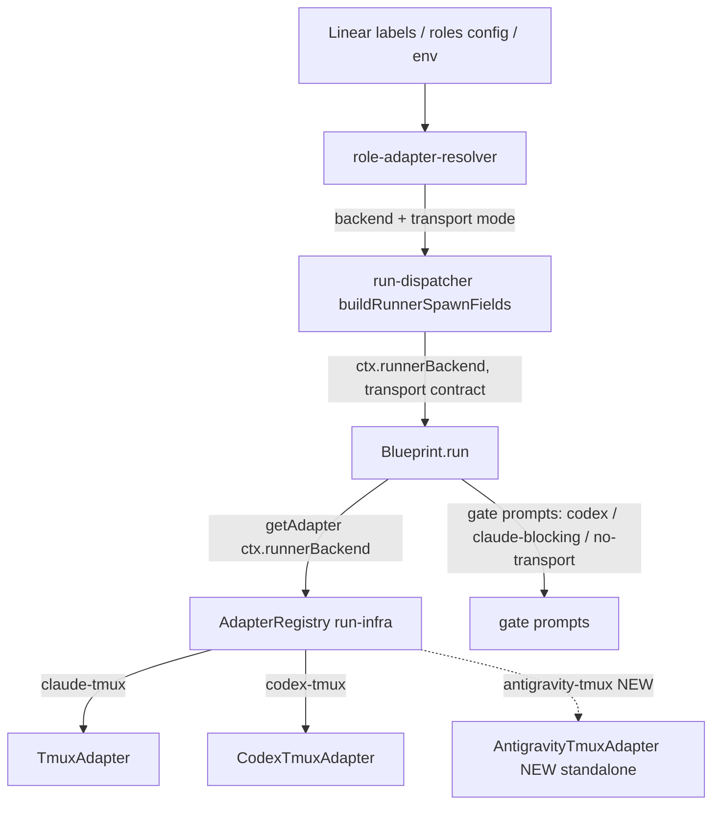

# Plan: Antigravity (agy) as a first-class Runner CLI backend

**Version**: v1.54.0
**Issue**: FLY-493
**Date**: 2026-06-22
**Source**: brainstorm gate (Tadashi approved, 06dfd762); FLY-349 engine agy reference (`scripts/fly349-engine/run.py`); Codex design review R1–R4
**Status**: codex-approved (4 rounds)

---

## 1. Problem & Goal

Flywheel Runners today resolve to exactly two executor backends: `claude-tmux`
(production default) and `codex-tmux`. Annie wants the Runner CLI layer to be
**agent-agnostic** — any capable agentic CLI should be a first-class Runner
backend. This issue adds **Antigravity** (`agy`) as the third backend.

**Goal**: a Runner can be routed to `agy` (via label / project config / env),
spawning an `agy` interactive tmux session that onboards, brainstorms (gated),
implements (TDD), and opens a PR — first-class like Claude/Codex for the
**build+PR** lifecycle. **Byte-compat default**: nothing configured ⇒ still
`claude-tmux`.

## 2. Research findings (agy CLI)

`agy` = Antigravity CLI, ~147MB Go binary at `~/.local/bin/agy`, app at
`/Applications/Antigravity.app`, config dir `~/.antigravity`. **Claude-Code-class
agentic CLI**, NOT a thin wrapper:

- Flags mirror Claude Code: `--print`/`-p`/`--prompt`, `--prompt-interactive`/`-i`
  (run an initial prompt + continue the session), `--continue`/`-c`,
  `--conversation <id>`, `--model`, `--dangerously-skip-permissions`,
  `--add-dir <dir>` (repeatable), `--sandbox`, `--print-timeout` (default 5m),
  `--log-file`.
- Models (`agy models`): Gemini 3.5 Flash, Gemini 3.1 Pro, Claude Sonnet/Opus
  4.6 (Thinking), GPT-OSS 120B. `--model` takes a slug, e.g. `gemini-3.1-pro`.
- MCP: supports `mcpServers` in `settings.json` (Claude-Code-like schema).
- Auth: signed in via the Antigravity app; `-p` returns clean stdout. Failure
  strings: "Authentication required" / "Please sign in". FLY-349 spike showed agy
  auth needed real probing (first token check failed, OAuth/Keychain then 5/5).
- FLY-349 reference: `agy --model gemini-3.1-pro --dangerously-skip-permissions
  -p "<prompt>"`, cwd=workdir, PATH prepends `~/.local/bin`.

**Conclusion**: agy maps to `claude-tmux` (interactive tmux, blocking-capable),
NOT `codex-tmux`. It can sit in a blocking `flywheel-comm gate` call and poll
comm.db like claude.

## 3. Architecture map

Completion / gate / stage signalling is **vendor-neutral**: the Runner runs
`flywheel-comm` → comm.db, adapter polls comm.db. No agy change needed there.

## 4. Scope (precise) + v1 lifecycle contract

### 4.1 In scope — the TeamLead dispatcher path only
FLY-493 adds antigravity to the **TeamLead `/api/runs/start` dispatcher** path
(the self-hosting Flywheel flow: run-dispatcher → Blueprint → AdapterRegistry).

**Out of scope (declared, not forgotten):** the legacy EdgeWorker `agentSession`
path (`RunnerSelectionService` 4-agent union; `EdgeWorker.ts:2929-2934` /
`5608-5613` reject non-Claude). `[agent=agy]` is NOT wired into that Cyrus-style
direct-Linear-webhook path in v1. We update the `runner-label.ts` "mirror"
comment so a maintainer does not assume full EdgeWorker parity.

### 4.2 v1 transport = none (brainstorm-gate approved), made first-class
agy has no claude-code Agent Team, so v1 antigravity Runners spawn **without a
transport**. Per Codex R1 #3, "no transport" is a **first-class, explicit
contract**, NOT an overloaded `undefined`:

- Resolver returns an explicit transport mode: `"claude-code" | "codex" | "none"`
  (antigravity → `"none"`). Distinct from the legacy "vendor absent ⇒ default
  claude" meaning.
- `buildRunnerSpawnFields` omits `vendor`/`runnerAgentName`/`agentTeamName` for
  `"none"` **intentionally** (documented), and sets an explicit
  `runnerTransportMode: "none"` on the BlueprintContext.
- Wake-path tests assert a no-transport backend does NOT silently route through
  the env-default claude mailbox.

### 4.3 v1 = build+PR backend with a NEW `pr_handoff` terminal route (Codex R1 #1 + R2 #1/#2)

**Why the review/approve loop is wrong for no-transport (Codex R2 #1).** The
existing lifecycle is fundamentally wake-dependent end to end:
- `approve_to_ship` is unconditional non-blocking and assumes a mailbox wake
  (`Blueprint.ts:774-808`; `gate.ts:30-39`).
- `approveExecution` always transitions `awaiting_review → approved_to_ship`,
  patches stage to `ship`, and calls `sendRunnerWake`
  (`actions.ts:312-360,389-400`).
- `approved_to_ship` is **non-terminal** (`StateStore.ts:19-25`,
  `workflow-fsm.ts:144`) — the FSM expects a later `completed` driven by a
  Runner that posts `:cool:`, then rewrites `land-status` to `merged`.
- Post-ship finalization is **merge-evidence-gated**
  (`post-ship-finalization.ts:68-80`); `ready_to_merge` is not enough. The
  `session_completed` that carries merge evidence is emitted by the **Runner**
  after it is woken (`event-route.ts:574-584`).

So if an antigravity Runner enters `awaiting_review`, a founder approve would
move it to `approved_to_ship` and then **nothing ships and nothing finalizes** —
there is no Runner to wake, post `:cool:`, or emit the merged completion. That
is a guaranteed strand. Reusing the loop would require a Bridge-side ship actor
(post `:cool:` + detect merge + finalize) — high blast radius on the most
sensitive, founder-gated code, and unnecessary for v1.

**v1 design (B): antigravity NEVER enters the review/approve loop.** It runs the
full build lifecycle (onboard → brainstorm[blocking gate] → implement[TDD] → PR)
then completes to a **new, explicit terminal route `pr_handoff`** that means
"Runner built and opened a PR; the founder-gated ship is a separate human step."
This is the honest shape of a Runner that cannot be woken, and it touches
**completion** code only — never `approveExecution` / `sendRunnerWake` /
founder-consent / `verify-approval` / `post-ship-finalization`.

`pr_handoff` semantics (modeled on the existing `no_code` terminal precedent,
`event-route.ts:599`, but PR-aware): `running → completed`, requires a PR
(records PR number/url + landing `ready_to_merge`), **no merge evidence
required**, and does **not** enter `awaiting_review`/`approved_to_ship`. The
session is terminal `completed` ("Runner work done"); the PR-open / human-ship-
pending fact is carried in the completion summary + `ready_to_merge` landing
signal so the dashboard/Lead is not misled into thinking it is merged.

**No-transport finish prompt** (Blueprint, branched on `runnerTransportMode ===
"none"`): open PR → report it to the Lead via `flywheel-comm ask` ("DONE: PR
<url> ready for human ship") → write `land-status`
`{"status":"ready_to_merge","prNumber":<N>}` at `FLYWHEEL_LAND_STATUS_PATH` →
`flywheel-comm complete --route pr_handoff --pr <N>` → STOP. Explicit text: "This
backend has **no push-wake**. Do NOT post an approve gate, do NOT wait to be
woken. Your build+PR work is complete; the founder drives the founder-gated
ship." The founder/Lead reviews the PR and ships it through the normal founder
mechanism, independent of the Runner-review machinery.

**Defense-in-depth (Codex R2 #1, persist + wake-guard).** Even though design (B)
never invokes the approve/wake path, we still (a) **persist** the resolved
executor backend + transport mode on the session (so the dashboard/observability
and any future generic wake can see it) and (b) add a **wake-guard**:
`sendRunnerWake` skips and records honest `no_transport_no_wake` telemetry for a
persisted no-transport session instead of routing to the env-default claude
mailbox — so a no-transport session can never emit a misleading wake-success
even if some other surface tries to wake it.

> **Full review→approve→auto-ship loop for antigravity = approved follow-up
> issue** (requires mailbox push-wake OR a Bridge-side ship actor + merge-detect
> finalizer). v1 deliberately stops at `pr_handoff`.

## 5. Changes (by layer)

### 5.1 Config types — `packages/config/src/types.ts`
- `ExecutorBackend`: add `"antigravity-tmux"`.
- `EXECUTOR_BACKENDS`: append `"antigravity-tmux"`.

### 5.2 Config validation — `packages/config/src/ConfigLoader.ts` (Codex R1 #6)
- **Derive** `validBackends` from the exported `EXECUTOR_BACKENDS` (remove the
  parallel hardcoded set so the two lists can't drift). Keep the same error
  message shape.

### 5.3 Label parsing — `packages/config/src/runner-label.ts` (Codex R1 #5)
- `RunnerVendorType`: add `"antigravity"`.
- `resolveRunnerTypeFromLabels`: labels `antigravity` and `agy` ⇒
  `"antigravity"`.
- Leave `inferRunnerTypeFromModel` untouched (agy's model slugs overlap
  claude/gemini — must not be hijacked).
- Update the file's "mirror of RunnerSelectionService" comment to state that
  antigravity is wired for the **TeamLead dispatcher path only** (§4.1).

### 5.4 Resolver — `packages/teamlead/src/bridge/role-adapter-resolver.ts`
- `EXECUTOR_TO_TRANSPORT`: value type `TransportBackend | "none"`; map
  `"antigravity-tmux": "none"`. claude/codex unchanged.
- `ResolvedRoleAdapter`: add explicit `transport: TransportBackend | "none"`
  (keep `vendor?: TransportBackend` for the two transported backends; antigravity
  sets `transport: "none"`, no `vendor`).
- `VENDOR_TO_EXECUTOR`: add `antigravity: "antigravity-tmux"`.
- `parseEnvBackend`: accept `"antigravity-tmux"` + `agy`/`antigravity` aliases;
  add them to the warn message's supported list.

### 5.5 Dispatcher — `packages/teamlead/src/bridge/run-dispatcher.ts`
- `buildRunnerSpawnFields`: when `resolved.transport === "none"`, return only
  `runnerBackend` (+`runnerModel`) **and** set `runnerTransportMode: "none"` —
  documented as an intentional no-transport backend, not legacy absence. claude/
  codex keep `vendor`/`runnerAgentName`/`agentTeamName` (byte-identical).
- Update the return `Pick<BlueprintContext, ...>` to include
  `runnerTransportMode`.

### 5.6 BlueprintContext + no-transport finish prompt (Codex R2 #3 — correct file)
- Add explicit `runnerTransportMode?: "none"` to the **real `BlueprintContext`**
  in `packages/edge-worker/src/Blueprint.ts:100-210` (NOT
  `adapter-types.ts`/`AdapterExecutionContext`). Absent ⇒ existing behavior.
- Separately, update the `AdapterExecutionContext.vendor` comment
  (`adapter-types.ts:218-235`) so "absent" no longer implies only legacy/
  backward-compat transport omission (Codex R2 #3). Only thread
  `runnerTransportMode` into `AdapterExecutionContext` if the standalone adapter
  actually consumes it (it does not need to — the branch is Blueprint-side).
- Blueprint procedure for `runnerTransportMode === "none"`: emit the §4.3
  no-transport finish prompt (PR → report to Lead → land-status `ready_to_merge`
  → `complete --route pr_handoff --pr <N>` → STOP). It does NOT emit the
  `approve_to_ship` gate. brainstorm/question/generic gates: antigravity (no
  `vendor`, `runnerTransportMode: "none"`, not codex) already takes the
  **blocking** claude branch — unchanged.

### 5.6a Persist backend + transport mode (Codex R2 #1)
- `ExecutionEventEmitter.emitStarted` `session_started` payload
  (`ExecutionEventEmitter.ts:53-66`): add `runnerBackend` +
  `runnerTransportMode`. Persist onto the session (StateStore session metadata /
  sessionParams) at the Bridge `session_started` handler so approval/wake/
  dashboard surfaces can read it. Absent ⇒ legacy claude (byte-compat).

### 5.6b New `pr_handoff` completion route — mirrored across ALL sinks (Codex R3 #1/#2/#3)
There are **multiple completion producers/sinks** that must ALL agree on the new
route, or the session can fall back to `needs_review`/`awaiting_review` (the
strand) or quarantine a valid marker. Wire `pr_handoff` like `no_code` + PR
evidence in every one:

- **`complete.ts`** (CLI producer, fail-closed evidence — Codex R3 #3): add
  `pr_handoff` to `VALID_ROUTES`; REQUIRE `--pr`; REJECT `--merged`; emit
  `landingStatus: {status:"ready_to_merge", prNumber}` directly (or read +
  VALIDATE `FLYWHEEL_LAND_STATUS_PATH`, asserting the file `prNumber` matches
  `--pr` — fail loud, never complete without evidence).
- **Blueprint / DecisionLayer** (the SECOND producer — Codex R3 #1, the
  blocker): `DecisionLayer.ts:47-56` maps `landingStatus.status ===
  "ready_to_merge"` → `route: "needs_review"`. For `runnerTransportMode ===
  "none"` + `ready_to_merge`, Blueprint must produce a **`pr_handoff`** decision
  itself so the DirectEventSink emission agrees with the CLI emission (never
  `needs_review`). Both producers → `decision.route === "pr_handoff"` + same PR/
  landing evidence.
- **`event-route.ts`** (HTTP `/events` sink): recognize `pr_handoff` in its
  `VALID_ROUTES` (~595-626); terminalize ONLY from `running` (like `no_code`);
  map → `completed`; record PR/landing evidence; never set review binding.
- **`DirectEventSink.ts`** (in-process sink): add the same `running`-only guard
  + mapping (235-248, 269-310); do NOT let the unknown-route `completed`
  fallback (303-304) silently handle `pr_handoff` from a non-running state —
  explicit guard.
- **`complete-marker-reconciler.ts`** (fail-close marker replay): add
  `pr_handoff` to its `VALID_ROUTES` (73-81) and status predictor (156-194):
  expected `completed` from `running`, `null` from non-running. Without this a
  valid `complete --route pr_handoff` marker is quarantined instead of
  reconciled.

Net: `running → completed`, never `awaiting_review`/`approved_to_ship`, no merge
evidence required; completion summary states "PR <url> open — founder ship
pending".

### 5.6c Wake-guard for no-transport (Codex R2 #1 defense-in-depth)
- `packages/teamlead/src/bridge/runner-wake.ts` `sendRunnerWake`: if the session
  is persisted no-transport, skip the mailbox send and record honest
  `no_transport_no_wake` telemetry instead of routing to the env-default claude
  mailbox (`runner-wake.ts:83-121`). (design (B) never reaches this on the happy
  path, but it guarantees no misleading wake-success from any surface.)

### 5.7 Adapter — `packages/claude-runner/` (Codex R1 #2)
**IMPLEMENTED via the test-protected EXTRACTION option (not the literal
"standalone, zero-touch").** Codex R1 #2 offered two EQUAL options — standalone OR
"make the extraction complete and test-protected". The real `TmuxAdapter` is
~1020 lines, so a fully-duplicated standalone would be ~600 lines of error-prone
copy. Instead `TmuxAdapter` now exposes the vendor-specific points as overridable
seams — `type`, `protected binaryName` (default "claude"), `protected
runPreflight()`, `protected buildCliArgs()` (default delegates to the private
`buildClaudeArgs`), and the tmux launch command uses `this.binaryName` in BOTH
the gateway `exec` snippet and the direct `[binary, ...args]` form. The claude
output is **byte-identical** (default seam values unchanged) and PROVEN by the
ENTIRE `TmuxAdapter.test.ts` suite passing green (79 tests, incl. the pinned
launch-string + real-sh-gate tests). `AntigravityTmuxAdapter extends TmuxAdapter`
overrides only the seams, reusing all the vendor-neutral poll/dynamic-timeout/
heartbeat/comm.db machinery with NO duplication. Differences captured in the
subclass:
- `readonly type = "antigravity-tmux"`.
- preflight: resolve `agy` on PATH (PATH must include `~/.local/bin`).
- launch command: `agy` (not `exec claude`/`["claude", ...]`).
- arg builder (`buildAgyArgs`): `["--model", model?,
  "--dangerously-skip-permissions", "--add-dir", worktree, "-i",
  <bootstrapPrompt>]`. NO claude-only flags (`--session-id`, `--permission-mode`,
  `--append-system-prompt-file`, `--allowed-tools`, `--name`).
- **System+task prompt**: agy has no `--append-system-prompt`. Write the combined
  (system + task) prompt to a 0600 per-execution tmpdir file (same pattern as
  TmuxAdapter), launch agy with a SHORT `-i` bootstrap: "Read and follow the
  instructions in `<path>` exactly, then begin." (keeps argv small; avoids the
  FLY-154 tmux `command too long` overflow). **Acceptance gate (§7)**: confirm
  the smallest-argv mechanism empirically (stdin vs file-bootstrap) — file
  bootstrap is the safe fallback.
- **Auth preflight is FAIL-CLOSED** (Codex R1 #4): before declaring the session
  ready, a cheap non-mutating `agy -p` probe; on "Authentication required"/"Please
  sign in"/empty, fail LOUD (surface in pane + mark the run failed), never
  silent.
- **vendor-neutral poll loop**: completion/dynamic-timeout/heartbeat machinery is
  duplicated into the standalone class for v1 (acceptable; isolates claude). A
  follow-up may DRY shared helpers — explicitly noted, not silently skipped.
- **MCP**: write an agy `settings.json` with the same flywheel-tools + Linear
  `mcpServers` the claude Runner gets, at agy's discovered settings location.
  **Acceptance gate (§7)**: verify settings.json discovery before claiming MCP
  parity. If it can't be wired cleanly in v1, **MCP is explicitly deferred** and
  the documented v1 capability envelope is **flywheel-comm + git + gh + local
  shell only** (sufficient for build+PR) — stated, not silently dropped.
- Export `AntigravityTmuxAdapter` from `packages/claude-runner/src/index.ts`.

### 5.8 Registry — `packages/teamlead/src/bridge/run-infra.ts`
- Import + `adapterRegistry.registerFactory("antigravity-tmux", () => new
  AntigravityTmuxAdapter(tmuxSessionName, undefined, 5000, sessionTimeoutMs,
  hookServer))` — **no transport arg**. Default stays `claude-tmux`.

### 5.9 Security posture (Codex R1 #4)
`--dangerously-skip-permissions` mirrors the unattended claude tmux Runner
(which also runs without interactive approval). It is the **parity** choice but a
real security decision: agy runs on worktrees with issue text, git, gh, shell.
v1 makes the permission mode **config-gated** — `--dangerously-skip-permissions`
default (parity), with `--sandbox` available as an opt-in hardening. Flag this
posture explicitly to the Lead/founder at PR time; do not assume.

### 5.10 Docs + version
- `doc/VERSION` → 1.54.0 (re-version at ship if the train shifts).
- CLAUDE.md milestone + MEMORY.md index. Plan draft→new→inprogress→archive.
- Follow-up issue: antigravity mailbox push-wake + auto-ship (+ MCP parity if
  deferred + EdgeWorker label parity if wanted).

## 6. TDD test plan (RED → GREEN)

- **runner-label**: `antigravity`/`agy` ⇒ `runnerType: "antigravity"`; others
  unaffected (byte-compat).
- **types/ConfigLoader**: `roles.runner.backend: antigravity-tmux` validates;
  bogus rejected; **regression: every `EXECUTOR_BACKENDS` entry validates** (the
  derive-from-source guard, Codex R1 #6).
- **role-adapter-resolver**: label `antigravity`/`agy` ⇒ `backend:
  antigravity-tmux`, `transport: "none"`, no `vendor`;
  `FLYWHEEL_RUNNER_BACKEND=antigravity-tmux|agy` ⇒ same; precedence label>roles>
  env>builtin-claude; claude/codex resolutions **byte-identical**.
- **run-dispatcher** `buildRunnerSpawnFields`: antigravity ⇒ only `runnerBackend`
  (+model) + `runnerTransportMode: "none"`, **no** vendor/agent-team identity
  even with mailbox mode + leadId present (Codex R1 #3 explicit test);
  claude/codex unchanged.
- **persistence** (Codex R2 #1): `session_started` carries `runnerBackend` +
  `runnerTransportMode`; the Bridge persists them; a no-transport session is
  readable by approval/wake/dashboard surfaces.
- **wake-guard** (Codex R2 #1): `sendRunnerWake` on a persisted no-transport
  session SKIPS the send + records `no_transport_no_wake`; does NOT route to the
  env-default claude mailbox (assert no default-mailbox write).
- **Blueprint** no-transport procedure: `runnerTransportMode: "none"` ⇒
  pr_handoff finish prompt (no `approve_to_ship` gate, no "you will be woken"
  text; emits `ready_to_merge` + `complete --route pr_handoff`); claude/codex
  branches unchanged.
- **`pr_handoff` across ALL sinks** (Codex R3 #1/#2/#3):
  - `complete.ts`: `pr_handoff` requires `--pr`, rejects `--merged`, emits
    `landingStatus {status:ready_to_merge, prNumber}`; land-status `prNumber`
    mismatch fails loud.
  - DecisionLayer/Blueprint: `runnerTransportMode:"none"` + `ready_to_merge` ⇒
    `decision.route === "pr_handoff"` (NOT `needs_review`).
  - event-route + DirectEventSink + complete-marker-reconciler: `pr_handoff`
    `running → completed` with PR/landing evidence; rejected/`null` from
    non-`running`; never sets review binding; unknown-route fallback does NOT
    handle it.
  - **race tests (both orderings)**: HTTP `pr_handoff` first then DirectEventSink
    duplicate; DirectEventSink `pr_handoff` first then HTTP duplicate / marker
    replay. Final state MUST be `completed` (never `awaiting_review`) with
    `decision_route=pr_handoff` + PR evidence intact. (Beside existing `no_code`
    tests: `event-route-session-completed-guard.test.ts`, `DirectEventSink.test.ts`,
    `complete-marker-reconciler.test.ts`.)
- **AntigravityTmuxAdapter**: `type === "antigravity-tmux"`; `buildAgyArgs` emits
  agy flags and **none** of the claude-only flags; preflight binary = agy;
  fail-closed auth probe path; uses the same land-status/evidence-collector path
  as TmuxAdapter so PR/landing evidence is intact. **TmuxAdapter (claude) tests
  untouched + green** (zero-touch isolation).
- **run-infra** registry: `antigravity-tmux` factory registered, default
  `claude-tmux`.

## 7. Acceptance gates (empirical — promoted from notes, Codex R1 #4)

Each must PASS before the backend is declared ready (fail-closed):
1. `agy` resolves on the actual Bridge PATH (`~/.local/bin`).
2. Auth verified by a cheap non-mutating `agy -p` probe before session-ready;
   failure fails loud, not silent.
3. Prompt bootstrap mechanism confirmed by a small interactive smoke (file-
   bootstrap fallback documented).
4. `settings.json` MCP discovery verified, OR MCP explicitly deferred with the
   v1 capability envelope (flywheel-comm + git + gh + shell) documented.
5. Real agy tmux spawn smoke (local, NOT prod Bridge): `agy` pane launches, runs
   the bootstrap, and `flywheel-comm stage set` lands in comm.db.
6. `pnpm -r build` + targeted vitest green; **full-repo `pnpm lint`** (biome)
   green before push (FLY-224/248 lesson). Codex code review.

## 8. Deploy (Lead + Annie owned — NOT this Runner)

Adding a backend to teamlead means the Bridge must restart to pick up the new
adapter (fleet-wide). PR-ready → report Tadashi → Tadashi checks blast-radius +
Annie go → founder-gated merge + restart. **This Runner does NOT self-merge or
self-restart the Bridge.**

## 9. Risks / non-goals

- **Non-goals (deferred follow-ups)**: antigravity mailbox push-wake + auto-ship;
  EdgeWorker legacy agentSession label parity; MCP parity if §7.4 defers it;
  DRY-ing the duplicated poll loop.
- **Risk**: agy prompt-injection + settings.json discovery are empirical → §7
  fail-closed acceptance gates with documented fallbacks so they cannot silently
  break the lifecycle.
- **Risk**: agy `--print-timeout` is for `-p`; confirm interactive `-i` has no
  short hard cap that kills a blocking gate (claude works the same way).
- **Risk (security)**: `--dangerously-skip-permissions` parity posture — §5.9,
  config-gated, flagged to founder.
- **Mitigated**: zero-touch TmuxAdapter ⇒ no claude-path regression risk.
