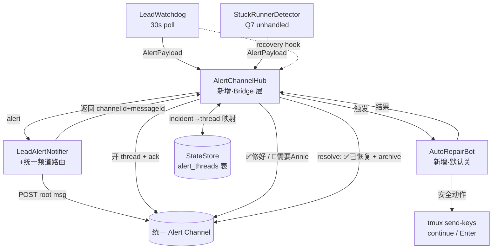

# Plan: Unified Alert Channel + Auto-Repair Bot + Per-Error Threading

**Version**: v1.55.0 (provisional — re-version at ship if other PRs land first)
**Issue**: FLY-368
**Date**: 2026-06-22
**Source**: `doc/engineer/exploration/` (none — brainstorm gate with Tadashi instead), FLY-368 Linear description
**Status**: codex-approved (Codex design review APPROVED after 3 rounds, 2026-06-22)

---

## 1. Problem & Goal

**Annie 的两个痛点 (2026-06-20):**

1. **alert 散落各 room** — Lead/Runner 卡住的告警分散在各 Lead 的频道(截图证据:`runner_stuck_unhandled` 落 Tadashi 频道、`pane_hash_stuck` 落 Rafiki 频道),Annie 得到处找。
2. **恢复靠手动** — 出问题得等她空了亲自修,中间耽误。

**想要(三块):**

1. **统一 Alert Channel** — 一个频道汇总所有 Lead/Runner 告警。
2. **自动修复 Bot(安全版)** — Bot 看到坏掉就 nudge / 尝试安全恢复,修好后在频道同步;只有修不好的才需 Annie。
3. **按错误开 thread** — 每条错误开一个 thread,Bot 先回「收到 ack」、修好回「✅ 已恢复」,频道里一眼看清「谁几点坏、几点修好」。

**本质** = 把 CoS(Aunt Cass)现在手动做的 fleet-recovery 自动化成 Bot + 统一频道 + 干净的 per-error 线索。

**与 FLY-271 的关系(分层,brainstorm gate 已确认):**

- **FLY-271** = 检测 + 真·自动恢复**引擎**(529/模型不可用/frozen pane 的重恢复,含必要时重启)。仍是 Backlog,本 issue 不抢、不重造。
- **FLY-368(本 issue)** = 引擎之上的**产品层**:统一频道 + per-error threading + Bot 汇报 + **保守 auto-fix**(只做安全可逆、且现在手动就在做的两个恢复动作)。

---

## 2. 现状审计(grounding)

| 机制 | 文件 | 作用 |
|------|------|------|
| LeadWatchdog | `packages/teamlead/src/LeadWatchdog.ts` | 30s 抓 Lead pane,classify → `rate_limit`/`usage_limit`/`login_expired`/`permission_blocked`/`pane_hash_stuck`;经 `notifier` 发告警;内部已检测**恢复**(`episodeKind` kind→null、或 pane 变 → Healthy)但**不发恢复信号** |
| RunnerIdleWatchdog | `packages/teamlead/src/RunnerIdleWatchdog.ts` | 30s 抓 runner pane,发 `runner_idle_detected`(给 Lead,非本 issue 的 alert) |
| StuckRunnerDetector | `packages/teamlead/src/bridge/stuck-runner-detector.ts` | runner 卡住 → `runner_stuck_escalation`(给 Lead);Lead 在 grace(300s)内不处置 → Q7 fallback `runner_stuck_unhandled` **经 LeadAlertNotifier 发** |
| **LeadAlertNotifier** | `packages/teamlead/src/LeadAlertNotifier.ts` | **Bridge 侧唯一告警出口**(LeadWatchdog + StuckRunnerDetector Q7 都走它)。`resolveChannel()` = `lead.alertChannel` ‖ (fallback) `project.generalChannel` → **这就是散落根因**。已有 claims.db 跨进程去重 + queue/dead-letter/meta-alert |
| recovery-nudge | `packages/teamlead/src/bridge/stuck-remanage-routes.ts` | **唯一**许可往卡住 runner 终端打字的路径:allowlist 仅 `continue` + 5 道闸(status 重读 running、无 pending gate、无 pending-review、fingerprint 仍匹配、有 idle input box)+ 每次尝试审计。底层 `sendKeysToWindow` / `getTmuxTargetFromCommDb`(`tmux-lookup.ts`) |
| chat threads | `chat-thread-register.ts` / `chat-thread-utils.ts` | per-issue Discord thread 的创建/校验/归档(`archiveChatThread`、`upsertChatThread`、`getChatThreadByThreadId`)。StateStore `chat_threads` 表 |
| StateStore | `StateStore.ts` | `tryClaimLeadEvent`(lead_events UNIQUE 去重)、`chat_threads` 表 + 迁移模式、`insertEvent` 审计 |

**关键结论:** `LeadAlertNotifier.alert()`(plugin.ts:2634 构造,LeadWatchdog `notifier` @2726、stuckDetector `notifier` @2673 都指向它)是所有「散落」告警的单一漏斗。在它这一层做统一路由 + 线索 + Bot,就能一次覆盖 Lead 与 Runner 两类告警,且天然满足 Lead 的 **Bridge-layer always-up** 要求(LeadAlertNotifier 是 Bridge 组件,不随 Lead 重启消失)。

---

## 3. 设计

### 3.0 架构总览



**三个独立 config 开关(都默认关 = 字节兼容):**

1. `FLYWHEEL_UNIFIED_ALERT_CHANNEL_ID`(+ `FLYWHEEL_ALERT_BOT_TOKEN_ENV`)— 不设 → 现状(per-lead 频道),零行为变化。
2. `FLYWHEEL_ALERT_THREADS`(默认关)— 统一频道 + threading。**仅在统一频道模式生效,且强制要求 `FLYWHEEL_ALERT_BOT_TOKEN_ENV` 能解析出一个可用 bot token**(Hub 需要一个固定 bot 身份来发 root/thread/ack/resolve — Codex R1 HIGH-3)。
3. `FLYWHEEL_AUTO_REPAIR`(默认关)— 启用保守 auto-fix Bot。

> **设计原则(CLAUDE.md):** 三块各自 default-off,逐块灰度;不设任何 env = 今天的行为一比特不差。

**范围边界(Codex R1 MEDIUM-6):** 本 issue 的「统一漏斗」= **单一 Bridge 侧漏斗**(`LeadAlertNotifier` → LeadWatchdog + Q7 runner 告警)。**独立 shell 路径 `scripts/lead-alert.sh`**(Lead supervisor 的 crash-loop / companion-config 告警,Bridge-down 时仍能发)**不在 v1 范围**,它直接从 projects.json 解析频道、有 Bridge-down 独立性要求,列为 follow-up(§9)。截图证据(`runner_stuck_unhandled`、`pane_hash_stuck`)全是 Bridge-origin,v1 已覆盖 Annie 实际遇到的散落。

### 3.1 Block A — 统一 Alert Channel(`LeadAlertNotifier` 小改)

最小侵入:`LeadAlertNotifier` 加可选 `unifiedAlert?: { channelId: string; token: string | null }`。

- `resolveChannel()`:`if (this.unifiedAlert?.channelId) return this.unifiedAlert.channelId;` 放在最前(覆盖 per-lead)。
- `resolveToken()`:统一模式下优先用 `unifiedAlert.token`(解析自 `FLYWHEEL_ALERT_BOT_TOKEN_ENV`),解析不到再回退现有逻辑。
- `alert()` 成功 POST 后返回值扩展:`AlertResult & { channelId?: string; messageId?: string }`。`postMessage()` 现在解析 Discord POST 返回的 JSON 取 `id`(目前只返回 `{ ok: true }`,需扩展)。**这俩字段仅在统一+threading 模式的 POST 路径附加**(Codex R1 LOW-10:旧测断言 `result` 精确等于 `{ sent: true }`;不在旧路径附加 → 旧测不破),供 Hub 在该 root message 上开 thread。**绝不在 `AlertResult` 里回传原始 token**(Codex R1 HIGH-3)。
- 所有现有去重 / queue / dead-letter / meta-alert 逻辑**原样复用**,不重写。

**plugin.ts 接线:** boot 时读 env → 构造 `unifiedAlert` 传入 `new LeadAlertNotifier`。**`findUnreachableAlertLeads` 精确矩阵(Codex R1 MEDIUM-9):**

| 状态 | 校验 |
|------|------|
| 统一频道未设 | per-lead 频道/token 校验**不变**(现状) |
| 统一频道已设 + 统一 token 可解析 | **只**校验统一频道/token(per-lead 频道缺失不再报噪音) |
| 统一频道已设 + 统一 token 缺失但允许 fallback per-lead token | 仍校验每个可发告警 Lead 的 per-lead token |
| `FLYWHEEL_ALERT_THREADS=1` | **强制要求**统一 token(Hub 需一个固定 bot 身份发 root/thread/ack/resolve)→ 缺失则 fail-loud + meta-alert |

**Hub 的 token 归属(Codex R1 HIGH-3):** `FLYWHEEL_ALERT_THREADS=1` 时,plugin.ts 直接从 `FLYWHEEL_ALERT_BOT_TOKEN_ENV` 解析 token 显式交给 Hub 持有(Hub 自己发 thread/ack/resolve),**不**从 `AlertResult` 取 token、**不**暴露 `LeadAlertNotifier.resolveToken`(private 保持)。

### 3.2 Block B — Per-Error Threading(新增 `AlertChannelHub`)

新组件 `packages/teamlead/src/bridge/AlertChannelHub.ts`,**组合** `LeadAlertNotifier`(不取代,复用其去重/POST/兜底):

- watchdog 的 `notifier` 在**统一+threading 模式下**指向 `hub.handle(payload)`;否则仍直指 `leadAlertNotifier.alert`(字节兼容)。
- `handle(payload)`:
  1. `const r = await notifier.alert(payload)` — 去重 + POST root message 到统一频道。
  2. **降级路径(Codex R1 MEDIUM-5):** 若 `r.queued`(Discord transient 失败入队)或 `r.skipped === 'duplicate'`(claims.db 已被本进程/shell/别进程认领,且无对应 active alert_thread)→ **降级为 root-only**:不开 thread、不 ack、不跑 bot。后续 `drainQueue()` 直发 Discord 也**不**建 thread(明确接受的降级,有测试覆盖)。仅当 `r.skipped==='duplicate'` 但已存在该 incident 的 active thread 时,视为同 episode 重复 → no-op。
  3. 若 `r.sent && r.messageId`:
     - **双键(Codex R1 HIGH-4):** `correlationKey = ${project}|${leadId}|${eventType}|${sessionKey ?? ''}`(粗键,供 by-kind resolve)+ 落 `event_id` 与 `episode_signature`(细键,辨别 stale / 区分 episode)。
     - 查 `alert_threads` active 行(correlationKey):
       - 无 → 开 thread + 存(correlationKey, event_id, signature)。
       - 有且 `event_id` 相同 → 同 episode,no-op(已 ack)。
       - 有但 `event_id` 不同 → 旧 episode 漏 resolve 的 **stale 行**:先 `resolve`(发「↪️ 取代为新 incident」+ archive)旧 thread,再为新 episode 开新 thread。
     - 开 thread:`POST /channels/{ch}/messages/{id}/threads`,name = `[${eventType}] ${leadId} HH:MM`。**所有 Hub 发的消息(root-adjacent / ack / resolve)带 `allowed_mentions: { parse: [] }`**(Codex R1 LOW-11,照搬 ChatThreadCreator/roundtable)。
     - thread 内发 ack:`🔧 收到,正在处理…`。
     - 若 auto-repair 开 → 调 `autoRepairBot.attempt(payload)` → thread 发结果:`✅ 已修复 (动作: …) HH:MM` 或 `🙋 需要 Annie:<原因>`。
- `resolve(correlationKey)`:查 active thread → 发 `✅ 已恢复 HH:MM` → `archiveChatThread`(复用)→ 标记 resolved。
- Discord 写失败(开 thread / ack / resolve)= **best-effort、绝不 throw**(root 告警已落地,thread 只是增强);失败记 log + 可选 meta-alert。

**StateStore 新表 `alert_threads`(迁移模式照搬 chat_threads):**

```
CREATE TABLE IF NOT EXISTS alert_threads (
  correlation_key  TEXT PRIMARY KEY,  -- ${project}|${leadId}|${eventType}|${sessionKey}  (粗键)
  event_id         TEXT NOT NULL,     -- 本 episode 的 alert eventId (细键 — 辨 stale)
  episode_signature TEXT,             -- pane hash / runner fingerprint
  thread_id        TEXT NOT NULL,
  root_message_id  TEXT,
  channel_id       TEXT NOT NULL,
  lead_id          TEXT NOT NULL,
  project_name     TEXT NOT NULL,
  event_type       TEXT NOT NULL,
  session_key      TEXT,
  repair_status    TEXT,              -- pending | fixed | needs_human | n/a
  opened_at        TEXT NOT NULL DEFAULT (datetime('now')),
  resolved_at      TEXT               -- NULL = active
)
```

**持久化模型 = active-mapping-only(Codex R2 MEDIUM-2):** `alert_threads` 是「当前活跃映射」表,**不是**历史表(历史在 Discord thread / log / `alert_repair_attempts` 审计里)。`correlation_key PRIMARY KEY` 保留;`openAlertThread()` 用 `INSERT ... ON CONFLICT(correlation_key) DO UPDATE`,在 stale→开新 episode 时**覆盖** `event_id / episode_signature / thread_id / root_message_id / opened_at` 并清 `resolved_at`(老 thread 在覆盖前已被 `resolve` archive)。

方法:`openAlertThread()`(upsert)、`getActiveAlertThread(correlationKey)`、`listActiveAlertThreads()`(给 reconcile)、`setAlertRepairStatus()`、`resolveAlertThread(correlationKey)`。

**Bridge 重启 resume — reconcile 才是可靠路径(Codex R1 HIGH-1):** `onRecovery` 内存 hook 在重启后丢失,光靠它无法 resolve 重启前已恢复但 thread 还 active 的 incident。因此增加**显式 reconcile pass**(见 §3.4):startup + 周期(piggyback LeadWatchdog 30s poll,不新增 timer)扫 `listActiveAlertThreads()`,**重抓**对应 pane 判断该 kind 是否还在 → 不在则 resolve。`onRecovery` 退化为「实时优化」,reconcile 是「兜底真相」。

### 3.3 Block C — 保守 Auto-Repair Bot(新增 `AutoRepairBot`,默认关)

新组件 `packages/teamlead/src/bridge/AutoRepairBot.ts`。**只做两个安全可逆、且 Annie/CoS 现在手动就在做的恢复动作;破坏性动作一律不自动。**

| eventType | 自动动作 | 安全性 |
|-----------|---------|--------|
| `runner_stuck_unhandled` | runner `continue` nudge | **调用共享 audited 操作**(下)— recovery-nudge 全部 5 道闸(status running / 无 pending gate / 无 pending-review / fingerprint 匹配 / idle input box)+ audit-before-send + disposition write。allowlist 只 `continue`。**必须有结构化 fingerprint**(下)才尝试。 |
| `pane_hash_stuck`(Lead)**且** pane 是 **resume 菜单**精确形态 | 给该 Lead pane 发一个 `Enter` | 仅当重抓 pane 经 **新识别器 `isSafeResumeMenuForEnter(pane)`** 判定为 `freeze-resume-menu` 精确形态(真 fixture 背书)。只发 Enter、不打文本。 |
| `pane_hash_stuck` 是 **compact 确认框**(`freeze-compact-prompt`) | **不动** | Enter 会主动启动 compaction、吃时间/context — 与「确认 resume 菜单」不是同一安全级别(Codex R1 MEDIUM-7)→ 默认交 Annie,除非 Annie 显式批准 compact-Enter(单独 action + 单独 fixture 测) |
| `freeze-compacting`(正在 compact) | **不动** | 进行中,不碰 |
| `rate_limit` / `usage_limit` / `login_expired` / `permission_blocked` | **不动** | 账户/计费/登录/权限 = 人的事 → thread 直接 `🙋 需要 Annie:<原因+处理建议>` |
| 其它/不确定 | **不动** | fail-safe → `🙋 需要 Annie` |

**红线(brainstorm gate 已确认):**
- **绝不自动**重启 / 杀 Lead 或 Runner / close-tmux / close-runner。founder 红线(memory:未经 Annie 不可关/重启),留 founder-gated(FLY-175)+ FLY-271 引擎 + FLY-363。
- 整块 auto-fix 走 `FLYWHEEL_AUTO_REPAIR`,**默认关**。
- `permission_blocked` **不**自动发 Enter(可能误批危险权限)→ 永远交 Annie。
- Lead Enter **只**对 `freeze-resume-menu` 精确形态;compact 确认框 / compacting 进行中一律不碰(Codex R1 MEDIUM-7)。

**动作后验证(让「修好了」可信):** 执行安全动作后,延迟重抓 pane / 重读 status:前进 → `✅ 已修复 (已确认恢复)`;发了但没确认 → `⏳ 已 nudge,未确认恢复(继续观察)`。

**结构化 runner fingerprint(Codex R1 HIGH-2):** 当前 Q7 `runner_stuck_unhandled` payload `sessionKey=execution_id`,fingerprint 只埋在 `eventId` 串里(`runner-stuck-unhandled:${execId}:${fp}:${escalatedAt}`)— 从 eventId 字符串解析安全关键数据太脆。**改:** `AlertPayload` 加可选 `metadata.runnerStuck = { executionId, episodeFingerprint, escalatedAt }`,由 `createStuckUnhandledAlerter` 填;`LeadAlertNotifier.formatContent()` **忽略 metadata**(Discord 文本不变,字节兼容)。Bot **拒绝** runner 修复除非该结构化 fingerprint 存在且合法。

**实现复用(Codex R1 MEDIUM-8 — audit 合同随 gate 一起搬):**
- 把 `stuck-remanage-routes.ts` 的 nudge 逻辑抽成**共享 audited 操作** `attemptRunnerRecoveryNudge({ actor, executionId, leadId, fingerprint, phrase, ...deps })`,内含:校验 + **audit-before-send**(audit 写不了 → fail-closed 不发) + send + disposition write。HTTP route 与 AutoRepairBot **都调它**。纯谓词(gate predicates)若复用,放在 audited 操作**之下**,绝不让 Bot 绕过 audit 直接 send(否则削弱唯一的「terminal write」安全合同)。`actor` 区分 `lead:<id>`(HTTP)vs `auto-repair-bot`(Bot)写进 audit。
- Lead Enter **也走对称的 audited 操作(Codex R2 HIGH-1)**:新增共享 `attemptLeadResumeEnter({ actor, projectName, leadId, correlationKey, eventId, windowId, ...deps })` — 写 durable `attempt` **再** send Enter,audit 写不了 → **fail-closed 不发**,然后写 `sent`/`refused`。Lead 级告警没有真 execution/issue,**不**往 `session_events` 塞合成数据;用**专表 `alert_repair_attempts`**(下)。底层:`locateLeadWindow` + `defaultLeadPaneCapture` 重抓 → `isSafeResumeMenuForEnter` → `tmux-lookup` 新增 `sendEnterToWindow(window)`(只发 Enter,现有 `sendKeysToWindow` 会先打文本)。

**审计专表 `alert_repair_attempts`(Codex R2 HIGH-1 — 给 Lead Enter 一个非 session_events 的 durable 审计落点;runner nudge 继续用其现有 session_events 审计):**

```
CREATE TABLE IF NOT EXISTS alert_repair_attempts (
  id             INTEGER PRIMARY KEY AUTOINCREMENT,
  correlation_key TEXT NOT NULL,
  event_id       TEXT,
  actor          TEXT NOT NULL,      -- auto-repair-bot
  action         TEXT NOT NULL,      -- lead_resume_enter
  lead_id        TEXT,
  project_name   TEXT,
  result         TEXT NOT NULL,      -- attempt | sent | refused
  reason         TEXT,
  created_at     TEXT NOT NULL DEFAULT (datetime('now'))
)
```

### 3.4 Recovery → resolve thread

**两条路径,reconcile 是兜底真相(Codex R1 HIGH-1):**

1. **实时优化 — `onRecovery` 内存 hook:** `LeadWatchdog` 加可选 `onRecovery?(projectName, leadId, recoveredKind)`,两处触发:(a) `episodeKind` kind→null;(b) `pane_hash_stuck`/cooldown 后 liveHash 变化回 Healthy。Hub → `resolve(correlationKey)`。**字节兼容:** 回调可选,不传 = 现状。这条快,但**重启即丢**。

2. **兜底真相 — reconcile pass(必须有):** startup 一次 + 周期扫 `listActiveAlertThreads()`。**接线点(Codex R2 LOW-4):** `LeadWatchdog` 加可选 `onPollComplete?: () => Promise<void> | void`,在每次 30s `poll()` 末尾调用(**不新增 timer** — FLY-169 纪律);plugin.ts 把 reconcile 挂这个 hook。
   - **Lead 告警行**:重抓该 Lead pane,用**新导出的公共识别器 `classifyLeadAlertPane(pane)`**(Codex R2 LOW-3 — 不复制 `LeadWatchdog` 私有的 `classify`/`hashPane`/`ownStateRegion`,把它导出复用)判断该 `event_type` 是否还在。已不在 → `resolve`。`pane_hash_stuck` 行更保守:要求 `isIdleHealthyPane` 或「连续两次抓取 live-hash 变化」(需一个导出的 live-hash helper)才 resolve(避免误判仍冻结的 pane)。
   - **Runner 告警行**:重读 session status / 用结构化 fingerprint 重抓判断是否还 stuck;不再 stuck → `resolve`。
   - 这条覆盖「重启前已恢复、thread 还 active」的洞,使 resolve 不依赖内存 transition。

- **Runner v1 验收:** runner 告警的「✅ 已恢复」由 auto-fix 确认 + reconcile pass 共同保证;若 detector 独立 recovery 回调复杂,reconcile 已兜底(thread 始终有 ack + Bot 结果,不影响核心可见性)。

---

## 4. 依赖 Annie(design gate 要拍)

1. **新建统一 alert Discord 频道** — Annie 手动建(像建 Lead 频道),给我 channel ID 填 `FLYWHEEL_UNIFIED_ALERT_CHANNEL_ID`。
2. **频道里放哪个 bot** — 用哪个现有 Lead bot token(填 `FLYWHEEL_ALERT_BOT_TOKEN_ENV`)发统一频道告警 + 建 thread。该 bot 须是该频道成员且有建 thread 权限。建议复用 cos/Tadashi bot,不新开。
3. **确认 A 安全边界** — auto-fix 只做 runner `continue` + Lead resume-Enter;破坏性绝不自动;整块默认关。
4. **灰度顺序** — 先 ship(三开关全关、零行为变化)→ 开统一频道 + threading 观察 → QA 过后再开 auto-fix。

---

## 5. TDD 测试计划(RED → GREEN → REFACTOR)

**单元:**
- `LeadAlertNotifier`:统一频道覆盖 per-lead;统一 token 解析;统一路径 `alert()` 返回 channelId+messageId(`postMessage` 解析 Discord `id`);**旧路径 result 仍精确 `{ sent: true }`**(LOW-10 哨兵);`findUnreachableAlertLeads` 4 行矩阵(MEDIUM-9);未设统一 → 现有 12+ 测全绿(字节兼容哨兵)。
- `AlertChannelHub`:首次告警开 thread + ack;同 event_id duplicate no-op;**同 correlationKey 但不同 event_id = stale → resolve 旧 + 开新**(HIGH-4);`r.queued`/`r.skipped=duplicate` 无 active thread → **root-only 降级、不开 thread/不跑 bot**(MEDIUM-5);所有消息 `allowed_mentions:{parse:[]}`(LOW-11);`resolve()` 发恢复 + archive;Discord 失败 best-effort 不 throw。
- **reconcile pass(HIGH-1):** active Lead thread,重抓 pane kind 已消失 → resolve;`pane_hash_stuck` 行需 idle-ready/两次变化才 resolve;重启后(内存空)reconcile 仍能 resolve 已恢复的 active 行。
- `AutoRepairBot`:runner_stuck_unhandled **有结构化 fingerprint** → 调共享 audited nudge;**无 metadata.runnerStuck → 拒绝修复**(HIGH-2);任一闸不过 → 不发 + `需要 Annie`;rate/usage/login/permission → 不动 + `需要 Annie`;`isSafeResumeMenuForEnter` 真 fixture:`freeze-resume-menu` → 发 Enter,`freeze-compact-prompt`/`freeze-compacting` → **不发**(MEDIUM-7);动作后验证恢复/未恢复两路。
- **共享 `attemptRunnerRecoveryNudge`(MEDIUM-8):** audit-before-send;audit 写失败 → fail-closed 不 send;HTTP route 与 Bot 走同一操作(actor 区分);现有 `stuck-remanage-routes` 测重构后仍全绿(行为不变)。
- **共享 `attemptLeadResumeEnter`(Codex R2 HIGH-1):** 写 `alert_repair_attempts` `attempt` **再** send Enter;audit 写失败 → **fail-closed 不发 Enter**;只对 `isSafeResumeMenuForEnter` 通过的 pane;落 sent/refused 行。
- `StateStore.alert_threads` + `alert_repair_attempts`:open(upsert/ON CONFLICT)/get/listActive/setStatus/resolve;双键(correlation_key PK + event_id + episode_signature);active-mapping 覆盖语义(stale → DO UPDATE 覆盖);`alert_repair_attempts` 追加;迁移幂等(legacy DB 无表 → 建表;有表 → 不重复)。
- **公共识别器导出(Codex R2 LOW-3):** `classifyLeadAlertPane(pane)` 与现有私有 `classify` 同结果(fixture 背书);live-hash helper 导出。
- **`LeadWatchdog.onPollComplete`(Codex R2 LOW-4):** poll 末尾被调一次;缺省不调(兼容)。
- `LeadWatchdog.onRecovery`:blocked kind→null 触发;pane_hash_stuck→Healthy 触发;回调缺省不触发(兼容)。

**集成:**
- 全链:LeadWatchdog 发 `pane_hash_stuck`(resume-menu pane)→ Hub 开 thread+ack → Bot(ON,mock tmux)发 Enter → 确认恢复 → thread `✅` → onRecovery/reconcile → resolve+archive。各 mock Discord/tmux,断言调用序列与频道路由。
- 重启 resume:写 active alert_thread 行 → 新建 Hub(空内存)→ reconcile pass(pane 已恢复)→ resolve。
- 字节兼容:三开关全关时,watchdog→notifier→POST 路径与今天逐字一致(reverse-compat sentinel)。

**真机 QA(独立 runner,Claude-in-Chrome 看真 Discord):** 见 §7。

---

## 6. 文件改动清单

**新增:**
- `packages/teamlead/src/bridge/AlertChannelHub.ts`(含 reconcile pass)
- `packages/teamlead/src/bridge/AutoRepairBot.ts`
- `packages/teamlead/src/bridge/runner-recovery-nudge.ts` — 共享 audited `attemptRunnerRecoveryNudge`(从 stuck-remanage 抽出)
- `packages/teamlead/src/bridge/lead-resume-enter.ts` — 共享 audited `attemptLeadResumeEnter`(Codex R2 HIGH-1)
- `__tests__/AlertChannelHub.test.ts` / `AutoRepairBot.test.ts` / `alert-threads.test.ts` / `runner-recovery-nudge.test.ts` / `lead-resume-enter.test.ts`
- `__tests__/fixtures/lead-panes/` 已有 `freeze-resume-menu.txt` / `freeze-compact-prompt.txt` / `freeze-compacting.txt`(复用,无需新增)

**改:**
- `LeadAlertNotifier.ts` — 统一频道/token override;统一路径返回 channelId/messageId(`postMessage` 解析 `id`);`AlertPayload` 加可选 `metadata`(formatContent 忽略);`findUnreachableAlertLeads` 4 行矩阵
- `LeadWatchdog.ts` — 可选 `onRecovery` + `onPollComplete` 回调;导出 `isSafeResumeMenuForEnter(pane)`、`classifyLeadAlertPane(pane)`、live-hash helper(reconcile/Bot 共用,不复制私有逻辑)
- `StateStore.ts` — `alert_threads`(active-mapping,upsert)+ `alert_repair_attempts`(审计)表 + 方法 + 迁移
- `bridge/tmux-lookup.ts` — `sendEnterToWindow`(只发 Enter)
- `bridge/stuck-runner-detector.ts` / `stuck-escalation.ts`(`createStuckUnhandledAlerter`)— Q7 payload 填 `metadata.runnerStuck`
- `bridge/stuck-remanage-routes.ts` — recovery-nudge 改为调共享 `attemptRunnerRecoveryNudge`(行为不变)
- `bridge/plugin.ts` — 读 3 个 env,接线 Hub/Bot/onRecovery/reconcile;统一模式 token 显式交 Hub;`findUnreachableAlertLeads` 矩阵接线

**不碰:** RunnerIdleWatchdog 的 runner_idle/escalation 给 Lead 的工作路由(非本 issue 的「错误告警」);FLY-175 reserved-action / founder-consent;FLY-271 引擎面;`scripts/lead-alert.sh`(shell crash-loop 路径,follow-up §9)。

---

## 7. 灰度 / 部署 / 验收

1. **Ship(三开关全关)** — 纯加性、零行为变化;Codex code review + 字节兼容哨兵 + 全仓 lint/test。
2. **Annie 建频道 + 给 ID/bot** → 配 `FLYWHEEL_UNIFIED_ALERT_CHANNEL_ID` + `FLYWHEEL_ALERT_BOT_TOKEN_ENV` + `FLYWHEEL_ALERT_THREADS=1` → **重启一次 Bridge**(config/env 在 boot 读;memory 教训:补配置后必须再重启)。观察:真告警是否汇到统一频道 + 开 thread + ack。
3. **独立真机 QA**(Claude-in-Chrome 看 Annie 的真 Discord):注入一个 stuck 形态 → 看告警落统一频道、thread ack、恢复后 `✅`;auto-fix 开关下 nudge/Enter 真发且安全闸生效。
4. QA FINAL PASS 后再开 `FLYWHEEL_AUTO_REPAIR=1`。

---

## 8. 风险 / 取舍

- **误 nudge / 误 Enter** → 全程复用已审计的 5 道闸 + menu 精确匹配 + 动作后验证;`permission_blocked` 永不自动;整块默认关。
- **Discord threading 失败** → best-effort,root 告警永远先落地(降级成今天的「频道里一条消息」)。
- **统一频道淹没** → per-error thread 把噪音收进 thread,频道顶层只留一条/incident;dedup(claims.db + episode)保证一 episode 一 thread。
- **与 FLY-271 重叠** → 严格分层:本 issue 不做重恢复(重启/换模型);auto-fix 只做两个安全 nudge。FLY-271 落地后,Bot 可改为「调 FLY-271 引擎」而非自带动作(接口预留)。
- **runner recovery 自动 resolve 复杂** → v1 允许靠 auto-fix 确认 + disposition;独立 detector recovery 回调列 follow-up,不阻塞核心可见性。

---

## 9. Out of scope(follow-up)

- 重恢复引擎(529 自动重试 / 换模型 / 重 resume / 重启)= FLY-271。
- 破坏性恢复的 founder-gated 自动化(带 consent)= FLY-271 + FLY-175。
- **`scripts/lead-alert.sh`(shell crash-loop / companion-config 告警)统一到同一频道**(Codex R1 MEDIUM-6)— 它有 Bridge-down 独立性要求,需让它也读 `FLYWHEEL_UNIFIED_ALERT_CHANNEL_ID`/token env;v1 仅 Bridge-origin。
- **compact-prompt Enter** 自动解卡(Codex R1 MEDIUM-7)— 需 Annie 显式批准 + 单独 action + 单独 fixture 测;v1 只做 resume-menu Enter。
- queue/drain 路径补开 thread(Codex R1 MEDIUM-5)— v1 接受 root-only 降级。
- runner 告警的独立 detector-driven recovery 回调(§3.4 reconcile 已兜底)。
- Bridge 重启协调自动化 = FLY-363。
