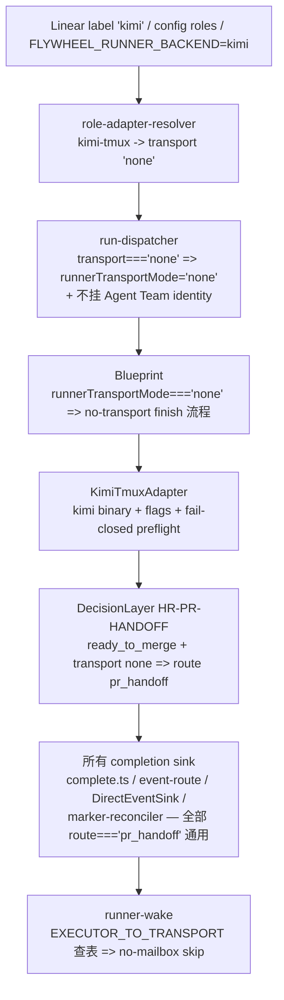

# Plan: Kimi Code (`kimi`) as a first-class Runner CLI backend

**Version**: v1.55.0
**Issue**: FLY-494（把 Kimi Code 加进 Runner CLI 后端，agent-agnostic）
**Date**: 2026-06-22
**Source**: `doc/engineer/research/new/FLY-492-kimi-code-runner-cli.md`（Kimi Code 视频深读 + Runner CLI 接入分析）
**Status**: codex-approved
**Builds on**: FLY-493（#319，Antigravity `agy` no-transport Runner backend — 已 merge，是本 issue 精确镜像的模板）

> **Provenance（Codex R1 #4）**：本 plan **有意取代** FLY-492 研究文档的「先做 Path A（改模型端点）」首选建议 —— Tadashi/Annie 把 FLY-494 scope 拍成 agent-agnostic **CLI backend wiring**（= 研究文档的 Path B-lite，镜像 FLY-493），因为 Path A 给不了「Runner CLI 后端 first-class」这个 issue 原话要的东西。live usability 仍由 provisioning spike 把关（§0 caveat）。读者勿把研究结论与本 plan 结论当成同一个。

---

## 0. 一句话

把 Kimi Code（`kimi` CLI）接成**第四个 first-class Runner executor backend `kimi-tmux`**（claude / codex / antigravity / **kimi** 并列），精确镜像 FLY-493 给 Antigravity 铺的 **no-transport tmux-adapter** 形状。整套 `pr_handoff` no-transport 生命周期是 FLY-493 已建好的、以 `transport === "none"` 为键的**通用**机制 —— 对 `kimi-tmux` **执行逻辑零改动自动生效**（唯一例外：一处通用 runtime 文本去 vendor 化，见 §5.5b）。

> **关键交付边界（Tadashi brainstorm-gate 拍 + 写进本 plan）**：FLY-494 ship 的是 **wiring（脚手架，kimi 缺席/未登录时 fail-closed 抛错）**，**不是 live-usable**。进度更新（FLY-494 spike）：① `kimi` CLI **已装**（brew `kimi-code` 0.18.0）；②③ flags 已 **live-verified against 0.18.0 with REAL auth**（`kimi --help` + 已登录测试，更正:`--print`/`--afk` 不存在;`--yolo`/`--auto` 不能与 `-p` 同用 → 用 **`-p`+`-m`**,`-p` 默认自动批工具）。**仍未完成**：一次**已登录的 e2e spike**（Annie 配好 key 后 Tadashi fresh-dispatch 一个 kimi runner 跑完 onboard→brainstorm-gate→PR，验 `-p` 扛长阻塞 brainstorm-gate）。**在 e2e spike 完成前，绝不对外宣称 Kimi runner 端到端可用。**

---

## 1. Problem & Goal

- **Problem**：Annie 的 vision 是 agent-agnostic Runner CLI backends（Claude / Codex / Antigravity / Kimi 任选）。FLY-493 已把后端抽象从「死锁 Claude」打开成「可插拔 tmux CLI 后端」。Kimi Code 是又一个 Claude-Code-class 的 agentic CLI（`kimi`，MoonshotAI/kimi-code，TS 写），且带独特的 video-in-context 能力（研究 FLY-492）。
- **Goal**：让 Runner 能可选用 Kimi Code 跑任务、first-class、跟现有后端 parity（spawn / I/O / 监控 / 安全 sandbox）。
- **Non-goal（本 PR 不做）**：Path A（把 claude harness 指向 Kimi Anthropic-兼容端点 —— 给不了 CLI backend）；重型 ACP（`kimi acp` JSON-RPC adapter）；video-in-context Runner 工具；Lead→Runner mid-session push-wake；live E2E（kimi 未装）。

## 2. Research findings（`kimi` CLI — **live-verified against kimi 0.18.0**，FLY-494 spike）

来源：`kimi --help`（installed binary 0.18.0，brew homebrew-core）+ `moonshotai.github.io/kimi-code`。**更正**：草稿原写的 `--print` / `--afk` 是早期 doc 说法，**shipped binary 0.18.0 没有这两个 flag**。真实 flags：

| 维度 | 事实（0.18.0 实测） |
|------|------|
| 二进制 | `kimi`（TS CLI，MoonshotAI/kimi-code，brew `kimi-code`） |
| version | `kimi --version` / `-V`（无 auth，即时返 `0.18.0`） |
| 种子 prompt（非交互） | `-p TEXT` / `--prompt`：「Run one prompt non-interactively and **print** the response」= headless agent loop。**prompt 是 flag value，不是 positional**（≠ claude positional、≠ agy `-i`） |
| 模型 | `-m NAME` / `--model`（与 `-p` 可组合） |
| auto-approve | **`-p` 模式默认自动批准工具调用**（已登录实测：`kimi -p` 用 Write 工具建文件零提示）= 无人值守姿态、无需额外 flag。`-y`/`--yolo`、`--auto` **不能与 `-p` 同用**（CLI 硬拒 `Cannot combine --prompt with --yolo`/`--auto`） |
| 输出 | `--output-format text\|stream-json`（prompt 模式） |
| auth | `kimi login` = **device-code flow**（跑命令 → 显示 device code + URL → 浏览器输 code 授权）；凭据存 config，**不吃** shell 注入的 `ANTHROPIC_AUTH_TOKEN` |
| 其它子命令 | `acp`（ACP server over stdio）、`server`/`web`（本地 REST+WS+web UI）、`doctor`、`export`、`provider`、`vis`、`migrate`、`upgrade` |
| **不存在的 flag** | `--print`、`--afk`、`--yes`、`--auto-approve`、`--command`/`-c`（早期 doc 提过，0.18.0 实测无） |

**选定的无人值守调用（已登录实测纠错后）**：`kimi -p "<bootstrap 指针>" --model <X>`
- `-p` = 非交互跑一个 prompt 并打印响应（headless agent loop），**且默认自动批准工具调用** = 无人值守姿态、不需额外 approve flag；指向 0600 文件（复用 FLY-154 argv-overflow 缓解）。
- `--model` 仅当 `ctx.model` 有值才加。flag 全集中在 `KimiTmuxAdapter.buildCliArgs`，未来 kimi 版本若变单点一行可改。
- **关键纠错（已登录实测）**：`--yolo` / `--auto` **不能与 `-p` 同用** —— CLI 硬拒 `kimi -p … --yolo`（`Cannot combine --prompt with --yolo`，`--auto` 同）。merged #323 的 adapter 用了 `--yolo` 是真 bug（fix PR 修)。**第一次 spike 没抓到**是因未登录 `kimi -p` 在 flag 校验前就挂起（旧 doc 的 `--prompt`/`--yolo` 互斥其实是对的）—— **带 Annie 真 key 的已登录测试才暴露**。preflight `kimi -p` 单独跑 + bounded 20s timeout（未登录挂 device-code → 超时 fail-closed）。

## 3. Architecture map — 为什么改动这么小

FLY-493 把 `TmuxAdapter` 改成可扩展（`type`/`binaryName`/`runPreflight`/`buildCliArgs` 四个 protected seam），并把整套 no-transport `pr_handoff` 生命周期写成**以 `transport === "none"` 为键的通用机制**：

**已通用、逻辑零改动**：dispatcher、Blueprint finish 流程（runner-facing prompt 文本已是通用「no-transport backend」措辞）、wake-guard、complete.ts、event-route、complete-marker-reconciler、DirectEventSink。这些全部走 `transport === "none"` / `runnerTransportMode === "none"` / `route === "pr_handoff"`，对任何 no-transport 后端通吃。

**唯一新增/改动**：一个新 adapter + 6 处后端注册 + **一处通用 runtime 文本修正**（DecisionLayer 的 `pr_handoff` reasoning 字符串目前写死 "antigravity" —— 见 §5.5b，Codex R1 #1，运营真实性）。

> **诚实修正（Codex R1 #1）**：草稿原称生命周期对 kimi「ZERO changes」。**执行逻辑**确实零改动，但 DecisionLayer 的 pr_handoff **reasoning 字符串**（持久化进 audit / Lead 可见）硬编码了 "antigravity" —— Kimi 走这条通用分支会被误标成 Antigravity build。这是小改但属 Flywheel 运营真实性红线，故纳入本 plan（§5.5b）。

## 4. Scope（精确）+ 复用 FLY-493 的 v1 lifecycle 契约

### 4.1 In scope — TeamLead dispatcher path only
与 FLY-493 同：Kimi 是 dispatcher path（label / config / env）的 first-class 后端。legacy EdgeWorker `agentSession` path（`RunnerSelectionService`）**不**接 `[agent=kimi]`（与 FLY-493 对 agy 的处理一致，保持 1:1）。

### 4.2 v1 transport = none（brainstorm-gate 已批）
Kimi Code 没有 claude-code Agent Team 邮箱（同 agy），所以 transport=none、不挂 Agent Team identity、不进 wake-依赖的 approve→ship 环。stage/gate/ask 全部经 flywheel-comm + comm.db **vendor-neutral** 工作；brainstorm gate 在进程内 BLOCK（`kimi -p` 非交互进程存活直到 agent loop 跑完）。

### 4.3 v1 = build+PR 后端，复用 `pr_handoff` 终态路由
无改动 —— FLY-493 已建。Kimi runner 的生命周期：onboard → brainstorm gate（阻塞）→ TDD → 开 PR → 报 Lead（非阻塞 `ask`）→ `complete --route pr_handoff --pr <N>` → terminal `completed`（**不是** awaiting_review）→ founder 手动 ship（founder-gated，FLY-248）。

## 5. Changes（by layer）

> 命名约定：vendor key = `kimi`；executor backend = `kimi-tmux`；adapter `type` = `kimi-tmux`；binary = `kimi`。label 触发词 = `kimi`、`kimi-code`。

### 5.1 Config types — `packages/config/src/types.ts`
- `ExecutorBackend` 加 `"kimi-tmux"`（编译期强制：`EXECUTOR_TO_TRANSPORT` 是 `Record<ExecutorBackend, …>`，漏加会编译失败 —— 安全网）。
- `EXECUTOR_BACKENDS` 数组加 `"kimi-tmux"`。
- 更新注释（`kimi-tmux` → KimiTmuxAdapter，transport=none）。

### 5.2 Config validation — `packages/config/src/ConfigLoader.ts`
- 验证走 `EXECUTOR_BACKENDS`，5.1 加完即覆盖。补一条 roles-block 测试（`backend: kimi-tmux` 通过校验）。

### 5.3 Label parsing — `packages/config/src/runner-label.ts`
- `RunnerVendorType` 加 `"kimi"`。
- `resolveAgentFromLabels`：在 antigravity 之后、cursor 之前加 `if (labels.includes("kimi") || labels.includes("kimi-code")) return "kimi";`（distinct 关键词，不动现有 precedence）。
- 更新顶部 FLY-493 注释段，补 FLY-494 一行。

### 5.4 Resolver — `packages/teamlead/src/bridge/role-adapter-resolver.ts`
- `EXECUTOR_TO_TRANSPORT` 加 `"kimi-tmux": "none"`。
- `VENDOR_TO_EXECUTOR` 加 `kimi: "kimi-tmux"`。
- `parseEnvBackend`：`value === "kimi-tmux"` 直接接受 + warn message 补 `kimi-tmux` / `kimi`（vendor `kimi` 经 `VENDOR_TO_EXECUTOR` 查表已覆盖，无需额外别名归一化，因为 vendor key 与 alias 同名 `kimi`）。

### 5.5 Dispatcher — `packages/teamlead/src/bridge/run-dispatcher.ts`
- 无改动：`buildRunnerSpawnFields` 已对 `resolved.transport === "none"` 通用处理（设 `runnerTransportMode: "none"` + 不挂 Agent Team identity）。补一条 dispatcher 测试覆盖 kimi label → no-transport spawn fields。

### 5.5b DecisionLayer — `packages/edge-worker/src/decision/DecisionLayer.ts`（Codex R1 #1，运营真实性）
- `pr_handoff` 分支（`HR-PR-HANDOFF`，line ~47-64）的 `reasoning` 字符串目前写死 `"No-transport (antigravity) build complete; PR open and handed to the founder for the founder-gated ship"`。这是**通用** no-transport 分支（键于 `runnerTransportMode === "none"`），Kimi 也走它 —— 必须去 vendor 化：改成 `"No-transport runner build complete; PR open and handed to the founder for the founder-gated ship"`。
- 同处注释（`// HR-PR-HANDOFF (FLY-493): a no-transport (antigravity) Runner ...`）泛化为 `no-transport (e.g. antigravity / kimi) Runner`。
- **最小触碰**：仅改这一处 runtime 字符串 + 其相邻注释（运营真实性是红线，必改）。Blueprint / ExecutionEventEmitter / runner-wake 里把 "(antigravity)" 写在注释中的几处，顺手把描述通用机制的注释改为 "no-transport (e.g. antigravity / kimi)"（纯注释、零行为变化、改善真实性）；不动任何逻辑。

### 5.6 Adapter — `packages/claude-runner/src/KimiTmuxAdapter.ts`（NEW）
精确镜像 `AntigravityTmuxAdapter`，差异：
- `type = "kimi-tmux"`，`binaryName = "kimi"`。
- 构造器同 agy：no transport（super 传 `undefined`）。
- `runPreflight()`：`tmux -V` + `kimi --version` + **fail-closed auth 探针**。探针用 `kimi -p "Reply with exactly: KIMI_OK"`（**`-p` 单独,不加 `--yolo`/`--auto`** —— CLI 拒绝同用；非 mutating），**bounded 20s timeout**（Codex code R1 + 实测：未登录 `kimi -p` 会挂起等 device-code，超时即 kill → fail closed）。输出不含 `KIMI_OK` 或命中 `/Authentication required|Please sign in|not logged in/i` → 响亮抛错。
- `buildCliArgs(ctx, _sessionId)`：（`ctx.model` ? `["--model", ctx.model]`）+ `["-p", "Read the instructions in <promptPath> and follow them exactly. Begin now."]`。**只 `-p`+`--model`,不加 `--yolo`/`--auto`**（CLI 硬拒与 `-p` 同用;`-p` 本就默认自动批工具）。combined system+task prompt 写 0600 文件 `kimi-bootstrap.md`（复用 agy 的 tmpdir/perm 逻辑）。**不**带任何 claude-only flag（`--session-id`/`--permission-mode`/`--append-system-prompt-file`/`--allowed-tools`/`--name`），也不用不存在的 `--print`/`--afk`。
- 文件头注释写清：flags live-verified against kimi 0.18.0；fail-closed if kimi 缺/未登录；transport=none → pr_handoff finish。

### 5.7 export — `packages/claude-runner/src/index.ts`
- `export { KimiTmuxAdapter } from "./KimiTmuxAdapter.js"; // FLY-494`。

### 5.8 Registry — `packages/teamlead/src/bridge/run-infra.ts`
- import `KimiTmuxAdapter`。
- `adapterRegistry.registerFactory("kimi-tmux", () => new KimiTmuxAdapter(tmuxSessionName, undefined, 5000, sessionTimeoutMs, hookServer))`（同 agy，无 transport arg）。

### 5.9 Security posture
- Parity with agy：`-p` 非交互模式**默认自动批准工具调用** = 无人值守 tmux runner 的 auto-approve（功能上等价 claude 的 `--dangerously-skip-permissions`，但靠 `-p` 默认行为而非显式 flag —— `--yolo`/`--auto` 与 `-p` 互斥）。worktree 隔离、comm.db、fail-closed auth preflight 全继承。Kimi 的 `--plan`（read-only）等更软模式留作未来 config-gated 加固，本 PR 不引入。

### 5.10 Docs + version
- `doc/VERSION` → `v1.55.0`。
- `CLAUDE.md` 里程碑加一行 FLY-494。
- 本 plan：draft → new（codex design APPROVED 后）→ inprogress（implement 起）→ archive（merge 后，搭主 PR 末 commit `git mv`）。

## 6. TDD test plan（RED → GREEN）

**新测试 `packages/claude-runner/test/KimiTmuxAdapter.test.ts`**（镜像 `AntigravityTmuxAdapter.test.ts`）：
1. `type === "kimi-tmux"`。
2. 启动 `kimi` binary（不是 claude）。
3. preflight 调 `kimi --version` + 跑 auth 探针。
4. FAIL-CLOSED：探针无 `KIMI_OK` → 抛 `/auth preflight failed/i`。
5. FAIL-CLOSED：显式 `Please sign in` → 抛。
6. emit kimi flags（`-p` + `--model <X>`,**不含** `--yolo`/`--auto`/`--print`/`--afk`）+ **不含**任何 claude-only flag；探针 `-p` 单独不配 `--yolo`/`--auto`。
7. `ctx.model` 未设 → 无 `--model`。
8. 种子 prompt 经 short `-p` 指针指向写出的 0600 文件（不内联大 prompt）。

**扩展现有测试**（加 kimi case，镜像 FLY-493 的 antigravity case）：
- `packages/config/src/__tests__/runner-label.test.ts`：label `kimi` / `kimi-code` → `runnerType: "kimi"`。
- `packages/config/src/__tests__/ConfigLoader.roles.test.ts`：`backend: kimi-tmux` 通过校验。
- `packages/teamlead/src/bridge/__tests__/role-adapter-resolver.test.ts`：vendor `kimi` / env `kimi-tmux` / env alias `kimi` → backend `kimi-tmux` + transport `none` + vendor undefined。
- `packages/teamlead/src/bridge/__tests__/run-dispatcher-backend.test.ts`：kimi label → `runnerTransportMode: "none"` + 无 Agent Team identity。
- `packages/teamlead/src/bridge/__tests__/runner-wake-no-transport.test.ts`：`adapter_type: "kimi-tmux"` → wake skip + `runner_wake_no_transport` 事件。
- **DecisionLayer（Codex R1 #1）**：`packages/edge-worker/src/__tests__/DecisionLayer.test.ts` 加断言 —— no-transport + `ready_to_merge` → `pr_handoff` 的 `reasoning` **不含** vendor 名（不出现 "antigravity"），证明文本去 vendor 化。
- **Registry（Codex R1 #2 + R2）**：加一个聚焦的 registry/seam 测试，证明 `kimi-tmux` 在生产注册点解析为 `KimiTmuxAdapter` 且 default 仍是 `claude-tmux`。`run-infra` 的注册是大函数内联、无法独立单测，故用最小忠实 seam：构造一个 `AdapterRegistry`、按 run-infra 同样的方式 `registerFactory("claude-tmux", …)` + `registerFactory("kimi-tmux", () => new KimiTmuxAdapter(...))` + `setDefault("claude-tmux")`，断言（**匹配 AdapterRegistry 真实合同**，Codex R2）：`registry.get("kimi-tmux") instanceof KimiTmuxAdapter`、`registry.getDefault() instanceof TmuxAdapter`（claude default）、且 `registry.get(<unknown>)` **throws**（未注册名抛错，不是 fallback）—— 与 FLY-493 对 antigravity 的覆盖粒度一致。

## 7. Acceptance gates（empirical）
- `pnpm -r build` 全绿（ExecutorBackend exhaustiveness 编译期保证）。
- 全仓 `pnpm lint`（biome）零问题。
- claude-runner / config / teamlead 测试套全绿；TmuxAdapter 79-test 套**字节不变**（claude 路径未动 = byte-compat 证据）。
- default-OFF 证据：不配置 → resolver 仍返 `claude-tmux` + transport `claude-code`（现有 default 测试不变）。

## 8. Deploy（Lead + Annie owned — NOT this Runner）
- Bridge 侧改动（resolver/dispatcher/run-infra 在 Bridge 进程内）→ ship = **founder-gated Bridge restart**。PR-ready 报 Tadashi，**不自 merge / 不自 restart**。
- 部署后**不**等于 Kimi 可用：仍需装 kimi + Annie auth + live spike（§0 caveat）。Tadashi 会向 Annie 说明这层。

## 9. Risks / non-goals
- **R1（已降级）**：CLI flags 现已 **live-verified against kimi 0.18.0 with REAL auth**（两次纠错:`--print`/`--afk` 不存在;`--yolo`/`--auto` 与 `-p` 互斥 → 最终 `-p`+`-m`）。残余：版本漂移风险 —— flag 集中在 `buildCliArgs` 单点可改；fail-closed preflight 保证 kimi 缺/未登录时不会静默跑错。
- **R2（Codex R1 #3，强化验收 —— 仍开放）**：`-p`（非交互）模式下单个阻塞工具调用（brainstorm gate 最长 48h）会不会被 Kimi 内部 per-command / idle session timeout 杀，或 step budget 不够跑完整 build+PR？**这需要已登录的 e2e spike 才能验**（flag 层已验,工具自动批已验,长阻塞行为层未验）：① `kimi -p` 能跑一个阻塞「代表性时长」后才返回的 shell 命令并正常恢复；② 一个 brainstorm-gate-like 的阻塞命令不被 kill；③ 查并按需设 step/timeout config（默认太低则调高）；④ 记录 auth 失败 / quota / 瞬时失败 / 工具执行被中断 各自的 exit code。agy/claude 靠 interactive + `BASH_MAX_TIMEOUT_MS`，Kimi 可能有自己的 env 旋钮。不阻塞本 PR 的 wiring。
- **R3**：Kimi 交互模式无法用 launch arg 种 prompt（只有 `-p`/`--prompt` 非交互能），所以走 `kimi -p` 非交互而非 agy 的 interactive `-i`。这是 Kimi 与 agy 的唯一形态差异，已在 §2 选定调用里处理。
- **Non-goal**：video-in-context、ACP adapter、push-wake、auto-ship（均为 follow-up）。
