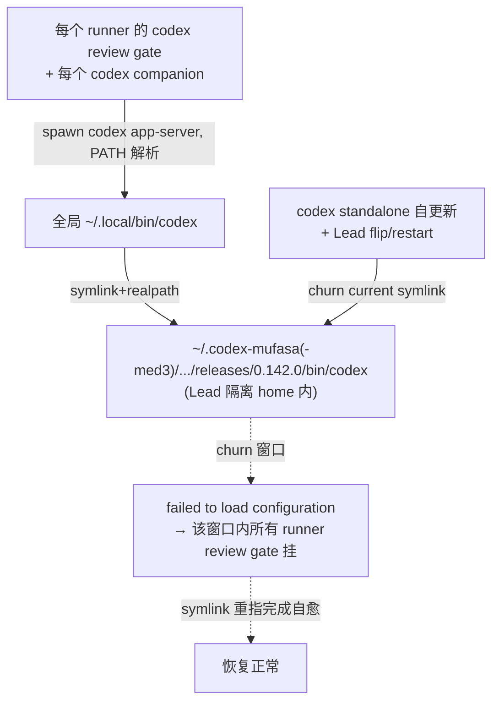
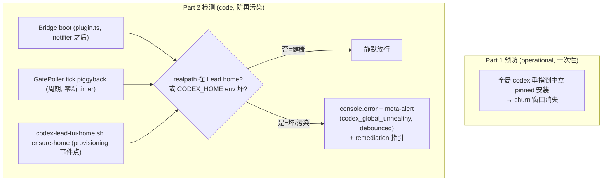

# Plan: 全局 codex 二进制稳定性 — codex review gate 不再被 Lead 安装 churn 卡住

**Version**: v1.55.1（暂定，ship 时按届时 main 重新定版）
**Issue**: FLY-513 — [bug] codex companion App-Server 配置加载坏了，可能卡所有 runner 的 codex review gate（FLY-137）
**Date**: 2026-06-23
**Source**: 现场取证（LEARN-80 codex-gate log）+ 本 issue brainstorm gate（Tadashi 批 A=(1)+(2)、B=plan-first）
**Status**: codex-approved（design review R1 CHANGES REQUESTED → R2 APPROVED，2 轮；R2 的 5 条 LOW 实现卫生已反映进 §3/§5）
**Pipeline**: inprogress (implementation started)

---

## 1. Problem（已查实，非预设）

### 1.1 现场证据
LEARN-80 daily-loop runner 跑 codex code-review gate（sub PR #61，2026-06-23 04:00:47）失败，companion job 记录的原话：

```
errorMessage: "failed to load configuration: No such file or directory (os error 2)"
status: "failed"
```

证据来源：`~/.claude/plugins/data/codex-openai-codex/state/sub-da40694f-…/jobs/task-mqqj9u4u-9zte3o.json`。同 workspace **前一天**（06-22）的同类 job 是 `completed` / `Verdict: APPROVED` —— 说明 06-22→06-23 之间某个**环境**变化破坏了 config-load，而非代码或本 issue 本身。

### 1.2 根因
"codex companion" 这条路 = codex 插件（`openai-codex`）的 stop-review-gate → companion → `spawn("codex", ["app-server"], { env })`（`scripts/lib/app-server.mjs:187-191`），经 **PATH 解析全局 `codex`**。raw `codex exec` 走**同一个** PATH 全局 `codex`。

全局 `codex` 实际是一个 **per-Lead 隔离、会自更新的安装** 的 symlink：

```
~/.local/bin/codex → ~/.codex-mufasa-med3/packages/standalone/current/bin/codex
fs.realpathSync 实测 → ~/.codex-mufasa/.../releases/0.142.0-aarch64-apple-darwin/bin/codex
```

（注：med3 与 mufasa 两个 Lead home 的 standalone 还**交叉链接**，真实二进制最终落在 `~/.codex-mufasa` 这个 Lead home 内。）

- 这些 `~/.codex-*` 是各 Codex Lead 的隔离 CODEX_HOME，带自己的 standalone 安装。
- 它们的 `current` symlink 会被 **codex standalone 自更新**（releases 实测 0.140.0→0.141.0→0.142.0）和 **Lead flip/restart** 重指。
- 重指/更新的 churn 窗口内，全局 `codex` 瞬时 config-load 失败 → **任何**此刻 spawn `codex app-server` 的 runner review gate 都挂。
- 会自愈：LEARN-80 失败 04:00:47 → `~/.local/bin/codex` 与该 home `current` 都在 04:08:15 被重指到完整 0.142.0 → 现在复现 `codex app-server` 已**完全正常**（codexHome=`~/.codex`，initialize 成功）。
- `~/.codex`（默认 home）**根本没有** standalone 安装（`readlink ~/.codex/packages/standalone/current` → 无）→ 全局 codex 是被 Lead-home 安装经 curl installer 副作用劫持的。

### 1.3 Blast radius（坐实 shared-infra，非 LEARN-80 专属）
同一条 `failed to load configuration: No such file or directory (os error 2)` 命中 **≥3 个不同项目的 runner**，跨 ~10 天（grep `~/.claude/plugins/data/codex-openai-codex/state/*/state.json`）：

| 项目 / runner | 失败时间 |
|---|---|
| `sub-da40694f`（LEARN-80） | 2026-06-23 04:00 |
| `joycon-typeless-LEARN-66` | 2026-06-13 04:39 |
| `flywheel-FLY-350` | 2026-06-20 17:03 |

"raw codex exec 正常" 是**时序假象**：LEARN-80 runner 在 churn 窗口（04:00）之后（04:08 自愈后）才手动跑 raw —— 不是 companion 与 raw 走不同二进制。

### 1.4 为什么 Flywheel 拦不住
仓库里**没有任何代码**创建/重指 `~/.local/bin/codex`。唯一引用是 `codex-lead-tui-home.sh:336-340` 指导 operator 手动跑 `CODEX_HOME=$HOME_DIR curl …/install.sh | sh`（并只提醒 "REVERT any **shell-profile PATH** edit"）。该 installer 的副作用之一是创建/重指 `~/.local/bin/codex` 指进它被装的那个 CODEX_HOME —— runbook 没覆盖这个 symlink 副作用，于是全局 codex 被 Lead-home 劫持后无人察觉。



---

## 2. Goal / Non-Goal

**核心定性（R1 HIGH-1 修正）**：**Part 1 的全局 codex 重指 = 真正的、唯一的"预防"**。它把全局 codex 钉在一个中立、pinned、无人 churn 的安装上，从源头消除 churn 窗口。**Part 2 的代码守卫不是预防，是 drift 检测**（boot + 周期 + ensure-home 事件点）：抓"将来再被污染"，把一次静默多-runner 停摆变成响亮可诊断。绝不把守卫宣传成能拦 mid-process PATH churn。

**Goal**
1. 全局 `codex`（runner review gate + codex companion 依赖）与任何 Lead 生命周期 churn **解耦**（Part 1，预防）。
2. 全局 codex 再被污染/坏掉时**快速响亮**被抓到（Part 2，检测 + 告警）。
3. 加固 provisioning：装 Lead-home standalone 不再悄悄劫持全局 symlink（可执行守卫 + runbook）。

**Non-Goal**
- 不改 codex 插件（vendored）；不改 codex 二进制更新逻辑。
- 不碰 FLY-123 per-runner CODEX_HOME（`codex-home.ts`，另一层：隔离 runner auth/config，不是全局可执行解析）。
- 不在守卫默认路径里 spawn `codex app-server` 探活（过重、非零行为、有 child 泄漏风险 —— R1 MED-3）。
- 不做 Mufasa/Codex-Lead deploy 形态改动。

---

## 3. 方案

### Part 1 — Operational：全局 codex 重指到中立 pinned standalone（**预防性、阻断式**；Tadashi review 后我执行，绝不擅自）

> ⚠️ 动 `~/.local/bin/codex` 影响全体 Lead/runner，属生产 infra 动作。本 plan 写清**原子**步骤、Tadashi review 后由我执行。不急（churn 间歇 + 自愈）。

**原子安装 + 完整性校验（R1 MED-5）**：
1. **解析当前真实 release**：`SRC=$(node -e 'process.stdout.write(require("fs").realpathSync(require("child_process").execSync("command -v codex").toString().trim()))')` 上溯到 release 根（`.../releases/<ver>-<triple>/`）。
2. **稳定性闸**：连续两次（间隔几秒）读取 `~/.codex-*/.../current` 与 `~/.local/bin/codex` 的 realpath 不变 → 确认不在更新窗口；变了就等待重试（不在 churn 中拷贝）。
3. **拷到中立临时目录**：`cp -R "$SRC" ~/.local/share/flywheel-codex/.tmp-<ver>-<rand>/`（中立路径，不属任何 Lead home，无人自更新）。
4. **自包含校验**：扫描拷贝树**没有任何 symlink 指回 `~/.codex-*` 或 `current`**（`find … -type l` 逐一 readlink 验）；记录 `shasum bin/codex`。
5. **冒烟**：`CODEX_HOME 不设` 下 `bin/codex --version` + companion 风格 initialize（取证 harness）均通过、无 config-load 错。
6. **原子落位**：`mv` 临时目录 → `~/.local/share/flywheel-codex/<ver>/`（同卷 rename 原子）。
7. **备份 + 真原子重指（R2 LOW-5：`ln -sfn` 本身非 temp+rename）**：记录 `readlink ~/.local/bin/codex` 原值到回滚 note → 在**同目录**建临时 symlink（`ln -s <target> ~/.local/bin/.codex.tmp-<rand>`）→ `mv -f ~/.local/bin/.codex.tmp-<rand> ~/.local/bin/codex`（同目录 rename 原子替换）→ 立即 `readlink`/`realpath` 复核指向中立安装。
8. **正向回归（R1 LOW-7 真 companion 模式）**：
   - raw：`codex --version` + 一次 `codex exec` 冒烟。
   - **真 companion**：跑一次 `codex-companion.mjs task --json`（或 stop-review-gate 等效路径），记录 broker 是被禁用还是有意走（`CodexAppServerClient.connect` 先 broker 后 direct fallback）。+ 直连 harness 双保险。
9. **回滚**：任一步失败 → `ln -sfn <原值> ~/.local/bin/codex` 恢复（保留旧 symlink 原值）。
10. **记录**：源路径、版本、shasum、回滚目标写入 `doc/engineer/implementation/FLY-513-global-codex-repoint.md`。

> 决策点（已选）：中立落点 = `~/.local/share/flywheel-codex/<ver>/`（不动默认 `~/.codex`、与 Lead home 完全解耦）。

### Part 2 — Code（本 PR，最小 + TDD）：全局 codex drift 检测 + 可执行 provisioning 守卫

**2a. 新模块** `packages/teamlead/src/bridge/codex-global-health.ts`（纯函数，可注入 exec/env/homedir；**path-only，默认不 spawn app-server**，R1 MED-3）：
- `resolveGlobalCodexRealPath(deps)` → 解析 review gate 会用到的 `codex`：**直接扫 `PATH` 用 `access(X_OK)` 命中第一个可执行**（**不**用 `execFile("command", …)` —— `command` 是 shell builtin，R2 LOW-3），再 `realpathSync`（解析全部 symlink 层）。
- `classifyCodexGlobal({ realPath, env, homedir })` → 返回**显式形状**（R2 LOW-4）`{ ok: boolean, alert: boolean, severity: "ok"|"warning"|"severe", reason, detail }`，**同时看二进制 realpath 和相关 env**（R1 MED-4）：
  - **Allowlist 中立 root**（OK，`ok:true, alert:false`）：`~/.local/share/flywheel-codex/**`、默认 `~/.codex/**`（精确到 `$HOME/.codex` 段，不含 `.codex-` 后缀）。
  - **Deny 信号**（坏，`ok:false, alert:true, severity:"severe"`）：realPath 落在 `$HOME/.codex-<suffix>/**`（Lead home），**或** `env.CODEX_HOME` 指向 Lead home / 不存在的目录（stop-review hook 把 `process.env` 透传给 companion → 坏 CODEX_HOME 即使二进制中立也 config-load 失败）。
  - **未知非-Lead root**（如 Homebrew / 自定义中立路径）→ `ok:true, alert:false, severity:"warning", reason:"unknown-root"`：只记日志列出 realPath 供运维判断，**绝不 page `codex_global_unhealthy`**（R2 LOW-4：别让良性自定义路径永久告警）。
- 可选 `smokeTestCodexConfigLoad(deps, { timeoutMs })`：bounded、fail-closed、**显式 kill child**、**仅 Part 1 验证或显式 opt-in 调用**，不进默认守卫路径。

**2b. Bridge 接线（非致命，绝不从 setup 抛 —— R1 HIGH-2）**：
- **Boot 一次**：放在 `plugin.ts` **`MetaAlertNotifier` 构造之后**（~line 2641，`setupRunInfrastructure` 之后）跑 `classifyCodexGlobal`；坏 → ① `console.error` 响亮日志 ② `metaAlertNotifier.notify({ reason:"codex_global_unhealthy", … })`。try/catch 包裹，绝不影响 Bridge 起来。
- **运行中周期检测（R1 HIGH-1 覆盖 churn 窗口）**：piggyback `GatePoller` 的 `tickCount`（仿 FLY-208 misroute patrol，**零新 timer**），每 N tick 跑一次 path-only `classifyCodexGlobal`；坏 → 同上告警。靠 `MetaAlertNotifier` 自带 10min/​reason debounce 防刷屏。`FLYWHEEL_CODEX_HEALTH_GUARD=0` 整条逃生口（boot + 周期都跳）。

**2c. 新 `MetaAlertReason`（R1 HIGH-2）**：`MetaAlertNotifier.ts` 的 union 加 `"codex_global_unhealthy"`；带 file 输出 + debounce 单测。

**2d. 可执行 provisioning 守卫（R1 MED-6，不止 prose）**：
- `codex-lead-tui-home.sh ensure-home`：若 `realpath ~/.local/bin/codex` 落在 `$HOME_DIR` 内 → **warn-loud + 打印精确 remediation**（如何把全局 symlink 恢复到中立安装）。非致命（warning，不 die，避免误伤已知良性 setup）。
- FLY-259 cutover runbook 前置表加一行 `readlink ~/.local/bin/codex` 检查（必须不在任何 Lead home 内）。



---

## 4. 为什么这是最小正确范围（防过度工程）

- 预防只有一处：Part 1 的 pin（源头）。检测复用**已有**机制：boot 钩（FLY-123 janitor 同邻域姿态）、`GatePoller` tick piggyback（FLY-208 既有模式、零新 timer）、`MetaAlertNotifier`（既有逃生告警 + 自带 debounce）。
- 守卫默认 **path-only**（cheap、确定性、零副作用）；app-server smoke 只在 Part 1 验证或显式 opt-in，不进默认路径 → byte-compat 真成立（健康时零行为变化 + 环境逃生口）。
- **不碰** codex 插件、不碰 FLY-123 per-runner home、不碰 Mufasa deploy。
- 告警只加一个 `MetaAlertReason` + 复用既有 notify，不新建告警基建（FLY-368 AlertChannelHub 接入留 follow-up）。

---

## 5. 测试计划（TDD：先 RED）

**单元 `codex-global-health.test.ts`（注入 fake exec/env/homedir，全程不真跑 codex）**
1. realPath 在 `~/.codex-mufasa/…` → `ok=false, reason=lead-home`（detail 含 home）。
2. realPath 在 `~/.codex-mufasa-med3/…` → `ok=false`（覆盖 -med3 后缀）。
3. realPath 在 `~/.local/share/flywheel-codex/0.142.0/…`（中立 allowlist）→ `ok=true`。
4. realPath 在默认 `~/.codex/…` → `ok=true`（默认 home 放行，不被 `.codex-` 误伤）。
5. **binary-clean / env-contaminated**：realPath 中立但 `env.CODEX_HOME=~/.codex-mufasa` → `ok=false, reason=bad-codex-home`（R1 MED-4）。
6. **binary-contaminated / env-clean**：realPath 在 Lead home、env 干净 → `ok=false`（R1 MED-4）。
7. `env.CODEX_HOME` 指向不存在目录 → `ok=false, reason=missing-codex-home`。
8. realPath 在未知非-Lead root → `{ ok:true, alert:false, severity:"warning", reason:"unknown-root" }`（detail 列路径；断言**不**触发告警）。
9. `FLYWHEEL_CODEX_HEALTH_GUARD=0` → 守卫短路返回 ok、不检查。
10. `command -v codex` 解析不到 → 明确 reason，不抛未捕获。
11. smoke 函数：返回 `failed to load configuration` → `ok=false`；超时 → fail-closed 且**child 被 kill**（断言 kill 调用）；正常 → ok。

**接线（mock notifier/exec）**
12. boot 判坏 → `notify({reason:"codex_global_unhealthy", …})` 调一次（含 realPath + detail）。
13. boot 判健康 → **不**告警、不改任何现有启动行为（byte-compat 哨兵）。
14. `GatePoller` tick piggyback：到 N tick 跑一次检查；判坏触发 notify；debounce 命中不重复。
15. 守卫抛错被 try/catch 吞、Bridge 启动不受影响（绝不从 setup/poller 冒泡）。
16. `MetaAlertReason` 新值：file 输出 + debounce 单测。

**正向回归（Part 1 执行时，记录到 implementation note）**
17. 重指后：raw `codex exec` 冒烟通过 + **真 companion**（`codex-companion.mjs task --json`）通过，二者均无 config-load 错；记录 broker/direct。

**全仓 lint + CI**：push 前 `pnpm lint`（全仓 biome）+ 相关包测试全绿。

---

## 6. 风险 & 回滚

| 风险 | 缓解 |
|---|---|
| Part 1 重指动全局 codex | Tadashi review 后才执行；原子安装 + 自包含校验 + 备份原 symlink + 每步验证 + 一行回滚；不急可择时 |
| 拷贝树残留指回 Lead home 的 symlink | §3 Part1 step4 扫描所有 symlink，发现指回即拒绝落位 |
| 在 churn 窗口中拷贝到半更新的 release | §3 Part1 step2 稳定性闸（连续两读 realpath 不变才拷） |
| 守卫误报（unknown-root / 真人临时换 codex） | unknown-root 只 warning 不致命；`FLYWHEEL_CODEX_HEALTH_GUARD=0` 逃生；debounce 10min 防刷 |
| 守卫从 setup/poller 抛错搞挂 Bridge | 全程 try/catch、非致命，单测 15 哨兵 |
| Bridge-boot-only 盖不住 churn 窗口 | 已加 GatePoller 周期 piggyback；且 Part 1 pin 从源头消除 churn |
| pin 后错过 codex 安全更新 | 全局升级改为**显式可控**一步（更新中立安装 + 原子重指），见 Follow-up |

---

## 7. Follow-ups（不在本 PR）
- 受控的全局 codex 升级流程（显式 bump pinned 版本 + 验证 + 原子重指），替代隐式自更新。
- 评估守卫告警从 meta-alert 升级接入 FLY-368 AlertChannelHub（统一渠道 + 线程化）。
- 评估在 Codex-backend runner dispatch（`codex-resume.ts` / `flywheel-codex-with-fallback` shim）加同款 cheap 路径预检（让 Codex runner 路也 fail-fast）。
