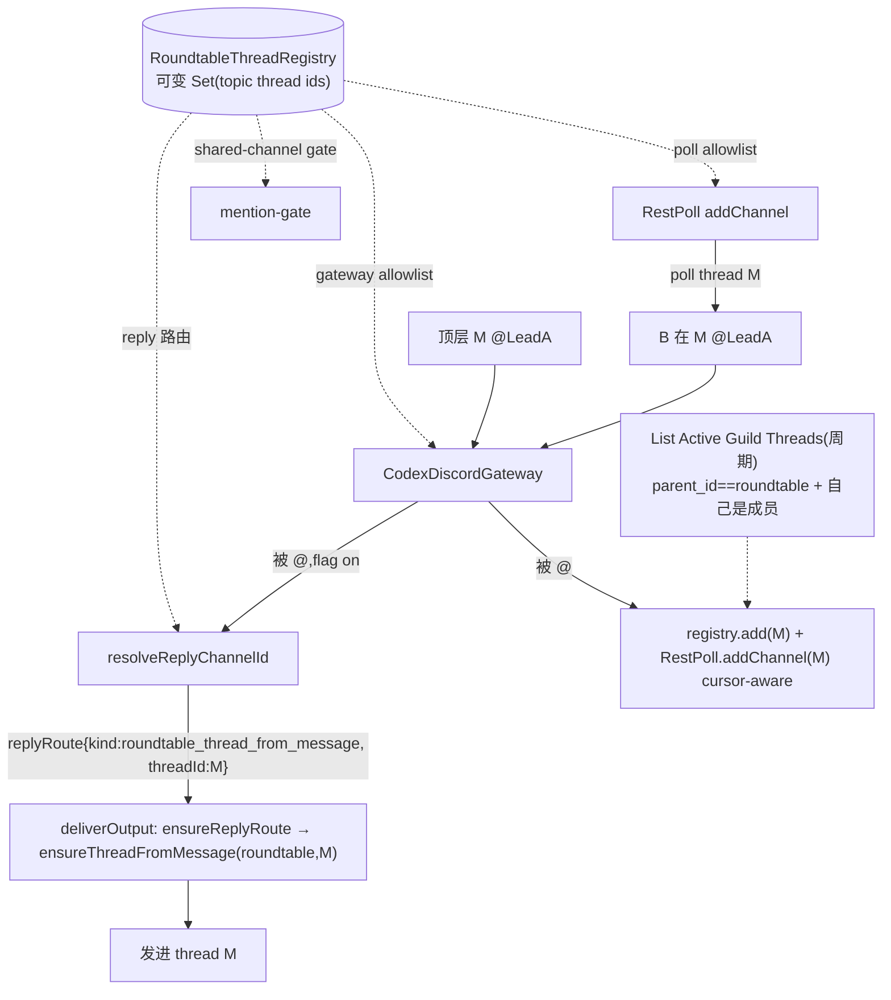

# Plan: Roundtable Reply-in-Thread (Phase 2, full multi-turn) — FLY-314

**Version**: v1.56.0 (草稿 — Codex design review 中)
**Issue**: FLY-314 (Roundtable per-topic auto-thread) — Phase 2
**Date**: 2026-06-22
**Source**: FLY-314 Phase 1(PR #318,已 merge)、Annie 决策 (b) 完整多轮 + 覆盖所有 lead、Phase 2 brainstorm gate(B + Codex 先行/Claude 插件单独 PR)
**Status**: codex-approved (rev 5 — Codex design review APPROVED 第 4 轮;R1 12 + R2 4 + R3 3 全采纳 + R4 非阻塞 polish)
**Related**: FLY-91/162、FLY-267(cross-channel + mention-gate + reply 路由)、FLY-224(RestPoll 持久 cursor)、FLY-220(bot-loop)、FLY-398(生产 Codex lead = TUI)、FLY-274(bridge-mode 403,本期外)

---

## 0. 摘要

Phase 1(已 merge)= roundtable 顶层消息自动开 topic thread(thread id == 源 msg id)+ 拉 @ 到的 Lead 成员。**Phase 2 = reply-in-thread 完整多轮**(Annie b):被点名 Lead 把回复发进 topic thread、**看见彼此 thread 内回复**、@-id 接力多轮;覆盖**所有 lead**。

**两 repo**:(a) 本 repo/本 session = Bridge poller(已在 main)+ **Codex lead(Mufasa,headless + TUI 两 runtime)**;(b) Claude/OpenClaw lead = 独立插件 repo 单独 PR(checklist 见 §7)。

**rev 2 关键修订(Codex R1 十二项)**:① **共享动态线程注册表 `RoundtableThreadRegistry`** —— poll allowlist + **gateway allowlist** + **mention-gate shared-channels** + reply 路由**四处共用同一可变 Set**(否则 gateway 静态白名单照样 drop 线程消息 / mention-gate 静态 shared 集漏 gate → bot 回环)。② `addChannel` **cursor-aware**(先 load 已存 cursor,有则 resume+drain,无才 baseline-to-latest —— 否则重启/cap 驱逐/re-add 丢消息,破 FLY-224 契约)。③ **异步 ensure-thread** 点(`resolveReplyChannelId` 同步,不能 await 建 thread → sender 投递前 await `ensureThreadFromMessage`,复用 Phase 1 create+already-exists+confirm + 160004)。④ active-thread 用 **List Active Guild Threads**(`GET /guilds/{guild}/threads/active`)+ `parent_id==roundtable` 过滤 + 成员过滤(需 guildId);非 channel-scoped。⑤ **TUI runtime 同等纳入**(生产 Mufasa = TUI,`codex-lead-tui-runtime.ts` 同款 wiring)。⑥ cap = **active polling slots 非 durable 删兴趣**(驱逐留 cursor,re-add resume)。⑦ Part (b) 扩 OpenClaw allowBots/精确-token 语义。⑧ 不变式明写「每个 topic thread = gating 上的 shared channel」。⑨ 字节兼容更尖 sentinel(off 时 RestPoll fetch 序/headless/TUI/cross-dept 路由全不变)。

**字节兼容红线**:`FLYWHEEL_ROUNDTABLE_REPLY_IN_THREAD`(default OFF)。关 = 现状 FLY-267 路由 + 静态 poll,**绝不**起 discovery loop / 不要求 guildId / 不变 channel 集 / 不碰 cursor 语义。ship founder-gated。

---

## 1. 代码现状审计(已逐文件 + Codex 复核)

| 机制 | 位置 | 关键事实 |
|------|------|----------|
| 回复路由 hook | `CodexDiscordGateway.handle` 算 replyChannelId → `LeadInputRouter` 透传 → `DirectDiscordOutboundSender` 发到该频道 | `resolveReplyChannelId(msg)` 是正确 hook(已确认一路通到出站);现返源频道。 |
| **gateway allowlist** | `CodexDiscordGateway` 构造私有**静态** `channelIds` Set(`:77-103,157-168`) | **独立于 RestPoll** —— 只给 RestPoll addChannel 不够,gateway 仍把新线程当未白名单 drop。**(R1#1)** |
| 入站轮询 + cursor | `RestPollDiscordInboundSource`(FLY-224) | `start` 从存的 cursor resume + drain downtime(`:101-129`),durable-accept 后才进 cursor(`:181-234`);静态 channelIds。Mufasa 生产唯一消费者。 |
| mention-gate | `mention-gate.ts` `buildMentionGate` 捕获**静态** `sharedChannelIds` Set(`:75-83`) | bot 必须精确 `<@id>` 才触发,名字 regex 只对非-bot(FLY-220)。**线程不进 shared 集 → 漏 gate(R1#2)。** |
| 出站 mentions 抑制 | `bridge/discord-utils.ts:100-105` `allowed_mentions:{parse:[]}` | → 入站 `mentions[]` 可能空 → mention 判定要靠 content 里 `<@id>` token fallback(R1#7)。 |
| 两 runtime | `codex-lead-runtime.ts`(headless)+ `codex-lead-tui-runtime.ts:554-583`(**TUI=生产**) | 同款 RestPoll/mention-gate/reply wiring;**两处都要改(R1#5/#6)**。 |
| Phase 1 ensure 逻辑 | `bridge/roundtable/RoundtableThreadManager.ts`(create + already-exists 4xx 160004 + GET confirm) | 抽成共享 `ensureThreadFromMessage` 复用,Lead 端不另写(R1#5)。 |

---

## 2. 范围

**In Part (a)(本 repo,headless + TUI 两 runtime)**:
1. **`RoundtableThreadRegistry`**(可变 Set + add/remove)—— 单一真相,被 §3.3 四处共用。
2. `RestPollDiscordInboundSource`:`addChannel/removeChannel`(**cursor-aware**:有 cursor→resume,无→baseline;**cap=polling slots,驱逐留 cursor**)。
3. `CodexDiscordGateway` allowlist + `mention-gate` shared-channels 改为**查 registry**(动态)。
4. `resolveReplyChannelId`:顶层被点名→thread(==msg.id);线程消息→原 thread;off→源频道(现状)。
5. **异步 ensure-thread**:投递前按 durable `replyRoute.kind === "roundtable_thread_from_message"`(非靠 replyChannelId==sourceMessageId 启发)经公共 `ensureReplyRoute` await 共享 `ensureThreadFromMessage`;`replyRoute` 持久化进 `SqliteJournalStore`(迁移)。
6. **thread 发现**:List Active Guild Threads + `parent_id==roundtable` + 成员过滤(周期对账)+ mention 即时订阅;需 `FLYWHEEL_ROUNDTABLE_GUILD_ID`(或 flag 开时从 roundtable channel 派生缓存)。
7. Config `FLYWHEEL_ROUNDTABLE_REPLY_IN_THREAD`(default OFF)+ 字节兼容 sentinel(headless + TUI)。

**Part (b)(独立插件 PR · §7 checklist)**:OpenClaw Claude lead reply-in-thread 路由 + 精确-token mention + allowBots 语义(读靠 gateway 天然收 Thread Create/MessageCreate)。

**非目标**:bridge-mode 403(FLY-274);Lead 端 DB 表(R1#12 明确不加,用 cursor store + active-thread 对账做重启恢复)。

---

## 3. 设计

### 3.1 总览

### 3.2 RoundtableThreadRegistry(R1#1/#2/#8 — 设计核心)

一个 runtime 拥有的可变 `Set<threadId>`(+ `add(id)`/`remove(id)`/`has(id)`)。**四个判定点全查它**:
- RestPoll:poll 的频道 = 静态 base ∪ registry。
- CodexDiscordGateway allowlist:`channelIds.has(c) || registry.has(c)`。
- mention-gate:shared 判定 = `staticShared.has(c) || registry.has(c)`(**不变式:每个 topic thread = shared channel for gating** → 线程内 bot 必须精确 @-id 才触发,FLY-220 防回环)。
- resolveReplyChannelId:`registry.has(msg.channelId)` → 回原 thread。
flag off → registry 永远空 + 不接 discovery → 四处行为 = 现状(字节兼容)。

### 3.3 reply 路由(route 侧)+ 异步 ensure(R1#5 / R2#1 / R2#2)

**有序路由表**(flag on,**必须保留 FLY-267 非-roundtable cross-dept 语义** R2#2):
1. `msg.channelId === roundtableParentChannelId` 且过了 mention-gate → 返 `msg.id`(thread)+ 标记 route kind = roundtable-top-level。
2. else `registry.has(msg.channelId)`(线程内)→ 返 `msg.channelId`(回原 thread)。
3. else `staticCrossDeptSet.has(msg.channelId)` → 返 `msg.channelId`(**保留 FLY-267 源频道回复**,否则别的 shared channel 会被静默打到 chat)。
4. else undefined(chat)。
- flag off → 全 = 现状 FLY-267。sentinel:两个 cross-dept 频道,roundtable parent→msg.id、另一 shared→msg.channelId。

**durable route metadata + 异步 ensure**(R2#1 —— `replyChannelId===sourceMessageId` **不是**完整契约;journal 现只存 idempotencyKey/payload/replyChannelId,sender 只拿 channelId,崩溃恢复 resend 也要 ensure 同一 thread):
- accept 时在 journal entry 持久化显式 `replyRoute?: { kind: "roundtable_thread_from_message"; parentChannelId; sourceMessageId; threadId }`(与 replyChannelId 并列)。
- **公共前置钩子 `ensureReplyRoute(entry.replyRoute)`**(R3#1 —— **不要**把 output_pending 统一改走 deliverOutput,会破 direct-mode 防重发边界):`if replyRoute?.kind === "roundtable_thread_from_message" → await ensureThreadFromMessage(parentChannelId, sourceMessageId)`(共享自 Phase 1:create→already-exists 160004→GET confirm parent==roundtable;threadId==msgId)。Bridge poller 没建时 Lead 自建,杜绝 404。
- **各路径在各自投递机制前调 `ensureReplyRoute`**:正常 / reconcile-completed / `model_completed` 恢复 → `ensureReplyRoute` 后 `deliverOutput`;**`output_pending` 恢复 → `ensureReplyRoute` 后仍走现有 `sender.deliver(entry.outboxId)`,不 re-enqueue**(direct-mode outbox 进程本地,重启后 output_pending 行可能 ambiguous,保现有 ambiguous 行为 `LeadInputRouter.test.ts:397-438`)。
- **journal 持久化**:`SqliteJournalStore` 加 `reply_route_json` 列 + 旧 DB 迁移(null route)+ `insertAccepted/getById/listUnfinished` round-trip(R3#2 —— 否则内存 journal 测试过但重启恢复丢 replyRoute,正是本设计要防的);旧行只有 replyChannelId 仍有效且非-roundtable。
- 测试:正常 / model_completed 恢复 / **output_pending 恢复:ensure 调用在 `sender.deliver(outboxId)` 前、且 stale direct-mode output_pending 仍 ambiguous 不 re-enqueue** / `replyChannelId` 恰等某 id 但 route kind 非 roundtable-top-level(不误 ensure)/ **旧 schema DB open 迁移**。

### 3.4 动态订阅 + cursor-aware(R1#4/#10)

`RestPollDiscordInboundSource`(**稳定 base 列表 + 独立 dynamic 有序集** R2#4 —— 别让可变数组扰乱 base fetch 序):
- `addChannel(id)`:**先 `cursorStore.load(id)`** —— 有 → 标 ready + **`drainChannel(id)`**(单频道 `after=<cursor>` drain,**不**调全局 pollOnce 把 base 全频道重刷);无 → baseline-to-latest(不回放历史)。幂等。
- `removeChannel(id)`:停 poll 该频道,**保留 cursor**(R1#10:cap=active polling slots,非删兴趣)。
- **cap**(如 ≤50 活跃 slot;或「X 小时内活跃」窗口):超限驱逐**最老活跃**(留 cursor,re-add 时 resume);驱逐发**可见 warn**(非静默丢)。
- 字节兼容:dynamic 集空时 `pollOnce()` byte-identical(base 列表序不变);flag off → fetch 序/readiness/cursor 全 = 现状(sentinel 测试)。

### 3.5 thread 发现(R1#3/#11)

- (i) mention 即时:顶层被 @ → `ensure/join` 后 `registry.add(M)+addChannel(M)`(先 join 免首 poll 撞 403)。
- (ii) 周期对账:`GET /guilds/{guildId}/threads/active` → `threads` 过滤 `parent_id===roundtableChannelId` → 再过滤**自己是成员**(用返回的 `members[]` 建 `membersByThread`,判 `membersByThread.has(thread.id)`;**`user_id` 仅在存在且非空时才校验** —— Discord thread member 字段可选,无条件要 user_id 会把有效成员误判掉 R2#3)→ `registry.add`+`addChannel`;不在 active(archived)→ `registry.remove`+`removeChannel`(留 cursor)。覆盖「被拉进未再被 @」+ 重启恢复。
- **join 语义明确**(R2#3):`ensureThreadFromMessage` 只确认存在、**不**把当前 Lead bot 加进别人建的 thread。即时路径(i)在 `addChannel(M)` 前要么 Join Thread / 靠 Phase 1 的 add-member,要么文档说明 public thread 读写自动 join 足够。测试:`members[]` 含 `{ id: thread.id }` 但无 `user_id` 仍判为成员。
- guildId:`FLYWHEEL_ROUNDTABLE_GUILD_ID`,或 flag on 时 `GET /channels/{roundtable}` 取 `guild_id` 缓存。
- 错误:list/poll/post 的 401/403/404/429 **可观测**(warn 带 thread/channel id + 是否预期为成员),不静默 no-op。

### 3.6 Config + 字节兼容(R1#9)

`FLYWHEEL_ROUNDTABLE_REPLY_IN_THREAD=1` 开;`FLYWHEEL_ROUNDTABLE_GUILD_ID`(可选,派生兜底)。default OFF:headless + TUI 两 runtime 都**不建 registry / 不接 discovery / 不改 channel 集 / resolveReplyChannelId=现状 FLY-267**。per-Codex-lead env(Mufasa launcher)。

### 3.7 Part (b) — OpenClaw Claude lead(独立 PR · checklist,R1#7)

读靠 gateway 天然收(Discord `Thread Create`(被加进 thread 时触发)+ thread 内 `MessageCreate`)→ **不需 REST 轮询**。改:
1. **回复路由**:roundtable 被 @ → 回复发进 thread(==源 msg id);线程内消息 → 回原 thread;非顶层自建 thread(ensure,threadId==msgId)。
2. **bot 消息准入**:roundtable threads 仅在**精确 mention** 下接受 bot 作者(OpenClaw preflight 默认 `allowBots=off`;`allowBots="mentions"` 才在被 @ 时收 —— `openclaw/extensions/discord/.../message-handler.preflight.ts`)。
3. **精确-token fallback**:出站 `allowed_mentions:{parse:[]}` 致 `mentions[]` 可能空 → 必须认 content 里字面 `<@id>`/`<@!id>`;名字 regex **不**触发 bot 作者;own-bot echo 仍 drop。
4. **default-OFF 平价** + 顶层 roundtable 消息路由到**既有源-消息 thread**(非 OpenClaw 自带 auto-thread)。
> 本 plan = 它的 spec;Lead 另派 runner 去插件 repo 持此 checklist。

---

## 4. 测试计划(TDD · 钉死风险契约)

| 测试 | 覆盖 |
|------|------|
| `RoundtableThreadRegistry` | add/remove/has;四查询点 flag-off 空集=现状 |
| gateway allowlist 动态 | registry 里的线程消息被接受 + 路由回自身;不在 registry 的 drop |
| mention-gate 动态 shared | 线程内:精确 `<@botId>` 触发;bot 作者名 regex 不触发;无 @ no-op;own id 永不触发(2-bot 集成式:B 精确 @A→A 处理 / B 只说名字→A drop / A 自己→drop) |
| `addChannel/removeChannel` cursor-aware | 首 add baseline 不回放;有 cursor 的 add drain downtime;baseline 失败留 unready 不回放;remove 停 poll 留 cursor;re-add resume 拿走期间消息;cap 驱逐留 cursor + warn |
| `resolveReplyChannelId` 有序路由 | 顶层被点名→thread M;线程→原 thread;**另一 static cross-dept→msg.channelId(保 FLY-267,R2#2)**;chat→undefined;**flag off→源频道(现状)** |
| ensure-thread 异步 + 恢复 | 投递前 await;幂等(160004);threadId==msgId;Bridge/Lead race;**model_completed / output_pending resend 也先 ensure(R2#1)**;replyChannelId 恰等某 id 但 route kind 非 roundtable-top-level → 不误 ensure |
| active-guild-threads 发现 | parent_id 过滤掉同 guild 无关 thread;非成员不订;**`members[]` 有 `{id:thread.id}` 无 `user_id` 仍判成员(R2#3)**;archived 退订;401/403/404/429 可观测 |
| **字节兼容 sentinel** | flag off:RestPoll 无 addChannel **fetch 序逐字不变(dynamic 集空,R2#4)** / headless 构同款 hooks / **TUI 构同款 hooks** / cross-dept FLY-267 源频道路由不变 |

目标 80%+;mock Discord;真跑 deploy 后 QA(Claude-in-Chrome,roundtable 真多轮 + off 现状)。

## 5. 部署

merge = 字节兼容(default OFF)。enable = Mufasa(+ 各 Codex lead)**TUI launcher** 加 `FLYWHEEL_ROUNDTABLE_REPLY_IN_THREAD=1`(+ 必要时 GUILD_ID)→ 重启该 Lead(Bridge poller 已在 main)。Part (b) Claude 插件 PR 单独 ship + 各 Claude lead 重启。ship founder-gated。QA:roundtable 发 topic + 多 Lead @-id 接力多轮 → 回复都进 thread、彼此看得见、无回环、off 现状。

## 6. 风险 + 决策点

1. **bot 回环**:registry→四查询点统一 + 线程=shared + 精确-id 接力(R1#8 不变式)→ 结构性防;Codex 确认「@-id 接力」满足 Annie「你来我往」。
2. **Mufasa 生产入站(headless+TUI)**:flag off byte-identical + 双 runtime sentinel。
3. **cursor 完整性**:addChannel cursor-aware(R1#4)、cap 留 cursor(R1#10)→ at-least-once 不破。
4. **active-threads API + guildId + 权限**:guild 端点 + parent 过滤 + 成员过滤 + 可观测错误(R1#3/#11)。
5. **跨两 repo**:Part (a) 本 PR、Part (b) 插件 PR(扩展 checklist R1#7)。
6. **scope**:Part (a) ≠ 小补丁(registry + discovery + cursor-aware add/remove + async ensure + 双 runtime),但 default-off flag 下一个 PR 可控(R1#12);不加 Lead DB 表。

## 7. 待 Codex 复审确认
- 「@-id 接力」多轮形态够不够(vs 更自动);
- registry 注入四查询点的最简形(共享 Set vs 小类);
- active-threads 对账周期 + cap 窗口策略;
- ensure 点放 LeadInputRouter 还是 sender wrapper;
- 双 runtime(headless+TUI)共用 wiring 的抽取边界。
