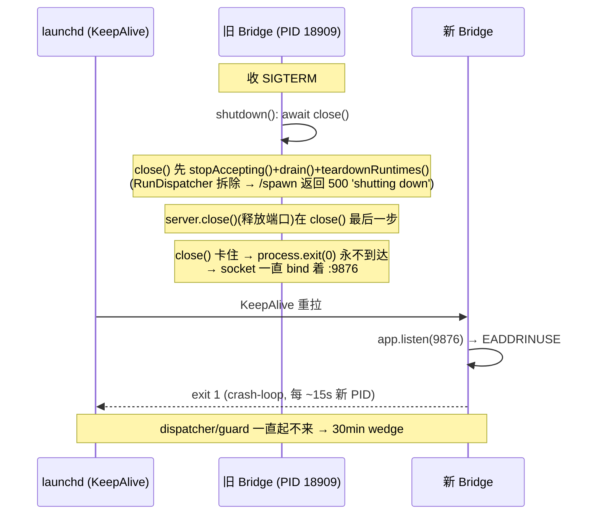

# Plan: 硬化 Bridge 重启 — 防 orphan Bridge 霸占端口的僵尸 wedge

**Version**: v1.56.0 (tentative — reconcile at ship; FLY-510 also targets v1.56.0)
**Issue**: FLY-516
**Date**: 2026-06-23
**Source**: batch restart #2 事故 (2026-06-23, Asha 发现 / Cass 路由 / Annie 批)
**Status**: lead-approved (Annie NO-CODEX → Codex design review skipped; flywheel-eng-lead over-read APPROVED)
**Owner**: Tadashi (Flywheel Eng)

---

## 1. Problem

batch restart #2 后 RunDispatcher + routing guard 卡死、全队新 runner 起不来 ~30min。

**根因链路(已读码确认)**:



关键代码事实:

| 位置 | 现状 | 缺陷 |
|------|------|------|
| `scripts/run-bridge.ts` shutdown handler | `process.on("SIGTERM", shutdown)` → `await close(); process.exit(0)` | **无超时**。`close()` 卡住 → 进程永不退、端口永不释放 |
| `plugin.ts` `close()` (行 3030-3062) | `drain()` → `teardownRuntimes()` → … → `server.close()`(最后) | 端口释放在最后一步;前面任一 await 卡住,端口就一直占着 |
| `restart-services.sh` `stop_bridge()` | SIGTERM → poll `kill -0`(PID)→ SIGKILL 兜底 | **只按 PID kill,从不确认 :9876 真释放** |
| `flywheel-bridge-wrapper.sh` | PID-lock 防双启 | 僵尸卡在 `close()` 早期时 `/health` 仍返回 200,PID-lock 区分不了健康 vs 僵尸;且 `exec` 后 trap 失效,PID 文件常残留 |

**为什么本次需要人工 SIGKILL 18909/18934**:重启大概率走 launchd `kickstart -k` / `bootout`+`bootstrap`,SIGTERM 直接由 launchd 发给 node,**完全绕过 `stop_bridge` 的 SIGKILL 兜底**;而 wrapper 的 PID-lock 又因 `/health` 200 误判僵尸为健康 → launchd respawn 撞 EADDRINUSE crash-loop,无人擦屁股。

---

## 2. Goal / Non-Goal

**Goal**:让"旧 Bridge 收 SIGTERM 后没退干净、霸占端口"在结构上不可能再造成 wedge,且任何残留僵尸都能被下一次 launchd 启动**自愈**,抢不到端口时**fail-loud 告警**(不静默卡 30min)。

**Non-Goal**:
- 不改 `close()` 内部 drain/teardown 的业务逻辑(只加超时兜底 + 评估 reorder)。
- 不动 self-ship updater 的 marker/queue 语义(只确保它最终调用的 `restart-services.sh stop_bridge` 被硬化)。
- 不在本机现跑/现部署(Annie/Lead 约束:Bridge 改动随下次重启一起部署;本 issue 只**写代码 + hermetic 测试**)。

---

## 3. Design — 4 层 belt-and-suspenders

```mermaid
graph TD
    subgraph 治本 [治本: 让旧 Bridge 一定退]
        L0[Layer 0: run-bridge.ts 有界 shutdown<br/>race close vs ~20s 超时 → 超时 force exit(1)]
        L0s[Layer 0-support: plugin.ts /health 加 shuttingDown 字段]
    end
    subgraph 自愈 [自愈: 新启动抢回端口]
        L1[Layer 1: wrapper preflight<br/>端口空→exec / 健康→exit0 / 僵尸→等→KILL→exec]
    end
    subgraph 部署路径 [部署路径硬化]
        L2[Layer 2: stop_bridge 端口释放 poll<br/>PID kill 后确认 :9876 真空]
    end
    subgraph 兜底 [抢不到端口]
        L3[Layer 3: fail-loud<br/>meta-alert.sh + best-effort Discord]
    end
    L0 --> L1 --> L2 --> L3
    L0s -.-> L1
```

### Layer 0 — `run-bridge.ts` 有界 shutdown(治本)

把无超时的 `await close()` 改成 race 超时:

```ts
const SHUTDOWN_TIMEOUT_MS = Number(
  process.env.FLYWHEEL_BRIDGE_SHUTDOWN_TIMEOUT_MS ?? 20_000,
);
const shutdown = async () => {
  if (shuttingDown) return;
  shuttingDown = true;
  console.log("[run-bridge] Shutting down...");
  let timed = false;
  const timer = setTimeout(() => {
    timed = true;
    console.error(
      `[run-bridge] close() exceeded ${SHUTDOWN_TIMEOUT_MS}ms — forcing exit to release port`,
    );
    process.exit(1); // 端口随进程死亡释放 → launchd 拉干净
  }, SHUTDOWN_TIMEOUT_MS);
  timer.unref?.();
  try {
    await close();
  } catch (err) {
    console.error("[run-bridge] close() threw:", (err as Error).message);
  } finally {
    if (!timed) {
      clearTimeout(timer);
      process.exit(0);
    }
  }
};
```

- **超时 ~20s** 选取理由(Lead ①):必须 **> 正常 drain 时间**,正常重启走干净 drain(秒级)永不撞 timeout;只有真卡才 force exit。env `FLYWHEEL_BRIDGE_SHUTDOWN_TIMEOUT_MS` 可调。
- force exit 用 `exit(1)`(异常关闭信号),区别于正常 `exit(0)`。

### Layer 0-support — `plugin.ts` `/health` 加 `shuttingDown`(Lead ③)

`startBridge` scope 内加 `let shuttingDown = false;`,`close()` 开头置 `shuttingDown = true;`,`/health` 闭包引用之(同作用域,零 plumbing):

```ts
app.get("/health", (_req, res) => {
  const active = store.getActiveSessions();
  res.json({
    ok: !shuttingDown,           // 关闭中不再自称 ready
    shuttingDown,                // additive 字段:wrapper 区分健康 vs 僵尸的关键
    uptime: process.uptime(),
    sessions_count: active.length,
  });
});
```

- **additive**:正常运行 `shuttingDown:false`、`ok:true`,现有 `bridge.test.ts`(只断言 200 + `sessions_count`)字节兼容。
- `ok` 在关闭中翻 false:`restart-services.sh` 部署后 health check `jq -e '.ok'` 因此正确把"将死 Bridge"判为 not-ready(更正确,无回归——部署 health check 只在新 Bridge 起来后跑)。

### §3.1 关于 Lead ② — 把 `server.close()` 提前?(已权衡,**推荐不 reorder**)

Lead 建议把 `server.close()`(释放端口)提前到 `teardownRuntimes()` 之前,让 teardown 卡时端口也早释放。

**权衡结论:不 reorder,靠 Layer 0 超时兜底。** 理由:

| | 现状 + Layer0 超时 | reorder(端口早释放) |
|---|---|---|
| 端口占用窗口 | 真实 drain 时间(秒级),最坏 ~20s force-exit | ~ms(立即) |
| 进程共存 | **无**:旧进程持端口直到退出,新 Bridge 此前起不来 | **有**:端口早释放 → launchd 立刻拉新 Bridge,而旧进程仍在 teardown |
| 共存风险 | — | StateStore = `sql.js`(内存 WASM,写时落盘),两进程各持内存副本并发写同一文件 → last-writer-wins **损坏风险**;`audit.db`/tmux teardown 也可能与新 Bridge 抢 |

`sql.js` 的双进程写文件损坏风险 > "端口早释放几秒"的收益。Layer 0 超时已保证端口在 ~20s 内必释放(正常秒级),而 Layer 1 wrapper preflight 让这期间的 respawn **无缝**(见下),用户可见的 wedge 已消除。**故端口早释放的收益边际很小,不值损坏风险。** 若 Lead/Codex 坚持 reorder,可只把 `server.close()` 移到 teardown **之前**并保留超时,但必须额外加"旧进程退出前不得写 StateStore"的护栏——复杂度陡增,本 plan 不采。

### Layer 1 — `flywheel-bridge-wrapper.sh` 端口 preflight(ask #2)

`exec` 之前插入端口 preflight(PID-lock 保留为快速双启短路,但端口逻辑是权威):

```
probe = bp_probe_health($BRIDGE_URL)   # healthy | shutting_down | down
listeners = bp_port_listeners($PORT)
case:
  端口空(无 listener)                      → exec(正常路径)
  有 listener 且 probe==healthy            → 已有健康 Bridge 在跑 → exit 0(防双启)
  有 listener 且 probe∈{shutting_down,down}→ 僵尸/将死:
       先 bp_wait_port_free(端口, ~25s)    # 给 Layer0 优雅退出留时间(尊重 in-flight drain)
       仍占 → bp_reclaim_port(TERM→等→KILL→poll free)
       端口空 → exec
       实在抢不到 → fail-loud(Layer 3)+ exit 1
```

- **先等后杀**(不一上来就 KILL):尊重 Layer 0 的优雅 drain;只有超过 Layer0 超时 + margin(~25s)仍占着的**真·hung** 才 KILL。正常路径 wrapper 在端口一释放就 bind,无 25s 等待。
- 替代脆弱的 PID-lock 误判:`probe==healthy`(`ok:true && !shuttingDown`)才认定健康;`shuttingDown:true` 或连不上 → 判僵尸。
- **start-rate crash-loop 守卫**:wrapper 记录最近启动时间戳(`~/.flywheel/state/bridge-wrapper-starts`),若 window 内启动 ≥N 次(如 60s 内 ≥3 次)→ fail-loud(Layer 3),捕捉任何来源的 crash-loop。

### Layer 2 — `restart-services.sh` `stop_bridge` 端口释放 poll(ask #1)

现有 PID TERM/KILL 之后,新增端口释放确认:

```
（现有 SIGTERM → poll kill -0 → SIGKILL 兜底 不变）
+ bp_wait_port_free($PORT, ~10s)
+ 若仍占 → 找当前 listener PID 再 kill -9 → 再 poll
+ 仍占 → fail-loud(Layer 3）；不 return 0（让 deploy 知道没干净）
```

覆盖 `start_bridge` 的 **legacy nohup 分支**(不走 wrapper,只有 Layer 2 保护它);launchd kickstart 分支则由 Layer 1 兜底。

### Layer 3 — fail-loud(ask #3,Lead ④)

抢不到端口 / crash-loop → 双通道告警(**别依赖将死的 Bridge**):
- `scripts/meta-alert.sh <reason> <title> <body>`:Bridge-independent(desktop notification + `<state>/meta-alert/<reason>.txt`),自带 per-reason 去抖,**保证可达**。
- best-effort Discord:复用 `restart-services.sh` 已有 `notify_discord()`(core channel);wrapper 侧若 `.env` 有 `DISCORD_CORE_CHANNEL` + token 则直接 curl,失败不阻塞。

reason 取 `bridge_port_stuck` / `bridge_crash_loop`,关联 FLY-368 渠道语义。

### §3.2 共享 lib — `scripts/lib/bridge-port.sh`(Lead ⑤)

可 source、纯函数 + 可注入 seam(照 `restart-candidate.sh` 惯例),被 wrapper + restart-services.sh 共用,hermetic 单测覆盖:

```bash
# seams（测试注入 lsof / kill / curl / sleep）
_bp_listeners() { lsof -nP -iTCP:"$1" -sTCP:LISTEN -t 2>/dev/null || true; }
_bp_kill()      { kill "$@" 2>/dev/null; }
_bp_curl()      { curl -sf --max-time 2 "$@"; }
_bp_sleep()     { sleep "$1"; }

bp_port_listeners(port)            # echo listener PIDs
bp_port_is_free(port)             # rc 0 = free
bp_wait_port_free(port, timeout)  # poll 直到空或超时;rc 0=空 1=仍占
bp_reclaim_port(port, term_wait, kill_wait)  # TERM→wait→KILL→poll;rc 0=已释放 1=抢不到
bp_probe_health(url)              # echo healthy|shutting_down|down（解析 /health json）
```

所有 sleep/poll 经 seam → 测试零真实等待(hermetic)。

---

## 4. Files Touched

| File | Change | Layer |
|------|--------|-------|
| `scripts/lib/bridge-port.sh` | **NEW** sourceable 端口 helper + seam | shared |
| `scripts/run-bridge.ts` | 有界 shutdown(race close vs 超时) | 0 |
| `packages/teamlead/src/bridge/plugin.ts` | `shuttingDown` flag + `/health` additive 字段 | 0-support |
| `scripts/flywheel-bridge-wrapper.sh` | 端口 preflight + crash-loop 守卫 + fail-loud | 1,3 |
| `scripts/restart-services.sh` | `stop_bridge` 端口释放 poll + fail-loud;source lib | 2,3 |
| `scripts/__tests__/bridge-port.test.sh` | **NEW** hermetic lib 单测 | test |
| `scripts/__tests__/bridge-wrapper-preflight.test.sh` | **NEW** wrapper preflight 决策单测(copy-unit 惯例) | test |
| `scripts/__tests__/restart-stop-bridge-portfree.test.sh` | **NEW** stop_bridge poll 单测 | test |
| `packages/teamlead/src/__tests__/bridge.test.ts` | 加 `/health` shuttingDown 断言(健康态 + 关闭态) | test |

---

## 5. Test Plan(TDD,hermetic — Lead ⑤⚠️)

**全程不在本机现跑 Bridge / 不真重启**(Lead ⚠️,同 FLY-519)。仅写代码 + hermetic 测试。

### 5.1 `bridge-port.sh` 单测(seam 注入,零真实 IO)
- `bp_port_is_free`:无 listener → free;有 → not free。
- `bp_wait_port_free`:注入 listener 序列(占,占,空)→ 在第 3 次返回 0;一直占 → 超时返回 1。
- `bp_reclaim_port`:注入"TERM 后第 2 次 poll 释放" → 返回 0 且只发 TERM;"TERM 无效、KILL 后释放" → 验证发了 KILL;"KILL 后仍占" → 返回 1。
- `bp_probe_health`:注入 `/health` json(`ok:true,shuttingDown:false`→healthy;`shuttingDown:true`→shutting_down;curl 失败→down)。

### 5.2 wrapper preflight 决策单测(copy-unit)
- 端口空 → 走 exec 分支(注入一个假 exec sentinel)。
- 端口占 + healthy → exit 0,不 kill。
- 端口占 + shutting_down,端口随后释放 → 等到释放后 exec,**未 KILL**。
- 端口占 + down 且一直占 → reclaim 调到 KILL → 释放 → exec。
- 端口占 + 永不释放 → fail-loud sentinel 触发 + exit 1。
- crash-loop:注入 60s 内第 3 次启动 → fail-loud sentinel。

### 5.3 `stop_bridge` poll 单测(copy-unit,沿用 `restart-stabilization.test.sh` 惯例)
- PID 已死但端口注入"释放" → poll 一次返回、不告警。
- PID 死但端口仍被新 listener 占 → 再 kill → 释放。
- 端口永不释放 → fail-loud sentinel 触发。

### 5.4 Bridge `/health` 单测(vitest)
- 正常态:`ok:true, shuttingDown:false`(扩充现有 T)。
- 关闭中(置 `shuttingDown=true` 后):`ok:false, shuttingDown:true`,HTTP 仍 200(additive,不破坏 byte-compat 形状)。

### 5.5 全仓
- `pnpm lint`(全仓 biome,见 feedback_lint_and_ci_hygiene)。
- `pnpm build`(teamlead 改了 TS)。
- 受影响 vitest 包 + 所有新/改 `*.test.sh`。

---

## 6. Risks

| Risk | Mitigation |
|------|-----------|
| Layer 0 force-exit 打断 in-flight runner teardown | 超时 ~20s 足够正常 drain;且 FLY-172 heartbeat reconcile 已让重启不误杀活 runner;hang 30min 远比强退坏 |
| wrapper 误 KILL 健康 Bridge(双启竞态) | `probe==healthy` 才 exit-0 让路;只 KILL `down`/`shutting_down` 且超 ~25s 仍占的 |
| 端口 helper 在不同 macOS lsof 版本行为差 | seam 化 + 真实只用 `lsof -t`(最稳子集);失败 fail-open 当端口空(不阻塞启动) |
| 部署窗口:Bridge 改动须随下次重启生效 | plan 标注;Lead 协调 batched restart;本 issue 不现跑 |

---

## 7. Rollout

1. plan → Codex design review → Lead 过目。
2. TDD 实现(RED→GREEN),hermetic 测试,`pnpm lint`+`build`。
3. PR → Codex code review → approve gate。
4. **部署随下次 batched Bridge restart**(Bridge 改动生效需重启);merge 后由 self-ship/restart-services 走新 `stop_bridge`,新 wrapper 在首次 launchd 启动即生效。

---

## 8. Open Questions(Codex/Lead)

1. 超时默认值 20s 合适?(正常 drain 实测多久?保守取 20s。)
2. crash-loop 守卫阈值 60s/3 次合适,还是更宽?
3. §3.1 reorder 推荐"不做",Codex 是否同意共存损坏风险的判断?
