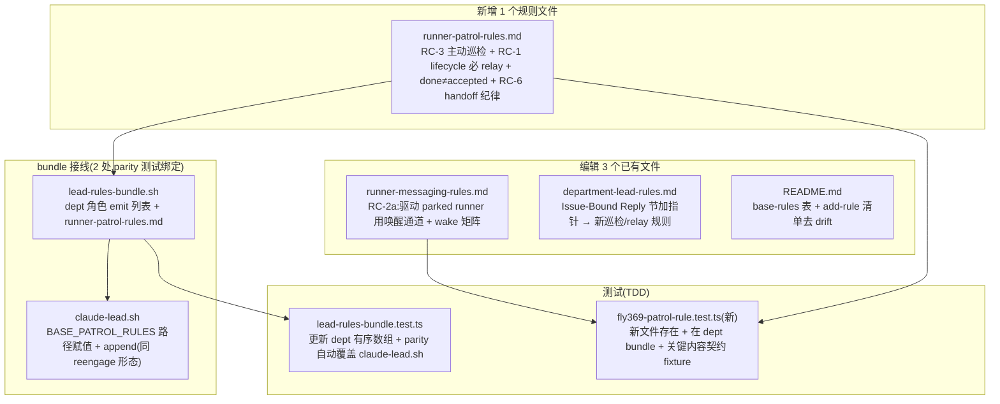

# Plan: FLY-369 follow-up — Lead 状态回传 + 唤醒纪律 + 主动巡检(RC-1/2/3/6)

**Version**: v1.58.0 (暂定 — ship 时按当时 main re-version)
**Issue**: FLY-369 (Urgent) — Retro + fix: Lead 没把 runner 状态回传 founder + parked runner 不被驱动
**Date**: 2026-06-25
**Source**: `doc/retro/20260620-FLY-369-runner-relay-wake-archive.md`(§4/§5 已把本批工作定为 follow-up PR)
**Status**: codex-approved (Codex design review 2 rounds → APPROVED, 2026-06-25)

---

## 1. 背景与定位

FLY-369 的 Retro(已在 main)把 6 个根因拆成两批:

- **PR #304(已 merge,issue 已标 Done)= RC-5 archive-on-close**(中央 close 级联归档 + Bridge endpoint)。
- **本 follow-up PR = RC-1 / RC-2 / RC-3 / RC-6**,PR #304 正文原话:「The Lead-behavior rule changes (RC-1/2/3/6) + the `respond`-wake CLI fix are split to a follow-up PR.」

Lead(Tadashi)brainstorm gate 已确认:① 在已 Done 的 FLY-369 上开 follow-up PR(不另开 issue);② RC-2 代码取 (b)——FLY-142 已交付 ask-wake,本 PR **不碰**安全敏感的 `respond` CLI,只补 Lead 规则;③ 本 PR = Lead-rules(doc)+ 测试为主,主动巡检只给 Lead 纪律、**不造引擎**(引擎归 FLY-271/368)。

Lead 追加优先级(刚 live 撞到的 FLY-576):runner 一完成就被系统自动标 Done、但**验收没达成**,founder 看到一个*假*完成。所以 RC-1 的状态回传规则必须明确区分**「runner 交了活」vs「验收达成/可标 Done」**。

---

## 2. 现状审计(已 grep 主 runtime,带证据)

| 根因 | 现状(代码/规则证据) | 本 PR 要补的缺口 |
|------|------|------|
| **RC-1 回传断层** | `department-lead-rules.md` §"Issue-Bound Reply (FLY-162)" 已要求「每条绑定 issue 的 Lead 回复走 `POST /api/chat-threads/send`」;但它框在「回复」,**没把每个 runner lifecycle 事件强约束成必 relay**,也没区分「交活」vs「验收达成」。 | 把 lifecycle 事件(completed / failed / stuck / question / parked-awaiting-lead)的 relay 升成**非可选 checklist** + **runner-done ≠ issue-accepted** 纪律。 |
| **RC-2 respond 不唤醒** | **代码已由 FLY-142 #306(6-23,retro 6-20 之后)大部分修复**:`respond.ts` 现调 `wakeAskedRunnerBestEffort`(checkpoint-less `ask` → 唤醒 idle runner,vendor-neutral)。残留窄口:Claude runner parked 在非-`approve_to_ship` 的 no-block gate 上,`respond` 不唤醒(`respond-wake.test.ts:111` 现断言此为**预期**——理由 blocking gate 自己 poll)。 | **不碰代码**(Lead 已定 (b))。只补 Lead 规则:驱动 parked runner 一律用会唤醒的通道(`SendMessage`/`send`),不用 `respond` 回非-gate。 |
| **RC-3 无主动巡检** | 反应式检测齐全但都是 Bridge 探到才 emit 给 Lead inbox:`RunnerIdleWatchdog`(FLY-92)、`StuckRunnerDetector`(FLY-195)、`HeartbeatService`(FLY-172)、`GatePoller`(FLY-208)。`runner-reengage-rules.md`(FLY-229)+ `stuck-runner-remanage.md`(FLY-195)都是**被动响应事件**。**无任何「Lead 周期主动盘点自己所有 runner」规则**;现成工具 `runner_terminal_list`(分类 running / parked-alive / dead)可直接复用。 | 新增主动巡检纪律(cadence + 检查项 + 逐类动作),**复用** `runner_terminal_list`,引擎归 FLY-271/368。 |
| **RC-6 handoff 丢上下文** | 无规则。 | 续/handoff runner dispatch 纪律:显式命令先读 committed plan + 分支 commits,核对第一个 brainstorm 对齐既定设计再 greenlight。 |

**关于「自动标 Done」(Lead 要我先在计划里标出来):**
grep 全仓 `updateIssue` / state 转换的精确结论:
- **没有任何 *autonomous*(runner 完成 / PR merge 自动触发)的 Flywheel 路径把 Linear issue 翻到 Done。** 唯一**自动**的仓库侧 state 转换是 `EdgeWorker.moveIssueToStartedState`(分配时 → In Progress,`EdgeWorker.ts:3848-3877`,只挑 `type === "started"`)。
- **但存在一个*手动*的 Bridge Linear 写代理**:`PATCH /api/linear/update-issue`(`plugin.ts:1693-1750`,token-authed)——若调用方传 `status` 名,它按 state 名 resolve 成 `stateId` 并 `client.updateIssue`,**能**把 issue 翻到任意状态(含 Done)。这是显式调用、非自动。
- 「自动标 Done」最可能是 **Linear 原生 GitHub 集成(linked PR/branch merge → Done)** 的 workspace 设置:**FLY-369 自己** 2026-06-21T02:39:**58** 标 Done、PR #304 02:39:**56** merge(差 2 秒)且 PR #304 `closingIssuesReferences` 为空(靠 `xrliannie/fly-369-…` 分支名链接)。

> **结论 / 给 Lead 的决策点**:本 PR **不改任何 Bridge 行为**——没有可改的 Flywheel *自动*-Done 代码。RC-1 用 **Lead 纪律**兜:① Lead 把「PR merged / Linear 自动 Done」当「已交付/已 ship」而非「验收达成」;② **只在显式的验收纠正 / founder-directed 状态纠正**时,才用上面那个手动代理 set/reopen 状态(正如你对 FLY-576 reopen——这是规则鼓励的纠正动作,不是禁止)。若想从源头关掉 Linear 的 PR-merge 自动-Done,那是 Linear workspace 设置(本仓范围外)——需请你拍。**本计划不擅自做任何 Bridge / 代码改动。**

---

## 3. 设计(全部 = `packages/teamlead/lead-rules-base/` 规则层,不动现有代码路径)

### 3.1 交付物总览

### 3.2 新文件:`runner-patrol-rules.md`(RC-1 + RC-3 + RC-6 的内聚归宿)

放在 dept bundle 中、紧跟 `runner-reengage-rules.md` 之后(同属 runner-lifecycle 纪律簇)。内容分节:

- **§1 主动巡检(RC-3)** —— Lead 周期性 sweep 自己所有 runner。
  - **触发**:每次 Lead 被唤醒处理一批 inbox 后(自然 cadence,无新 timer)+ 任务边界(开始新 subtask / commit 前)。明确:这是**主动盘点**,不是等 escalation。
  - **工具(起点,非 oracle)**:`runner_terminal_list` 是 sweep 的**起点**,分类 = CommDB status + live tmux probe(**不是** Bridge FSM / Linear 完成状态,见 `runner-reengage-rules.md:8-19`)。明确:它给「有哪些 runner、活没活着」,**不是验收 oracle**。
  - **逐类动作表**:`running` → 看进度新鲜度,陈旧则 relay/judge(交叉 `stuck-runner-remanage.md`);`parked-alive` → 按 `runner-reengage-rules.md` re-engage 或收尾,**绝不**晾着;`dead`/done-lingering → 收尾(交叉 FLY-324 `done-running-reconciler` + RC-5 archive)。
  - **close / reopen / 改 Linear 状态前必须 cross-check**:不能只凭 `runner_terminal_list`。收尾或动状态前,核对 issue thread + session 状态 + PR/commit 证据 + founder/QA 验收,再决定 close runner 或改 Linear status。
  - **边界**:本规则只给 Lead **纪律**;自动巡检引擎(529/模型不可用/pane 冻结的探测与自动恢复)归 **FLY-271 / FLY-368**,本文件显式注明不在此造引擎。
- **§2 每个 lifecycle 事件强制 relay(RC-1)** —— 非可选 checklist。
  - 事件清单:`session_completed` / `session_failed` / `runner_stuck_escalation` / `runner_question` / parked-awaiting-lead。每个事件 Lead **必须**把状态 relay 到 `[FLY-XX]` thread(走 `/api/chat-threads/send`,机制细节指向 `department-lead-rules.md` §Issue-Bound Reply,不重复 curl 样板)。
  - **runner-done ≠ issue-accepted(FLY-576 教训,Lead 拍的优先级)**:Lead 报状态必须区分三态——「runner 交了活(PR open / merged)」、「验收达成(QA/founder accept)」、「可标 Done」。**绝不**把「runner done / Linear 自动 Done」当「验收达成」报给 founder。Linear 自动-Done 是 PR-merge 触发、非验收信号;验收没达成 → 在 thread 说清真实状态,并**作为显式验收纠正** reopen(可用手动 `PATCH /api/linear/update-issue` 代理改 status——这是允许的纠正动作,不是禁止;但**只**在验收/founder-directed 纠正时用,不当日常状态机)。
- **§3 驱动 parked runner 用唤醒通道(RC-2a,backend-自含)** —— 必须在 commdb rollback 下也自洽(本文件两个 backend 都加载,而 `runner-messaging-rules.md` 在 commdb 被跳过):规则正文给出「用当前 backend 的唤醒通道驱动 parked runner」——mailbox 模式 = `SendMessage` / `flywheel-comm send`,commdb rollback = legacy `flywheel-comm send`;**绝不**用 `respond` 当日常 driver。完整 wake 矩阵指向 `runner-messaging-rules.md`(mailbox 路径),但本节的核心规则不依赖那份文件被加载。
- **§4 续/handoff runner 纪律(RC-6)** —— dispatch 续-runner 时显式命令:先读 committed plan + 分支 commits;**核对它第一个 brainstorm 与既定设计对齐再 greenlight**,别 rubber-stamp(FLY-350 教训)。

### 3.3 编辑 `runner-messaging-rules.md`(RC-2a 权威内容)

在现有「Hard gate responses → `respond`」之后加一小节 **「Driving a parked / idle runner — use a waking channel」**:
- 规则:要驱动/解锁一个 parked(awaiting-lead / idle)runner,用**会唤醒**的通道(`SendMessage` MCP / `flywheel-comm send`)。**不要**用 `flywheel-comm respond` 去回一个非-gate 的问题来「驱动」它 —— `respond` 对非-gate checkpoint 不写 mailbox、静默不唤醒。
- **wake 矩阵**(反映 FLY-142 后的真相 + Codex R1 #3 补全 Codex marker 路径):

  | 路径 | 唤醒? | 说明 |
  |---|---:|---|
  | `send` / `SendMessage` | ✅ | 日常 driver 通道 |
  | `respond` 回真·`ask`(checkpoint-less) | ✅ | FLY-142 `wakeAskedRunnerBestEffort` |
  | `respond` 回 **有 marker 的 no-block gate**(Codex) | ✅ | `wakeNoBlockGateRunnerBestEffort`(marker 路径) |
  | `respond` 回 **无 marker 的非-approve checkpoint**(Claude) | ❌ | byte-compat;blocking gate 自己 poll |
  | `respond` 回 `approve_to_ship` | ✅ | Bridge / bypass 路径(带 founder-consent 边界) |

  规则仍是「别用 `respond` 驱动 parked runner」,但矩阵**不抹掉** Codex no-block gate 的 marker 唤醒路径(否则与代码不符)。
- 一句明确:`respond` 仍只用于 **gate 应答**(`approve_to_ship` / `clarify_question` 等),不当「驱动 runner」的通道。

### 3.4 编辑 `department-lead-rules.md`(可发现性指针,最小改)

在 §"Issue-Bound Reply (FLY-162)" 末尾加一行指针:每个 runner lifecycle 事件必 relay + runner-done ≠ issue-accepted 的完整纪律见 `runner-patrol-rules.md`。**不重复内容**,只让主规则文档可发现新规则。

### 3.5 bundle 接线(2 处 + parity 测试绑定)

`runner-patrol-rules.md` 必须同时进**两处**,否则 `lead-rules-bundle.test.ts` 的 parity 测试会红:
1. `lead-rules-bundle.sh` — `dept` 角色 emit 列表,插在 `runner-reengage-rules.md` 之后、`doc-flow-rules.md` 之前(`_lrb_emit "${base}/runner-patrol-rules.md" 0 || return 10`)。
2. `claude-lead.sh` — 镜像 `runner-reengage-rules.md` 的形态:`BASE_PATROL_RULES="${BASE_RULES_DIR}/runner-patrol-rules.md"` + `if [ -f ] && [ -r ]` → `CLAUDE_ARGS+=(--append-system-prompt-file ...)`,放在 reengage append 之后、doc-flow 之前(parity 测试要求路径赋值顺序单调)。
   - 位置在非-cos(`IS_COS_ROLE=false`)分支内 → **cos 不加载**(巡检/relay 是 dept Lead 管 runner 的纪律;cos `canSpawnRunners:false` 不需要)。

### 3.6 编辑 `lead-rules-base/README.md`(防文档 drift,Codex R1 #4)

README 现有「add a new base rule」清单(README:67-72)仍说要更新它的表 + `test-fly26-rules-split.sh`,与本 PR 实际测试策略(`lead-rules-bundle.test.ts` 为主 gate)矛盾。最小修:
- README 的 base-rules 表加一行 `runner-patrol-rules.md`(dept-only)。
- add-rule 清单改成点名 `lead-rules-bundle.test.ts`(pinned order + parity)为**主 gate**;`test-fly26-rules-split.sh`(模拟器已相对现代 claude-lead.sh 陈旧)降为非主。不留文档与实际流程互相矛盾。

### 3.7 字节兼容 / 安全

- 纯新增规则文件 + 两处可选 append(`-f && -r` 守卫,缺文件 no-op = 旧 checkout 向后兼容,同现有所有 BASE_* 规则)。
- **不动**任何 `.ts` 运行时代码、不动 `respond.ts`/`wake.ts`、不动 Bridge、不改 `decisionMode`、不碰 Linear 自动-Done。生产行为零变化,除了 dept Lead 多加载一份规则文本(下次 Lead spawn / resume 即生效,**无需 Bridge 重启**;规则在 Lead 启动时 append)。
- companion / cos 角色不受影响(只 dept 分支加载)。

---

## 4. TDD 测试计划

**RED → GREEN**:

1. **`lead-rules-bundle.test.ts`(改现有 pinned 数组)**:在 dept(mailbox)有序数组里 `runner-reengage-rules.md` 之后插入 `runner-patrol-rules.md`。先改测试 → 跑红(resolver 还没 emit)→ 改 `lead-rules-bundle.sh` + `claude-lead.sh` + 建文件 → 绿。parity 两测(every file referenced by claude-lead.sh + 顺序单调)自动覆盖 claude-lead.sh 接线。**另加 commdb dept 断言(Codex R1 #2)**:现有 commdb 测试只检查前两个名字,补一条 `expect(names).toContain("runner-patrol-rules.md")` **且** `expect(names).not.toContain("runner-messaging-rules.md")`,把「patrol 在两 backend 都加载、messaging 仅 mailbox」钉死。
2. **`fly369-patrol-rule.test.ts`(新,镜像 `fly222-memory-rule.test.ts` 形态)** 契约 fixture:
   - 新文件存在;`claude-lead.sh` 在非-cos 分支引用 `BASE_PATROL_RULES`(index 在 `BASE_COS_RULES` 之前 = dept-only)。
   - 内容契约(防未来 trim 误删):§1 含 `runner_terminal_list` + `parked-alive` + 「主动/周期」措辞 + 「引擎归 FLY-271 / FLY-368」边界;§2 含 lifecycle 事件名 + 「runner-done ≠ issue-accepted / 验收」+ FLY-576;§3 指向 `runner-messaging-rules.md`;§4 含「committed plan」+「brainstorm 对齐」。
   - `runner-messaging-rules.md` 含 parked-runner 唤醒通道规则(`send`/`SendMessage`)+ 「不用 `respond` 驱动非-gate」+ wake 矩阵关键行。
3. 全仓 `pnpm lint`(biome)+ `pnpm --filter flywheel-teamlead test`(至少跑改动的两个测试文件,机器负载高时单跑文件)+ `pnpm --filter flywheel-teamlead build`(typecheck)。

**验收映射(诚实表述,Codex R1 #5 —— doc 规则提供*纪律覆盖*,非硬保证;硬保证靠 FLY-271/368 自动化)**:
- 「runner 每个 lifecycle 事件都有**强制 relay 的规则覆盖** + done≠accepted 硬区分」(§2 RC-1)——不声称字面「总能/always」。
- 「**明令禁止**用 `respond` 驱动 parked runner、给出正确唤醒通道」(§3 RC-2a + `runner-messaging-rules.md`)——不声称字面「永不 hang」。
- 「Lead 有**主动周期巡检**的纪律 + 起点工具」(§1 RC-3)。
- 「续-runner dispatch 有**读 committed plan + 核对 brainstorm** 的纪律」(§4 RC-6)。
- 真正的 always/never 硬保证(自动 relay / 自动巡检引擎)= FLY-271 / FLY-368,本 PR 显式不做。

---

## 5. 边界 / 责任划分

- **本 PR**:Lead 侧**行为 + 纪律**(回传必 relay、done≠accepted、用唤醒通道、主动巡检、handoff 读 plan)。
- **FLY-271 / FLY-368**:自动化引擎 / 统一 Alert Channel / auto-repair Bot(stuck 感知、自动恢复、nudge/fix/报告)。本 PR 显式不造引擎。
- **FLY-142**(已 merge):`respond` ask-wake 代码 —— 本 PR 不重做、不碰。
- **FLY-324**(已 merge):lingering-completed reconciler —— RC-4 残留并入巡检收尾纪律,本 PR 不重啃代码。
- **Linear 自动-Done**:Linear workspace 设置(非本仓代码);如需从源头改请 Lead/founder 拍。

---

## 6. 风险 / 取舍

- **「规则没人执行」风险**:RC-1 本就是「规则在但执行没到位」(retro §3 原话)。缓解:做成**非可选 checklist** + 主动巡检里把 relay 当每轮必做项 + done≠accepted 写成硬区分。规则强度提升,但根治靠 FLY-271/368 的自动化兜底(已划清边界)。
- **bundle 顺序回归**:pinned 数组 + parity 测试是双保险;漏改任一处 = 测试红,不会静默 drift。
- **规则文本膨胀**:dept Lead system prompt 多一份文件。控制:新文件聚焦、§3 用指针不重复 messaging 内容、department-lead-rules 只加一行指针。
