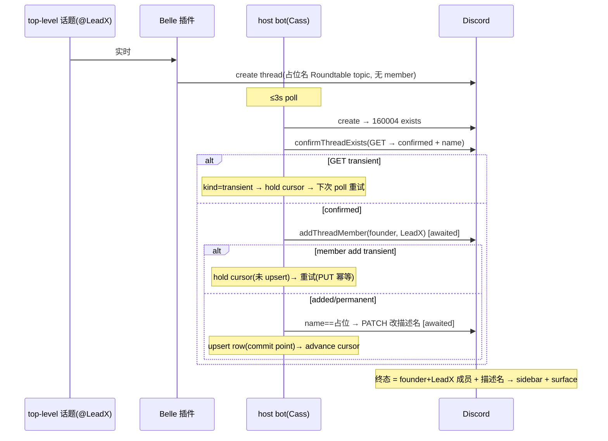

# Plan: Roundtable 自动 thread 成员资格 + surfacing + 描述性命名 — FLY-576

**Version**: v1.59.0 (tentative — ship 时取空号)
**Issue**: FLY-576
**Date**: 2026-06-25
**Source**: `doc/engineer/research/new/FLY-576-roundtable-thread-membership.md`
**Status**: codex-approved (Codex design review 2 轮 APPROVED — R1 reliability/idempotency 修订并入,R2 无 blocking issue)

---

## 1. 目标 / 非目标

**目标**:#leads-roundtable 自动开的 topic thread →(1)founder + 被 @ 的 lead 都成 thread member → 进各自 sidebar + 后续消息 surface(不靠逐条 @);(2)thread 名描述性而非通用 `Roundtable topic`。**终态收敛**(不能因一次 transient 失败永久漏)。

**非目标**:
- 不碰 reply / 继续讨论的判定逻辑(reply-guard / mention-gate / `decideTopicThreadHandling` / autoContinue) → **防 melee**(知情 ≠ 自动回)。
- **不改 Belle 插件**(token-isolated + 独立 repo + Tier-3 fleet 重启)→ 描述性命名 follow-up = **FLY-578**。Lead 已拍 scope。
- **不监听 thread 内部消息** → 线程里 @ 一个新 lead **不会**把他加成 member(manager 只 poll parent channel 顶层消息)。这是已知边界(见 §4.4 / follow-up)。

---

## 2. 根因回顾(详见 research)

生产 host bot(`RoundtableThreadManager`)已启用(`any_top_level`、Aunt Cass)。两缺口:
1. **founder 永不加**:host bot 只读 `FLYWHEEL_ROUNDTABLE_MEMBER_USER_IDS`(生产空)。被 @ 的 lead 已被加(`msg.mentions`)。
2. **命名通用**:Belle 插件实时 gateway 通常赢 create race、硬编码 `Roundtable topic`;host bot recovery(160004 exists)补 member 但**不改名**。

修复集中在 **host bot**(它 ≤3s 内必处理每条 top-level → 落到补 member 分支)。镜像已工作的 `ChatThreadCreator`(founder=`DISCORD_OWNER_USER_ID` 成员 + placeholder-rename + reuse 时重加 owner)。

---

## 3. 改动清单(全部本仓 `packages/teamlead/`)

| 文件 | 改动 |
|---|---|
| `bridge/roundtable/roundtable-config.ts` | `RoundtableConfig` 加 `founderUserId?`,从 `DISCORD_OWNER_USER_ID` 解析 + snowflake 校验 |
| `bridge/chat-thread-utils.ts` | `addThreadMember` 返回分类结果(added/transient/permanent)+ 加 5s bounded timeout |
| `bridge/roundtable/RoundtableThreadManager.ts` | member set 并入 founder;描述性命名;`confirmThreadExists` 分类;**关键步骤 awaited + cursor-gating + DB upsert 作 commit point** |
| `bridge/plugin.ts` | wiring 传 `founderUserId` |
| `lead-rules-base/cross-dept-channel-rules.md` | B 纪律:顶层 @ 全部想要的 lead(不 overclaim thread 内拉人) |
| `bridge/roundtable/__tests__/*` | TDD 测试(含 transient-hold + 幂等 re-run) |

---

## 4. 详细设计

### 4.1 A — founder 成员(config)

**`roundtable-config.ts`** — 新增 founder 解析(与 `AlertChannelHub.founderId()` 同款校验):

```ts
export interface RoundtableConfig {
  // ...现有字段
  /** FLY-576: founder Discord id (from DISCORD_OWNER_USER_ID) — always pulled
   * into each topic thread as a member, like issue threads' ownerUserId. */
  founderUserId?: string;
}

// loadRoundtableConfig 内,在 ENABLED!=="1" 早退之后、return 前:
const founderRaw = (env.DISCORD_OWNER_USER_ID ?? "").trim();
const founderUserId = /^\d{17,20}$/.test(founderRaw) ? founderRaw : undefined;
// ...return { ..., founderUserId };
```

- `DISCORD_OWNER_USER_ID` = issue thread 同源(config.ts:136 已用、已工作、生产已设)。
- 未设 / 格式错 → `undefined` → 退回当前行为(只加 mentions),**绝不 throw**(字节兼容)。
- feature OFF 时 `loadRoundtableConfig` 在解析 founder **之前**早退返回 undefined(Codex R1#5:加测试断言)。

`RoundtableThreadManager` options 加 `founderUserId?: string` 存字段;member set 构造(单点):

```ts
const members = [
  ...new Set([this.founderUserId, ...this.memberUserIds, ...msg.mentions]),
].filter((id): id is string => Boolean(id) && id !== this.botUserId);
```

### 4.2 命名 — 描述性 + 清 mention markup

替换现有 `threadName()` 为清理 Discord markup 的纯函数:

```ts
const ROUNDTABLE_PLACEHOLDER_NAME = "Roundtable topic"; // = 插件硬编码值:fallback + rename 占位判据

private threadName(content: string): string {
  const cleaned = content
    .replace(/<a?:\w+:\d+>/g, "")  // custom emoji <:x:1> / <a:x:1>
    .replace(/<@[!&]?\d+>/g, "")   // user <@1>/<@!1> + role <@&1> mentions
    .replace(/<#\d+>/g, "")        // channel mentions <#1>
    .replace(/\s+/g, " ")
    .trim()
    .slice(0, 90);
  return (cleaned || ROUNDTABLE_PLACEHOLDER_NAME).slice(0, 100);
}
```

> **简化(刻意)**:名 = 话题摘要,**不含发起 lead 名**(host bot 只有 `authorId` snowflake,解析显示名需额外 API/roster;话题摘要已满足 Lead「话题/发起 lead 摘要」二选一)。发起 lead 名留 follow-up。

### 4.3 可靠性核心 — cursor-gating + commit-point(回应 Codex R1 HIGH-1 + HIGH-2)

**问题**:现状 `confirmThreadExists` 把所有 GET 失败塌成 false → exists 分支 advance;且 `persistAndDecorate` 先写 DB(dedup)再 fire-and-forget 装饰 → 一次 transient 失败或崩溃 = 永久漏 founder/改名,dedup 让后续 poll 跳过、**永不自愈**。

**修复原则**:DB upsert 作为 **commit point 放最后**;关键步骤(member add + 占位改名)**awaited + 分类**;transient → **hold cursor**(返回 false,下次 poll 重试,消息仍在 cursor 之后);permanent → warn + advance(retry 也没用,绝不 wedge)。dedup 只当**优化**(跳过已 commit 的消息),**不当安全属性**。

**`chat-thread-utils.ts` `addThreadMember`** → 返回分类结果(callers 如 ChatThreadCreator 可忽略返回值 = 向后兼容)+ 加 5s AbortController(现无 timeout,gating 用途必须 bounded):

```ts
export type AddMemberOutcome = "added" | "transient" | "permanent";
// 2xx/204 → "added";  401/403/404 → "permanent"(沿用 warn);
// 429/5xx/network/timeout → "transient"
export async function addThreadMember(...): Promise<AddMemberOutcome>
```

**`confirmThreadExists`** → 返回分类(不再 boolean):

```ts
type ConfirmResult =
  | { kind: "confirmed"; name?: string }  // 是本 channel 的 thread,带当前名
  | { kind: "absent" }                    // 200 但非 thread/非本 channel,或 404 → 无可做
  | { kind: "transient" };                // 429/5xx/network/timeout → hold
```

**`processMessage` 重构**(`created` 与 `exists` 都汇入 `commitThread`):

```ts
// dedup:row 已存在 ⟹ 关键步骤上次已 commit(因 upsert 在最后)→ 跳过
if (this.store.getRoundtableTopicThread(channel, msg.id)) return true;

switch (result.kind) {
  case "created":
    // 自建:名已是描述名 → currentName 传 descriptive(不触发改名)
    return await this.commitThread(msg, result.threadId, {
      seed: true, currentName: this.threadName(msg.content),
    });
  case "exists": {
    const conf = await this.confirmThreadExists(msg.id);
    if (conf.kind === "transient") return false;          // hold,重试
    if (conf.kind === "absent") { warn; return true; }    // 无可做,advance
    return await this.commitThread(msg, msg.id, {
      seed: false, currentName: conf.name,                // 插件留的占位名
    });
  }
  // deleted / auth / client_error → advance(同现状);transient → hold(同现状)
}
```

`commitThread(msg, threadId, { seed, currentName })`:

```ts
const members = /* founder ∪ memberUserIds ∪ mentions,过滤 */;
for (const id of members) {
  const r = await addThreadMember(threadId, id, this.botToken, { fetchImpl });
  if (r === "transient") return false;   // hold:未 commit,下次重试(PUT 幂等,已加的 no-op)
  // "permanent" → 已 warn,继续(retry 无用,不 wedge)
}
const desired = this.threadName(msg.content);
if (currentName === ROUNDTABLE_PLACEHOLDER_NAME && desired !== currentName) {
  const r = await this.renameThread(threadId, desired);
  if (r === "transient") return false;   // hold:名也要收敛
  // "permanent"(如 Cass 无 MANAGE_THREADS = 403)→ warn,继续(membership 已对,名留占位可接受)
}
this.store.upsertRoundtableTopicThread({ threadId, ... });  // ← commit point(最后)
if (seed) void this.seedThread(threadId);                   // best-effort,commit 后
return true;
```

`renameThread(threadId, name)` → 返回 `"renamed" | "transient" | "permanent"`(PATCH `/channels/{threadId}` {name},5s AbortController):2xx→renamed;401/403/404→permanent(warn);429/5xx/network/timeout→transient。

**崩溃安全**:upsert 在关键步骤成功后才执行;`return true` 才让 `pollOnce` advance cursor。任何中途崩溃 → row 未写、cursor 未进 → 下次重处理(create→160004 exists→confirm→重加 member,全幂等)。upsert 与 saveCursor 之间崩溃 → 重启 cursor 仍在旧值、消息被重 fetch → dedup 命中 row → advance(无重复、无 strand)。

### 4.4 B — lead 纪律(`cross-dept-channel-rules.md`)

「Topic threads」段补(补充、非唯一保险;**不 overclaim** thread 内 @ 拉人 — Codex R1#3):

> - **想让哪些 Lead 持续看到这个话题(进 sidebar + 后续消息 surface),就在发起话题的顶层消息里把他们都 @ 上**:被 @ 进顶层话题的 Lead(以及 founder)会被自动加成该 topic thread 的成员,之后不用每条再 @ 也能收到。
> - 已经开了的 thread **里面**再 @ 一个之前没被拉进来的 Lead,只是一次普通点名(他那一条会被推送),**不会**把他长期加成成员 —— 想长期把他带进来,在**顶层**新话题里 @ 他。

### 4.5 字节兼容 / 安全

- feature 默认 OFF → 不构造 manager → 零行为变化;founder 解析失败 → undefined → 退回「只加 mentions」、不 throw。
- `addThreadMember` 加 5s timeout 对 `ChatThreadCreator` 严格更安全(原无 bound),返回值新增、旧 caller 忽略 = 兼容。
- 不碰任何 reply/继续判定 → 防 melee 不变;`allowed_mentions` 不涉及(加 member 是 PUT thread-members、不发 @ 文本)。

---

## 5. 防 melee 边界(Lead 强调)

「surfaced/知情」≠「每条都自动回」。本修复**只**:加 member + 改名 + cursor 可靠性。**完全不碰** reply-guard / `mention-gate` / `decideTopicThreadHandling` / autoContinue(生产无 `THREAD_AUTOCONTINUE`,保持 OFF — Codex R1 已核)。成员收到=知情,回不回仍按现有 mention/relevance。

---

## 6. 测试计划(TDD)

**`roundtable-config.test.ts`**
- `DISCORD_OWNER_USER_ID` 合法 snowflake → `founderUserId` 设;未设/格式非法 → undefined。
- **feature OFF(ENABLED!=1)→ 返回 undefined,且不因 founder env 而变**(Codex R1#5)。

**`chat-thread-utils` (addThreadMember)**
- 2xx → "added";403/404 → "permanent";429/5xx/网络/超时 → "transient"。

**`RoundtableThreadManager.test.ts`**
- created:founder ∈ addThreadMember 调用集 + 含 mentions;名为描述性(清 markup);清空→fallback。
- exists + confirmed placeholder:补 founder/mentions member + PATCH rename(body.name==desired)。
- exists + confirmed 非占位名:补 member 但 **不** PATCH。
- **exists + GET transient(503/429/网络/超时)→ confirmThreadExists kind=transient → processMessage 返回 false(hold cursor),不 upsert**(Codex R1#1)。
- **member add transient → commitThread 返回 false(hold),不 upsert;下次 poll 重跑且 PUT 幂等**(Codex R1#2)。
- member add permanent(403)→ warn + 继续 + upsert(advance,不 wedge)。
- rename transient → hold;rename permanent(403 无 MANAGE_THREADS)→ warn + membership 仍 commit。
- `founderUserId` undefined → 只加 mentions、不 throw;founder==botUserId → 过滤。
- **崩溃幂等**:upsert 前「崩溃」(不调 upsert)→ 重跑 create→exists→confirm→重加(已加 no-op),终态一致。

---

## 7. 部署

- 纯 Bridge 侧 → **单次 Bridge 重启**(精准杀 run-bridge 进程树,不裸 pattern sweep)。
- 无 migration、无 schema 改、无新 env 必填(`DISCORD_OWNER_USER_ID` 生产已设)。
- 攒进下次 Bridge 批量重启(若有其它 Bridge PR 排队)。

---

## 8. QA 验收(real-machine,529 Room 或生产)

1. roundtable 发 top-level 话题(@ 一个 lead)→ 自动 thread。
2. 验:founder(Annie)+ 被 @ 的 lead 都在 thread member 列表 → 各自 Discord sidebar 出现该 thread。
3. 验:thread 名是描述性(话题摘要)、非 `Roundtable topic`(覆盖 Belle 赢 race 的占位→改名)。
4. 验:lead 在 thread 里回复不逐条 @ → founder/成员仍 surface(sidebar 未读)。
5. 验 melee:没被 @、非成员的 lead 不被自动拉入、不自动回。
6. **权限分开验(Codex R1#4)**:
   - membership:Cass 能把 founder + 被 @ 的 lead 加进 **Belle 建的** public thread(bot 能在 thread 发消息 + thread 未归档)。
   - rename:Cass 能 PATCH Belle 建的 thread 名(MANAGE_THREADS)。
   - **若 rename PATCH 因缺权限失败 → membership 必须仍 green**(名留占位是可接受降级,成员资格是硬验收)。缺权限则给 Cass 授 MANAGE_THREADS。

---

## 9. Mermaid — 修复后时序(含可靠性)


