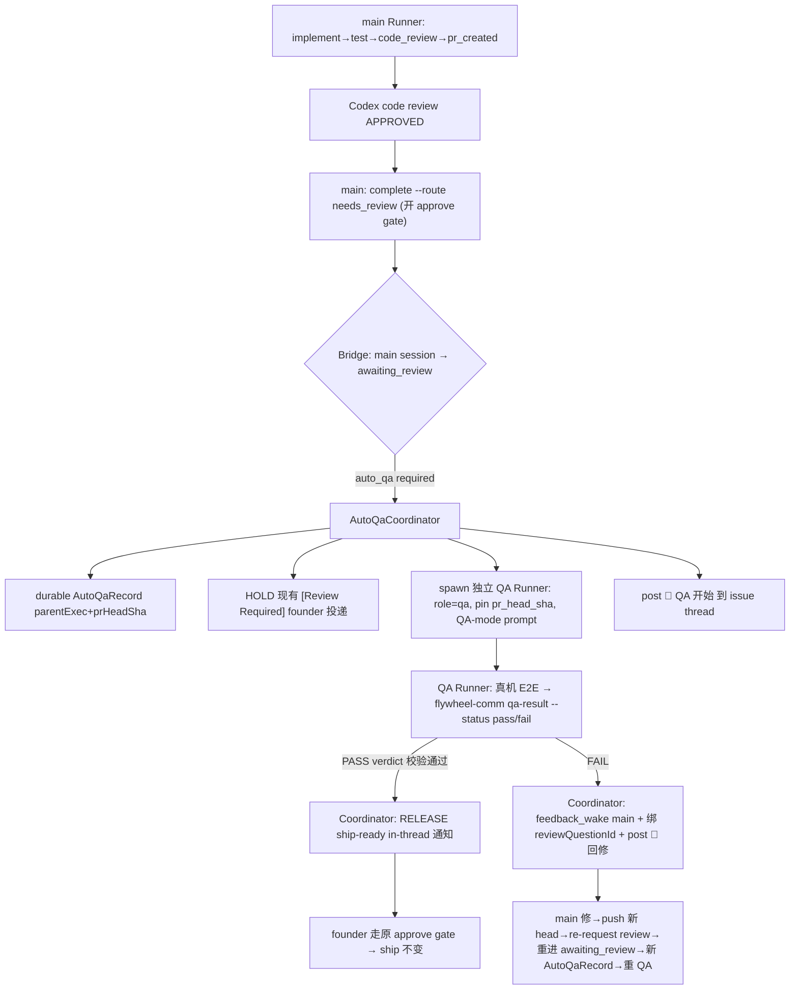

# Plan: 全局自动 QA 流水线（code+review 过 → 自动独立 QA → 过了 in-thread 通知 founder）

**Version**: v1.60.0（provisional，ship 时按 merge 顺序 re-version）
**Issue**: FLY-579
**Date**: 2026-06-26
**Source**: `doc/engineer/exploration/new/FLY-579-global-auto-qa-pipeline.md`, `doc/engineer/research/new/FLY-579-pipeline-mechanism-audit.md`
**Status**: codex-approved（Codex design review 3 轮：R1 10 条 CHANGES → R2 2 条 CHANGES → R3 APPROVED；全部 fold，无 reject）

## 1. 目标 / 验收

跨所有 Flywheel 项目，把「实现 + code review 全过 → **自动 spawn 独立（非实现者）QA Runner** 做真机 E2E → PASS → **in-thread** 通知 founder ready+QA 过；FAIL → Lead-drive fix loop、不打扰 founder」固化成 **Bridge pipeline 机制**，不靠 Lead 记得、不靠每项目改 prompt。merge/ship **永远 founder-gated**。

**Annie refinements（必 bake）**：
1. **自动≠闷声**：每个阶段过渡往 issue thread post 一条 key-state update；**不 gate founder**、自动往下。（独立 phase，见 §5 P4，不阻塞核心 QA gate）
2. 只 **ship gate** founder；中间不等反馈。
3. 只**真 blocking** 才问 founder；否则不停。
4. **FLY-598 衔接**：598 = brainstorm 前端；579 = 自动中间 + ship 后端。598 gate 过 → 进 579 流水线。
5. **/loop /goal runner-persistence 评估** + recommendation（§3.9：单开 follow-up）。

## 2. 架构总览



**核心**：触发点 = main session 进入 `awaiting_review`（Tadashi Q1）。新组件 `AutoQaCoordinator` 在三处被 event-route 调用：(a) main→awaiting_review：开 durable record + **HOLD founder 投递** + spawn QA；(b) `qa_result` event：PASS→release 通知 / FAIL→回修；(c) Bridge 启动 reconcile。

## 3. 组件设计（含 file 触点）

### 3.1 AutoQaCoordinator（新）— `packages/teamlead/src/bridge/auto-qa-coordinator.ts`
独立、可测组件。plugin.ts 在 `startDispatcher` 构造后（`plugin.ts:2385/2429`）构造并注入 `store / startDispatcher / projects / qaPolicy / threadPoster / shipReadyNotifier`。入口：

**(a) `onMainAwaitingReview(session)`**（event-route 在 session 映射出 `awaiting_review` 且 `session_role==="main"` 时调）：
1. **policy 守卫**（§3.5）：auto-QA 对该项目/issue 必须启用，否则**直接 return**（走原生 awaiting_review 路径，字节兼容）。
2. **startPoint fail-closed**（item5）：若 `session.pr_head_sha` 缺失/非法 → **不 spawn**，post 一条 pipeline-error 到 thread + 通知 Lead（alert），return。绝不让 QA 落到 origin/main。
3. **durable dedup**（item2，§3.6）：按 `(parentExecutionId, pr_head_sha)` 查 `AutoQaRecord`；已存在且未 superseded → 不重复 spawn。
4. **HOLD founder 投递（QA-held 全面抑制，item1 + R2-item1）**：标记本 awaiting_review 为「QA-held」。**QA-held 是一个共享 durable 谓词** `isQaHeld(session)`（由 `AutoQaRecord` + parent session + 当前 `pr_head_sha` 推导，§3.6），被**所有 review-gate 投递/升级面**查询、统一抑制（只对 auto-QA 启用的 session 生效；OFF 时逐字不变）：
   - **event-route always-deliver**（`event-route.ts:1441/1531`）：QA-held → 抑制 `[Review Required]`/approval 投递。
   - **GatePoller**（`gate-poller.ts:223/137/618/697/716`，独立从 CommDB relay 待批 approve gate question 给 Lead）：QA-held → **不投递** parent 的 approve-to-ship `gate_question`、且**不当 stale evict**；QA PASS 时 release（恰一次）或由 ship-ready notifier 浮出同一 bound question。
   - **HeartbeatService.checkAwaitingReviewTimeout**（`HeartbeatService.ts:138/160/191`，对老 awaiting_review 发 founder-facing `gate_timed_out`；EventFilter `EventFilter.ts:109` 归为高优「Lead notifies Annie」）：QA-held → **不发** `gate_timed_out`；QA stuck/timeout 改由 `AutoQaCoordinator` 当 **Lead-only pipeline error**（除非真 blocking 才升 founder，refinement #3）。
   - **顺序**：`reconcileOnStartup`（§3.1-c）必须在 GatePoller/Heartbeat timer 起跑**之前**执行，避免重启后老 held gate 被 relay。
5. **spawn**：`startDispatcher.start({ issueId, projectName, sessionRole:"qa", agentName:<reserved shipped qa, §3.2-G2>, leadId, issueLabels, owningDept, startPoint: session.pr_head_sha, qaContext:{ parentExecutionId, prHeadSha, prNumber?, branch } })`。
6. 写 `AutoQaRecord`（qaExecutionId / status=running / startedAt）+ post「🧪 QA 开始」(threadPoster, §3.4)。

**(b) `onQaResult(event)`**（event-route 收到 `qa_result` event 时调，§3.3 已校验）：
- 找 parent main session（event.targetExecutionId；回退 issue+role=main+awaiting_review）。
- **PASS** → record.status=passed；**RELEASE**：post「✅ ready + QA 过」+ 触发 **in-thread** founder ship-ready 通知（§3.4 shipReadyNotifier）。main 维持 awaiting_review、founder 走**原** approve gate（verify-approval/respond/approveExecution 全不动）。
- **FAIL** → record.status=failed；`feedback_wake`（runner-wake.ts，WakeKind=feedback_wake，feedbackText=QA 报告摘要，**绑 parent 的 `review_question_id`**，item9）main Runner + 把 QA 报告作 durable feedback 存 CommDB + post「🔴 QA FAIL → 回修」。**founder 不打扰**。main 修→push 新 head→re-request review→重进 awaiting_review（新 `pr_head_sha`）→ (a) 开**新** AutoQaRecord（旧 record superseded）→ 重 QA。
- 无 active review_question_id 的 fallback：通知 Lead 接管（不静默）。

**(c) `reconcileOnStartup()`**（item2，Bridge 启动调，仿 FLY-172 reconcile）：扫所有 `awaiting_review` 且 auto-QA-required 的 main session，对账 `AutoQaRecord`：缺 QA→spawn；QA running 但其 session 已死→重 spawn 或标 stuck 通知 Lead；有 PASS record 但通知未发→补发；FAIL→等 main 修（不重复打扰）。

**接线（G0）**：`createEventRouter`（`event-route.ts:348`，DI 风格）新增可选 `autoQaCoordinator?` 参数；plugin.ts 传入。改动点：
- event-route：session_completed→awaiting_review(role=main)→`onMainAwaitingReview`；always-deliver 块对 QA-held main 抑制 review-required；新增 `qa_result` event_type→`onQaResult`。
- **GatePoller**：注入 `isQaHeld` 谓词，relay 前跳过 QA-held parent 的 approve gate question（不投递、不 evict）。
- **HeartbeatService.checkAwaitingReviewTimeout**：注入 `isQaHeld`，跳过 QA-held parent 的 `gate_timed_out`。
- plugin.ts：`reconcileOnStartup` 在 GatePoller/Heartbeat timer 起跑前调用。
`isQaHeld` 作为共享只读谓词（查 `AutoQaRecord` + parent pr_head_sha），三处复用同一实现避免漂移。

### 3.2 QA spawn 基建

- **G1 worktree pin（fail-closed，item5）**：`StartRequest`（`retry-dispatcher.ts:69`）+`BlueprintContext`（`run-dispatcher.ts:571` ctx）+`Blueprint.run`（`Blueprint.ts:398` worktree 段）新增 `startPoint?`→`WorktreeManager.create({startPoint})`（已支持，`WorktreeManager.ts:114/142`）。Coordinator 传 `pr_head_sha`。**QA 专属硬规则**：role=qa 必须有显式 startPoint；Coordinator 在缺 `pr_head_sha` 时根本不 spawn（§3.1-a2），故 QA **永不**落 `FLYWHEEL_RUNNER_START_POINT`/`origin/main` fallback。测试断言 QA spawn 不会 fallback。**字节兼容**：main/其它 role 不传 startPoint → 现状不变。
- **G2 reserved shipped qa-executor（item4）**：新增 `agents/qa-executor.md`（repo 根，项目无关，`agentFileRoot="flywheel"`），E2E 协议泛化（Claude-in-Chrome、fetch HEAD before PASS、**emit `flywheel-comm qa-result` 再 `complete --route no_code`**、loop with dev runner、只读 git inspection 不改源码）。`AgentDispatcher` 加一个 **reserved 名解析**（仿 `generic` 在 `AgentDispatcher.ts:229` 的 special-case）：Coordinator 用一个 reserved agentName（如 `"qa"`）→ 优先项目声明的 `agents.qa`（project override，如 flywheel 的 `.flywheel/agents/engineering/qa-executor.md`）→ 否则回落 shipped `agents/qa-executor.md`（`agentFileRoot="flywheel"`）。`validateAgentName` 认这个 reserved 名（同 generic，不要求项目 config 必有）。**与 FLY-604 不冲突**：项目有 qa agent 就用项目的；没有就用 shipped。
- **G3 QA-mode prompt（item3，关键）**：`Blueprint` 对 `sessionRole==="qa"` 走**独立 prompt 分支**：**去掉**实现/建分支/push/PR 指令（现 `Blueprint.ts:521`）、**去掉** approve-gate/ship 指令（现 `Blueprint.ts:817`）；**加**：你是 issue X 的独立 QA、worktree 已 pin 到 commit `<pr_head_sha>`（clean，只读）、跑真机 E2E、测完 `flywheel-comm qa-result --status pass|fail --summary ... --target-exec <parentExec>` 再 `complete --route no_code`、不改源码（除报告/log）。`BlueprintContext.qaContext` 提供 parentExecutionId/prHeadSha/prNumber/branch。测试断言 QA prompt **不含**实现/ship 合同。

### 3.3 QA verdict 回报（D1，item6）— 新 `flywheel-comm qa-result`
最小侵入：**不动 FSM / DecisionRoute**。
- 新 comm 子命令（`flywheel-comm/src/index.ts:107` switch + 新 command 文件）`qa-result --exec-id <qaExec> --target-exec <parentExec> --status pass|fail --summary <text>`：emit `qa_result` event（payload: status / targetExecutionId / qaExecutionId / prHeadSha / summary）。复用 `complete.ts:179` 同款 retry/failure-marker 投递耐久性。
- QA Runner 跑完 → emit `qa-result` → `complete --route no_code`（no_code 已 valid 终态，`complete.ts:30` + `event-route.ts:621`；QA session→completed）。
- **Bridge 端校验（onQaResult 前置）**：reporting exec 必须是 `session_role="qa"` 且 link 到 target parent；target parent 仍在预期状态（awaiting_review、QA-held）；上报 `prHeadSha` == parent 当前 `pr_head_sha`（否则是旧 head 的过期 verdict，丢弃）；**幂等**（重复 verdict 不重复 release/wake，按 AutoQaRecord 状态机去重）。
- **lost-event 兜底**：若 `qa_result` 丢失但 QA session 的 `no_code` 完成先到 → AutoQaRecord 仍 running 且无 verdict → 标 pipeline **stuck** + 通知 Lead，**绝不**静默放行（不能无 verdict 就当 QA 过）。

### 3.4 通知 / thread post（item7 — 真 ThreadPoster，不 over-assume）
- **ThreadPoster 抽象（新）**：内部组件，resolve issue 的 per-issue chat thread（DirectEventSink FLY-91 建的）并**直接经 Discord 工具 post 确定性消息**。注意：现有 generic delivery（`event-route.ts:1531`）是投 Lead runtime 的信封、**不等于** Bridge 直发 thread；能直发任意文本的是 HTTP route `tools.ts:629`（`replyByIssueEnabled` 门控 `tools.ts:656`）。ThreadPoster 把「直发 thread」抽成内部能力（chat threads 关/缺时的行为明确：降级通知 Lead，不崩）。**与 Lead 自然语言 delivery 分离**——机制 key-state post 走 ThreadPoster，Lead NL 叙述另算。
- **in-thread founder ship-ready 通知（B，FLY-579 自带 scope，fold FLY-523）**：QA PASS 时经 ThreadPoster post「<issue> 实现+review+E2E 全过,可 ship,等你批准」到 issue thread。
- **设计原则（写死，吸取 #351 revert 教训）**：通知（ready-to-ship / completed 类）→ **issue thread**；**alert 频道只放错误/异常**（stuck/crash/rate-limit/pipeline-error）。alert ≠ notification。
- **key-state thread updates（refinement #1）= 独立 phase（§5 P4）**：每阶段过渡经 ThreadPoster post templated key-state 行，Bridge 机制、自动、不 gate。**不依赖 FLY-560 做 posting**（FLY-560 #362 的 `stampStageEmojiForSession` 只盖 title emoji，非任意消息）；P4 可选复用 FLY-560 的 thread-resolution helper（若已 land），并加 dedup 测试避免 title-stamp + message 双重打扰/刷屏。**P4 不阻塞核心 QA gate（item10）**。

### 3.5 per-project + per-issue QA policy（C，item8 — 可信源 + reload）
- `.flywheel/config.yaml` 新 `qa:` 块（`config/src/types.ts:388` `FlywheelConfig` + `ConfigLoader.ts:301/468` schema 校验，仿 `doc_flow`/`agents`）：
  ```yaml
  qa:
    auto: false            # 项目默认（默认 false = opt-in / 字节兼容）
    skip_labels: [docs, chore, doc]
    agent: qa              # reserved 名（§3.2-G2），默认 shipped qa-executor
  ```
- **可信源（安全，item8 关键）**：QA policy **只从可信 mainline / canonical project root 读，绝不从实现 PR 的 worktree 读** —— 否则实现者能在自己 PR 里加 `skip_labels` / 关 `qa.auto` 跳过自己的 QA。Bridge 在 `run-infra.ts:528` setup 时从 canonical project root 载入；判定用这份，不用 runner worktree 里的副本。per-issue label override（`no-qa` 跳 / `qa`/`testing` 上）取自 **Linear**（可信，非 worktree）。
- reload 语义：随 Bridge 启动载入（**改 `qa.auto` 需重启 Bridge**，文档写明）；不做 PR-worktree 热读。
- **全局 env = 纯急停（非第二道 opt-in，R2-item2）**：`FLYWHEEL_AUTO_QA` **缺省 = allowed**；仅 `FLYWHEEL_AUTO_QA=0` 全局关。字节兼容的 opt-in 只靠 per-project `qa.auto: false`（默认）—— **不**要求再设 env 才生效。
- 判定顺序：`FLYWHEEL_AUTO_QA=0`→跳（全局急停）；否则 Linear issue `no-qa`→跳；否则 canonical `qa.auto` 真 + 非 skip_labels→上。

### 3.6 durable 状态（item2）— `AutoQaRecord`
- StateStore 新表/列 `auto_qa_record`（幂等迁移）：key `(parent_execution_id, target_pr_head_sha)`；字段 `qa_execution_id / status(running|passed|failed|superseded|stuck) / verdict_event_id / started_at / completed_at / notified_at`。
- dedup：onMainAwaitingReview 按 `(parentExec, 当前 pr_head_sha)` 查；同 key running/passed → 不重复 spawn。
- re-QA：main push 新 head→新 `pr_head_sha`→新 key→旧 record 标 superseded→新 QA（FAIL **不**永久压制后续 head 的 QA）。
- 崩溃恢复：`reconcileOnStartup`（§3.1-c）。
- QA session 本身用现成 `session_role="qa"` 行（已支持多 session/issue）。

### 3.7 no-transport（antigravity/kimi）
- main runner 走 `pr_handoff`、**从不进 awaiting_review** → 自然不触发 auto-QA（确认 deferral 正确，无 v1 正确性洞）。QA Runner 自身**默认 claude-tmux**（transported、可 wake）。
- follow-up：no-transport main 的 QA 段（结果只通知 Lead/founder，无 wake-回修）。

### 3.8 FLY-598 衔接（refinement #4）
- 598 = founder-facing UX 的强制 brainstorm gate（实现前）；579 = 实现后自动 QA + ship 通知。**顺序、非耦合**：[598 gate(若 founder-facing UX)] → implement → [579 code-review → 自动 QA → in-thread ship 通知]。579 不实现 598（PR #359 独立）；仅文档化 compose、无重叠。

### 3.9 /loop /goal runner-persistence 评估（refinement #5）
- 问题=「runner 中途自停」（行为层，feedback_agents_idle_per_turn_shepherd）；/loop=周期 re-invoke、/goal=持续追目标，对**任意** runner 通用。FLY-579=跨阶段编排+独立 QA（结构层）。**正交互补**：579 不依赖 runner-persistence 也能跑（Bridge 编排不靠单 runner 不停）。
- **Recommendation：单开 follow-up issue**（runner 执行层持续性，全体 runner 生效）；579 只留集成 seam，不撑大 scope。（已与 Tadashi 对齐。）

## 4. Rollout / 字节兼容（Q4）
- 默认 **OFF / opt-in**：字节兼容 opt-in **只靠 per-project `qa.auto: false`（默认）**；全局 `FLYWHEEL_AUTO_QA` 缺省 = allowed（纯急停，非第二道 opt-in，§3.5）。不配置 `qa.auto` = 现状逐字不变（reverse-compat sentinel 测：awaiting_review 投递、GatePoller relay、Heartbeat gate_timed_out、worktree startPoint、agent 解析全不变）。
- 顺序：**flywheel 自身先开**、真机验过 → 再逐项目/全局 ON。全局 env kill-switch 兜底。
- 与 FLY-205 doc-flow / FLY-175 founder-consent 的 default-off + sentinel 一脉相承。

## 5. 实现分期（TDD，每期 RED→GREEN→REFACTOR）—— 核心 QA gate 先行（item10）

> **实现进度（branch flywheel-FLY-579）— RESUME 完成 P0-P3 + 契约编码**：
> - ✅ **P0 DONE**（G1/G2/G3）：`startPoint`+`qaContext` 串接、reserved `qa` 解析、shipped `agents/qa-executor.md`、Blueprint QA-mode prompt 分支。
> - ✅ **P1 DONE**：`AutoQaCoordinator`（onMainAwaitingReview/onQaResult/reconcileOnStartup）+ durable `auto_qa_record` 表 + 共享 `isQaHeld` 谓词接进 event-route + GatePoller + HeartbeatService（三面抑制）+ `flywheel-comm qa-result` + `qa_result` event（校验/幂等/lost-event→stuck）。25 单测 + StateStore 8 + qa-result 3 + isQaHeld 10。
> - ✅ **P2 DONE**：`AutoQaEffects`（in-thread Discord post / ship-ready notify / feedback_wake / `auto_qa_stuck` Lead alert）+ plugin.ts 接线（late-bound holder、canonical-root qa config、reconcile-after-timers 安全因 durable record）。
> - ✅ **P3 DONE**：`qa:` config block（ConfigLoader 校验，default-off 字节兼容）+ `resolveAutoQaPolicy`（FLYWHEEL_AUTO_QA=0 kill-switch + canonical qa.auto + skip_labels + Linear no-qa）。8 单测。
> - ✅ **契约编码（FLY-634 fold）DONE**：`lead-rules-base/auto-qa-pipeline.md`（wire bundle+claude-lead.sh+parity test+README）+ generic-executor.md runner note + qa-executor.md `stage set test`（issue 显示 🧪QA）。
> - ✅ **集成 DONE**：`event-route-fly579-auto-qa.test.ts` 真 createBridgeApp HTTP 链（spawn+hold / qa_result PASS→release）。
> - ⏳ **P4 key-state thread updates DEFERRED**（独立、非阻塞核心 QA gate，item10）→ follow-up issue。coordinator 已 post 🧪/✅/🔴 关键态，全阶段 key-state 留 follow-up。
> - 📋 **follow-ups**：P4 key-state updates；no-transport main 的 QA 段；/loop /goal runner-persistence（§3.9）。

- **P0 spawn 基建**：`StartRequest.startPoint`+QA fail-closed（G1✅）；reserved shipped `agents/qa-executor.md`+AgentDispatcher 解析（G2✅）；`BlueprintContext.qaContext`+**QA-mode prompt 分支**（G3⏳）。测：worktree pin 到 sha 且不 fallback、reserved qa 解析（项目 override / shipped 回落）、QA prompt 无实现/ship 合同。
- **P1 coordinator + 触发 + durable state + verdict + QA-held 全面抑制**：`AutoQaCoordinator`（onMainAwaitingReview/onQaResult/reconcileOnStartup）；`AutoQaRecord`（§3.6）；共享 `isQaHeld` 谓词接进 event-route + GatePoller + HeartbeatService；`flywheel-comm qa-result` + `qa_result` event + 校验/幂等/lost-event（§3.3）。测：awaiting_review 触发 spawn（参数正确）、durable dedup、PASS/FAIL 分支、prHeadSha 过期丢弃、lost-event→stuck、restart reconcile（在 timer 前）；**QA-held 三面抑制**——event-route 不发 review-required、**GatePoller 不 relay/不 evict parent approve gate question**、**Heartbeat 不发 gate_timed_out**；QA PASS 后 gate question 恰一次 release；auto-QA OFF 时三面行为逐字不变（sentinel）。
- **P2 通知 + FAIL 回路**：ThreadPoster（§3.4）；in-thread ship-ready 通知（PASS release）；feedback_wake 绑 reviewQuestionId（FAIL，item9）。测：PASS→release 通知发、founder gate 不变；**FAIL→founder 不被通知**、main 收 QA 报告；re-QA 新 record。
- **P3 policy + 可信源 + rollout**：`qa:` schema（ConfigLoader）+ 可信 canonical 源（item8）+ skip_labels + Linear per-issue label + 全局 kill-switch；default-off 字节兼容 sentinel。测：默认 off 零行为变化、各 skip 路径、**PR-worktree 改 config 不能跳过本 run 的 QA**、kill-switch。
- **P4 key-state thread updates（refinement #1，独立、不阻塞核心）**：各阶段过渡经 ThreadPoster post；可选复用 FLY-560 thread-resolution；dedup 防双重打扰。测：各过渡 post、不 gate、与 #362 不重复。
- **P5 docs**：archive exploration/research、CLAUDE.md 里程碑、shipped qa-executor 文档、follow-up issues（no-transport QA / runner-persistence）。

## 6. 测试策略
- 单测：coordinator 各分支（守卫/fail-closed/spawn 参数/durable dedup/PASS/FAIL/幂等/lost-event/reconcile）、startPoint 串接+不 fallback、QA-mode prompt、reserved qa 解析、qa-result 校验、config schema + 可信源、字节兼容 sentinel。
- 集成：真 event-route + 真 dispatcher（spawn 落 StateStore）验 awaiting_review→HOLD→spawn→qa_result→release/feedback 全链 + restart reconcile。
- 真机 E2E（独立 QA，非本实现 runner，529 隔离房 / flywheel opt-in）：真 issue 走 implement→code-review→**自动起独立 QA**→真跑→PASS→**真 in-thread 通知 + founder 未被提前打扰**；FAIL 注入验回修不惊动 founder + re-QA；Bridge restart-mid-QA 验 reconcile。

## 7. 风险 / 依赖 / open
- **依赖 FLY-560 #362**（in-flight）：**仅 P4 可选复用其 thread-resolution**，核心 QA gate（P0-P3）不依赖它。
- **依赖 FLY-598 #359**（in-flight）：仅文档衔接，无代码耦合。
- QA verdict 信任：`qa-result` 自报，但有 Bridge 端校验（qa-session linkage + prHeadSha 匹配 + 幂等）；且 QA 只 gate「何时通知 founder」，founder ship gate（verify-approval）仍是硬 merge 边界。
- 安全：QA policy 可信源（非 PR worktree，item8）防实现者自己跳过 QA。
- 噪音：key-state 每 issue ~5 条，P4 加 dedup。
- 互动：与 FLY-208 evidence-gap completion / FLY-175 founder-consent / 现有 approve gate 不冲突（不改 verify-approval/approveExecution/FSM）。

## 7.1 实现注意（Codex R3 非阻塞 LOW，实现时遵守）
- **held-record 先于 spawn、fail-closed**：`onMainAwaitingReview` 必须**先**写 `AutoQaRecord`（status=running，无 qaExecutionId）—— 在任何 relayer 能把 parent 当普通 review gate 观察到**之前** —— 再 `start()`；`start()` 返回后回填 `qa_execution_id`。`start()` 抛错（admission/inflight/missing runtime，`run-dispatcher.ts:526/542/548`）→ 标 record `stuck` + **Lead-only** 通知，绝不留「held parent 但无 QA runner」。
- **GatePoller release 复用现有 dedupe**：GatePoller 按 `eventId = gate_${question.id}` + `isLeadEventDelivered`（`gate-poller.ts:653/656`）去重。QA PASS release parent gate question 时复用同一 eventId 语义，确保 release 恰一次、后续 tick 不重复投递。测：held 时跳过该 question → PASS release 一次 → 下一 tick 不重复。

## 8. 不做（scope 边界）
- 不自动 merge / ship（永远 founder-gated，FLY-175）。不实现 FLY-598 gate。不重写 FLY-560 title-emoji。不把 runner-persistence 塞进本 issue（follow-up）。不动 qa-framework（FLY-529 自测房）。no-transport main 的 QA = follow-up。
