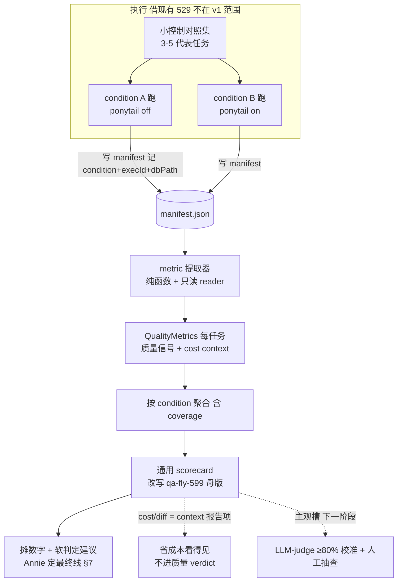

# Plan: eval — 测量产出质量（通用能力）

**Version**: v1.61.0（tentative — ship 时按 Codex 校准重排，沿用项目『ship 取空号』惯例）
**Issue**: FLY-616
**Date**: 2026-06-28
**Source**: `doc/engineer/exploration/new/FLY-616-eval-output-quality.md`（spec，决策 LOCKED）, `doc/engineer/research/new/FLY-616-eval-reuse-audit.md`, 业界 research `/tmp/flywheel-FLY-616-eval-research.html`
**Status**: **codex-approved — Codex design review 7 轮全收敛（R3 + R5 + R7 APPROVED）**（Annie 2026-06-28 过目 OK + 追加滞后信号⑤ + cross-issue 点⑥『成本/token 消费 FLY-614 不重算』；全 fold）。**待 Annie 最终 OK（看追加的滞后信号 + 成本消费 614）+ Lead 放行 → 才 implement。仍不开 PR、可拆 sub-issue。** R1 7 + R2 3 + R3 3 + R4 4 + R6 4 全 fold；§7 阈值方法学敲定；滞后信号 R4→R5；614 接口 R6→R7。

> 流程：本 plan → Codex design review（**判定阈值方法学 §7 重点跟 Codex 过** —— Annie 明确委托 runner+Codex 敲定）→ present 给 Lead + Annie 过目 → 才 implement。

---

## 1. Problem + Goal + Context（Codex 先读这段）

**Problem**：Flywheel 经常做『可能悄悄拉低 Runner 产出质量』的改动——开 ponytail（code-reducer，
FLY-615 灰度）、换模型、换 backend（FLY-617 Gemini）。今天判断『质量有没有掉』靠手感 + 人肉看几个 PR，
**不客观、不可重复**。

**Goal（Annie framing）**：`eval = 一个独立的「测量产出质量」能力`。只回答『这次改动后产出质量有没有掉』。
第一用途 = ponytail A/B，但 condition 无关、通用（换模型 / 换 backend 直接复用）。

**Annie brainstorm 决策（LOCKED，2026-06-28）** —— 经业界 research → 一个一个 brainstorm：
- **① 测什么**：v1 客观信号 = `{QA 过不过 / CI·build·tests / 返工轮数 / completion route}`。主观（优雅/可维护/真解决）
  = 下一阶段（LLM-judge 先跟人 ≥80% 校准 + 人工抽查）。
- **② 机制**：condition-agnostic 的 scorecard + 对比层；首用 ponytail A/B；v1 = 小控制对照集（3–5 代表任务、跑两遍）
  拿干净初步信号；自然对照（per-issue 标签、生产 run）之后累积。
- **③ 判定**：Annie 倾向 (b) **摊数字 + 她定线**（小样本噪声大、**不设硬数字门**）；阈值方法学 **委托 runner + Codex 敲定**（§7）。
- **④ 复用**：QA 框架 + FLY-599 scorecard 模式，别从零建。
- **⑤ 滞后信号「过 QA ≠ 真修好」（Annie 过目追加，2026-06-28）**：有些 issue 过了 QA，Annie 实际用时才发现没真修好、之后才补——这是 **滞后 + 软性** 信号，QA-pass 抓不到。加一条**滞后信号 = 「过了之后有没有又被 reopen / 返工」**（Linear issue reopen / 同 issue 二次 runner / re-fix）。**软信号、不进硬质量 verdict**；scorecard 摊出来给 Annie 看『这批过 QA 的东西多少后来回炉（post-QA recycle）』。见 §3.2/§4.1b/§4.4/§7。〔对应业界 research：outcome-only 会漏 corrupt success；这是真实世界 ground-truth 校验 QA-pass 这个 proxy。〕
- **cost / diff economy 的定位**（非 Annie ① 清单内，按她『eval 测质量』framing）：**作 scorecard 的 context 报告项，不进质量 verdict**
  —— ponytail A/B 仍能看到「省成本 + 质量持平」，但 verdict 轴纯质量。schema 设计成 cost 可升级为有独立 verdict 的第二轴。
  〔已非阻塞 flag 给 Lead；Lead 早先提过「两轴」，以 Annie ① 为准。〕
- **⑥ 成本/token 信号【消费 FLY-614，不自己重算 token】（Annie cross-issue 点，2026-06-28）**：FLY-614 做细粒度 token tracking（per project/runner/task-type/issue，CC 日志 + ccusage，写 store）。616 当 eval 成本维度时**读 614 的 per-issue token 数据**，**绝不自建 token 计算逻辑**（免两套漂移）。616 端只负责 diff/duration（非 token 逻辑）+ **从 614 store 读 token**。614 也在设计中 → 这是 **616 对 614 的依赖 + 接口要求**（614 store 要让 616 能按 issue/execution 读 token）；614 未就绪时 `costContext.tokenUsage=null`（成本是 context、不阻塞）。见 §3.2/§4.1c。

**审计到的真相（复用面，已核实，含 Codex R1/R2 修正）**：
- `ExecutionEvidenceCollector`（edge-worker）已按 session 收集 `{commit/files/linesAdded/Removed/diffSummary/headSha/durationMs/landingStatus}`。
- **QA verdict 真相源 = `auto_qa_record` 表**；查询键是 **`(parent_execution_id, target_pr_head_sha)`**（Codex R2 #1：列名是 `target_pr_head_sha` 非 `pr_head_sha`）；`status` 落 `passed/failed/stuck`。raw `qa_result` 事件只是输入、仅作 audit。
- StateStore `sessions`（`decision_route`/`status`/`adapter_type`/`pr_number`/`pr_head_sha`/`worktree_path`）+ `session_events`。`merged` 是 landing status 非 `sessions.status`；ready-to-merge → route `needs_review` → status `awaiting_review`。
- **land-status 真实路径**（Codex R2 #2）= `${sessions.worktree_path}/.flywheel/runs/<execId>/land-status.json`（或 `FLYWHEEL_LAND_STATUS_PATH` / manifest `landStatusPath` override）——**不是** `slotDir/land-status.json`。
- `scripts/qa-fly-599/scorecard.mjs`——可直接改写的母版。
- 529 slot 框架（`scripts/test-deploy.sh` 输出 `slotDir`/`hostRepo`/`dbPath`；`inject-linear-issue.sh` POST `/api/runs/start` 返 `executionId`，runbook 抓它写 manifest）——起真 runner 执行，v1 借用不重造、不记 condition（→ §3.1 manifest）。

**一条线（别重复造）**：FLY-599 = 单实例 eval（本 issue 泛化它）；FLY-615 = ponytail（use-case #1）；FLY-617 = Gemini backend（未来 use-case）；FLY-579 = auto-QA（eval 读它的 `auto_qa_record`）；QA 框架/529 = 执行底座。

---

## 2. 核心设计：解耦『测量』与『执行』

eval v1 = 一个 condition 无关的『测量 + scorecard』层，消费 pipeline 已产出的客观信号，自己不造 runner 执行编排器。



---

## 3. 数据模型（schema-first）

新文件 `packages/qa-framework/src/eval/types.ts`（在 `src/` 下，Codex R1 #1），沿用 `src/config/types.ts` zod 风格。

### 3.1 EvalRunManifest —— condition 与产物绑定（Codex R1 #6）

529 不记 condition、`adapter_type` 分不出 ponytail off/on。显式 manifest 是 eval 输入契约，eval **只按 manifest 提取**：

```ts
TaskRunHandle = {
  issueId: string; conditionLabel: string;     // "ponytail-off" | "ponytail-on" | "model-fable" ...
  execId: string;                               // /api/runs/start 返回的 executionId（runbook 抓）
  projectName: string; dbPath: string;          // 该 slot 的 teamlead.db
  worktreePath?: string;                        // 推 land-status 路径用（缺则从 sessions.worktree_path 读）
  landStatusPath?: string;                      // 手动 run 的显式 override（Codex R2 #2）
  slotDir?: string; hostRepo?: string; expectedPrNumber?: number; notes?: string;
}
EvalRunManifest = { meta: { issue: string; date: string; taskSet: string[] }; handles: TaskRunHandle[]; }
```

### 3.2 QualityMetrics —— 一个任务在一个 condition 下

```ts
QualityMetrics = {
  issueId: string; conditionLabel: string; execId: string | null;
  // ===== 质量信号（Annie ①，进 verdict）=====
  completionRoute: "completed" | "awaiting_review" | "blocked" | "failed" | "unknown";  // sessions.status/route
  prOutcome: "ready_to_merge" | "merged" | "failed" | "none" | "unknown";               // land-status（判 hardSuccess 用）
  qaVerdict: "pass" | "fail" | "none" | "unknown";   // auto_qa_record(parent_execution_id,target_pr_head_sha): passed→pass/failed→fail/running|stuck|superseded→unknown/无行→none
  ciHealth: "green" | "red" | "unknown";              // land-status ready_to_merge 隐含 + 可选 gh pr checks
  reworkRounds: number | null;                        // Annie ① 返工轮数：v1 = qaFailLoops。**无 auto_qa_record family → null + signalPresent.rework=false，绝不当 0**（Codex R3 #1）。advisory，不进总软判定（§7B）
  // ===== context 报告项（cost，不进质量 verdict；可升级为第二轴）=====
  // tokenUsage 【消费 FLY-614，616 不重算】（Annie ⑥）；结构化(非裸 number，Codex R6 #2)；614 未就绪/查不到 → null。diff/duration 616 本地算。
  costContext: { tokenUsage: Fly614TokenUsage | null; diff?: { linesAdded: number; linesRemoved: number; filesChanged: number } | null; durationMs?: number | null } | null;

  // FLY-614 token 读契约（616 只消费这个稳定结构，绝不焊死 614 内部 schema，Codex R6 #2）
  // Fly614TokenUsage = {
  //   source: "fly-614"; totalTokens: number;
  //   inputTokens?|outputTokens?|cacheReadTokens?|cacheWriteTokens?: number|null;
  //   lookup: { projectName; issueId; execId; worktreePath?; claudeSessionId?; workspaceName? };  // 主键 execution-id-first
  //   confidence: "exact_execution" | "workspace_time_window";   // exact 命中 vs workspace 时间窗回退
  //   observedAt?: string;
  // }
  // ===== 滞后软信号（Annie ⑤『过 QA ≠ 真修好』；不进硬 verdict、不进总软判定，scorecard 摊给人看）=====
  // 注意：lagging 的缺失/未采集【绝不】影响上面 partial（partial 只系即时质量信号，Codex R4 #3）。
  laggingReopen: {
    laggingStatus: "observed" | "pending" | "not_applicable" | "unavailable";  // 滞后采集独立状态（Codex R4 #3）
    reopened: boolean | null;        // Linear：**仅当状态转换历史**显示 ready/pass 时间后 completed→非 completed（Codex R4 #1）；史料缺 → null(reason=linear_history_unavailable)，绝不从快照推 true/false
    currentStateNonCompletedAfterReady: boolean | null;  // 快照弱 context（当前非 completed），**不叫 reopened**
    secondRunner: boolean | null;    // StateStore：同 issue 的**晚于 ready/pass 时间**的新 **main** session（role='main'，排除 QA）；无可靠 pass 时间 → null（Codex R4 #2）
    refixDetected: boolean | null;   // 同 issue 的 follow-up fix PR/commit（best-effort，缺→null）
    evidence?: { currentState?: string; transitions?: Array<{ at: string; from: string; to: string }>; secondRunnerExecIds?: string[] } | null;  // 留证（Codex R4 #1）
    observedAsOf: string | null;     // 采集时间；null = 尚未采集/窗口未到
  } | null;
  // ===== 主观（下一阶段，留空槽）=====
  subjective?: { score: number; rubric: string; notes?: string } | null;
  // ===== coverage / 完整性 =====
  signalPresent: { hardSuccess: boolean; qa: boolean; ci: boolean; rework: boolean };
  partial: boolean;   // 任一质量信号缺失 → true（绝不当 pass）
}
```

**hardSuccess 判据**（Codex R1 #4 + Annie『completion route』）：产出了『可评估 PR』= `prOutcome ∈ {ready_to_merge, merged}` **或**（有 `pr_number` 且 `completionRoute ∉ {blocked, failed}`）。`merged` 仅作更严格的可选报告字段，不当 baseline 成功谓词（sandbox eval 不一定 founder-approve 每个 PR）。

### 3.3 聚合（含 coverage，Codex R1 #5）

```ts
ConditionAggregate = {
  n: number;                  // 期望任务数（= manifest 该 condition 的 handle 数）
  // 质量指标：分母 = 全部期望任务（缺信号算非-pass，不靠 present 子集）
  hardSuccessRate: number; qaPassRate: number; ciGreenRate: number;
  avgReworkRounds: number | null;
  coverage: { hardSuccess: number; qa: number; ci: number; rework: number };  // 各 <1 → 该指标对比不可信
  partialCount: number;
  // context（报告）
  costSummary?: { medianTokens?: number | null; medianLinesChanged?: number | null } | null;
}
```

---

## 4. 组件设计

### 4.1 metric 提取器 —— `packages/qa-framework/src/eval/extract.ts`

- **纯函数核心** `toQualityMetrics(raw) -> QualityMetrics`：把已读出的 raw 信号（session row + auto_qa_record row + landingStatus + diff/cost）归一 + 算 `signalPresent`/`partial`。无 IO、可单测。
- **只读 IO 层** `collectMetrics(handle) -> QualityMetrics`（Codex R1 #2）：
  - **绝不实例化 `StateStore`**（它 `create()` 跑 `migrate()`、`close()/save()` 写回 → 违反 readonly）。用**真只读 reader**（better-sqlite3 `readonly:true` 或 sql.js load 不 save）发显式 SELECT：
    - `sessions WHERE execution_id=?` → `decision_route`/`status`/`pr_number`/`pr_head_sha`/`worktree_path` → `completionRoute`。
    - `auto_qa_record WHERE parent_execution_id=? AND target_pr_head_sha=?`（**Codex R2 #1 列名**，绑 `sessions.pr_head_sha`）→ `status` 映射 `qaVerdict`。
    - **返工轮数 `reworkRounds`**：`qaFailLoops = count(auto_qa_record ... status='failed')`（结构化、可靠）；`reviewRetries`（needs_review 重试）口径未命名 → **v1 暂只用 qaFailLoops，reviewRetries 记 null**（Codex R1 #7）。**关键（Codex R3 #1）**：若该 parent execution/head **没有 auto_qa_record family**，`count` 返 0 **不能**当『零返工』——必须 `reworkRounds=null` + `signalPresent.rework=false` + coverage 警告。**绝不把缺失返工默认成 0**（否则没跑 QA 的 run 看起来比真跑过 QA 的更好）。
  - **land-status**（Codex R2 #2 + R3 #2）：路径 = `handle.landStatusPath` ?? `${sessions.worktree_path}/.flywheel/runs/${execId}/land-status.json`。`ExecutionEvidenceCollector.readLandingStatus` 是 **private 方法**——**不 import edge-worker 私有方法**；而是**把那段三态解析语义 copy 进 `src/eval/extract.ts`**（缺文件→unknown/未尝试；`pending`→failed/signal_missing；`ready_to_merge`/`merged`/`failed` 显式映射）+ 镜像单测（Codex R3 #2）。→ `prOutcome`/`ciHealth`。
  - **cost context**：diff = `git -C hostRepo diff --stat base..head` 或 EvidenceCollector；tokens/duration = best-effort（缺则 null）。**全是 context，缺失不影响质量 verdict。**
  - **任一质量信号缺失 → `unknown`/`none` + `signalPresent.x=false` + `partial=true`（绝不当 pass）**。

### 4.1b 滞后信号采集 —— `eval lagging-augment`（Annie ⑤）

『过 QA ≠ 真修好』是**滞后**信号：eval 跑完那刻 reopen 还没发生。所以**独立、延迟**采集，不混进 §4.1 即时提取，**不进 verdict**。三个来源的**实现合同（Codex R4 收紧）**：

- **Linear reopen（Codex R4 #1）**：**只认状态转换历史**——在该任务的 ready/pass 时间**之后**出现 `completed → 非 completed` 转换才 `reopened=true`（能抓 `completed→started→completed` 多次回炉，快照抓不到）。
  - 转换历史拿不到 → `reopened=null`，reason=`linear_history_unavailable`，**绝不从快照推 true/false**。
  - 快照（当前非 completed）只作**弱 context** `currentStateNonCompletedAfterReady`，**不叫 reopened**。
  - 留证 `evidence.transitions`（at/from/to）+ `currentState`。
- **second runner（Codex R4 #2，最大的坑：别把 auto-QA 当回炉）**：只读 StateStore，**显式 role 过滤 + 用 `started_at`（非不存在的 `created_at`）+ 对比 pass 时间**：
  ```sql
  SELECT * FROM sessions
  WHERE issue_id = ? AND execution_id != ?
    AND COALESCE(session_role,'main') = 'main'                 -- 排除 session_role='qa'（auto-QA 不算回炉）
    AND datetime(started_at) > datetime(:ready_or_passed_at)   -- 晚于『被认为做完』的时间，非原 session started_at
  ORDER BY started_at ASC;
  ```
  `ready_or_passed_at` 取自 accepted QA pass（`auto_qa_record.completed_at` where status='passed'）或别的显式『此产出被认为做完』时间戳；**无可靠 pass/ready 时间 → `secondRunner=null`**。留证 `evidence.secondRunnerExecIds`。
- **re-fix**：同 issue follow-up fix PR/commit（best-effort，缺→null）。
- 软语义：任一为真 → 该任务标『后来回炉』。**全 advisory**——reopen 也可能是加需求/扩范围，**绝不进硬 verdict / 总软判定**（§7E）。
- **采集状态独立（Codex R4 #3）**：`laggingStatus ∈ {observed, pending, not_applicable, unavailable}`；**lagging 缺失绝不影响即时质量 `partial`/coverage**——scorecard 单独标『滞后待采集/N/A』，不让即时 eval 看起来不完整。
- **phasing（Codex R4 #4，取 option a）**：**v1 = schema + scorecard slot + `lagging-augment` 命令骨架 + mocked fixtures**（用夹具证 reopen 转换检测 + role-filtered second-runner 三个验收 case，纯函数逻辑全测）；**真 Linear 状态转换历史采集 wiring → 自然对照 follow-up**（信号本就主要在真实生产 issue cohort 产生；v1 sandbox 集 Annie 不会真用 → `laggingStatus="not_applicable"`）。不假装 sandbox 集能端到端证这信号。

**second-runner 验收（Codex R4 #2）**：① 同 issue 晚到的 `session_role='qa'` 行**不**算；② QA pass 后的 main 行**算**；③ QA pass **前**的 main retry **不**算回炉。
**Linear 验收（Codex R4 #1）**：completed→started→completed 的 fixture **必须**判 reopened（快照式实现会漏）。

### 4.1c 成本/token 采集 —— 消费 FLY-614，不重算（Annie ⑥）

`costContext` 三部分来源分明（接口已按 Codex R6 收紧）：
- **`tokenUsage` —— 读 FLY-614，616 绝不自建 token 计算**（免两套漂移）。616 端一个**薄读适配器** `readFly614Tokens(handle) -> Fly614TokenUsage | null`。
- **`diff`**（linesAdded/Removed/filesChanged）+ **`durationMs`**：616 本地算（git stat / `sessions.started_at`~`last_activity_at` / Blueprint `durationMs`）——**非 token 逻辑，留 616**。

**接口合同（Codex R6 收紧，最终）**：
- **主键 = execution-id-first `(projectName, issueId, execId)`**，`execId` = Flywheel `sessions.execution_id`（本仓稳定 run 身份）。**`runner workspace` 不是同级 key**——A/B 同 issue 跑多 condition/retry，workspace/log dir 会复用、混多次 session，不能唯一代表一次 eval run（Codex R6 #1）。workspace 只能是 **614 侧 resolver 的辅助字段**，且 workspace 回退必须带时间窗 + `confidence`，绝不作 616 主合同。
- **结构化返回 `Fly614TokenUsage`**（非裸 number，Codex R6 #2）：含 total + input/output/cacheRead/cacheWrite + `lookup` + `confidence("exact_execution"|"workspace_time_window")` + `observedAt`。616 不学 614 内部、scorecard 能标命中方式。
- **适配器只对接 614 的稳定 public read 契约**（Codex R6 #3）：要求 614 暴露**一个**稳定读面，如 `token_usage_by_run` view 或 `getTokenUsageByRun({projectName, issueId, execId})`；616 只依赖它，**绝不直连 614 的 raw Supabase 表/列**（否则 614 schema 一改就崩 616 = 跨 issue 耦合，非薄适配器）。
- **降级**：614 未就绪 / reader 未配置 / 查不到 → `tokenUsage=null`（成本是 context、不进 verdict，616 不阻塞；scorecard 标『token 待 614 接入』）。
- **phasing**：v1 按此合同写适配器 + mocked fixtures 测 616 侧逻辑；真接入待 614 暴露稳定读面后对齐。

**接口验收测试（Codex R6 #4，守住边界防漂移）**：
- 同 `issueId` + 同 workspace + 两个不同 `execId` → 返回**两条独立** token 记录，**不合并**成一个总数；
- 精确 `(projectName, issueId, execId)` 命中 → `confidence="exact_execution"`；
- 只有 workspace 匹配、无精确 exec 映射 → **默认返回 null**（除非显式允许 `workspace_time_window`）；
- 614 不可用/空 → `tokenUsage=null`，**不影响 verdict / coverage / partial**。

### 4.2 聚合 + 判定 —— `packages/qa-framework/src/eval/aggregate.ts`

- `aggregate(handlesForCondition, metrics) -> ConditionAggregate`（分母 = 期望任务数）。
- `compare(baseline, candidate, opts) -> EvalComparison`：算 per-metric delta + coverage + 不确定性 + **软判定建议**（§7 方法学，跟 Codex 敲定）。**不阻断、Annie 定最终线。**

### 4.3 CLI —— `packages/qa-framework/eval/cli.mjs`（资产，§5）

```bash
node <cli> extract  --manifest runs/ponytail-off.manifest.json --out runs/off.json
node <cli> extract  --manifest runs/ponytail-on.manifest.json  --out runs/on.json
node <cli> scorecard --baseline runs/off.json --candidate runs/on.json --out runs/scorecard.html
```

### 4.4 通用 scorecard —— `packages/qa-framework/eval/scorecard.mjs`

- 改写自 `scripts/qa-fly-599/scorecard.mjs`（Apple-light HTML，遵守 `~/.claude/rules/html-report-style.md`）。
- 泛化：`variants`→`conditions`；漏发率单卡 → 质量信号卡（hardSuccess/QA/CI/返工 + coverage 标注）+ **cost context 卡（省成本可见，明确标『context 非质量判据』）** + **回炉率（post-QA recycle）advisory 卡**（『这批过 QA 的东西多少后来被 reopen/返工』，明确标『滞后软信号·非质量判据』+ 未采集时标『待采集』，Annie ⑤）+ per-metric A-vs-B delta + **摊全部数字** + 软判定建议横幅（§7）+ 每任务明细 + 主观槽（标『下一阶段』）。
- coverage <1 的指标卡显式标灰/警告（缺信号不能看起来像满分，Codex R1 #5）。

### 4.5 README + runbook —— `packages/qa-framework/eval/README.md`

- 跑一次 ponytail A/B：529 起 off/on 两批（**3–5 任务跑两遍**）→ 抓每条 executionId 写 manifest → extract → scorecard。
- 明确：eval 只消费『跑完且 manifest 记了 condition』的产物，**不负责注入 condition**（注入是 FLY-615 的活）。

---

## 5. 文件清单 + 打包契约（Codex R2 #3 —— 定成合同，不留『choice』）

包只编 `src/**/*`（tsconfig）、只发 `dist` + 顶层资产目录（package.json.files，现已含 `templates/`/`skills/` 等）、从 `src/index.ts` 导出。**采用既有资产惯例**：

```
packages/qa-framework/
├── src/eval/                       ← TS lib（编进 dist/eval，从 src/index.ts 导出）
│   ├── types.ts  extract.ts  aggregate.ts
│   └── __tests__/{extract,aggregate}.test.ts
└── eval/                           ← 顶层运行期资产（加入 package.json.files，仿 templates/ 先例）
    ├── cli.mjs  scorecard.mjs      ← import 编译后的 lib（从包 dist）
    ├── __tests__/scorecard.test.mjs
    ├── fixtures/                   ← 样例 off/on manifest + runs
    └── README.md
```

- `src/index.ts` 追加导出 eval 公共 API（`QualityMetrics`/`EvalRunManifest`/`aggregate`/`compare`/`toQualityMetrics`）。
- `package.json.files` 加 `"eval"`（仿现有 `templates`/`skills`）。
- `cli.mjs`/`scorecard.mjs` **用相对路径 import 编译后的 lib（如 `../dist/index.js`）**，**别用 package-name 自 import**（除非显式加 `exports` 契约）（Codex R3）。
- **验收（acceptance，Codex R2 #3 + R3 #3，要具体）**：先 build 再 pack，断言 tarball 含 `package/dist/index.js` + `package/dist/eval/*.js` + `package/eval/cli.mjs` + `package/eval/scorecard.mjs` + `package/eval/fixtures/`；再跑 smoke：从解包 tarball 执行 `node eval/cli.mjs --help`，证明 `../dist/index.js` import 路径真通（光 import 测试会漏掉资产没进包）。

---

## 6. 实现阶段（TDD；批准前不动手）

1. **Phase 1 — schema + 判定核心**：`types.ts`（EvalManifest/QualityMetrics）+ `aggregate.ts`（aggregate/compare + §7 软判定）+ 单测。
2. **Phase 2 — metric 提取**：`extract.ts` 纯函数 `toQualityMetrics` + 单测（各质量信号缺失→partial、不当 pass）；只读 IO `collectMetrics`（独立只读 reader，**不碰 StateStore**；auto_qa_record 用 `target_pr_head_sha`；land-status 用 worktree_path 推导）。
3. **Phase 3 — scorecard + CLI**：改写 scorecard.mjs（质量卡 + cost context 卡 + 软判定 + coverage 警示）+ cli.mjs + 单测。
4. **Phase 4 — README/runbook + 导出 + 打包验收**：fixture 端到端 + import 测试 + npm pack 资产存在性测试，文档化 ponytail A/B 用法。

每 Phase 跑 `pnpm --filter flywheel-qa-framework test` + 全仓 `pnpm lint` + `pnpm -r build`。**可按 Phase 拆 sub-issue**（Annie 允许）。

---

## 7. 判定阈值方法学（v1 实现合同 —— Codex R3 敲定，Annie 委托）

> Annie ③：摊数字 + 她定线、**不设硬数字门**；小样本（3–5）噪声大。Codex R3 敲定 = **选项 D 但实现为
> count-first advisory**（Wilson CI 只展示不确定性、**绝不当判据**；3–5 样本下 CI 通常太宽不能当决策规则）。
> **不做硬 gate、不做加权总分。** 以下为 v1 实现合同：

**A. 软判定算法（count-first，按 task ID 配对）**
- baseline / candidate 任务集必须按 task ID 配对；不一致 → 返回 `unclear`，reason=`task_set_mismatch`。
- **给主指标建议的前提**：每 condition `n ≥ 3`；`hardSuccess`/`qa`/`ci` 的 coverage 双方都 = 1.0。缺主信号**不算失败**，
  但使建议变 `unclear`（数字仍摊在 scorecard）。
- **主指标（3 个）**：`hardSuccessRate` / `qaPassRate` / `ciGreenRate`。每个**比成功计数（不只百分比）**：
  `countDelta = candidate成功数 − baseline成功数`；`rateDelta`；Wilson 95% CI **仅展示为 advisory**。
- **per-metric 软标签**：
  - `looks_hold`：`countDelta ≥ 0`
  - `looks_dropped`：`countDelta ≤ -2`，**或** `countDelta ≤ -1` 且至少另一主指标也 `≤ -1`
  - `unclear`：恰有一个主指标掉 1 个任务、或信号混杂
- **总软标签**：任一主指标 `looks_dropped` → **看起来掉了**；三个全 `looks_hold` → **看起来持平**；其余 → **说不准**。
- 刻意**拒绝**把 3–5 样本里『单任务回退』叫 drop —— 标为 warning 让 Annie 看任务明细。

**B. 返工轮数（不进总软判定）**
- v1 返工 = 仅 `qaFailLoops`；`reviewRetries` 未定义。**不让 reworkRounds 影响总软判定**（否则与 `qaPassRate` 双算 QA 失败、又漏 review 重试）。
- 作 **advisory 质量 delta 醒目显示**：`avgReworkRounds` / `sumReworkRounds` / per-task 行 / candidate-vs-baseline delta。
  scorecard 可说『主指标看起来持平，但返工增加了』。

**C. Wilson CI / 最小样本 / coverage**
- Wilson 95% CI **仅用于 3 个主 rate**（hardSuccess/qa/ci）；**不用于** reworkRounds（计数/均值，v1 保持描述性）。
- 默认：`minSamples = 3`；主 rate coverage 阈值 = `1.0`；rework coverage 阈值 = `1.0`（仅控『返工 advisory 是否完整』，
  **缺返工不压制主 rate 软建议**，但**必须标 partial、绝不显示成 0**）。
- Wilson 区间**不重叠** → 标注该指标『strong advisory evidence』；重叠 → 说『区间太宽』。**绝不**用 Wilson 去 block/pass/fail。

**D. 分项 vs 总建议**
- 同时给：① `hardSuccess`/`qa`/`ci` **per-metric 建议**；② 一个 rule-based **总建议**（按上面 rollup）。
- **不做加权总分**（会掩盖 Annie 要看的确切失败模式——『PR 产出』和『QA 过』可能因不同原因失败）。

**E. 滞后回炉信号（Annie ⑤）不进软判定**
- `laggingReopen` 是滞后 + 软信号（reopen 也可能是加需求/扩范围），**绝不进硬 verdict 也不进总软判定**。
- 仅作 **advisory 摊出**：scorecard 回炉率卡 + per-task『后来回炉』标记 + candidate-vs-baseline 回炉率 delta。可说『主指标看起来持平，但 candidate 后来回炉率更高 → 让 Annie 留意』。未采集 → 标『滞后信号待采集』，不影响主指标软建议。

---

## 8. 字节兼容 / 安全边界

- 新增在 `packages/qa-framework/src/eval/` + `packages/qa-framework/eval/` + 向 `src/index.ts` 追加导出 + `package.json.files` 加 `eval` → 现有运行时零行为变化。
- DB 一律真只读 reader（不实例化 StateStore、不 migrate、不 save），显式 SELECT。
- 沿用 529 隔离铁律：执行只在 sandbox，eval 只读产物，不碰生产。
- 缺质量信号 → `unknown`/`partial` + coverage 下降，**绝不默认通过**（FLY-579 纪律 + Codex R1 #5）。
- 新依赖（如 better-sqlite3）显式入 package.json + dependency-build-policy allowlist（FLY-153 教训）。

---

## 9. Out of scope（v1 不做）

- ❌ 主观 LLM-judge（下一阶段：先跟人 ≥80% 校准 + 人工抽查，schema 留槽）。
- ❌ 执行编排器（借 529，编排留 follow-up）。
- ❌ 硬数字 SLA 门（Annie ③：摊数字 + 人定线）。
- ❌ cost 作有独立 verdict 的第二轴（v1 = context 报告项；schema 可升级）。
- ❌ condition 注入（= FLY-615）。
- ❌ `reviewRetries` 精确口径 / 多 trial 方差 —— follow-up（v1 返工轮数只用 qaFailLoops）。
- ❌ 自然对照（per-issue 标签、生产 run 累积）—— Annie ② 说『之后累积』，v1 先小控制对照集。
- ❌ **滞后信号的真 Linear 状态转换历史采集 wiring（Codex R4 #4 option a）** —— v1 只建 schema + scorecard slot + `lagging-augment` 骨架 + mocked fixtures（纯逻辑全测）；真 Linear 采集随自然对照 cohort follow-up（信号主要在真实生产 issue 产生，v1 sandbox 集 N/A）。
- ❌ **token 计算逻辑（Annie ⑥）** —— 616 **不实现** token 计算，**消费 FLY-614**（薄读适配器，主键 execution-id-first，结构化 `Fly614TokenUsage`）。适配器**只对接 614 的稳定 public read 契约**（view/function），**绝不直连 raw Supabase 表**（免跨 issue 耦合，Codex R6）。614 未就绪 → tokenUsage=null，616 不阻塞。v1 写适配器 + mocked fixture（含边界验收）测 616 侧；真接入待 614 暴露稳定读面对齐。

---

## 10. 决策状态（LOCKED）+ design review 焦点

| # | 决策 | 状态 |
|---|---|---|
| 测什么 | 质量信号 {QA / CI / 返工轮数 / completion route}；主观下一阶段；cost = context 报告项 | ✅ Annie LOCKED（cost 定位已 flag Lead）|
| 机制 | condition-agnostic scorecard + 对比；首用 ponytail A/B；v1 小控制对照集 3–5 跑两遍 | ✅ Annie LOCKED |
| 判定阈值 | 摊数字 + Annie 定线、不设硬门；方法学 §7 = count-first advisory（Wilson 仅展示、不当门；返工不进总判定；不做加权总分）| ✅ Codex R3 敲定（实现合同）|
| 复用 | QA 框架 + FLY-599 scorecard | ✅ Annie LOCKED |
| 滞后信号「过 QA≠真修好」| reopen(状态转换历史)/二次 main-runner(排除 QA)/re-fix 软信号，不进硬 verdict/总软判定，scorecard 摊回炉率；v1=schema+slot+mocked fixtures，真 Linear 采集随自然对照 follow-up | ✅ Annie 过目追加 + Codex R4→R5 APPROVED |
| 成本/token 信号消费 614 | token **读 FLY-614、616 不重算**（免漂移）；主键 execution-id-first、结构化 `Fly614TokenUsage`、只对接 614 稳定 public 读面（非 raw 表）；diff/duration 616 本地算；614 未就绪→null 不阻塞 | ✅ Annie cross-issue 点 + Codex R6 收紧接口（待 R7 确认 + Annie 最终 OK）|

---

## 附：Codex design review 记录

- **R1（xhigh）= CHANGES REQUESTED**，7 条全 fold（包构建/导出、readonly DB、QA verdict 源、run/PR outcome 拆分、缺信号不当 pass+coverage、condition manifest、iterationCost 来源）。
- **R2（xhigh）= CHANGES REQUESTED**，3 条本版 fold：① `auto_qa_record` 列名 `target_pr_head_sha`（绑 `sessions.pr_head_sha`）；② land-status 路径 = `${sessions.worktree_path}/.flywheel/runs/<execId>/land-status.json`（非 `slotDir/...`）；③ 资产打包合同（TS→src/eval、资产→顶层 eval/ 入 package.json.files、import + npm-pack 双验收）。
- **R3（xhigh）= APPROVED**（ready to implement，§7 方法学作为 v1 合同）。验证 R2 三条正确 fold + 打包路线在本仓 tsconfig/package.json.files 下成立（cli.mjs 用 `../dist/index.js` 相对 import）。另 3 条 refinement 已 fold：① 缺 auto_qa_record family → reworkRounds=null/rework=false，绝不当 0；② land-status 三态解析 copy 进 src/eval（不 import edge-worker 私有 `readLandingStatus`）+ 镜像测试；③ 打包验收具体化（build→pack→断言 tarball 含 dist+eval 资产 + 解包跑 `node eval/cli.mjs --help` smoke）。§7 敲定 = count-first advisory（见 §7）。
- **R4（xhigh）= CHANGES REQUESTED**（Annie 过目追加滞后信号⑤后的复核）：洞察 + 解耦 + advisory-only 已批；4 条合同收紧已 fold：① Linear reopen 用**状态转换历史**非快照（史料缺→null，快照只作弱 context 不叫 reopened）；② second-runner 用 `started_at`+`session_role='main'` 过滤(排除 auto-QA 误报)+对比 `auto_qa_record.completed_at`，无 pass 时间→null；③ 滞后 coverage 与即时 `partial` 解耦 + `laggingStatus`；④ phasing(option a)：v1=schema+slot+mocked fixtures，真 Linear 采集随自然对照 follow-up。验收 case 已写进 §4.1b。
- **R5（xhigh）= APPROVED**：R4 4 条收紧到位，滞后信号作 v1 实现合同（advisory-only；v1 schema+slot+骨架+mocked fixtures 证逻辑，真 Linear 状态历史采集随自然对照 follow-up）。**Codex design review 5 轮全过。**
- **R6（xhigh）= CHANGES REQUESTED**（Annie cross-issue 点⑥ 成本消费 614 的接口复核）：方向(消费 614/不重算)对，4 条接口收紧已 fold：① 主键 execution-id-first `(projectName,issueId,execId)`，workspace 不当同级 key(A/B 复用 workspace)；② 结构化 `Fly614TokenUsage` 非裸 number；③ 适配器只对接 614 稳定 public 读面(view/function)非 raw 表(免跨 issue 耦合)；④ 边界验收测试(同 issue 两 execId 不合并 / exact vs workspace_time_window / 614 空→null 不影响 verdict)。
- **R7（xhigh）= APPROVED**：R6 4 条收紧到位，616↔614 cross-issue token 接口合同可实现（execution-id-first 主键 + 结构化 `Fly614TokenUsage` + 只对接 614 稳定 public 读面 + 边界验收测试；真接入待 614 暴露稳定读面）。**Codex design review 共 7 轮全收敛（R3/R5/R7 APPROVED）。**
- 反馈文件：`/tmp/codex-rescue-design-feedback-flywheel-FLY-616-eval-round{1,2,3,4,5,6,7}.md`。
