# Plan: Restart-safe runner monitoring — heartbeat re-adopt + honest "重连中" display (FLY-623 path-①)

**Version**: v1.61.0 (tentative — re-version at ship)
**Issue**: FLY-623 (canonical path-① tracker; FLY-606 consolidated)
**Date**: 2026-06-27
**Source**: design-audit (this runner, read-only), eng scope-lock by Tadashi (qid 2d20e8d8), Codex design review R1
**Status**: codex-approved (Codex design review APPROVED — 3 rounds, xhigh; 2 LOW impl notes folded in below)

---

## 1. Problem & Goal (context first)

### The bug
A **Bridge restart while a runner is still running** orphans that runner's monitoring (LEARN-138, exec `86895cff…`): the runner kept working in tmux but the Bridge froze status at **🔨实现中** forever and fired repeated false monitoring-lost / stuck / idle alarms + repeated Lead wakes (token burn) across restarts (the FLY-606 instance). Annie: rebooting Flywheel while a runner runs is itself destructive. This issue (path ①) makes restart-while-running **non-fatal now**. Scheduled/drain restart = path ② = FLY-607 / FLY-555, **out of scope**.

### Root cause (verified)
The runner heartbeat is produced by the EdgeWorker `waitForCompletion` poll loop running **in-process in the Bridge** (`RunDispatcher.start` → `blueprint.run` → `TmuxAdapter.waitForCompletion`, firing `ctx.onHeartbeat` every 5 s → `POST /events/heartbeat` → `store.updateHeartbeat`; TmuxAdapter.ts:531/863/968). The Claude runner lives in a **detached tmux window**. On restart the poll loop dies + `inflight` empties; nothing refreshes `heartbeat_at`. A runner parked at a gate emits no events, so the dead loop was the only heartbeat source. FLY-172 `reconcileMonitorLoss` detects heartbeat-stale + tmux-alive, fires a one-time advisory + suppresses false stuck/orphan, but **deliberately never refreshes `heartbeat_at`** (HeartbeatService.ts:299-301; test asserts `updateHeartbeat` never called) → permanent monitoring-lost. Re-attach enablers survive restart (tmux target in comm.db, session row in StateStore); only the in-process loop + heartbeat are lost.

### Goal
After a Bridge restart, **re-adopt** the live runner: heartbeat recovers, the founder sees an honest status (not a frozen 🔨实现中), and there are **no false stuck / orphan / idle alarms and no repeat Lead-wake token burn**, **across repeated restarts**. Genuine completion + death still handled.

### Non-goals (scope-locked by Tadashi/eng)
- **No** full completion-watcher / hook-callback re-attach (the `callbackToken` is a random UUID held only in the dead process's in-memory `pendingWaits`, never persisted → cannot be cleanly re-registered; completion/death has redundant restart-surviving paths: pane-death on the next reconcile cycle, sentinel land-status.json, the `complete` marker drain, and `stage_changed`/`session_completed` POSTs to the fixed `/events` URL).
- **No** Display-B (runner-side periodic stage re-assert).
- **No** drain/pause machinery (path ②).
- **No** reconstructing a missed stage by scraping tmux.

> **Scope note (R1 → carried to Tadashi/Annie):** Codex R1 surfaced that for the locked *goals* to actually hold, two pieces beyond the bare `updateHeartbeat` line are **correctness-required, not gold-plating**: (a) boot-seed so the feature survives *repeated* restarts and closes the on-boot false-alarm window (§3.4), and (b) a read-only predicate so the *separate* `RunnerIdleWatchdog` / `StuckRunnerDetector` paths don't independently fire false idle/stuck alarms (§3.5). These keep "no false alarms across restarts" honest. Still Bridge-side only, byte-compat default, no new timer/process.

---

## 2. Approach
All Bridge-side, inside / around the existing `HeartbeatService` cycle (no new timer, no new process). One source of truth — a **`reconnecting` set** in `HeartbeatService` — owns the "detached-but-alive" state; everything keys off it.

```mermaid
stateDiagram-v2
    [*] --> Monitored: normal (in-proc poll loop alive)
    Monitored --> Reconnecting: restart → heartbeat stale + tmux alive (per-cycle reconcile OR boot-seed)
    Reconnecting --> Reconnecting: each cycle through marker-first → tmux alive → re-adopt(updateHeartbeat); idle/stuck/orphan suppressed
    Reconnecting --> Monitored: genuine non-dup runner event → clearReconnecting + (re)stamp real/terminal badge
    Reconnecting --> Terminal: valid complete marker (marker-first) → true terminal status
    Reconnecting --> Orphaned: tmux dead → drop → reapOrphans force-fails
```

① **Heartbeat re-adopt**: when a running session has a stale heartbeat **and** (after marker-first) its tmux is alive → `store.updateHeartbeat(execId)` + enter `reconnecting`. tmux dead → no refresh → unchanged orphan-reap.

**Display-A**: a cross-cutting **`⚠️ 重连中`** thread-title marker (parallel to `BLOCKED_EMOJI`) stamped on enter; cleared (real/terminal badge restamped) when the runner's own event channel is proven live again.

---

## 3. Detailed design

### 3.1 `stage-utils.ts` — cross-cutting reconnecting marker
Mirror `BLOCKED_EMOJI`/`BLOCKED_WORD`: add `RECONNECTING_EMOJI = "⚠️"`, `RECONNECTING_WORD = "重连中"`; register `RECONNECTING_EMOJI` in `ALL_STATUS_EMOJI` and `(⚠️ → 重连中)` in `EMOJI_TO_WORDS` so `splitStatusEmoji`/`stripStatusEmojiPrefix` peel it and any later badge re-stamp idempotently replaces it. **Not** a pipeline stage (never in `VALID_STAGES`/`STAGE_ORDER`/`STAGE_EMOJI`). `reconnectingBadge(withWord)` → `⚠️` or `⚠️重连中`.

### 3.2 `HeartbeatService` — unified marker-first reconcile (fixes R1 HIGH-1)
`reconcileMonitorLoss` no longer treats reconnecting members as a tmux-only pre-pass. Each cycle it processes the **union, deduped by execId**, of:
- stale-heartbeat candidates `getOrphanSessions(thresholdMinutes)`, and
- current `reconnecting` members (re-fetched via `store.getSession(execId)`; drop any that are no longer `running`),

through the **same order** for every member: still `running`? → **marker-first `tryReconcileComplete()`** → quarantine fallback → tmux probe → refresh heartbeat **only** when the marker is absent (or quarantined+alive). On `reconciled` / `duplicate_terminal` → remove from `reconnecting`, do **not** refresh. This guarantees a reconnecting runner that later writes a complete marker is reconciled (a stay-loop can never refresh heartbeat past a real terminal marker).

- **Enter** (no-marker+alive, or quarantined+alive): add to `reconnecting`; `updateHeartbeat(execId)`; emit ≤1 non-urgent advisory per episode (§3.6); stamp `⚠️重连中` once (§3.3, Display-A).
- **Stay**: same union pass re-probes tmux; alive → `updateHeartbeat` again (no extra stamp — already marked).
- **Exit → orphaned**: tmux dead → remove from `reconnecting`; heartbeat no longer refreshed → it re-enters `getOrphanSessions` and the unchanged `reapOrphans` force-fails at the orphan threshold.
- **Exit → monitored / terminal**: via `clearReconnecting(execId)` from the event path (§3.3).

`checkStuck` and `reapOrphans` skip `reconnecting` members (supersedes the old `notifiedMonitorLost` skip). HeartbeatService stays the single owner of tmux probing (FLY-172 invariant).

### 3.3 Display-A stamp + precise clear (fixes R1 MED-4)
- **Stamp** `⚠️重连中` once on `reconnecting` enter, via `ChatThreadCreator` (new `stampReconnecting`, or generalize `stampStageEmoji` to take a cross-cutting badge). Reuses the existing per-thread serialized stamp chain + `splitStatusEmoji` strip.
- **Clear trigger is precise**: `clearReconnecting(execId)` fires **only** on an accepted, non-duplicate **runner event that proves the event channel is live** — `stage_changed` and the terminal `session_completed` (incl. its `decision.route==="blocked"` / `status="blocked"` form) and `session_failed`. (R3 LOW-2: `blocked` is an existing route/status of `session_completed`, **not** a new `session_blocked` event type — wire the clear inside the accepted `session_completed` handler, do not introduce a new type.) It must **NOT** fire on heartbeat refreshes (`/events/heartbeat`, `DirectEventSink.emitHeartbeat`, or HeartbeatService's own re-adopt write).
- **Title clear is explicit per event kind** (don't rely on a future `stage_changed`):
  - `stage_changed` → existing `stampStageEmojiForSession` restamps the real badge (auto-clears `⚠️`, now strippable).
  - terminal events → in the **same** terminal handler, explicitly strip/restamp the title (✅完成 / 🔴 / strip) so `⚠️重连中` can never linger after completion/failure.
- **Clear/restamp only after the terminal event is ACCEPTED + persisted** (R2 LOW-2): both `event-route` (event-id duplicate guard; non-running / invalid-route early returns) and `DirectEventSink.emitCompleted` (non-running no-code/pr-handoff + already-terminal spurious-completion early returns) can reject a terminal emission. `clearReconnecting` + title clear fire **only after** the handler has actually accepted and persisted the status/metadata update — a duplicate / spurious / non-running terminal event must **not** clear suppression or the title.

### 3.4 Boot-seed for restart-safety (fixes R1 HIGH-2)
An in-memory set alone is not restart-safe and leaves a false-alarm window on boot (a parked runner already has stale `last_activity_at`, so `checkStuck` can fire before `heartbeat_at` goes stale). Add `seedReconnecting()` called **once at Bridge boot, after BOTH the FLY-172 marker drain AND the existing FLY-324 done-but-running boot sweep, and before `heartbeatService.start()` / `RunnerIdleWatchdog.start()`** (R3 LOW-1): take all pre-existing `running` sessions (`getActiveSessions().filter(running)` — at boot these are all pre-existing, since this process has dispatched none yet) and run the **same** marker-first + tmux-alive reconcile; tmux alive → enter `reconnecting` immediately (suppressing the first-cycle false alarms); marker/dead handled as in §3.2. Ordering after FLY-324 matters: a `session_stage="completed"` / `status="running"` zombie is terminalized by the sweep first, so it never briefly enters `reconnecting` / gets a `⚠️重连中` title with no runner event to clear it. No new timer/process. Each boot re-seeds → survives *repeated* restarts.

### 3.5 Idle / stuck-runner watchdog suppression (fixes R1 HIGH-3)
`RunnerIdleWatchdog` independently polls `getActiveSessions().filter(status==="running")` (RunnerIdleWatchdog.ts:91) → emits `runner_idle_detected` (236) and drives `StuckRunnerDetector.checkSession` (128) — it does not know about monitor-lost/reconnecting state. Add a read-only `isReconnecting(execId)` on `HeartbeatService`; the watchdog consults it (via the holder, §3.7) and **skips both the idle notification and the stuck-detector episode advancement** while reconnecting; normal detection resumes on clear. (Alternative considered + rejected: drop "idle" from the success criteria — rejected because FLY-606 names idle false alarms as a core symptom.)

### 3.6 Advisory taxonomy — two distinct event types (fixes R1 LOW-7, R2 MED-1)
Retry/guardrail behavior is keyed by **event TYPE** (`GUARDRAIL_EVENT_TYPES` / `RETRYABLE_LEAD_EVENT_TYPES` in `lead-runtime.ts`). A single `session_monitoring_lost` type therefore cannot be both exact-legacy-retryable (kill-switch path) **and** non-retryable on the happy re-adopt path. Split them:
- **`session_monitoring_lost` — unchanged.** Stays the **legacy kill-switch** (`FLYWHEEL_HEARTBEAT_READOPT=0`) event: same wording, same `GUARDRAIL_EVENT_TYPES`/`RETRYABLE_LEAD_EVENT_TYPES` membership, same `EventFilter` reason, same FLY-172 semantics. Byte-identical rollback.
- **`session_monitoring_reestablished` — new**, for the re-adopt (readopt-ON) happy path. **NOT** in `GUARDRAIL_EVENT_TYPES` / `RETRYABLE_LEAD_EVENT_TYPES` (delivered best-effort, marked delivered regardless of transport outcome, never re-delivered); a low-priority `EventFilter` reason ("monitoring re-established via tmux — runner X alive"); emitted **at most once per reconnecting episode** (dedup via the `reconnecting` set). The founder-facing signal stays **Display-A**; the Lead gets this single non-urgent notice so it knows the runner is alive via tmux, with **no per-cycle re-delivery / wake**.

### 3.7 `plugin.ts` wiring via late-bound holder (fixes R1 MED-5)
`createEventRouter`/`RunnerIdleWatchdog` are wired before `HeartbeatService` is constructed in `startBridge`. Use the existing `stuckDetectorHolder` / `shutdownStateHolder` pattern: add a stable `reconnectHolder: { current: HeartbeatReconnectAPI | null }` (narrow interface = `{ clearReconnecting, isReconnecting }`) to `BridgeAppOptions`; event-route calls `holder.current?.clearReconnecting(execId)`, the watchdog calls `holder.current?.isReconnecting(execId)`; fill `holder.current = heartbeatService` after construction (plugin.ts ~2949 sets `stuckDetectorHolder.current`).

### 3.8 Byte-compat / kill-switch + Discord bound (R1 MED-6)
- ① behind env `FLYWHEEL_HEARTBEAT_READOPT` **defaulting ON**; `=0` reverts to **exact** FLY-172 advisory-only (no `updateHeartbeat`, no reconnecting set, no boot-seed, no Display-A). Read at cycle/boot time (no signature churn).
- Display-A respects the existing `issueStatusEmojiEnabled` / `FLYWHEEL_ISSUE_STATUS_WORD` gate.
- HeartbeatService constructed without the stamper / holder (tests, legacy) → Display-A + watchdog suppression no-op; ① still works.
- **Discord rename bound (honest framing)**: stamp is **bounded + idempotent with no added per-cycle churn** — enter stamps once, stay never re-stamps, clear is one restamp. We do **not** claim to guarantee Discord's global 2-renames/10-min/thread cap (a normal stage rename may already be in the window; `ChatThreadCreator` swallows 429s). Tests assert no repeated enter/stay stamping, not the global cap.

---

## 4. Files touched
| File | Change |
|------|--------|
| `bridge/stage-utils.ts` | `RECONNECTING_EMOJI/WORD`, register in `ALL_STATUS_EMOJI`+`EMOJI_TO_WORDS`, `reconnectingBadge()` |
| `HeartbeatService.ts` | `reconnecting` set + unified marker-first union reconcile (§3.2), re-adopt, `seedReconnecting()` (§3.4), `clearReconnecting()`/`isReconnecting()` (§3.3/3.5), once-per-episode advisory (§3.6), optional stamp hook, kill-switch read |
| `bridge/ChatThreadCreator.ts` | `stampReconnecting()` (or generalize `stampStageEmoji` for a cross-cutting badge) |
| `bridge/event-route.ts` + `DirectEventSink.ts` | `holder.current?.clearReconnecting(execId)` on accepted non-dup `stage_changed`+terminal events (NOT heartbeat); explicit title clear/restamp in terminal handlers |
| `RunnerIdleWatchdog.ts` | consult `holder.current?.isReconnecting(execId)` → skip idle emit + stuck-detector advance |
| `bridge/plugin.ts` | `reconnectHolder` in `BridgeAppOptions`, boot-seed call after marker drain (§3.4), fill holder after HeartbeatService construct |
| `bridge/EventFilter.ts` / `bridge/lead-runtime.ts` | register new `session_monitoring_reestablished` (low-priority reason; **not** in `GUARDRAIL_EVENT_TYPES`/`RETRYABLE_LEAD_EVENT_TYPES`); `session_monitoring_lost` left untouched (§3.6) |
| tests: `HeartbeatService.monitor-loss.test.ts`, `stage-status-emoji`/`ChatThreadCreator`, `RunnerIdleWatchdog`, event-route terminal-clear | flip old assertion + new cases below |

**Honest effort estimate**: **~1.5–2 days** incl. tests. The bare `updateHeartbeat` is ~15 lines, but the *correct* shape (unified marker-first reconcile, boot-seed, watchdog predicate, terminal-clear, holder wiring, taxonomy) is the real cost. Low-risk: Bridge-side only, byte-compat default kill-switch, no new timer/process, marker precedence + orphan-reap preserved.

---

## 5. Test plan (TDD)
1. no marker + tmux alive → **re-adopt** (`updateHeartbeat` called) + ≤1 advisory (flips the old `toBeUndefined()` assertion).
2. **stay through marker-first** (R1 HIGH-1): reconnecting member that later has a valid complete marker → reconciled to terminal, heartbeat **not** refreshed; member with no marker + alive → re-adopt again.
3. **regression guard** (§3.4 last_activity): re-adopted session with stale `last_activity_at` does NOT fire `session_stuck`.
4. tmux dies while reconnecting → dropped → `reapOrphans` force-fails.
5. **clear-on-event** (R1 MED-4, R2 LOW-2): `clearReconnecting` fires on `stage_changed`/terminal but NOT on heartbeat; terminal event explicitly clears the `⚠️` title (no lingering badge); raw heartbeat does not clear; a **duplicate / spurious / non-running terminal** event (early-return path) does NOT clear suppression or title — clear only after accepted+persisted terminal status.
6. marker precedence: valid terminal marker wins (no re-adopt/advisory).
7. quarantined + tmux alive → re-adopt + suppressed (FLY-172 R1 HIGH parity).
8. **boot-seed** (R1 HIGH-2): `seedReconnecting()` enters pre-existing running+alive sessions before first checks → no false `session_stuck`/idle on boot; survives a second simulated restart.
9. **idle/stuck suppression** (R1 HIGH-3): reconnecting session does NOT emit `runner_idle_detected` / `runner_stuck_escalation` / Q7 fallback; clearing resumes normal detection.
10. **advisory taxonomy both modes** (R2 MED-1): readopt-ON emits `session_monitoring_reestablished` once per episode, non-guardrail/non-retryable, best-effort delivered (never re-delivered); kill-switch `=0` → exact legacy `session_monitoring_lost` retryable-guardrail semantics + no `updateHeartbeat`/seed/stamp.
11. `stage-utils`: `⚠️重连中` and `⚠️` prefixes strip to base; re-stamp idempotent; emoji-only mode.
12. no repeated enter/stay stamping (R1 MED-6 — bounded/idempotent, not a Discord-cap claim).

Post-merge (separate, not this plan): independent QA in the **529 QA Room** — real restart-while-running: gated runner survives a Bridge restart → heartbeat recovers, title shows ⚠️重连中 then clears, zero false stuck/orphan/idle, ≤1 advisory; then a *second* restart still clean.

---

## 6. Risks & mitigations
| Risk | Mitigation |
|------|-----------|
| Re-adopt masks a genuinely stuck runner | §3.2/3.4: never fake `last_activity_at`; activity-keyed stuck detection resumes once monitored again; while reconnecting, tmux-alive is the honest liveness the normal poll loop also trusted. |
| Stay loop refreshes past a real completion | §3.2: every cycle (incl. stay) goes through marker-first; reconciled → drop + no refresh. |
| Feature dies on a 2nd restart / boot false-alarm window | §3.4 boot-seed re-seeds each boot, before first checks. |
| Separate idle/stuck watchdog still fires | §3.5 `isReconnecting` predicate suppresses idle emit + stuck-detector advance. |
| `⚠️` lingers after completion | §3.3 explicit terminal-handler clear, not reliant on a later `stage_changed`. |
| Repeated Lead wakes / token burn | §3.6 ≤1 non-urgent, non-retryable advisory per episode; Display-A is the founder signal. |
| Touching orphan-reap guardrail | §3.8 kill-switch default-ON, `=0` exact rollback; marker precedence + dead→orphan-reap preserved + tested. |

---

## 7. Open question (for the Annie brainstorm)
① (this plan) and ③ (drain-first, FLY-607/FLY-555) are **complementary, not either/or**. This plan delivers ① only, per the locked scope. The R1 scope note (boot-seed + watchdog predicate as correctness-required) is surfaced to Tadashi/Annie.
