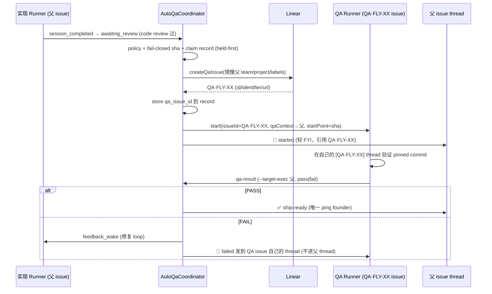

# Plan: Auto-QA 改用单独 QA·FLY-XX issue

**Version**: v1.61.0 (暂定，ship 时按实际 re-version)
**Issue**: FLY-643 (FLY-579 follow-up)
**Date**: 2026-06-28
**Source**: `doc/engineer/exploration/new/FLY-643-auto-qa-separate-issue.md`
**Status**: codex-approved

## 目标

把 FLY-579 auto-QA 的 QA 承载方式从【同-issue `sessionRole=qa` session】换成【单独的 `QA·FLY-XX` Linear issue + 自己的 thread + 自己的 runner】。founder-gating / delay-open 抑制 / 三面抑制 / durable record + 重启 reconcile / fail-closed sha 等不变量全部保留。`qa.auto` 仍默认 OFF（本 PR 不开 enable）。

## 架构（改后流程）

## 实现（file-by-file，TDD）

### 1. StateStore (`packages/teamlead/src/StateStore.ts`)

- `AutoQaRecord` interface 加：`qa_issue_id?`, `qa_issue_identifier?`, `qa_issue_title?`, `qa_issue_url?`。
- `auto_qa_record` 建表加这 4 列（nullable TEXT）+ **幂等 ALTER TABLE 迁移**（参照现有 `migrateChatThreads*` 模式，对已存在的表补列）。
- `rowToAutoQaRecord` 读这 4 列。
- 新方法 `setAutoQaIssue(parentExecutionId, targetPrHeadSha, qaIssue)`：`UPDATE ... SET qa_issue_id/identifier/title/url`。
- **测试**：`StateStore.auto-qa-record.test.ts` 加 setAutoQaIssue round-trip + 迁移补列断言。

### 2. QaContext + Blueprint QA prompt (`packages/edge-worker/src/Blueprint.ts`)

- `QaContext` 加 `parentIssueIdentifier?: string`、`parentIssueUrl?: string`。
- `buildQaModeSystemPromptLines`：『You are verifying X』里 X 用 `qaContext.parentIssueIdentifier ?? issueId`（fallback 兼容手动/同-issue），并在 prompt 里给出父 issue URL（present 时）让 QA 能读父。
- QA runner 的 `prompt`（Blueprint.run line ~611）：reference 父 issue 而非自己的 QA issue。
- **测试**：`Blueprint.fly579-qa-mode.test.ts` 加『parentIssueIdentifier present → prompt 指父』+『absent → fallback 到 issueId（byte-compat）』。

### 3. Coordinator effects (`packages/teamlead/src/bridge/auto-qa-coordinator.ts`)

- `AutoQaSideEffects` 加 `createQaIssue(args: { parent: Session; prHeadSha: string }): Promise<QaIssueRef | undefined>`，`QaIssueRef = { issueId, issueIdentifier?, issueTitle?, issueUrl? }`。
- `spawnQa(session, sha)` 重写：
  1. `record = store.getAutoQaRecord(session.execution_id, sha)`。
  2. 若 `record.qa_issue_id` 已有 → 复用（reconcile 崩溃恢复路径，不重复建）。
  3. 否则 `created = await effects.createQaIssue({ parent: session, prHeadSha: sha })`；`undefined` → `setAutoQaStatus(stuck)` + `alertLeadPipelineError`（fail-closed，founder 不 surface）→ return。
  4. `store.setAutoQaIssue(...)` 立即持久化。
  5. `start({ issueId: qaIssue.issueId, issueIdentifier, issueTitle, issueUrl, sessionRole:"qa", agentName, issueLabels: parseIssueLabels(父.issue_labels), ignoreRunnerLabelSelection: true, startPoint: sha, qaContext: { parentExecutionId, prHeadSha, prNumber, branch, parentIssueIdentifier: 父.issue_identifier, parentIssueUrl: 父.issue_url } })`。
  6. `setAutoQaQaExecutionId(...)`。
  7. 🧪 started → **父 thread**（postThread({ session, ... })），文案引用 `qaIssue.issueIdentifier`。
- `onQaResult` 链路校验：去掉 `qaSession.issue_id !== parent.issue_id` 等值（保留 `!qaSession || role !== "qa"`）；更新注释说明权威绑定 = `record.qa_execution_id`。
- `onQaResult` FAIL 分支：`feedbackWakeMain({ session: parent })` 保留；🔴 postThread 改成发到 **QA session 自己的 thread**（`session: qaSession`，已在上文 fetch），**不发父 thread**。
- **测试**：`auto-qa-coordinator.test.ts` —
  - spawnQa 调 createQaIssue + start 的 issueId=新 QA issue + qaContext.parentIssueIdentifier=父 + `ignoreRunnerLabelSelection:true`；
  - createQaIssue 返回 undefined → record stuck + alert，不 start；
  - reconcile claimed-unspawned 且 record 有 qa_issue_id → **不**再 createQaIssue（复用）；
  - onQaResult PASS（QA 在不同 issue）→ 不再因 issue 不等被拒，正常 release；
  - onQaResult FAIL → wake implementer + 🔴 发 QA thread（非父 thread）。

### 3b. QA runner backend 不被父 issue 的 vendor labels 污染 (Codex R1 #1)

QA 必须跑在默认 transported Claude lane（Claude-in-Chrome 做 real-machine E2E）。但 `RunDispatcher.start()` 的 `issueLabels` 不只是 metadata —— 它经 `buildRunnerSpawnFields` → `resolveRoleAdapter` 的 label 层【驱动 runner backend 选择】(`agy`/`kimi` → no-transport backend，`codex` → 异类 backend)。若 QA runner 继承父 issue 的 vendor labels 就会跑错 lane（这个 leak 在 FLY-579 同-issue 版就已存在）。

修：把『Lead/thread routing 用的 labels』和『backend selection 用的 labels』拆开 —— 新增 `StartRequest.ignoreRunnerLabelSelection?: boolean`：

- `run-dispatcher.ts`：`buildRunnerSpawnFields` 加参数 `ignoreLabels`；为 true 时**不**把 `issueLabels` 传进 `resolveRoleAdapter`（backend 落到 project roles config > env > 内建 claude-tmux）。`BlueprintContext.issueLabels` 仍 = 完整 labels（routing 不变）。导出 `buildRunnerSpawnFields` 供单测。
- coordinator 给 QA 的 `start()` 设 `ignoreRunnerLabelSelection: true`；父 labels 仍完整传（routing 用）。
- byte-compat：retry 路径 + 非-QA start 不传该 flag → false → 现行行为逐字不变。
- **文档化边界**（Codex 要求）：本 flag 只挡【per-issue label】这条 leak；project `roles.runner` config 或 `FLYWHEEL_RUNNER_BACKEND` env 仍可显式把 QA backend 设成别的（那是项目的显式选择，非泄漏）。生产 Flywheel 无 roles config / 无该 env → QA = claude-tmux。
- **测试**：`run-dispatcher` 单测 —— `buildRunnerSpawnFields(.., issueLabels:["agy"], .., ignoreLabels:true)` → backend `claude-tmux` 非 `antigravity-tmux`；`ignoreLabels:false`（默认）→ 仍 `antigravity-tmux`（byte-compat）。

### 4. Concrete effect (`packages/teamlead/src/bridge/auto-qa-effects.ts`)

- 实现 `createQaIssue`：用 `LinearClient`（`config.linearApiKey`）`client.issue(parent.issue_id)` 读 team/project/labels → `createIssue({ teamId, projectId?, title:『QA · <父identifier> — <父title>』, description: 含父 URL + PR# + reviewed commit + qa-executor 合同指针, labelIds: 父 labels（完整镜像 —— 仅 Linear 组织用，runner backend 由 §3b 的 ignore flag 保护，不靠 issue labels） })` → 返回 `{ issueId, issueIdentifier, issueTitle, issueUrl }`；缺 `linearApiKey` / 缺 team / 任何异常 → 返回 undefined（coordinator fail-closed 标 stuck + alert）。
- **测试**：`auto-qa-effects` 新测（用 fake LinearClient / fetch seam）—— 镜像 team/project/labels、title 格式、异常→undefined。

### 5. 文档

- `agents/qa-executor.md`：改成『你跑在自己的 QA·FLY-XX issue 上，验证父 issue/PR；qa-result --target-exec 仍指父』。
- `packages/teamlead/lead-rules-base/auto-qa-pipeline.md`：QA 现在是单独 issue + thread；🔴 failed 是 Lead-facing（不进父 thread）。

## 崩溃安全

- 建 issue 后**立即** `setAutoQaIssue` → reconcile 的 claimed-unspawned 复用 `qa_issue_id`，不重复建。
- 已知良性边角：『Linear createIssue 返回 ↔ DB 写』之间崩 → 一个无 runner 的孤儿 QA issue（Lead 可见、无 gate 影响）。窗口极小，记录在案，接受。

## 不变量 / 字节兼容

- `qa.auto` 默认 OFF；coordinator 缺 startDispatcher / 无 record → `isQaHeld` 永远 false，行为零变化。
- `isQaHeld` 键在父 exec+sha，QA 换 issue 不影响 → 三面抑制（event-route / GatePoller / Heartbeat）零改。
- ✅ ship-ready / approve gate / verify-approval / merge-ship 路径**不碰** —— founder-only-authority 不变。
- `QaContext` 新字段 optional → 手动/旧路径 fallback 到 `issueId`（byte-compat）。

## 测试矩阵

| 层 | 文件 | 关键断言 |
|----|------|---------|
| StateStore | StateStore.auto-qa-record.test.ts | setAutoQaIssue round-trip + 迁移补列 |
| Blueprint | Blueprint.fly579-qa-mode.test.ts | parentIssueIdentifier 进 prompt / absent fallback |
| Coordinator | auto-qa-coordinator.test.ts | 建/复用 QA issue、fail-closed、`ignoreRunnerLabelSelection:true`、onQaResult 跨-issue PASS/FAIL 去向 |
| Dispatcher | run-dispatcher 单测 | `buildRunnerSpawnFields` ignoreLabels=true + agy label → claude-tmux；=false → antigravity-tmux (byte-compat) |
| Effects | auto-qa-effects.test.ts | 镜像 team/project/labels、异常→undefined |

全跑 `pnpm --filter flywheel-teamlead test` + `pnpm --filter flywheel-edge-worker test` + 全仓 `pnpm lint`。
