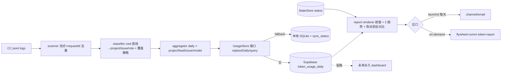

# Plan: 细粒度 Token Usage Tracking — FLY-614

**Version**: v1.62.0（provisional，ship 时再校）
**Issue**: FLY-614
**Date**: 2026-06-28
**Source**: `doc/engineer/exploration/new/FLY-614-token-usage-tracking.md`, `doc/engineer/research/new/FLY-614-token-attribution-feasibility.md`
**Status**: **codex-approved**（Codex 5 轮 APPROVED：R1 12→R2 5→R3 clean→R4 多对多→R5 一对多简化均 sound）；Annie 全部决定已拍(§8) + 一对多简化(cda2ef92)；待 Tadashi review mockup v5 + 放行 → 实现。实现注:校验每 Lead 恰一个 owner 项目

---

## 0. Annie 锁定的方向

| 项 | 决定 |
|----|------|
| 指标 | **纯用量(tokens)** 为主；USD 作次要「重量」(非账单)；不看套餐% |
| 头条数字 | **总 tokens + input/output/cache 拆分**(Annie:随我选,定此)，见 §2 公式 |
| 核心视图 | **改动前后用量对比**(ponytail 灰度核心) |
| 拆分 | **嵌套层级**：项目 → 该项目下 **Leads** + **已完成 issues**；+ 模型维度 |
| issue | **仅算已完成 + 当天用量**(option i,Annie 拍;非 lifetime)；按项目归类 |
| **Lead↔项目** | **一对多**(Annie 再纠正,更简单:项目可多 Lead,但**每个 Lead 恰属一个项目**,无 Lead 跨项目)；简单 1:1 查找；**Lead 折入其唯一项目的总量,天然无重复算**(见 §4.1B) |
| 时间趋势 | **两维度**：(a) 全 fleet 总量随时间 (b) 每个项目各自随时间 |
| 形态 | Variant **B**(对比优先) |
| 持久化 | **Supabase**(托管 Postgres,远程可查,留 dashboard 路) + **数据访问层抽象**(本地 fallback)；只存**每日聚合** |
| 交付 | on-demand HTML + **每天自动贴到专门 Discord channel**(Annie 拍;launchd,见 §7) |
| 范围 | 仅监控；不碰 ② per-project 开关 / ③ evaluation |

mockup：`/tmp/fly614-mockup-v5.html`（真实数据，嵌套 一对多 + 两趋势）。

---

## 1. 架构



落点：新包 `packages/token-usage/`(pnpm `packages/*` 惯例)；CLI 挂 `flywheel-comm`；Supabase 复用 `@supabase/supabase-js` `createClient`(edge-worker cipher/memory 同款,**仅 DML**)。

---

## 2. Phase 1 — Core: Scanner + Classifier + Aggregator

### 文件
`scanner.ts` `classifier.ts` `aggregator.ts` `types.ts`（`packages/token-usage/src/`）。

### Scanner
- 流式扫 `~/.claude/projects/**/*.jsonl`(现真实规模 ~1100 文件 / ~30 万 assistant turns,见 Codex R1 复核 → research 数字更新)。
- 去重 by `requestId`(fallback `uuid`)；只取 `type='assistant'` 且有 `message.usage`。
- **token 字段公式(钉死, Codex#10)**：`total_tokens = input_tokens + output_tokens + cache_read_input_tokens + cache_creation_input_tokens`(缺字段=0)；另存 `fresh_tokens = input + output + cache_creation`(去 cache-read 的「实算」视图,供 Annie「英雄数字」备选)。忽略 usage 里 `iterations/service_tier/speed/server_tool_use/cache_creation` 等非顶层 token 字段。

### Classifier — 覆盖策略(Codex#9)
- `/Dev/<seg>` 第一段解析(避开嵌套 `worktrees/` 子目录,spike 已验)：`<project>-<ISSUE>[-role]`→runner / `<project>`→main / `<project>-<非标准>`(如 sub-uuid)→归 project / 其它→自成 project。
- `lead-workspace/<x>`→lead。
- **显式策略**：已知排除 root(`/private/tmp`、scratchpad、test-slot、claude-501 sandbox)→排除；非 `/Dev` 非 lead-workspace 的绝对 cwd(`home-root`/`other-home`/`tmp`/`unknown`)→归入显式 bucket，**不静默丢**。
- **验收阈值按 token 权重**(非行数)：unknown+excluded 占总 token < 1%；报告显式展示 excluded/unknown 合计，避免「谁烧的」藏量。
- **Timezone(Codex#6)**：`TOKEN_USAGE_TIMEZONE` 默认 `America/Los_Angeles`；`day` = UTC `timestamp` 经该 tz 折算；DST-aware。报告标注所用 tz。

### Aggregator
- 产出 daily × scope{total, project, lead, issue, model} 行；issue/lead 带 `project` 归属(嵌套 + per-project 趋势用)。
- **issue 行对所有 issue 都产出**(不在聚合阶段按完成过滤；完成是 render-time filter,见 §4.1)。

### TDD
- classifier 全形态 + 嵌套 worktrees + 大小写 + 非-Dev bucket + 权重覆盖阈值。
- scanner subagent 侧链带父 cwd + 多 iteration 去重 + total/fresh 公式(fixture 含额外 usage keys) + tz 边界(UTC 午夜 / LA 午夜 / DST)。
- aggregator daily×维度。
- 验收：真实总量 vs ccusage 误差 < 1%(spike 已验 < 0.01%)。

## 3. Phase 2 — Pricing（次要「重量」）
- `pricing.ts`：model→单价表，未知→0+warn；成本用 **整数 micro-dollars 或 double precision**(不用 numeric,Codex#11)。USD 仅相对重量。TDD + ccusage 交叉校验。

## 4. Phase 3 — Persistence: Supabase + 抽象层（重点）

### 4.1 完成态 + Lead 一对多 计数规则

**(A) issue 完成 = render-time filter，语义 = 当天用量(option i,Annie 拍)**
- **聚合层对所有 issue 存每日 token 行**(scope='issue')；**完成判定不写进冻结聚合**,渲染时 join 当前 StateStore。
- **完成集(canonical, Codex R2#3/#4 + R3#1)**：issue identifier 的**最新规范生命周期状态 = `'completed'`**(实现时新增/选对「最新 by-`issue_identifier` 生命周期」helper —— **勿用** `getLatestActionableSession`,它只返 `awaiting_review`/`blocked`;取该 issue 最新一条非-QA session 的 status)。**不含 `approved_to_ship`**(非终态,`StateStore.ts:19`)。QA 独立 issue(`session_role='qa'`)默认不并入。
- **语义 = 当天用量(option i)**：日报展示「当天有活动 且 当前已完成」的 issue 的**当天** token(非 lifetime 跨日求和)；其余进行中 issue 归「+N 进行中用 XM(完成后计入)」note。因只读当天已存行,**无历史回填问题**(Codex R1#1 的 lifetime 风险在 option i 下不存在)。
- 测试：retry failed→completed、completed→rerun running、QA 分离、当天完成才计入。

**(B) Lead↔项目 = 一对多，Lead 折入其唯一项目(Annie 再纠正,更简单,天然无重复)**
- map 是简单 **1:1 查找**：`leadProject: Record<lead, project>`(每个 Lead 恰属一个项目;一个项目可有多个 Lead;**无 Lead 跨项目**)。
- **项目层「大方向总量」= 该项目自身 runner+主仓 + 其名下 Leads**(1:1 折入)。因每个 Lead 只属一个项目,折入**天然不重复算**。
- **嵌套显示**：每个项目下展示其 runner+主仓、其 Leads、其当天已完成 issues。
- 账目对账：grand total = Σ项目(runner+主仓+其 Leads) + Σ其它/沙箱 —— 每 token 恰好计一次(Lead 已含在其项目内,不另加)。
- **已完成 issue 行 = 项目 runner 工作的 drill-down 明细,不是额外 fleet-total 桶**(Codex R4#1):是 runner+主仓那部分的下钻展示,不另加进 grand total。
- **可选「Leads 排名(全 fleet)」视图** = 把各项目内的 Lead 拉平做跨项目排名(同一份 Lead 用量、换角度看,**非重复计数**),直接服务 Annie「每个 Lead 每天 token」。
- **真实 lead→项目 边由 Annie 提供**(mockup 用假设边,见 §8)。

### 4.2 Store 抽象 + replaceDaily（根治 Codex R1#2 stale row + R2#2 事务机制）
```ts
interface UsageStore {
  replaceDaily(day, rows): Promise<void>  // 原子替换该 day 全部 managed 行(删→插)
  queryDaily(opts): Promise<DailyRow[]>   // by date range / scope / project
}
class SupabaseUsageStore implements UsageStore     // 主：调 RPC replace_token_usage_daily(见 §4.3),server 端单调用原子 delete+insert
class LocalSqliteUsageStore implements UsageStore  // fallback：本地 SQLite 事务 BEGIN/DELETE/INSERT/COMMIT
```
- **原子性机制(Codex R2#2)**：supabase-js 单纯 DML 无法包多语句事务 → Supabase 侧把 replace 放进 **Postgres 函数** `replace_token_usage_daily(p_day, p_source, p_rows jsonb)`(随迁移建,§4.3),`SupabaseUsageStore` 用 `supabase.rpc('replace_token_usage_daily', {...})` 一次调用完成原子 delete+insert；delete 失败 insert 失败都在同一服务端事务内,不会出现「删了没插」空天。本地 fallback 用 SQLite 显式事务。
- **`source`(Codex R2#5)**：v1 单一来源 `'cc-jsonl'`,作审计列;delete 谓词带 source 以便将来加第二来源不破契约。`source` 不入 PK(PK=`(day,scope,dim_key)`)。
- 增量：每日 job 重算近 N 天(今天+昨天,迟到日志/跨日)；首次全量 backfill。因完成是 render filter,**不依赖窗口回填完成态**。
- 测试(Codex R2#2)：注入 insert 失败 → 证明旧天行完整保留(原子性)。

### 4.3 Schema + 迁移 + RLS + replace 函数（根治 Codex R1#3/#4 + R2#1/#2）
- **迁移文件已建** `supabase/migrations/20260628_token_usage_daily.sql`(与 `20260316_cipher_tables.sql` 同模式；DDL **不**走 runtime supabase-js)。内含:建表 + 2 索引 + `ENABLE ROW LEVEL SECURITY` + `service_role_all` policy(`auth.role()='service_role'`,镜像 cipher) + **`replace_token_usage_daily(p_day,p_source,p_rows jsonb)` 函数**(SECURITY DEFINER,原子 delete+insert,§4.2 用) + `GRANT EXECUTE ... TO service_role`(REVOKE FROM PUBLIC)。下为要点(完整以文件为准)：
```sql
create table if not exists token_usage_daily (
  day date not null, scope text not null, dim_key text not null, project text,
  input_tokens bigint default 0, output_tokens bigint default 0,
  cache_read_tokens bigint default 0, cache_write_tokens bigint default 0,
  total_tokens bigint default 0, fresh_tokens bigint default 0,
  cost_micro_usd bigint default 0, is_completed boolean,
  source text default 'cc-jsonl', updated_at timestamptz default now(),
  primary key (day, scope, dim_key)
);
create index if not exists idx_tud_day on token_usage_daily(day);
create index if not exists idx_tud_scope_proj on token_usage_daily(scope, project);
alter table token_usage_daily enable row level security;
create policy tud_service_role_all on token_usage_daily
  for all to service_role using (true) with check (true);
```
- 应用方式：Supabase CLI 或 `psql`(用 `SUPABASE_DB_PASSWORD`),ship 前手动跑一次；runtime `SupabaseUsageStore` **假设表存在**,不存在则清晰报错(不自建)。
- **service_role only**：仅本地 job/CLI 用 `SUPABASE_SERVICE_ROLE_KEY`,**绝不进浏览器 HTML**;以后 dashboard 读再单加 read policy/API 边界。
- **下游消费者(Tadashi 提醒)**:**FLY-616 将读本 store 的 per-issue 行(scope='issue')当成本维度** —— 614 算 token、616 消费。本 store 是 token 数据**唯一真相源**,616 不另起炉灶;故 schema 保持可查(per-issue 行带 day/project/total_tokens/fresh_tokens/cost_micro_usd,已索引)。616 接入时若需新查询视图,在此 schema 上加,不复制数据。

### 4.4 Fallback 明确化（根治 Codex#5 split-brain）
- 本地行带 `sync_status`(pending/synced)；Supabase 不可达 → 落本地、job 不失败。
- `flywheel-comm token-report sync --from-local` 回放 pending 行到 Supabase。
- 渲染读「活动 store」并在 local-only 时**显式 banner**「Supabase 不可达，本地数据」；不静默漏天。failover/recovery/幂等重放有测试。

### 4.5 Sizing（Codex#11 修正,给 Annie 放心）
- 每日 ~40-60 行(保守 100/天) → ~3.6 万行/年。含 Postgres heap/varlena/2 索引,实际**几十 MB/年**级(非 7MB)。
- Supabase 免费 **500MB**(与现有 cipher/memory 共享) → 仍**多年 headroom**。
- 只存聚合(非原始事件:原始 ~110 万行/年/几百 MB)= Annie 定调。
- backfill 后用 `pg_total_relation_size('token_usage_daily')` 实测落 plan 附注。
- 抽象层保证换存储容易。

### 4.6 TDD
- UsageStore 双实现契约测试(同入同出)；replaceDaily 删 stale + 零 token 天 + 完成翻转(render filter) + reclassify 重算 + fallback failover/recovery 幂等。Supabase 用现有项目临时表 live smoke + mock。

## 5. Phase 4 — Surface: 每日 HTML（Variant B，嵌套 + 两趋势 + 对比）

### 5.1 渲染
- hero =【改动前后用量对比】；趋势 (a) 全 fleet bars (b) 每项目多线；当日总量 + in/out/cache 分条；**嵌套**：项目 → Leads + 已完成 issues(+进行中 note)；模型卡。

### 5.2 对比视图入参（Codex#7）
- `--before A..B --after C..D` 或 `--rollout-date D --window 7d`。
- 计算：绝对 delta、% delta、cache-read delta、per-project delta、模型 mix delta。renderer 快照测试(Variant B hero)。

### 5.3 CLI
- `flywheel-comm token-report [--date|--since/--until] [--before/--after|--rollout-date] [--json] [--publish] [--daily]`，落 `packages/flywheel-comm/src/commands/token-report.ts` + 注册 `index.ts`。
- 纯文本表→stdout；`--publish` 复用 `publishReport()`(FLY-203)。

### 5.4 发布验收(Codex#12)
- HTML 带 `<head>`；30 天报告 < 512KB(reports-route cap)；过 report CSP；publish 关时降级本地 HTML/JSON。发布需 `/api/reports` apiToken + `VERCEL_TOKEN` + Discord bot token(已具备)。

## 6. Supabase 现状（已调查，cce3964b）
- 已有项目 `SUPABASE_URL=https://cjnscsizaqdwjjfqvplc.supabase.co`(GEO-294 Storage + GEO-145 pgvector memory)。
- 凭据在 `~/.flywheel/.env`(URL / SERVICE_ROLE_KEY / DB_PASSWORD,已在 Bridge 进程 env)。
- **不新建项目、不替 Annie 填凭据**；新表经迁移文件建(§4.3)。

## 7. Phase 5 — 每日自动出口（Codex#8：定 launchd + lock）
- **launchd** 跑 `flywheel-comm token-report --daily --publish`(低 blast radius,非塞进 Bridge)。
- 文件锁 `~/.flywheel/token-usage.lock`(单写)；显式 source `~/.flywheel/.env`；stderr 诊断；失败不静默。
- **出口 = 专门 Discord channel,每天自动贴**(Annie 拍) + 托管 HTML 链接(复用 publish-report)。channel 名/ID 由 Annie/Tadashi 提供;Email 不做(可作未来 follow-up)。

## 8. Annie 终确认结果（2bbc17f1，已 fold）
1. ✅ issue = **当天用量**(option i)。
2. ✅ 头条 = **总 tokens + in/out/cache 拆分**(她随我选)。
3. ✅ 出口 = **专门 Discord channel**(每天自动贴)。
4. ✅ Lead↔项目 = **一对多**(每个 Lead 属一个项目;Annie 后又从多对多简化到此)。见 §4.1B。
**仍需 Annie 给**：真实 lead→项目 **1:1 归属**(每个 Lead 属哪个项目)；专门 channel 的名/ID。mockup 先用假设边。

## 9. DoD
- [ ] Core(scan/classify/aggregate/pricing) 单测 + 覆盖阈值(token 权重) + 真实误差 < 1%。
- [ ] UsageStore 双实现 + replaceDaily(删 stale) + render-time 完成过滤 + fallback sync。
- [ ] 迁移文件建表 + RLS service-role-only；runtime 仅 DML。
- [ ] `token-report` 嵌套 + 两趋势 + 对比入参 + 模型；`--publish` 出托管 HTML(<512KB,带 head,过 CSP)。
- [ ] launchd 每日出口 + 锁跑通。
- [ ] baseline 报告交 Annie。文档归档。

## 10. 明确不做
- ② 开关 / ③ evaluation；实时 dashboard 前端(仅留 Supabase schema/连接路)；套餐%；多账号/多机；存原始 token 事件。
