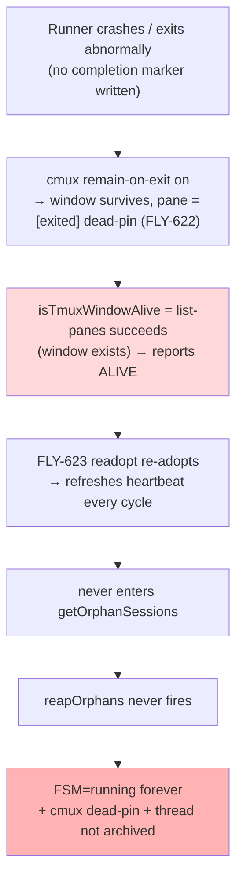
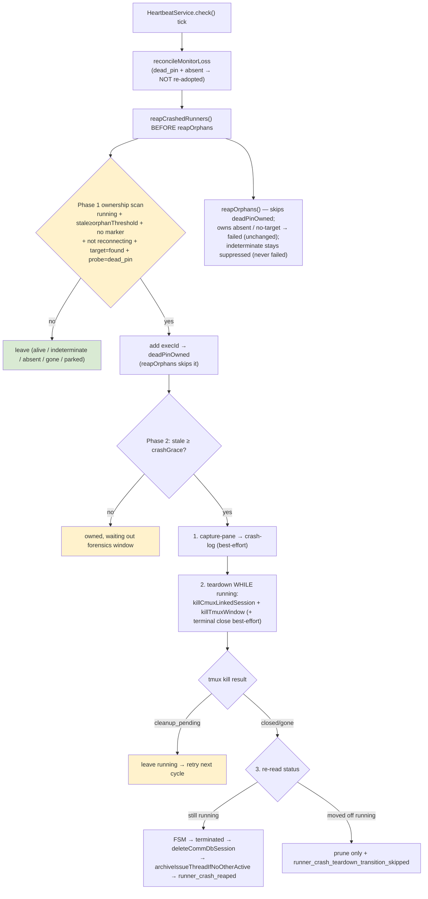

# Plan: Liveness-based crash-runner reaper — close the auto-cleanup gap for crashed/dead Runners

**Version**: v1.63.0 (provisional — taken at ship)
**Issue**: FLY-720 ([infra] 自动清理缺口 — crashed/dead runner 不 auto-clean)
**Date**: 2026-06-30
**Source**: brainstorm gate (flywheel-eng-lead approved 2026-06-30) + in-code root-cause audit
**Status**: codex-approved (Codex design review APPROVED after 3 rounds, xhigh)

---

## 1. Problem — code-confirmed root cause

Annie + Cass observed ~75 zombie Runner rows: **FSM `status=running` but the Runner
process is dead** (`alive=false`), plus **cmux dead-tab residue** and **un-archived
Discord threads**. The question: "this was supposed to auto-clean — why didn't it?"

The auto-cleanup machinery exists for **clean completion** but has a gap for
**crash / abnormal exit**. The precise mechanism (verified in code, sharper than the
issue's static guess that there is "no liveness-based fallback"):

1. **The liveness probe is too weak — it checks window existence, not process death.**
   `isTmuxWindowAlive()` / `probeTmuxWindowLiveness()`
   (`packages/teamlead/src/bridge/tmux-lookup.ts:291`, `:258`) run
   `tmux list-panes -t <window>` and return alive whenever the **window still exists**.
   Because Runner panes run under cmux `remain-on-exit on`
   (`scripts/flywheel-cmux-sync.sh:600-602` says so explicitly), a crashed Runner's
   window does **not** disappear — its pane goes to `[exited]` (the FLY-622 "dead-pin").
   The shell side already learned this and checks `#{pane_dead}`; the TypeScript Bridge
   side never did.

2. **FLY-623 heartbeat readopt (default ON) re-adopts the dead-pin forever.**
   `HeartbeatService.reconcileMonitorLossReadopt()`
   (`packages/teamlead/src/HeartbeatService.ts:420`) probes `isSessionTmuxAlive()`
   (`:604`) → reads the dead-pin as **alive** → `enterReconnecting()` (`:525`) **refreshes
   the heartbeat every cycle**. The session therefore never ages into
   `getOrphanSessions()`, so `reapOrphans()` (`:753`) **never force-fails it**. Result:
   **`status=running` forever** — this is exactly why the 75 are stuck at `running`
   rather than `failed`.

3. **Even if `reapOrphans` fired, it only flips the FSM — no teardown, no archive.**
   `reapOrphans()` transitions to `failed` and notifies; it does **not** call
   `killCmuxLinkedSession`, does **not** close the terminal tab, does **not** archive the
   thread. And `failed` is a `CRASH_PRESERVE_STATE` (`close-runner.ts:53`) — deliberately
   kept for inspection — so the cmux dead-pin would linger anyway.

4. **Teardown only runs on explicit close.** `killCmuxLinkedSession` + terminal close +
   FLY-369 archive only fire from `closeRunner` / `terminate` (`close-runner.ts`,
   `actions.ts`). The terminal-tab reaper (`terminal-tab-reaper.ts`) runs **once at boot**
   (`plugin.ts:2208`). Nothing continuously cleans a crash.

**Net**: the watchdog *can* detect death but never *cleans* it, and the weak liveness
signal hides the death from the one path (`reapOrphans`) that would have acted.

### Second gap the static analysis missed — archive gating

`maybeArchiveThreadOnClose` (`done-thread-archiver.ts:182`) archives **only when
`status === "completed"`**; its doc states `terminated`/`failed`/`rejected`/… **never
archive**. So reaping to `terminated` will **not** archive the thread via that cascade —
the reaper must call the archive sink directly (see §3, Change C).



---

## 2. Goal & non-goals

**Goal**: a continuous, liveness-based backstop that detects a crashed Runner
(process-dead + no marker + FSM=running, past a forensics grace window) and **fully
cleans it**: FSM → terminal, cmux撤, terminal tab closed, thread archived — while
**preserving crash forensics** and **never touching a genuinely alive-but-detached
Runner** (GEO-374 regression guard).

**Non-goals / out of scope**:
- **Worktree cleanup** — already owned by FLY-603 `worktree-reconciler` (merged+clean
  only; a crash worktree is usually dirty → retained, which is safe). Not redone here.
- Reworking `reapOrphans`'s existing `failed` force-fail for genuine no-window orphans
  (kept as-is; the crash reaper claims the dead-pin case before it).
- Any change to the clean-completion path (markers, FLY-324 done-but-running, FLY-172).

---

## 3. Design — three coupled changes

### Change A — pane_dead-aware liveness (resolves Codex R1 MED-5)

**Leave `isTmuxWindowAlive()` and `probeTmuxWindowLiveness()` UNCHANGED** — their existing
callers (`checkStaleCompleted`, marker reconcile, worktree-reconciler, CommDB prune) rely
on the current window-existence semantics. Add a **new 4-state** probe (Codex R2 HIGH-1 —
`dead_pin` and `absent` MUST be distinct so the crash reaper claims only the dead-pin and
never silently changes no-window orphan semantics):

```
type RunnerLiveness = "alive" | "dead_pin" | "absent" | "indeterminate";
probeRunnerProcessLiveness(tmuxWindow): Promise<RunnerLiveness>
```

- Run `tmux list-panes -t <tmuxWindow> -F '#{pane_dead}'`.
- Succeeds, ≥1 pane, **every** pane reports `1` → `"dead_pin"` (remain-on-exit corpse:
  window EXISTS, process dead). Any pane `0` → `"alive"`.
- Fails with an **absence** message (window/session/server gone) → `"absent"` (tmux proved
  the window is gone — NOT a dead-pin).
- Any **other** failure (timeout, transient tmux error) → `"indeterminate"`.

**Rework `HeartbeatService.isSessionTmuxAlive()` (the heartbeat-owned liveness) to use the
new probe** — this is the actual root-cause fix; leaving it on window-existence would keep
readopt refreshing dead-pins forever. Because it must also handle **CommDB lookup
indeterminacy** (Codex R1 MED-3), resolve the target via the discriminated
`lookupTmuxTarget()` (`found` / `gone` / `error`), not the collapsing
`getTmuxTargetFromCommDb()`:
- target `error` (locked/corrupt/transient CommDB) → **`indeterminate`** → treated as
  alive-for-suppression (never reaped) — GEO-374 guard.
- target `gone` (no CommDB row) → keep today's behavior (not owned by the crash reaper;
  `reapOrphans` still handles no-target orphans → `failed`, unchanged).
- target `found` → `probeRunnerProcessLiveness(window)`. For the **readopt/monitor-loss**
  path, alive = `"alive"` or `"indeterminate"` (fail-closed); `"dead_pin"` and `"absent"`
  are both not-alive → `clearReconnecting` (neither is re-adopted). The **crash reaper**
  (Change B) claims only `"dead_pin"`; `"absent"` falls through to `reapOrphans → failed`
  (unchanged, per §2 non-goal).

**Kill-switch**: `FLYWHEEL_LIVENESS_PANE_DEAD` (default ON; `=0` reverts `isSessionTmuxAlive`
to the old window-existence path for emergency byte-compat).

### Change B — crash reaper (reuse the heartbeat timer; ownership BEFORE reapOrphans)

A dedicated, well-scoped reaper (`crash-reaper.ts`, pure logic + injected deps) invoked
from `HeartbeatService.check()` **before `reapOrphans()`** (Codex R1 HIGH-1), in **two
explicit phases** (Codex R2 MED-2) so `crashGrace > orphanThreshold` never reintroduces the
preemption bug:

**Phase 1 — ownership scan (starts at `orphanThresholdMinutes`)**. For each `running`
session with heartbeat stale ≥ `orphanThresholdMinutes`, no pending marker, and not
`reconnecting`/`notifiedMonitorLost`/`markerRetryPending`: resolve the target and probe.
If CommDB target `found` AND `probeRunnerProcessLiveness(window) === "dead_pin"` → add the
execId to the per-cycle **`deadPinOwned`** set. `reapOrphans()` then skips any execId in
`deadPinOwned` (same shape as its existing `isMonitorSuppressed` skip) → it can **never**
force-fail a confirmed dead-pin to `failed`. The other classifications are NOT owned by the
crash reaper and behave as today: `absent` / CommDB-`gone` fall through to the existing
`reapOrphans → failed` orphan path; `indeterminate` (pane-probe or CommDB-`error`) is
**alive-for-suppression** — kept reconnecting / monitor-suppressed, never force-failed and
never reaped (GEO-374).

**Phase 2 — reap action (only when stale ≥ `crashGrace`)**. Of the `deadPinOwned` set,
reap only those whose heartbeat is stale ≥ **`FLYWHEEL_CRASH_REAP_GRACE_MIN`** (default =
`orphanThresholdMinutes`; validated `≥ orphanThresholdMinutes`). A dead-pin at
`orphanThreshold ≤ stale < crashGrace` is **owned but not yet reaped** (suppressed from
`reapOrphans`, waiting out the forensics window). With the default grace the two phases
coincide (own + reap at the same threshold).

On a Phase-2 reap, **teardown-first / transition-after** (Codex R1 HIGH-2 — automatic
retry: while teardown is incomplete the row stays `running`, so the next cycle re-matches):
1. **Forensics dump** (§4): capture the dead-pin scrollback to a durable crash log
   **before** any teardown. Best-effort — capture failure is recorded in the event, does
   not abort the reap.
2. **Teardown** while still `running`: `killCmuxLinkedSession(window)` (撤 cmux dead-pin) →
   `killTmuxWindow(window)` → `closeRunnerTerminalView(...)`. **Teardown contract (Codex R2
   LOW-4)**: `cleanup_pending` iff the **tmux kill** (cmux/window) returns a real error
   (not already-gone). `closeRunnerTerminalView` failure is **best-effort** — recorded in
   the event, does NOT set `cleanup_pending` (mirrors `closeRunner`/`handleTerminate`;
   avoids infinite retry on multi-tab-skip / macOS automation errors).
3. **If teardown returned `cleanup_pending`**: leave the row `running`, log; next cycle
   retries the whole sequence (candidate predicate still matches). No persisted retry surface.
4. **If teardown succeeded (killed / already-gone)** — **re-read the session** and branch
   on its CURRENT status (Codex R2 MED-3, post-teardown FSM race):
   - still `running` → `applyTransition → terminated` (legal `running→terminated` edge;
     `trigger=crash_reap`, `last_error` = crash summary + crash-log path) →
     `deleteCommDbSession(...)` → **archive** (Change C) → audit `runner_crash_reaped`.
   - already moved off `running` by a concurrent completion/event/manual action → do NOT
     force `terminated`; record `runner_crash_teardown_transition_skipped` (with the actual
     status) and apply only the cleanup already done (commdb prune) — the archive cascade
     for the concurrent terminal status is owned by that path, not here.

**Dep wiring**: HeartbeatService lacks archive/teardown deps. `plugin.ts` (which has
`projects`, `config.discordBotToken`, `discordOwnerUserId`, `transitionOpts`, and the
kill/close/archive sinks — confirmed present at the HeartbeatService construction site)
builds a `reapCrashedRunners` callback and injects it. Absent callback (tests /
kill-switch) → no-op (byte-compat). This keeps HeartbeatService the single liveness owner
(no split-brain) while teardown lives where the deps are.

**Kill-switch**: `FLYWHEEL_CRASH_REAPER` (default ON; `=0` disables the reaper — falls back
to today's `reapOrphans`→`failed`).

### Change C — archive on crash reap (reuse the FULL archive policy — Codex R1 MED-4)

`maybeArchiveThreadOnClose` gates on `completed`, so the crash path cannot call it as-is —
but it must **not fork** the safety policy (no-other-active check, label/lead resolution,
chat-channel + thread lookup, `resolveBotTokenForThread`). Refactor
`done-thread-archiver.ts` to extract the guarded archive into a shared helper:

```
archiveIssueThreadIfNoOtherActive(store, session, deps, { allowStatuses })
```

`maybeArchiveThreadOnClose` becomes a thin caller with `allowStatuses = ["completed"]`
(byte-compat — identical behavior); the crash reaper calls it with the crash allowance
(`["terminated"]`) **after** the FSM transition to `terminated`, so the just-reaped row is
no longer in the running/awaiting_review/approved_to_ship active set and is naturally
excluded from the "no other active runner" check. One archive policy, zero duplication.

> Surfaced to Lead via ask f03323fd: crash threads are archived by default (these are the
> stale backlog Annie wants cleaned; the issue lists "thread 归档" as expected). If the
> Lead later says "leave crash threads for real wrap-up", `allowStatuses` becomes a flag —
> but the approved direction is archive.



---

## 4. Forensics & timing (Lead requirements + Codex R1 LOW-7)

- **Scrollback dump before teardown** — §3 Change B step 1. `tmux capture-pane -t <window>
  -p -S -` (full history). Runner windows are **single-pane** (one claude/codex process) —
  documented as an invariant; if a window unexpectedly has multiple panes, capture all
  panes. Durable file + event breadcrumb so the crash scene survives the window kill.
  - **File safety**: create `~/.flywheel/crash-logs/` mode `0700`; write
    `<execId>-<ts>.log` mode `0600` via temp-file + atomic rename; record capture
    success/failure in the `runner_crash_reaped` event.
- **Grace window** — `FLYWHEEL_CRASH_REAP_GRACE_MIN` (**default = `orphanThresholdMinutes`**,
  60 min in the repo default; validated `≥ orphanThresholdMinutes`). A crashed Runner
  stays attachable for at least this long before reap, so Annie can inspect the live
  dead-pin if she catches it; the dump is the backstop for when she doesn't. Default =
  orphan threshold means the crash reaper hands off cleanly with `reapOrphans` (§3 HIGH-1)
  with zero configuration.

---

## 5. Backlog drain (existing ~75) — Codex R1 LOW-6

The continuous reaper drains the backlog **after the grace window elapses from the point a
zombie's heartbeat actually went stale** — NOT necessarily the first post-deploy tick.
Under the diagnosed FLY-623 path the running production Bridge keeps refreshing
`heartbeat_at` via readopt, so a zombie's stale clock may only start at the last pre-deploy
readopt tick; with the pane_dead fix (Change A) those dead-pins stop being re-adopted at
deploy, then reap once `stale ≥ grace`. No separate boot sweep. Logging distinguishes
`confirmedDeadButWaitingForGrace` from `reaped` per cycle so the drain is observable and we
do not over-promise a first-tick sweep.

---

## 6. Test plan (TDD)

Unit (mirroring `HeartbeatService` / `done-running-reconciler` test style, injected deps,
no real tmux):
1. `probeRunnerProcessLiveness` 4-state: all-panes-dead + window exists → `dead_pin`; any
   pane live → `alive`; window-absent error → `absent`; timeout/transient → `indeterminate`.
2. `isSessionTmuxAlive`: `dead_pin` → NOT alive; `absent` → NOT alive; live → alive;
   pane-probe `indeterminate` → alive; **CommDB lookup `error` → alive-for-suppression**
   (Codex R1 MED-3, GEO-374); CommDB `gone` → today's behavior (no-target).
3. Readopt no longer re-adopts a `dead_pin` (regression for the exact root cause): cleared
   from `reconnecting`, ages to orphan; an `absent` session also not re-adopted.
4. **dead_pin vs absent scope (Codex R2 HIGH-1)**: crash reaper claims ONLY `dead_pin`; an
   `absent` (window-gone but CommDB row found) session is NOT owned → `reapOrphans → failed`
   unchanged; assert it is `failed`, not `terminated`/archived.
5. **Two-phase threshold (Codex R2 MED-2)**: with `crashGrace > orphanThreshold`, a
   `dead_pin` at `orphanThreshold ≤ stale < crashGrace` is added to `deadPinOwned` (so
   `reapOrphans` does NOT force-fail it) but NOT torn down / transitioned; once
   `stale ≥ crashGrace` it is torn down + `terminated` (not `failed`).
6. **Teardown-first / retry (Codex R1 HIGH-2 + R2 LOW-4)**: dump **before** teardown; tmux
   kill error → `cleanup_pending` → row stays `running`, retried; terminal-close error →
   best-effort (recorded, NOT cleanup_pending); tmux killed/gone → proceed.
7. **Post-teardown FSM race (Codex R2 MED-3)**: after successful teardown, if the row is
   still `running` → `terminated` + prune + archive; if a concurrent event moved it off
   `running` → NO force-transition, `runner_crash_teardown_transition_skipped` + prune only.
8. Archive path (Codex R1 MED-4): reuses `archiveIssueThreadIfNoOtherActive`; no archive
   when another active runner exists; `maybeArchiveThreadOnClose` behavior unchanged
   (byte-compat: `allowStatuses=["completed"]`).
9. Forensics: capture-pane throws → still reaps, event records dump failure; crash-log
   perms (`0700` dir, `0600` file, atomic rename).
10. Kill-switches: `FLYWHEEL_CRASH_REAPER=0` → no-op (falls back to reapOrphans→failed);
    `FLYWHEEL_LIVENESS_PANE_DEAD=0` → window-existence behavior (byte-compat).

Integration / real-tmux (a small real-tmux spike like FLY-169/610 used): create a window
with `remain-on-exit on`, run a process, kill it → assert `probeRunnerProcessLiveness`
returns `dead_pin` while `isTmuxWindowAlive` still returns true (proves the exact bug + fix
on real tmux 3.5a); kill the whole window → assert `absent`; and `capture-pane` still
yields the dead pane's scrollback.

Real-machine QA (529 Room, gates ship): deliberately crash a real Runner → verify it is
auto-transitioned to terminal + cmux session撤 + Discord thread archived + crash-log
written, and a control alive Runner is NOT reaped.

---

## 7. Risks & mitigations

| Risk | Mitigation |
|------|-----------|
| **False-reap a live-but-detached Runner (GEO-374)** | Only a definite `found`+`pane_dead` reaps; pane-probe `indeterminate` AND CommDB-lookup `error` → alive-for-suppression (never reap); reconnecting/monitor-lost/marker-retry sets still suppress; grace ≥ orphan threshold. |
| Changing liveness semantics breaks other consumers | Keep `isTmuxWindowAlive`/`probeTmuxWindowLiveness` (window-existence) for existing callers; only heartbeat-owned `isSessionTmuxAlive` switches to the new tri-state probe. Kill-switch `FLYWHEEL_LIVENESS_PANE_DEAD=0`. |
| `reapOrphans` preempts crash reaper to `failed` | Reaper runs BEFORE `reapOrphans`; `deadPinOwned` per-cycle set makes `reapOrphans` skip confirmed dead-pins; default grace = orphan threshold (no gap). |
| Teardown fails mid-sequence → half-cleaned row | Teardown-first: transition to `terminated` (+ archive) ONLY after teardown returns closed/gone; a `cleanup_pending` leaves the row `running` → next cycle retries the whole sequence (self-healing, no persisted retry surface). |
| Archive of a thread the team still needs | Reuse the shared `archiveIssueThreadIfNoOtherActive` "no other active runner" guard + token/channel resolution; Discord auto-unarchives on new post; surfaced to Lead (default archive). |
| New per-tick tmux probes add load | Only probes running sessions already stale ≥ grace (a small set); reuses the heartbeat timer; bounded `TMUX_TIMEOUT`. |

---

## 8. Rollout

- Bridge-side only → **restart-gated, founder-gated** ship (single Bridge restart;
  coordinate with any other queued Bridge PRs per the batched-restart discipline).
- Default-ON with two env kill-switches (`FLYWHEEL_CRASH_REAPER`,
  `FLYWHEEL_LIVENESS_PANE_DEAD`) + a grace knob (`FLYWHEEL_CRASH_REAP_GRACE_MIN`).
- **Per-cycle counters (Codex R3 LOW-2, two-phase model)**: `confirmedDeadPinOwned`,
  `confirmedDeadButWaitingForGrace`, `reaped`, `cleanupPending`, `absentPassedToOrphan`,
  `indeterminateSuppressed` — so the middle band (grace > orphan threshold) and the drain
  are both observable.
- Post-deploy: confirm the ~75 backlog drains (via `runner_crash_reaped` events + counters)
  and no live Runner was reaped.

---

## 9. Files (anticipated)

- `packages/teamlead/src/bridge/tmux-lookup.ts` — new `probeRunnerProcessLiveness`
  (tri-state, `#{pane_dead}`) + `captureRunnerScrollback` helper; `isTmuxWindowAlive` /
  `probeTmuxWindowLiveness` UNCHANGED.
- `packages/teamlead/src/HeartbeatService.ts` — `isSessionTmuxAlive` reworked to
  `lookupTmuxTarget` + `probeRunnerProcessLiveness` (tri-state, indeterminate→suppress);
  `reapCrashedRunners` invoked in `check()` BEFORE `reapOrphans`; `deadPinOwned` suppression
  set consumed by `reapOrphans`.
- `packages/teamlead/src/bridge/crash-reaper.ts` (new) — claim predicate + reap sequence
  (forensics dump → teardown → terminate → prune → archive → audit), pure logic w/ injected
  deps + `closed | cleanup_pending` result.
- `packages/teamlead/src/bridge/done-thread-archiver.ts` — extract
  `archiveIssueThreadIfNoOtherActive({ allowStatuses })`; `maybeArchiveThreadOnClose`
  delegates with `["completed"]` (byte-compat).
- `packages/teamlead/src/bridge/plugin.ts` — construct the `reapCrashedRunners` callback
  with deps (projects, `discordBotToken`, `discordOwnerUserId`, transitionOpts,
  killCmux/terminal/archive sinks) + env knobs; pass into HeartbeatService.
- Tests under `packages/teamlead/src/__tests__/` (+ a real-tmux spike).
