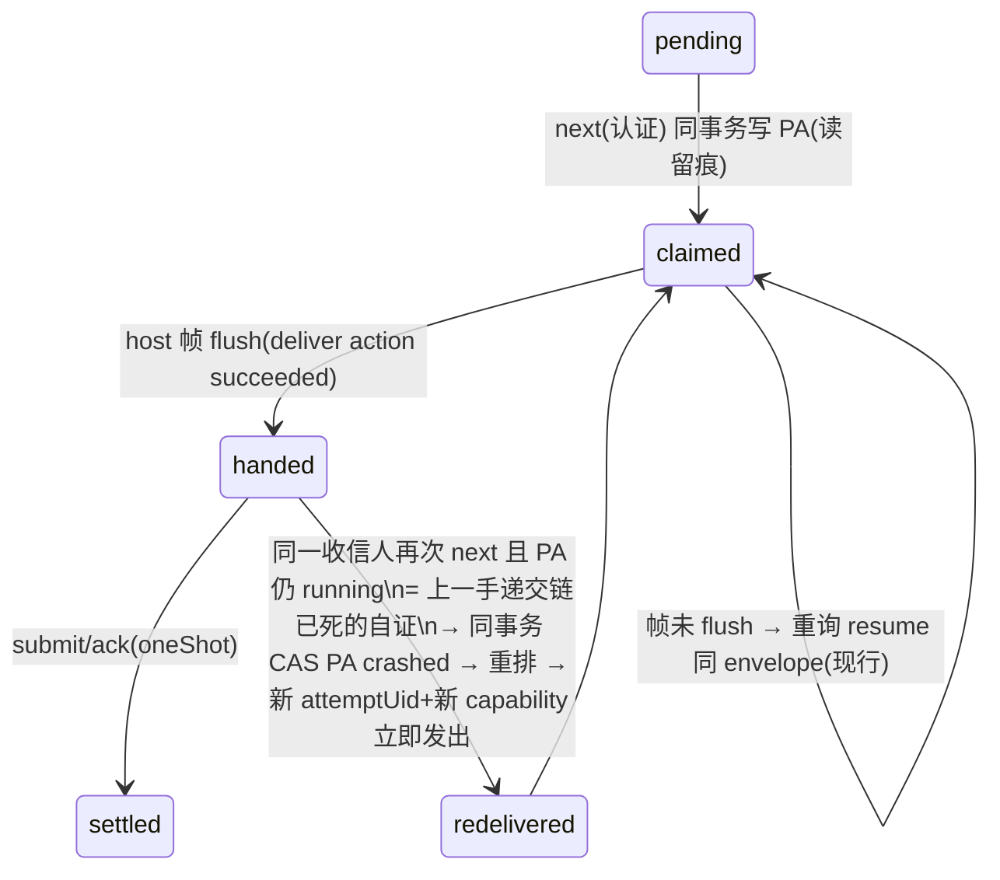

# Plan: v2 信箱服务 — MCP 工具面 + Claude 推送面 + Codex 发送器 + 读/办两章语义(纠正门铃)

**Version**: v2-dag lane(随 ship 取号)
**Issue**: FLY-1547
**Date**: 2026-07-30(R3 修订:折入 codex R2 九条 findings;新增远控附着 runner 形态正向 spike PASS)
**Source**: Linear FLY-1547;`doc/engineer/research/new/FLY-1546-mcp-feasibility/FLY-1546-result.md`;`doc/engineer/research/new/FLY-1547-codex-wake-spike/FLY-1547-codex-wake-result.md`(负向+正向两次真机);`/tmp/fly1547-design-review-r{1,2}.md`
**Status**: draft(待 codex R3;§9 两项裁决已落,见该节)
**执行节点**: generic(attempt 5a4d2e89 gen 1, worktree wt1547b)

## 0. 已落地切片(HEAD 上可查,R2 已作为 source evidence 核过)

- FLY-1546 三项可行性 PASS(b5dd9450);codex 裸 TUI 负向 spike(隐形分叉实锤)+ **远控附着 runner 形态正向 spike PASS**(daemon→thread/start→bounded bootstrap turn→TUI `resume --remote` 附着→外部 `turn/start` 铃带稳定 `clientUserMessageId`→**铃与回复渲染在附着 pane**;拆除需进程组 kill,单 pid kill 实测不死);
- `ask_kind` founder 分流(默认 off,R2 判 sound and closed;补充文档:`founder_push` 改值需重启 host);
- `mailbox_status` 只读 verb(fence 到本人;返回 **raw kinds+askKind 分组**,分章由消费侧用 §2.3 共享模块推导 —— 修正 R2 指出的 plan/实现不一致:host **不**返回 chapters);
- `issueTitle` descriptor→envelope→prompt(R2 判 propagation sound;producer 缺口 → §2.8)。

## 1. 目标与红线

(与 R2 版一致,不重复。红线:不新增 flag/守护/兜底;agent-agnostic;失败必出声;import 不 copy。`founder_push` 已获 founder 亲自豁免;§9 两条已裁(①放行/②A)。)

## 2. 设计(R2 逐条闭环)

### 2.1 读/办的投递状态机(R2-F1,取代 R2 版 §2.2 的错误 resume 声称)

R2 正确指出:host 帧 flush 后 `mailbox.deliver` action=succeeded,现行 `prepareDelivery` 对同一 PA 不再返回 envelope("already handed")→ MCP 死在结果递交前 = 该信永久 ambiguous。**闭环:同席重询即自证 crash-settle**。

**冻结的状态机**(runner 与 lead 同一台,见 §2.2):

依据:协议本就要求 settle-before-next。同一收信人在未 settle 的情况下再次 `next`,只有一种合法解释:上一封的递交链(host帧→MCP→模型)断了。因此 `pollRunnerDelivery` 增加分支:running PA + deliver action 已 succeeded → **同一 kernel 事务内** CAS 该 PA `crashed` + 重排 message + 开新 PA/capability 返回。at-least-once 成立(可能重复看到,绝不静默丢),重复投递有新 attemptUid(协议 redelivery 条款原文语义)。deliver action 仍 intended(帧没 flush)→ 现行 resume 同 envelope 路径不变。

**"读"的产品定义**:读 = 认证 `next` claim(PA 行:谁/几点/哪封)。递交丢失不丢信(上述重投),读时间戳语义 = "该信进入收信人之手的时刻"。

**FYI 延迟 ack**(R1-F2 的 R3 形态):`next` 返回 FYI 不销;**下一次任何 mailbox 工具调用**开头先空 submit 销上一封 FYI。崩溃窗口全部落入上面的状态机:未销 FYI 的 PA running → 重询即重投。故障注入测试:claim 后崩 / 帧 flush 后崩 / 延迟 ack 前崩 / 延迟 ack 的 submit 后结果丢 / host 重启 / lead takeover,各证不丢不双销。

### 2.2 Lead 拉取重构:上 durable session 式结算台(R2-F1 lead 半)

现状:注册即起 `#runLead`(预拉+建 PA+in-memory converter,settle 走 converter,`no host converter is waiting` 即死)。**改法:lead 信箱流全面迁到 durable 台**——

- `next_delivery`(credential 认证)在 host 内**按需** pollOnce(claim-at-next)→ prepareDelivery(durable delivery action)→ 返回 envelope+capability;
- lead 的 `submit`/`ack` 走 `#submitSessionProposal` 同款 **durable ledger 结算**(按 recipient 判台:session 前缀或 lead agents 行;不再依赖 in-memory converter);
- `#runLead` 的 mailbox 拉取/转换环退役;driver 保留 wake 信号(enqueue → `#wakeRecipient` 唤 long-poll waiter,现机制);
- **迁移期兼容**:部署瞬间在飞的 lead PA 按 §2.1 状态机自愈(重询即重投);discord-messenger 的 CLI 用法(`next --agent`+credential / `ack`)字节不变,全量回归 + sentinel 测试锁行为。
- `#runLead` 中非信箱职责(conversion action drain / reportConversionFailure)如仍被其它流使用,保留原样并在实现期以测试圈定 —— scope 只动 mailbox 流。

### 2.3 分章封闭清单与共享模块落位(R2-F2)

**落位改为 `packages/v2-dag/src/settlement-disposition.ts`**(依赖中立:doorbell 同包;host/v2-cli/mailbox-mcp 均已依赖 v2-dag;不产生反向依赖)。**清单已在设计期完成全仓盘点**(appendLifecycleTx + appendMailboxTx + host enqueue 全部callsite):

- **FYI 章(读后延迟 auto-ack)**:`issue_opened, issue_closed, node_completed, task_dispatched, pr_ready, issue_merged, ship_authorized, ship_action_blocked, ship_retry_exhausted, span_anchor_diverged, review_family_exhausted, lost_writer_span_adopted, attempt_lost_open_candidate, task_dispatch_skipped, task_dispatch_skipped_repeat, task_contract_invalid, task_contract_invalid_repeat, task_dispatch_invalid, task_dispatch_invalid_repeat, instruction, ask_response`,以及 `runner_ask` 且 payload 校验 `ask_kind="progress"`。(`instruction`/`ask_response` 归 FYI = 现行 lead/runner 读即结算行为的忠实映射,作为显式假设供 review。)
- **办事章(显式 settle,欠账可见)**:`task_assignment`(由工作提案结算,MCP 绝不代 ack),`runner_ask` 且 `ask_kind∈{ask,blocked}`(先回信后结算,§2.4)。
- **未知 kind / malformed runner_ask payload → fail-loud**:不销、保 pending、isError 上浮、stderr 留痕。
- (R3-F7 后记:实际清单以 `CLASSIFIED_MAILBOX_KINDS` 导出为准——对账测试期即已多于本节手写清单 4 个 kind;工具面 `send` 只允许 `MAILBOX_SEND_KINDS` 联合(当前 `instruction`),不可制造未分类欠账。)
- **源码点名对账测试**(v2-dag 内,executable source-of-truth):测试在运行时读取 `src/*.ts` 源文本,提取全部 `appendMailboxTx`/`appendLifecycleTx`/enqueue 字面 kind(含 `${kind}_repeat` 模板展开),断言每个都被 disposition 分类;新增未分类 kind → 测试红。host 侧 enqueue 字面 kind(runner_ask/instruction/ask_response/task_assignment)以固定清单断言。

### 2.4 `settle(reply)` 与 `send` 的幂等(R2-F3)

- **reply 输入只有 body**。路由/kind/关联 uid 全部服务端从**被结算的 envelope** 派生(`runner_ask.payload.session_ref/uid` → `ask_response` 到该 session,payload `{v,uid,body}` 现行 wire 形态字节不变)。模型无法选错路。
- **幂等键 message-scoped、无 generation**:`source_kind="mailbox_reply"`,`source_id=<被答 message_uid>`。takeover 后 B 代重投:同 body=幂等重放;异 body=enqueue 冲突 fail-loud → MCP 把"已存在的回信"读给模型并允许 **settle-without-reply**(结算不再发第二答)。回答者身份/世代记在 reply payload 的 `answered_by` 字段(审计),不进幂等键。
- **`send` 必带 caller `dedupe_key`**(工具 schema required;server 组 `mcp_send:<sender agent_id>:<dedupe_key>`)。不再有服务端随机键(R2 指出其 response-loss 不可重试)。
- 崩溃矩阵(R1 五则 + takeover-between-enqueue-and-settle)全测。

### 2.5 门铃纠正 + 铃的 durable cursor(R2-F7)

路由不变(R2 判 SATISFIED:铃只带指针、行保持 pending、引擎绝不销账;三通道 claude-channel / codex-daemon / 最后手段贴指针)。补齐 cursor/重放:

- **引擎侧(codex 铃 + 贴指针铃)单一 writer = doorbell tick**。per-session cursor 存 meta 信封 `bell_cursor:<sessionRef>`:`{last_rung_seq, last_rung_at}`。顺序:读 cursor → 需响(max_pending_seq > last_rung_seq 或 overdue)→ `recordExternalEffectIntentTx`(effectKey=`bell:<sessionRef>:<maxSeq>`)→ 外部效果(codex `turn/start` 的 `clientUserMessageId` **= 同一 effectKey**,crash 重放时 codex 侧幂等)→ 同事务写 outcome + cursor + `session_bell_rung` 事件。crash-before-outcome 重放:intent 已在 → 重试同 effectKey,不重复消费 token。
- **MCP 侧(claude channel 铃)cursor 是进程内高水位;重启策略冻结为:重启后对当前 pending 立即重响一次**(重复铃无害、丢铃有害;声明为 accepted 行为并测试)。
- overdue 重响:`OVERDUE_RERING_S=300` 常量;同 seq 每 overdue 周期至多一响(cursor 带 last_rung_at)。
- 测试:effect 成功但 commit 丢 / crash before effect / 重启带存量 pending / 同计数换信 / overdue。

### 2.6 Codex runner 形态切换:契约已由正向 spike 冻结(R2-F4;守护红线裁决见 §9)

正向 spike(§0)证明形态成立。实现契约(全部具名,不留实现期发现):

1. **launcher 起 daemon**:`spawnCodexDaemon`(import;含 lock/短 socket/`ensureDead`/进程组机制)per-session,socketPath 记入 runner-state(新字段 `codex_daemon`:{socket_path, thread_id, pgid});
2. **thread 引导(R3-F5 修订,与已落地实现一致)**:launcher 经 daemon `thread/start` → **无害 READY bootstrap turn**(bounded;turnless thread 不可 resume——FLY-398 教训,spike 复证;真正的 assignment **不**在此跑,避免任务在 TUI 附着前 headless 展开)→ threadId 持久化 runner-state **先于** TUI 附着 → TUI 附着后,**assignment 在 activate() 作为第一个真 turn 投递**(稳定 `clientUserMessageId=assignment:<sessionRef>`),渲染在可见 pane;
3. **tmux pane 起 `codex resume --remote unix://<sock> -C <cwd> -s workspace-write -c approval_policy=never <threadId>`**(复用 `tui-window.ts` 的 shell-safe 校验模式);
4. **发送器(R3-F5 修订)**:`clientUserMessageId` 只是关联数据,不是 app-server 去重原语——发送器**先对账后开炮**:`thread/read(includeTurns)` 证明该 id 的 turn 是否已存在(崩溃重放场景),已存在→`already_present` 不再开新 turn;确证缺席才 `turn/start`。`startTurn` 的返回=RPC 受理(turn 异步跑),bounded 等待超时按常态记日志。落位 `packages/v2-host/src/codex-remote.ts` `sendCodexTurn`(doorbell 铃与 assignment 共用);绝不杀 daemon;
5. **生命周期归属(R3-F5 崩溃相位已定):launch = daemon 起→**立刻持久化 partial state{socket,pgid}**→thread/start→READY turn→**full state{+thread_id}**;任一相位崩溃留下的都是**有记录的孤儿**——下次 launch 见"有 daemon 无 thread"即 teardown 重来(绝不收养无 thread daemon,绝不留无主常驻)。daemon 与 tmux session 同生同灭 —— launcher `stop(sessionRef)` 扩为:kill tmux + daemon `stop()`+`ensureDead()`(进程组);probe 扩为 tmux+socket 双探;host 重启走现行 `#syncCurrentRunners`(binding 活性)+ runner-state 里的 pgid/socket 对账,stale socket 按 spawnCodexDaemon 既有 stale-socket 清理;launcher launch 失败路径:daemon 已起而 tmux 失败 → 立即 `ensureDead` 再抛;
6. **并发仲裁**:同 socket 双客户端(TUI + 发送器)是 daemon 原生支持形态(Mufasa 生产同型);发送器只发铃指针 turn,不 read/goal/steer。
7. 裸 TUI(无 `codex_daemon` 记录的既有会话)→ 永远只走最后手段贴指针(负向 spike 铁律)。

**claude runner 接线(同属 launcher,§3 行 6)**:`--mcp-config <per-activation mailbox-mcp.json>`(env 注入 SOCKET/SECRET/SESSION_REF/LEASE 路径)+ `--dangerously-load-development-channels "server:flywheel-v2-mailbox"`。consent:**真机实验已判定 preseed 不可行**(2026-07-30:干净 config dir 走完 consent 后全目录 grep,server 名只出现在会话 transcript——consent 不持久化,每次启动都会弹)。故采用 claude-lead.sh:1392-1419 已验证的 capture-pane 自动确认 poller:launcher `activate()` 释放门后起 bounded poller(识别 dev-channels 对话框 → send-keys 确认;30s 无对话框自然退出;失败 fail-loud 留事件)。

### 2.7 Lead 注册与 MCP 接线(R2-F6,事实已核)

- **注册归属(现状事实)**:`~/.flywheel/v2/bin/register-operator-lead.sh`(operator 侧)对活 claude 进程执行 `register-lead`;当前**未**传 `--delivery-credential-out`,即 flywheel-eng-lead 今天没有落盘 credential。
- **变更(具名)**:该脚本加 `--delivery-credential-out $V2/state/flywheel-eng-lead-credential.json`(CLI 已支持,0600 落盘;`v2-discord-outbound.ts:169-188` 为同型前例);takeover=重跑注册脚本,credential 原子重写(CLI `stashDeliveryCredential` 现行为),旧 credential 被 host revoke → 旧 MCP 子进程下一次调用 fence 拒 → fail-stop 退出删 lease(§2.5 R2 版已 RESOLVED 的健康合同)→ 新会话的 MCP 子进程现读新文件。MCP 子进程**每次调用现读**credential 文件,天然跟随轮换,无缓存失效问题。
- lead 会话注册 mailbox-mcp:`claude-lead.sh` 的 .mcp.json 物化段(:2142-2169)与 channels 段(:2333-2358)各加一条(与legacy flywheel-inbox 并存,互不相扰);env 注入 `FLYWHEEL_V2_LEAD_AGENT_ID` + `FLYWHEEL_V2_LEAD_CREDENTIAL_FILE` + socket/secret 路径。身份 schema 互斥矩阵照 R2 版(runner ⇐ SESSION_REF;lead ⇐ 两个 LEAD_* 齐且无 SESSION_REF;其余 fail-stop)。
- 变更清单加:`~/.flywheel/v2/bin/register-operator-lead.sh`(运维文件,PR 附 diff 说明,由 operator 应用)。

### 2.8 issueTitle 生产者(R2-F8)

事实:仓内唯一 admit 入口是 CLI direct verb,request-file 由 **flywheel-eng-lead(operator lead)按 issue-intake 工作流亲手起草**——不存在可改的 Linear 代码 ingress。闭环:

1. **CLI admit 边界加可见提醒**:request 缺 `issueTitle` 时 stderr 打印一行 warning(不 gate,legacy fixture 兼容);
2. lead 的 intake 合同文本(admit request 模板)加"必填 issueTitle"—— 落在本 PR 能触达的位置:`.flywheel/agents/nodes/` 手册的 admit 说明段 + 设计文档;lead 侧工作流由 lead 依此更新(已在 ask 汇报里知会);
3. e2e fixture:admit request JSON(含 title)→ digest/dag_issue → launchContext → prompt 全链测试(descriptor 层已有,补 request-file 形态)。

### 2.9 复用 seam 与负载(R2-F9/F10)

- **删除 teamlead facade**(R2:不为关账交付 inert 导出);发送器全部 import `flywheel-claude-runner` 既有导出(正向 spike 已实证可用)。
- inbox-mcp `channel-lease.ts` 抽取 + reverse-compat(R2 已判 RESOLVED,不变)。
- 1s 轮询假设 + jitter + ≥8 会话有界负载测试(R2 已判 RESOLVED,不变)。

## 3. 变更清单(v3)

| # | 位置 | 变更 |
|---|---|---|
| 1 | `packages/v2-host/src/delivery.ts` | §2.1 状态机:running PA + deliver-succeeded + 同席重询 → 同事务 crash-settle+重排+新 capability 立即重投 |
| 2 | `packages/v2-host/src/host.ts` + `packages/v2-engine/src/driver.ts` | §2.2 lead claim-at-next + durable 结算台;`#runLead` 信箱环退役为 wake |
| 3 | `packages/v2-dag/src/settlement-disposition.ts`(新) | §2.3 封闭分章 + 源码点名对账测试 |
| 4 | `packages/v2-mailbox-mcp/`(新包) | 五工具(settle(reply) §2.4 / send 必带 dedupe_key)+ FYI 延迟 ack + channel 铃(§2.5 重启重响策略)+ fail-stop lease + `codex-bell.ts` |
| 5 | `packages/v2-dag/src/doorbell.ts` | 铃路由 + `bell_cursor` meta + intent/outcome + `session_bell_rung/failed` |
| 6 | `packages/v2-host/src/tmux-runner-launcher.ts` | claude MCP+channels+consent;codex daemon+thread 引导+remote 附着+runner-state `codex_daemon` 字段+stop/probe 扩展(§2.6) |
| 7 | `packages/v2-host/src/runtime-ports.ts`+`coordinator.ts` | doorbell port 三通道;launcher 端口签名 |
| 8 | `packages/v2-cli/src/cli.ts` | admit 缺 title stderr warning |
| 9 | `packages/inbox-mcp/` | `channel-lease.ts` 抽取 + exports + reverse-compat |
| 10 | `packages/teamlead/scripts/claude-lead.sh` | lead 注册 mailbox-mcp + env |
| 11 | `~/.flywheel/v2/bin/register-operator-lead.sh` | `--delivery-credential-out`(运维 diff) |
| 12 | `.flywheel/agents/nodes/*.md` | 工具面合同段 + admit issueTitle 必填说明 |

## 4. 测试计划

§2.1 六窗口故障注入;§2.2 lead 全量回归+messenger sentinel;§2.3 对账测试;§2.4 崩溃矩阵+takeover;§2.5 五则 cursor/重放;§2.6 launch/stop/probe/host-restart/daemon-fail 生命周期矩阵(mock transport 单测 + 真机 E2E);§2.7 身份互斥+takeover 轮换;真机 E2E 验收(Claude+Codex 各一收信→PA 留痕→settle;lead 走 MCP 面回 ask;channel 铃 + codex 远控铃 pane 可见;founder_push=off 零推送);全仓 lint+build+owning tests。

## 5. 风险与显式假设

1. `instruction`/`ask_response` 归 FYI 章 = 现行为忠实映射(显式假设,review 判)。
2. lead durable 台迁移触碰 messenger 生产路径(sentinel+回归控)。
3. codex daemon per-session 的内存/进程开销(每 runner 一个 app-server);可接受性由 §9 裁决连带确认。
4. channel 门链 vendor 依赖(spike 已过;dev-channels 收紧的退路=正式白名单,超 scope)。
5. 重启重响(claude 铃)与 crash 重投(§2.1)带来的重复投递 = at-least-once 明码代价。

## 6. 交付切片

1(已) spikes+设计;2(已) founder 分流+status+issueTitle;3 §2.1+§2.2 投递状态机(TDD);4 §2.3 disposition+对账;5 mailbox-mcp 包;6 doorbell+cursor+codex-bell;7 launcher codex 形态+claude 接线+lead 接线;8 真机 E2E+手册+review verdict 文件。

## 9. 权限裁决(lead 已裁,2026-07-30,message 8e2c14c4)

1. **"一个进程,三张脸" → 按现设计放行**。lead 裁词(立法意图,原文录存以防日后按字面翻案):「一个进程」这句话的立法意图是**不要再多一个需要单独运维、单独重启、会自己掉线的常驻件**,不是在数进程个数。一个包里两个运行位、同生共死、同一份配置、同一个生命周期——没有引入新的运维对象,符合意图。
2. **codex 通道 → 选 A(切远控附着形态),性质=红线的显式例外(exception),非"合规认定"**。lead 裁词忠实录存(R3-F6 纠正:不得把例外改写成合规):①「不新增守护」是硬红线,per-session daemon **正是它要挡的那类东西**——每会话一个常驻件,正是"会自己掉线、要单独救"的那类;②尽管如此仍选 A,因为 B 案(codex 全走贴指针)退回当天已实测**丢三次投递**的贴终端路径,不能把一个厂商整个绑在上面;③本 issue 两个 spike 的真机证据指向 A(裸 TUI=隐形分叉必须结构性拒绝;远控附着铃 turn 在可见 pane 渲染 PASS)——**有真机证据的那条优先**;④远控附着形态天然满足 founder 的 Codex 窗口化铁律(FLY-398)。**例外的成立条件**:launcher 真正拥有 daemon 的完整生命周期(与会话同生同灭、崩溃各窗口有记录的 owner,§2.6);生命周期形态若变,需重新请示。

## 10. 相邻 issue 对齐(lead 同步,不扩本单范围)

- **FLY-1553(Urgent,出站服务假 succeeded)**:本设计的结算语义在结构上排除同类假账——`settle`/ack 走 oneShot proposal,成功以 kernel 受理回执(receipt)为准;`send`/reply 以 enqueue 的 `{status:"enqueued"|"duplicate", messageUid}` 确认标识为准,**拿不到对方账本的确认标识就不会被记成功**(V2Client 无回执即 throw,fail-loud)。1553 自身修复不在本单。
- **FLY-1529(入站来源开关 discord/mailbox 可动态切)**:非本单工作;本设计已为"mailbox 成为 lead 唯一入站源"留位——lead 面与 runner 面共用同一合同/同一账本/同一 MCP 面,discord ingress 只是 enqueue 的一个 sourceKind,切换入站源不触碰信箱语义。
