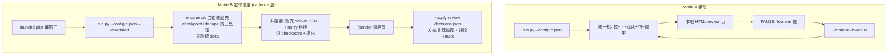

# Plan: xiaohongshu-deep-learning — 跨项目唯一的小红书学习核(打包 FLY-349 引擎 + 收敛)

**Version**: v0.2.0 (skill 自身版本;非 Flywheel repo 版本)
**Issue**: FLY-443
**Date**: 2026-06-22
**Source**: `doc/engineer/exploration/new/FLY-443-xiaohongshu-deep-learning-skill.md`、`doc/engineer/research/new/FLY-443-fly349-engine-packaging-audit.md`
**Status**: codex-approved (v0.2.0 Codex design review 4 轮:v0.1.0 R1 7 项→R2 APPROVED;Annie brainstorm 扩 scope→v0.2.0 R3 7 项→R4 APPROVED,无剩余 blocker)

> **本轮交付 = 这份 plan + exploration + research,doc-only PR(#315,仿 FLY-358 #295)。** 真正实现到 `xrliAnnie/flywheel-skills` 仓 = Annie 批 plan 后的 follow-up。FLY-349 当前 107 收藏夹的跑 worktree 隔离、零影响。
>
> **v0.1.0 → v0.2.0 变更(据 Annie 2026-06-22 brainstorm 形态答复)**:从「纯打包」扩成「**deep-learning = 跨项目唯一的小红书学习核**」——加 ① 两种运行模式(手动 + 定时增量)② 可移植**调度/cadence 层** ③ **Lead/agent 驱动自动配置** ④ **记忆回写**(可行性评估,见 §9)⑤ **收敛路线**(no-code 近期共存 → 退休)。v0.1.0 的打包/参数化/解耦/安全加固(Codex R1 7 项)**全部保留**。

---

## 1. 目标与范围

**目标**:把生产可用的 FLY-349 自包含深读引擎(`scripts/fly349-engine/`)做成 **per-project config 驱动、零 pip 依赖、可跨项目 install、Lead/agent 自动配置** 的 flywheel-skill `xiaohongshu-deep-learning`,成为**跨项目唯一的小红书学习核**。任何项目接入后能「**读小红书 → 多模态深读 → 识别可做的 → 建 follow-up Linear issue → 本地 review 页**」,手动跑或定时增量跑,不用每次口头教。

**范围(做)**:
- **A 打包 + 参数化 + 解耦 + 安全**(v0.1.0 已 Codex-approved,保留):config schema(stdlib JSON,逻辑零改)、所有 user-visible 文案去 Flywheel 化、secret 纯 env、三处 notify 解耦、安全不变量原样保留 + no-leak 探针测试。详见 §3-§7。
- **B 两种运行模式**(Annie Q1):**A 手动**(跑一批→本地 HTML→review)+ **B 定时增量**(只处理 checkpoint 之后的新 note,async 交付)。详见 §8。
- **C 可移植调度/cadence 层**(Annie Q1-B,no-code 有/deep 要加):per-project launchd,不依赖 Flywheel Bridge。详见 §8。
- **D Lead/agent 驱动自动配置**(Annie Q5):接入新项目 = Lead/agent 问清需求后自动写 config,用户基本不碰。详见 §10。
- **E 记忆回写**(Annie Q4,可行性评估):学 founder 口味回写。可移植本地 taste-profile 方案 + 闭环消费。详见 §9。
- **F 收敛路线**(Annie Q2):deep = go-forward 唯一核;no-code 近期共存 → 退休准则。详见 §11。

**非目标(不做)**:① 改 FLY-349 当前跑;② 跨 OS(v1 接受 macOS 同机,文档标边界);③ 引擎核心逻辑重写(只参数化 + 加薄外壳:模式/调度/配置/记忆);④ no-code 的实际退休(单独 issue,本 plan 只定准则);⑤ 别的平台(抖音/YouTube,只在 config/结构上不堵死,不实现)。

## 2. skill 目录结构(仿 writing-engine 先例)

```
skills/generic/xiaohongshu-deep-learning/
├── SKILL.md                      # agent 操作说明:接入自动配置(§10)+ 两模式跑法 + 安全 + 前置
├── scripts/
│   ├── run.py                    # 引擎入口(改:读 config;加 --scheduled / --apply-review)
│   ├── config.py                 # 新:stdlib JSON config loader + 校验 + typed
│   ├── schedule.py               # 新:生成/装/卸 per-project launchd plist(调度层,§8)
│   ├── checkpoint.py             # 原样(state 路径来自 config)
│   ├── dedupe.py                 # 原样
│   ├── load_gate.py              # 改:GateConfig 默认从 config 注入
│   └── orchestrator.py           # 改:支持 scheduled 非阻塞增量(不 per-batch pause)
├── assets/
│   ├── config.example.json       # 严格无注释 JSON(json.load 能读)
│   ├── config-schema.md          # 每个 config 键的含义/默认/约束(注释只活这)
│   ├── INSTALL.md                # 接入(Lead/agent 自动配)/两模式跑/调度/PYTHONPATH 命令
│   └── prereqs.md                # yt-dlp / gemini(key 或 agy)/ xiaohongshu-mcp 登录态 / macOS host 假设
└── tests/
    ├── test_checkpoint.py …      # 现有 6 个(原样迁入,PYTHONPATH=scripts 跑)
    ├── test_config.py            # 新:loader/校验/缺失 fail-fast/密钥不入文件
    ├── test_scheduled.py         # 新:增量 delta / 非阻塞 / lockfile 防重入
    ├── test_apply_review.py      # 新:消费决定(close/create)+ crash-safe ledger(taste 写回 = v1.1,§9)
    └── test_noleak.py            # 新:no-leak 探针(核心门)
```

- frontmatter `name: xiaohongshu-deep-learning` == 目录名;`metadata.skill-version: 0.2.0`。
- SKILL.md 引用脚本用 `$HERE/scripts/...`。

## 3. config schema(核心交付,v0.2.0 扩)

格式 = **stdlib JSON**(守零 pip 依赖)。密钥 **env-only,绝不进文件/argv**。下面 `jsonc` 注释**仅讲解**;ship 的 `config.example.json` 严格无注释。

```jsonc
{
  "collection": { "id": "…", "label": "…", "fetch_limit": 126 },   // 收藏夹 id/slug/拉取上限(≤200)
  "linear": {
    "team_key": "…", "project_name": "…", "label": "…",            // 建单目标(project/label 可空)
    "state_type": "backlog"                                         // 落单状态 type(preflight 校验存在)
  },
  "analysis": {
    "engine": "gemini-paid",          // gemini-paid(默认) | agy(opt-in)
    "model": "gemini-2.5-pro",        // 过 allowlist,禁 flash/lite
    "audience_brief": "…",            // ★ 学习目的(必填,灵魂参数)
    "useful_criterion": "…"           // ★ USEFUL 判据 + issue 措辞(必填)
  },
  "run": { "mode": "manual" },        // ★ manual | scheduled(CLI --scheduled 覆盖)
  "cadence": {                        // ★ 仅 scheduled 用(§8)
    "schedule": "weekly:wed:09:00",   // 调度层据此装 launchd;manual 忽略
    "incremental": true               // 只处理 checkpoint 之后的新 note
  },
  "engine": { "batch_size": 10, "video_concurrency": 1 },
  "load_gate": { "absolute_pause": 30.0, "proceed_per_core": 1.0, "pause_per_core": 2.0, "resume_per_core": 0.75 },
  "paths": { "state_dir": "~/…/<label>", "report_dir": "~/…/<label>-batches" },
  "mcp": { "url": "http://127.0.0.1:18060/mcp", "cookie_json": "~/.config/xiaohongshu-mcp/cookies.json" },
  "provenance": { "prefix": "xhsdl" },
  "issue": { "title_prefix": "[XHS-deep]", "auto_runner_note": false },  // durable Linear 文案去 Flywheel 化
  "review": {
    "recipient_label": "founder",     // review 页"贴回给 X"
    "auto_open": true,                // manual:写完 macOS open;headless 设 false
    "delivery": "local-html"          // ★ local-html | notify-link(scheduled async:产 HTML + notify 链接不 block)
  },
  "memory": {                         // ★ §9
    "mode": "local",                  // local(taste-profile 文件) | flywheel-lead(结构留好) | none
    "profile_path": "<state_dir>/taste-profile.md"
  },
  "notify": { "mode": "none", "lead": "" }   // none(默认,只打印) | flywheel-comm;example 用 ""/"project-lead",不带 Flywheel 默认(R3#7)
}
```

> **R3#7**:`config.example.json` 里**不放 `flywheel-eng-lead` 这种 Flywheel 默认**(Lead/agent 会照抄 example)—— 用 `""` 或 `"project-lead"`;`flywheel-eng-lead` 只出现在 Flywheel 专属文档里。**A8 no-leak 探针要把 ship 的 `config.example.json` 也当 fixture 扫**(不只手写的非 Flywheel fixture)。

**env(密钥 + Flywheel-comm 运行时)**:`GEMINI_API_KEY`/`GOOGLE_API_KEY`、`LINEAR_API_KEY`、`FLY349_USE_AGY`(config 优先)、`FLYWHEEL_COMM_CLI`/`FLYWHEEL_EXEC_ID`(仅 notify=flywheel-comm)。**密钥纯进程 env** —— 打包版**删 `_gemini_key()` 偷读 `~/.zshrc` fallback**(R1#2);缺密钥 → preflight fail-fast。

**校验(config.py)**:必填缺失 fail-fast;`fetch_limit`≤200;`analysis.engine`∈{gemini-paid,agy};`analysis.model` allowlist(显式名,非 `"pro" in`);`linear.state_type` preflight 校验存在;`run.mode`∈{manual,scheduled};`memory.mode`∈{local,flywheel-lead,none};路径 expanduser;`audience_brief`/`useful_criterion` 必填(空则拒跑)。

## 4. 引擎参数化映射(逐条,核心逻辑零改)

| run.py 现状 | 改成 |
|------|------|
| `COLLECTION`/`COLLECTION_ID`/`limit=126` | `cfg.collection.*` |
| `FLY_TEAM_KEY`/`FLYWHEEL_PROJECT`/`FLYWHEEL_LABEL` | `cfg.linear.*` |
| `STATE_DIR`/`WORK_DIR`/`REPORT_DIR` | `cfg.paths.*` |
| `MCP`/`COOKIE_JSON` | `cfg.mcp.*` |
| `_prompt()` 硬编码受众/判据(L643-648) | `cfg.analysis.{audience_brief,useful_criterion}` + **memory taste-profile 注入**(§9) |
| `FLY349_USE_AGY` env(L660) | `cfg.analysis.engine`(env 兼容,config 优先) |
| provenance `fly349:`(L776) | `cfg.provenance.prefix` |
| `load_gate.GateConfig`(L911) | `cfg.load_gate.*` |
| `analysis.model`(agy L684-689 + Gemini API L695-728) | **两后端都接 `cfg.analysis.model`** + allowlist(R1#3) |
| user-visible Linear issue 正文(L773-781) | 派生 `cfg.{provenance.prefix,collection.label,analysis.useful_criterion,issue.*}`(R1#1) |
| retention 评论(L794/807-810) | marker + 文案派生 `cfg.provenance.prefix`(R1#1) |
| review 页文案(L256-264/425-452:对 Flywheel/贴回 Tadashi) | `cfg.{analysis.useful_criterion,review.recipient_label}`(R1#1) |
| `build_report` 末 `open`(L875) | `if cfg.review.auto_open`(R1#6) |
| orchestrator/main 日志含 FLY-349/Annie/Tadashi | 去名,中性措辞(R1#1) |
| `notify_lead()` 三处(L915/923/**660-671 agy fallback**) | `notify(cfg,…)`(§5) |

CLI:`--batch-size`/`--video-concurrency`/`--mark-reviewed`/`--rebuild-report`/`--dry-run` 保留 + 加 **`--config <path>`** + **`--scheduled`**(§8)+ **`--apply-review <decisions.json>`**(§9)。

## 5. Flywheel notify 解耦(三处全改)

`notify_lead(msg)` → `notify(cfg,msg,*,escalate=False)`,**三处调用全改走它**(R1#3:L915 LoginLost / L923 批跑完 / **L660-671 agy 无效输出 fallback**):
- `mode=none`(默认):print stdout/stderr;LoginLost 非零退出码。**无 node 依赖**。
- `mode=flywheel-comm`:`node $FLYWHEEL_COMM_CLI ask --lead <cfg.notify.lead> --exec-id $FLYWHEEL_EXEC_ID <msg>`(env 缺降级 print)。

测试:`mode=none + engine=agy + 无效输出` → 不碰 node。

## 6. 安全不变量(原样保留 + 测试守住)

逐条保留(全过 FLY-349 QA,**不重写**):凭据卫生(cookie 0600+trap 删、detail.json `_open0600`、不打印 token、Linear 只写 redacted noteId URL)、注入防御(`_valid_*` + `--` end-of-options)、F0 零造假(`_valid_analysis` 结构骨架门 + pro 强制 + 下载产物校验)、token 新鲜度(xsec_token ~15min 读完即下)、load-gate 宁慢勿崩。

**新增测试(验收门)**:`test_config.py`(密钥不入 dump / 缺必填 fail-fast / model allowlist / 无 env key 不 scrape zshrc)、**no-leak 探针**(非 Flywheel fixture 渲 issue/retention/review/notify/report → 断言无 `Annie`/`Tadashi`/`Flywheel`/`FLY-349`/`fly349`/`FLY-`)、notify 解耦(none 含 agy fallback 不碰 node)、`test_scheduled`(增量 delta/非阻塞/lockfile)、`test_apply_review`(消费决定 close/create + crash-safe ledger;taste 写回 = v1.1)。

## 7. flywheel-skills 仓 CI / 分发

- **CI Python 门**(shellcheck 不识 .py):`python3 -m py_compile scripts/*.py` + **`PYTHONPATH=scripts python3 tests/test_X.py`**(R1#4:现有测试 sibling import,迁 `tests/` 后靠 PYTHONPATH,零改 import,CI+本地命令都用)。frontmatter/触发词/blocklist 门照旧。
- **description**(避过宽词):「定期从小红书(Rednote)收藏夹拉新笔记 + 多模态深读(视频/图/文)→ 识别可做的 → 建 Linear follow-up + 本地 review 页;项目配好后手动或定时跑」。
- **blocklist**:`xiaohongshu-deep-learning` 加进盘点(全机半径)。
- **分发**:落仓后下一轮 launchd `skills-sync.sh` 自动到达;热加载。新项目接入见 §10。

## 8. 两种运行模式 + 可移植调度层(Annie Q1)



- **Mode A 手动**:现引擎行为(一批一暂停,`--mark-reviewed` 进下批)。`review.auto_open=true` 写完即开本地 HTML。
- **Mode B 定时增量**:引擎**已有 checkpoint+dedupe**,`--scheduled` 让 orchestrator:enumerate 当前收藏夹 → 跳过已处理/已被 Linear issue 覆盖的 → 只跑「新 delta」→ **不 per-batch 阻塞**(async)→ 跑完 `review.delivery=notify-link`(产 HTML + notify 一个本地链接,不 block)+ 记 checkpoint + 退出。founder 事后审。
- **调度层(可移植,§schedule.py)**:per-project **launchd**(macOS,与 flywheel-skills sync 同机制;**不依赖 Flywheel Bridge cadence** → 跨项目可用)。`schedule.py` 据 `cfg.cadence.schedule` 生成/装/卸,跑 `run.py --config <path> --scheduled`。
- 这是 no-code 的 cadence(Annie Q1-B)的可移植等价。**主用法**(Annie Q1/Q3):读 → 识别可做 → **建 follow-up issue**(引擎现有 auto-create 即满足),founder 审阅时 prune。

### 8.1 三个必钉死的协议(Codex R3 #1/#2/#3/#6 — scheduled 的新副作用要先定契约)

**(a) launchd 运行时契约(R3#1 — 否则手动跑 OK、09:00 必挂)**:LaunchAgent **不继承交互 shell env**(`GEMINI_API_KEY`/`LINEAR_API_KEY`、Homebrew `yt-dlp`/`node`、`~/.local/bin/agy` 都不在)。`schedule.py` 生成的不是裸 plist,是一个**wrapper 脚本** + plist:
- 绝对路径(python / run.py / config);确定性 `PATH`(`/opt/homebrew/bin:/usr/local/bin` + agy 时加 `~/.local/bin`);
- 密钥从一个 **0600 env 文件**(或用户批准的 env source 路径,**不是 config.json、不是 argv**)`source` 进进程 env —— **这不违反 env-only**:密钥进的是「进程 env」,只是来源是受保护的 runtime env 文件而非 config(Flywheel 自己的 launchd wrapper 同款做法:source .env 拿 token 绝不 echo);
- `umask 077`、stdout/stderr log 路径、preflight 失败明确输出;
- **测试**:把生成的命令在 stripped env 下跑,证明它要么靠 env 文件成功、要么**在产生副作用前**清楚失败。

**(b) 增量的 bootstrap / high-water 状态(R3#2 — 否则空 state 下分不清「历史基线」还是「新 delta」,会回填整个旧收藏夹)**:现 checkpoint **没存** collection high-water。补 scheduled state 字段:`bootstrapped` / `seen_note_ids`(或 `last_seen_ids` + `last_fetch_at`)。首次 scheduled 跑 = **baseline-only**(标记当前窗口 seen、**不建任何 issue**)或 `analyze-initial-window`(显式 cap);之后只处理 `enumerate − seen`。**gap 处理**:若当前窗口与 `seen_note_ids` 零重叠(state 丢/损)→ 不静默推进,notify + 等人确认(借 no-code 的 first-run/gap 模型)。`fetch_limit≤200` 与「note 掉出窗口」的交互也讲清。测试:空 state / 一条新 note delta / 全旧 no-op / 零重叠 gap。

**(c) 双模式 state 隔离(R3#3 — 否则 manual `reported` 批会卡死 scheduled,或 scheduled 绕过 manual 审阅门)**:Mode A 在 `reported` 上**故意停**直到 `--mark-reviewed`;Mode B 要非阻塞。**定**:**每模式独立 state 文件**(`<label>-manual.json` / `<label>-scheduled.json`)—— 干净隔离,manual 的 `reported` 不挡 scheduled 的 `delivered`。测试 `test_scheduled_does_not_advance_manual_reported_batch` + mode-switch 不串。

**(d) 原子 lockfile + stale 恢复(R3#6 — 简单文件不够:崩溃会永久卡死所有未来 scheduled 跑;非原子 check-then-write 会让两个 launchd 调用重叠)**:lock = 原子 `mkdir` 或 `os.open(O_CREAT|O_EXCL)`,存 pid/start/config 路径,`finally` 清;stale 阈值 > 最坏跑时长。测试:并发 acquire + stale 恢复。

## 9. 记忆回写 — 可行性评估(Annie Q4)

**目标**:学 founder 口味,下次更懂(no-code 经 Lead + Bridge `/api/memory` 写;path B)。

**可移植方案**:per-project **本地 taste-profile 文件**(`memory.profile_path`,state_dir 下)。
- **写**:founder 的 review 决定 + 评论(从 review 页导出 JSON,经新 `--apply-review <decisions.json>`)→ append 结构化「喜欢/不喜欢 + 为啥」条目。
- **读**:下次 `analysis._prompt()` 把 taste-profile 摘要作上下文注入(「founder 此前偏好 X、不要 Y」)→ 判 USEFUL 更贴口味。
- **完全可移植**(本地文件、无 Bridge)。

**可行性结论(经 Codex R3 #4/#5 收紧 scope 切分)**:

**v1 必做 = `--apply-review` 的 close/create + crash-safe action ledger**(R3#4)。这是主用法「prune 被拒的 / promote 被提的」必需,也是 parity 关键。**必须借 no-code 的 opId 闭环不变量**(record-op-intent → find-op → mark-op-done):
- 本地 **review-action ledger**(state 内,原子创建),op id 派生自 `{reportToken|batchNo, noteId, action, target}`;状态 `intent → applied → consumed`;
- **close 必须 fail-closed**:只关「**仍带本引擎对该 note 的匹配 provenance** 且自建单后**未被实质改动**」的 issue;不确定 / 标记没了 / 被人动过 → **skip 留给人**;
- **promote 建前先查 Linear** 该 `opId`/candidate marker(防崩溃后重建),found 则 reconcile,否则建 + 原子记 ledger;
- **decisions JSON 绑 batch/report token** —— 旧的/被编辑的 JSON 不能凭 issue id 关掉不相关的 issue;
- 测试:close/create 后存盘前崩溃、重复 apply、stale-edited issue skip、forged issue id skip。

**v1 可选 / v1.1 = taste-profile 写回 + prompt 注入(R3#5,安全边界未就绪前不在 v1 强上)**:taste-profile 是**人类输入会被注入未来 prompt** → 不能变成裸 append 的 prompt-injection sink,也不能堆积 token-bearing URL / 原文。scope 切分:
- **v1**:`memory.mode=local` 的 **schema + 读路径预留**(结构留好,Annie 明确要),**但默认不做 prompt 注入**,除非下面 sanitizer 就绪。
- **v1.1**:comment → taste 的**摘要式写回** + prompt 注入,且必须带:0600 profile 文件、max size、stable per-comment id、**剔除 source URL/xsec/cookie/原文 caption**、redact 明显 secret/email/URL、bounded bullet schema、**一个「恶意评论文本不能覆盖 base prompt/不变量」的测试**。
- `memory.mode=flywheel-lead`(复用 no-code `[XHS-MEMORY-WRITE v1]` 契约,经 Lead 写项目记忆)= **结构留好、实现 defer**。`memory.mode=none` = 不学。

→ 这个切分**满足 Annie「合理进 v1、难则 defer 但结构留好」**:close/create(她主用法)进 v1;memory 结构留好、读路径预留,危险的 taste 写回+注入等 sanitizer(v1.1)。

## 10. Lead/agent 驱动自动配置(Annie Q5)

接入新项目 = **Lead/agent 问清需求后自动写 config**,用户基本不碰(像去味 skill「用户不碰脚本/yaml」):
- SKILL.md(agent 操作说明)列出接入时要问清的字段:**收藏夹 id/label、Linear team/project/label、学习目的 audience_brief + USEFUL 判据、模式(手动/定时)+ cadence、memory 要不要**。
- agent 据答**自动写 `config.json`** 到项目约定位置 + (scheduled 时)`schedule.py` 装 launchd + 跑首批 + 把 review 交付 founder。
- 给 `config.example.json` + `config-schema.md` 作 agent 参考;**默认 agent 替项目填,人只回答几个业务问题**。
- 安全:agent 写 config 时**绝不把密钥写进 config**(纯 env);config 路径校验。

## 11. 收敛路线(deep = 唯一核;no-code 退休准则)(Annie Q2)

**决定(Annie 授权)**:`xiaohongshu-deep-learning` = go-forward **唯一**小红书学习核。

- **近期共存**:Flywheel 自己的定期跑继续用 no-code `flywheel/xiaohongshu-learning`(它的 Bridge 异步审 + cadence + memory 还在用)。
- **parity checklist**(deep 补齐才能让 Flywheel 切过去):scheduled cadence(§8 ✔)、memory 回写(§9 ✔/结构)、Lead-config(§10 ✔)、async 审阅交付(`review.delivery=notify-link` ✔)。
- **退休准则**:deep 到 parity + Flywheel 实际切过去跑稳一阵 → no-code 退休(**单独 issue,不在 FLY-443**)。
- **命名**:v1 用 `xiaohongshu-deep-learning`(共存期不与 no-code 撞);no-code 退休时再议是否接管 `xiaohongshu-learning` 名(单独决定)。

## 12. 实现阶段(follow-up,Annie 批 plan 后)

1. flywheel-skills worktree 建 `skills/generic/xiaohongshu-deep-learning/` 骨架。
2. `config.py`(TDD:test_config 先 RED)+ 参数化 `run.py`/`load_gate.py`(现有 6 测试持续 GREEN)。
3. notify 解耦(测试)。
4. **Mode B + 调度层**:orchestrator `--scheduled` 非阻塞增量 + `schedule.py` launchd(test_scheduled)。
5. **`--apply-review` close/create + crash-safe ledger**(test_apply_review);`memory.mode=local` 只 schema + 读路径预留(taste 写回/注入 = v1.1,需 sanitizer);flywheel-lead 结构留好。
6. assets(config.example.json / config-schema.md / INSTALL.md / prereqs.md)+ SKILL.md(含 §10 自动配置)。
7. CI Python 门 + blocklist。
8. 本地真跑:**非 Annie** 测试 config(隔离 state/report)→ 手动跑一批 + scheduled 增量跑一次 → HTML 正常 + 无密钥泄漏 + notify=none 不碰 node + no-leak 探针绿。
9. flywheel-skills PR → CI 绿 → Codex code review → approve gate → merge → sync 到达 → **tidal-echo 接入验证**(首受众)。

**实现期提醒(Codex R2 + R4)**:
- A8 no-leak 必须硬 CI 门;`analysis.model` 用显式 allowlist;守 local-only token 不变量(token URL 只进本地 0600,Linear durable 文案 noteId-only)。
- A10-A14 是**自动化测试**,不是手动 QA 文字(R4)。
- close 的「实质改动」要定到测试可判:如 provenance 仍在 + description hash 未变 / 只改了引擎自有字段(R4)。
- wrapper / env 文件路径**绝不带密钥值打印**;生成的 wrapper/plist 文件 mode 校验(0600/0644 按需)(R4)。

## 13. 验收(follow-up 实现期)

| # | 验收 | 方法 |
|---|------|------|
| A1 | config 驱动 | 换 config 的 collection/linear/audience → 按新值跑,无 Annie 默认泄漏 |
| A2 | 零 pip 依赖 | 干净 py3 `py_compile` + 跑全测试,不 pip install |
| A3 | notify 解耦 | none 跑通无 node;flywheel-comm 仍转 Lead;agy fallback+none 不碰 node |
| A4 | 安全保留 | config dump 无密钥;cookie 用完即删;F0 门挡假读;load-gate pause |
| A5 | 缺配 fail-fast | 缺 audience_brief/collection.id → 拒跑 |
| A6 | 装得上 + 自动配 | sync 到达 + 热加载;Lead/agent 问几问 → 自动写 config + 跑(§10) |
| A7 | CI 门 | Python 门(PYTHONPATH=scripts)拦 syntax/测试失败;blocklist 拦重名 |
| A8 | **no-leak 探针(核心门)** | 非 Flywheel fixture → 渲全部文案 → 无 Flywheel/Annie/Tadashi/FLY-349 残留 |
| A9 | model allowlist | flash/lite 拒;agy fallback+none 不碰 node |
| A10 | **Mode B 增量 + bootstrap/gap**(R3#2) | 空 state 首跑 = baseline-only(标 seen 不建);加 note → 只处理新 delta;全旧 no-op;零重叠 gap → notify 等确认 |
| A11 | **调度层 + launchd runtime 契约**(R3#1) | `schedule.py` 装 wrapper+plist → stripped env 下靠 0600 env 文件成功 / 否则副作用前清楚失败;卸干净;不依赖 Bridge |
| A12 | **双模式 state 隔离**(R3#3) | manual `reported` 批不挡 scheduled `delivered`;独立 state 文件;mode-switch 不串 |
| A13 | **--apply-review crash-safe ledger**(R3#4) | 决定 JSON(绑 report token)→ 关「provenance 匹配且未被动过」的 / 建被提的;close/create 后崩溃前不存盘可重放;重复 apply 幂等;stale-edited/forged id skip |
| A14 | **lockfile 原子 + stale 恢复**(R3#6) | 并发两 launchd 调用不重叠;崩溃留 stale lock → 超阈值自动恢复不永久卡死 |
| A15 | **memory 结构留好 + 注入安全**(R3#5) | `memory.mode=local` schema+读路径在;v1 默认不裸注入;若 v1.1 写回 = 0600+剔除 URL/xsec/原文+恶意评论不能覆盖 base prompt 测试 |

## 14. 风险与对策

| 风险 | 对策 |
|------|------|
| 引依赖破坏可移植性 | stdlib JSON;A2 干净环境验零 pip |
| 密钥进 config / 烧 Annie shell key | env-only + 删 `~/.zshrc` fallback + dump 无密钥测试(R1#2) |
| 用 Flywheel 眼睛读别人内容 | audience/criterion 必填拒跑 + **no-leak 探针**(R1#1,A8) |
| durable Linear/review 文案泄漏 | 文案派生 config(R1#1) |
| **scope 膨胀(v0.2.0 加 4 块)** | 每块取最小 + **Codex R3 收紧 v1 线**:taste 写回/注入 → v1.1(§9);自动配=SKILL.md 文字无新代码;模式=复用已有 checkpoint |
| **launchd 不继承交互 shell env**(R3#1) | `schedule.py` 生成 wrapper(绝对路径 + 确定 PATH + 0600 env 文件 source);stripped-env 测试 |
| **增量分不清基线/delta**(R3#2) | bootstrap/high-water state(seen_note_ids)+ baseline-only 首跑 + gap 不静默推进(§8.1b) |
| **双模式 state 互卡/绕审阅门**(R3#3) | 每模式独立 state 文件 + 测试(§8.1c) |
| **--apply-review 非幂等/误关 issue**(R3#4) | crash-safe action ledger + close fail-closed(provenance 匹配且未被动)+ decisions JSON 绑 report token(§9)|
| **taste-profile 成 prompt-injection sink / 堆密钥**(R3#5) | v1 不裸注入;v1.1 才写回 + sanitizer(剔 URL/xsec/原文 + redact + 恶意评论测试)|
| **lockfile 崩溃永久卡死 / 非原子重叠**(R3#6) | 原子 mkdir/O_EXCL + pid/start + finally 清 + stale 阈值(§8.1d)|
| example 带 Flywheel 默认被照抄(R3#7) | example 用 ""/"project-lead";A8 扫 ship 的 config.example.json |
| host 假设(sips/open/uptime/~/.local/bin/zshrc) | prereqs.md 全列;`review.auto_open`/`delivery` 给 headless(R1#6) |
| 参数化/加外壳引回归 | 核心逻辑零改 + 现有 6 测试持续 GREEN + 新测试 + Codex code review |
| no-code 收敛真空 | 近期**共存**(no-code 不动),退休是 parity 后单独 issue(§11) |
